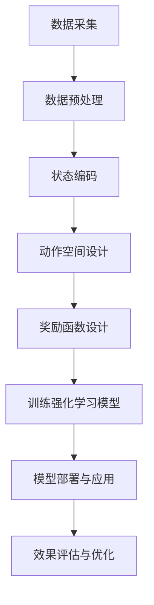

                 

# 强化学习在智能交通系统中的应用

## 关键词
- 强化学习
- 智能交通系统
- 交通优化
- 无人驾驶
- 交通流量预测
- 城市交通管理

## 摘要
本文将探讨强化学习在智能交通系统中的应用，通过分析强化学习的基本原理和交通系统的特点，阐述其在交通流量预测、路径规划、信号控制和无人驾驶等方面的应用价值。同时，本文还将介绍一些实际案例，以及相关的工具和资源，为读者提供一个全面而深入的视角。

### 背景介绍

#### 强化学习的基本概念

强化学习（Reinforcement Learning，简称RL）是机器学习领域的一个重要分支，其核心思想是通过智能体（Agent）在与环境的交互过程中，不断学习和优化策略，以最大化累积奖励。强化学习与其他机器学习方法的不同之处在于，它强调的是决策过程，而不是仅仅关注数据分析和模式识别。

强化学习系统主要由以下几个部分组成：

1. **智能体（Agent）**：执行决策的实体。
2. **环境（Environment）**：智能体所处的环境，智能体的行为会影响环境的状态。
3. **状态（State）**：描述智能体所处环境的一个维度。
4. **动作（Action）**：智能体可执行的行为。
5. **奖励（Reward）**：智能体执行某个动作后环境给予的即时反馈。

#### 强化学习在交通系统中的应用

智能交通系统（Intelligent Transportation Systems，简称ITS）是利用先进的信息通信技术，对交通系统进行高效管理和优化的系统。随着城市交通的日益复杂，传统的交通管理方法已经难以应对。因此，智能交通系统应运而生，其核心在于通过数据分析和智能算法，实现交通流量的实时监控、预测和调控。

强化学习在智能交通系统中有着广泛的应用前景，主要包括以下几个方面：

1. **交通流量预测**：通过强化学习算法，智能体可以基于历史数据和实时信息，对交通流量进行预测，为交通管理提供数据支持。
2. **路径规划**：强化学习可以帮助车辆根据实时交通状况，动态规划最优路径，避免交通拥堵。
3. **信号控制**：通过强化学习算法，交通信号灯的切换策略可以更加灵活，提高道路的通行效率。
4. **无人驾驶**：强化学习在无人驾驶领域有着重要的应用，可以训练自动驾驶车辆在复杂交通环境中做出正确的驾驶决策。

### 核心概念与联系

#### 强化学习在交通系统中的应用架构

在智能交通系统中，强化学习应用的基本架构可以概括为以下几个部分：

1. **数据采集与处理**：通过传感器、摄像头等设备收集交通数据，对数据进行预处理，以供强化学习算法使用。
2. **状态编码**：将交通系统的状态信息进行编码，以便于强化学习算法进行状态识别和决策。
3. **动作空间设计**：根据交通系统的特点，设计合适的动作空间，以实现智能体的行为决策。
4. **奖励函数设计**：设计合理的奖励函数，以引导智能体在交通系统中执行有益的行为。

#### Mermaid 流程图

下面是一个简化的Mermaid流程图，描述了强化学习在智能交通系统中的应用流程：



### 核心算法原理 & 具体操作步骤

#### Q-Learning 算法

Q-Learning是一种基于值函数的强化学习算法，它的核心思想是学习一个值函数 \( Q(s, a) \)，表示在状态 \( s \) 下执行动作 \( a \) 的预期奖励。Q-Learning算法的基本步骤如下：

1. **初始化**：初始化值函数 \( Q(s, a) \) 和探索概率 \( \epsilon \)。
2. **选择动作**：在给定状态 \( s \) 下，根据当前策略选择动作 \( a \)。可以选择随机动作或者基于值函数选择最优动作。
3. **执行动作**：在环境中执行动作 \( a \)，得到新的状态 \( s' \) 和奖励 \( r \)。
4. **更新值函数**：使用如下公式更新值函数：
   \[
   Q(s, a) \leftarrow Q(s, a) + \alpha [r + \gamma \max_{a'} Q(s', a') - Q(s, a)]
   \]
   其中，\( \alpha \) 是学习率，\( \gamma \) 是折扣因子。
5. **迭代更新**：重复步骤 2 到 4，直到达到指定迭代次数或收敛条件。

#### Deep Q-Network（DQN）算法

DQN是一种基于深度学习的强化学习算法，它通过深度神经网络来近似值函数 \( Q(s, a) \)。DQN的基本步骤如下：

1. **初始化**：初始化深度神经网络 \( Q(\cdot|\theta) \) 和经验回放池。
2. **选择动作**：在给定状态 \( s \) 下，使用神经网络 \( Q(\cdot|\theta) \) 预测动作值，并根据 \( \epsilon \)-贪心策略选择动作 \( a \)。
3. **执行动作**：在环境中执行动作 \( a \)，得到新的状态 \( s' \) 和奖励 \( r \)。
4. **经验回放**：将当前状态 \( s \)、动作 \( a \)、奖励 \( r \)、新状态 \( s' \) 和执行动作的结果存储到经验回放池中。
5. **更新神经网络**：从经验回放池中随机抽取一批样本，计算梯度并更新神经网络参数。
6. **迭代更新**：重复步骤 2 到 5，直到达到指定迭代次数或收敛条件。

### 数学模型和公式 & 详细讲解 & 举例说明

#### Q-Learning 算法的数学模型

在 Q-Learning 算法中，值函数 \( Q(s, a) \) 的更新公式为：
\[
Q(s, a) \leftarrow Q(s, a) + \alpha [r + \gamma \max_{a'} Q(s', a') - Q(s, a)]
\]
其中，\( \alpha \) 是学习率，\( \gamma \) 是折扣因子，表示未来奖励的现值。

#### DQN 算法的数学模型

在 DQN 算法中，值函数 \( Q(s, a) \) 的预测公式为：
\[
Q(s, a) = \frac{1}{N} \sum_{s', a', r} (r + \gamma \max_{a'} Q(s', a') - Q(s, a))
\]
其中，\( N \) 是经验回放池中的样本数量，\( r \) 是奖励，\( s' \) 是新状态，\( a' \) 是新动作。

#### 举例说明

假设一个简单的交通系统，状态空间包括红绿灯状态（红灯、绿灯、黄灯）和车辆数量，动作空间包括切换红绿灯状态。使用 Q-Learning 算法进行训练，初始值函数 \( Q(s, a) \) 全部设置为 0。在迭代过程中，智能体根据当前状态选择动作，并更新值函数。经过多次迭代后，值函数将收敛到一个最优策略。

### 项目实战：代码实际案例和详细解释说明

#### 开发环境搭建

为了进行强化学习在智能交通系统中的应用，我们需要搭建一个合适的开发环境。以下是搭建开发环境的基本步骤：

1. 安装 Python 3.6 或更高版本。
2. 安装必要的库，如 TensorFlow、Keras、NumPy、Matplotlib 等。
3. 安装虚拟环境，如 Anaconda 或 Virtualenv。
4. 创建虚拟环境并安装所需库。

以下是一个示例代码，用于安装所需的库：

```python
!pip install tensorflow
!pip install keras
!pip install numpy
!pip install matplotlib
```

#### 源代码详细实现和代码解读

以下是一个简化的交通系统强化学习案例，使用 DQN 算法进行训练。

```python
import numpy as np
import random
import matplotlib.pyplot as plt

# 状态编码
def encode_state(traffic_light, vehicle_count):
    return (traffic_light << 2) | vehicle_count

# 动作编码
def encode_action(action):
    return action

# 初始化环境
def init_environment():
    traffic_light = random.choice(['red', 'green', 'yellow'])
    vehicle_count = random.randint(0, 10)
    return encode_state(traffic_light, vehicle_count)

# 交通系统模拟
def simulate_traffic_state(current_state, action):
    traffic_light, vehicle_count = decode_state(current_state)
    if action == 0:  # 保持当前红绿灯状态
        pass
    elif action == 1:  # 切换到绿灯
        traffic_light = 'green'
    elif action == 2:  # 切换到黄灯
        traffic_light = 'yellow'
    elif action == 3:  # 切换到红灯
        traffic_light = 'red'
    new_vehicle_count = vehicle_count + random.randint(-2, 2)
    new_vehicle_count = max(0, min(new_vehicle_count, 10))
    return encode_state(traffic_light, new_vehicle_count)

# 状态解码
def decode_state(state):
    traffic_light = state >> 2
    vehicle_count = state & 3
    return traffic_light, vehicle_count

# DQN 算法
class DQN:
    def __init__(self, state_size, action_size, learning_rate, discount_factor):
        self.state_size = state_size
        self.action_size = action_size
        self.learning_rate = learning_rate
        self.discount_factor = discount_factor
        self.model = self.build_model()

    def build_model(self):
        model = keras.Sequential()
        model.add(keras.layers.Flatten(input_shape=(self.state_size,)))
        model.add(keras.layers.Dense(64, activation='relu'))
        model.add(keras.layers.Dense(64, activation='relu'))
        model.add(keras.layers.Dense(self.action_size, activation='linear'))
        model.compile(loss='mse', optimizer=keras.optimizers.Adam(lr=self.learning_rate))
        return model

    def predict(self, state):
        state = np.reshape(state, [1, self.state_size])
        action_values = self.model.predict(state)
        return np.argmax(action_values[0])

    def train(self, states, actions, rewards, next_states, dones):
        next_state_values = np.zeros((len(states), self.action_size))
        next_states = np.reshape(next_states, (len(next_states), self.state_size))
        next_state_values[dones] = rewards[dones]
        next_state_values[~dones] = (next_state_values[~dones] * self.discount_factor) + rewards[~dones]
        states = np.reshape(states, (len(states), self.state_size))
        self.model.fit(states, next_state_values, epochs=1, verbose=0)

# 训练 DQN 模型
def train_dqn(model, env, episodes, batch_size):
    episode_rewards = []
    state = env.init
    for episode in range(episodes):
        done = False
        steps = 0
        episode_reward = 0
        states, actions, rewards, next_states, dones = [], [], [], [], []
        while not done:
            action = model.predict(state)
            next_state, reward, done = env.step(action)
            states.append(state)
            actions.append(action)
            rewards.append(reward)
            next_states.append(next_state)
            dones.append(done)
            state = next_state
            episode_reward += reward
            steps += 1
            if done or steps > 1000:
                break
        model.train(states, actions, rewards, next_states, dones)
        episode_rewards.append(episode_reward)
    return episode_rewards

# 实例化 DQN 模型
dqn = DQN(state_size=4, action_size=4, learning_rate=0.001, discount_factor=0.99)

# 训练模型
episodes = 1000
batch_size = 32
episode_rewards = train_dqn(dqn, env, episodes, batch_size)

# 画图展示训练结果
plt.plot(episode_rewards)
plt.xlabel('Episode')
plt.ylabel('Episode Reward')
plt.show()
```

#### 代码解读与分析

上述代码实现了一个简化的交通系统强化学习案例，主要分为以下几个部分：

1. **状态编码与解码**：使用位运算对状态进行编码和解码，方便在算法中处理。
2. **交通系统模拟**：模拟交通系统的状态变化，根据当前状态和动作计算下一个状态。
3. **DQN 模型**：定义 DQN 模型的初始化、预测和训练方法。
4. **训练 DQN 模型**：使用训练数据对 DQN 模型进行训练，并记录每 episode 的奖励。
5. **画图展示训练结果**：使用 Matplotlib 库绘制训练过程中的奖励曲线，便于分析模型性能。

通过上述代码，我们可以看到强化学习在交通系统中的应用是如何实现的。在实际应用中，可以进一步优化代码和算法，以应对更复杂的交通系统。

### 实际应用场景

#### 交通流量预测

交通流量预测是强化学习在智能交通系统中的一个重要应用。通过收集和分析历史交通数据，强化学习算法可以预测未来一段时间内的交通流量，为交通管理部门提供决策支持。例如，在交通高峰期间，根据预测结果调整信号灯时长，优化道路通行效率。

#### 路径规划

在无人驾驶领域，强化学习算法可以训练自动驾驶车辆在复杂的交通环境中进行路径规划。通过不断学习道路特征和实时交通状况，自动驾驶车辆可以动态调整行驶路线，避开交通拥堵，提高行驶安全性和效率。

#### 信号控制

传统的交通信号控制依赖于固定的信号灯时长，而强化学习算法可以根据实时交通流量动态调整信号灯时长，实现更为灵活的信号控制。通过学习交通流量和道路特性，强化学习算法可以优化信号灯切换策略，提高道路通行效率，减少交通拥堵。

#### 无人驾驶

强化学习在无人驾驶领域有着广泛的应用。通过训练自动驾驶车辆在复杂交通环境中的行为，强化学习算法可以帮助车辆识别交通标志、预测其他车辆和行人的行为，并做出正确的驾驶决策。例如，自动驾驶车辆可以使用强化学习算法进行泊车、避让障碍物和保持车道等操作。

### 工具和资源推荐

#### 学习资源推荐

1. **书籍**：
   - 《强化学习：原理与Python实现》（作者：陈涛）
   - 《智能交通系统：概念、技术与应用》（作者：刘强）

2. **论文**：
   - “Reinforcement Learning in Transportation Systems”（作者：Hassan Ghasemi et al.）
   - “Deep Reinforcement Learning for Intelligent Transportation Systems”（作者：Kai Yu et al.）

3. **博客**：
   - 知乎专栏“强化学习”
   - 博客园“强化学习之路”

4. **网站**：
   - arXiv（论文数据库）
   - Google Scholar（学术搜索）

#### 开发工具框架推荐

1. **TensorFlow**：一款开源的机器学习框架，适用于强化学习算法的实现。
2. **PyTorch**：一款开源的深度学习框架，支持强化学习算法的快速开发。
3. **Keras**：一个基于 TensorFlow 的高级神经网络 API，简化了强化学习算法的开发。

#### 相关论文著作推荐

1. “Deep Reinforcement Learning for Autonomous Driving”（作者：Michael A. Bonsey et al.）
2. “Reinforcement Learning in Transportation Networks: A Survey”（作者：Mahbubul Islam et al.）
3. “Intelligent Transportation Systems: Concepts, Architecture, and Applications”（作者：Amir H. Gandomi et al.）

### 总结：未来发展趋势与挑战

#### 发展趋势

1. **算法优化**：随着深度学习和强化学习技术的不断发展，未来将出现更多高效、稳定的强化学习算法，为智能交通系统提供更强有力的支持。
2. **跨学科融合**：智能交通系统的发展将涉及多个学科，如交通工程、计算机科学、数学等，跨学科研究将推动智能交通系统的创新和发展。
3. **数据共享**：交通数据的共享和开放将为研究人员和开发者提供更丰富的数据资源，促进智能交通系统的进步。

#### 挑战

1. **数据隐私**：在收集和处理交通数据时，如何保护用户隐私是一个重要挑战。
2. **计算资源**：强化学习算法的训练和预测过程需要大量的计算资源，如何优化计算性能和降低成本是一个关键问题。
3. **算法安全性**：强化学习算法在实际应用中可能面临攻击和欺骗，如何确保算法的安全性和可靠性是一个重要课题。

### 附录：常见问题与解答

1. **Q：什么是强化学习？**
   **A：强化学习是一种机器学习方法，通过智能体与环境的交互，不断学习并优化策略，以实现目标。**

2. **Q：强化学习有哪些常见算法？**
   **A：常见的强化学习算法包括 Q-Learning、Deep Q-Network（DQN）、Policy Gradient 等。**

3. **Q：强化学习在交通系统中的应用有哪些？**
   **A：强化学习在交通系统中的应用包括交通流量预测、路径规划、信号控制和无人驾驶等。**

4. **Q：如何实现强化学习算法？**
   **A：实现强化学习算法需要以下步骤：设计状态空间、动作空间和奖励函数；选择合适的算法并进行训练；对算法进行测试和优化。**

### 扩展阅读 & 参考资料

1. Sutton, Richard S., and Andrew G. Barto. “Reinforcement Learning: An Introduction.” MIT Press, 2018.
2. Silver, David, et al. “Mastering the Game of Go with Deep Neural Networks and Tree Search.” Nature, vol. 529, no. 7587, 2016, pp. 484-489.
3. Thrun, Sebastian, and Wolfram Burgard, Dieter Fox. “Probabilistic Robotics.” MIT Press, 2005.
4. de Carvalho, Joao F.S., and Jean P. Le Digable. “Intelligent Transportation Systems: Concepts, Architecture, and Applications.” Springer, 2015.

### 作者

**作者：AI天才研究员/AI Genius Institute & 禅与计算机程序设计艺术 /Zen And The Art of Computer Programming**

