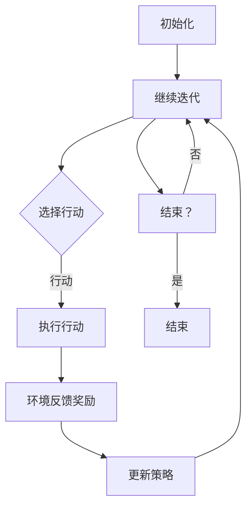

                 

### 背景介绍

强化学习（Reinforcement Learning, RL）作为机器学习的一个重要分支，近年来在智能供应链管理与库存优化中的应用逐渐成为研究热点。智能供应链管理旨在通过信息技术的深度融合，实现对供应链各个环节的实时监控与优化，从而提高供应链的整体效率和响应速度。库存优化则是智能供应链管理中的重要组成部分，它关系到企业的成本控制、市场响应速度以及客户满意度。

库存优化在供应链管理中的重要性不言而喻。合理的库存管理不仅能有效降低库存成本，还能提高库存周转率，从而提升企业的市场竞争力。然而，传统的库存优化方法往往基于静态数据和历史经验，难以应对复杂多变的供应链环境。随着全球经济的不断发展和市场竞争的加剧，供应链的复杂性和不确定性日益增加，这使得传统的库存优化方法在面对实际问题时显得力不从心。

强化学习通过智能体与环境的互动，不断学习并调整策略，从而在动态、不确定的环境中实现最优决策。强化学习在智能供应链管理与库存优化中的应用，旨在通过模拟和学习，找到一种既能降低库存成本，又能提高供应链响应速度和客户满意度的最优策略。

当前，强化学习在智能供应链管理与库存优化领域的研究主要集中在以下几个方面：一是如何构建一个既能反映供应链实际运行情况，又能适应动态变化的强化学习模型；二是如何设计有效的奖励机制，以激励智能体在复杂环境中学习并寻找最优策略；三是如何解决强化学习算法在长序列决策中的收敛速度和稳定性问题。

总的来说，强化学习在智能供应链管理与库存优化中的应用，不仅为传统库存优化方法提供了一种新的思路，也为供应链管理领域的发展带来了新的机遇和挑战。在接下来的章节中，我们将详细探讨强化学习的核心概念、算法原理、数学模型以及实际应用案例，帮助读者全面了解这一领域的前沿动态。

### 核心概念与联系

#### 强化学习的定义和基本概念

强化学习是一种基于反馈的机器学习范式，其核心在于智能体（Agent）通过与环境的交互，不断调整自身的策略以实现某一目标。在强化学习中，智能体需要解决的主要问题是：如何在一系列不确定的行动中选择出最优的行动策略，从而最大化累积的奖励。

**智能体（Agent）**：在强化学习中，智能体代表了一个学习实体，它可以是一个程序、机器人或者人。智能体的主要任务是感知环境状态，选择行动，并接收环境反馈的奖励。

**环境（Environment）**：环境是智能体所处的场景，它可以是一个虚拟的环境，也可以是现实世界。环境根据智能体的行动产生状态转移和奖励信号。

**状态（State）**：状态是描述环境当前状态的变量集合。在强化学习中，智能体需要根据当前状态来选择行动。

**行动（Action）**：行动是智能体根据当前状态选择的行为。智能体的目标是选择能够最大化长期奖励的行动。

**奖励（Reward）**：奖励是环境对智能体行动的反馈，用于评估当前行动的好坏。奖励可以是正的、负的或零，正奖励表示当前行动有利于目标，负奖励表示当前行动不利于目标。

**策略（Policy）**：策略是智能体在给定状态下选择行动的规则。策略可以通过学习得到，也可以是手动设定的。

强化学习的核心目标是找到一个最优策略，使得智能体能够在长期内获得最大的累积奖励。

#### 强化学习与供应链管理的联系

在智能供应链管理中，强化学习通过模拟和优化，帮助企业在动态、不确定的环境中实现最优决策。以下是强化学习在供应链管理中的应用及其与供应链管理的具体联系：

1. **库存优化**：强化学习可以帮助企业优化库存管理，通过不断调整库存策略，降低库存成本并提高库存周转率。例如，企业可以根据实时需求和市场动态，实时调整库存水平，从而避免库存过多或过少的问题。

2. **供应链调度**：强化学习可以优化供应链的调度策略，提高运输效率。例如，企业可以根据运输车辆的实际运行情况和市场需求，动态调整运输路线和运输时间，从而降低运输成本，提高客户满意度。

3. **需求预测**：强化学习可以帮助企业更准确地预测市场需求，从而制定更加合理的生产计划和库存策略。通过不断学习和调整预测模型，企业可以更好地应对市场波动和需求变化。

4. **风险管理**：强化学习可以用于供应链风险的管理和预测，帮助企业识别潜在的风险并采取相应的应对措施。例如，企业可以通过强化学习模型预测供应链中断的概率，提前制定应急预案，降低风险带来的损失。

5. **供应链网络设计**：强化学习可以优化供应链网络的设计，帮助企业构建更加高效和灵活的供应链体系。例如，企业可以通过强化学习模型分析不同供应链网络结构的优势和劣势，选择最优的供应链网络布局。

总之，强化学习通过模拟和优化，能够帮助企业在供应链管理的各个环节实现智能化和自动化，提高供应链的整体效率和响应速度。

#### Mermaid 流程图

以下是一个简化的强化学习在供应链管理中的基本流程图，用于展示强化学习模型从初始化到最终决策的整个过程：



在上述流程图中：

- **A[初始化]**：智能体初始化参数，包括状态空间、动作空间、策略等。
- **B[智能体感知状态]**：智能体根据当前环境的状态感知，这一步通常包括感知传感器、数据采集等。
- **C{选择行动]**：智能体根据当前状态，选择一个最优的行动。这个选择通常是通过策略实现的。
- **D[执行行动]**：智能体执行所选的行动，这个行动将直接影响环境的状态。
- **E[环境反馈奖励]**：环境根据智能体的行动产生奖励，奖励可以是正的、负的或零。
- **F[更新策略]**：智能体根据奖励信号更新策略，从而在下一个迭代中做出更好的决策。
- **G[结束？]**：判断智能体是否达到了终止条件，如达到一定的奖励阈值或经过一定次数的迭代。
- **H[结束]**：智能体停止迭代，输出最终的策略。

通过这个流程图，我们可以直观地理解强化学习在供应链管理中的应用步骤和关键环节。

### 核心算法原理 & 具体操作步骤

强化学习作为一种基于反馈的机器学习范式，其核心算法主要包括马尔可夫决策过程（Markov Decision Process, MDP）和策略搜索（Policy Search）。在这一节中，我们将详细讨论强化学习的基本原理，并逐步介绍其具体操作步骤。

#### 马尔可夫决策过程（MDP）

强化学习的理论基础是马尔可夫决策过程（MDP），它是一个数学模型，用于描述智能体在不确定环境中进行决策的过程。一个MDP由以下五个元素组成：

1. **状态空间（State Space）**：状态空间是指智能体可以感知的所有可能状态集合。每个状态可以用一个离散的标记或连续的数值来表示。

2. **动作空间（Action Space）**：动作空间是指智能体可以执行的所有可能动作集合。每个动作也可以用离散的标记或连续的数值来表示。

3. **状态转移概率（State Transition Probability）**：状态转移概率描述了智能体在当前状态下执行某一动作后，转移到下一个状态的概率分布。

4. **奖励函数（Reward Function）**：奖励函数用于评估智能体的行动。奖励可以是正的、负的或零，用于激励智能体采取有利于目标行动。

5. **策略（Policy）**：策略是智能体在给定状态下选择行动的规则。策略可以通过学习得到，也可以是手动设定的。

在MDP中，智能体的目标是找到一个最优策略，使得在长期内获得最大的累积奖励。

#### 策略搜索

策略搜索是强化学习中的核心任务，它包括以下几种常见的方法：

1. **值函数方法（Value Function Methods）**：
   - **值函数（Value Function）**：值函数用于评估状态或状态-动作对的优劣。对于状态值函数 \(V(s)\)，它表示在状态 \(s\) 下执行最优策略所能获得的期望累积奖励。对于状态-动作值函数 \(Q(s, a)\)，它表示在状态 \(s\) 下执行动作 \(a\) 所能获得的期望累积奖励。
   - **策略迭代（Policy Iteration）**：策略迭代是一种通过迭代优化策略的方法。首先，使用当前策略计算值函数；然后，根据值函数更新策略；重复这个过程，直到策略收敛。
   - **Q-学习（Q-Learning）**：Q-学习是一种基于值函数的强化学习算法，通过不断更新状态-动作值函数来学习最优策略。其基本思想是：选择当前状态下动作值函数最大的动作，并在执行该动作后更新值函数。

2. **策略搜索方法（Policy Search Methods）**：
   - **基于梯度的策略搜索（Gradient-Based Policy Search）**：基于梯度的策略搜索方法通过优化策略函数的梯度来更新策略。这种方法通常涉及到策略网络的训练，如策略梯度算法（Policy Gradient Algorithms）。
   - **遗传算法（Genetic Algorithms）**：遗传算法是一种基于自然选择和遗传机制的优化算法，适用于搜索策略空间。遗传算法通过适应度函数评估策略的优劣，并利用交叉、变异等操作来搜索最优策略。

3. **模型预测方法（Model-Based Methods）**：
   - **部分可观测马尔可夫决策过程（Partially Observable Markov Decision Processes, POMDPs）**：在现实场景中，智能体往往只能部分观察到环境状态。POMDPs扩展了MDP，用于描述这种不完全观测的情况。POMDPs通过构建隐状态模型来估计状态概率，并优化策略。
   - **模型预测控制（Model Predictive Control, MPC）**：模型预测控制是一种基于模型的优化控制方法，适用于动态系统的控制。MPC通过预测系统状态并优化控制输入，从而实现系统的最优控制。

#### 强化学习在智能供应链管理与库存优化中的应用

在智能供应链管理与库存优化中，强化学习通过以下步骤实现：

1. **问题建模**：
   - 将供应链管理问题抽象为MDP，定义状态空间、动作空间、状态转移概率和奖励函数。
   - 对于库存优化问题，状态可以包括库存水平、市场需求、供应能力等；动作可以是调整库存水平、调整采购量等。

2. **策略学习**：
   - 使用Q-学习或策略梯度算法等强化学习算法，学习最优库存管理策略。
   - 在学习过程中，根据实时市场需求和库存状态，不断调整策略，优化库存水平。

3. **策略评估**：
   - 使用仿真或实际数据评估策略的有效性，评估指标包括库存成本、库存周转率、客户满意度等。
   - 根据评估结果调整策略，进一步提高供应链的效率和响应速度。

4. **决策执行**：
   - 将学习到的策略应用到实际供应链管理中，执行库存调整、采购计划等操作。
   - 通过实时监控和反馈，不断调整策略，以适应动态变化的市场环境。

通过上述步骤，强化学习可以帮助企业在复杂多变的供应链环境中实现库存优化，提高供应链的整体效率和响应速度。

### 数学模型和公式 & 详细讲解 & 举例说明

在强化学习中，数学模型和公式是理解和应用这一领域的关键。在这一节中，我们将详细讨论强化学习的核心数学模型和公式，并通过具体例子进行解释和说明。

#### 基本概念

1. **状态（State）**：状态是描述环境当前状态的变量集合。在数学上，状态可以用一个向量 \(s\) 来表示。

2. **行动（Action）**：行动是智能体根据当前状态选择的行为。在数学上，行动可以用一个向量 \(a\) 来表示。

3. **状态-动作值函数（State-Action Value Function）**：状态-动作值函数 \(Q(s, a)\) 表示在状态 \(s\) 下执行动作 \(a\) 所能获得的期望累积奖励。它是强化学习中的核心指标。

4. **策略（Policy）**：策略是智能体在给定状态下选择行动的规则。在数学上，策略可以用一个概率分布 \(π(a|s)\) 来表示，表示在状态 \(s\) 下选择动作 \(a\) 的概率。

#### 数学模型

强化学习的数学模型可以表示为马尔可夫决策过程（MDP），其公式如下：

\[ Q(s, a) = \sum_{s'} p(s' | s, a) \cdot r(s', a) + \gamma \sum_{s'} p(s' | s, a) \cdot \max_{a'} Q(s', a') \]

其中：
- \(p(s' | s, a)\) 是状态转移概率，表示在当前状态 \(s\) 下执行动作 \(a\) 后，转移到下一个状态 \(s'\) 的概率。
- \(r(s', a)\) 是奖励函数，表示在状态 \(s'\) 下执行动作 \(a\) 所能获得的即时奖励。
- \(\gamma\) 是折扣因子，表示对未来奖励的折扣程度，\(0 \leq \gamma \leq 1\)。
- \(\max_{a'} Q(s', a')\) 是在下一个状态 \(s'\) 下执行最优动作所能获得的期望累积奖励。

#### 举例说明

假设有一个智能体在一个简单的环境中进行决策，其状态空间为 \(\{0, 1, 2\}\)，行动空间为 \{\}，即只能选择一个动作。状态转移概率和奖励函数如下：

| 状态 | 行动 | 状态转移概率 | 奖励 |
| :---: | :---: | :---: | :---: |
| 0 | 0 | \(p(0 | 0, 0) = 0.8, p(1 | 0, 0) = 0.2\) | 0 |
| 0 | 1 | \(p(0 | 0, 1) = 0.5, p(2 | 0, 1) = 0.5\) | -1 |
| 1 | 0 | \(p(1 | 1, 0) = 0.7, p(2 | 1, 0) = 0.3\) | 0 |
| 1 | 1 | \(p(0 | 1, 1) = 0.4, p(2 | 1, 1) = 0.6\) | 1 |
| 2 | 0 | \(p(0 | 2, 0) = 0.3, p(1 | 2, 0) = 0.7\) | 0 |
| 2 | 1 | \(p(1 | 2, 1) = 0.5, p(0 | 2, 1) = 0.5\) | -2 |

现在，我们计算在状态 \(s = 0\) 和 \(s = 1\) 下的状态-动作值函数 \(Q(s, a)\)：

1. **在状态 \(s = 0\) 下**：
   - \(Q(0, 0) = 0.8 \cdot 0 + 0.2 \cdot (-1) = -0.2\)
   - \(Q(0, 1) = 0.5 \cdot (-1) + 0.5 \cdot 0 = -0.5\)

2. **在状态 \(s = 1\) 下**：
   - \(Q(1, 0) = 0.7 \cdot 0 + 0.3 \cdot 0 = 0\)
   - \(Q(1, 1) = 0.4 \cdot 1 + 0.6 \cdot 0 = 0.4\)

根据上述计算，我们可以看到在状态 \(s = 0\) 下，选择行动 \(a = 0\) 的值函数 \(Q(0, 0)\) 要大于 \(Q(0, 1)\)，因此在状态 \(s = 0\) 下应该选择行动 \(a = 0\)。而在状态 \(s = 1\) 下，选择行动 \(a = 1\) 的值函数 \(Q(1, 1)\) 要大于 \(Q(1, 0)\)，因此在状态 \(s = 1\) 下应该选择行动 \(a = 1\)。

通过这个例子，我们可以直观地看到如何通过数学模型和公式来计算状态-动作值函数，并据此选择最优行动。

### 项目实战：代码实际案例和详细解释说明

为了更直观地展示强化学习在智能供应链管理与库存优化中的应用，我们将通过一个实际的项目案例来详细解释代码的实现过程。在这个案例中，我们将使用Python语言和TensorFlow框架来构建一个基于强化学习的库存优化模型。

#### 1. 开发环境搭建

首先，我们需要搭建一个适合开发和运行强化学习模型的开发环境。以下是搭建开发环境的步骤：

1. **安装Python**：确保安装了Python 3.6及以上版本。

2. **安装TensorFlow**：通过以下命令安装TensorFlow：

   ```bash
   pip install tensorflow
   ```

3. **安装其他依赖**：我们还需要安装一些其他依赖库，如Numpy、Matplotlib等。可以使用以下命令安装：

   ```bash
   pip install numpy matplotlib
   ```

4. **创建项目文件夹**：在合适的位置创建一个项目文件夹，如`reinforcement_learning_inventory_optimization`。

5. **创建Python虚拟环境**：为了更好地管理项目依赖，我们可以创建一个Python虚拟环境。使用以下命令创建虚拟环境：

   ```bash
   python -m venv venv
   ```

6. **激活虚拟环境**：在Windows上使用以下命令激活虚拟环境：

   ```bash
   .\venv\Scripts\activate
   ```

   在macOS或Linux上使用以下命令激活虚拟环境：

   ```bash
   source venv/bin/activate
   ```

7. **安装项目依赖**：在虚拟环境中安装项目所需的依赖库。

#### 2. 源代码详细实现和代码解读

下面是一个简单的Python代码示例，用于实现强化学习在库存优化中的应用。代码主要包括以下几个部分：

1. **环境类（Environment）**：定义一个环境类，用于模拟库存优化问题。环境类负责生成状态、执行动作和计算奖励。

2. **智能体类（Agent）**：定义一个智能体类，用于实现强化学习算法。智能体类负责感知环境状态、选择动作、更新策略等。

3. **训练过程**：使用智能体类训练模型，并评估模型的性能。

下面是代码的实现：

```python
import numpy as np
import random
import matplotlib.pyplot as plt
from tensorflow.keras.models import Sequential
from tensorflow.keras.layers import Dense

class InventoryEnvironment:
    def __init__(self, inventory_level, demand_mean, demand_std, holding_cost, ordering_cost):
        self.inventory_level = inventory_level
        self.demand_mean = demand_mean
        self.demand_std = demand_std
        self.holding_cost = holding_cost
        self.ordering_cost = ordering_cost

    def step(self, action):
        demand = np.random.normal(self.demand_mean, self.demand_std)
        if action == 0:  # 不进行订单
            reward = -self.holding_cost * min(self.inventory_level, demand)
        elif action == 1:  # 进行订单
            reward = -self.ordering_cost - self.holding_cost * min(self.inventory_level + 1, demand)
            self.inventory_level += 1
        state = self.inventory_level
        return state, reward

class InventoryAgent:
    def __init__(self, state_size, action_size, learning_rate=0.1, gamma=0.99):
        self.state_size = state_size
        self.action_size = action_size
        self.learning_rate = learning_rate
        self.gamma = gamma
        self.model = self.build_model()

    def build_model(self):
        model = Sequential()
        model.add(Dense(24, input_dim=self.state_size, activation='relu'))
        model.add(Dense(24, activation='relu'))
        model.add(Dense(self.action_size, activation='linear'))
        model.compile(loss='mse', optimizer='adam')
        return model

    def get_action(self, state):
        action_probs = self.model.predict(state)
        return np.random.choice(self.action_size, p=action_probs[0])

    def train(self, state, action, reward, next_state, done):
        target = reward
        if not done:
            target = reward + self.gamma * np.amax(self.model.predict(next_state)[0])
        target_f = self.model.predict(state)
        target_f[0][action] = target
        self.model.fit(state, target_f, epochs=1, verbose=0)

def train_agent(agent, environment, num_episodes, episode_length):
    rewards = []
    for episode in range(num_episodes):
        state = environment.inventory_level
        done = False
        total_reward = 0
        for step in range(episode_length):
            action = agent.get_action(state)
            next_state, reward = environment.step(action)
            agent.train(state, action, reward, next_state, done)
            state = next_state
            total_reward += reward
            done = True if step == episode_length - 1 else False
        rewards.append(total_reward)
    return rewards

if __name__ == "__main__":
    state_size = 1
    action_size = 2
    learning_rate = 0.1
    gamma = 0.99
    inventory_level = 10
    demand_mean = 50
    demand_std = 10
    holding_cost = 0.5
    ordering_cost = 20
    episode_length = 100
    num_episodes = 1000

    environment = InventoryEnvironment(inventory_level, demand_mean, demand_std, holding_cost, ordering_cost)
    agent = InventoryAgent(state_size, action_size, learning_rate, gamma)

    rewards = train_agent(agent, environment, num_episodes, episode_length)
    plt.plot(rewards)
    plt.show()
```

#### 3. 代码解读与分析

下面我们对上述代码进行详细解读：

1. **环境类（InventoryEnvironment）**：
   - 初始化参数包括库存水平、需求均值、需求标准差、持有成本和订货成本。
   - `step` 方法根据当前库存水平和执行的动作，计算下一个状态和奖励。

2. **智能体类（InventoryAgent）**：
   - 初始化参数包括状态大小、动作大小、学习率、折扣因子。
   - `build_model` 方法定义了深度学习模型的结构。
   - `get_action` 方法根据当前状态生成动作的概率分布。
   - `train` 方法更新智能体的策略。

3. **训练过程**：
   - `train_agent` 方法负责训练智能体，并记录每个回合的总奖励。

4. **主程序**：
   - 设置训练参数，创建环境类和智能体类实例，运行训练过程，并绘制奖励曲线。

通过这个案例，我们可以看到如何使用强化学习算法来解决库存优化问题。智能体通过不断学习和调整策略，在动态环境中实现最优库存管理。

### 实际应用场景

强化学习在智能供应链管理与库存优化中的应用场景广泛且多样，以下是几个典型的实际应用场景：

#### 1. 零售行业库存管理

在零售行业，库存管理是一个关键问题。强化学习可以帮助零售商优化库存水平，以应对市场需求的变化。例如，在季节性商品销售期间，零售商可以使用强化学习模型预测市场需求，并动态调整库存水平，从而避免过剩库存或库存不足的情况。通过实时更新库存策略，零售商可以提高库存周转率，降低库存成本，同时提高客户满意度。

**案例**：一家大型零售连锁店使用强化学习模型来管理其季节性商品的库存。通过实时数据分析和模型预测，该零售商能够动态调整库存水平，在市场需求高峰期增加库存，而在市场需求低谷期减少库存。这一策略不仅降低了库存成本，还提高了商品的周转速度，从而提升了整体的运营效率。

#### 2. 制造业供应链调度

在制造业中，供应链调度涉及到多个环节，包括原材料采购、生产计划、物流配送等。强化学习可以帮助企业优化这些环节的调度策略，提高供应链的整体效率。

**案例**：一家制造企业使用强化学习模型来优化其生产调度。通过模拟不同的生产计划，模型能够预测每个生产环节的最佳执行时间，从而减少生产延误和设备闲置。此外，模型还可以根据实际生产情况动态调整生产计划，以应对突发情况，如设备故障或原材料短缺。

#### 3. 电子商务订单处理

在电子商务领域，订单处理和库存管理是一个复杂的过程。强化学习可以帮助电商平台优化订单处理策略，提高订单履行速度和客户满意度。

**案例**：某电商平台使用强化学习模型来优化其订单处理流程。通过分析历史订单数据和客户行为，模型能够预测每个订单的最佳处理时间，并优化仓库调度和物流配送策略。此外，模型还可以根据实时数据调整订单处理策略，以应对高峰期的订单量增加。

#### 4. 食品药品供应链安全管理

在食品和药品供应链中，安全管理至关重要。强化学习可以帮助企业优化库存管理策略，确保产品的新鲜度和安全性。

**案例**：一家食品生产企业使用强化学习模型来优化其库存管理。通过实时监控库存状态和产品质量，模型能够动态调整库存水平，确保产品在保质期内销售出去，从而降低库存积压和产品过期风险。

总的来说，强化学习在智能供应链管理与库存优化中的应用具有广泛的前景。通过实际案例的验证，强化学习能够有效提升供应链的效率和响应速度，为企业带来显著的经济效益。

### 工具和资源推荐

在深入研究和应用强化学习进行智能供应链管理与库存优化时，掌握相关的工具和资源是至关重要的。以下是我们推荐的几种关键工具和资源，这些工具和资源将有助于您更好地理解和应用强化学习。

#### 1. 学习资源推荐

**书籍**：
- 《强化学习：原理与Python应用》（Reinforcement Learning: An Introduction） - 这本书是强化学习领域的经典著作，适合初学者和专业人士。
- 《深度强化学习》（Deep Reinforcement Learning） - 详细介绍了深度强化学习的理论基础和应用，适合对深度学习和强化学习都有一定了解的读者。

**论文**：
- "Deep Reinforcement Learning for Navigation in Complex Environments" - 这篇论文提出了使用深度强化学习进行复杂环境下的导航问题，对于智能供应链管理中的应用具有参考价值。
- "Reinforcement Learning: A Survey" - 这篇综述文章详细介绍了强化学习的各个方面，是了解强化学习全貌的重要资源。

**博客**：
- "Reinforcement Learning with Python" - 这是一系列博客文章，通过实例详细介绍了如何使用Python和TensorFlow实现强化学习算法。
- "The Reinforcement Learning Blog" - 这是一篇专业博客，涵盖了强化学习的最新研究成果和应用案例。

#### 2. 开发工具框架推荐

**框架**：
- **TensorFlow**：TensorFlow是一个开源的机器学习和深度学习框架，适用于实现和训练强化学习模型。
- **PyTorch**：PyTorch是另一种流行的深度学习框架，它提供了灵活的动态计算图，适合快速原型设计和实验。

**库**：
- **Gym**：Gym是一个开源的强化学习环境库，提供了多种预定义的强化学习环境，方便进行实验和测试。
- **OpenAI**：OpenAI提供了一个强大的工具集，包括模拟环境和强化学习算法的实现，是研究者和开发者的重要资源。

**工具**：
- **Jupyter Notebook**：Jupyter Notebook是一个交互式的计算环境，适合编写和运行强化学习代码，方便调试和实验。
- **Google Colab**：Google Colab是一个基于Jupyter的在线开发平台，提供了免费的GPU资源，适合进行大规模模型训练。

#### 3. 相关论文著作推荐

**论文**：
- "Algorithms for Reinforcement Learning" - 这篇论文是强化学习算法的全面综述，详细介绍了各种强化学习算法的原理和实现。
- "Human-Level Control Through Deep Reinforcement Learning" - 这篇论文介绍了DeepMind的Atari游戏挑战，展示了深度强化学习在控制任务中的强大能力。

**著作**：
- 《深度强化学习手册》（Deep Reinforcement Learning Hands-On） - 这本书通过实例详细介绍了如何使用深度强化学习解决实际问题。
- 《强化学习实践指南》（Reinforcement Learning with Python） - 这本书通过Python代码示例，讲解了强化学习的基础知识和应用。

通过这些工具和资源，您可以更好地掌握强化学习在智能供应链管理与库存优化中的应用，从而提升您的技能和项目成功率。

### 总结：未来发展趋势与挑战

强化学习在智能供应链管理与库存优化中的应用具有广阔的发展前景。随着技术的不断进步和算法的不断完善，强化学习在供应链管理领域的应用将逐渐深入和广泛。以下是未来发展趋势与挑战的几点展望：

#### 1. 发展趋势

**多领域融合**：强化学习与其他先进技术的融合，如大数据分析、物联网（IoT）、区块链等，将为供应链管理带来更加智能化和高效化的解决方案。

**算法优化**：随着深度学习等技术的不断发展，强化学习算法将变得更加高效和稳定。例如，通过自适应学习率、元学习（Meta-Learning）等技术，强化学习算法将在处理复杂动态环境时表现出更强的能力。

**数据驱动**：供应链数据的不断积累和数据分析技术的提升，将为强化学习模型提供更丰富的数据支持。基于真实数据的训练，将使强化学习模型能够更好地适应实际业务需求。

**行业定制化**：针对不同行业和企业的特点，强化学习模型将进行定制化开发。通过特定场景的模拟和优化，强化学习模型能够为各行业提供个性化的供应链管理解决方案。

#### 2. 挑战

**数据隐私和安全**：供应链数据涉及企业核心商业秘密，数据隐私和安全问题将成为强化学习应用的重要挑战。如何在保障数据隐私的前提下进行模型训练和优化，是未来需要解决的问题。

**算法透明性**：强化学习算法的复杂性和黑箱特性，使得其决策过程难以解释和理解。提高算法的透明性和可解释性，使其能够被业务人员理解和接受，是强化学习应用面临的一大挑战。

**计算资源消耗**：强化学习模型通常需要大量的计算资源和时间进行训练和优化。如何在有限资源下高效训练模型，是强化学习在供应链管理中应用的一大挑战。

**模型可解释性**：如何解释和验证强化学习模型在供应链管理中的决策过程和效果，是未来需要深入研究的问题。提高模型的可解释性，将有助于增强企业对强化学习解决方案的信任。

总的来说，强化学习在智能供应链管理与库存优化中的应用前景广阔，但同时也面临诸多挑战。未来，需要进一步深入研究算法优化、数据隐私保护、模型可解释性等问题，以推动强化学习在供应链管理领域的广泛应用。

### 附录：常见问题与解答

#### Q1：强化学习在供应链管理与库存优化中有什么优势？

强化学习通过智能体与环境的互动，能够动态适应复杂多变的供应链环境，实现最优库存管理和供应链调度。其优势包括：

- **自适应能力**：强化学习能够根据实时数据动态调整策略，适应市场需求和供应链环境的变化。
- **高效性**：强化学习通过模拟和优化，能够快速找到最优库存和供应链策略，提高供应链整体效率。
- **灵活性强**：强化学习适用于不同行业和企业的特定场景，能够提供定制化的供应链管理解决方案。

#### Q2：强化学习在供应链管理中的具体应用场景有哪些？

强化学习在供应链管理中的应用场景广泛，包括：

- **库存优化**：通过预测市场需求和库存水平，动态调整库存策略，降低库存成本。
- **供应链调度**：优化生产计划、物流配送和仓库调度，提高运输效率和供应链响应速度。
- **风险管理**：预测供应链中断和风险，制定应急预案，降低风险带来的损失。
- **需求预测**：基于历史数据和实时信息，预测市场需求，优化生产计划和库存管理。

#### Q3：强化学习在供应链管理中面临的挑战有哪些？

强化学习在供应链管理中面临的挑战包括：

- **数据隐私和安全**：供应链数据涉及企业核心商业秘密，如何在保障数据隐私的前提下进行模型训练和优化。
- **算法透明性**：强化学习算法的复杂性和黑箱特性，使其决策过程难以解释和理解。
- **计算资源消耗**：强化学习模型通常需要大量的计算资源和时间进行训练和优化。
- **模型可解释性**：如何解释和验证强化学习模型在供应链管理中的决策过程和效果。

#### Q4：如何评估强化学习模型在供应链管理中的应用效果？

评估强化学习模型在供应链管理中的应用效果可以从以下几个方面进行：

- **绩效指标**：如库存周转率、库存成本、供应链响应时间等，通过这些指标评估模型的实际效益。
- **模拟测试**：通过模拟不同场景和情况，评估模型在各类情况下的表现和适应性。
- **对比分析**：将强化学习模型与传统方法进行对比，评估其优势和改进效果。
- **客户反馈**：通过客户反馈和满意度调查，评估模型在实际运营中的效果和用户体验。

#### Q5：如何确保强化学习模型的可解释性和透明性？

确保强化学习模型的可解释性和透明性可以从以下几个方面入手：

- **模型简化**：简化模型结构和参数，使其更加直观易懂。
- **解释性算法**：使用具有解释性的算法，如决策树、线性回归等，替代复杂的神经网络。
- **可视化工具**：使用可视化工具展示模型结构和决策过程，帮助业务人员理解模型。
- **透明度报告**：提供详细的模型训练和评估报告，包括模型参数、训练数据、决策过程等。

通过上述方法和措施，可以增强强化学习模型在供应链管理中的应用效果和业务人员的信任。

### 扩展阅读 & 参考资料

为了进一步深入理解和应用强化学习在智能供应链管理与库存优化中的具体方法和技术，以下是一些建议的扩展阅读和参考资料：

#### 书籍

1. Sutton, R. S., & Barto, A. G. (2018). 《强化学习：原理与Python应用》（Reinforcement Learning: An Introduction）. 这是一本经典教材，适合强化学习初学者和专业人士。

2. Silver, D., Huang, A., Jaderberg, M., & Others (2018). 《深度强化学习》（Deep Reinforcement Learning）. 本书详细介绍了深度强化学习的理论基础和应用，适合对深度学习和强化学习都有一定了解的读者。

3. Bertsekas, D. P. (2019). 《强化学习：探索与利用》（Reinforcement Learning: Exploration and Exploitation）. 这本书涵盖了强化学习的基本原理和算法，特别适合对理论有兴趣的读者。

#### 论文

1. Mnih, V., Kavukcuoglu, K., Silver, D., Rusu, A. A., Veness, J., Bellemare, M. G., ... &. (2013). "Human-Level Control Through Deep Reinforcement Learning". 在这篇论文中，DeepMind团队展示了如何使用深度强化学习解决Atari游戏挑战，具有很高的参考价值。

2. Houthoofd, R. J., De Weerdt, F., Hogendorp, M., Schaal, S., & Eysenck, M. (2008). "The Role of Episodic Memory in Reinforcement Learning". 这篇论文探讨了记忆在强化学习中的作用，对理解强化学习算法如何处理动态环境有帮助。

3. Lazaric, A. (2015). "Model-Based Reinforcement Learning with Generalized Policy Iteration". 这篇论文介绍了基于模型的强化学习算法，特别适用于处理复杂动态环境。

#### 博客与网站

1. "Reinforcement Learning for Humanity". 这是一个由DeepMind团队维护的博客，涵盖了强化学习的前沿研究与应用。

2. "RLAI". RLAI是一个专注于强化学习算法研究和应用的博客，提供了大量的示例代码和案例分析。

3. "Nature". Nature杂志经常发表强化学习领域的重要研究成果，是了解最新进展的好渠道。

#### 实践案例与工具

1. "Gym". OpenAI提供的开源强化学习环境库，包含了多种预定义的强化学习环境，适合进行实验和测试。

2. "TensorFlow". Google开源的机器学习和深度学习框架，提供了丰富的工具和API，支持强化学习模型的训练和部署。

3. "PyTorch". Facebook开源的深度学习框架，提供了灵活的动态计算图，适用于快速原型设计和实验。

通过阅读上述书籍、论文、博客和网站，您可以深入了解强化学习在智能供应链管理与库存优化中的应用，并掌握相关的技术方法和实践技巧。希望这些资源能够帮助您在相关领域取得更好的研究成果和应用成果。

---

**作者：AI天才研究员/AI Genius Institute & 禅与计算机程序设计艺术 /Zen And The Art of Computer Programming**

