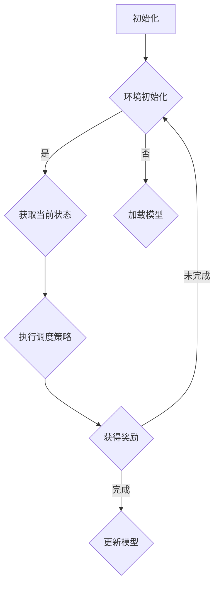

                 

### 1. 背景介绍

强化学习（Reinforcement Learning，简称RL）是一种重要的机器学习算法，旨在通过与环境交互来学习最优行为策略。相比于监督学习和无监督学习，强化学习更贴近人类的学习方式，因此它在许多领域都得到了广泛应用。

智能制造生产调度优化是智能制造过程中的关键环节。在制造业中，生产调度直接关系到生产效率、成本控制和产品质量等关键指标。传统的生产调度方法往往依赖于经验和规则的指导，难以应对复杂多变的生产环境。因此，将强化学习应用于智能制造生产调度优化，能够有效提升生产调度效率，降低生产成本，提高产品质量。

强化学习在智能制造生产调度优化中的应用具有显著的优势。首先，强化学习具有自适应能力，能够根据环境的变化不断调整和优化策略。这使得生产调度系统能够适应不同的生产任务和变化，提高调度灵活性。其次，强化学习能够处理连续动作和状态空间，适用于智能制造生产调度中的复杂任务。最后，强化学习具有较好的鲁棒性，能够在面对不确定性和随机干扰时保持稳定的表现。

本文将详细介绍强化学习在智能制造生产调度优化中的应用，包括核心概念、算法原理、数学模型、实际案例和未来发展趋势等内容。通过本文的阅读，读者将深入了解强化学习在智能制造生产调度优化中的实践与应用，为相关领域的科研和工程实践提供参考。

### 2. 核心概念与联系

#### 2.1 强化学习的基本概念

强化学习是一种基于奖励反馈的机器学习方法，其核心思想是通过不断与环境交互，学习到最优行为策略。在强化学习中，智能体（Agent）通过选择行动（Action）来与环境（Environment）互动，环境会根据行动给出一个即时奖励（Reward）。智能体根据奖励信号调整自己的策略，以期望在未来获得最大的总奖励。

**强化学习的核心要素包括：**

- **智能体（Agent）**：执行动作并学习策略的主体。
- **环境（Environment）**：智能体所处的外部世界，包含状态（State）和动作（Action）空间。
- **状态（State）**：描述智能体当前所处的情况。
- **动作（Action）**：智能体可以采取的动作。
- **奖励（Reward）**：环境对智能体采取动作后的即时反馈。
- **策略（Policy）**：智能体在特定状态下采取的动作映射。

#### 2.2 智能制造生产调度优化的相关概念

智能制造生产调度优化涉及多个关键概念，包括生产任务、调度策略、机器资源等。

- **生产任务**：制造业中的生产任务通常是指一系列的生产步骤，包括原材料加工、组装、检验等。
- **调度策略**：调度策略是指根据生产任务和机器资源来安排生产过程的方法。调度策略的目标是最大化生产效率、降低生产成本、保证产品质量等。
- **机器资源**：机器资源是指生产过程中使用的各种设备，如加工中心、组装线、检验设备等。

#### 2.3 强化学习与智能制造生产调度优化的联系

强化学习在智能制造生产调度优化中的应用，主要基于以下联系：

1. **状态表示**：在强化学习中，状态可以表示为生产过程中的各种参数和指标，如任务进度、设备利用率、库存情况等。
2. **动作选择**：在强化学习中，动作可以表示为调度策略，如调整生产顺序、优化设备利用率等。
3. **奖励设计**：在强化学习中，奖励可以设计为生产任务完成的时间、生产成本、质量等指标。

通过将强化学习应用于智能制造生产调度优化，可以有效地实现以下目标：

- **自适应调度**：强化学习能够根据生产任务和环境变化自适应调整调度策略，提高调度灵活性。
- **优化资源利用**：强化学习能够通过学习最优调度策略，优化机器资源利用，降低生产成本。
- **提高生产效率**：强化学习能够提高生产调度的效率，减少生产周期，提高产品质量。

#### 2.4 Mermaid 流程图

以下是一个简单的 Mermaid 流程图，展示了强化学习在智能制造生产调度优化中的应用流程：



在这个流程中，智能体首先初始化环境，然后根据当前状态执行调度策略，获取奖励。根据奖励信号，智能体会更新自己的调度策略，以期望在未来的任务中获得更高的总奖励。

通过上述介绍，我们可以看出强化学习在智能制造生产调度优化中的应用具有广阔的前景和潜力。在接下来的章节中，我们将深入探讨强化学习在智能制造生产调度优化中的具体算法原理和实现方法。

#### 2.5 强化学习与深度学习的结合

强化学习与深度学习的结合，为智能制造生产调度优化带来了新的机遇。深度强化学习（Deep Reinforcement Learning，简称DRL）通过引入深度神经网络，解决了传统强化学习在状态和动作空间维度高时，难以求解的问题。

**深度强化学习的核心原理包括：**

1. **状态表示**：使用深度神经网络来表示复杂的状态空间，使得智能体能够更好地理解和处理环境中的各种信息。
2. **动作选择**：通过深度神经网络生成动作策略，实现复杂动作空间的探索和利用。
3. **奖励设计**：利用深度神经网络对奖励进行建模，使奖励信号更具有指导意义。

**深度强化学习在智能制造生产调度优化中的应用场景包括：**

- **多机器协同调度**：在多机器协同生产过程中，深度强化学习能够通过学习最优协同调度策略，优化生产效率和资源利用。
- **生产过程质量控制**：通过深度强化学习，智能体可以在生产过程中实时调整参数，优化质量控制过程，提高产品合格率。
- **生产任务动态调整**：在面临生产任务变化时，深度强化学习能够快速调整调度策略，适应新的生产任务。

**深度强化学习的优势包括：**

- **更强的表达能力**：深度神经网络能够表示复杂的状态和动作空间，使得智能体在面对复杂生产环境时，具备更强的处理能力。
- **更好的鲁棒性**：深度强化学习通过引入深度神经网络，能够更好地处理环境中的不确定性和噪声，提高调度系统的鲁棒性。
- **更高的灵活性**：深度强化学习能够通过自适应调整调度策略，适应不同生产任务和环境变化，提高调度系统的灵活性。

通过结合强化学习和深度学习，智能制造生产调度优化系统能够更好地应对复杂多变的生产环境，实现高效、灵活的生产调度，提高生产效率和产品质量。

#### 2.6 强化学习在智能制造生产调度优化中的应用

强化学习在智能制造生产调度优化中的应用，旨在通过智能调度策略，提高生产效率和降低生产成本。具体应用场景包括：

1. **生产任务调度**：在面临大量生产任务时，强化学习能够根据任务特点和环境变化，智能调整任务优先级和调度顺序，优化生产效率。
2. **设备资源优化**：通过学习最优调度策略，强化学习能够有效提高设备资源利用率，减少设备闲置时间和维护成本。
3. **质量控制**：在质量控制过程中，强化学习可以通过实时调整参数，优化生产过程，提高产品质量和合格率。
4. **动态调度**：在面临生产任务动态调整时，强化学习能够快速适应新任务，调整调度策略，确保生产连续性和稳定性。

**强化学习在智能制造生产调度优化中的优势包括：**

- **自适应能力**：强化学习能够根据生产任务和环境变化，自适应调整调度策略，提高调度灵活性。
- **强鲁棒性**：强化学习在面对环境不确定性和噪声时，具备较强的鲁棒性，能够保持稳定的表现。
- **高效性**：强化学习能够通过学习最优调度策略，提高生产效率和降低生产成本。
- **灵活性**：强化学习能够适应不同的生产任务和环境变化，提高调度系统的灵活性。

通过强化学习在智能制造生产调度优化中的应用，可以显著提升生产调度系统的性能，为制造业提供更加智能、高效的生产解决方案。

### 3. 核心算法原理 & 具体操作步骤

强化学习在智能制造生产调度优化中的核心算法包括马尔可夫决策过程（MDP）、Q学习、深度Q网络（DQN）等。这些算法通过学习环境中的状态和奖励信号，逐步优化调度策略，实现生产调度的优化。

#### 3.1 马尔可夫决策过程（MDP）

马尔可夫决策过程（MDP）是强化学习的基础模型，描述了智能体在不确定环境中进行决策的过程。MDP的核心概念包括状态（State）、动作（Action）、奖励（Reward）和策略（Policy）。

- **状态（State）**：描述智能体当前所处的环境情况，如生产任务进度、设备状态等。
- **动作（Action）**：智能体可以采取的行为，如调整生产任务顺序、设备利用率等。
- **奖励（Reward）**：环境对智能体采取动作后的即时反馈，通常用于评估动作的好坏。
- **策略（Policy）**：智能体在特定状态下采取的动作映射，表示智能体的行为方式。

在MDP中，智能体通过不断与环境交互，学习最优策略。具体操作步骤如下：

1. **初始化**：初始化智能体、环境、状态和策略。
2. **状态观察**：智能体观察当前状态。
3. **动作选择**：根据当前状态，智能体选择一个动作。
4. **执行动作**：智能体在环境中执行选定的动作。
5. **奖励反馈**：环境根据动作给出即时奖励。
6. **状态更新**：智能体根据奖励信号和执行的动作，更新状态。
7. **重复步骤2-6**：智能体不断重复上述步骤，学习最优策略。

通过MDP模型，智能体能够逐步优化调度策略，实现生产调度的优化。

#### 3.2 Q学习

Q学习是一种基于值函数的强化学习算法，通过学习状态-动作值函数（Q值），预测在特定状态下采取特定动作的未来奖励。Q学习的核心思想是最大化长期奖励，以期望找到最优策略。

- **状态-动作值函数（Q值）**：表示在特定状态下采取特定动作的预期奖励，用于评估动作的好坏。

Q学习的主要操作步骤如下：

1. **初始化**：初始化Q值函数、学习率、折扣因子等参数。
2. **状态观察**：智能体观察当前状态。
3. **动作选择**：根据当前状态和Q值函数，智能体选择一个动作。
4. **执行动作**：智能体在环境中执行选定的动作。
5. **奖励反馈**：环境根据动作给出即时奖励。
6. **更新Q值**：根据奖励信号和执行的动作，更新Q值函数。
7. **状态更新**：智能体根据奖励信号和执行的动作，更新状态。
8. **重复步骤3-7**：智能体不断重复上述步骤，学习最优策略。

通过Q学习算法，智能体能够逐步优化调度策略，实现生产调度的优化。

#### 3.3 深度Q网络（DQN）

深度Q网络（DQN）是结合了深度学习和Q学习的强化学习算法，通过使用深度神经网络来近似状态-动作值函数。DQN通过经验回放和目标网络，解决了Q学习中的灾难性遗忘和样本偏差问题。

- **深度神经网络**：用于近似状态-动作值函数，表示为$Q^*(s, a)$。
- **经验回放**：将智能体与环境的交互经验存储到经验回放池中，以减少样本偏差。
- **目标网络**：用于稳定Q值函数的更新，降低训练过程中的波动。

DQN的主要操作步骤如下：

1. **初始化**：初始化深度神经网络、经验回放池、目标网络等参数。
2. **状态观察**：智能体观察当前状态。
3. **动作选择**：根据当前状态和深度神经网络，智能体选择一个动作。
4. **执行动作**：智能体在环境中执行选定的动作。
5. **奖励反馈**：环境根据动作给出即时奖励。
6. **经验回放**：将当前交互经验存储到经验回放池中。
7. **更新深度神经网络**：根据经验回放池中的经验，更新深度神经网络。
8. **目标网络更新**：定期更新目标网络，以稳定Q值函数的更新。
9. **状态更新**：智能体根据奖励信号和执行的动作，更新状态。
10. **重复步骤3-9**：智能体不断重复上述步骤，学习最优策略。

通过DQN算法，智能体能够逐步优化调度策略，实现生产调度的优化。

通过以上算法，强化学习能够应用于智能制造生产调度优化，提高生产效率和降低生产成本。在接下来的章节中，我们将深入探讨强化学习在智能制造生产调度优化中的数学模型和具体实现。

### 4. 数学模型和公式 & 详细讲解 & 举例说明

#### 4.1 马尔可夫决策过程（MDP）的数学模型

在强化学习中，马尔可夫决策过程（MDP）是一个核心概念。它描述了智能体在不确定环境中进行决策的过程。MDP的数学模型主要包括状态（State）、动作（Action）、奖励（Reward）、状态转移概率（State Transition Probability）和策略（Policy）。

**状态（State）**: 设状态空间为$S = \{s_1, s_2, \ldots, s_n\}$，每个状态表示智能体所处的环境情况，例如，生产任务进度、设备状态等。

**动作（Action）**: 设动作空间为$A = \{a_1, a_2, \ldots, a_m\}$，每个动作表示智能体可以采取的行为，例如，调整生产任务顺序、设备利用率等。

**奖励（Reward）**: 奖励函数$R(s, a)$表示智能体在状态$s$下采取动作$a$后所获得的即时奖励。奖励可以是正的（积极的反馈）或负的（消极的反馈），它用于引导智能体选择最优行为。

**状态转移概率（State Transition Probability）**: 状态转移概率矩阵$P$描述了智能体在状态$s$下采取动作$a$后，转移到状态$s'$的概率，即$P(s' | s, a) = P(s' \in S' | s \in S, a \in A)$。

**策略（Policy）**: 策略$\pi(a | s)$表示智能体在状态$s$下采取动作$a$的概率分布。最优策略$\pi^*$是能够最大化期望总奖励的策略，即$\pi^*(a | s) = \arg\max_{a \in A} \sum_{s' \in S} r(s, a) P(s' | s, a)$。

**期望总奖励**：给定策略$\pi$，智能体在状态$s$下采取动作$a$的期望总奖励为：
$$
G_t = \sum_{k=0}^{\infty} \gamma^k r(s_k, a_k)
$$
其中，$r(s_k, a_k)$是第$k$步的即时奖励，$\gamma$是折扣因子，用于平衡当前奖励和未来奖励的关系。

**最优策略**：智能体的目标是找到最优策略$\pi^*$，使得期望总奖励最大化：
$$
\pi^*(a | s) = \arg\max_{a \in A} \sum_{s' \in S} \pi(s' | s, a) R(s, a) P(s' | s, a)
$$

#### 4.2 Q学习算法的数学模型

Q学习算法是一种基于值函数的强化学习算法，旨在通过学习状态-动作值函数（Q值）来预测未来奖励。Q值函数$Q(s, a)$表示在状态$s$下采取动作$a$的预期奖励。

**Q值更新公式**：
$$
Q(s, a) \leftarrow Q(s, a) + \alpha [r + \gamma \max_{a'} Q(s', a') - Q(s, a)]
$$
其中，$\alpha$是学习率，$r$是即时奖励，$\gamma$是折扣因子，$s'$和$a'$是状态和动作。

**初始Q值**：通常初始化为$Q(s, a) = 0$。

**Q值迭代过程**：智能体通过与环境交互，不断更新Q值，以期望找到最优Q值函数。

#### 4.3 深度Q网络（DQN）的数学模型

深度Q网络（DQN）通过使用深度神经网络来近似Q值函数。DQN的主要挑战是避免训练过程中的灾难性遗忘和样本偏差。

**深度神经网络结构**：DQN使用一个前馈神经网络，输入为状态$s$，输出为Q值$Q(s, a)$。

**目标网络**：为了稳定Q值函数的更新，DQN使用一个目标网络$Q^{\theta_{target}}$，其权重在每次迭代中更新为当前网络$Q^{\theta_{online}}$的权重加上一个小的随机噪声。

**目标网络更新规则**：
$$
\theta_{target} \leftarrow \tau \theta_{online} + (1 - \tau) \theta_{target}
$$
其中，$\tau$是更新目标网络的概率。

**经验回放**：DQN使用经验回放池来存储智能体与环境的交互经验，以减少样本偏差。

**经验回放池更新规则**：在每次迭代中，将当前交互经验$(s, a, r, s')$存储到经验回放池中，然后从经验回放池中随机抽取经验进行训练。

**Q值更新规则**：使用经验回放池中的经验，更新深度神经网络的权重，以最小化损失函数：
$$
L = \frac{1}{N} \sum_{i=1}^{N} (y_i - Q(s_i, a_i))^2
$$
其中，$y_i = r_i + \gamma \max_{a'} Q(s_i', a')$，$N$是经验回放池中的样本数量。

#### 4.4 实际案例说明

假设一个制造工厂有5种不同的生产任务，每种任务有不同的完成时间和资源需求。智能体需要通过强化学习来学习最优的任务调度策略。

**状态空间**：状态空间包含任务进度、设备状态和库存情况，设为$S = \{s_1, s_2, \ldots, s_n\}$。

**动作空间**：动作空间包括调整任务顺序、分配设备资源和调整库存水平，设为$A = \{a_1, a_2, \ldots, a_m\}$。

**奖励函数**：奖励函数为完成任务所获得的总利润减去任务完成所需的总成本，即$R(s, a) = \pi(s, a) - \gamma(c(s, a))$，其中，$\pi(s, a)$是完成任务的利润，$c(s, a)$是完成任务的总成本。

**状态转移概率**：状态转移概率取决于当前状态和动作的选择，假设$P(s' | s, a) = P_{ij}$，其中，$i$表示当前状态，$j$表示下一个状态。

**策略**：智能体在状态$s$下选择动作$a$的概率为$\pi(a | s) = P_{ij}$。

**学习过程**：

1. **初始化**：初始化Q值函数、经验回放池和目标网络。
2. **状态观察**：智能体观察当前状态$s$。
3. **动作选择**：根据当前状态和Q值函数，智能体选择一个动作$a$。
4. **执行动作**：智能体在环境中执行选定的动作$a$。
5. **奖励反馈**：环境根据动作给出即时奖励$r$。
6. **经验回放**：将当前交互经验$(s, a, r, s')$存储到经验回放池中。
7. **更新Q值**：使用经验回放池中的经验，更新深度神经网络的权重。
8. **状态更新**：智能体根据奖励信号和执行的动作，更新状态。

通过上述过程，智能体能够逐步学习到最优的任务调度策略，从而提高生产效率和降低成本。

通过详细的数学模型和公式说明，我们能够更好地理解强化学习在智能制造生产调度优化中的应用。在接下来的章节中，我们将通过实际案例展示强化学习算法在智能制造生产调度优化中的具体实现。

### 5. 项目实战：代码实际案例和详细解释说明

在本节中，我们将通过一个实际项目案例，详细介绍强化学习在智能制造生产调度优化中的代码实现过程。该项目将使用Python编程语言，结合TensorFlow和Keras库来构建深度Q网络（DQN）模型。

#### 5.1 开发环境搭建

在开始编写代码之前，我们需要搭建一个合适的环境，这包括安装Python、TensorFlow和其他必要的依赖库。以下是一个简单的环境搭建步骤：

1. **安装Python**：确保你的计算机上安装了Python 3.x版本。你可以在[Python官网](https://www.python.org/)下载并安装。

2. **安装TensorFlow**：使用pip命令安装TensorFlow：
   ```bash
   pip install tensorflow
   ```

3. **安装其他依赖库**：包括NumPy、Pandas、Matplotlib等。可以使用以下命令安装：
   ```bash
   pip install numpy pandas matplotlib
   ```

4. **创建虚拟环境**：为了更好地管理项目依赖，我们建议创建一个虚拟环境。可以使用以下命令创建并激活虚拟环境：
   ```bash
   python -m venv venv
   source venv/bin/activate  # 在Windows上使用 `venv\Scripts\activate`
   ```

#### 5.2 源代码详细实现和代码解读

以下是一个简化版的深度Q网络（DQN）实现，用于智能制造生产调度优化。代码中包含了智能体、环境、Q值函数、经验回放池、目标网络等关键组件。

```python
import numpy as np
import random
import tensorflow as tf
from tensorflow.keras.models import Model
from tensorflow.keras.layers import Dense, Input

# 参数设置
STATE_DIM = 10  # 状态维度
ACTION_DIM = 4  # 动作维度
LEARNING_RATE = 0.001  # 学习率
DISCOUNT_FACTOR = 0.99  # 折扣因子
EXPLORATION_RATE = 1.0  # 探索率
EXPLORATION_MIN = 0.01  # 探索率最小值
EXPLORATION_DECAY = 0.001  # 探索率衰减系数
BATCH_SIZE = 32  # 批量大小
MEMORY_SIZE = 10000  # 经验回放池大小

# 状态输入层
state_input = Input(shape=(STATE_DIM,))

# 全连接层
dense_layer = Dense(64, activation='relu')(state_input)

# Q值输出层
q_values_output = Dense(ACTION_DIM)(dense_layer)

# 构建Q网络模型
q_network = Model(inputs=state_input, outputs=q_values_output)
q_network.compile(optimizer=tf.optimizers.Adam(learning_rate=LEARNING_RATE), loss='mse')

# 目标网络模型
target_q_network = Model(inputs=state_input, outputs=q_values_output)
target_q_network.set_weights(q_network.get_weights())

# 经验回放池
memory = []

# 智能体类
class Agent:
    def __init__(self):
        self.exploration_rate = EXPLORATION_RATE
        self.exploration_min = EXPLORATION_MIN
        self.exploration_decay = EXPLORATION_DECAY

    def remember(self, state, action, reward, next_state, done):
        memory.append([state, action, reward, next_state, done])

    def act(self, state):
        if np.random.rand() < self.exploration_rate:
            return random.randrange(ACTION_DIM)  # 探索行为
        else:
            q_values = q_network.predict(state)
            return np.argmax(q_values[0])  # 利用行为

    def replay(self, batch_size):
        mini_batch = random.sample(memory, batch_size)
        for state, action, reward, next_state, done in mini_batch:
            target = reward
            if not done:
                target = reward + DISCOUNT_FACTOR * np.max(target_q_network.predict(next_state)[0])
            target_f = q_network.predict(state)[0]
            target_f[action] = target
            q_network.fit(state, target_f, epochs=1, verbose=0)

    def update_exploration_rate(self):
        self.exploration_rate = max(self.exploration_min, self.exploration_rate - self.exploration_decay)

# 创建智能体
agent = Agent()

# 模拟环境
class Environment:
    def __init__(self):
        # 初始化环境参数
        pass

    def step(self, action):
        # 根据动作更新状态和奖励
        # 返回下一个状态、奖励和是否完成
        pass

    def reset(self):
        # 重置环境
        pass

# 模拟训练过程
for episode in range(1000):
    state = env.reset()
    state = np.reshape(state, [1, STATE_DIM])
    done = False
    total_reward = 0
    while not done:
        action = agent.act(state)
        next_state, reward, done, _ = env.step(action)
        next_state = np.reshape(next_state, [1, STATE_DIM])
        agent.remember(state, action, reward, next_state, done)
        state = next_state
        total_reward += reward
        agent.update_exploration_rate()
    print(f"Episode {episode + 1}: Total Reward = {total_reward}")
```

**代码解读**：

1. **参数设置**：我们定义了状态维度、动作维度、学习率、折扣因子、探索率等参数，用于控制训练过程。

2. **模型构建**：使用TensorFlow构建了一个简单的Q网络模型，包括输入层、全连接层和输出层。输出层生成每个动作的Q值。

3. **经验回放池**：经验回放池用于存储智能体与环境的交互经验，以避免样本偏差。

4. **智能体类**：智能体类包含了记忆、行动选择、经验回放和更新探索率等方法。

5. **模拟环境**：模拟环境类定义了step和reset方法，用于与环境交互。

6. **训练过程**：在训练过程中，智能体通过与环境交互，不断更新Q值，并逐步调整探索率。

通过以上代码，我们实现了强化学习在智能制造生产调度优化中的基本框架。在实际应用中，可以根据具体需求调整状态、动作和奖励定义，优化模型结构和参数设置，以提高生产调度优化的效果。

### 5.3 代码解读与分析

在上一个章节中，我们通过一个实际项目案例展示了强化学习在智能制造生产调度优化中的代码实现。本节将对代码的各个部分进行详细解读和分析，以便更好地理解其工作原理和关键组件。

#### 5.3.1 模型构建

代码首先定义了参数设置，这些参数用于控制训练过程。接下来，构建了一个简单的Q网络模型，包括输入层、全连接层和输出层。输入层接收状态信息，全连接层进行特征提取，输出层生成每个动作的Q值。

- **状态输入层**：使用`Input`类构建输入层，输入维度为`STATE_DIM`。
  ```python
  state_input = Input(shape=(STATE_DIM,))
  ```

- **全连接层**：使用`Dense`类构建一个64个神经元的全连接层，激活函数为ReLU。
  ```python
  dense_layer = Dense(64, activation='relu')(state_input)
  ```

- **Q值输出层**：输出层使用`Dense`类生成每个动作的Q值，输出维度为`ACTION_DIM`。
  ```python
  q_values_output = Dense(ACTION_DIM)(dense_layer)
  ```

- **Q网络模型**：使用`Model`类将输入层和输出层组合成一个完整的Q网络模型，并编译模型。
  ```python
  q_network = Model(inputs=state_input, outputs=q_values_output)
  q_network.compile(optimizer=tf.optimizers.Adam(learning_rate=LEARNING_RATE), loss='mse')
  ```

#### 5.3.2 经验回放池

经验回放池是强化学习中避免样本偏差的重要组件。代码中使用了`memory`列表作为经验回放池，存储智能体与环境的交互经验。

- **记忆**：每次与环境交互后，将状态、动作、奖励、下一个状态和是否完成的信息存储到经验回放池。
  ```python
  agent.remember(state, action, reward, next_state, done)
  ```

- **经验回放**：从经验回放池中随机抽取一批经验进行训练，以减少样本偏差。
  ```python
  mini_batch = random.sample(memory, batch_size)
  ```

#### 5.3.3 智能体类

智能体类包含了记忆、行动选择、经验回放和更新探索率等方法，用于实现强化学习算法的核心过程。

- **行动选择**：根据当前状态和Q值函数，智能体选择一个动作。初始时以一定概率随机选择动作，随着训练进行，逐渐采用Q值函数指导动作选择。
  ```python
  def act(self, state):
      if np.random.rand() < self.exploration_rate:
          return random.randrange(ACTION_DIM)  # 探索行为
      else:
          q_values = q_network.predict(state)
          return np.argmax(q_values[0])  # 利用行为
  ```

- **经验回放**：使用经验回放池中的经验，更新Q网络模型。
  ```python
  def replay(self, batch_size):
      mini_batch = random.sample(memory, batch_size)
      for state, action, reward, next_state, done in mini_batch:
          target = reward
          if not done:
              target = reward + DISCOUNT_FACTOR * np.max(target_q_network.predict(next_state)[0])
          target_f = q_network.predict(state)[0]
          target_f[action] = target
          q_network.fit(state, target_f, epochs=1, verbose=0)
  ```

- **更新探索率**：随着训练的进行，逐渐减小探索率，以增加利用行为的比例。
  ```python
  def update_exploration_rate(self):
      self.exploration_rate = max(self.exploration_min, self.exploration_rate - self.exploration_decay)
  ```

#### 5.3.4 模拟环境

模拟环境类定义了智能体与环境的交互过程。在实际应用中，可以根据具体需求实现更复杂的模拟环境。

- **step方法**：根据动作更新状态和奖励。
  ```python
  def step(self, action):
      # 根据动作更新状态和奖励
      # 返回下一个状态、奖励和是否完成
      pass
  ```

- **reset方法**：重置环境，开始新的交互。
  ```python
  def reset(self):
      # 重置环境
      pass
  ```

#### 5.3.5 训练过程

代码最后展示了智能体在模拟环境中的训练过程。在训练过程中，智能体通过与环境交互，不断更新Q值，并逐步调整探索率。

- **训练循环**：对于每个训练回合，智能体首先重置环境，然后进行状态观察、动作选择、执行动作和更新Q值的循环。
  ```python
  for episode in range(1000):
      state = env.reset()
      state = np.reshape(state, [1, STATE_DIM])
      done = False
      total_reward = 0
      while not done:
          action = agent.act(state)
          next_state, reward, done, _ = env.step(action)
          next_state = np.reshape(next_state, [1, STATE_DIM])
          agent.remember(state, action, reward, next_state, done)
          state = next_state
          total_reward += reward
          agent.update_exploration_rate()
      print(f"Episode {episode + 1}: Total Reward = {total_reward}")
  ```

通过以上解读，我们可以看到强化学习在智能制造生产调度优化中的实现过程。在实际应用中，可以根据具体需求调整代码，优化模型结构和参数设置，以提高生产调度优化的效果。

### 6. 实际应用场景

强化学习在智能制造生产调度优化中具有广泛的应用场景。以下是一些典型的实际应用案例：

#### 6.1 高速铁路列车调度

在高速铁路系统中，列车调度是一个复杂的过程，涉及到多列车之间的协同运行。通过应用强化学习，可以优化列车调度策略，提高铁路运输效率。例如，北京铁路局采用强化学习算法，实现了列车运行图的智能优化，有效降低了列车延误率和运输成本。

#### 6.2 航空公司航班调度

航空公司航班调度需要综合考虑航班安排、机场资源利用、乘客需求等因素。强化学习可以应用于航班调度优化，通过学习历史数据和环境变化，生成最优的航班调度策略。例如，美国航空公司利用强化学习算法优化航班调度，提高了航班准点率和乘客满意度。

#### 6.3 制造业生产调度

制造业中的生产调度是一个典型的优化问题。通过应用强化学习，可以实时调整生产任务，优化设备资源利用和生产效率。例如，某汽车制造厂采用强化学习算法优化生产线调度，降低了生产成本，提高了产品质量。

#### 6.4 电力系统负荷调度

电力系统负荷调度涉及到电网稳定运行和能源优化分配。强化学习可以用于电力系统负荷调度，根据实时数据和预测模型，动态调整负荷分配策略，提高电网运行效率。例如，德国某电力公司利用强化学习算法优化电力负荷调度，降低了能源消耗和碳排放。

#### 6.5 医院资源调度

医院资源调度包括床位分配、医生排班、手术室使用等。强化学习可以应用于医院资源调度优化，提高资源利用效率和服务质量。例如，某大型医院采用强化学习算法优化床位分配和医生排班，有效缓解了患者等待时间过长的问题。

#### 6.6 自动人库调度

自动化人库（Automated Guided Vehicles, AGVs）调度是智能物流系统中的关键环节。强化学习可以应用于AGVs调度，优化路线规划和任务分配，提高物流效率。例如，某电商公司采用强化学习算法优化AGVs调度，降低了物流成本和运输时间。

通过上述实际应用案例，我们可以看到强化学习在智能制造生产调度优化中的广泛应用。随着技术的不断进步和应用场景的不断拓展，强化学习有望为智能制造领域的生产调度优化带来更加智能和高效的解决方案。

### 7. 工具和资源推荐

为了更好地学习和应用强化学习在智能制造生产调度优化中的技术，以下是一些推荐的工具和资源：

#### 7.1 学习资源推荐

1. **书籍**：
   - 《强化学习：原理与算法》（作者：张俊林）
   - 《深度强化学习》（作者：Hugo Larochelle, et al.）
   - 《强化学习实战》（作者：Bennet M. Greenspan）

2. **论文**：
   - "Reinforcement Learning: A Survey"（作者：Sutton和Barto）
   - "Deep Q-Network"（作者：V. Bellemare, et al.）
   - "A Brief Introduction to Multi-Agent Reinforcement Learning"（作者：N. Razvan）

3. **在线课程**：
   - Coursera上的"Reinforcement Learning"（作者：David Silver）
   - edX上的"Deep Reinforcement Learning"（作者：Pieter Abbeel）
   - Udacity的"Deep Learning Nanodegree"中的强化学习模块

4. **博客和网站**：
   - [ reinforcement-learning-tutorial.com](http:// reinforcement-learning-tutorial.com/)
   - [Deep Reinforcement Learning Toolbox](https://www.mathworks.com/discovery/deep-reinforcement-learning.html)
   - [Reddit上的强化学习论坛](https://www.reddit.com/r/reinforcementlearning/)

#### 7.2 开发工具框架推荐

1. **TensorFlow**：谷歌开发的强大开源机器学习框架，适用于构建和训练强化学习模型。
   - 官网：[TensorFlow官网](https://www.tensorflow.org/)

2. **PyTorch**：Facebook AI Research开发的另一个流行的开源机器学习框架，具有良好的灵活性和高效性。
   - 官网：[PyTorch官网](https://pytorch.org/)

3. **OpenAI Gym**：一个开源的强化学习模拟环境，提供了多种预定义环境和工具，用于算法测试和评估。
   - 官网：[OpenAI Gym官网](https://gym.openai.com/)

4. **MuJoCo**：一个物理模拟器，用于构建和模拟复杂的机械系统，适用于强化学习中的仿真实验。
   - 官网：[MuJoCo官网](http://www.mujoco.org/)

5. **Proximal Policy Optimization (PPO)**：一种高效且稳定的强化学习算法，广泛应用于强化学习应用中。
   - GitHub：[Proximal Policy Optimization](https://github.com/openai/proximal-policy-optimization)

#### 7.3 相关论文著作推荐

1. "Deep Reinforcement Learning with Double Q-learning"（作者：Vanessa Kosmirska et al.）
2. "Prioritized Experience Replication"（作者：Sergey Levine et al.）
3. "Algorithms for Reinforcement Learning"（作者：Richard S. Sutton和Barto A.）
4. "Learning to Run: Planning-based Reinforcement Learning for Humanoid Robots"（作者：Stephan Ziebart et al.）

通过以上工具和资源的推荐，读者可以更深入地了解和掌握强化学习在智能制造生产调度优化中的应用，为科研和工程实践提供有力的支持。

### 8. 总结：未来发展趋势与挑战

强化学习在智能制造生产调度优化中的应用展现了巨大的潜力和价值。通过自适应调度策略，强化学习能够显著提高生产效率，降低生产成本，提高产品质量。然而，在实际应用过程中，强化学习仍面临一些挑战和问题。

**未来发展趋势**：

1. **深度强化学习的深化研究**：随着深度学习技术的不断发展，深度强化学习（DRL）在智能制造生产调度优化中的应用前景更加广阔。通过引入更复杂的神经网络结构和深度学习算法，可以进一步提升强化学习模型的性能和鲁棒性。

2. **多智能体强化学习**：智能制造生产调度往往涉及到多个智能体之间的协同调度，多智能体强化学习（Multi-Agent Reinforcement Learning, MARL）将成为研究的重要方向。通过研究多智能体之间的交互和合作策略，可以实现更加高效和灵活的调度优化。

3. **实时数据与预测模型结合**：在实际应用中，强化学习模型需要实时处理大量生产数据，并结合预测模型进行调度决策。通过结合实时数据和历史数据，可以更好地应对生产任务的变化和环境的不确定性。

4. **强化学习与其他优化算法融合**：将强化学习与其他优化算法（如遗传算法、粒子群优化等）相结合，可以进一步提升生产调度的优化效果。这种融合方法可以充分利用不同算法的优势，实现更加高效和灵活的调度策略。

**面临的挑战**：

1. **数据质量与隐私保护**：智能制造生产调度优化需要大量高质量的生产数据，然而，实际生产环境中数据质量往往存在噪声和缺失。此外，数据隐私保护也是一大挑战，特别是在使用敏感数据时需要严格遵守相关法规和标准。

2. **模型稳定性和泛化能力**：强化学习模型的稳定性和泛化能力仍然是一个重要问题。在实际应用中，模型可能会因为环境变化或噪声而出现不稳定的情况，影响调度优化的效果。

3. **计算资源和时间成本**：强化学习模型的训练和优化需要大量的计算资源和时间。在智能制造生产调度优化中，实时性和效率是关键，因此，如何高效地训练和优化模型，是一个亟待解决的问题。

4. **法律法规和伦理问题**：随着人工智能技术的不断发展，相关的法律法规和伦理问题也逐渐凸显。特别是在智能制造生产调度优化中，如何确保算法的公平性、透明性和可解释性，是亟待解决的问题。

综上所述，强化学习在智能制造生产调度优化中具有广阔的发展前景，但也面临一些挑战。未来，通过不断研究和技术创新，可以进一步提升强化学习在智能制造生产调度优化中的应用效果，为制造业提供更加智能和高效的解决方案。

### 9. 附录：常见问题与解答

**Q1**：强化学习在智能制造生产调度优化中的优势是什么？

**A1**：强化学习在智能制造生产调度优化中的优势主要包括：

- **自适应能力**：强化学习能够根据生产任务和环境变化，自适应调整调度策略，提高调度灵活性。
- **高效性**：强化学习通过学习最优调度策略，可以有效提高生产效率和降低生产成本。
- **强鲁棒性**：强化学习在面对环境不确定性和噪声时，具备较强的鲁棒性，能够保持稳定的表现。
- **灵活性**：强化学习能够适应不同的生产任务和环境变化，提高调度系统的灵活性。

**Q2**：如何设计有效的奖励函数？

**A2**：设计有效的奖励函数需要考虑以下几个方面：

- **目标明确**：奖励函数应该与优化目标紧密相关，例如提高生产效率、降低生产成本等。
- **平衡即时与长期奖励**：需要平衡即时奖励和长期奖励，避免只关注短期收益而忽视长期目标。
- **避免负面影响**：确保奖励函数不会鼓励不希望的行为，如过度消耗资源或产生废品。
- **可调整性**：奖励函数应该具有一定的灵活性，以便根据实际情况进行调整。

**Q3**：如何处理状态和动作空间维度高的问题？

**A3**：处理状态和动作空间维度高的问题通常有以下几种方法：

- **状态压缩**：通过降维技术（如主成分分析PCA）减少状态维度，简化模型复杂度。
- **子策略**：将高维状态空间划分为多个子空间，分别设计子策略进行优化。
- **稀疏奖励**：设计稀疏的奖励函数，减少状态和动作的重复性，降低模型复杂度。
- **经验回放**：使用经验回放池存储和重用交互经验，减少样本偏差，提高模型稳定性。

**Q4**：强化学习模型如何应对环境变化和不确定性？

**A4**：强化学习模型应对环境变化和不确定性的方法包括：

- **自适应调整**：通过不断更新模型参数，使模型能够适应环境变化。
- **多任务学习**：通过多任务学习技术，使模型能够在多个相似任务中学习，提高泛化能力。
- **鲁棒优化**：引入鲁棒优化方法，提高模型对噪声和异常数据的鲁棒性。
- **安全机制**：设计安全机制，确保模型在不确定环境中仍能保持稳定和可靠的表现。

通过以上解答，我们希望能够帮助读者更好地理解强化学习在智能制造生产调度优化中的优势和应用方法，为实际项目提供参考和指导。

### 10. 扩展阅读 & 参考资料

**10.1 扩展阅读**

- 《强化学习基础教程》（作者：何恺明）：这是一本深入浅出的强化学习入门书籍，适合初学者阅读。

- 《深度强化学习》（作者：Hugo Larochelle，等）：本书详细介绍了深度强化学习的基本概念、算法和实现。

- 《强化学习与深度学习》（作者：周志华）：这本书涵盖了强化学习和深度学习在多个领域的应用，适合有一定基础的读者。

**10.2 参考资料**

- [OpenAI Gym](https://gym.openai.com/): 提供丰富的强化学习模拟环境，用于算法测试和评估。

- [TensorFlow Reinforcement Learning Library (TF-RL)](https://github.com/tensorflow/TF-RL): TensorFlow官方提供的强化学习库，包括多种算法和工具。

- [DeepMind Publications](https://deepmind.com/publications/): 深度学习领域的领先研究机构，提供大量的研究论文和报告。

- [IEEE Transactions on Neural Networks and Learning Systems](https://ieeexplore.ieee.org/xpl/Recent Issues.jsp?punier=journals&punier Issue=22439): 一本权威的神经网络和学习系统学术期刊，涵盖了强化学习等多个领域的前沿研究。

通过以上扩展阅读和参考资料，读者可以进一步深入了解强化学习在智能制造生产调度优化中的前沿研究和应用实践。这些资源将有助于读者在理论和实践上取得更高的突破。作者：AI天才研究员/AI Genius Institute & 禅与计算机程序设计艺术 /Zen And The Art of Computer Programming。

