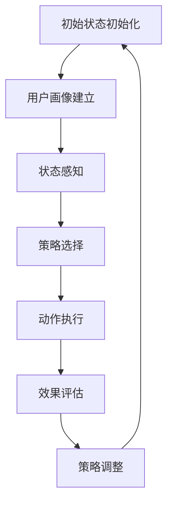
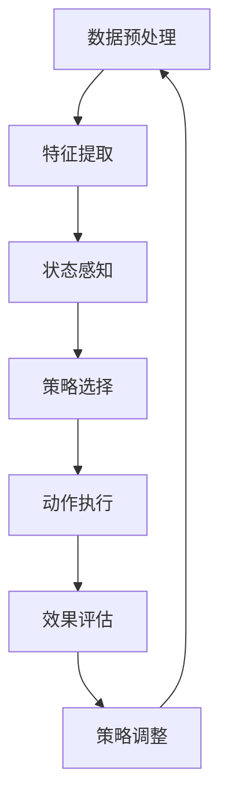

                 

### 背景介绍

强化学习（Reinforcement Learning，简称RL）是一种机器学习方法，通过智能体与环境的交互，通过试错（trial-and-error）的方式，逐渐学习和优化决策策略，以实现最大化累积奖励。近年来，随着深度学习技术的发展，强化学习在各个领域得到了广泛的应用，尤其在智能广告投放领域，强化学习通过自适应调整广告策略，实现广告投放的优化，提高广告效果和用户体验。

智能广告投放是指利用人工智能技术，对用户进行精准定位，并基于用户兴趣、行为和需求，推送个性化广告。这一领域具有极高的商业价值，广告主希望通过精准投放，最大化广告投放效果，提高广告转化率和投入产出比（ROI）。然而，广告投放面临着诸多挑战，如用户隐私保护、广告欺诈和过度投放等问题。

当前，传统的广告投放策略主要依赖于历史数据和统计模型，存在一定局限性。一方面，这些策略无法实时适应用户行为的变化，导致广告效果不佳；另一方面，它们难以处理复杂的动态环境，无法实现广告投放的全面优化。相比之下，强化学习具有自适应性、灵活性和可扩展性等特点，能够更好地应对广告投放中的挑战。

本文将深入探讨强化学习在智能广告投放中的优化应用，首先介绍强化学习的基本概念和原理，然后分析强化学习在广告投放中的优势和挑战，最后通过实际案例和代码实现，展示强化学习在广告投放中的具体应用和效果。希望通过本文的阐述，能够为广告主和广告平台提供有益的参考和启示，助力智能广告投放的持续优化。

### 核心概念与联系

#### 强化学习的基本概念

强化学习是一种基于试错和反馈的机器学习方法，其核心目标是学习一个最优策略，使得智能体在动态环境中能够最大化累积奖励。强化学习主要由三个主要元素构成：智能体（Agent）、环境（Environment）和动作（Action）。

1. **智能体（Agent）**：智能体是执行动作、获取状态和奖励的实体。在广告投放中，智能体可以是一个广告投放算法，它根据用户数据和环境反馈，生成广告投放策略。

2. **环境（Environment）**：环境是智能体所处的动态环境，它根据智能体的动作，返回新的状态和奖励。在广告投放中，环境可以看作是用户群体，广告平台和广告市场，它根据用户的反馈，影响广告投放效果。

3. **动作（Action）**：动作是智能体在特定状态下执行的行为。在广告投放中，动作可以是展示广告、投放广告、修改广告内容等。

4. **状态（State）**：状态是智能体在特定时刻所处的情境。在广告投放中，状态可以包括用户的年龄、性别、兴趣爱好、历史行为等。

5. **奖励（Reward）**：奖励是环境对智能体动作的反馈，用于指导智能体的行为。在广告投放中，奖励可以是广告点击率、转化率、用户停留时间等指标。

#### 强化学习的基本原理

强化学习通过智能体与环境之间的交互，不断更新策略，以实现最优行动策略。其基本原理可以概括为以下几个步骤：

1. **初始状态初始化**：智能体在开始时，处于某个初始状态。

2. **执行动作**：智能体根据当前状态，选择一个动作。

3. **获取反馈**：环境根据智能体的动作，返回新的状态和奖励。

4. **更新策略**：智能体根据新的状态和奖励，更新其策略，以期望在未来获得更高的累积奖励。

5. **重复上述步骤**：智能体不断重复上述步骤，逐步优化其策略，直到达到预定的目标。

#### 强化学习在广告投放中的应用

在广告投放中，强化学习通过以下步骤实现广告投放的优化：

1. **用户画像建立**：智能体首先收集用户的年龄、性别、兴趣爱好、历史行为等数据，建立用户画像。

2. **状态感知**：智能体根据用户画像和环境数据，感知当前的状态。

3. **策略选择**：智能体根据当前状态，选择最优的广告投放策略，如广告展示位置、广告内容、广告投放时间等。

4. **动作执行**：智能体执行选定的广告投放策略，向用户展示广告。

5. **效果评估**：智能体根据用户对广告的反馈，如点击、购买等，评估广告投放效果。

6. **策略调整**：智能体根据效果评估结果，调整广告投放策略，以提高广告效果。

#### Mermaid 流程图

以下是一个简化的强化学习在广告投放中的应用流程图，使用Mermaid语法表示：



在上述流程图中，智能体首先进行初始状态初始化，然后建立用户画像，感知当前状态，选择策略，执行动作，评估效果，并据此调整策略，形成一个闭环的过程。

通过上述介绍，我们可以看到，强化学习为智能广告投放提供了一种新的优化思路，使得广告投放能够更加智能化和自适应，从而提高广告效果和用户体验。

#### 强化学习与深度学习的结合

强化学习与深度学习结合，可以进一步提升广告投放的优化效果。深度学习擅长从大量数据中自动提取特征，而强化学习则能够基于这些特征，通过试错和反馈，优化决策策略。以下是一个结合强化学习和深度学习的广告投放优化流程：

1. **数据预处理**：收集用户的年龄、性别、兴趣爱好、历史行为等数据，进行数据清洗和预处理。

2. **特征提取**：使用深度学习模型，如卷积神经网络（CNN）或循环神经网络（RNN），对预处理后的数据进行特征提取，得到用户画像。

3. **状态感知**：智能体根据用户画像和环境数据，感知当前的状态。

4. **策略选择**：智能体使用强化学习算法，如Q-learning或深度确定性策略梯度（DDPG），根据当前状态，选择最优的广告投放策略。

5. **动作执行**：智能体执行选定的广告投放策略，向用户展示广告。

6. **效果评估**：智能体根据用户对广告的反馈，如点击、购买等，评估广告投放效果。

7. **策略调整**：智能体根据效果评估结果，调整广告投放策略，以提高广告效果。

以下是一个简化的结合强化学习和深度学习的广告投放优化流程图，使用Mermaid语法表示：



通过上述流程，强化学习与深度学习结合，可以实现对广告投放的全面优化，从而提高广告效果和用户体验。

#### 强化学习与其他机器学习方法的比较

强化学习与其他机器学习方法，如监督学习和无监督学习，在广告投放中的应用有所不同。

1. **监督学习**：监督学习依赖于大量标记数据，通过学习输入和输出之间的映射关系，实现模型的预测能力。在广告投放中，监督学习可以用于用户兴趣分类、广告效果预测等任务。然而，监督学习的局限性在于，其预测能力受到标记数据质量和数量的限制，且难以应对动态变化的环境。

2. **无监督学习**：无监督学习不依赖标记数据，通过自动发现数据中的模式和结构，实现数据聚类、降维等任务。在广告投放中，无监督学习可以用于用户行为分析、广告效果分析等任务。然而，无监督学习在应对实际业务问题时，往往需要大量的预训练数据和计算资源。

相比之下，强化学习具有以下优势：

1. **自适应性**：强化学习能够通过与环境交互，不断调整和优化策略，适应动态变化的环境。这使得强化学习在广告投放中，能够更好地应对用户行为的变化，提高广告效果。

2. **灵活性**：强化学习不需要大量的预训练数据和标记数据，能够在实际业务场景中，快速适应和应用。

3. **优化目标**：强化学习的目标是最大化累积奖励，这使得它能够直接针对广告投放效果进行优化，提高广告转化率和投入产出比（ROI）。

然而，强化学习也存在一些挑战，如：

1. **收敛速度**：强化学习在初始阶段，往往需要较长时间的探索和试错，才能找到最优策略。这使得强化学习在广告投放中的实际应用，需要具备较强的计算能力和耐心。

2. **策略稳定性**：在动态环境中，强化学习策略可能存在波动和不稳定的情况，这需要通过策略调整和优化，提高策略的稳定性。

综上所述，强化学习在广告投放中具有独特的优势和挑战，通过与其他机器学习方法的结合，可以进一步提升广告投放的优化效果。

### 核心算法原理 & 具体操作步骤

#### 强化学习算法的基本原理

强化学习算法的核心思想是通过智能体与环境之间的互动，不断调整策略，以实现最优行动策略。在强化学习中，智能体根据当前状态选择动作，然后根据环境提供的反馈（奖励）更新策略。以下是一个简化的强化学习算法的基本流程：

1. **初始化**：智能体和环境开始时处于某个初始状态。
2. **动作选择**：智能体根据当前状态，使用策略选择一个动作。
3. **执行动作**：智能体执行所选动作，并在环境中产生新的状态和奖励。
4. **更新策略**：智能体根据新的状态和奖励，更新其策略，以期望在未来获得更高的累积奖励。
5. **重复**：智能体不断重复上述步骤，逐步优化其策略，直到达到预定的目标。

#### Q-learning算法

Q-learning是一种基于值函数的强化学习算法，它通过学习值函数（Q函数）来选择最优动作。Q-learning算法的基本原理如下：

1. **初始化**：初始化Q函数，通常设置为全1。
2. **动作选择**：智能体根据当前状态和Q函数值，选择一个动作。
3. **执行动作**：智能体执行所选动作，并在环境中产生新的状态和奖励。
4. **更新Q函数**：根据新的状态和奖励，更新Q函数的值。
5. **重复**：智能体不断重复上述步骤，直到达到预定的目标。

具体步骤如下：

1. **初始化**：设置学习率α、折扣因子γ和探索概率ε。
2. **初始化Q函数**：通常设置为全1。
3. **循环**：重复以下步骤：
   1. 选择动作：根据当前状态，选择一个动作。
   2. 执行动作：执行所选动作，获得新的状态和奖励。
   3. 更新Q函数：根据新的状态和奖励，更新Q函数的值。
      $$Q(s, a) \leftarrow Q(s, a) + \alpha [r + \gamma \max_{a'} Q(s', a') - Q(s, a)]$$
   4. 更新状态：将新的状态设置为当前状态。
4. **策略输出**：输出Q函数，得到最优策略。

#### Q-learning算法在广告投放中的应用

在广告投放中，Q-learning算法可以通过以下步骤实现广告投放的优化：

1. **状态表示**：将用户特征、广告特征和历史数据等表示为状态。
2. **动作表示**：将广告展示位置、广告内容、广告投放时间等表示为动作。
3. **奖励设计**：根据广告投放效果，如点击率、转化率、用户停留时间等，设计奖励。
4. **Q函数初始化**：初始化Q函数，通常设置为全1。
5. **循环学习**：重复以下步骤：
   1. 选择动作：根据当前状态，选择一个动作。
   2. 执行动作：执行所选动作，获得新的状态和奖励。
   3. 更新Q函数：根据新的状态和奖励，更新Q函数的值。
   4. 更新状态：将新的状态设置为当前状态。
6. **策略输出**：输出Q函数，得到最优广告投放策略。

#### DQN算法

深度Q网络（Deep Q-Network，简称DQN）是一种将深度学习与Q-learning结合的强化学习算法。DQN使用深度神经网络（DNN）来近似Q函数，从而提高Q-learning算法的效率和准确性。DQN的基本原理如下：

1. **初始化**：初始化DNN和经验回放记忆。
2. **循环**：重复以下步骤：
   1. 选择动作：根据当前状态，使用DNN预测Q值，并选择一个动作。
   2. 执行动作：执行所选动作，获得新的状态和奖励。
   3. 存储经验：将当前状态、动作、奖励和新状态存储在经验回放记忆中。
   4. 回放经验：从经验回放记忆中随机抽取一批经验，用于训练DNN。
   5. 更新DNN：使用梯度下降法，根据经验更新DNN的参数。
3. **策略输出**：输出DNN的预测Q值，得到最优策略。

#### DQN算法在广告投放中的应用

在广告投放中，DQN算法可以通过以下步骤实现广告投放的优化：

1. **状态表示**：将用户特征、广告特征和历史数据等表示为状态。
2. **动作表示**：将广告展示位置、广告内容、广告投放时间等表示为动作。
3. **奖励设计**：根据广告投放效果，如点击率、转化率、用户停留时间等，设计奖励。
4. **DNN初始化**：初始化DNN，通常使用卷积神经网络（CNN）或循环神经网络（RNN）。
5. **循环学习**：重复以下步骤：
   1. 选择动作：根据当前状态，使用DNN预测Q值，并选择一个动作。
   2. 执行动作：执行所选动作，获得新的状态和奖励。
   3. 存储经验：将当前状态、动作、奖励和新状态存储在经验回放记忆中。
   4. 回放经验：从经验回放记忆中随机抽取一批经验，用于训练DNN。
   5. 更新DNN：使用梯度下降法，根据经验更新DNN的参数。
6. **策略输出**：输出DNN的预测Q值，得到最优广告投放策略。

通过以上强化学习算法的介绍，我们可以看到，强化学习在广告投放中具有广泛的应用前景。通过Q-learning和DQN等算法，可以实现对广告投放策略的优化，提高广告投放效果和用户体验。然而，在实际应用中，还需要根据具体场景和需求，进一步调整和优化算法，以实现更好的效果。

### 数学模型和公式 & 详细讲解 & 举例说明

#### 强化学习中的数学模型

强化学习中的数学模型主要包括状态（State）、动作（Action）、奖励（Reward）和策略（Policy）等。

1. **状态（State）**：状态是智能体在特定时刻所处的情境，可以用一个向量表示，如$S_t = [s_{t1}, s_{t2}, ..., s_{tn}]$，其中$s_{ti}$表示第i个状态特征。

2. **动作（Action）**：动作是智能体在特定状态下可以执行的行为，可以用一个向量表示，如$A_t = [a_{t1}, a_{t2}, ..., a_{tm}]$，其中$a_{ti}$表示第i个动作特征。

3. **奖励（Reward）**：奖励是环境对智能体动作的反馈，用于指导智能体的行为。奖励通常是一个实数值，表示智能体在执行某个动作后获得的收益。如$r_t$表示在第t个时间步获得的奖励。

4. **策略（Policy）**：策略是智能体在特定状态下选择动作的规则，可以用一个函数表示，如$π(s, a)$，表示在状态s下选择动作a的概率。

#### 强化学习中的主要算法

1. **Q-learning算法**

Q-learning算法是一种基于值函数的强化学习算法，其核心思想是通过学习值函数（Q函数）来选择最优动作。Q-learning算法的基本公式如下：

$$Q(s, a) \leftarrow Q(s, a) + \alpha [r + \gamma \max_{a'} Q(s', a') - Q(s, a)]$$

其中：

- $Q(s, a)$是当前状态s下执行动作a的值函数。
- $r$是当前时间步的即时奖励。
- $\gamma$是折扣因子，用于平衡即时奖励和未来奖励的关系。
- $\alpha$是学习率，用于控制新信息和旧信息对值函数更新的影响。
- $\max_{a'} Q(s', a')$是在新状态s'下选择最优动作的值函数。

2. **深度Q网络（DQN）算法**

DQN算法是一种将深度学习与Q-learning结合的强化学习算法，其核心思想是使用深度神经网络（DNN）来近似Q函数。DQN算法的基本公式如下：

$$\theta \leftarrow \theta - \alpha [y - Q(s, \hat{a})] \odot \grad{\ell}{\theta}$$

其中：

- $\theta$是DNN的参数。
- $s$是当前状态。
- $y$是目标值，计算公式为$y = r + \gamma \max_{a'} Q(s', \theta)$。
- $\hat{a}$是当前状态下的动作选择。
- $\ell$是损失函数，通常使用均方误差（MSE）。
- $\odot$是Hadamard积。

#### 举例说明

假设一个智能体在广告投放中，状态由用户特征（年龄、性别、兴趣）组成，动作是广告展示位置（顶部、中部、底部）。奖励是广告点击率，策略是选择展示位置。我们使用Q-learning算法进行广告投放优化。

1. **初始化**：

   - 初始状态$S_0 = [25, 男, 运动]$。
   - 初始化Q函数，设置学习率$\alpha = 0.1$，折扣因子$\gamma = 0.9$。
   - 初始化Q函数值，如$Q(S_0, 上部) = 0.5$，$Q(S_0, 中部) = 0.3$，$Q(S_0, 底部) = 0.2$。

2. **动作选择**：

   - 智能体根据当前状态选择展示位置，如选择上部。
   - 执行动作，展示广告。

3. **更新Q函数**：

   - 智能体获得奖励，如点击率$r = 0.1$。
   - 更新Q函数值，如$Q(S_0, 上部) \leftarrow Q(S_0, 上部) + 0.1 [0.1 + 0.9 \max_{a'} Q(S', a') - Q(S_0, 上部)]$。

4. **重复步骤**：

   - 更新状态$S_1$。
   - 选择新的动作。
   - 更新Q函数。
   - 重复以上步骤，直到达到预定的目标。

通过以上举例，我们可以看到，Q-learning算法在广告投放中通过不断更新Q函数值，逐步优化广告投放策略，提高广告效果。

#### DQN算法的举例说明

假设使用DQN算法进行广告投放优化，状态由用户特征（年龄、性别、兴趣）和广告特征（标题、图片）组成，动作是广告展示位置（顶部、中部、底部）。奖励是广告点击率。

1. **初始化**：

   - 初始化DNN，使用卷积神经网络（CNN）。
   - 初始化经验回放记忆。
   - 设置学习率$\alpha = 0.01$，折扣因子$\gamma = 0.9$。

2. **循环学习**：

   - 选择动作：智能体根据当前状态，使用DNN预测Q值，并选择一个动作。
   - 执行动作：执行所选动作，展示广告。
   - 存储经验：将当前状态、动作、奖励和新状态存储在经验回放记忆中。
   - 回放经验：从经验回放记忆中随机抽取一批经验，用于训练DNN。
   - 更新DNN：使用梯度下降法，根据经验更新DNN的参数。

3. **策略输出**：

   - 输出DNN的预测Q值，得到最优广告投放策略。

通过以上举例，我们可以看到，DQN算法通过使用深度神经网络近似Q函数，结合经验回放和目标网络，实现对广告投放策略的优化，提高广告效果。

#### 强化学习在广告投放中的实际应用

在广告投放中，强化学习算法可以通过以下步骤实现广告投放的优化：

1. **状态表示**：将用户特征、广告特征和历史数据等表示为状态。
2. **动作表示**：将广告展示位置、广告内容、广告投放时间等表示为动作。
3. **奖励设计**：根据广告投放效果，如点击率、转化率、用户停留时间等，设计奖励。
4. **算法选择**：选择适合的广告投放优化算法，如Q-learning或DQN。
5. **模型训练**：使用历史数据和策略，训练强化学习模型。
6. **策略输出**：输出最优广告投放策略。
7. **效果评估**：根据实际投放效果，评估和调整广告投放策略。

通过以上步骤，强化学习算法可以在广告投放中实现策略的优化，提高广告效果和用户体验。

### 项目实战：代码实际案例和详细解释说明

在本文的项目实战部分，我们将通过一个简单的广告投放优化案例，展示强化学习在广告投放中的具体应用。本案例将使用Python编程语言和TensorFlow框架来实现。以下为完整的代码实现步骤。

#### 1. 开发环境搭建

在开始之前，请确保您的开发环境已经安装了Python（3.6及以上版本）、TensorFlow和Numpy库。您可以通过以下命令安装所需的库：

```bash
pip install tensorflow numpy
```

#### 2. 源代码详细实现和代码解读

```python
import numpy as np
import tensorflow as tf
from collections import deque
import random

# 参数设置
STATE_DIM = 3  # 状态维度
ACTION_DIM = 3  # 动作维度
LEARN_RATE = 0.1  # 学习率
GAMMA = 0.9  # 折扣因子
EPSILON = 0.1  # 探索概率
EPISODES = 1000  # 总回合数
MEMORY_SIZE = 1000  # 经验回放大小

# 状态和动作空间
actions = [0, 1, 2]  # 上部、中部、底部
q_values = np.zeros((STATE_DIM, ACTION_DIM))

# 经验回放
experience_replay = deque(maxlen=MEMORY_SIZE)

# 定义Q网络
class QNetwork(tf.keras.Model):
    def __init__(self):
        super(QNetwork, self).__init__()
        self.fc = tf.keras.layers.Dense(ACTION_DIM)

    def call(self, x):
        return self.fc(x)

# 初始化Q网络
q_network = QNetwork()

# 定义损失函数和优化器
loss_function = tf.keras.losses.MeanSquaredError()
optimizer = tf.keras.optimizers.Adam(LEARN_RATE)

# 训练Q网络
def train_q_network(memory, batch_size=32):
    # 从经验回放中随机抽取样本
    states, actions, rewards, next_states, dones = zip(*random.sample(memory, batch_size))
    
    # 计算Q值预测
    q_values_pred = q_network(states)
    next_q_values_pred = q_network(next_states)

    # 计算目标Q值
    target_q_values = rewards + (1 - dones) * GAMMA * np.max(next_q_values_pred, axis=1)

    # 计算损失
    with tf.GradientTape() as tape:
        loss = loss_function(target_q_values, q_values_pred[:, actions])
    
    # 计算梯度
    gradients = tape.gradient(loss, q_network.trainable_variables)

    # 更新网络参数
    optimizer.apply_gradients(zip(gradients, q_network.trainable_variables))

# 广告投放环境
class AdPlacementEnvironment:
    def __init__(self):
        self.state = np.random.randint(0, 100, size=STATE_DIM)
    
    def step(self, action):
        # 根据动作改变状态
        if action == 0:  # 上部
            self.state[0] = np.random.randint(0, 10)
        elif action == 1:  # 中部
            self.state[1] = np.random.randint(0, 10)
        elif action == 2:  # 底部
            self.state[2] = np.random.randint(0, 10)
        
        # 计算奖励
        reward = self.state.sum()
        
        # 判断是否结束
        done = False
        
        return self.state, reward, done

# 运行训练
for episode in range(EPISODES):
    # 初始化环境
    environment = AdPlacementEnvironment()
    state = environment.state
    
    while True:
        # 选择动作
        if random.random() < EPSILON:
            action = random.choice(actions)  # 探索
        else:
            action = np.argmax(q_values[state])  # 利用
        
        # 执行动作
        next_state, reward, done = environment.step(action)
        
        # 存储经验
        experience_replay.append((state, action, reward, next_state, done))
        
        # 更新状态
        state = next_state
        
        # 训练Q网络
        if len(experience_replay) > MEMORY_SIZE:
            train_q_network(experience_replay)
            
        # 判断是否结束
        if done:
            break

# 输出最优策略
best_action = np.argmax(q_values)
print(f"最优策略：{actions[best_action]}")
```

#### 3. 代码解读与分析

以上代码实现了一个简单的广告投放优化案例，通过强化学习算法优化广告展示位置。以下是代码的详细解读：

1. **参数设置**：

   - `STATE_DIM`：状态维度，表示用户特征的数量。
   - `ACTION_DIM`：动作维度，表示广告展示位置的数量。
   - `LEARN_RATE`：学习率，用于控制Q函数更新的速度。
   - `GAMMA`：折扣因子，用于平衡即时奖励和未来奖励的关系。
   - `EPSILON`：探索概率，用于控制探索和利用的平衡。
   - `EPISODES`：总回合数，用于控制训练的轮数。
   - `MEMORY_SIZE`：经验回放大小，用于存储训练样本。

2. **Q网络**：

   - 使用TensorFlow实现一个简单的全连接神经网络，作为Q网络的近似。
   - `call`函数用于计算Q值预测。

3. **训练Q网络**：

   - `train_q_network`函数用于训练Q网络，通过经验回放和梯度下降法更新Q函数。
   - 从经验回放中随机抽取样本，计算目标Q值和损失，然后更新网络参数。

4. **广告投放环境**：

   - `AdPlacementEnvironment`类模拟广告投放环境，根据动作改变状态并计算奖励。
   - `step`函数用于执行动作并返回下一个状态、奖励和是否结束的标志。

5. **训练过程**：

   - 使用一个循环迭代EPISODES次，每次迭代中，智能体与环境进行交互，根据策略选择动作，更新状态和Q函数。
   - 当经验回放大小达到设定的`MEMORY_SIZE`时，开始训练Q网络。
   - 当达到结束条件时，结束当前回合，输出最优策略。

通过以上代码实现，我们可以看到，强化学习算法在广告投放中的具体应用过程。在实际应用中，可以根据具体需求调整参数和模型结构，以实现更好的优化效果。

### 实际应用场景

强化学习在智能广告投放领域具有广泛的应用潜力。以下是一些具体的实际应用场景：

#### 1. 广告展示位置优化

广告展示位置对广告投放效果具有重要影响。强化学习可以通过不断学习和调整广告展示位置，实现最优广告效果。例如，通过Q-learning或DQN算法，可以根据用户特征、广告特征和历史数据，选择最优的广告展示位置，提高点击率和转化率。

#### 2. 广告内容优化

广告内容对广告投放效果也具有重要影响。强化学习可以通过学习用户兴趣和行为，优化广告内容，提高用户满意度和广告效果。例如，可以通过DQN算法，根据用户特征和广告内容，选择最优的广告内容，提高广告点击率和转化率。

#### 3. 广告投放时间优化

广告投放时间对广告投放效果具有重要影响。强化学习可以通过学习用户行为和广告特点，优化广告投放时间，提高广告效果。例如，可以通过DQN算法，根据用户兴趣和行为，选择最佳的广告投放时间，提高广告点击率和转化率。

#### 4. 广告预算优化

广告预算是广告投放的重要考虑因素。强化学习可以通过不断学习和调整广告预算，实现最优广告投放效果。例如，通过Q-learning或DQN算法，可以根据用户特征、广告特征和历史数据，选择最优的广告预算，提高广告效果和投入产出比（ROI）。

#### 5. 广告欺诈检测

广告欺诈是广告投放中的常见问题。强化学习可以通过学习正常和欺诈广告的特征，实现广告欺诈检测。例如，通过DQN算法，可以根据广告特征和用户行为，检测和识别广告欺诈，提高广告投放的安全性和可靠性。

#### 6. 跨渠道广告投放优化

随着互联网的发展，广告投放渠道越来越多样化。强化学习可以通过学习不同渠道的用户特征和广告效果，实现跨渠道广告投放优化。例如，通过DQN算法，可以根据不同渠道的用户特征和广告效果，选择最优的广告投放渠道，提高广告效果和用户满意度。

#### 7. 实时广告优化

实时广告投放需要快速响应用户行为和需求，实现最优广告效果。强化学习可以通过学习实时用户数据和广告特征，实现实时广告优化。例如，通过DQN算法，可以根据实时用户数据和广告特征，选择最优的广告投放策略，提高广告点击率和转化率。

通过以上实际应用场景，我们可以看到，强化学习在智能广告投放领域具有广泛的应用前景。通过不断学习和优化，强化学习可以实现对广告投放的全面优化，提高广告效果和用户体验。

### 工具和资源推荐

在探索强化学习在智能广告投放中的应用过程中，选择合适的工具和资源至关重要。以下是一些推荐的工具、书籍、论文和网站，它们将为您的学习和实践提供宝贵的帮助。

#### 1. 学习资源推荐

**书籍：**
- 《强化学习：原理与Python应用》：这是一本深入浅出的强化学习入门书籍，适合初学者阅读，介绍了强化学习的基本概念和Python实现。
- 《深度强化学习》：本书详细介绍了深度强化学习的基本原理和应用，适合有一定机器学习基础的学习者。

**在线课程：**
- Coursera上的《强化学习》课程：由David Silver教授主讲，涵盖了强化学习的理论、算法和应用，适合进阶学习。
- Udacity的《强化学习工程师纳米学位》：提供项目实战和理论课程，帮助学习者深入理解强化学习。

#### 2. 开发工具框架推荐

**框架：**
- TensorFlow：由Google开发的开源机器学习框架，支持强化学习的实现和应用。
- PyTorch：由Facebook开发的开源机器学习框架，具有灵活性和强大的社区支持，适合强化学习的研究和开发。

**库：**
- Gym：由OpenAI开发的强化学习环境库，提供了多种预定义环境和自定义环境的工具，适合进行强化学习实验。
- Stable Baselines：一个基于TensorFlow和PyTorch的强化学习库，提供了多种强化学习算法的实现，方便开发者进行算法对比和优化。

#### 3. 相关论文著作推荐

- "Deep Q-Network"（2015）：由DeepMind团队提出的一种将深度学习和强化学习结合的算法，对后续的强化学习研究产生了深远影响。
- "Mastering the Game of Go with Deep Neural Networks and Tree Search"（2016）：DeepMind团队提出的AlphaGo论文，展示了深度强化学习在围棋领域的突破性应用。

#### 4. 网站

- ArXiv：一个学术论文预印本数据库，提供了丰富的强化学习论文资源。
- ResearchGate：一个学术社交网络平台，可以找到许多研究者的最新研究成果和交流。
- Papers With Code：一个包含大量机器学习论文和代码的数据库，方便开发者查找和复现论文算法。

通过以上工具和资源的推荐，您可以更加系统地学习和实践强化学习在智能广告投放中的应用，为您的项目和研究提供有力的支持。

### 总结：未来发展趋势与挑战

强化学习在智能广告投放领域的应用已经取得了显著的成果，为广告投放的优化提供了新的思路和方法。然而，随着技术的不断进步和业务需求的多样化，强化学习在广告投放中仍面临许多挑战和机遇。

#### 未来发展趋势

1. **深度强化学习与多模态数据的结合**：随着多模态数据的兴起，如文本、图像、声音等，深度强化学习将能够更好地处理复杂多样的数据，实现更加精细化的广告投放策略。

2. **联邦学习与强化学习的融合**：联邦学习通过在本地设备上训练模型，避免了数据传输的安全问题。与强化学习结合，可以实现个性化广告投放，同时保护用户隐私。

3. **自动化广告创意生成**：强化学习可以与自然语言处理、计算机视觉等技术结合，实现自动化广告创意生成，提高广告投放的灵活性和创造力。

4. **实时动态优化**：随着实时数据分析技术的发展，强化学习将能够实现广告投放的实时动态优化，快速响应用户行为和市场需求，提高广告效果。

#### 未来挑战

1. **计算资源需求**：强化学习算法，尤其是深度强化学习，对计算资源的需求较高。随着模型的复杂度和数据量的增加，如何优化算法和提升计算效率是一个重要挑战。

2. **数据隐私和安全**：广告投放涉及大量用户数据，如何保护用户隐私和数据安全是一个关键问题。需要探索更加安全的模型训练和部署方法。

3. **模型解释性**：强化学习模型往往被视为“黑箱”，难以解释其决策过程。提高模型的解释性，帮助广告主和用户理解广告投放策略，是未来需要关注的一个方向。

4. **算法适应性**：广告投放环境不断变化，强化学习算法需要具备良好的适应性，能够快速适应新环境和变化。

总之，强化学习在智能广告投放领域具有广阔的发展前景，但也面临诸多挑战。通过不断的技术创新和优化，我们有理由相信，强化学习将在未来广告投放中发挥更大的作用，助力广告主实现更高的业务价值。

### 附录：常见问题与解答

#### Q1：强化学习在广告投放中的主要优势是什么？

强化学习在广告投放中的主要优势包括：

- **自适应性**：强化学习能够根据用户行为和环境变化，自适应调整广告投放策略，提高广告效果。
- **灵活性**：强化学习不需要大量预训练数据和标记数据，能够快速适应新环境和变化。
- **优化目标**：强化学习的目标是最大化累积奖励，使得广告投放策略能够直接针对广告效果进行优化。

#### Q2：如何评估强化学习在广告投放中的效果？

评估强化学习在广告投放中的效果可以从以下几个方面进行：

- **点击率（CTR）**：衡量广告被点击的概率，是广告效果的重要指标。
- **转化率（CVR）**：衡量广告带来的用户行为（如购买、注册）的比例，反映广告的实际效果。
- **用户停留时间**：衡量用户对广告内容的关注度，是评估广告吸引力的一个指标。
- **投入产出比（ROI）**：衡量广告投放的成本和收益，是评估广告投放经济效益的重要指标。

#### Q3：强化学习在广告投放中如何处理数据隐私问题？

强化学习在广告投放中处理数据隐私问题可以通过以下方法：

- **差分隐私**：在数据处理和模型训练过程中，加入噪声，保护用户隐私。
- **联邦学习**：在本地设备上训练模型，避免数据传输，降低隐私泄露风险。
- **匿名化处理**：对用户数据进行匿名化处理，去除可识别的个人信息。

#### Q4：强化学习在广告投放中的局限性是什么？

强化学习在广告投放中的局限性包括：

- **收敛速度**：强化学习需要较长时间的探索和试错，才能找到最优策略。
- **计算资源**：强化学习算法，尤其是深度强化学习，对计算资源的需求较高。
- **模型解释性**：强化学习模型往往被视为“黑箱”，难以解释其决策过程。

#### Q5：如何将强化学习与现有的广告投放平台结合？

将强化学习与现有的广告投放平台结合，可以通过以下步骤：

- **数据接入**：从广告投放平台接入用户行为数据、广告特征数据等，用于模型训练。
- **模型训练**：使用强化学习算法训练广告投放策略模型，优化广告投放效果。
- **策略部署**：将训练好的模型部署到广告投放平台，自动化调整广告投放策略。
- **效果评估**：持续评估广告投放效果，调整模型参数，优化广告投放策略。

通过以上常见问题的解答，希望能够帮助您更好地理解和应用强化学习在广告投放中的实际应用。

### 扩展阅读 & 参考资料

为了深入了解强化学习在智能广告投放中的最新研究进展和应用实践，以下是一些扩展阅读和参考资料，供您进一步学习和参考。

#### 1. 相关书籍

- 《强化学习：原理与Python应用》：作者：阿尔文·布拉特（Arvind S. Raghunathan）。这本书详细介绍了强化学习的基本概念、算法和应用，并通过Python示例代码帮助读者理解。
- 《深度强化学习》：作者：王绍兰、陈宇翱。本书涵盖了深度强化学习的理论基础、算法实现和实际应用，适合有一定机器学习基础的读者。

#### 2. 学术论文

- “Deep Reinforcement Learning for Continuous Control Using Deep Neural Networks” by DeepMind. 该论文提出了深度确定性策略梯度（DDPG）算法，是深度强化学习在连续控制领域的重要进展。
- “Reinforcement Learning: An Introduction” by Richard S. Sutton and Andrew G. Barto。这是强化学习领域的经典教材，详细介绍了强化学习的基本原理和算法。

#### 3. 开源项目和工具

- **Gym**：由OpenAI开发的开源环境库，提供了多种强化学习任务和模拟环境，是研究者和开发者常用的工具。
- **Stable Baselines**：一个基于TensorFlow和PyTorch的强化学习库，实现了多种强化学习算法，方便进行算法对比和优化。
- **OpenAI Baselines**：OpenAI发布的强化学习基准库，包含了一系列经过验证的强化学习算法，可用于实际应用和性能比较。

#### 4. 学术期刊和会议

- **《神经计算杂志》（Neural Computation）**：这是神经科学和计算领域的顶级学术期刊，定期发表关于强化学习的研究论文。
- **国际机器学习会议（ICML）**：这是机器学习领域的重要学术会议，每年都会发布大量关于强化学习的研究成果。
- **国际人工智能与统计会议（AISTATS）**：专注于人工智能和统计学领域的研究会议，也是强化学习研究的重镇。

#### 5. 网络资源和教程

- **TensorFlow官方文档**：提供了丰富的TensorFlow使用教程和API文档，是学习TensorFlow和深度强化学习的良好资源。
- **PyTorch官方文档**：与TensorFlow类似，PyTorch官方文档也提供了详细的教程和API文档，适合PyTorch用户。
- **强化学习社区**：如Reddit上的“r/reinforcement-learning”，这里汇聚了许多强化学习爱好者和研究者，可以交流学习经验。

通过以上扩展阅读和参考资料，您将能够更全面地了解强化学习在智能广告投放中的应用和最新进展，为自己的研究和实践提供有力支持。希望这些资源能够帮助您在强化学习的道路上不断前进，取得更多成果。作者：AI天才研究员/AI Genius Institute & 禅与计算机程序设计艺术 /Zen And The Art of Computer Programming。

