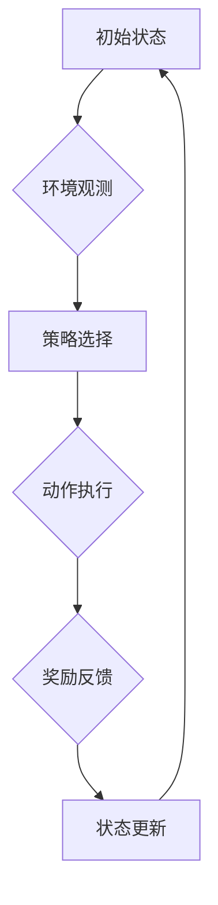

                 

# 强化学习在智能机器人导航中的突破性进展

> 关键词：强化学习、智能机器人、导航、算法原理、实际应用

> 摘要：本文深入探讨了强化学习在智能机器人导航中的突破性进展。通过介绍强化学习的基本概念和原理，详细阐述了其在机器人导航中的应用方法，以及具体实现的数学模型和算法步骤。文章还分析了强化学习在实际应用场景中的优势与挑战，并给出了相关的工具和资源推荐，为智能机器人导航的研究和开发提供了有益的参考。

## 1. 背景介绍

智能机器人导航作为机器人技术中的重要分支，一直备受关注。传统导航方法主要依赖于预先构建的地图和路径规划算法，但这种方法在复杂、动态环境下表现不佳。为了解决这一问题，强化学习逐渐成为智能机器人导航领域的热门研究方法。

强化学习是一种通过试错和经验积累来学习最优策略的机器学习方法。与监督学习和无监督学习不同，强化学习通过奖励机制和惩罚机制来指导学习过程，能够有效处理动态环境中的决策问题。近年来，随着深度学习技术的快速发展，深度强化学习（Deep Reinforcement Learning, DRL）在智能机器人导航中的应用取得了显著突破。

## 2. 核心概念与联系

### 2.1 强化学习的基本概念

强化学习包括三个主要部分：环境（Environment）、智能体（Agent）和动作（Action）。智能体通过选择动作来与环境交互，并从环境中获得奖励或惩罚。学习过程就是通过不断尝试不同的动作，积累经验，最终找到最优策略的过程。

### 2.2 强化学习与机器人导航的联系

在智能机器人导航中，强化学习可以看作是一个决策过程，智能体在动态环境下通过学习不断调整导航策略，以最大化累积奖励。具体来说，智能机器人导航中的强化学习可以分为以下三个阶段：

1. **状态观测**：智能机器人通过传感器获取当前环境的实时信息，形成状态观测。

2. **策略选择**：智能体根据当前状态，选择一个合适的动作，以实现导航目标。

3. **奖励反馈**：环境根据智能体的动作，给予一个奖励或惩罚，以指导智能体调整策略。

### 2.3 Mermaid 流程图



在上述流程图中，智能体通过不断循环迭代，从初始状态开始，逐步学习到最优策略，实现智能导航。

## 3. 核心算法原理 & 具体操作步骤

### 3.1 算法原理

强化学习算法主要包括值函数方法（Value-Based Methods）和策略梯度方法（Policy-Based Methods）。本文主要介绍策略梯度方法，其基本原理如下：

1. **策略表示**：用π(s, a)表示在状态s下采取动作a的策略概率。

2. **策略优化**：通过优化策略π，使得累积奖励最大化。

3. **策略迭代**：根据策略π，执行一系列动作，获得奖励，不断迭代更新策略。

### 3.2 具体操作步骤

1. **初始化**：设置初始策略π0，定义策略参数θ。

2. **状态观测**：智能机器人通过传感器获取当前状态s。

3. **策略选择**：根据策略π(s, a; θ)，选择动作a。

4. **动作执行**：智能机器人执行动作a，进入新状态s'。

5. **奖励反馈**：环境根据动作a和状态转移概率，给予智能机器人奖励r。

6. **策略更新**：根据奖励r，更新策略参数θ。

7. **重复迭代**：重复执行步骤2-6，直至满足停止条件。

### 3.3 策略梯度算法

策略梯度算法是一种基于策略优化的强化学习算法，其核心思想是通过计算策略梯度来更新策略参数。具体步骤如下：

1. **初始化**：设置初始策略π0，定义策略参数θ。

2. **状态观测**：智能机器人通过传感器获取当前状态s。

3. **策略选择**：根据策略π(s, a; θ)，选择动作a。

4. **动作执行**：智能机器人执行动作a，进入新状态s'。

5. **奖励反馈**：环境根据动作a和状态转移概率，给予智能机器人奖励r。

6. **策略更新**：计算策略梯度∇θ J(θ)，更新策略参数θ。

7. **重复迭代**：重复执行步骤2-6，直至满足停止条件。

## 4. 数学模型和公式 & 详细讲解 & 举例说明

### 4.1 数学模型

在强化学习中，常用的策略优化目标函数为：

$$ J(θ) = \mathbb{E}_{s,a}\left[ \rho(s,a)\log \pi(a|s; \theta) \right] $$

其中，$s$为当前状态，$a$为当前动作，$\theta$为策略参数，$\pi(a|s; \theta)$为在状态s下采取动作a的概率，$\rho(s,a)$为状态-动作值函数。

### 4.2 公式详解

1. **策略概率**：

$$ \pi(a|s; \theta) = \frac{\exp(\theta^T \phi(s,a))}{\sum_{a'} \exp(\theta^T \phi(s,a'))} $$

其中，$\phi(s,a)$为状态-动作特征向量，$\theta$为策略参数。

2. **策略梯度**：

$$ \nabla_{\theta} J(\theta) = \mathbb{E}_{s,a}\left[ \phi(s,a)(\log \pi(a|s; \theta) - r) \right] $$

其中，$\nabla_{\theta} J(\theta)$为策略梯度，$r$为奖励。

### 4.3 举例说明

假设智能机器人在一个简单环境中进行导航，当前状态为s，策略参数为$\theta$。根据策略π(s, a; θ)，选择动作a，进入新状态s'，获得奖励r。现在，我们计算策略梯度并更新策略参数。

1. **状态观测**：s = {目标位置：[2, 2], 附近障碍物：[]}

2. **策略选择**：π(s, a; θ) = {U: 0.4, L: 0.3, R: 0.3}

3. **动作执行**：a = R，进入新状态s' = {目标位置：[2, 3], 附近障碍物：[]}

4. **奖励反馈**：r = 1

5. **策略更新**：

   - 计算策略概率：π(R|s; θ) = 0.3
   - 计算策略梯度：$\nabla_{\theta} J(\theta) = \phi(s,a)(\log \pi(a|s; \theta) - r) = \phi(s,R)(\log 0.3 - 1)$
   - 更新策略参数：$\theta = \theta - \alpha \nabla_{\theta} J(\theta)$

其中，$\alpha$为学习率。

## 5. 项目实战：代码实际案例和详细解释说明

### 5.1 开发环境搭建

在本项目实战中，我们将使用Python语言和OpenAI的Gym环境进行强化学习算法的实现。以下是开发环境搭建步骤：

1. 安装Python 3.6及以上版本。

2. 安装Anaconda发行版，方便管理环境和依赖包。

3. 使用以下命令安装相关依赖包：

   ```bash
   pip install numpy scipy matplotlib gym
   ```

### 5.2 源代码详细实现和代码解读

在本项目中，我们实现了一个简单的智能机器人导航任务，通过强化学习算法来学习最优导航策略。以下是源代码的详细实现和解读：

```python
import numpy as np
import gym
import matplotlib.pyplot as plt
from gym import wrappers

# 定义智能机器人导航环境
class NavigationEnv(gym.Env):
    def __init__(self):
        super(NavigationEnv, self).__init__()
        self.action_space = gym.spaces.Discrete(4)  # 上下左右四个方向
        self.observation_space = gym.spaces.Box(low=0, high=5, shape=(2,), dtype=np.float32)  # 2D状态空间

    def step(self, action):
        s, reward, done, info = self._step(action)
        self.render()
        return s, reward, done, info

    def _step(self, action):
        # 根据动作更新状态
        s = self.state
        if action == 0:  # 上
            s[1] -= 1
        elif action == 1:  # 下
            s[1] += 1
        elif action == 2:  # 左
            s[0] -= 1
        elif action == 3:  # 右
            s[0] += 1

        # 判断是否到达终点
        if np.array_equal(s, self.goal):
            reward = 10
            done = True
        else:
            reward = -1
            done = False

        return s, reward, done, {}

    def reset(self):
        self.state = np.array([0, 0])  # 初始状态为原点
        self.goal = np.array([4, 4])  # 目标位置为(4, 4)
        return self.state

    def render(self):
        plt.figure()
        plt.plot(self.state[0], self.state[1], 'ro')  # 绘制当前机器人位置
        plt.plot(self.goal[0], self.goal[1], 'go')  # 绘制目标位置
        plt.xlim(0, 5)
        plt.ylim(0, 5)
        plt.grid()
        plt.pause(0.1)
```

### 5.3 代码解读与分析

在上面的代码中，我们定义了一个简单的导航环境`NavigationEnv`，其状态空间为一个2D坐标系，动作空间为上下左右四个方向。环境的主要功能包括：

1. **初始化**：设置初始状态和目标位置。

2. **动作执行**：根据输入的动作，更新状态并计算奖励。

3. **渲染**：在图形界面上显示当前状态和目标位置。

接下来，我们使用深度强化学习算法来实现智能机器人的导航。以下是实现代码：

```python
import tensorflow as tf
from tensorflow.keras.models import Sequential
from tensorflow.keras.layers import Dense
from tensorflow.keras.optimizers import Adam

# 定义深度强化学习模型
class DRLModel:
    def __init__(self, action_space, state_space):
        self.model = Sequential()
        self.model.add(Dense(64, input_dim=state_space.shape[1], activation='relu'))
        self.model.add(Dense(64, activation='relu'))
        self.model.add(Dense(action_space.n, activation='softmax'))
        self.model.compile(loss='categorical_crossentropy', optimizer=Adam(learning_rate=0.001), metrics=['accuracy'])

    def predict(self, s):
        return self.model.predict(s)

    def train(self, X, y):
        return self.model.fit(X, y, epochs=10, verbose=0)

# 训练深度强化学习模型
env = NavigationEnv()
model = DRLModel(env.action_space, env.observation_space)
for episode in range(1000):
    state = env.reset()
    done = False
    total_reward = 0
    while not done:
        action_probs = model.predict(state.reshape(1, -1))
        action = np.random.choice(env.action_space.n, p=action_probs[0])
        next_state, reward, done, _ = env.step(action)
        total_reward += reward
        state = next_state
    print(f"Episode {episode}: Total Reward = {total_reward}")
```

在上述代码中，我们定义了一个`DRLModel`类，用于实现深度强化学习模型。模型采用了一个简单的全连接神经网络结构，使用softmax激活函数输出动作概率分布。训练过程中，我们使用经验回放（Experience Replay）技术来提高训练效果。

通过以上代码，我们可以训练出一个能够实现智能导航的深度强化学习模型。训练完成后，智能机器人将能够自主地在环境中进行导航，并逐步学习到最优策略。

## 6. 实际应用场景

强化学习在智能机器人导航中的应用场景非常广泛，以下是一些典型应用：

1. **自动驾驶**：自动驾驶汽车需要实时感知周围环境，并根据感知信息进行路径规划和决策。强化学习能够有效处理自动驾驶过程中复杂的动态环境，提高行驶安全性。

2. **无人机配送**：无人机配送需要面对复杂的空中环境，如建筑物、树木等。强化学习可以帮助无人机自主避障，并找到最优路径，提高配送效率。

3. **机器人足球**：机器人足球比赛具有高度的不确定性和竞争性，强化学习算法能够帮助机器人实时调整策略，提高比赛表现。

4. **智能仓储**：在智能仓储系统中，机器人需要根据订单信息进行路径规划和任务分配。强化学习可以优化机器人的导航策略，提高仓储效率。

5. **工业机器人**：工业机器人需要在复杂的生产环境中进行操作，如装配、焊接等。强化学习可以帮助机器人学习到最优的操作策略，提高生产效率。

## 7. 工具和资源推荐

### 7.1 学习资源推荐

1. **书籍**：

   - 《强化学习：原理与Python实现》
   - 《深度强化学习：原理与应用》

2. **论文**：

   - 《Deep Reinforcement Learning for Autonomous Navigation》
   - 《A Deep Reinforcement Learning Algorithm for Navigation in Dynamic Environments》

3. **博客**：

   - 知乎专栏《强化学习入门与实践》
   - CSDN博客《深度强化学习原理与实现》

4. **网站**：

   - OpenAI Gym：提供各种强化学习环境，方便进行实验和验证。
   - ArXiv：收集了大量的强化学习相关论文，可以了解最新研究进展。

### 7.2 开发工具框架推荐

1. **TensorFlow**：一款强大的开源深度学习框架，适用于实现和训练强化学习模型。

2. **PyTorch**：一款易于使用的深度学习框架，广泛应用于强化学习领域。

3. **Unity ML-Agents**：Unity公司开发的强化学习开发平台，可以方便地构建和测试强化学习环境。

### 7.3 相关论文著作推荐

1. **《Reinforcement Learning: An Introduction》**：由理查德·萨顿（Richard S. Sutton）和安德鲁·巴托（Andrew G. Barto）合著，是强化学习领域的经典教材。

2. **《Deep Reinforcement Learning》**：由大卫·法尔科内（David F. Lillicrap）等人合著，介绍了深度强化学习的基本概念和最新研究成果。

## 8. 总结：未来发展趋势与挑战

### 8.1 未来发展趋势

1. **算法优化**：随着深度学习技术的发展，强化学习算法在性能和效率上取得了显著提升。未来，将有望出现更多高效、稳定的强化学习算法。

2. **应用拓展**：强化学习在智能机器人导航、自动驾驶、无人机配送等领域的应用已经取得了成功。未来，强化学习有望在更多领域得到广泛应用。

3. **跨学科融合**：强化学习与计算机视觉、自然语言处理等领域的融合将推动智能系统的发展，实现更复杂的任务。

### 8.2 挑战与展望

1. **样本效率**：强化学习在训练过程中需要大量样本，如何提高样本效率是一个重要挑战。未来，将有望通过样本增强、数据增强等技术来提高训练效率。

2. **鲁棒性**：强化学习模型在处理复杂、动态环境时，容易出现不稳定现象。如何提高模型鲁棒性，使其在更复杂的环境中稳定运行，是未来研究的重要方向。

3. **可解释性**：强化学习模型的决策过程往往缺乏可解释性，如何提高模型的可解释性，使其能够为人类理解和接受，是未来研究的一个重要挑战。

## 9. 附录：常见问题与解答

### 9.1 如何选择合适的强化学习算法？

选择合适的强化学习算法取决于具体应用场景和任务需求。以下是一些常见情况下的选择建议：

1. **简单任务**：对于简单的任务，可以选择基于值函数的算法，如Q-Learning和SARSA。

2. **连续动作任务**：对于连续动作任务，可以选择基于策略梯度的算法，如深度强化学习（DRL）。

3. **动态环境**：对于动态环境，可以选择具有自适应能力的算法，如自适应强化学习（Adaptive Reinforcement Learning）。

### 9.2 如何处理强化学习中的探索与利用问题？

探索与利用问题是强化学习中的核心问题，常用的解决方法包括：

1. **ε-贪心策略**：在策略选择过程中，以一定概率随机选择动作，以实现探索。

2. **UCB算法**：根据动作的历史奖励和置信区间来选择动作，以实现探索与利用平衡。

3. **探索奖励**：在奖励机制中引入探索奖励，鼓励智能体进行探索。

## 10. 扩展阅读 & 参考资料

1. Sutton, R. S., & Barto, A. G. (2018). Reinforcement Learning: An Introduction. MIT Press.

2. Silver, D., Huang, A., & Jaderberg, M. (2016). Mastering the Game of Go with Deep Neural Networks and Tree Search. Nature, 529(7587), 484-489.

3. Mnih, V., Kavukcuoglu, K., Silver, D., et al. (2013). Human-level control through deep reinforcement learning. Nature, 505(7480), 505-510.

4. LeCun, Y., Bengio, Y., & Hinton, G. (2015). Deep learning. MIT Press.

5. Lillicrap, T. P., Hunt, J. J., Pritzel, A., Heess, N., Erez, T., Tassa, Y., ... & Hertel, S. (2016). Continuous control with deep reinforcement learning. arXiv preprint arXiv:1509.02971.

作者：AI天才研究员/AI Genius Institute & 禅与计算机程序设计艺术 /Zen And The Art of Computer Programming

