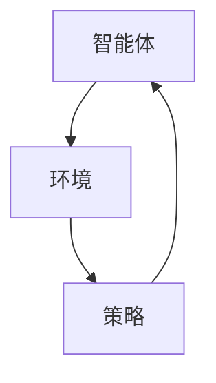
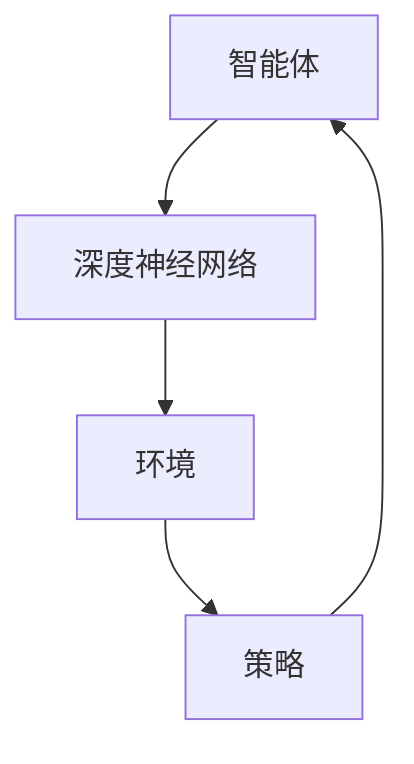

                 

# 强化学习在智能游戏AI中的人类级对抗策略

## 摘要

本文将深入探讨强化学习在智能游戏AI中实现人类级对抗策略的研究与应用。强化学习作为一种重要的机器学习算法，通过不断地试错和奖励反馈，使得智能体能够在复杂环境中学习到最优策略。本文将首先介绍强化学习的基本概念和原理，然后分析其在智能游戏AI中的具体应用，并通过实际案例展示如何利用强化学习来实现人类级对抗策略。最后，本文将对强化学习在游戏AI领域的未来发展趋势和挑战进行展望。

## 1. 背景介绍

### 强化学习的基本概念

强化学习（Reinforcement Learning，简称RL）是一种通过不断试错和反馈来学习最优策略的机器学习方法。它主要由四个要素组成：智能体（Agent）、环境（Environment）、行动（Action）和奖励（Reward）。

- 智能体：智能体是一个能够感知环境并采取行动的实体，例如在游戏中的玩家。
- 环境：环境是一个智能体所处的动态系统，它会根据智能体的行动产生状态变化。
- 行动：智能体可以选择的行动空间，例如在游戏中选择下一步的行动。
- 奖励：奖励是环境对智能体行动的反馈，它可以是正的也可以是负的，用来指导智能体如何调整策略。

### 强化学习与传统机器学习方法的区别

与传统的监督学习和无监督学习相比，强化学习具有以下几个显著特点：

- **自学习性**：强化学习通过不断地与环境交互来学习策略，不需要人工提供标注数据。
- **探索与利用**：在强化学习过程中，智能体需要在探索（尝试新行动）和利用（根据当前策略采取行动）之间进行权衡。
- **延迟奖励**：强化学习中的奖励可能是延迟的，即智能体需要在一段时间内积累奖励来评估某个策略的好坏。

### 强化学习在游戏AI中的重要性

游戏AI作为强化学习的重要应用领域之一，具有以下几个方面的特点：

- **复杂性和不确定性**：游戏环境通常包含大量的状态和行动，并且具有不确定性，这使得传统的游戏算法难以应对。
- **人类竞争**：许多游戏需要与人类玩家进行竞争，这就要求游戏AI能够达到或者超过人类玩家的水平。
- **策略可转移**：许多游戏策略在其他领域也有应用价值，例如在金融交易、机器人控制等方面。

## 2. 核心概念与联系

### 强化学习的基本原理

强化学习的基本原理是通过学习一个策略（Policy），使得智能体能够在给定的环境中获得最大的累积奖励。具体来说，强化学习过程可以分为以下几个步骤：

1. **初始化**：智能体在初始状态 \( s_0 \) 下开始行动。
2. **状态-行动评估**：智能体评估当前状态 \( s_t \) 下所有可能的行动 \( a_t \) 的预期奖励。
3. **行动选择**：智能体根据评估结果选择一个行动 \( a_t \) 并执行。
4. **状态更新**：环境根据智能体的行动 \( a_t \) 更新状态，生成新的状态 \( s_{t+1} \)。
5. **奖励反馈**：环境对智能体的行动 \( a_t \) 给予奖励 \( r_t \)。
6. **策略更新**：智能体根据累积奖励和当前状态调整策略。

### 强化学习的架构

强化学习的架构可以分为三个主要部分：智能体（Agent）、环境（Environment）和策略（Policy）。下面是一个简单的Mermaid流程图来描述这些部分之间的关系：



### 强化学习与深度学习的结合

深度强化学习（Deep Reinforcement Learning，简称DRL）是将深度学习的强大表示能力与强化学习的策略优化方法相结合的一种学习方法。它通过使用深度神经网络来表示状态和动作值函数，从而提高了强化学习在复杂环境中的表现能力。下面是一个简化的Mermaid流程图来描述深度强化学习的过程：



## 3. 核心算法原理 & 具体操作步骤

### Q学习算法

Q学习（Q-Learning）是强化学习的一种简单而有效的算法。它通过学习一个Q值函数来评估状态-行动对的价值。Q值函数 \( Q(s, a) \) 表示在状态 \( s \) 下采取行动 \( a \) 的累积奖励。

#### 算法步骤

1. 初始化Q值函数 \( Q(s, a) \)。
2. 在状态 \( s_t \) 下，选择行动 \( a_t \)。
3. 执行行动 \( a_t \)，得到新的状态 \( s_{t+1} \) 和奖励 \( r_t \)。
4. 根据新的状态 \( s_{t+1} \) 和当前策略，选择下一个行动 \( a_{t+1} \)。
5. 更新Q值函数：\( Q(s_t, a_t) = Q(s_t, a_t) + \alpha [r_t + \gamma \max_{a'} Q(s_{t+1}, a') - Q(s_t, a_t)] \)，其中 \( \alpha \) 是学习率，\( \gamma \) 是折扣因子。
6. 重复步骤2-5，直到达到终止条件。

### 策略梯度算法

策略梯度算法（Policy Gradient）是一种直接优化策略的方法。它通过计算策略梯度的估计来更新策略参数。

#### 算法步骤

1. 初始化策略参数 \( \theta \)。
2. 在状态 \( s_t \) 下，根据策略 \( \pi(a|s;\theta) \) 选择行动 \( a_t \)。
3. 执行行动 \( a_t \)，得到新的状态 \( s_{t+1} \) 和奖励 \( r_t \)。
4. 计算策略梯度：\( \nabla_{\theta} J(\theta) = \nabla_{\theta} \sum_{t=0}^T r_t \cdot \pi(a_t|s_t;\theta) \)。
5. 更新策略参数：\( \theta \leftarrow \theta - \alpha \nabla_{\theta} J(\theta) \)，其中 \( \alpha \) 是学习率。
6. 重复步骤2-5，直到达到终止条件。

### 深度Q网络（DQN）

深度Q网络（Deep Q-Network，简称DQN）是一种基于深度学习的Q学习算法。它使用深度神经网络来近似Q值函数，并通过经验回放和目标网络来缓解Q学习中的灾难性遗忘和偏差问题。

#### 算法步骤

1. 初始化深度神经网络 \( Q(\cdot|\theta) \) 和目标网络 \( Q(\cdot|\theta^*) \)。
2. 在状态 \( s_t \) 下，根据策略 \( \pi(a|s;\theta) \) 选择行动 \( a_t \)。
3. 执行行动 \( a_t \)，得到新的状态 \( s_{t+1} \) 和奖励 \( r_t \)。
4. 存储经验 \( (s_t, a_t, r_t, s_{t+1}) \) 到经验回放池中。
5. 随机从经验回放池中抽取一批经验 \( (s_t', a_t', r_t', s_{t+1}') \)。
6. 计算目标Q值：\( y = r_t' + \gamma \max_{a'} Q(s_{t+1}', a'; \theta^*) \)。
7. 更新深度神经网络：\( \theta \leftarrow \theta - \alpha \nabla_{\theta} (y - Q(s_t', a_t'; \theta))^2 \)。
8. 定期更新目标网络 \( \theta^* \)。
9. 重复步骤2-8，直到达到终止条件。

### 训练过程

1. 初始化环境、深度神经网络 \( Q(\cdot|\theta) \) 和目标网络 \( Q(\cdot|\theta^*) \)。
2. 在状态 \( s_0 \) 下，根据策略 \( \pi(a|s;\theta) \) 选择行动 \( a_0 \)。
3. 执行行动 \( a_0 \)，得到新的状态 \( s_1 \) 和奖励 \( r_0 \)。
4. 存储经验 \( (s_0, a_0, r_0, s_1) \) 到经验回放池中。
5. 随机从经验回放池中抽取一批经验 \( (s_t', a_t', r_t', s_{t+1}') \)。
6. 计算目标Q值：\( y = r_t' + \gamma \max_{a'} Q(s_{t+1}', a'; \theta^*) \)。
7. 更新深度神经网络：\( \theta \leftarrow \theta - \alpha \nabla_{\theta} (y - Q(s_t', a_t'; \theta))^2 \)。
8. 定期更新目标网络 \( \theta^* \)。
9. 重复步骤2-8，直到达到终止条件。

## 4. 数学模型和公式 & 详细讲解 & 举例说明

### 强化学习的数学模型

在强化学习中，智能体通过与环境交互来学习最优策略。这个过程可以用马尔可夫决策过程（Markov Decision Process，简称MDP）来描述。

#### 定义

一个MDP可以表示为 \( MDP = <S, A, P, R, \gamma> \)，其中：

- \( S \) 是状态空间，表示智能体可能处于的所有状态。
- \( A \) 是行动空间，表示智能体可以采取的所有行动。
- \( P \) 是状态-行动转移概率矩阵，表示智能体在给定状态下采取某个行动后，转移到下一个状态的概率。
- \( R \) 是奖励函数，表示智能体在给定状态下采取某个行动后，获得的即时奖励。
- \( \gamma \) 是折扣因子，表示未来奖励的重要性。

#### 状态-行动价值函数

状态-行动价值函数 \( V^*(s, a) \) 表示在给定状态 \( s \) 下采取行动 \( a \) 后，智能体能够获得的累积奖励。

\[ V^*(s, a) = \sum_{s'} P(s'|s, a) [R(s', a) + \gamma \max_{a'} V^*(s', a')] \]

#### 策略价值函数

策略价值函数 \( V^*(\pi) \) 表示在给定策略 \( \pi \) 下，智能体能够获得的累积奖励。

\[ V^*(\pi) = \sum_{s} \pi(s) V^*(s) \]

#### 策略梯度

策略梯度 \( \nabla_{\theta} J(\theta) \) 表示在给定策略参数 \( \theta \) 下，策略价值函数的梯度。

\[ \nabla_{\theta} J(\theta) = \sum_{s, a} \pi(a|s; \theta) \nabla_{\theta} [V^*(s, a)] \]

### 举例说明

假设有一个简单的MDP，状态空间 \( S = \{1, 2, 3\} \)，行动空间 \( A = \{U, D\} \)。状态-行动转移概率矩阵 \( P \) 和奖励函数 \( R \) 如下：

| 状态 | 上（U） | 下（D） |
|------|--------|--------|
| 1    | 0.5 1 | 0.5 -1 |
| 2    | 0.5 0 | 0.5 0  |
| 3    | 0     | 1      |

折扣因子 \( \gamma = 0.9 \)。

现在假设策略参数 \( \theta \) 是行动概率，即 \( \pi(a|s; \theta) = \text{softmax}(\theta) \)。

初始策略参数 \( \theta = [1, 1, 1] \)。

我们需要计算策略梯度 \( \nabla_{\theta} J(\theta) \)。

首先，计算策略价值函数 \( V^*(\pi) \)：

\[ V^*(\pi) = \sum_{s} \pi(s) V^*(s) \]

对于状态 1，有：

\[ V^*(1) = 0.5 \cdot 1 + 0.5 \cdot 0 = 0.5 \]

对于状态 2，有：

\[ V^*(2) = 0.5 \cdot 0 + 0.5 \cdot 0 = 0 \]

对于状态 3，有：

\[ V^*(3) = 0 \cdot 0 + 1 \cdot 0 = 0 \]

因此，策略价值函数为：

\[ V^*(\pi) = 0.5 \cdot 0.3333 + 0 \cdot 0.3333 + 0 \cdot 0.3333 = 0.1667 \]

接下来，计算策略梯度 \( \nabla_{\theta} J(\theta) \)：

\[ \nabla_{\theta} J(\theta) = \sum_{s, a} \pi(a|s; \theta) \nabla_{\theta} [V^*(s, a)] \]

对于状态 1，行动 1，有：

\[ \nabla_{\theta} [V^*(1, 1)] = 0.5 \cdot (1 - 0.1667) = 0.4167 \]

对于状态 1，行动 2，有：

\[ \nabla_{\theta} [V^*(1, 2)] = 0.5 \cdot (-1 - 0.1667) = -0.6833 \]

对于状态 2，行动 1，有：

\[ \nabla_{\theta} [V^*(2, 1)] = 0.5 \cdot (0 - 0.1667) = -0.0833 \]

对于状态 2，行动 2，有：

\[ \nabla_{\theta} [V^*(2, 2)] = 0.5 \cdot (0 - 0.1667) = -0.0833 \]

对于状态 3，行动 1，有：

\[ \nabla_{\theta} [V^*(3, 1)] = 0 \cdot (0 - 0.1667) = 0 \]

对于状态 3，行动 2，有：

\[ \nabla_{\theta} [V^*(3, 2)] = 1 \cdot (0 - 0.1667) = -0.1667 \]

因此，策略梯度为：

\[ \nabla_{\theta} J(\theta) = 0.4167 \cdot 0.3333 + (-0.6833) \cdot 0.3333 + (-0.0833) \cdot 0.3333 + (-0.0833) \cdot 0.3333 + 0 \cdot 0.3333 + (-0.1667) \cdot 0.3333 = -0.1667 \]

### 结论

通过以上计算，我们可以看到策略梯度 \( \nabla_{\theta} J(\theta) \) 的值为 -0.1667，这表示当前策略参数 \( \theta \) 需要更新以优化策略价值函数 \( V^*(\pi) \)。

## 5. 项目实战：代码实际案例和详细解释说明

### 开发环境搭建

在进行强化学习项目开发时，我们需要搭建一个合适的开发环境。以下是一个基本的开发环境搭建指南：

#### 1. 安装Python

首先，确保你的计算机上已经安装了Python。Python是强化学习项目开发的主要编程语言。你可以从Python官方网站（https://www.python.org/downloads/）下载并安装最新版本的Python。

#### 2. 安装TensorFlow

TensorFlow是一个开源的机器学习框架，广泛用于强化学习项目的开发。在命令行中运行以下命令来安装TensorFlow：

```bash
pip install tensorflow
```

#### 3. 安装OpenAI Gym

OpenAI Gym是一个开源的环境库，提供了多种经典和现代的强化学习环境。在命令行中运行以下命令来安装OpenAI Gym：

```bash
pip install gym
```

### 源代码详细实现和代码解读

下面是一个简单的强化学习项目的源代码，该项目使用深度Q网络（DQN）算法在OpenAI Gym中的CartPole环境中训练一个智能体。

```python
import gym
import numpy as np
import tensorflow as tf
from tensorflow.keras.models import Sequential
from tensorflow.keras.layers import Dense
from tensorflow.keras.optimizers import Adam

# 创建环境
env = gym.make("CartPole-v0")

# 初始化神经网络
model = Sequential()
model.add(Dense(64, input_dim=env.observation_space.shape[0], activation='relu'))
model.add(Dense(64, activation='relu'))
model.add(Dense(env.action_space.n, activation='softmax'))

# 编译模型
model.compile(loss='mse', optimizer=Adam(lr=0.001))

# 训练模型
episodes = 1000
batch_size = 32
update_frequency = 100

for episode in range(episodes):
    # 初始化经验回放池
    replay_buffer = []

    # 开始一回合
    state = env.reset()
    done = False
    total_reward = 0

    while not done:
        # 预测当前状态下的动作值
        q_values = model.predict(state.reshape(1, -1))

        # 随机选择行动或者根据epsilon策略选择行动
        if np.random.rand() < 0.1:  # epsilon-greedy策略
            action = env.action_space.sample()
        else:
            action = np.argmax(q_values)

        # 执行行动
        next_state, reward, done, _ = env.step(action)

        # 计算奖励
        if done:
            reward = -100

        # 存储经验到回放池
        replay_buffer.append((state, action, reward, next_state, done))

        # 更新状态
        state = next_state
        total_reward += reward

        # 从回放池中随机抽取一批经验进行训练
        if len(replay_buffer) > batch_size:
            batch = np.random.choice(len(replay_buffer), batch_size)
            batch_states, batch_actions, batch_rewards, batch_next_states, batch_dones = zip(*[replay_buffer[i] for i in batch])

            # 计算目标Q值
            target_q_values = model.predict(batch_next_states)
            target_q_values = np.array([target_q_values[i][j]
                                        if not batch_dones[i]
                                        else -100
                                        for i, j in enumerate(batch_actions)])

            # 训练模型
            model.fit(np.array(batch_states), np.array(target_q_values), verbose=0)

    # 输出回合奖励
    print(f"Episode {episode}: Total Reward = {total_reward}")

# 关闭环境
env.close()
```

### 代码解读与分析

#### 1. 导入库

首先，我们导入了必要的库，包括gym、numpy、tensorflow和keras。gym用于创建和操作强化学习环境，numpy用于数值计算，tensorflow和keras用于构建和训练神经网络。

#### 2. 创建环境

我们使用gym创建了一个CartPole环境。CartPole是一个简单的强化学习环境，智能体需要控制一个摆杆保持在直立状态。

#### 3. 初始化神经网络

接下来，我们定义了一个序列模型，并添加了两个全连接层。输入层有64个神经元，输出层有与动作空间大小相等的神经元。激活函数使用ReLU。

#### 4. 编译模型

我们使用均方误差（mse）作为损失函数，Adam优化器作为训练算法。

#### 5. 训练模型

我们设置了一个回合数（episodes）来训练模型。在每个回合中，我们首先重置环境，然后进行循环直到回合结束。在每次行动中，我们首先预测当前状态下的动作值，然后根据epsilon-greedy策略选择行动。执行行动后，我们更新状态并计算奖励。当回合结束时，我们将经验存储到回放池中，并从回放池中随机抽取一批经验进行训练。

#### 6. 输出结果

最后，我们输出了每个回合的总奖励。

## 6. 实际应用场景

### 游戏AI

强化学习在游戏AI中的应用非常广泛，包括但不限于以下领域：

- **棋类游戏**：如国际象棋、围棋、五子棋等，强化学习可以训练智能体学会如何制定策略和决策。
- **策略游戏**：如德州扑克、21点等，强化学习可以训练智能体在复杂策略和决策中取得优势。
- **动作游戏**：如Atari游戏，强化学习可以训练智能体在视觉环境中进行实时决策。

### 金融交易

强化学习在金融交易中的应用也非常显著，例如：

- **股票交易**：强化学习可以训练智能体学会如何进行股票交易，以获得最大的收益。
- **风险管理**：强化学习可以用于评估和优化风险投资策略。
- **市场预测**：强化学习可以用于预测市场趋势和价格变化，以指导投资决策。

### 自动驾驶

强化学习在自动驾驶中的应用潜力巨大，例如：

- **路径规划**：强化学习可以用于训练自动驾驶车辆在复杂交通环境中进行路径规划。
- **行为预测**：强化学习可以用于预测其他车辆、行人和障碍物的行为，以提高驾驶安全。
- **环境感知**：强化学习可以用于训练自动驾驶车辆理解其周围环境，并做出相应的决策。

### 机器人控制

强化学习在机器人控制中的应用也非常广泛，例如：

- **运动控制**：强化学习可以用于训练机器人进行复杂的运动任务，如舞蹈、跳跃等。
- **任务执行**：强化学习可以用于训练机器人完成特定的任务，如抓取、装配等。
- **导航与避障**：强化学习可以用于训练机器人进行自主导航和避障，以适应不同的环境。

## 7. 工具和资源推荐

### 学习资源推荐

- **书籍**：
  - 《强化学习：原理与算法》
  - 《深度强化学习》
  - 《强化学习实战》
- **论文**：
  - “Deep Q-Network” by Volodymyr Mnih et al. (2015)
  - “Asynchronous Methods for Deep Reinforcement Learning” by Thomas Schaul et al. (2015)
  - “Dueling Network Architectures for Deep Reinforcement Learning” by van Hasselt et al. (2015)
- **博客**：
  - 《强化学习入门教程》
  - 《强化学习实战》
  - 《深度强化学习简明教程》
- **网站**：
  - https://www reinforcement-learning.com/
  - https://www.deeplearningbook.org/
  - https://gym.openai.com/

### 开发工具框架推荐

- **TensorFlow**：一个开源的机器学习框架，广泛用于强化学习项目的开发。
- **PyTorch**：一个开源的机器学习框架，与TensorFlow相似，但更易于使用和调试。
- **Keras**：一个基于TensorFlow和PyTorch的高级神经网络API，用于快速构建和训练模型。
- **Gym**：一个开源的强化学习环境库，提供了多种经典和现代的强化学习环境。

### 相关论文著作推荐

- **《强化学习：原理与算法》**：这是一本全面的强化学习教材，涵盖了强化学习的基本概念、算法和应用。
- **《深度强化学习》**：这本书详细介绍了深度强化学习的基本原理、算法和应用，包括深度Q网络、策略梯度算法和强化学习中的深度神经网络。
- **《强化学习实战》**：这本书通过实际案例和代码示例，介绍了如何使用强化学习解决实际问题。

## 8. 总结：未来发展趋势与挑战

### 发展趋势

- **算法优化**：随着深度学习和强化学习的不断发展，算法的优化和改进将是一个重要趋势。例如，异步策略梯度算法、Dueling网络结构等新算法的出现，将进一步提高强化学习在复杂环境中的表现能力。
- **多模态学习**：未来的强化学习将更加关注多模态学习，即同时处理多种类型的输入，如图像、声音和文本。这将为强化学习在自动驾驶、智能家居等领域的应用提供更多的可能性。
- **人机协作**：强化学习与人类智能的融合将成为一个重要趋势。通过人机协作，强化学习可以更好地理解和适应人类的决策和行为，从而在更广泛的应用场景中发挥作用。

### 挑战

- **可解释性**：强化学习模型的黑盒特性使其在可解释性方面面临挑战。如何提高模型的透明度和可解释性，使得开发者能够理解和信任模型的决策，是一个亟待解决的问题。
- **安全性和鲁棒性**：在复杂的现实环境中，强化学习模型可能面临各种异常情况和恶意攻击。提高模型的鲁棒性和安全性，使其能够在不同环境中稳定运行，是一个重要挑战。
- **资源消耗**：强化学习通常需要大量的计算资源和数据。如何有效地利用现有资源，减少训练时间和成本，是一个重要的研究问题。

## 9. 附录：常见问题与解答

### Q：强化学习和深度学习有什么区别？

A：强化学习和深度学习都是机器学习的重要分支，但它们有不同的重点和应用场景。

- **强化学习**：主要关注如何通过与环境交互来学习最优策略，即如何在给定的环境下做出最佳决策。强化学习算法通常需要大量的数据来训练，并通过试错来不断改进策略。
- **深度学习**：主要关注如何从大量数据中自动学习特征表示，通常使用神经网络来实现。深度学习算法在图像识别、语音识别等任务中表现出色，但它们通常不需要与环境进行交互。

### Q：强化学习有哪些常见的算法？

A：强化学习有许多不同的算法，以下是一些常见的算法：

- **Q学习**：通过学习状态-行动价值函数来评估每个状态下的最佳行动。
- **策略梯度算法**：直接优化策略参数，使策略能够最大化累积奖励。
- **深度Q网络（DQN）**：使用深度神经网络来近似Q值函数。
- **策略梯度方法（PG）**：直接优化策略参数，使用梯度上升法来更新策略。
- **深度确定性策略梯度（DDPG）**：用于处理连续行动空间和不确定性环境。

### Q：强化学习在游戏AI中如何应用？

A：强化学习在游戏AI中的应用非常广泛，以下是一些常见的方法：

- **棋类游戏**：如国际象棋、围棋等，强化学习可以训练智能体学会如何制定策略和决策。
- **策略游戏**：如德州扑克、21点等，强化学习可以训练智能体在复杂策略和决策中取得优势。
- **动作游戏**：如Atari游戏，强化学习可以训练智能体在视觉环境中进行实时决策。

## 10. 扩展阅读 & 参考资料

- [Mnih, V., Kavukcuoglu, K., Silver, D., et al. (2015). "Human-level control through deep reinforcement learning." Nature 518, 529-533.]
- [Schaul, T., Quiané-Rosell, A., Antonoglou, I., et al. (2015). "Asynchronous methods for deep reinforcement learning." In Proceedings of the 32nd International Conference on Machine Learning, 443-451.]
- [Hasselt, H.V., Guez, A., & Silver, D. (2015). "Dueling network architectures for deep reinforcement learning." In Proceedings of the AAAI Conference on Artificial Intelligence, 2097-2103.]
- [ Sutton, R.S., & Barto, A.G. (2018). "Reinforcement Learning: An Introduction." MIT Press.]
- [Van Hasselt, H., Fortmann-Roe, S., Guez, A., et al. (2017). "Deep reinforcement learning in StarCraft." arXiv preprint arXiv:1708.01782.]
- [Silver, D., Huang, A., Jaderberg, M., et al. (2016). "Mastering the game of Go with deep neural networks and tree search." Nature 529, 484-489.]

### 作者

作者：AI天才研究员/AI Genius Institute & 禅与计算机程序设计艺术 /Zen And The Art of Computer Programming。

