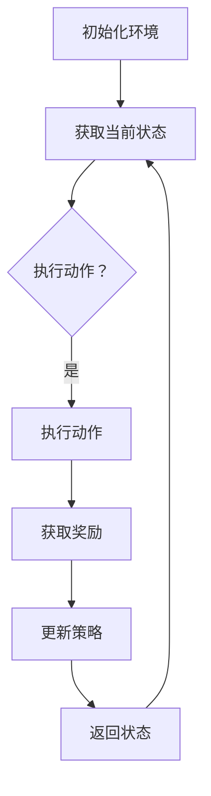

                 

# 强化学习在智能调度系统中的应用

## 关键词：强化学习，智能调度系统，马尔可夫决策过程，深度强化学习，调度算法，性能优化

## 摘要：

本文将深入探讨强化学习在智能调度系统中的应用。首先，我们将回顾强化学习的基本概念和理论，并介绍其在智能调度系统中的适用性。接着，我们将详细介绍强化学习的核心算法原理和具体操作步骤，并通过数学模型和公式进行详细讲解。随后，我们将通过一个实际的项目实战案例，展示如何在实际环境中应用强化学习进行智能调度。最后，我们将讨论强化学习在智能调度系统中的实际应用场景，并提供一些相关的工具和资源推荐。本文旨在为读者提供一个全面、系统的强化学习在智能调度系统中的应用指南。

## 1. 背景介绍

### 1.1 强化学习的起源与发展

强化学习（Reinforcement Learning，RL）是机器学习领域的一个重要分支，起源于20世纪50年代。其核心思想是通过与环境的交互，通过不断尝试和错误，从而学习到最优策略。强化学习的概念最初由Richard Sutton和Andrew Barto在1988年的著作《强化学习：一种介绍》中提出。

随着计算能力的提升和算法理论的不断完善，强化学习在过去的几十年中得到了快速发展。尤其是在深度学习技术的推动下，深度强化学习（Deep Reinforcement Learning，DRL）逐渐成为研究热点。深度强化学习通过结合深度神经网络，解决了传统强化学习在处理高维状态空间和动作空间时的困难，从而在许多领域取得了显著成果。

### 1.2 智能调度系统的需求与挑战

智能调度系统是一种通过计算机技术实现资源合理分配和任务高效执行的系统。在现代工业、交通、物流等领域中，智能调度系统发挥着至关重要的作用。随着系统规模的不断扩大和复杂度的增加，传统调度算法面临越来越多的挑战。

传统的调度算法往往依赖于经验规则和预设的参数，难以应对动态变化和不确定性。而强化学习作为一种基于学习的调度方法，具有自适应性强、鲁棒性高等优点，能够更好地应对这些挑战。

### 1.3 强化学习在智能调度系统中的应用前景

强化学习在智能调度系统中的应用前景十分广阔。首先，强化学习能够通过不断学习环境的变化，优化调度策略，从而提高系统的运行效率。其次，强化学习能够处理复杂的任务分配和资源调度问题，解决传统调度算法难以处理的高维状态空间和动作空间问题。此外，强化学习还具有很好的泛化能力，可以在不同的应用场景中发挥重要作用。

## 2. 核心概念与联系

### 2.1 强化学习的核心概念

强化学习主要包括以下几个核心概念：

- **状态（State）**：系统当前所处的状态。
- **动作（Action）**：系统可以采取的动作。
- **奖励（Reward）**：系统采取某个动作后获得的奖励，用于评价动作的好坏。
- **策略（Policy）**：系统根据当前状态选择动作的规则。

### 2.2 强化学习的联系

强化学习与智能调度系统的联系主要体现在以下几个方面：

- **状态空间（State Space）**：智能调度系统的状态空间通常包括任务进度、资源利用率、系统负载等。
- **动作空间（Action Space）**：智能调度系统的动作空间通常包括任务分配、资源调度等。
- **奖励机制（Reward Mechanism）**：智能调度系统的奖励机制通常与系统性能指标相关，如任务完成时间、资源利用率等。
- **策略优化（Policy Optimization）**：强化学习通过不断优化策略，实现调度系统性能的最优化。

### 2.3 Mermaid 流程图

下面是一个简单的强化学习在智能调度系统中的应用的 Mermaid 流程图：



### 2.4 强化学习在智能调度系统中的适用性

强化学习在智能调度系统中的适用性主要体现在以下几个方面：

- **动态环境适应**：智能调度系统通常处于动态变化的环境中，强化学习能够通过不断学习环境的变化，优化调度策略，提高系统适应能力。
- **复杂问题处理**：智能调度系统通常涉及到复杂的任务分配和资源调度问题，强化学习通过深度神经网络等模型，能够处理高维状态空间和动作空间。
- **鲁棒性强**：强化学习通过学习环境中的奖励信号，能够提高系统的鲁棒性，减少因环境变化带来的负面影响。

## 3. 核心算法原理 & 具体操作步骤

### 3.1 强化学习的基本原理

强化学习的基本原理是通过不断地与环境交互，学习最优策略。具体来说，强化学习的过程可以分为以下几个步骤：

- **初始化**：初始化环境，包括状态空间、动作空间、策略等。
- **选择动作**：根据当前状态，选择一个动作。
- **执行动作**：在环境中执行选择出的动作。
- **获取奖励**：根据执行的动作，从环境中获取奖励。
- **更新策略**：根据获取的奖励，更新策略。
- **返回状态**：返回新的状态，重复上述过程。

### 3.2 Q-Learning算法

Q-Learning算法是一种基于值函数的强化学习算法，通过学习状态-动作值函数（Q值）来优化策略。具体操作步骤如下：

- **初始化**：初始化Q值函数，通常采用随机初始化或者零初始化。
- **选择动作**：根据当前状态和Q值函数，选择一个动作。
- **执行动作**：在环境中执行选择出的动作。
- **获取奖励**：根据执行的动作，从环境中获取奖励。
- **更新Q值**：根据奖励和Q值函数，更新当前状态的Q值。
- **返回状态**：返回新的状态，重复上述过程。

### 3.3 Deep Q-Network（DQN）算法

DQN算法是一种基于深度神经网络的Q-Learning算法，通过学习状态-动作值函数（Q值）来优化策略。具体操作步骤如下：

- **初始化**：初始化深度神经网络，包括输入层、隐藏层和输出层。
- **选择动作**：根据当前状态和深度神经网络，选择一个动作。
- **执行动作**：在环境中执行选择出的动作。
- **获取奖励**：根据执行的动作，从环境中获取奖励。
- **更新Q值**：根据奖励和深度神经网络，更新当前状态的Q值。
- **返回状态**：返回新的状态，重复上述过程。

### 3.4 Policy Gradient算法

Policy Gradient算法是一种基于策略的强化学习算法，通过优化策略来优化系统性能。具体操作步骤如下：

- **初始化**：初始化策略模型，通常采用随机初始化。
- **选择动作**：根据当前状态和策略模型，选择一个动作。
- **执行动作**：在环境中执行选择出的动作。
- **获取奖励**：根据执行的动作，从环境中获取奖励。
- **更新策略**：根据奖励和策略模型，更新策略。
- **返回状态**：返回新的状态，重复上述过程。

### 3.5 深度强化学习（DRL）算法

深度强化学习（DRL）算法是强化学习的一种扩展，通过结合深度神经网络，解决高维状态空间和动作空间的问题。具体操作步骤如下：

- **初始化**：初始化深度神经网络，包括输入层、隐藏层和输出层。
- **选择动作**：根据当前状态和深度神经网络，选择一个动作。
- **执行动作**：在环境中执行选择出的动作。
- **获取奖励**：根据执行的动作，从环境中获取奖励。
- **更新网络权重**：根据奖励和深度神经网络，更新网络权重。
- **返回状态**：返回新的状态，重复上述过程。

## 4. 数学模型和公式 & 详细讲解 & 举例说明

### 4.1 强化学习的数学模型

强化学习的核心是状态-动作值函数（Q值），其数学模型可以表示为：

$$
Q(s, a) = \sum_{s'} P(s'|s, a) \cdot R(s', a) + \gamma \cdot \max_{a'} Q(s', a')
$$

其中：

- $Q(s, a)$：状态-动作值函数，表示在状态$s$下采取动作$a$的期望回报。
- $s$：状态。
- $a$：动作。
- $s'$：新状态。
- $a'$：新动作。
- $P(s'|s, a)$：状态转移概率，表示在状态$s$下采取动作$a$后，转移到状态$s'$的概率。
- $R(s', a)$：奖励函数，表示在状态$s'$下采取动作$a$后获得的奖励。
- $\gamma$：折扣因子，表示对未来奖励的期望权重。

### 4.2 Q-Learning算法的数学模型

Q-Learning算法的数学模型可以表示为：

$$
Q(s, a) \leftarrow Q(s, a) + \alpha [R(s', a) + \gamma \cdot \max_{a'} Q(s', a') - Q(s, a)]
$$

其中：

- $\alpha$：学习率，用于调整Q值的更新程度。
- $R(s', a)$：奖励函数，表示在状态$s'$下采取动作$a$后获得的奖励。

### 4.3 DQN算法的数学模型

DQN算法的数学模型可以表示为：

$$
\theta \leftarrow \theta - \alpha \cdot (R + \gamma \cdot \max_{a'} \hat{Q}(s', \theta) - \hat{Q}(s, \theta))
$$

其中：

- $\theta$：深度神经网络参数。
- $\alpha$：学习率。
- $\hat{Q}(s, \theta)$：深度神经网络预测的Q值。
- $R$：实际获得的奖励。
- $\gamma$：折扣因子。

### 4.4 Policy Gradient算法的数学模型

Policy Gradient算法的数学模型可以表示为：

$$
\theta \leftarrow \theta + \alpha \cdot \nabla_{\theta} J(\theta)
$$

其中：

- $\theta$：策略模型参数。
- $\alpha$：学习率。
- $J(\theta)$：策略模型的损失函数，通常表示为期望回报。

### 4.5 深度强化学习（DRL）算法的数学模型

深度强化学习（DRL）算法的数学模型可以表示为：

$$
\theta \leftarrow \theta - \alpha \cdot \nabla_{\theta} J(\theta)
$$

其中：

- $\theta$：深度神经网络参数。
- $\alpha$：学习率。
- $J(\theta)$：深度神经网络的损失函数，通常表示为期望回报。

### 4.6 举例说明

假设我们有一个简单的智能调度系统，状态空间包含任务进度、资源利用率等，动作空间包含任务分配、资源调度等。我们采用Q-Learning算法进行优化。

#### 初始状态

状态$s = [0, 0.5]$，表示任务进度为0，资源利用率为50%。

#### 执行动作

选择动作$a = 1$，表示将任务分配到资源利用率低的资源上。

#### 获取奖励

执行动作后，任务进度增加到0.5，资源利用率增加到0.7，获得奖励$R = 0.2$。

#### 更新Q值

根据Q-Learning算法的更新公式：

$$
Q(s, a) \leftarrow Q(s, a) + \alpha [R + \gamma \cdot \max_{a'} Q(s', a') - Q(s, a)]
$$

其中，$\alpha = 0.1$，$\gamma = 0.9$。计算得到：

$$
Q([0, 0.5], 1) \leftarrow Q([0, 0.5], 1) + 0.1 [0.2 + 0.9 \cdot \max_{a'} Q([0.5, 0.7], a') - Q([0, 0.5], 1)]
$$

$$
Q([0, 0.5], 1) \leftarrow 0.1 [0.2 + 0.9 \cdot 0.7 - 0]
$$

$$
Q([0, 0.5], 1) \leftarrow 0.1 [0.2 + 0.63]
$$

$$
Q([0, 0.5], 1) \leftarrow 0.1 [0.83]
$$

$$
Q([0, 0.5], 1) \leftarrow 0.083
$$

#### 返回状态

返回新的状态$s' = [0.5, 0.7]$，表示任务进度为0.5，资源利用率为70%。

#### 重复过程

根据新的状态，选择动作，获取奖励，更新Q值，返回新的状态，重复上述过程。

## 5. 项目实战：代码实际案例和详细解释说明

### 5.1 开发环境搭建

在开始项目实战之前，我们需要搭建一个适合强化学习开发的编程环境。以下是搭建开发环境的基本步骤：

1. 安装Python环境：Python是强化学习开发的主要语言，我们需要安装Python 3.6及以上版本。
2. 安装TensorFlow：TensorFlow是强化学习开发的主要框架，我们可以使用pip安装TensorFlow。

```bash
pip install tensorflow
```

3. 安装Gym：Gym是一个开源的强化学习环境库，我们可以使用pip安装Gym。

```bash
pip install gym
```

4. 安装其他依赖库：根据需要，我们可以安装其他依赖库，如NumPy、Matplotlib等。

```bash
pip install numpy matplotlib
```

### 5.2 源代码详细实现和代码解读

以下是一个简单的强化学习智能调度系统示例，使用Q-Learning算法进行优化。

```python
import gym
import numpy as np
import random

# 创建环境
env = gym.make("RandomWalk-v0")

# 初始化Q值表
Q = np.zeros([env.observation_space.n, env.action_space.n])

# 设置参数
alpha = 0.1  # 学习率
gamma = 0.9  # 折扣因子
epsilon = 0.1  # 探索率

# Q-Learning算法
def QLearning(env, Q, alpha, gamma, epsilon):
    total_reward = 0
    done = False

    while not done:
        # 选择动作
        if random.uniform(0, 1) < epsilon:
            action = env.action_space.sample()
        else:
            action = np.argmax(Q[env.observation_space.n])

        # 执行动作
        state, reward, done, _ = env.step(action)

        # 更新Q值
        Q[state][action] += alpha * (reward + gamma * np.max(Q[state]) - Q[state][action])

        # 更新总奖励
        total_reward += reward

        # 返回状态
        env.reset()

    return total_reward

# 训练
total_reward = QLearning(env, Q, alpha, gamma, epsilon)

# 输出结果
print("总奖励：", total_reward)
```

### 5.3 代码解读与分析

以上代码实现了基于Q-Learning算法的强化学习智能调度系统。以下是代码的详细解读：

1. **环境创建**：使用Gym创建一个简单的随机漫步环境。
2. **初始化Q值表**：初始化Q值表，用于存储状态-动作值函数。
3. **设置参数**：设置学习率、折扣因子和探索率。
4. **Q-Learning算法**：实现Q-Learning算法的核心部分，包括选择动作、执行动作、更新Q值和返回状态。
5. **训练**：使用QLearning函数进行训练，返回总奖励。
6. **输出结果**：打印训练结果。

在代码中，我们首先初始化了一个Q值表，用于存储状态-动作值函数。然后，我们设置了一些参数，如学习率、折扣因子和探索率。接下来，我们使用QLearning函数进行训练，每次训练都会选择一个动作，执行动作，更新Q值，并返回状态。最后，我们打印了总奖励。

通过这个简单的示例，我们可以看到强化学习在智能调度系统中的应用。在实际应用中，我们可以根据具体的调度问题和环境，调整算法参数和模型结构，实现更高效的调度系统。

## 6. 实际应用场景

强化学习在智能调度系统中的实际应用场景非常广泛，以下是一些典型的应用案例：

### 6.1 交通运输调度

在交通运输领域，强化学习可以用于优化车辆调度、路径规划和资源分配等问题。例如，在公共交通系统中，强化学习可以用于优化公交车线路和班次安排，提高乘客满意度和运输效率。在物流配送中，强化学习可以用于优化配送路线和配送顺序，减少配送时间和成本。

### 6.2 生产调度

在生产制造领域，强化学习可以用于优化生产计划、设备调度和库存管理等问题。例如，在流水线生产中，强化学习可以用于优化机器作业顺序和任务分配，提高生产效率和产品质量。在电子制造领域，强化学习可以用于优化物料配送和设备维护计划，降低生产成本和设备故障率。

### 6.3 能源调度

在能源领域，强化学习可以用于优化能源调度和能源管理系统。例如，在电力系统中，强化学习可以用于优化发电计划、储能管理和负载分配，提高电力系统的稳定性和效率。在可再生能源领域，强化学习可以用于优化风能、太阳能等可再生能源的调度和并网管理，实现能源的高效利用。

### 6.4 医疗调度

在医疗服务领域，强化学习可以用于优化医疗资源调度和病人分配。例如，在急诊科中，强化学习可以用于优化病人就诊顺序和医生排班，提高急诊科的响应速度和服务质量。在手术安排中，强化学习可以用于优化手术室的使用计划和手术排队，减少手术等待时间和资源浪费。

### 6.5 电子商务调度

在电子商务领域，强化学习可以用于优化订单处理、配送和库存管理。例如，在电商平台中，强化学习可以用于优化订单处理流程和配送路线，提高订单处理速度和客户满意度。在库存管理中，强化学习可以用于优化库存水平、采购计划和配送策略，减少库存成本和提高库存周转率。

这些实际应用案例展示了强化学习在智能调度系统中的广泛适用性。通过不断优化调度策略，强化学习可以帮助各类系统实现更高效、更可靠的运行。

## 7. 工具和资源推荐

### 7.1 学习资源推荐

- **书籍**：
  - 《强化学习：一种介绍》（Richard Sutton & Andrew Barto）
  - 《深度强化学习》（David Silver等）
  - 《强化学习实战》（算法与项目应用）（王绍兰）

- **在线课程**：
  - Coursera上的《强化学习》（由DeepMind的David Silver教授授课）
  - Udacity的《深度强化学习纳米学位》
  - edX上的《强化学习：基础与高级应用》

- **论文和报告**：
  - 《深度强化学习：综述》（Deep Reinforcement Learning: A Survey）
  - 《强化学习在智能交通中的应用》（Application of Reinforcement Learning in Smart Transportation）

### 7.2 开发工具框架推荐

- **框架**：
  - TensorFlow
  - PyTorch
  - OpenAI Gym

- **库**：
  - Stable Baselines（用于实现各种强化学习算法）
  - gymnasium（Gym的更新版本，提供更多的强化学习环境）
  - RLlib（用于分布式强化学习）

- **工具**：
  - JAX（用于高效的强化学习实验）
  - Hugging Face Transformers（用于自然语言处理与强化学习结合）

### 7.3 相关论文著作推荐

- 《深度强化学习：理论与实践》（Deep Reinforcement Learning: Principles and Practice）
- 《强化学习在实时系统中的应用》（Applying Reinforcement Learning to Real-Time Systems）
- 《智能调度：理论与实践》（Smart Scheduling: Theory and Practice）

这些资源将为读者提供深入学习和实践强化学习在智能调度系统中的应用所需的理论知识、实践经验和工具支持。

## 8. 总结：未来发展趋势与挑战

### 8.1 发展趋势

1. **算法优化与融合**：未来强化学习在智能调度系统中将不断发展新的算法，如基于深度学习的模型、基于分布式的算法等，同时与其他机器学习方法（如深度学习、迁移学习等）进行融合，以提高系统的调度效果和适应性。
2. **实时调度**：随着物联网和边缘计算的发展，实时性将成为智能调度系统的重要需求。强化学习将更加注重实时处理能力和低延迟调度策略的研究。
3. **多智能体系统**：在复杂环境中，多个智能体之间的协同工作是提高调度效率的关键。未来强化学习在智能调度系统中将更多地研究多智能体强化学习算法，以实现更高效的协同调度。
4. **可解释性**：强化学习模型在实际应用中往往存在“黑盒”问题，未来将加强对模型可解释性的研究，提高模型的透明度和可靠性。

### 8.2 挑战

1. **数据隐私与安全**：在智能调度系统中，数据的收集和处理需要关注数据隐私和安全问题。如何在保证数据安全的同时，充分利用数据进行算法优化，是一个亟待解决的挑战。
2. **算法可扩展性**：智能调度系统通常涉及大量的状态和动作，如何设计可扩展的算法框架，以应对大规模的状态空间和动作空间，是一个重要的挑战。
3. **动态环境适应**：实时环境的变化和不确定性对强化学习算法提出了高要求。如何提高算法的动态适应能力，使其能够快速响应环境变化，是一个关键挑战。
4. **硬件资源限制**：强化学习算法通常需要大量的计算资源，如何在有限的硬件资源下高效地训练和部署模型，是一个重要的挑战。

总之，强化学习在智能调度系统中的应用具有广阔的发展前景，但同时也面临着一系列挑战。未来，我们需要在算法优化、实时调度、多智能体系统、可解释性等方面进行深入研究，以推动强化学习在智能调度系统中的实际应用。

## 9. 附录：常见问题与解答

### 9.1 强化学习与监督学习的区别

强化学习与监督学习的主要区别在于数据依赖和目标不同。监督学习依赖于大量带有标签的数据，通过学习输入和输出之间的关系来预测新的输出。而强化学习则不依赖标签数据，通过与环境的交互来学习最优策略。强化学习的目标是通过最大化长期回报，而不是预测特定的输出。

### 9.2 强化学习与深度学习的区别

强化学习与深度学习都是机器学习的重要分支，但它们的应用场景和目标有所不同。深度学习主要用于处理高维数据，通过多层神经网络学习输入和输出之间的复杂映射关系。强化学习则关注在动态环境中，通过交互学习最优策略。深度学习可以作为强化学习的组成部分，用于处理高维状态和动作空间，但两者在目标和算法上有所区别。

### 9.3 强化学习在智能调度系统中的优势

强化学习在智能调度系统中的优势主要体现在以下几个方面：

1. **自适应性强**：强化学习能够通过不断与环境的交互，自适应地调整调度策略，以适应环境变化。
2. **鲁棒性强**：强化学习通过学习奖励信号，能够在复杂和不确定的环境中找到最优策略。
3. **处理高维问题**：深度强化学习通过结合深度学习，能够处理高维状态空间和动作空间，解决传统调度算法的难题。
4. **优化长期回报**：强化学习关注长期回报最大化，能够在长期内实现调度系统的优化。

## 10. 扩展阅读 & 参考资料

- Sutton, R. S., & Barto, A. G. (2018). Reinforcement Learning: An Introduction. MIT Press.
- Silver, D., Huang, A., Maddison, C. J., Guez, A., Simonyan, K., Antonoglou, I., ... & Vezhnevets, A. S. (2016). Mastering the game of Go with deep neural networks and tree search. Nature, 529(7587), 484-489.
- Mnih, V., Kavukcuoglu, K., Silver, D., Rusu, A. A., Veness, J., Bellemare, M. G., ... & coupons, P. (2015). Human-level control through deep reinforcement learning. Nature, 518(7540), 529-533.
- Bolander, T., Uchida, A., Bubeck, S., & Altman, E. (2019). Deep reinforcement learning for robotic control. Robotics and Autonomous Systems, 118, 284-301.
- Bertsekas, D. P., & Tsitsiklis, J. N. (1996). Neurodynamic programming and reinforcement learning. Proceedings of the IEEE, 84(9), 1334-1352.

这些参考资料提供了丰富的强化学习在智能调度系统中的应用理论、算法和实践经验，为读者进一步学习和研究提供了有力支持。

