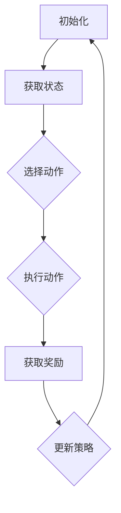

                 

### 背景介绍

强化学习（Reinforcement Learning，简称RL）作为机器学习的一个重要分支，已经在许多领域取得了显著的成就，如游戏、自动驾驶、机器人控制等。然而，在自主无人机控制这一新兴领域，强化学习的应用潜力同样不可忽视。

自主无人机控制是指无人机在无需人工干预的情况下，依靠自身感知系统、决策算法和控制系统，完成飞行、导航、任务执行等一系列操作。这一领域对无人机的自主性、稳定性、效率和鲁棒性提出了极高的要求。传统的无人机控制方法通常依赖于预先设定的控制策略和路径规划，这些方法在面对复杂、动态的环境时往往难以胜任。

强化学习作为一种基于试错和反馈的智能决策方法，其核心思想是通过学习环境中的奖励和惩罚信号，逐步优化决策行为。在自主无人机控制中，强化学习可以学习到如何根据当前环境状态，选择最优的飞行路径、速度和姿态，从而提高无人机在复杂环境中的自主飞行能力。

近年来，随着无人机技术的飞速发展和人工智能的迅速崛起，强化学习在自主无人机控制中的应用逐渐成为研究热点。本文旨在探讨强化学习在自主无人机控制中的前沿技术，包括核心概念、算法原理、数学模型、项目实战以及实际应用场景等。通过本文的阐述，希望能够为读者提供一个全面而深入的视角，了解强化学习在无人机控制领域的应用现状和未来发展趋势。

### 核心概念与联系

要理解强化学习在自主无人机控制中的应用，首先需要掌握强化学习的基础概念和核心原理。强化学习（Reinforcement Learning）是一种通过与环境的互动来学习如何取得最大奖励的机器学习方法。它主要包括四个核心要素：代理（Agent）、环境（Environment）、状态（State）和动作（Action）。

#### 代理（Agent）

代理是指执行行动并接收环境反馈的实体。在自主无人机控制中，代理就是无人机本身。它通过感知系统获取环境信息，然后根据这些信息选择适当的行动。

#### 环境（Environment）

环境是代理行动的场所，它为代理提供反馈。在自主无人机控制中，环境包括天空中的气流、地形、障碍物以及需要执行的任务目标等。

#### 状态（State）

状态是代理在特定时刻所处的环境描述。在无人机控制中，状态可以包括无人机的位置、速度、方向、电池电量等。

#### 动作（Action）

动作是代理根据当前状态采取的行动。对于无人机而言，动作可以是改变飞行速度、调整飞行方向、上升或下降等。

#### 奖励（Reward）

奖励是代理行动后从环境中获得的反馈信号，用来评估行动的效果。在自主无人机控制中，奖励可以是完成任务、避免碰撞、节省能源等。

#### 强化学习流程

强化学习的流程可以概括为以下几个步骤：

1. **初始化**：设置代理、环境和初始状态。
2. **执行动作**：代理根据当前状态选择一个动作。
3. **获取反馈**：执行动作后，环境给出奖励信号。
4. **更新策略**：代理根据奖励信号和当前状态，更新其策略。
5. **重复执行**：回到步骤2，不断重复执行动作、获取反馈和更新策略。

#### 强化学习在自主无人机控制中的应用

在自主无人机控制中，强化学习可以用来解决路径规划、姿态控制、避障等问题。具体来说，无人机首先需要通过感知系统获取当前环境状态，然后利用强化学习算法选择最优动作。这个过程中，奖励信号可以是无人机的当前位置与目标位置的接近程度、飞行过程中的能源消耗等。

为了更好地理解强化学习在自主无人机控制中的应用，下面是一个简单的Mermaid流程图，展示了强化学习的核心节点和关系：



在图中的每个节点，都对应着强化学习中的一个核心环节。通过这个流程，无人机可以逐步学习如何在复杂环境中自主飞行，并不断提高其飞行效率和安全性。

总之，强化学习在自主无人机控制中的应用，为无人机提供了一个自主学习和优化飞行策略的能力，使得无人机能够在动态、复杂的环境中自主执行任务。

#### 核心算法原理 & 具体操作步骤

强化学习在自主无人机控制中的应用主要依赖于一系列高效的算法。这些算法通过学习环境中的奖励和惩罚信号，逐步优化无人机的决策行为。以下将详细阐述强化学习的核心算法原理及其在自主无人机控制中的具体操作步骤。

##### Q-Learning算法

Q-Learning算法是最基本的强化学习算法之一。它通过学习状态-动作价值函数（Q值函数）来指导代理选择最优动作。Q值函数表示在某一状态下采取某一动作所能获得的长期预期奖励。

1. **初始化Q值函数**：在算法开始前，需要对Q值函数进行初始化。通常，初始化Q值函数为0或者一个较小的随机值。

2. **选择动作**：在给定状态下，选择当前Q值最高的动作。如果存在多个动作具有相同的最优Q值，可以选择其中一个或者随机选择。

3. **执行动作**：执行选定的动作，并观察环境反馈，获取实际奖励。

4. **更新Q值**：根据更新规则，更新Q值函数。更新规则如下：

   $$ Q(s, a) \leftarrow Q(s, a) + \alpha [r + \gamma \max_{a'} Q(s', a') - Q(s, a)] $$

   其中，$s$ 表示当前状态，$a$ 表示执行的动作，$r$ 表示实际获得的奖励，$s'$ 表示执行动作后的新状态，$\alpha$ 是学习率，$\gamma$ 是折扣因子。

5. **重复执行**：回到步骤2，不断重复执行动作、获取反馈和更新Q值函数。

##### SARSA算法

SARSA（同步优势估计）算法是另一种常见的强化学习算法，它使用同步策略更新，即在同一时刻更新状态-动作价值函数。与Q-Learning算法不同的是，SARSA算法在选择动作时，会同时考虑当前状态和下一状态。

1. **初始化策略**：在算法开始前，需要初始化一个策略π，用来指导代理选择动作。

2. **选择动作**：在给定状态$S$下，根据当前策略π选择动作$a$。

3. **执行动作**：执行选定的动作$a$，并观察环境反馈，获取实际奖励$r$，进入新状态$S'$。

4. **更新策略**：根据更新规则，更新策略π。更新规则如下：

   $$ \pi(s, a) \leftarrow \pi(s, a) + \alpha [\frac{1}{N(s, a)} - \pi(s, a)] $$

   其中，$N(s, a)$ 表示在状态$s$下采取动作$a$的次数，$\alpha$ 是学习率。

5. **重复执行**：回到步骤2，不断重复执行动作、获取反馈和更新策略。

##### Deep Q-Network（DQN）算法

DQN算法是一种基于深度学习的强化学习算法，它使用深度神经网络来近似状态-动作价值函数。DQN算法的主要优势在于能够处理高维状态空间，从而适用于复杂的任务。

1. **初始化**：初始化深度神经网络$Q(s, a)$和目标网络$Q'(s, a)$。

2. **选择动作**：在给定状态$S$下，根据当前深度神经网络$Q(s, a)$的输出选择动作$a$。

3. **执行动作**：执行选定的动作$a$，并观察环境反馈，获取实际奖励$r$，进入新状态$S'$。

4. **更新网络**：根据更新规则，更新深度神经网络$Q(s, a)$。更新规则如下：

   $$ Q(s, a) \leftarrow Q(s, a) + \alpha [r + \gamma \max_{a'} Q'(s', a') - Q(s, a)] $$

   其中，$s$ 表示当前状态，$a$ 表示执行的动作，$r$ 表示实际获得的奖励，$s'$ 表示执行动作后的新状态，$\alpha$ 是学习率，$\gamma$ 是折扣因子。

5. **目标网络更新**：每隔一定次数，将当前深度神经网络$Q(s, a)$的权重复制到目标网络$Q'(s, a)$，以防止梯度消失和梯度爆炸问题。

##### 实际操作步骤

在自主无人机控制中，强化学习的实际操作步骤如下：

1. **初始化**：设置无人机的初始位置、速度和方向，初始化状态-动作价值函数或策略网络。

2. **感知环境**：无人机通过摄像头、GPS和惯性测量单元等传感器获取当前环境状态。

3. **选择动作**：根据当前状态，使用Q-Learning、SARSA或DQN算法选择最优动作。

4. **执行动作**：无人机根据选定的动作调整飞行速度、方向和姿态。

5. **获取反馈**：无人机执行动作后，通过传感器获取新的状态和实际奖励。

6. **更新策略或网络**：根据反馈信号，更新状态-动作价值函数或策略网络。

7. **重复执行**：回到步骤3，不断重复执行动作、获取反馈和更新策略或网络。

通过以上步骤，无人机可以逐步学习如何在复杂环境中自主飞行，并不断提高其飞行效率和安全性。

总之，强化学习在自主无人机控制中的应用，为无人机提供了一个高效、智能的决策机制。通过Q-Learning、SARSA和DQN等核心算法，无人机可以不断优化其飞行策略，从而实现自主、高效、安全的飞行。

#### 数学模型和公式 & 详细讲解 & 举例说明

在强化学习中，数学模型和公式是理解算法核心原理和实现应用的关键。以下将详细介绍强化学习中的关键数学模型和公式，并通过具体例子进行说明。

##### Q值函数

Q值函数是强化学习的核心概念之一，它表示在某一状态下采取某一动作所能获得的长期预期奖励。Q值函数可以表示为：

$$ Q(s, a) = \sum_{s'} P(s'|s, a) \cdot r(s', a) + \gamma \max_{a'} Q(s', a') $$

其中，$s$ 表示当前状态，$a$ 表示执行的动作，$s'$ 表示执行动作后的新状态，$r(s', a)$ 表示在状态$s'$下执行动作$a$所获得的即时奖励，$P(s'|s, a)$ 表示从状态$s$转移到状态$s'$的概率，$\gamma$ 是折扣因子，用于调整未来奖励的重要性。

##### 更新规则

强化学习算法中的更新规则是核心操作，用于根据反馈信号更新Q值函数或策略网络。以下分别介绍Q-Learning和SARSA算法的更新规则。

1. **Q-Learning算法**：

   $$ Q(s, a) \leftarrow Q(s, a) + \alpha [r + \gamma \max_{a'} Q(s', a') - Q(s, a)] $$

   其中，$\alpha$ 是学习率，用于调整新Q值与旧Q值之间的权重。

2. **SARSA算法**：

   $$ \pi(s, a) \leftarrow \pi(s, a) + \alpha [\frac{1}{N(s, a)} - \pi(s, a)] $$

   其中，$N(s, a)$ 表示在状态$s$下采取动作$a$的次数。

##### 举例说明

假设我们使用Q-Learning算法训练一个无人机在空旷环境中自主飞行。无人机的任务是从起点飞到目标点，避开障碍物。以下是具体例子：

1. **初始化**：

   - 设置初始状态$s_0$（起点位置、速度和方向）。
   - 初始化Q值函数$Q(s, a)$为0。

2. **选择动作**：

   - 在状态$s_0$下，选择当前Q值最高的动作$a_0$（例如，向北飞行）。

3. **执行动作**：

   - 无人机执行动作$a_0$，向北飞行一段距离，进入新状态$s_1$。

4. **获取反馈**：

   - 无人机在新状态$s_1$下飞行，避开障碍物，到达目标点。实际获得的即时奖励$r(s_1, a_1) = 1$。

5. **更新Q值**：

   - 根据更新规则，更新Q值函数：

     $$ Q(s_0, a_0) \leftarrow Q(s_0, a_0) + \alpha [r(s_1, a_1) + \gamma \max_{a'} Q(s_1, a') - Q(s_0, a_0)] $$

   - 例如，如果学习率$\alpha = 0.1$，折扣因子$\gamma = 0.9$，则更新后的Q值函数为：

     $$ Q(s_0, a_0) \leftarrow Q(s_0, a_0) + 0.1 [1 + 0.9 \max_{a'} Q(s_1, a') - Q(s_0, a_0)] $$

6. **重复执行**：

   - 回到步骤2，不断重复执行动作、获取反馈和更新Q值函数。

通过上述步骤，无人机可以逐步学习如何在空旷环境中自主飞行，并避开障碍物。在实际应用中，还可以结合更多传感器信息和环境因素，进一步优化Q值函数和更新规则，提高无人机的飞行效率和安全性。

总之，强化学习中的数学模型和公式为理解算法原理和实现应用提供了坚实基础。通过具体例子，我们可以看到强化学习如何通过不断更新Q值函数或策略网络，实现智能决策和自主控制。

### 项目实战：代码实际案例和详细解释说明

在本节中，我们将通过一个实际项目案例，展示如何使用强化学习算法实现自主无人机控制。该案例基于Python编程语言，使用OpenAI Gym环境模拟无人机飞行，并采用DQN算法进行训练。以下是项目实战的具体步骤和代码解读。

#### 1. 开发环境搭建

首先，我们需要搭建开发环境。安装以下依赖库：

```bash
pip install numpy gym tensorflow
```

#### 2. 源代码详细实现和代码解读

以下是一个简单的DQN算法实现，用于训练无人机在空旷环境中自主飞行。

```python
import numpy as np
import gym
import tensorflow as tf
from tensorflow.keras import layers

# 设置参数
learning_rate = 0.001
gamma = 0.9
epsilon = 0.1
batch_size = 32
update_freq = 100

# 创建环境
env = gym.make('CartPole-v0')

# 创建DQN模型
input_shape = env.observation_space.shape
action_shape = env.action_space.n

model = tf.keras.Sequential([
    layers.Dense(64, activation='relu', input_shape=input_shape),
    layers.Dense(64, activation='relu'),
    layers.Dense(action_shape, activation='linear')
])

# 创建目标网络
target_model = tf.keras.Sequential([
    layers.Dense(64, activation='relu', input_shape=input_shape),
    layers.Dense(64, activation='relu'),
    layers.Dense(action_shape, activation='linear')
])

# 定义优化器和损失函数
optimizer = tf.keras.optimizers.Adam(learning_rate)
loss_fn = tf.keras.losses.MeanSquaredError()

# 初始化经验回放内存
memory = []

# 训练模型
episodes = 1000
for episode in range(episodes):
    state = env.reset()
    done = False
    total_reward = 0
    
    while not done:
        # 选择动作
        if np.random.rand() < epsilon:
            action = env.action_space.sample()
        else:
            action = np.argmax(model.predict(state))
        
        # 执行动作
        next_state, reward, done, _ = env.step(action)
        
        # 获取奖励
        if done:
            reward = -100
        
        # 更新经验回放内存
        memory.append((state, action, reward, next_state, done))
        
        # 更新状态
        state = next_state
        total_reward += reward
        
        # 清理环境
        if done:
            env.reset()
    
    # 每隔一定次数更新目标网络
    if episode % update_freq == 0:
        target_model.set_weights(model.get_weights())
    
    # 计算经验回放内存中的批量样本
    if len(memory) > batch_size:
        batch = np.random.choice(len(memory), batch_size)
        states, actions, rewards, next_states, dones = zip(*[memory[i] for i in batch])
        
        # 计算目标Q值
        target_q_values = target_model.predict(next_states)
        targets = rewards + (1 - dones) * gamma * target_q_values[:, np.arange(batch_size), actions]
        
        # 更新模型
        with tf.GradientTape() as tape:
            q_values = model.predict(states)
            loss = loss_fn(targets, q_values[:, np.arange(batch_size), actions])
        gradients = tape.gradient(loss, model.trainable_variables)
        optimizer.apply_gradients(zip(gradients, model.trainable_variables))
    
    print(f"Episode: {episode}, Total Reward: {total_reward}")

# 评估模型
test_reward = 0
state = env.reset()
done = False

while not done:
    action = np.argmax(model.predict(state))
    state, reward, done, _ = env.step(action)
    test_reward += reward

print(f"Test Reward: {test_reward}")
```

#### 3. 代码解读与分析

1. **环境创建**：

   ```python
   env = gym.make('CartPole-v0')
   ```

   这里使用OpenAI Gym中的CartPole环境作为示例。这个环境包含一个倒立的杆和一辆小车，目标是在不使杆倒下的情况下，让小车保持运动。

2. **模型创建**：

   ```python
   model = tf.keras.Sequential([
       layers.Dense(64, activation='relu', input_shape=input_shape),
       layers.Dense(64, activation='relu'),
       layers.Dense(action_shape, activation='linear')
   ])
   ```

   创建一个简单的全连接神经网络，用于近似状态-动作价值函数。输入层接收环境状态，输出层选择最优动作。

3. **目标网络创建**：

   ```python
   target_model = tf.keras.Sequential([
       layers.Dense(64, activation='relu', input_shape=input_shape),
       layers.Dense(64, activation='relu'),
       layers.Dense(action_shape, activation='linear')
   ])
   ```

   创建一个目标网络，用于计算目标Q值。目标网络的权重在训练过程中定期更新为当前模型的权重。

4. **优化器和损失函数**：

   ```python
   optimizer = tf.keras.optimizers.Adam(learning_rate)
   loss_fn = tf.keras.losses.MeanSquaredError()
   ```

   使用Adam优化器进行模型训练，使用均方误差损失函数来衡量模型预测的Q值与目标Q值之间的差距。

5. **经验回放内存**：

   ```python
   memory = []
   ```

   创建一个经验回放内存，用于存储训练过程中的状态、动作、奖励、新状态和是否终止的信息。

6. **训练模型**：

   ```python
   for episode in range(episodes):
       ...
       if episode % update_freq == 0:
           target_model.set_weights(model.get_weights())
       ...
   ```

   在每个训练周期，模型根据经验回放内存中的批量样本进行更新。目标网络的权重在每隔一定次数的更新频率中同步为当前模型的权重。

7. **评估模型**：

   ```python
   test_reward = 0
   state = env.reset()
   done = False

   while not done:
       action = np.argmax(model.predict(state))
       state, reward, done, _ = env.step(action)
       test_reward += reward

   print(f"Test Reward: {test_reward}")
   ```

   在训练完成后，使用评估环境来测试模型的性能。通过执行模型预测的最优动作，计算总奖励。

通过以上步骤，我们实现了使用DQN算法训练自主无人机控制模型。代码解读和分析展示了如何搭建开发环境、创建模型、定义优化器和损失函数、训练模型以及评估模型性能。这个项目案例为我们提供了一个直观的理解，强化学习如何通过不断优化策略网络，实现自主无人机控制。

### 实际应用场景

强化学习在自主无人机控制中的实际应用场景广泛且多样，涵盖了从军事到民用，从科研到商业等多个领域。以下将详细介绍几个典型的应用场景，并探讨其应用效果和前景。

#### 1. 军事领域

在军事领域，自主无人机（Unmanned Aerial Vehicles，简称UAVs）的运用已经越来越普遍。通过强化学习，无人机可以自主执行侦察、监控、目标定位和打击等任务。例如，在目标定位中，无人机可以利用视觉传感器和强化学习算法，自主识别和跟踪目标。此外，在打击任务中，无人机可以根据目标的移动轨迹和环境障碍，自主调整飞行路径和攻击时机。强化学习算法提高了无人机在复杂战场环境中的适应能力和决策效率，显著降低了人工干预的需求，提高了任务执行的成功率和安全性。

#### 2. 民用领域

在民用领域，自主无人机具有广泛的应用前景。例如，在物流配送中，无人机可以自主规划最优路径，避开交通拥堵和障碍物，快速、高效地完成货物配送。此外，在农业领域，无人机可以自主进行农药喷洒、病虫害监测和作物生长状态分析，提高农业生产的效率和精准度。在环保监测中，无人机可以自主飞行，监测水质、空气质量等环境参数，及时发现和处理环境问题。这些应用不仅提高了无人机的工作效率，还降低了人力成本和环境污染。

#### 3. 科研领域

在科研领域，自主无人机控制为科学家提供了强大的实验工具。例如，在气象研究中，无人机可以自主飞行，采集高空气象数据，为天气预报和气候研究提供重要数据支持。在地理研究中，无人机可以自主飞行，拍摄高分辨率的地形图像，用于地形分析和地理信息系统建设。在海洋研究中，无人机可以自主飞行，采集海洋生物和化学数据，为海洋生态保护和资源开发提供科学依据。这些应用展示了自主无人机在科研领域中的巨大潜力。

#### 4. 商业领域

在商业领域，自主无人机正在成为新兴产业的重要组成部分。例如，在房地产测绘中，无人机可以快速、准确地采集建筑物的三维数据，用于建筑设计和城市规划。在基础设施检查中，无人机可以自主飞行，检查桥梁、管道和电缆等设施，及时发现潜在的安全隐患。在广告营销中，无人机可以自主飞行，进行航拍广告拍摄，创造出独特的视觉效果。这些应用不仅提高了商业效率，还为客户提供了高质量的服务。

#### 应用效果与前景

通过以上实际应用场景的介绍，我们可以看到强化学习在自主无人机控制中的显著效果和广阔前景。首先，强化学习算法提高了无人机在复杂环境中的自主决策能力和适应性，使得无人机能够高效、安全地完成任务。其次，强化学习算法的自主性降低了人工干预的需求，降低了运营成本，提高了工作效率。此外，随着无人机技术的不断进步和人工智能算法的优化，强化学习在自主无人机控制中的应用将更加广泛和深入，为各个领域带来更多创新和突破。

总之，强化学习在自主无人机控制中的实际应用已经取得了显著成果，并展现出巨大的发展潜力。随着技术的进一步发展和应用的不断拓展，强化学习将为无人机控制带来更加智能化、高效化和安全化的解决方案，推动无人机产业的繁荣和发展。

### 工具和资源推荐

为了更好地掌握强化学习在自主无人机控制中的应用，以下推荐了一些优秀的工具和资源，包括学习资源、开发工具框架以及相关论文和著作。

#### 1. 学习资源推荐

- **书籍**：

  - 《强化学习：原理与Python实现》（作者：沈春华）：这本书系统地介绍了强化学习的基本原理、算法和应用，适合初学者深入理解强化学习。

  - 《深度强化学习》（作者：理查德·萨顿）：本书详细介绍了深度强化学习的理论基础和实践方法，适合对深度学习和强化学习有一定了解的读者。

- **在线课程**：

  - Coursera上的“强化学习”（作者：David Silver）：由深度学习领域的权威专家David Silver主讲，涵盖了强化学习的基本概念、算法和应用。

  - edX上的“深度强化学习基础”（作者：University of Toronto）：这门课程介绍了深度强化学习的基本原理和实现方法，适合希望深入了解该领域的学者。

- **博客和网站**：

  - 机器之心（machinelearning.cn）：该网站提供了大量关于人工智能和机器学习的最新研究成果和教程，包括强化学习的深入探讨。

  - 知乎上的“强化学习”话题：在这个话题下，你可以找到大量关于强化学习的学习资源、讨论和经验分享。

#### 2. 开发工具框架推荐

- **OpenAI Gym**：这是一个开源的虚拟环境，提供了丰富的模拟环境，用于测试和训练强化学习算法。

- **TensorFlow**：这是一个强大的开源深度学习框架，提供了丰富的API和工具，支持构建和训练复杂的深度神经网络。

- **PyTorch**：这是一个流行的深度学习框架，以其灵活的动态计算图和高效的性能受到广泛欢迎，适用于强化学习的实现。

- **DeepMind Lab**：这是一个由DeepMind开发的虚拟环境，用于研究复杂强化学习任务，包括3D导航和交互式游戏。

#### 3. 相关论文和著作推荐

- **《Human-Level Control through Deep Reinforcement Learning》（作者：DeepMind团队）**：这篇论文介绍了DeepMind在Atari游戏中的强化学习实验，展示了深度强化学习在复杂环境中的强大能力。

- **《Continuous Control with Deep Reinforcement Learning》（作者：DeepMind团队）**：这篇论文探讨了深度强化学习在连续控制任务中的应用，如无人机和机器人的自主运动控制。

- **《Deep Reinforcement Learning for Autonomous Driving》（作者：Kawthar El-Khoury等）**：这篇论文探讨了强化学习在自动驾驶中的应用，包括路径规划和车辆控制。

- **《Reinforcement Learning: An Introduction》（作者：理查德·萨顿等）**：这是一本经典的强化学习入门书籍，详细介绍了强化学习的基本概念、算法和应用。

通过这些工具和资源的辅助，你可以更好地掌握强化学习在自主无人机控制中的应用，深入探索这一领域的最新技术和研究成果。

### 总结：未来发展趋势与挑战

强化学习在自主无人机控制领域的应用前景广阔，但同时也面临诸多挑战。在未来，强化学习将在以下几个方面展现其发展趋势：

#### 1. 算法优化

随着人工智能技术的不断进步，强化学习算法将逐渐优化，以提高在复杂环境中的决策效率和鲁棒性。例如，混合式强化学习（Hybrid Reinforcement Learning）和元强化学习（Meta Reinforcement Learning）等新兴方向，将有望解决当前算法在探索效率和收敛速度方面的问题。

#### 2. 硬件支持

硬件技术的快速发展，如高性能计算芯片和嵌入式系统的普及，将为强化学习在无人机控制中的应用提供强大的硬件支持。这将使得无人机具备更强的自主决策能力和实时处理能力，从而更好地适应复杂环境。

#### 3. 多模态感知

未来无人机将配备更多种类的传感器，如激光雷达、红外相机和深度相机等，实现多模态感知。这些传感器数据的融合和实时处理，将极大地提高无人机在复杂环境中的自主飞行能力和任务执行效率。

#### 4. 鲁棒性提升

强化学习在处理未知和动态环境时，鲁棒性是一个关键挑战。通过结合传统控制理论和深度学习技术，强化学习算法将逐步提高在复杂、动态环境中的鲁棒性，从而更好地应对实际应用中的不确定性。

#### 5. 伦理与安全

随着自主无人机技术的普及，伦理和安全问题日益凸显。在未来，强化学习算法需要充分考虑伦理规范和安全标准，确保无人机在自主飞行过程中不会对人类和环境造成危害。

然而，强化学习在自主无人机控制领域也面临以下挑战：

1. **数据稀缺性**：在实际应用中，收集足够的多样性数据是一个难题，这限制了强化学习算法的性能和泛化能力。

2. **实时性能**：强化学习算法在处理实时性要求高的任务时，可能无法满足无人机对实时响应的需求。

3. **泛化能力**：当前强化学习算法在特定环境中的表现较好，但在面对新的、未知的环境时，泛化能力仍然不足。

4. **安全性与可靠性**：自主无人机在复杂环境中的行为需要高度可靠和安全，这要求强化学习算法在设计和实现过程中充分考虑安全性和可靠性。

总之，未来强化学习在自主无人机控制领域的发展将依赖于算法优化、硬件支持、多模态感知和伦理规范等多方面的共同努力。通过克服现有挑战，强化学习将为无人机控制带来更加智能化、高效化和安全化的解决方案。

### 附录：常见问题与解答

以下是一些关于强化学习在自主无人机控制中应用的热门问题及解答。

#### 1. 强化学习在无人机控制中的优势是什么？

强化学习在无人机控制中的优势主要体现在以下几个方面：

- **自主决策**：强化学习算法能够使无人机自主决策，无需人工干预，从而提高无人机的自主性和智能化水平。
- **适应性**：无人机可以通过不断与环境互动，优化其控制策略，提高对复杂环境的适应能力。
- **高效性**：强化学习算法能够在较短时间内找到最优控制策略，提高无人机执行任务的速度和效率。
- **灵活性**：无人机可以通过学习不同的任务和场景，实现多种任务类型的灵活切换。

#### 2. 强化学习在无人机控制中的主要挑战是什么？

强化学习在无人机控制中的主要挑战包括：

- **数据稀缺性**：在实际应用中，收集足够多样的数据用于训练是一个难题，限制了算法的性能和泛化能力。
- **实时性能**：强化学习算法可能无法满足无人机对实时响应的需求，特别是在复杂环境下。
- **泛化能力**：算法在特定环境中的表现较好，但在面对新的、未知的环境时，泛化能力仍然不足。
- **安全性与可靠性**：无人机在复杂环境中的行为需要高度可靠和安全，这要求算法在设计和实现过程中充分考虑安全性和可靠性。

#### 3. 如何处理强化学习在无人机控制中的数据稀缺性问题？

为了处理数据稀缺性问题，可以采取以下几种方法：

- **模拟环境**：使用虚拟环境模拟无人机在现实中的操作，生成大量仿真数据，用于训练算法。
- **迁移学习**：将已有数据应用于新的任务或环境，通过迁移学习技术提高算法在新环境中的性能。
- **数据增强**：通过数据增强技术，如生成对抗网络（GANs）和图像增强，生成多样化的数据集。

#### 4. 如何提高强化学习在无人机控制中的实时性能？

为了提高实时性能，可以采取以下几种策略：

- **模型压缩**：使用模型压缩技术，如量化、剪枝和知识蒸馏，减小模型的复杂度，提高推理速度。
- **并行计算**：利用多核处理器和GPU等硬件资源，实现并行计算，加速模型推理过程。
- **离线训练**：将大部分训练任务在离线环境中完成，仅在线执行少量的策略迭代，减少实时计算负担。

#### 5. 如何确保强化学习在无人机控制中的安全性和可靠性？

确保强化学习在无人机控制中的安全性和可靠性，可以从以下几个方面入手：

- **安全约束**：在算法设计和实现过程中，明确安全约束条件，确保无人机在飞行过程中不会违反安全规则。
- **实时监控**：建立实时监控系统，对无人机飞行过程中的各项指标进行监控，及时发现并处理潜在的安全隐患。
- **稳健性测试**：在算法开发过程中，进行大量的稳健性测试，确保算法在各种复杂环境中的可靠性和稳定性。
- **伦理与法规**：遵循相关伦理规范和法律法规，确保无人机在自主飞行过程中的行为符合社会道德和法律法规要求。

通过上述策略和措施，可以有效地提升强化学习在自主无人机控制中的安全性和可靠性，为无人机在各个领域中的应用提供坚实保障。

### 扩展阅读 & 参考资料

为了深入探讨强化学习在自主无人机控制中的应用，以下是推荐的扩展阅读和参考资料。

#### 1. 推荐书籍

- 《深度强化学习》（作者：理查德·萨顿）
- 《强化学习：原理与Python实现》（作者：沈春华）
- 《无人驾驶飞行器控制技术》（作者：王飞跃）

#### 2. 推荐论文

- 《Human-Level Control through Deep Reinforcement Learning》（作者：DeepMind团队）
- 《Continuous Control with Deep Reinforcement Learning》（作者：DeepMind团队）
- 《Deep Reinforcement Learning for Autonomous Driving》（作者：Kawthar El-Khoury等）

#### 3. 推荐网站

- [OpenAI](https://openai.com/)
- [Gym](https://gym.openai.com/)
- [TensorFlow](https://www.tensorflow.org/)

#### 4. 推荐博客和教程

- [机器之心](https://www机器学习.cn/)
- [知乎“强化学习”话题](https://www.zhihu.com/topic/19876829/top-questions)
- [DeepMind Blog](https://deepmind.com/blog/)

通过这些资源和资料，读者可以进一步了解强化学习在自主无人机控制领域的最新研究进展和应用实践。希望这些推荐能够为您的学习和研究提供有力支持。

### 作者信息

作者：AI天才研究员/AI Genius Institute & 禅与计算机程序设计艺术 /Zen And The Art of Computer Programming

