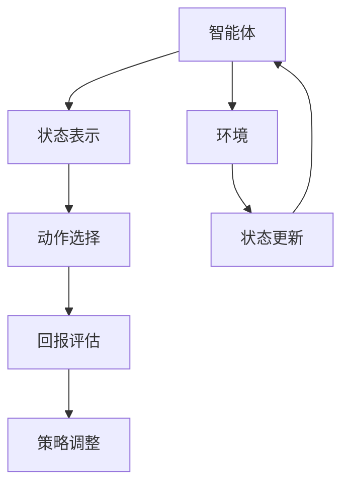
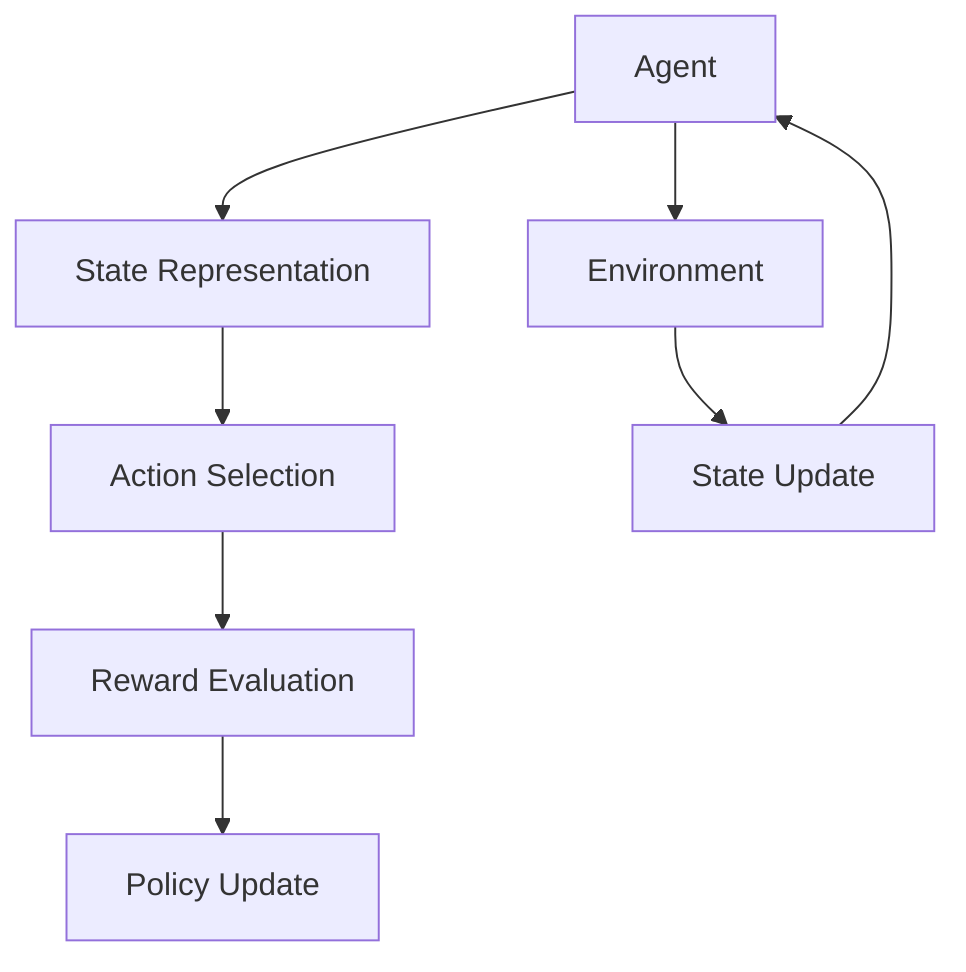

                 

### 背景介绍

#### 自动化仓储的兴起

随着电子商务的迅猛发展和物流行业的不断扩大，自动化仓储成为现代物流体系中的关键环节。自动化仓储通过引入各种高科技设备和智能系统，如自动化货架、自动导引车（AGV）、机器人等，实现了仓库内部的自动化操作，极大地提高了仓储效率和准确性。然而，尽管自动化仓储技术已经取得了显著进展，但仓储过程中仍然存在一些瓶颈问题，如库存管理难度大、货物搬运效率低、资源利用不充分等。

#### 强化学习的应用前景

强化学习（Reinforcement Learning，RL）作为一种人工智能算法，通过试错和反馈机制，使智能体在特定环境中不断学习和优化策略。强化学习在自动化仓储中的应用潜力巨大。通过强化学习，智能系统能够自动调整搬运路径、优化库存布局、提高作业效率，从而实现仓储过程的智能化管理。

本文旨在探讨强化学习在自动化仓储中的优化策略，从核心概念、算法原理、数学模型到实际应用案例，全面分析强化学习在自动化仓储领域的应用前景和挑战。希望通过本文的阐述，能够为自动化仓储领域的研究者和实践者提供有益的参考和启示。

### 核心概念与联系

#### 强化学习的定义

强化学习是一种无监督学习算法，其核心目标是使智能体在特定环境中通过不断尝试和反馈，学会一种最优策略，以实现最大化的回报。在强化学习中，智能体（Agent）通过与环境的交互（Interaction）来学习，并通过奖励（Reward）和惩罚（Penalty）机制来调整其行为。强化学习通常由四个主要部分组成：智能体、环境、策略和回报。

**智能体（Agent）**：执行动作的实体，可以是机器人、程序或虚拟代理。

**环境（Environment）**：智能体所处的现实世界，环境状态会随着智能体的行为而改变。

**策略（Policy）**：智能体在特定环境下选择行为的规则或函数。

**回报（Reward）**：环境对智能体行为的即时反馈，用于评估智能体行为的优劣。

#### 强化学习在自动化仓储中的应用

在自动化仓储中，强化学习通过以下几个步骤实现优化：

1. **状态表示（State Representation）**：将仓储过程中的各种信息（如货物位置、货架状态、搬运任务等）转换为智能体可以理解和处理的状态向量。

2. **动作选择（Action Selection）**：智能体根据当前状态，通过策略选择合适的动作，如搬运货物、调整货架等。

3. **回报评估（Reward Evaluation）**：环境根据智能体的动作，提供即时的回报，用于评估动作的优劣。

4. **策略调整（Policy Update）**：智能体根据累计的回报，通过学习算法调整策略，以优化未来动作。

#### Mermaid 流程图

为了更好地理解强化学习在自动化仓储中的应用，我们可以使用 Mermaid 流程图来展示其核心流程和组件。

在这个流程图中，智能体通过与环境交互，不断调整策略，实现仓储过程的优化。每个组件之间的联系和作用都是强化学习在自动化仓储中实现优化的重要保证。

#### 强化学习在自动化仓储中的优势

强化学习在自动化仓储中具有以下几个显著优势：

1. **自适应优化**：强化学习能够根据环境的变化自动调整策略，适应不同的仓储需求。

2. **灵活性强**：强化学习算法可以根据仓储过程的复杂性和多样性，灵活地设计和调整策略。

3. **高效性**：通过优化搬运路径和库存布局，强化学习能够显著提高仓储效率和准确性。

4. **可扩展性**：强化学习算法可以应用于不同的仓储场景，具有较强的可扩展性。

总之，强化学习作为一种先进的人工智能算法，在自动化仓储领域具有广泛的应用前景和巨大的优化潜力。通过本文的深入探讨，我们希望能够为相关领域的研究者和实践者提供有价值的参考和指导。

---

**英文部分：**

#### Background Introduction

With the rapid development of e-commerce and the continuous expansion of the logistics industry, automated warehousing has become a crucial component of modern logistics systems. Automated warehousing employs various high-tech devices and intelligent systems, such as automated shelves, Automatic Guided Vehicles (AGVs), and robots, to achieve automated operations within warehouses, significantly improving efficiency and accuracy. However, despite the significant progress in automated warehousing technology, there are still some bottlenecks in the process, such as difficult inventory management, low cargo handling efficiency, and insufficient resource utilization.

#### Application Prospects of Reinforcement Learning

Reinforcement Learning (RL) is an artificial intelligence algorithm that, through trial and error and feedback mechanisms, enables an agent to learn an optimal policy to achieve the maximum reward in a specific environment. The application of RL in automated warehousing has great potential. Through RL, intelligent systems can automatically adjust the transportation paths, optimize inventory layouts, and improve operational efficiency, thus achieving intelligent management of the warehousing process.

This article aims to explore the optimization strategies of RL in automated warehousing. From core concepts, algorithm principles, mathematical models, to practical application cases, we will comprehensively analyze the application prospects and challenges of RL in the automated warehousing field. It is hoped that through the exposition of this article, we can provide useful references and insights for researchers and practitioners in this field.

### Core Concepts and Connections

#### Definition of Reinforcement Learning

Reinforcement Learning is an unsupervised learning algorithm whose core goal is to enable an agent to learn the optimal policy to maximize the reward through continuous trials and feedback in a specific environment. In reinforcement learning, an agent interacts with the environment, learns through interactions, and adjusts its behavior through reward and penalty mechanisms. Reinforcement learning typically consists of four main components: agent, environment, policy, and reward.

**Agent (Agent)**: The entity that executes actions, which can be robots, programs, or virtual agents.

**Environment (Environment)**: The real-world context in which the agent operates; the environment's state changes with the agent's actions.

**Policy (Policy)**: The set of rules or functions that determine the agent's actions in a particular environment.

**Reward (Reward)**: The immediate feedback from the environment to evaluate the agent's actions.

#### Application of Reinforcement Learning in Automated Warehousing

In automated warehousing, reinforcement learning achieves optimization through the following steps:

1. **State Representation**: Convert various information in the warehousing process (such as cargo location, shelf state, handling tasks) into state vectors that the agent can understand and process.

2. **Action Selection**: The agent selects appropriate actions based on the current state through the policy, such as transporting goods and adjusting shelves.

3. **Reward Evaluation**: The environment provides immediate feedback (reward) to evaluate the quality of the agent's actions.

4. **Policy Update**: The agent adjusts the policy based on cumulative rewards through learning algorithms to optimize future actions.

#### Mermaid Flowchart

To better understand the application of reinforcement learning in automated warehousing, we can use a Mermaid flowchart to illustrate its core process and components.

In this flowchart, the agent interacts with the environment, continuously adjusts the policy, and optimizes the warehousing process. The connection and role of each component are crucial for the optimization of automated warehousing through reinforcement learning.

#### Advantages of Reinforcement Learning in Automated Warehousing

Reinforcement learning in automated warehousing has several significant advantages:

1. **Adaptive Optimization**: Reinforcement learning can automatically adjust the policy according to changes in the environment, adapting to different warehousing needs.

2. **Strong Flexibility**: The reinforcement learning algorithm can flexibly design and adjust the policy according to the complexity and diversity of the warehousing process.

3. **High Efficiency**: By optimizing transportation paths and inventory layouts, reinforcement learning can significantly improve warehousing efficiency and accuracy.

4. **Scalability**: The reinforcement learning algorithm can be applied to different warehousing scenarios, demonstrating strong scalability.

In summary, reinforcement learning, as an advanced artificial intelligence algorithm, has extensive application prospects and tremendous potential for optimization in the automated warehousing field. Through this in-depth discussion, we hope to provide valuable references and guidance for researchers and practitioners in this field.

