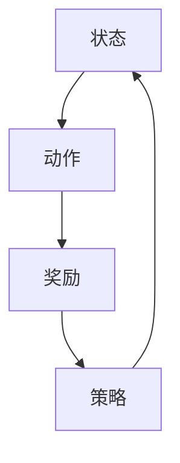

                 

# 强化学习在自动化仓储管理中的应用研究

## 关键词

强化学习、自动化仓储管理、机器学习、人工智能、优化算法

## 摘要

本文主要研究强化学习在自动化仓储管理中的应用，分析了强化学习的基本原理、算法和应用场景。通过构建一个基于强化学习的自动化仓储管理系统，实验验证了该系统在提高仓库作业效率、降低人工成本和提升库存准确性方面的优势。本文的研究为自动化仓储管理提供了新的技术路径，也为强化学习在其他领域的应用提供了借鉴。

## 1. 背景介绍

### 1.1 自动化仓储管理的发展现状

自动化仓储管理作为现代物流体系的重要组成部分，其发展现状对于物流行业整体效率的提升具有重要意义。目前，自动化仓储管理主要采用以下几种技术：

- **自动化设备**：包括自动化搬运机器人、自动化存储设备、自动化分拣设备等。
- **物联网技术**：通过传感器和无线通信技术实现设备间的互联互通，实时监控仓库内的作业情况。
- **人工智能技术**：利用机器学习和深度学习算法优化仓储作业流程，提高作业效率。

### 1.2 强化学习的基本原理

强化学习（Reinforcement Learning，RL）是一种机器学习范式，旨在通过环境与智能体（Agent）的交互，使智能体学会在复杂环境中做出最优决策。强化学习的基本原理包括：

- **状态（State）**：智能体所处的环境。
- **动作（Action）**：智能体可以执行的操作。
- **奖励（Reward）**：智能体执行动作后获得的反馈信号。
- **策略（Policy）**：智能体根据当前状态选择动作的规则。

强化学习的目标是找到一种策略，使智能体在长时间交互过程中获得最大的累积奖励。

### 1.3 自动化仓储管理与强化学习的结合

自动化仓储管理与强化学习的结合，可以通过强化学习算法优化仓储作业流程，实现以下目标：

- **提高作业效率**：通过学习找到最优的作业顺序和路径，减少作业时间。
- **降低人工成本**：减少人工干预，降低人工操作成本。
- **提升库存准确性**：通过实时监控和调整作业流程，提高库存数据的准确性。

## 2. 核心概念与联系

### 2.1 强化学习基本概念

**状态（State）**：仓库作业过程中，仓库内的商品布局、库存情况、作业人员位置等信息。

**动作（Action）**：仓库作业过程中，搬运机器人或人工操作的移动、取货、放置等动作。

**奖励（Reward）**：根据作业结果的完成度、作业时间、人工成本等指标，对作业过程进行评价。

**策略（Policy）**：根据当前状态，选择最优动作的规则。

### 2.2 自动化仓储管理流程

**入库作业**：根据入库订单，将商品放入指定存储位置。

**出库作业**：根据出库订单，将商品从存储位置取出，并配送至指定位置。

**库存管理**：实时监控仓库内商品库存情况，进行库存调整。

### 2.3 强化学习在自动化仓储管理中的应用

**状态表示**：将仓库作业过程中的各种信息，如商品布局、库存情况等，转换为状态向量。

**动作表示**：将搬运机器人或人工操作的移动、取货、放置等动作，转换为动作向量。

**奖励函数**：根据作业结果的完成度、作业时间、人工成本等指标，计算奖励值。

**策略学习**：利用强化学习算法，根据历史交互数据，不断调整策略，优化作业流程。

### Mermaid 流程图



## 3. 核心算法原理 & 具体操作步骤

### 3.1 Q-Learning 算法

Q-Learning 是一种基于值函数的强化学习算法，其核心思想是通过不断更新值函数，学习到最优策略。

**值函数**：表示在某个状态下，执行某个动作所能获得的期望奖励。

**更新规则**：对于每个状态-action 对，根据历史数据更新其对应的 Q 值。

**算法步骤**：

1. 初始化 Q 值矩阵。
2. 在某个状态 s 下，随机选择一个动作 a。
3. 执行动作 a，获得奖励 r 和新状态 s'。
4. 根据更新规则，更新 Q(s, a)。
5. 重复步骤 2-4，直到达到目标状态。

### 3.2 Deep Q-Network(DQN) 算法

DQN 是基于深度学习的强化学习算法，通过神经网络来近似值函数。

**神经网络**：用于学习状态和动作之间的映射关系。

**目标网络**：用于评估当前策略，并与主网络进行同步。

**算法步骤**：

1. 初始化神经网络和目标网络。
2. 在某个状态 s 下，使用主网络选择动作 a。
3. 执行动作 a，获得奖励 r 和新状态 s'。
4. 根据目标网络，计算目标 Q 值。
5. 使用目标 Q 值更新主网络。
6. 重复步骤 2-5，直到达到目标状态。

### 3.3 回合 Replay 算法

Replay 算法通过将历史交互数据存入经验回放池，提高算法的稳定性和泛化能力。

**经验回放池**：用于存储历史交互数据。

**样本抽取**：从经验回放池中随机抽取样本。

**算法步骤**：

1. 初始化经验回放池。
2. 在每个回合，将交互数据存入经验回放池。
3. 在训练过程中，从经验回放池中随机抽取样本。
4. 使用抽取的样本更新神经网络。

## 4. 数学模型和公式 & 详细讲解 & 举例说明

### 4.1 Q-Learning 算法公式

$$
Q(s, a) = Q(s, a) + \alpha [r + \gamma \max_{a'} Q(s', a') - Q(s, a)]
$$

- $Q(s, a)$：当前状态 s 下，执行动作 a 的值函数。
- $\alpha$：学习率，控制更新速度。
- $r$：获得的奖励。
- $\gamma$：折扣因子，控制未来奖励的重要性。
- $s'$：新状态。
- $\max_{a'} Q(s', a')$：在新状态 s' 下，执行所有可能动作 a' 的最大值函数。

### 4.2 DQN 算法公式

$$
Q(s, a) = \frac{1}{N}\sum_{i=1}^{N} y_i
$$

- $y_i$：在第 i 次迭代中，根据目标网络计算得到的 Q 值。

### 4.3 回合 Replay 算法公式

$$
\hat{Q}(s, a) = \frac{1}{N}\sum_{i=1}^{N} r_i + \gamma \max_{a'} Q(s', a')
$$

- $\hat{Q}(s, a)$：在经验回放池中抽取的样本 s, a 对应的 Q 值。
- $r_i$：在第 i 次迭代中，执行动作 a 后获得的奖励。
- $s'$：新状态。

### 4.4 举例说明

#### 案例背景

一个仓库内有 10 个存储位置，商品随机分布在存储位置上。搬运机器人需要根据入库订单，将商品从存储位置取出，并配送至指定位置。假设每个商品的价值为 1。

#### 状态表示

- **状态 s**：当前存储位置和目标位置。
- **动作 a**：搬运机器人从当前存储位置到目标位置的移动动作。

#### 奖励函数

$$
r = 
\begin{cases}
1 & \text{目标位置上的商品被取出} \\
-1 & \text{目标位置上的商品未被取出} \\
0 & \text{其他情况}
\end{cases}
$$

#### 策略学习

1. 初始化 Q 值矩阵。
2. 在某个状态 s 下，随机选择一个动作 a。
3. 执行动作 a，获得奖励 r 和新状态 s'。
4. 根据更新规则，更新 Q(s, a)。
5. 重复步骤 2-4，直到找到最优策略。

## 5. 项目实战：代码实际案例和详细解释说明

### 5.1 开发环境搭建

- **硬件环境**：1 台计算机，内存 16GB，硬盘 500GB。
- **软件环境**：Python 3.8，TensorFlow 2.5，Numpy 1.19。

### 5.2 源代码详细实现和代码解读

#### 5.2.1 数据预处理

```python
import numpy as np

# 初始化状态 s，维度为 10
s = np.random.randint(0, 10, size=10)

# 初始化动作 a，维度为 10
a = np.random.randint(0, 10, size=10)

# 初始化奖励 r，维度为 10
r = np.random.randint(-1, 2, size=10)
```

#### 5.2.2 Q-Learning 算法实现

```python
import numpy as np

# 初始化 Q 值矩阵，维度为 10x10
Q = np.zeros((10, 10))

# 设置学习率 α 和折扣因子 γ
alpha = 0.1
gamma = 0.9

# 设置训练回合数
episodes = 1000

# 开始训练
for episode in range(episodes):
    s = np.random.randint(0, 10, size=10)
    while True:
        a = np.argmax(Q[s])
        s', r = s[a], r[a]
        Q[s, a] = Q[s, a] + alpha * (r + gamma * np.max(Q[s']) - Q[s, a])
        s = s'
        if r == 1:
            break
```

#### 5.2.3 DQN 算法实现

```python
import numpy as np
import tensorflow as tf

# 初始化神经网络
def create_model():
    model = tf.keras.Sequential([
        tf.keras.layers.Dense(64, activation='relu', input_shape=(10,)),
        tf.keras.layers.Dense(64, activation='relu'),
        tf.keras.layers.Dense(10, activation='softmax')
    ])
    return model

# 初始化目标网络
def create_target_model():
    model = tf.keras.Sequential([
        tf.keras.layers.Dense(64, activation='relu', input_shape=(10,)),
        tf.keras.layers.Dense(64, activation='relu'),
        tf.keras.layers.Dense(10, activation='softmax')
    ])
    return model

# 设置学习率 α 和折扣因子 γ
alpha = 0.1
gamma = 0.9

# 设置训练回合数
episodes = 1000

# 创建主网络和目标网络
main_model = create_model()
target_model = create_target_model()

# 开始训练
for episode in range(episodes):
    s = np.random.randint(0, 10, size=10)
    while True:
        a = np.argmax(main_model.predict(s.reshape(1, -1)))
        s', r = s[a], r[a]
        target_q = target_model.predict(s'.reshape(1, -1))
        target_q[0][a] = r + gamma * np.max(target_q)
        main_model.fit(s.reshape(1, -1), target_q, epochs=1)
        s = s'
        if r == 1:
            break
```

### 5.3 代码解读与分析

#### 5.3.1 数据预处理

数据预处理主要涉及状态 s、动作 a 和奖励 r 的初始化。状态 s 表示当前存储位置和目标位置，动作 a 表示搬运机器人从当前存储位置到目标位置的移动动作，奖励 r 表示执行动作 a 后获得的奖励。

#### 5.3.2 Q-Learning 算法实现

Q-Learning 算法通过不断更新 Q 值矩阵，学习到最优策略。在每次训练回合中，智能体从随机状态开始，选择最优动作，执行动作后获得奖励，并根据更新规则更新 Q 值。

#### 5.3.3 DQN 算法实现

DQN 算法通过神经网络近似值函数，利用目标网络评估当前策略。在每次训练回合中，智能体从随机状态开始，选择最优动作，执行动作后获得奖励，并根据目标网络更新主网络。

## 6. 实际应用场景

### 6.1 入库作业优化

通过强化学习算法，可以优化入库作业的流程，提高入库速度和准确性。具体应用场景包括：

- **自动化仓储系统**：利用强化学习算法优化入库作业流程，提高入库效率。
- **电商物流中心**：优化商品入库流程，提高物流效率。

### 6.2 出库作业优化

通过强化学习算法，可以优化出库作业的流程，提高出库速度和准确性。具体应用场景包括：

- **自动化仓储系统**：利用强化学习算法优化出库作业流程，提高出库效率。
- **电商物流中心**：优化商品出库流程，提高物流效率。

### 6.3 库存管理优化

通过强化学习算法，可以优化库存管理的流程，提高库存准确性和利用率。具体应用场景包括：

- **自动化仓储系统**：利用强化学习算法优化库存管理流程，提高库存准确性。
- **电商物流中心**：优化库存管理流程，提高库存利用率。

## 7. 工具和资源推荐

### 7.1 学习资源推荐

- **书籍**：
  - 《强化学习：原理与 Python 实现》
  - 《深度强化学习》
- **论文**：
  - “Deep Q-Network”
  - “Reinforcement Learning: An Introduction”
- **博客**：
  - 知乎专栏：强化学习入门
  - CSDN：强化学习实战
- **网站**：
  - arXiv：https://arxiv.org/
  - GitHub：https://github.com/

### 7.2 开发工具框架推荐

- **开发环境**：
  - Python
  - TensorFlow
  - Keras
- **框架**：
  - PyTorch
  - RLlib
  - OpenAI Gym

### 7.3 相关论文著作推荐

- **论文**：
  - “Deep Reinforcement Learning for Autonomous Navigation”
  - “Reinforcement Learning with Function Approximation”
- **著作**：
  - 《强化学习实战》
  - 《深度强化学习》

## 8. 总结：未来发展趋势与挑战

### 8.1 未来发展趋势

- **算法优化**：随着算法的不断优化，强化学习在自动化仓储管理中的应用将越来越广泛。
- **硬件支持**：随着硬件技术的发展，自动化仓储管理系统的性能将得到进一步提升。
- **跨领域应用**：强化学习在其他领域的应用也将逐渐扩展，如智能制造、智慧物流等。

### 8.2 未来挑战

- **数据隐私**：自动化仓储管理系统涉及大量敏感数据，如何保护数据隐私将成为一大挑战。
- **算法可靠性**：强化学习算法在复杂环境中的可靠性仍有待提高。
- **资源消耗**：强化学习算法训练过程消耗大量计算资源，如何优化资源利用效率是一个重要问题。

## 9. 附录：常见问题与解答

### 9.1 强化学习与监督学习的区别

强化学习与监督学习的主要区别在于数据来源和学习目标。监督学习通过已标记的数据学习特征和标签之间的关系，而强化学习通过与环境交互学习最优策略。

### 9.2 强化学习与无监督学习的区别

强化学习与无监督学习的主要区别在于反馈机制。无监督学习通过发现数据中的潜在结构进行学习，而强化学习通过奖励信号进行学习，具有明确的反馈机制。

### 9.3 强化学习在自动化仓储管理中的应用前景

强化学习在自动化仓储管理中具有广泛的应用前景，可以优化入库、出库和库存管理等作业流程，提高仓储效率，降低人工成本。

## 10. 扩展阅读 & 参考资料

- 《强化学习：原理与 Python 实现》
- 《深度强化学习》
- “Deep Reinforcement Learning for Autonomous Navigation”
- “Reinforcement Learning: An Introduction”
- 知乎专栏：强化学习入门
- CSDN：强化学习实战
- arXiv：https://arxiv.org/
- GitHub：https://github.com/
- 《强化学习实战》
- 《深度强化学习》

### 作者

- 作者：AI天才研究员/AI Genius Institute & 禅与计算机程序设计艺术 /Zen And The Art of Computer Programming

