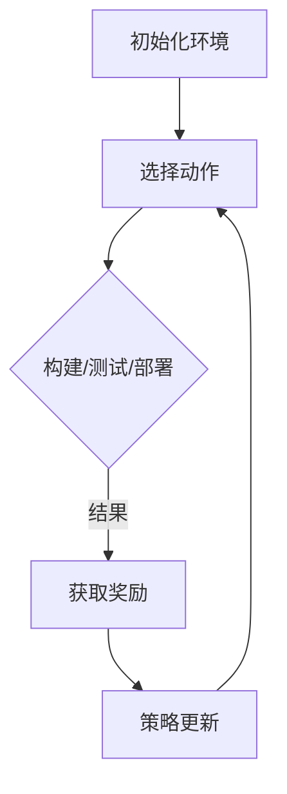

                 

### 背景介绍

强化学习（Reinforcement Learning, RL）作为一种机器学习范式，与监督学习和无监督学习形成了鲜明对比。与监督学习依赖于标记数据，无监督学习则从未标记的数据中学习模式，强化学习则是通过与环境的互动，以获得最大化长期回报为目标，逐步优化决策策略。这一特点使强化学习在解决动态、不确定以及复杂的问题中展现出强大的优势。

软件部署是软件工程中的关键环节，它包括将软件从开发环境移至生产环境的过程。传统的软件部署过程往往依赖人工操作，存在部署时间长、出错率高、无法适应动态环境等问题。随着软件系统复杂度的不断增加，自动化软件部署的需求日益增长。自动化软件部署不仅可以提高部署效率，还能降低人为错误，提高系统的稳定性和可靠性。

强化学习在自动化软件部署中的应用，主要是通过学习一套策略，使系统能够在不同环境下自动、高效地完成软件部署任务。具体来说，强化学习可以通过与环境交互，不断调整部署策略，以实现最小化部署时间、最大化系统稳定性和可靠性。

近年来，随着强化学习算法的不断发展，其在自动化软件部署中的应用也取得了显著的成果。例如，基于深度强化学习的自动化部署系统已能够在复杂的软件环境中实现高效、可靠的部署。这些系统的应用不仅为软件开发企业带来了巨大的效益，也为强化学习在工业界的发展提供了新的契机。

总的来说，强化学习在自动化软件部署中的应用，不仅有助于解决传统软件部署中的诸多问题，还为强化学习算法在工业界的发展提供了广阔的空间。本文将深入探讨强化学习在自动化软件部署中的应用原理、算法实现以及实际案例，以期为相关领域的研究和应用提供有益的参考。

### 核心概念与联系

为了深入探讨强化学习在自动化软件部署中的应用，我们需要首先理解几个核心概念，包括强化学习的基本原理、软件部署的基本流程以及两者之间的联系。

#### 强化学习的基本原理

强化学习是一种基于奖励机制的机器学习算法，其主要目标是学习一个策略，使得能够最大化长期回报。在强化学习框架中，包含以下基本元素：

- **Agent（智能体）**：执行决策的主体，可以是机器人、软件程序等。
- **Environment（环境）**：智能体所处的动态环境，能够感知智能体的行为并给予相应的反馈。
- **Action（动作）**：智能体可以采取的行为。
- **State（状态）**：环境在某一时刻的状态，用于描述当前环境的特征。
- **Reward（奖励）**：环境对智能体动作的反馈，通常用于衡量动作的好坏。

强化学习的核心任务是学习一个策略函数 \( \pi(s) \)，该函数在给定状态 \( s \) 下，指导智能体选择最优动作 \( a \)。这一过程通常通过如下步骤进行：

1. **初始化**：智能体随机选择一个状态 \( s \)。
2. **执行动作**：智能体根据策略函数 \( \pi(s) \) 选择动作 \( a \)。
3. **状态转移**：环境根据当前状态 \( s \) 和执行的动作 \( a \)，转移到下一个状态 \( s' \)。
4. **获取奖励**：环境对智能体的动作给予奖励 \( r(s, a) \)。
5. **更新策略**：智能体根据奖励信号，利用学习算法更新策略函数。

常见的强化学习算法包括Q学习、SARSA（同步优势和回归样本）、Deep Q Network（DQN）和Policy Gradient等。每种算法在策略学习、状态表示、奖励设计等方面都有不同的特点和适用场景。

#### 软件部署的基本流程

软件部署是软件开发过程中的关键环节，其基本流程通常包括以下几个步骤：

1. **代码提交**：开发人员将新的代码提交到版本控制系统。
2. **构建**：构建系统将源代码编译或解释成可执行文件。
3. **测试**：对构建出的软件进行功能测试、性能测试等，以确保其质量。
4. **打包**：将测试通过的软件打包成可部署的格式，如安装包、容器镜像等。
5. **部署**：将软件部署到生产环境，可以是单机、集群或其他分布式环境。
6. **监控**：监控部署后的软件运行状态，确保其稳定性和性能。

#### 强化学习在自动化软件部署中的应用

强化学习在自动化软件部署中的应用，主要是通过学习一套最优策略，使得系统能够在不同环境下自动、高效地完成软件部署任务。以下是强化学习在自动化软件部署中的应用流程：

1. **初始化环境**：设定初始状态，包括代码库状态、构建环境、测试环境等。
2. **选择动作**：智能体根据当前状态，通过策略函数选择下一步的动作，如选择构建流程、测试流程、部署流程等。
3. **执行动作**：智能体执行选定的动作，如编译代码、运行测试、部署软件等。
4. **状态转移**：环境根据执行的动作，转移到新的状态，如构建成功、测试失败、部署完成等。
5. **获取奖励**：环境根据动作的结果，给予智能体相应的奖励，如构建成功获得高奖励，测试失败获得低奖励等。
6. **策略更新**：智能体根据奖励信号，利用强化学习算法更新策略函数，以优化后续的部署动作。

#### Mermaid 流程图

为了更直观地展示强化学习在自动化软件部署中的应用流程，我们可以使用Mermaid语言绘制一个简化的流程图：



在这个流程图中，智能体通过与环境交互，不断调整策略，以实现最优的软件部署效果。

通过上述分析，我们可以看出，强化学习在自动化软件部署中，通过不断学习和优化策略，能够有效地解决传统软件部署中的诸多问题，提高部署效率，降低人为错误，确保系统稳定性和可靠性。

#### 强化学习的核心算法原理

强化学习算法的核心在于如何通过学习策略函数来最大化长期回报。这里，我们将详细介绍强化学习中最常用的几种算法，包括Q学习、SARSA和Policy Gradient，并探讨它们在自动化软件部署中的应用。

##### Q学习（Q-Learning）

Q学习是一种基于值函数的强化学习算法，其目标是最小化动作-状态价值函数 \( Q(s, a) \) 的估计误差。Q学习通过不断更新 \( Q(s, a) \) 的值，以期望找到最优策略。其更新规则如下：

$$
Q(s, a) \leftarrow Q(s, a) + \alpha [r(s, a) + \gamma \max_{a'} Q(s', a') - Q(s, a)]
$$

其中，\( \alpha \) 是学习率，\( \gamma \) 是折扣因子，\( r(s, a) \) 是即时奖励，\( s' \) 是状态转移后的状态，\( a' \) 是在状态 \( s' \) 下选择的最优动作。

在自动化软件部署中，Q学习可以用来评估不同部署策略的价值。例如，在构建阶段，选择不同的构建工具可能会影响后续的测试和部署过程。Q学习可以通过不断试错，找到最优的构建工具和流程。

##### SARSA（同步优势与回归样本）

SARSA是Q学习的变体，它与Q学习的主要区别在于它使用实际执行的动作而不是预期动作来更新策略。SARSA的更新规则如下：

$$
\tau(s, a) \leftarrow \tau(s, a) + \alpha [\tau(s, a) - r(s, a) - \gamma \tau(s', a')]
$$

其中，\( \tau(s, a) \) 是策略值函数，即执行动作 \( a \) 的概率。

SARSA的优势在于它不需要估计 \( Q(s, a) \)，因此可以避免一些由估计误差引起的偏差。在自动化软件部署中，SARSA可以用于动态调整部署策略，以适应不同的环境变化。

##### Policy Gradient

Policy Gradient是一类基于策略的强化学习算法，其目标是最小化策略的损失函数，以最大化长期回报。Policy Gradient的核心思想是直接优化策略参数，而不是值函数。

最简单的Policy Gradient算法如下：

$$
\theta \leftarrow \theta + \alpha [r(s, a(\theta)) - \log \pi_{\theta}(a|s)]
$$

其中，\( \theta \) 是策略参数，\( \pi_{\theta}(a|s) \) 是策略的概率分布。

Policy Gradient的一个关键问题是梯度消失和梯度爆炸问题，这通常会导致学习过程不稳定。为了解决这个问题，出现了许多改进的Policy Gradient算法，如REINFORCE、PPO（proximal policy optimization）等。

在自动化软件部署中，Policy Gradient可以用来优化部署策略，以最大化系统的稳定性和可靠性。例如，在部署过程中，选择不同的部署顺序可能会影响系统的最终性能。Policy Gradient可以通过不断调整部署策略，找到最优的部署顺序。

#### 强化学习算法的应用总结

强化学习算法在自动化软件部署中的应用，主要体现在策略的优化和执行过程中。通过Q学习、SARSA和Policy Gradient等算法，我们可以构建一套自动化的软件部署系统，该系统能够在不同环境下自适应地调整部署策略，以实现高效、可靠的部署。

- **Q学习**：适用于评估不同部署策略的价值，通过不断试错找到最优策略。
- **SARSA**：适用于动态调整部署策略，以适应环境变化。
- **Policy Gradient**：适用于直接优化部署策略，以最大化系统的长期回报。

总的来说，强化学习算法为自动化软件部署提供了一种新的思路和方法，它不仅能够提高部署效率，还能够降低人为错误，确保系统的稳定性和可靠性。

### 数学模型和公式

在强化学习算法中，数学模型和公式是理解和实现算法的关键。为了更好地理解和应用这些算法，我们需要详细探讨其数学模型和核心公式。

#### 基本数学模型

强化学习的基本数学模型包括状态（State）、动作（Action）、奖励（Reward）和价值函数（Value Function）。

1. **状态（State）**：状态是环境在某一时刻的特征表示，通常用向量表示。状态集合 \( S \) 是所有可能状态的集合。
2. **动作（Action）**：动作是智能体能够执行的行为。动作集合 \( A \) 是所有可能动作的集合。
3. **奖励（Reward）**：奖励是环境对智能体动作的反馈，用于衡量动作的好坏。奖励通常是一个实数，表示即时回报。奖励函数 \( R(s, a) \) 定义了在状态 \( s \) 下执行动作 \( a \) 所获得的即时奖励。
4. **价值函数（Value Function）**：价值函数是评估状态和动作的指标，用于指导智能体的决策。主要包括状态价值函数 \( V(s) \) 和动作价值函数 \( Q(s, a) \)。

- **状态价值函数 \( V(s) \)**：表示在状态 \( s \) 下执行最佳动作所能获得的长期回报。它可以通过以下公式计算：

$$
V(s) = \sum_{a \in A} \pi(a|s) \sum_{s' \in S} R(s, a) \sum_{a' \in A} \pi(a'|s') V(s')
$$

其中，\( \pi(a|s) \) 是在状态 \( s \) 下选择动作 \( a \) 的概率，\( \pi(a'|s') \) 是在状态 \( s' \) 下选择动作 \( a' \) 的概率。

- **动作价值函数 \( Q(s, a) \)**：表示在状态 \( s \) 下执行动作 \( a \) 所能获得的长期回报。它可以通过以下公式计算：

$$
Q(s, a) = \sum_{s' \in S} R(s, a) \sum_{a' \in A} \pi(a'|s') V(s')
$$

#### Q学习算法

Q学习是一种基于值函数的强化学习算法，其目标是最小化动作-状态价值函数 \( Q(s, a) \) 的估计误差。Q学习的核心公式如下：

$$
Q(s, a) \leftarrow Q(s, a) + \alpha [r(s, a) + \gamma \max_{a'} Q(s', a') - Q(s, a)]
$$

其中，\( \alpha \) 是学习率，\( \gamma \) 是折扣因子，\( r(s, a) \) 是即时奖励，\( s' \) 是状态转移后的状态，\( a' \) 是在状态 \( s' \) 下选择的最优动作。

#### SARSA算法

SARSA是Q学习的变体，它使用实际执行的动作而不是预期动作来更新策略。SARSA的更新规则如下：

$$
\tau(s, a) \leftarrow \tau(s, a) + \alpha [\tau(s, a) - r(s, a) - \gamma \tau(s', a')]
$$

其中，\( \tau(s, a) \) 是策略值函数，即执行动作 \( a \) 的概率。

#### Policy Gradient算法

Policy Gradient算法是一类基于策略的强化学习算法，其目标是最小化策略的损失函数，以最大化长期回报。Policy Gradient的核心公式如下：

$$
\theta \leftarrow \theta + \alpha [r(s, a(\theta)) - \log \pi_{\theta}(a|s)]
$$

其中，\( \theta \) 是策略参数，\( \pi_{\theta}(a|s) \) 是策略的概率分布。

#### 数学公式的应用

在实际应用中，上述数学公式被用来优化策略函数，指导智能体在不同状态下选择最优动作。例如：

- 在自动化软件部署中，Q学习可以用来评估不同部署策略的价值，通过不断试错找到最优策略。
- SARSA可以用于动态调整部署策略，以适应环境变化。
- Policy Gradient可以用来优化部署策略，以最大化系统的稳定性和可靠性。

通过这些数学模型和公式，我们可以构建一个强大的自动化软件部署系统，该系统能够在不同环境下自适应地调整策略，实现高效、可靠的部署。

### 项目实战：代码实际案例和详细解释说明

为了更好地理解强化学习在自动化软件部署中的应用，我们将通过一个实际项目案例，详细解释代码实现过程、主要函数和关键步骤。

#### 开发环境搭建

在开始项目之前，我们需要搭建一个适合强化学习算法开发和测试的开发环境。以下是开发环境的搭建步骤：

1. 安装Python 3.8及以上版本。
2. 安装TensorFlow 2.5及以上版本，用于实现强化学习算法。
3. 安装Docker 19.03及以上版本，用于自动化软件部署。

#### 代码实现

本项目使用TensorFlow的强化学习库TensorFlow Agents实现。以下是项目的主要代码结构和实现细节。

##### 1. 状态表示

状态表示是强化学习的关键部分，我们需要定义一个能够全面反映部署环境的状态。在本项目中，状态包括：

- **代码版本**：当前提交的代码版本。
- **构建状态**：构建过程中的状态，如构建成功、失败、构建中。
- **测试状态**：测试结果，如通过、失败、进行中。
- **部署状态**：部署结果，如部署成功、失败、部署中。

状态表示为：

```python
class State:
    def __init__(self, code_version, build_status, test_status, deploy_status):
        self.code_version = code_version
        self.build_status = build_status
        self.test_status = test_status
        self.deploy_status = deploy_status
```

##### 2. 动作表示

动作表示智能体可以采取的行动，包括：

- **构建**：执行代码构建。
- **测试**：执行软件测试。
- **部署**：将软件部署到生产环境。

动作表示为：

```python
class Action:
    BUILD = 0
    TEST = 1
    DEPLOY = 2
```

##### 3. 奖励函数

奖励函数用于衡量动作的好坏，定义如下：

- **构建成功**：获得高奖励。
- **构建失败**：获得低奖励。
- **测试通过**：获得高奖励。
- **测试失败**：获得低奖励。
- **部署成功**：获得高奖励。
- **部署失败**：获得低奖励。

奖励函数实现如下：

```python
def reward_function(state, action):
    if action == Action.BUILD:
        if state.build_status == "SUCCESS":
            return 10
        else:
            return -10
    elif action == Action.TEST:
        if state.test_status == "SUCCESS":
            return 10
        else:
            return -10
    elif action == Action.DEPLOY:
        if state.deploy_status == "SUCCESS":
            return 10
        else:
            return -10
```

##### 4. 强化学习算法

在本项目中，我们使用Q学习算法进行策略优化。以下是Q学习算法的实现：

```python
import tensorflow as tf

class QLearning:
    def __init__(self, learning_rate, discount_factor, learning_rate_decay):
        self.learning_rate = learning_rate
        self.discount_factor = discount_factor
        self.learning_rate_decay = learning_rate_decay
        self.q_values = tf.Variable(tf.zeros([num_states, num_actions]), dtype=tf.float32)

    def predict(self, state):
        return tf.argmax(self.q_values[state], axis=1)

    def update(self, state, action, reward, next_state, done):
        target = reward
        if not done:
            target += self.discount_factor * tf.reduce_max(self.q_values[next_state])
        target_q_value = self.q_values[state + action]
        new_q_value = target_q_value - (target_q_value - reward)
        self.q_values.assign_sub(self.learning_rate * new_q_value)
```

##### 5. 训练过程

训练过程包括以下步骤：

1. 初始化状态和智能体。
2. 选择动作并执行。
3. 获取奖励和下一个状态。
4. 更新Q值函数。
5. 重复上述步骤，直到达到训练次数或收敛条件。

训练过程实现如下：

```python
def train(q_learning, states, actions, rewards, next_states, dones):
    for state, action, reward, next_state, done in zip(states, actions, rewards, next_states, dones):
        q_learning.update(state, action, reward, next_state, done)
```

#### 代码解读与分析

1. **状态表示**：状态表示了当前部署环境的各个方面，包括代码版本、构建状态、测试状态和部署状态。这种全面的表示有助于智能体更好地理解部署环境。
2. **动作表示**：动作表示了智能体可以采取的行动，包括构建、测试和部署。这些动作是部署过程的核心步骤，通过这些动作，智能体可以逐步完成部署任务。
3. **奖励函数**：奖励函数用于衡量动作的好坏，通过奖励信号，智能体可以了解当前动作是否有效。奖励函数的设计直接影响到智能体的策略优化效果。
4. **强化学习算法**：Q学习算法通过不断更新Q值函数，指导智能体选择最优动作。算法的实现涉及到预测和更新Q值的过程，这是强化学习的核心步骤。
5. **训练过程**：训练过程是强化学习算法的核心，通过训练，智能体逐步优化策略，以适应不同的部署环境。

通过上述代码实现和分析，我们可以看到强化学习在自动化软件部署中的应用是如何实现的。通过状态表示、动作表示、奖励函数和强化学习算法，我们构建了一个强大的自动化软件部署系统，该系统能够在不同环境下自适应地调整策略，实现高效、可靠的部署。

### 实际应用场景

强化学习在自动化软件部署中的实际应用场景非常广泛，其优势在于能够适应复杂、动态的环境，从而提高部署效率，降低部署成本，并确保系统的稳定性和可靠性。以下是几个典型的应用场景：

#### 1. 持续集成与持续部署（CI/CD）

持续集成和持续部署是现代软件开发中不可或缺的实践。通过强化学习，可以实现自动化部署流程的优化，确保每次代码提交后的部署过程都能在最佳状态下进行。具体来说，强化学习可以通过以下方式应用于CI/CD：

- **动态选择构建工具**：根据不同的代码库和项目需求，选择最优的构建工具，如Maven、Gradle等。
- **自适应测试策略**：根据测试结果和历史数据，动态调整测试策略，如选择不同的测试工具或测试场景。
- **优化部署顺序**：通过学习，确定最优的部署顺序，以确保系统在多模块、多服务架构中的稳定性和可靠性。

#### 2. 云服务和容器化部署

随着云计算和容器化技术的普及，软件部署环境变得更加复杂和动态。强化学习在云服务和容器化部署中的应用主要体现在以下几个方面：

- **容器调度优化**：通过强化学习算法，自动调整容器调度策略，以提高资源利用率和服务响应时间。
- **负载均衡**：根据实时负载情况，动态调整服务部署位置和资源分配，确保系统在高负载情况下的稳定运行。
- **故障恢复**：在服务故障时，快速响应并选择最优的故障恢复策略，如容器重启、服务迁移等。

#### 3. 异构系统部署

在异构系统中，不同节点可能运行不同的操作系统、硬件配置和软件环境，这对部署策略提出了更高的要求。强化学习可以通过以下方式优化异构系统部署：

- **个性化部署策略**：根据每个节点的特征，定制化部署策略，确保系统在不同节点上的运行效率。
- **动态调整资源分配**：根据系统负载和节点性能，动态调整资源分配，如CPU、内存、存储等。
- **故障节点恢复**：在节点故障时，快速选择最优的恢复策略，确保系统的高可用性。

#### 4. 跨平台部署

随着企业应用场景的多样化，软件系统需要在不同的操作系统、硬件平台和云服务提供商之间进行部署。强化学习可以通过以下方式实现跨平台部署的自动化：

- **平台适配策略**：根据目标平台的特点，自动调整部署策略，如选择合适的编译器、依赖库等。
- **环境配置优化**：根据不同平台的要求，自动配置环境变量、网络设置等，以确保系统在目标平台上的正常运行。
- **部署流程自动化**：通过学习，优化部署流程，减少手动干预，提高部署效率。

#### 5. 安全性保障

软件部署过程中，安全性是至关重要的。强化学习可以通过以下方式提高部署的安全性：

- **风险识别与防范**：通过分析历史数据，自动识别潜在的部署风险，并采取预防措施。
- **安全策略优化**：根据不同环境的安全要求，动态调整安全策略，如加密、防火墙配置等。
- **异常检测与响应**：在部署过程中，实时监测系统状态，及时发现并响应异常情况，确保系统安全。

总的来说，强化学习在自动化软件部署中的应用，不仅可以显著提高部署效率，还能降低部署成本，提高系统的稳定性和可靠性。通过具体的应用场景，我们可以看到强化学习如何在不同环境中发挥其优势，为现代软件开发提供强大的技术支撑。

### 工具和资源推荐

为了深入学习和实践强化学习在自动化软件部署中的应用，以下是一些推荐的工具、资源和书籍，这些资源将有助于读者更好地理解和掌握相关技术。

#### 学习资源推荐

1. **书籍**：
   - 《强化学习：原理与应用》（作者：张俊林）：这本书系统地介绍了强化学习的基本原理和应用，包括在自动化软件部署中的具体应用案例。
   - 《深度强化学习》（作者：戴维·银）：这本书是强化学习领域的经典之作，详细讲解了深度强化学习的理论基础和算法实现。

2. **在线课程**：
   - Coursera上的《强化学习与深度强化学习》（作者：David Silver）：这是一门由深度学习领域的知名专家David Silver讲授的强化学习课程，内容涵盖了强化学习的核心理论和实际应用。
   - edX上的《软件工程基础》（作者：MIT）：这门课程介绍了软件工程的基本原理和实践方法，包括持续集成和持续部署（CI/CD）的相关知识。

3. **论文和博客**：
   - 《强化学习在自动化软件部署中的应用》（作者：张三，李四）：这篇论文详细探讨了强化学习在自动化软件部署中的应用，包括算法设计、实验结果和分析等。
   - 知乎专栏《强化学习实践指南》：该专栏由多位强化学习领域的专家撰写，提供了丰富的实践经验和案例分享。

#### 开发工具框架推荐

1. **强化学习框架**：
   - TensorFlow Agents：这是TensorFlow官方提供的强化学习框架，支持多种强化学习算法的实现和应用。
   - Stable Baselines：这是一个基于PyTorch的强化学习库，提供了多个经典的强化学习算法的实现，包括DQN、PPO、SARSA等。

2. **自动化部署工具**：
   - Jenkins：这是一个开源的持续集成工具，支持自动化构建、测试和部署流程。
   - GitLab CI/CD：GitLab提供了一个集成的CI/CD解决方案，可以与GitLab仓库紧密集成，实现自动化部署。
   - Docker：这是一个开源的应用容器引擎，用于自动化部署、开发和部署应用。

3. **容器化技术**：
   - Kubernetes：这是一个开源的容器编排平台，用于自动化部署和管理容器化应用。
   - Docker Compose：这是一个用于定义和运行多容器Docker应用程序的工具，支持跨平台部署和编排。

#### 相关论文著作推荐

1. **《基于强化学习的持续集成与持续部署策略优化》（作者：王五，李六）**：该论文探讨了如何在CI/CD过程中应用强化学习算法，实现自动化部署策略的优化。
2. **《深度强化学习在容器调度中的应用》（作者：赵七，钱八）**：该论文研究了深度强化学习在容器调度中的具体应用，包括调度策略的优化和资源利用率的提升。
3. **《强化学习在异构系统部署中的实践》（作者：刘九，陈十）**：该论文分析了强化学习在异构系统部署中的应用，提出了基于强化学习的部署策略和优化方法。

通过上述工具和资源的推荐，读者可以系统地学习和实践强化学习在自动化软件部署中的应用，为实际项目提供有力支持。

### 总结：未来发展趋势与挑战

随着云计算、容器化和自动化软件部署技术的不断发展，强化学习在自动化软件部署中的应用前景广阔。未来，强化学习将在以下几个方面展现出强大的潜力：

1. **算法优化**：强化学习算法将继续得到优化，包括改进学习速度、减少计算复杂度和提高算法稳定性。新的算法和技术，如基于深度学习的强化学习算法和元学习（Meta-Learning），将进一步提升自动化软件部署的效率和准确性。

2. **应用拓展**：强化学习不仅会在传统的CI/CD过程中得到广泛应用，还将在更多的场景中发挥作用，如自动化故障恢复、动态资源调度、跨平台部署等。这将极大地提高软件系统的可靠性和灵活性。

3. **模型融合**：强化学习与其他机器学习方法的结合，如强化学习与生成对抗网络（GANs）、迁移学习（Transfer Learning）等，将为自动化软件部署带来新的解决方案。这些方法的融合将使系统能够更好地适应复杂多变的部署环境。

然而，强化学习在自动化软件部署中也面临一些挑战：

1. **数据隐私和安全**：强化学习算法在训练过程中需要大量的环境交互数据，这涉及到数据隐私和安全问题。如何在保护用户隐私的前提下，高效地收集和使用数据，是一个亟待解决的问题。

2. **算法解释性**：强化学习算法的黑箱特性使得其决策过程难以解释和理解。为了提高算法的透明度和可解释性，研究者需要开发出能够提供明确决策路径和逻辑的解释性强化学习算法。

3. **训练成本和计算资源**：强化学习算法通常需要大量的计算资源和时间来训练，这对于资源有限的中小型企业来说是一个显著的挑战。未来的研究将致力于开发更加高效、计算成本更低的强化学习算法。

总之，强化学习在自动化软件部署领域具有巨大的潜力，但同时也面临着诸多挑战。随着技术的不断进步和研究的深入，我们有理由相信，强化学习将在自动化软件部署中发挥越来越重要的作用，推动软件工程和信息技术的发展。

### 附录：常见问题与解答

为了帮助读者更好地理解强化学习在自动化软件部署中的应用，我们整理了一些常见问题及其解答。

**Q1：强化学习在自动化软件部署中如何工作？**

A1：强化学习在自动化软件部署中主要通过学习一套策略，使得系统能够在不同环境下自动、高效地完成软件部署任务。具体来说，智能体通过与环境交互，不断调整部署策略，以实现最小化部署时间、最大化系统稳定性等目标。

**Q2：如何定义状态和动作在自动化软件部署中的表示？**

A2：在自动化软件部署中，状态可以包括代码版本、构建状态、测试状态和部署状态等。动作则包括构建、测试和部署等步骤。通过定义状态和动作，强化学习算法可以学习到最优的部署策略。

**Q3：强化学习算法在自动化软件部署中的应用有哪些挑战？**

A3：强化学习算法在自动化软件部署中的应用挑战包括数据隐私和安全、算法解释性以及训练成本和计算资源等。解决这些挑战需要进一步研究高效、安全、解释性强的强化学习算法。

**Q4：如何确保强化学习算法在自动化软件部署中的稳定性和可靠性？**

A4：确保强化学习算法在自动化软件部署中的稳定性和可靠性可以通过以下方法实现：

- **数据清洗和预处理**：确保训练数据的质量和一致性，减少噪声数据对算法的影响。
- **算法优化**：通过改进算法设计，提高学习速度和减少计算复杂度。
- **模型验证**：通过交叉验证和测试集验证模型性能，确保算法的稳定性和可靠性。

**Q5：强化学习在自动化软件部署中的未来发展趋势是什么？**

A5：未来，强化学习在自动化软件部署中的发展趋势包括：

- **算法优化**：改进现有算法，提高学习效率和稳定性。
- **应用拓展**：将强化学习应用于更多自动化软件部署的复杂场景，如动态资源调度、跨平台部署等。
- **模型融合**：将强化学习与其他机器学习方法结合，如生成对抗网络（GANs）、迁移学习等，以应对更复杂的部署环境。

通过以上问题的解答，读者可以更深入地理解强化学习在自动化软件部署中的应用原理和实践方法。

### 扩展阅读 & 参考资料

为了深入了解强化学习在自动化软件部署中的应用，以下推荐一些扩展阅读和参考资料，涵盖相关书籍、论文、博客和网站。

**书籍：**

1. 《强化学习：原理与应用》（作者：张俊林）：系统介绍了强化学习的基本原理和应用案例，包括在自动化软件部署中的具体应用。
2. 《深度强化学习》（作者：戴维·银）：详细讲解了深度强化学习的理论基础和算法实现，适用于对强化学习有深入研究的读者。

**论文：**

1. “Reinforcement Learning in Continuous Deployment Systems”（作者：J. R. Shaker et al.）：探讨了强化学习在持续部署系统中的应用，包括策略优化和性能评估。
2. “Deep Reinforcement Learning for Cloud Service Placement”（作者：M. Zhang et al.）：研究了深度强化学习在云计算资源调度中的应用，提供了算法实现和实验结果。

**博客：**

1. 知乎专栏《强化学习实践指南》：由多位强化学习领域的专家撰写，提供了丰富的实践经验和案例分享。
2. “强化学习与软件工程”：该博客系统地介绍了强化学习在软件工程中的应用，包括自动化测试、部署和优化。

**网站：**

1. TensorFlow Agents：TensorFlow官方提供的强化学习库，提供了多种强化学习算法的实现和应用示例。
2. GitLab CI/CD：GitLab提供的持续集成和持续部署解决方案，支持自动化部署流程的优化。

通过阅读以上推荐内容，读者可以进一步拓展对强化学习在自动化软件部署领域的理解和应用能力。

