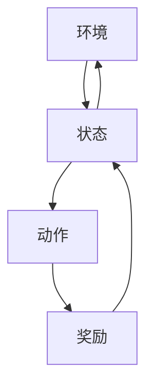
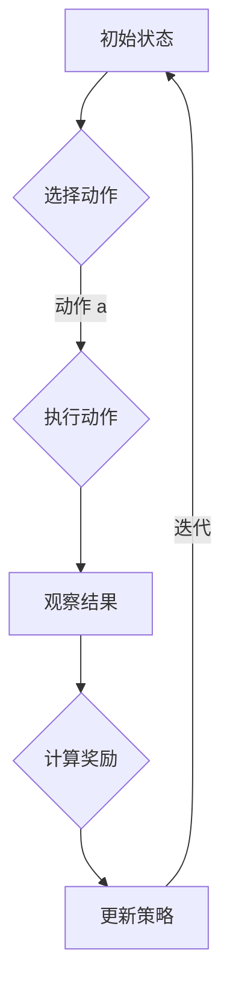

                 

### 文章标题: 强化学习在自动驾驶决策中的突破

#### 关键词：强化学习、自动驾驶、决策、算法原理、数学模型、实际应用

##### 摘要：
本文将深入探讨强化学习在自动驾驶决策中的应用，剖析其核心概念与原理，并通过详细案例解析展示强化学习算法在自动驾驶领域的实际应用价值。文章分为十个部分，从背景介绍、核心概念与联系、算法原理与操作步骤、数学模型与公式讲解，到项目实战、实际应用场景、工具和资源推荐，以及未来发展趋势与挑战。旨在为读者提供一个全面、深入的强化学习在自动驾驶决策中的应用指南。

---

在自动驾驶技术的飞速发展中，决策系统作为自动驾驶车辆的大脑，其性能与稳定性直接关系到自动驾驶的安全与效率。强化学习作为一种先进的人工智能技术，因其强大的决策能力和适应性，逐渐成为自动驾驶决策领域的研究热点。本文将围绕强化学习在自动驾驶决策中的突破，展开详细的分析与探讨。

## 1. 背景介绍

自动驾驶技术作为人工智能领域的一个重要分支，其核心在于实现车辆的自主驾驶。随着传感器技术、计算机视觉和深度学习等领域的快速发展，自动驾驶技术取得了显著的进展。然而，自动驾驶决策系统的设计仍面临诸多挑战，如环境复杂性、决策不确定性、实时性要求等。

强化学习作为一种通过试错和反馈优化行为策略的机器学习技术，具有适应性强、决策能力高等优点。近年来，强化学习在自动驾驶决策中的应用逐渐受到关注，并在实际项目中取得了显著成果。

### 1.1 自动驾驶决策的重要性

自动驾驶决策系统是自动驾驶车辆的核心，负责处理车辆的运动控制、路径规划、障碍物检测、环境感知等任务。一个高效的决策系统能够使自动驾驶车辆在不同环境和场景下都能做出正确的决策，确保行驶的安全性和舒适性。

### 1.2 强化学习的特点与应用优势

强化学习具有以下几个特点与应用优势：

1. **适应性**：强化学习能够通过不断试错和反馈，从复杂环境中学习到最优策略。
2. **决策能力**：强化学习能够在不确定的环境中做出合理的决策，提高系统的鲁棒性。
3. **实时性**：强化学习算法能够快速收敛，满足自动驾驶决策系统的实时性要求。
4. **跨领域迁移**：强化学习算法具有较强的泛化能力，能够在不同领域之间进行迁移应用。

基于上述特点与应用优势，强化学习在自动驾驶决策系统中具有广泛的应用前景。

---

### 2. 核心概念与联系

为了深入理解强化学习在自动驾驶决策中的应用，我们需要首先了解强化学习的核心概念与联系。以下是一个简化的 Mermaid 流程图，展示强化学习的主要组成部分。

#### 2.1 环境与状态

- **环境**（Environment）：自动驾驶的环境是指车辆周围的各种因素，包括道路、交通状况、天气等。
- **状态**（State）：状态是车辆在某一时刻所处的环境信息的抽象表示，通常用向量表示。

#### 2.2 动作与奖励

- **动作**（Action）：动作是车辆根据当前状态所能执行的行为，如加速、减速、转向等。
- **奖励**（Reward）：奖励是环境对车辆执行某一动作后的反馈，用于评估动作的好坏。奖励值越高，表示动作越优。

#### 2.3 强化学习算法

强化学习算法的核心是通过不断尝试不同的动作，并基于奖励反馈调整动作策略，以实现最大化总奖励的目标。以下是一个简化的强化学习算法流程：

#### 2.4 状态转移与策略更新

- **状态转移**（State Transition）：状态转移是指车辆在执行动作后，从当前状态转移到下一状态的过程。
- **策略更新**（Policy Update）：策略更新是指根据奖励反馈调整动作策略的过程，以实现最大化总奖励的目标。

---

在下一部分中，我们将深入探讨强化学习算法的原理与具体操作步骤。敬请期待。

