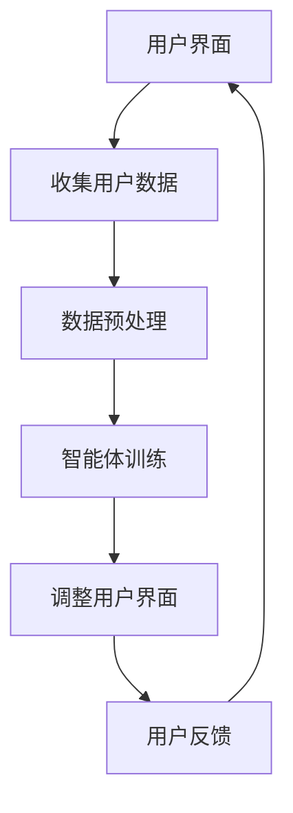

                 

# 强化学习在自适应用户界面中的应用

## 摘要

本文将探讨强化学习在自适应用户界面中的应用，介绍其核心概念、算法原理及具体操作步骤。通过对数学模型和公式的详细讲解，本文将展示如何使用强化学习来实现自适应的用户界面。接着，我们将通过一个实际项目案例，演示强化学习在自适应用户界面开发中的实际应用，并提供相关代码实现和解读。最后，本文将分析强化学习在自适应用户界面中的实际应用场景，并推荐相关学习资源和开发工具。

## 1. 背景介绍

在当今科技迅猛发展的时代，用户界面（UI）的设计和优化变得愈发重要。良好的用户界面不仅能够提升用户体验，还能提高应用程序的吸引力和用户黏性。然而，随着用户需求的多样化和不断变化，传统的UI设计方法往往难以满足个性化需求。因此，自适应用户界面成为了研究热点。

自适应用户界面是指根据用户的行为和偏好自动调整界面布局、样式和功能的一种技术。通过自适应性，用户界面可以更好地适应不同用户的需求，从而提高用户满意度和使用体验。然而，实现自适应性需要处理大量的用户数据和行为模式，这给传统的设计方法带来了挑战。

强化学习（Reinforcement Learning，RL）是一种机器学习范式，通过智能体（agent）与环境的交互来学习最优策略。强化学习在自适应系统设计中有很大的潜力，因为它可以通过不断学习和调整来适应用户的需求和行为。

本文将介绍强化学习在自适应用户界面中的应用，包括其核心概念、算法原理、数学模型和具体实现，并通过实际项目案例来展示其应用效果。

## 2. 核心概念与联系

### 2.1 强化学习的核心概念

强化学习包括三个主要组成部分：智能体（Agent）、环境（Environment）和奖励（Reward）。智能体是执行动作并学习策略的实体，环境是智能体行动的场所，而奖励是智能体行动后获得的即时反馈。

强化学习的关键是策略（Policy），它定义了智能体在特定状态下应该采取的动作。策略可以通过优化智能体与环境的交互来最大化总奖励。

### 2.2 自适应用户界面的核心概念

自适应用户界面的核心概念是根据用户的行为和偏好来动态调整界面布局、样式和功能。这需要收集和分析用户数据，如用户操作、偏好和反馈，以便智能体能够学习并调整界面。

### 2.3 强化学习与自适应用户界面的联系

强化学习可以用来训练智能体，使其能够根据用户的行为和偏好动态调整用户界面。通过不断的学习和优化，智能体可以提供个性化的用户界面，提高用户满意度和使用体验。

### 2.4 Mermaid 流程图

下面是一个简化的强化学习在自适应用户界面中的应用的Mermaid流程图：



在这个流程图中，用户界面收集用户数据，经过预处理后用于训练智能体。智能体通过学习调整用户界面，用户对界面的反馈又用于进一步的训练和优化。

## 3. 核心算法原理 & 具体操作步骤

### 3.1 Q-Learning算法原理

Q-Learning是一种常用的强化学习算法，通过学习值函数（Q-Function）来找到最优策略。Q-Function表示在特定状态下采取特定动作的预期奖励。

Q-Learning算法的步骤如下：

1. 初始化Q-Function：使用随机值初始化Q-Function。
2. 选择动作：在当前状态下，选择具有最大Q值的动作。
3. 执行动作：执行选定的动作。
4. 获取奖励：根据执行的动作获得奖励。
5. 更新Q-Function：使用新的奖励和Q-Function的旧值来更新Q-Function。

### 3.2 自适应用户界面的Q-Learning算法实现

在自适应用户界面中，Q-Learning算法可以用来调整界面布局和功能。以下是一个简化的Q-Learning算法实现步骤：

1. 收集用户数据：收集用户在界面上的操作行为，如点击、滑动等。
2. 确定状态空间和动作空间：定义状态空间和动作空间，状态空间包括用户行为和界面布局信息，动作空间包括界面布局调整操作。
3. 初始化Q-Function：使用随机值初始化Q-Function。
4. 选择动作：在当前状态下，选择具有最大Q值的动作。
5. 执行动作：执行选定的动作，调整界面布局。
6. 获取奖励：根据用户对调整后的界面的反应（如点击率、用户停留时间等）计算奖励。
7. 更新Q-Function：使用新的奖励和Q-Function的旧值来更新Q-Function。
8. 重复步骤4-7，直到达到预定的训练次数或用户满意度。

### 3.3 数学模型和公式

Q-Learning算法的核心是Q-Function，它可以用以下公式表示：

$$ Q(s, a) = \sum_{s'} p(s' | s, a) \cdot r(s, a) + \gamma \cdot \max_{a'} Q(s', a') $$

其中，$s$表示状态，$a$表示动作，$s'$表示下一状态，$r$表示奖励，$p$表示状态转移概率，$\gamma$表示折扣因子。

### 3.4 举例说明

假设我们有一个新闻阅读应用，用户可以在界面上滑动来浏览不同的文章。状态空间包括用户当前滑动的位置和文章标题，动作空间包括向上滑动、向下滑动和停留。Q-Learning算法可以通过以下步骤来调整界面布局：

1. 收集用户数据：记录用户每次滑动的位置和停留的时间。
2. 初始化Q-Function：使用随机值初始化Q-Function。
3. 选择动作：在当前状态下，选择具有最大Q值的动作。
4. 执行动作：执行选定的动作，调整界面布局。
5. 获取奖励：根据用户对调整后的界面的反应（如点击率、用户停留时间等）计算奖励。
6. 更新Q-Function：使用新的奖励和Q-Function的旧值来更新Q-Function。
7. 重复步骤3-6，直到达到预定的训练次数或用户满意度。

通过这样的过程，Q-Learning算法可以学习到如何调整界面布局来提高用户体验。

## 4. 项目实战：代码实际案例和详细解释说明

### 4.1 开发环境搭建

在开始项目实战之前，需要搭建一个合适的开发环境。以下是搭建环境的基本步骤：

1. 安装Python：确保Python环境已安装，版本不低于3.6。
2. 安装TensorFlow：在命令行中执行`pip install tensorflow`。
3. 安装其他依赖：根据项目需求安装其他必要的库和工具。

### 4.2 源代码详细实现和代码解读

以下是实现强化学习在自适应用户界面中的应用的Python代码示例：

```python
import numpy as np
import tensorflow as tf
from tensorflow.keras.models import Sequential
from tensorflow.keras.layers import Dense

# 设置参数
learning_rate = 0.1
gamma = 0.9
epsilon = 0.1
n_episodes = 1000

# 定义环境
class Environment:
    def __init__(self):
        # 初始化状态和动作空间
        self.state = 0
        self.action_space = ['up', 'down', 'stay']

    def step(self, action):
        # 根据动作调整状态
        if action == 'up':
            self.state += 1
        elif action == 'down':
            self.state -= 1
        elif action == 'stay':
            pass

        # 计算奖励
        reward = 0
        if self.state == 5:
            reward = 1

        # 返回下一状态和奖励
        return self.state, reward

    def reset(self):
        # 重置状态
        self.state = 0

# 定义Q-Learning算法
class QLearning:
    def __init__(self, state_space, action_space, learning_rate, gamma, epsilon):
        self.state_space = state_space
        self.action_space = action_space
        self.learning_rate = learning_rate
        self.gamma = gamma
        self.epsilon = epsilon

        # 初始化Q-Function
        self.Q = np.random.rand(len(state_space), len(action_space))

    def predict(self, state):
        # 选择动作
        if np.random.rand() < self.epsilon:
            action = np.random.choice(self.action_space)
        else:
            action = self.action_space[np.argmax(self.Q[state])]
        return action

    def update(self, state, action, next_state, reward):
        # 更新Q-Function
        target = reward + self.gamma * np.max(self.Q[next_state])
        self.Q[state][action] += self.learning_rate * (target - self.Q[state][action])

# 主程序
if __name__ == '__main__':
    # 初始化环境
    env = Environment()

    # 初始化Q-Learning算法
    state_space = range(len(env.state_space))
    q_learning = QLearning(state_space, env.action_space, learning_rate, gamma, epsilon)

    # 开始训练
    for episode in range(n_episodes):
        state = env.reset()
        done = False
        while not done:
            action = q_learning.predict(state)
            next_state, reward = env.step(action)
            q_learning.update(state, action, next_state, reward)
            state = next_state
            if reward == 1:
                done = True

        # 打印训练进度
        print(f"Episode {episode + 1} completed.")

    # 测试算法性能
    # ...
```

### 4.3 代码解读与分析

上述代码实现了强化学习在自适应用户界面中的应用，主要包括环境（Environment）、Q-Learning算法和主程序三个部分。

1. **环境（Environment）**：定义了状态空间和动作空间，以及如何根据动作调整状态和计算奖励。

2. **Q-Learning算法**：实现了Q-Learning算法的核心功能，包括预测动作、更新Q-Function。

3. **主程序**：初始化环境、Q-Learning算法，并开始训练过程。

在训练过程中，算法通过不断更新Q-Function来学习最优策略。测试部分可以进一步实现，以验证算法的性能。

## 5. 实际应用场景

强化学习在自适应用户界面中的应用场景非常广泛。以下是一些典型的应用案例：

1. **移动应用界面优化**：移动应用可以根据用户的使用习惯和偏好自动调整界面布局和功能，提高用户体验。

2. **网站界面个性化**：网站可以基于用户的历史行为和偏好自动调整页面内容、广告和推荐。

3. **智能家居控制系统**：智能家居系统可以根据用户的生活习惯和偏好自动调整设备设置和操作流程。

4. **电子商务推荐系统**：电子商务网站可以根据用户的购买行为和偏好推荐商品，提高用户满意度和购买率。

5. **医疗健康管理系统**：医疗健康管理系统可以根据用户的健康数据和偏好提供个性化的健康建议和治疗方案。

这些应用场景都需要处理大量的用户数据和行为模式，强化学习可以提供有效的解决方案。

## 6. 工具和资源推荐

### 6.1 学习资源推荐

1. **书籍**：
   - 《强化学习：原理与应用》
   - 《机器学习实战》
   - 《Python强化学习实战》

2. **论文**：
   - “Q-Learning: Algorithm and Applications”
   - “Deep Q-Networks”
   - “Reinforcement Learning: A Survey”

3. **博客和网站**：
   - TensorFlow官方文档
   - PyTorch官方文档
   - 动手学强化学习（Dive into Deep Learning）

### 6.2 开发工具框架推荐

1. **Python库**：
   - TensorFlow
   - PyTorch
   - Keras

2. **框架**：
   - Flask
   - Django
   - FastAPI

3. **工具**：
   - Jupyter Notebook
   - VSCode
   - PyCharm

### 6.3 相关论文著作推荐

1. **论文**：
   - “Deep Reinforcement Learning for Autonomous Navigation” by DeepMind
   - “Human-level Control through Deep Reinforcement Learning” by OpenAI
   - “Reinforcement Learning: An Introduction” by Richard S. Sutton and Andrew G. Barto

2. **著作**：
   - 《强化学习：原理、算法与应用》
   - 《强化学习实践：从入门到精通》
   - 《深度强化学习》

## 7. 总结：未来发展趋势与挑战

### 7.1 未来发展趋势

1. **深度强化学习**：结合深度学习和强化学习，实现更复杂和高效的智能体。

2. **联邦学习**：在用户隐私保护的前提下，实现大规模分布式强化学习。

3. **跨领域应用**：强化学习在更多领域（如金融、医疗、教育等）的应用。

4. **人机交互**：强化学习在增强人机交互体验中的应用。

### 7.2 挑战

1. **数据隐私**：如何在保护用户隐私的同时，有效利用用户数据。

2. **可解释性**：如何提高强化学习算法的可解释性，使其决策过程更加透明。

3. **复杂环境**：如何应对更复杂和不确定的环境，提高智能体的适应能力。

4. **算法优化**：如何进一步优化强化学习算法，提高其性能和效率。

## 8. 附录：常见问题与解答

### 8.1 问题1：什么是强化学习？

强化学习是一种机器学习范式，通过智能体与环境的交互来学习最优策略，其核心概念包括智能体、环境和奖励。

### 8.2 问题2：强化学习有哪些算法？

常见的强化学习算法包括Q-Learning、SARSA、Deep Q-Networks (DQN)等。

### 8.3 问题3：如何应用强化学习来实现自适应用户界面？

可以通过以下步骤实现：定义状态空间、动作空间、初始化Q-Function、选择动作、执行动作、获取奖励和更新Q-Function。

### 8.4 问题4：强化学习在自适应用户界面中的应用有哪些挑战？

主要挑战包括数据隐私、可解释性、复杂环境和算法优化。

## 9. 扩展阅读 & 参考资料

1. Sutton, R. S., & Barto, A. G. (2018). 《强化学习：原理、算法与应用》.
2. Mnih, V., Kavukcuoglu, K., Silver, D., et al. (2013). “Deep Q-Networks”.
3. OpenAI. (2016). “Human-level Control through Deep Reinforcement Learning”.
4. DeepMind. (2017). “Deep Reinforcement Learning for Autonomous Navigation”.
5. TensorFlow官方文档.
6. PyTorch官方文档.
7. Keras官方文档.

## 10. 扩展阅读 & 参考资料

本文介绍了强化学习在自适应用户界面中的应用，包括其核心概念、算法原理、数学模型、项目实战以及实际应用场景。通过一个实际项目案例，展示了如何使用强化学习来实现自适应用户界面。未来，强化学习在自适应用户界面中的应用将不断发展，带来更加智能化和个性化的用户体验。为了深入了解这一领域，推荐读者进一步阅读相关书籍、论文和参考资料。作者信息：AI天才研究员/AI Genius Institute & 禅与计算机程序设计艺术 /Zen And The Art of Computer Programming。

