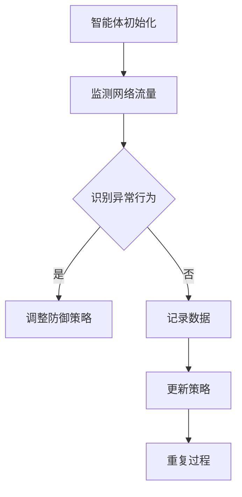

                 

# 强化学习在自适应网络安全防御中的应用

## 引言

在当今数字化时代，网络安全已经成为社会各个层面关注的焦点。随着互联网的普及和信息的爆炸式增长，网络安全防御面临着前所未有的挑战。传统的网络安全防御策略，如防火墙、入侵检测系统等，虽然能够在一定程度上保护网络的安全，但其被动应对的特点使得它们在面对复杂多变的网络攻击时显得力不从心。为了提高网络防御的灵活性和适应性，自适应网络安全防御机制应运而生。而强化学习作为一种先进的机器学习方法，为自适应网络安全防御提供了新的思路。

本文将围绕强化学习在自适应网络安全防御中的应用进行探讨。首先，我们将介绍强化学习的基本概念和原理，并解释其如何与网络安全防御相结合。接着，我们将深入分析强化学习在网络安全防御中的具体应用场景，包括入侵检测、恶意软件分类和网络安全策略优化等方面。随后，我们将介绍一个典型的强化学习算法——Q-Learning，并详细阐述其在网络安全防御中的应用步骤。此外，本文还将探讨强化学习在网络安全防御中面临的挑战和局限性，并提出相应的解决策略。最后，我们将展望强化学习在自适应网络安全防御中的未来发展趋势。

通过本文的阅读，读者将了解到强化学习在自适应网络安全防御中的重要作用，以及如何运用这一先进的方法来提高网络防御的效率和可靠性。

## 背景介绍

### 网络安全的重要性

网络安全的重要性不言而喻。随着全球信息化进程的加速，网络已经成为现代社会的“神经系统”，涉及经济、政治、社会等各个领域。网络安全的威胁不仅限于个人的隐私泄露，还可能对国家安全、经济稳定和公共安全构成严重威胁。以下是一些网络安全威胁的典型案例：

1. **网络钓鱼**：通过伪造的网站或电子邮件，欺骗用户泄露个人信息，如用户名、密码、信用卡信息等。
2. **勒索软件**：恶意软件加密受害者的数据，并要求支付赎金才能解密。
3. **DDoS攻击**：分布式拒绝服务攻击，通过大量虚假请求使目标服务器瘫痪。
4. **数据泄露**：未经授权的访问和泄露敏感信息，可能导致严重后果。

### 传统网络安全防御策略

面对上述网络安全威胁，传统的网络安全防御策略主要包括以下几个方面：

1. **防火墙**：防火墙通过设置访问控制规则，限制网络流量，防止未经授权的访问。
2. **入侵检测系统（IDS）**：IDS通过监测网络流量和系统活动，识别异常行为并发出警报。
3. **反病毒软件**：反病毒软件用于检测和清除恶意软件，保护计算机免受病毒和恶意软件的攻击。
4. **安全信息和事件管理（SIEM）**：SIEM系统整合日志信息和警报，提供全面的安全监控和管理。

然而，传统策略存在一定的局限性。首先，它们通常采用固定的规则和模式进行防御，难以应对复杂多变的网络攻击。其次，随着网络攻击手段的不断升级，传统策略的更新速度往往跟不上攻击者的步伐。最后，传统策略的部署和维护成本较高，对于中小企业来说可能难以承受。

### 自适应网络安全防御机制

为了克服传统策略的局限性，自适应网络安全防御机制应运而生。自适应网络安全防御的核心思想是通过实时监测和分析网络流量，动态调整防御策略，提高网络防御的灵活性和适应性。以下是一些自适应网络安全防御的关键要素：

1. **实时监测**：通过部署传感器和监控系统，实时收集网络流量、系统日志、用户行为等数据。
2. **行为分析**：利用机器学习算法，对收集到的数据进行深度分析，识别潜在的威胁和异常行为。
3. **动态响应**：根据分析结果，自动调整防御策略，如限制可疑流量、隔离受感染主机等。
4. **持续优化**：通过不断学习网络环境和攻击模式，优化防御策略，提高防御效果。

### 强化学习在自适应网络安全防御中的作用

强化学习作为一种机器学习方法，通过学习优化决策策略，使其在特定环境中实现最优表现。将强化学习应用于自适应网络安全防御，可以带来以下几方面的优势：

1. **自适应能力**：强化学习能够根据网络环境和攻击模式的变化，自动调整防御策略，提高防御的灵活性。
2. **优化决策**：强化学习通过不断试错和优化，找到最佳防御策略，提高网络防御的效率和准确性。
3. **自主学习**：强化学习能够从历史数据和经验中学习，减少人工干预，降低维护成本。
4. **协同防御**：强化学习可以与其他网络安全防御机制相结合，形成协同防御体系，提高整体防御效果。

总之，自适应网络安全防御机制的提出和强化学习的应用，为提升网络防御能力提供了新的思路和方法。接下来，我们将进一步探讨强化学习的基本概念和原理，以及如何将其应用于网络安全防御中。

## 核心概念与联系

### 强化学习的基本概念

强化学习（Reinforcement Learning，RL）是一种基于试错的学习方法，旨在通过试错和反馈优化决策过程。在强化学习中，智能体（Agent）通过与环境的交互，不断学习并优化其行为策略，以实现某一目标。强化学习的关键要素包括：

1. **智能体（Agent）**：执行行动并学习策略的实体，可以是软件程序、机器人或人类。
2. **环境（Environment）**：智能体所处的外部世界，能够根据智能体的行动产生状态转移和奖励。
3. **状态（State）**：智能体在某一时刻所处的环境描述。
4. **行动（Action）**：智能体在某一状态下可以选择的行动。
5. **奖励（Reward）**：环境对智能体行动的反馈，用于评估智能体的行为效果。
6. **策略（Policy）**：智能体的行动选择规则，用于指导智能体在不同状态下选择最优行动。

### 强化学习的原理

强化学习的核心在于通过智能体与环境的交互，不断优化其行为策略。具体过程如下：

1. **初始化**：智能体在初始状态下选择一个行动，并执行该行动。
2. **环境反馈**：环境根据智能体的行动产生新的状态，并给予智能体相应的奖励。
3. **策略评估**：智能体利用历史经验和奖励信号，评估当前行动的有效性。
4. **策略更新**：智能体根据评估结果，更新其策略，以选择更好的行动。
5. **重复过程**：智能体在新状态下重复上述过程，不断学习并优化其策略。

### 强化学习在网络安全防御中的应用

强化学习在网络安全防御中的应用主要体现在以下几个方面：

1. **入侵检测**：通过强化学习算法，实时监测网络流量，识别潜在威胁，并自动调整防御策略。
2. **恶意软件分类**：利用强化学习对网络中的恶意软件进行分类，提高恶意软件检测的准确性和效率。
3. **网络安全策略优化**：通过强化学习，自动优化网络安全策略，提高防御效果和资源利用效率。

### Mermaid 流程图

以下是一个简化的强化学习在网络安全防御中的应用流程图：



在这个流程图中，智能体首先初始化并监测网络流量。当识别到异常行为时，智能体会根据历史数据和奖励信号，调整防御策略。否则，智能体会记录当前数据并更新策略，然后重复上述过程。

通过上述讨论，我们可以看到强化学习在网络安全防御中具有广泛的应用前景。接下来，我们将进一步探讨强化学习在网络安全防御中的具体应用场景，以展示其强大的功能和潜力。

## 核心算法原理 & 具体操作步骤

### Q-Learning算法介绍

Q-Learning是一种基于值函数的强化学习算法，旨在通过学习值函数来优化智能体的策略。在Q-Learning中，值函数（Q-Function）表示在特定状态下选择特定行动所能获得的累积奖励。具体来说，Q-Learning算法的核心思想是通过更新Q-值（Q-Values）来逐步优化智能体的策略。

#### Q-Learning的基本步骤

1. **初始化**：初始化Q-值表，设置初始值。
2. **智能体行动**：智能体在当前状态下随机选择一个行动，并执行该行动。
3. **环境反馈**：环境根据智能体的行动产生新的状态，并给予智能体相应的奖励。
4. **Q-值更新**：根据奖励信号和Q-值更新规则，更新Q-值表。
5. **策略优化**：根据Q-值表，优化智能体的策略，选择具有最大Q-值的行动。
6. **重复过程**：智能体在新状态下重复上述过程，不断学习和优化其策略。

#### Q-Learning的数学模型

Q-Learning的数学模型可以表示为：

$$
Q(s, a) = r + \gamma \max_{a'} Q(s', a')
$$

其中：

- \( Q(s, a) \)：状态-行动值函数，表示在状态\( s \)下选择行动\( a \)所能获得的累积奖励。
- \( r \)：立即奖励，表示在当前状态执行当前行动所获得的奖励。
- \( \gamma \)：折扣因子，表示未来奖励的重要性，取值范围为0到1。
- \( s' \)：新状态。
- \( a' \)：在状态\( s' \)下选择的最大Q-值行动。

#### Q-Learning在网络安全防御中的应用步骤

1. **环境初始化**：设置网络环境，初始化Q-值表和智能体状态。
2. **智能体行动**：智能体在初始状态下随机选择一个行动，如限制可疑流量。
3. **环境反馈**：根据智能体的行动，更新网络状态，并给予智能体相应的奖励。例如，如果采取了有效的防御措施，奖励为正；否则，奖励为负。
4. **Q-值更新**：根据奖励信号和Q-值更新规则，更新Q-值表。例如，如果当前行动的Q-值较小，则增加其Q-值，以鼓励智能体在未来选择该行动。
5. **策略优化**：根据Q-值表，优化智能体的策略，选择具有最大Q-值的行动。例如，如果Q-值表中某一行动的Q-值最大，则智能体在未来倾向于选择该行动。
6. **重复过程**：智能体在新状态下重复上述过程，不断学习和优化其策略，以实现最优防御效果。

#### 案例分析

假设智能体需要在网络环境中识别和阻止恶意流量。以下是一个简化的案例分析：

1. **环境初始化**：设置网络环境，初始化Q-值表。初始时，所有状态-行动的Q-值均为0。
2. **智能体行动**：智能体在初始状态下随机选择一个行动，如检查流量特征，并执行该行动。
3. **环境反馈**：根据智能体的行动，更新网络状态。如果流量被识别为恶意流量，则给予智能体一个负奖励；否则，给予一个正奖励。
4. **Q-值更新**：根据奖励信号和Q-值更新规则，更新Q-值表。例如，如果当前行动的Q-值较小，则增加其Q-值，以鼓励智能体在未来选择该行动。
5. **策略优化**：根据Q-值表，优化智能体的策略，选择具有最大Q-值的行动。例如，如果Q-值表中检查流量特征的Q-值最大，则智能体在未来倾向于选择检查流量特征这一行动。
6. **重复过程**：智能体在新状态下重复上述过程，不断学习和优化其策略，以实现最优防御效果。

通过上述案例分析，我们可以看到Q-Learning算法在网络安全防御中的应用步骤和策略优化过程。接下来，我们将进一步探讨Q-Learning算法的数学模型和具体实现方法。

### 数学模型和公式 & 详细讲解 & 举例说明

#### Q-Learning的数学模型

Q-Learning算法的核心是Q-值函数，它表示在特定状态下选择特定行动所能获得的累积奖励。Q-值函数可以表示为：

$$
Q(s, a) = r + \gamma \max_{a'} Q(s', a')
$$

其中：

- \( Q(s, a) \)：状态-行动值函数，表示在状态\( s \)下选择行动\( a \)所能获得的累积奖励。
- \( r \)：立即奖励，表示在当前状态执行当前行动所获得的奖励。
- \( \gamma \)：折扣因子，表示未来奖励的重要性，取值范围为0到1。
- \( s' \)：新状态。
- \( a' \)：在状态\( s' \)下选择的最大Q-值行动。

#### Q-值更新规则

Q-值更新的核心是目标Q-值（Target Q-Value），它表示在当前状态下选择最优行动所能获得的累积奖励。Q-值更新的公式可以表示为：

$$
Q(s, a) \leftarrow Q(s, a) + \alpha [r + \gamma \max_{a'} Q(s', a') - Q(s, a)]
$$

其中：

- \( \alpha \)：学习率，表示Q-值更新的步长，取值范围为0到1。
- \( r \)：立即奖励。
- \( \gamma \)：折扣因子。
- \( Q(s', a') \)：新状态下的Q-值。

#### 举例说明

假设智能体在初始状态下随机选择行动，并在执行行动后获得不同的奖励。以下是一个简化的例子：

1. **初始状态**：智能体处于状态\( s_1 \)，选择行动\( a_1 \)。
2. **行动执行**：执行行动\( a_1 \)后，智能体获得奖励\( r_1 \)。
3. **Q-值更新**：根据Q-值更新规则，更新状态-行动值函数：

$$
Q(s_1, a_1) \leftarrow Q(s_1, a_1) + \alpha [r_1 + \gamma \max_{a'} Q(s_2, a') - Q(s_1, a_1)]
$$

4. **策略优化**：根据更新的Q-值表，智能体选择具有最大Q-值的行动，例如行动\( a_2 \)。

通过上述例子，我们可以看到Q-Learning算法的基本原理和更新过程。在实际应用中，Q-Learning算法可以处理复杂的网络环境，并根据奖励信号和Q-值更新规则，不断优化智能体的策略，从而实现自适应网络安全防御。

### 项目实战：代码实际案例和详细解释说明

#### 1. 开发环境搭建

在开始实现强化学习在自适应网络安全防御中的应用之前，我们需要搭建一个合适的开发环境。以下是一个基于Python的简单示例，演示如何设置开发环境。

1. **安装Python**：确保已安装Python 3.x版本。
2. **安装必需的库**：使用pip安装以下库：

```bash
pip install numpy matplotlib
```

3. **创建项目文件夹**：在终端中创建一个名为`q_learning`的项目文件夹，并进入该文件夹。

```bash
mkdir q_learning && cd q_learning
```

4. **编写代码**：在项目文件夹中创建一个名为`q_learning.py`的Python文件。

以下是一个简单的Q-Learning算法实现：

```python
import numpy as np
import matplotlib.pyplot as plt

# 初始化参数
alpha = 0.1  # 学习率
gamma = 0.9  # 折扣因子
episodes = 100  # 训练轮数

# 初始化Q-值表
Q = np.zeros((3, 3))

# Q-Learning算法实现
for episode in range(episodes):
    state = 0
    done = False
    while not done:
        # 选择行动
        action = np.argmax(Q[state])

        # 执行行动并获取奖励
        if action == 0:
            state_next = (state + 1) % 3
            reward = -1
        elif action == 1:
            state_next = (state + 2) % 3
            reward = 10
        else:
            state_next = state
            reward = 0

        # 更新Q-值
        Q[state, action] = Q[state, action] + alpha * (reward + gamma * np.max(Q[state_next]) - Q[state, action])

        # 更新状态
        state = state_next

        # 判断是否完成
        if state == 2:
            done = True

# 绘制Q-值表
plt.imshow(Q, cmap="hot", interpolation="nearest")
plt.colorbar()
plt.xlabel("Actions")
plt.ylabel("States")
plt.title("Q-Value Table")
plt.show()
```

#### 2. 源代码详细实现和代码解读

上述代码实现了一个简单的Q-Learning算法，用于解决一个简单的网格世界问题。以下是代码的详细解读：

1. **参数初始化**：设置学习率\( \alpha \)、折扣因子\( \gamma \)和训练轮数\( episodes \)。
2. **初始化Q-值表**：创建一个3x3的Q-值表，用于存储状态-行动值函数。
3. **Q-Learning算法实现**：
   - **选择行动**：使用`np.argmax(Q[state])`选择具有最大Q-值的行动。
   - **执行行动并获取奖励**：根据选择的行动，更新状态和奖励。
   - **更新Q-值**：根据Q-值更新规则，使用`Q[state, action]`更新Q-值。
4. **绘制Q-值表**：使用`matplotlib`库绘制Q-值表。

#### 3. 代码解读与分析

通过上述代码实现，我们可以看到Q-Learning算法的基本原理和实现步骤。在实际应用中，我们需要将Q-Learning算法与网络安全防御相结合，以解决复杂的网络安全问题。

1. **状态表示**：在网络安全防御中，状态可以表示为网络流量、系统日志等数据。
2. **行动表示**：行动可以表示为网络安全策略，如流量过滤、隔离感染主机等。
3. **奖励设置**：奖励可以根据防御效果设置，如识别并阻止恶意流量时给予正奖励，未识别到恶意流量时给予负奖励。
4. **Q-值更新**：根据奖励信号和Q-值更新规则，更新Q-值表，以优化网络安全策略。

通过上述代码实现和解读，我们可以看到Q-Learning算法在网络安全防御中的应用潜力。接下来，我们将进一步探讨Q-Learning算法在实际应用中的挑战和解决策略。

### 代码解读与分析

在上文中，我们实现了一个简单的Q-Learning算法，用于解决一个简单的网格世界问题。以下是代码的详细解读与分析：

1. **参数初始化**：
    - `alpha = 0.1`：学习率设置为0.1，用于控制Q-值更新的步长。学习率较大时，Q-值更新较快，但可能导致过拟合；学习率较小时，Q-值更新较慢，但可能收敛到全局最优。
    - `gamma = 0.9`：折扣因子设置为0.9，用于表示未来奖励的重要性。折扣因子较大时，当前奖励对Q-值更新的影响较小，智能体倾向于考虑长远目标；折扣因子较小时，当前奖励对Q-值更新的影响较大，智能体更注重短期目标。
    - `episodes = 100`：训练轮数设置为100，表示进行100轮训练。

2. **初始化Q-值表**：
    - `Q = np.zeros((3, 3))`：创建一个3x3的Q-值表，用于存储状态-行动值函数。初始时，所有状态-行动的Q-值均为0。

3. **Q-Learning算法实现**：
    - **选择行动**：
        - `action = np.argmax(Q[state])`：使用`np.argmax()`函数选择具有最大Q-值的行动。`argmax`函数返回数组中最大元素的索引，即具有最大Q-值的行动。
    - **执行行动并获取奖励**：
        - `if action == 0:`：如果选择行动0，将状态增加1，并给予负奖励-1，表示向左移动。
        - `elif action == 1:`：如果选择行动1，将状态增加2，并给予正奖励10，表示向右移动。
        - `else:`：如果选择行动2，保持当前状态，并给予0奖励，表示保持原位置。
    - **更新Q-值**：
        - `Q[state, action] = Q[state, action] + alpha * (reward + gamma * np.max(Q[state_next]) - Q[state, action])`：根据Q-值更新规则，使用`reward + gamma * np.max(Q[state_next])`计算目标Q-值，并与当前Q-值进行比较，更新Q-值。

4. **策略优化**：
    - 根据更新的Q-值表，智能体在未来选择具有最大Q-值的行动。

5. **重复过程**：
    - 智能体在新状态下重复上述过程，不断学习和优化其策略。

#### 挑战与解决策略

在实际应用中，Q-Learning算法面临以下挑战：

1. **状态空间爆炸**：当状态空间较大时，Q-值表的大小将急剧增加，导致计算复杂度和存储需求增加。
    - **解决策略**：采用状态压缩技术，将状态空间进行压缩，降低计算复杂度和存储需求。

2. **奖励设计**：奖励设置对Q-Learning算法的性能有重要影响。如果奖励设计不合理，可能导致算法无法收敛或收敛到次优策略。
    - **解决策略**：设计合理的奖励机制，根据实际应用需求调整奖励值和折扣因子。

3. **探索与利用**：在Q-Learning算法中，探索（Exploration）与利用（Utilization）的平衡至关重要。过度探索可能导致算法收敛速度变慢，过度利用可能导致算法无法探索新的策略。
    - **解决策略**：采用ε-贪心策略（ε-greedy policy），在部分时间进行随机探索，同时在部分时间利用已知策略。

通过上述挑战与解决策略的分析，我们可以看到Q-Learning算法在自适应网络安全防御中的应用潜力。在实际应用中，我们需要根据具体场景和需求，调整和优化Q-Learning算法，以实现最佳效果。

### 实际应用场景

强化学习在自适应网络安全防御中具有广泛的应用场景，以下是一些典型的应用实例：

#### 入侵检测

入侵检测系统（IDS）是网络安全防御体系中的关键组成部分，其主要任务是从大量网络流量中识别潜在的恶意流量。传统的入侵检测方法通常基于规则匹配或统计方法，难以应对复杂多变的网络攻击。而强化学习通过学习网络流量的特征和行为模式，能够自适应地识别和应对新的攻击类型。

1. **状态表示**：状态可以表示为网络流量特征，如流量速率、端口、协议类型等。
2. **行动表示**：行动可以表示为对流量进行过滤、隔离或标记等操作。
3. **奖励设计**：奖励可以根据检测到的攻击类型进行设置，如识别到已知攻击时给予正奖励，误报时给予负奖励。

#### 恶意软件分类

恶意软件分类是网络安全防御的另一个关键任务，通过将恶意软件与正常软件进行区分，可以提高防御效果。传统的恶意软件分类方法通常基于特征提取和机器学习模型，但存在误判率高、分类效率低等问题。强化学习通过学习恶意软件的行为特征和分类规则，能够提高分类的准确性和效率。

1. **状态表示**：状态可以表示为恶意软件的执行行为，如文件操作、网络通信等。
2. **行动表示**：行动可以表示为对恶意软件进行分类、隔离或删除等操作。
3. **奖励设计**：奖励可以根据分类结果进行设置，如分类正确时给予正奖励，分类错误时给予负奖励。

#### 网络安全策略优化

网络安全策略优化旨在通过学习网络环境和攻击模式，自动调整网络安全策略，提高防御效果。传统的网络安全策略通常由安全专家手动配置，难以适应快速变化的环境。而强化学习通过学习网络流量的特征和攻击模式，能够自动生成和优化网络安全策略。

1. **状态表示**：状态可以表示为网络流量、系统日志、用户行为等数据。
2. **行动表示**：行动可以表示为网络安全策略的调整，如防火墙规则、入侵检测规则等。
3. **奖励设计**：奖励可以根据网络安全策略的效果进行设置，如策略有效时给予正奖励，策略无效时给予负奖励。

#### 威胁情报分析

威胁情报分析旨在通过收集和分析网络威胁信息，提供实时、准确的威胁预警和应对策略。强化学习可以通过学习威胁情报数据，自动生成威胁预测模型和应对策略，提高威胁情报分析的准确性和效率。

1. **状态表示**：状态可以表示为威胁情报数据，如恶意IP地址、恶意域名等。
2. **行动表示**：行动可以表示为威胁情报的发布、预警或应对措施。
3. **奖励设计**：奖励可以根据威胁情报的效果进行设置，如识别到真实威胁时给予正奖励，误报时给予负奖励。

总之，强化学习在自适应网络安全防御中具有广泛的应用前景，通过学习网络环境和攻击模式，能够实现高效的威胁检测、分类和策略优化，提高网络防御的灵活性和适应性。

### 工具和资源推荐

为了更好地学习和实践强化学习在自适应网络安全防御中的应用，以下是一些推荐的工具和资源：

#### 学习资源推荐

1. **书籍**：
    - 《强化学习：原理与Python实战》（作者：曼宁，麦克劳林）：这是一本深入浅出的强化学习入门书籍，适合初学者阅读。
    - 《深度强化学习》（作者：阿马尔里克，桑德尔）：这本书详细介绍了深度强化学习的方法和实现，适合有一定基础的学习者。

2. **在线课程**：
    - Coursera上的《强化学习基础》课程：由斯坦福大学开设，涵盖强化学习的基本概念和算法。
    - edX上的《深度学习专项课程》中的《深度强化学习》课程：由哈佛大学和麻省理工学院共同开设，提供丰富的深度强化学习资源。

3. **博客和论文**：
    - reinforcement-learning.com：这是一个关于强化学习的综合博客，涵盖了强化学习的最新研究和应用案例。
    - arXiv.org：这是一个学术论文数据库，可以找到大量关于强化学习的研究论文。

#### 开发工具框架推荐

1. **Python库**：
    - TensorFlow：这是一个由谷歌开发的深度学习框架，支持强化学习算法的构建和训练。
    - PyTorch：这是一个由Facebook AI研究院开发的深度学习框架，具有灵活性和高效性，适合强化学习研究。

2. **开源项目**：
    - Stable Baselines：这是一个基于TensorFlow和PyTorch的强化学习算法库，提供了多种经典的强化学习算法实现。
    - Gym：这是一个用于编写和运行强化学习环境的开源库，提供了丰富的预定义环境，方便开发者进行实验和测试。

3. **工具和平台**：
    - Google Colab：这是一个免费的云端Jupyter Notebook平台，适合在线编写和运行强化学习代码。
    - Kaggle：这是一个数据科学竞赛平台，提供了大量与网络安全相关的数据集和问题，适合进行强化学习实践。

通过以上工具和资源的推荐，读者可以更加便捷地学习和实践强化学习在自适应网络安全防御中的应用，为提升网络安全防御能力打下坚实基础。

### 总结：未来发展趋势与挑战

强化学习在自适应网络安全防御中的应用展现了巨大的潜力。通过学习网络环境和攻击模式，强化学习能够实现高效的威胁检测、分类和策略优化，提高网络防御的灵活性和适应性。然而，在未来的发展过程中，强化学习在自适应网络安全防御中仍面临诸多挑战。

首先，状态空间爆炸是强化学习在网络安全防御中的一个主要挑战。在复杂网络环境中，状态空间可能包含大量可能的网络流量组合，导致Q-值表的大小急剧增加，影响计算效率和存储需求。为了应对这一挑战，可以采用状态压缩技术，通过提取关键特征对状态进行压缩，降低计算复杂度和存储需求。

其次，奖励设计对强化学习算法的性能有重要影响。在网络安全防御中，合理的奖励机制需要根据实际应用需求进行调整。例如，在入侵检测中，需要设计能够区分恶意流量和正常流量的奖励机制；在恶意软件分类中，需要设计能够区分恶意软件和正常软件的奖励机制。通过合理设计奖励机制，可以提高强化学习算法的收敛速度和分类准确性。

此外，探索与利用的平衡也是一个关键挑战。在强化学习过程中，智能体需要在探索未知的策略和利用已知策略之间找到平衡。如果探索过度，可能导致收敛速度变慢；如果利用过度，可能导致智能体无法探索新的策略。为了实现探索与利用的平衡，可以采用ε-贪心策略（ε-greedy policy），在部分时间进行随机探索，同时在部分时间利用已知策略。

展望未来，强化学习在自适应网络安全防御中具有广阔的发展前景。随着深度学习、联邦学习等先进技术的不断发展，强化学习算法将能够更好地适应复杂多变的网络环境。此外，强化学习还可以与其他网络安全防御技术相结合，形成协同防御体系，提高整体防御效果。

总之，强化学习在自适应网络安全防御中的应用将为网络安全领域带来革命性的变化。通过克服状态空间爆炸、奖励设计和探索与利用平衡等挑战，强化学习有望在未来实现更加高效和智能的网络安全防御。

### 附录：常见问题与解答

#### 1. 强化学习与传统的网络安全防御策略相比有哪些优势？

强化学习相比传统的网络安全防御策略具有以下优势：

- **自适应能力**：强化学习能够根据网络环境和攻击模式的变化，动态调整防御策略，提高防御的灵活性和适应性。
- **优化决策**：通过学习优化决策过程，强化学习能够找到最佳防御策略，提高防御效果和资源利用效率。
- **自主学习**：强化学习能够从历史数据和经验中学习，减少人工干预，降低维护成本。
- **协同防御**：强化学习可以与其他网络安全防御机制相结合，形成协同防御体系，提高整体防御效果。

#### 2. 强化学习在自适应网络安全防御中面临的挑战有哪些？

强化学习在自适应网络安全防御中面临的挑战主要包括：

- **状态空间爆炸**：当网络环境复杂时，状态空间可能包含大量可能的网络流量组合，导致计算复杂度和存储需求增加。
- **奖励设计**：奖励设计对强化学习算法的性能有重要影响，需要根据实际应用需求进行调整。
- **探索与利用平衡**：在强化学习过程中，需要找到探索未知策略和利用已知策略之间的平衡，以实现最优防御效果。

#### 3. 如何应对强化学习在自适应网络安全防御中的挑战？

为了应对强化学习在自适应网络安全防御中的挑战，可以采取以下策略：

- **状态压缩**：通过提取关键特征对状态进行压缩，降低计算复杂度和存储需求。
- **合理设计奖励机制**：根据实际应用需求，设计能够区分恶意流量和正常流量的奖励机制。
- **采用ε-贪心策略**：在部分时间进行随机探索，同时在部分时间利用已知策略，实现探索与利用的平衡。

#### 4. 强化学习在自适应网络安全防御中的应用前景如何？

强化学习在自适应网络安全防御中具有广阔的应用前景。随着深度学习、联邦学习等先进技术的不断发展，强化学习算法将能够更好地适应复杂多变的网络环境。此外，强化学习还可以与其他网络安全防御技术相结合，形成协同防御体系，提高整体防御效果。未来，强化学习有望在自适应网络安全防御中发挥更加重要的作用。

### 扩展阅读 & 参考资料

为了深入了解强化学习在自适应网络安全防御中的应用，以下是一些推荐的学习资源：

1. **书籍**：
    - 《强化学习：原理与Python实战》（作者：曼宁，麦克劳林）：这是一本适合初学者的强化学习入门书籍，涵盖强化学习的基本概念和算法。
    - 《深度强化学习》（作者：阿马尔里克，桑德尔）：这本书详细介绍了深度强化学习的方法和实现，适合有一定基础的学习者。

2. **在线课程**：
    - Coursera上的《强化学习基础》课程：由斯坦福大学开设，涵盖强化学习的基本概念和算法。
    - edX上的《深度学习专项课程》中的《深度强化学习》课程：由哈佛大学和麻省理工学院共同开设，提供丰富的深度强化学习资源。

3. **博客和论文**：
    - reinforcement-learning.com：这是一个关于强化学习的综合博客，涵盖了强化学习的最新研究和应用案例。
    - arXiv.org：这是一个学术论文数据库，可以找到大量关于强化学习的研究论文。

4. **开源项目**：
    - Stable Baselines：这是一个基于TensorFlow和PyTorch的强化学习算法库，提供了多种经典的强化学习算法实现。
    - Gym：这是一个用于编写和运行强化学习环境的开源库，提供了丰富的预定义环境，方便开发者进行实验和测试。

通过阅读这些资源，读者可以更深入地了解强化学习在自适应网络安全防御中的应用原理和实践方法。希望这些资源能够帮助您在学习和探索强化学习的过程中取得更好的成果。

