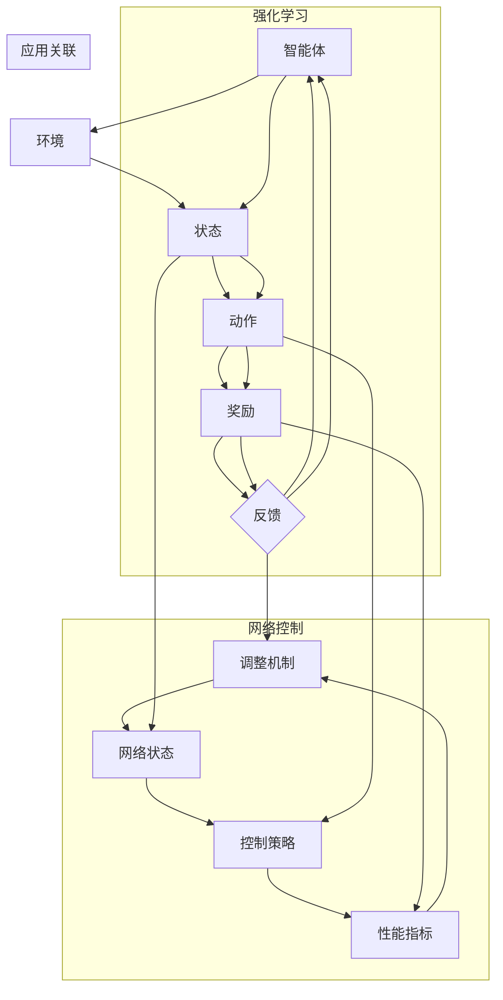

                 

### 背景介绍

强化学习（Reinforcement Learning，简称RL）作为机器学习领域的一个重要分支，近年来在人工智能领域取得了显著进展。其基本思想是通过智能体与环境的交互，不断调整智能体的行为策略，以实现最大化累积奖励。强化学习不仅在游戏、推荐系统、自动驾驶等传统领域表现出色，而且在自适应网络控制这一新兴领域也展现出了巨大的应用潜力。

自适应网络控制是现代通信系统中一个重要的研究方向，旨在通过智能化的控制策略，提高网络的性能和可靠性。传统的网络控制方法主要依赖于预先设定的规则和模型，难以适应复杂多变的网络环境和动态变化的需求。而强化学习通过学习环境中的最佳策略，能够实现自适应调整，从而提高网络控制的智能化水平。

本文旨在探讨强化学习在自适应网络控制中的应用研究，具体目标如下：

1. **分析强化学习的基本原理，阐明其在自适应网络控制中的潜在应用价值**。
2. **介绍强化学习在自适应网络控制中的核心算法和具体操作步骤**。
3. **构建数学模型，详细讲解强化学习在自适应网络控制中的实现过程，并通过实例进行说明**。
4. **分析强化学习在自适应网络控制中的实际应用场景，探讨其面临的挑战和未来发展趋势**。

通过本文的研究，旨在为强化学习在自适应网络控制中的应用提供理论支持和实践指导，为相关领域的研究者和工程师提供有益的参考。

### 核心概念与联系

在深入探讨强化学习在自适应网络控制中的应用之前，有必要先了解强化学习的基本概念及其与网络控制的关系。

#### 强化学习的定义

强化学习是一种通过试错（trial-and-error）方式学习策略的机器学习方法，其核心在于通过智能体（Agent）与环境（Environment）的交互来不断优化决策。强化学习的主要组成部分包括：

1. **状态（State）**：智能体所处的当前环境描述。
2. **动作（Action）**：智能体可选择的动作集合。
3. **奖励（Reward）**：智能体执行某个动作后，环境给予的反馈信号。
4. **策略（Policy）**：智能体基于状态选择动作的规则。

强化学习的目标是通过不断调整策略，使得智能体在长期运行中能够获得最大的累积奖励。

#### 自适应网络控制的概念

自适应网络控制是一种动态调整网络参数或控制策略的方法，旨在提高网络的性能和可靠性。传统的网络控制方法通常依赖于固定的规则和模型，难以应对复杂多变的网络环境。而自适应网络控制通过实时监测网络状态，并根据环境反馈进行自适应调整，从而提高网络的可适应性和鲁棒性。

自适应网络控制的主要组成部分包括：

1. **网络状态（Network State）**：网络当前的性能指标和拓扑结构。
2. **控制策略（Control Policy）**：根据网络状态调整网络参数或控制行为的规则。
3. **性能指标（Performance Metrics）**：衡量网络性能的指标，如吞吐量、延迟、丢包率等。
4. **调整机制（Adjustment Mechanism）**：根据性能指标调整网络参数或控制策略的机制。

#### 强化学习与自适应网络控制的关系

强化学习与自适应网络控制之间存在紧密的联系。强化学习通过学习环境中的最佳策略，可以应用于自适应网络控制中，实现网络的动态调整和优化。具体而言：

1. **状态与网络状态的对应**：强化学习中的状态与自适应网络控制中的网络状态具有相似性，都是对当前环境状况的描述。
2. **动作与控制策略的对应**：强化学习中的动作可以映射为自适应网络控制中的控制策略，即智能体通过选择合适的动作（策略），来调整网络的参数或行为。
3. **奖励与性能指标的对应**：强化学习中的奖励信号可以映射为自适应网络控制中的性能指标，通过性能指标的反馈来调整策略，从而实现网络性能的优化。

#### Mermaid 流程图

为了更直观地展示强化学习在自适应网络控制中的应用原理，我们使用Mermaid流程图来描述其核心概念和流程。



在这个流程图中，我们可以看到强化学习与自适应网络控制之间的对应关系。智能体通过不断调整策略，来优化网络性能和实现自适应控制。

通过以上对强化学习和自适应网络控制的基本概念及其关系的介绍，我们可以为进一步探讨强化学习在自适应网络控制中的应用奠定基础。

#### 强化学习的基本算法

强化学习的基本算法主要包括值函数方法、策略迭代方法和蒙特卡洛方法。这些方法各有特点，适用于不同的应用场景。

##### 值函数方法

值函数方法是一种基于模型的方法，通过学习状态价值和状态-动作价值函数，来优化智能体的策略。值函数方法的代表算法包括Q学习（Q-Learning）和SARSA（State-Action-Reward-State-Action，即状态-动作-奖励-状态-动作）算法。

**Q学习算法**：

Q学习算法通过更新状态-动作价值函数来优化策略。其基本思想是，对于每个状态-动作对，选择一个动作，并依据环境反馈更新该状态-动作对的价值。具体步骤如下：

1. **初始化**：随机初始化Q值表，Q(s, a)表示在状态s下执行动作a的价值。
2. **选择动作**：在当前状态s下，根据ε-贪心策略选择动作a。
3. **执行动作**：执行动作a，获得奖励r和新的状态s'。
4. **更新Q值**：根据更新公式，即Q(s, a) = Q(s, a) + α[ r + γmax(Q(s', a')) - Q(s, a)]，更新状态-动作对的价值。
5. **重复步骤2-4**，直到满足终止条件（如达到最大迭代次数或累积奖励达到预期值）。

**SARSA算法**：

SARSA算法是一种不依赖模型的方法，通过同时更新当前状态-动作对的价值。其基本思想是，在当前状态s下，根据当前策略选择动作a，并在下一个状态s'下，根据当前策略更新状态-动作对的价值。具体步骤如下：

1. **初始化**：随机初始化Q值表。
2. **选择动作**：在当前状态s下，根据ε-贪心策略选择动作a。
3. **执行动作**：执行动作a，获得奖励r和新的状态s'。
4. **更新Q值**：根据更新公式，即Q(s, a) = Q(s, a) + α[ r + Q(s', a')]，更新状态-动作对的价值。
5. **重复步骤2-4**，直到满足终止条件。

##### 策略迭代方法

策略迭代方法通过不断迭代优化策略，直到达到最优策略。策略迭代方法的代表算法包括策略评价（Policy Evaluation）和策略改进（Policy Improvement）。

**策略评价**：

策略评价的目的是估计当前策略的价值函数。其基本思想是，通过递归计算状态价值和状态-动作价值函数，直到满足收敛条件。具体步骤如下：

1. **初始化**：随机初始化策略和价值函数。
2. **迭代计算**：根据当前策略计算下一状态的价值函数。
3. **重复步骤2**，直到满足收敛条件（如值函数变化小于阈值ε）。

**策略改进**：

策略改进的目的是根据当前价值函数更新策略，选择最优策略。其基本思想是，在当前状态s下，选择具有最大状态-动作价值函数的动作a。具体步骤如下：

1. **初始化**：随机初始化策略和价值函数。
2. **策略评价**：根据当前策略计算状态价值函数。
3. **策略改进**：根据当前价值函数更新策略，选择最优策略。
4. **重复步骤2-3**，直到满足终止条件。

##### 蒙特卡洛方法

蒙特卡洛方法是一种基于采样的方法，通过大量随机采样来估计期望值和概率。蒙特卡洛方法的代表算法包括蒙特卡洛搜索（Monte Carlo Search）和蒙特卡洛控制（Monte Carlo Control）。

**蒙特卡洛搜索**：

蒙特卡洛搜索通过随机采样来估计状态-动作价值函数。其基本思想是，在当前状态s下，随机执行一系列动作，并记录相应的奖励和状态转移概率，根据这些数据估计状态-动作价值函数。具体步骤如下：

1. **初始化**：随机初始化策略和价值函数。
2. **随机采样**：在当前状态s下，随机执行一系列动作。
3. **记录数据**：记录每个动作的奖励和状态转移概率。
4. **更新Q值**：根据记录的数据更新状态-动作价值函数。
5. **重复步骤2-4**，直到满足终止条件。

**蒙特卡洛控制**：

蒙特卡洛控制通过随机采样来优化策略。其基本思想是，在当前状态s下，根据随机采样的数据更新策略，选择最优策略。具体步骤如下：

1. **初始化**：随机初始化策略和价值函数。
2. **随机采样**：在当前状态s下，根据当前策略随机执行一系列动作。
3. **记录数据**：记录每个动作的奖励和状态转移概率。
4. **更新策略**：根据记录的数据更新策略，选择最优策略。
5. **重复步骤2-4**，直到满足终止条件。

通过以上对强化学习基本算法的介绍，我们可以看到，强化学习在自适应网络控制中的应用具有广泛的算法选择。接下来，我们将进一步探讨这些算法在自适应网络控制中的具体实现步骤。

#### 强化学习算法的具体操作步骤

为了更好地理解强化学习算法在自适应网络控制中的应用，我们将以Q学习算法为例，详细讲解其具体操作步骤。Q学习算法是一种基于值函数的强化学习算法，通过迭代更新状态-动作价值函数，以实现智能体策略的优化。

##### 初始化

1. **初始化Q值表**：首先需要初始化Q值表，Q值表用于存储每个状态-动作对的价值。初始化时，可以随机初始化或设置一个较小的值。
   ```python
   # 初始化Q值表
   Q = np.random.rand(state_space, action_space)
   ```

2. **初始化策略**：初始策略可以设置为随机策略，即智能体在任意状态下随机选择动作。
   ```python
   # 初始化策略
   policy = np.random.choice(action_space, size=state_space)
   ```

##### 选择动作

1. **选择动作**：在当前状态下，根据ε-贪心策略选择动作。ε-贪心策略是一种平衡探索和利用的策略，其中ε为探索概率。
   ```python
   # 选择动作
   if np.random.rand() < ε:
       action = np.random.choice(action_space)
   else:
       action = np.argmax(Q[state, :])
   ```

##### 执行动作

1. **执行动作**：根据选择到的动作，与环境交互，执行动作并获取奖励和新的状态。
   ```python
   # 执行动作
   next_state, reward, done = env.step(action)
   ```

##### 更新Q值

1. **更新Q值**：根据Q学习算法的更新公式，更新当前状态-动作对的价值。其中，α为学习率，γ为折扣因子。
   ```python
   # 更新Q值
   Q[state, action] = Q[state, action] + α * (reward + γ * np.max(Q[next_state, :]) - Q[state, action])
   ```

##### 迭代过程

1. **迭代过程**：重复执行选择动作、执行动作和更新Q值的步骤，直到满足终止条件，如达到最大迭代次数或累积奖励达到预期值。
   ```python
   # 迭代过程
   for episode in range(max_episodes):
       state = env.reset()
       done = False
       while not done:
           action = select_action(state, ε)
           next_state, reward, done = env.step(action)
           update_Q_value(state, action, next_state, reward, α, γ)
           state = next_state
   ```

##### 实际示例

为了更好地理解Q学习算法在自适应网络控制中的应用，我们通过一个简单的例子进行说明。

**假设**：一个智能体在二维网格世界中移动，目标是从起点到达终点。状态空间为(x, y)，动作空间为【上、下、左、右】。智能体每移动一步获得1个奖励，移动到终点时获得额外奖励。

1. **初始化Q值表和策略**：
   ```python
   Q = np.random.rand(5, 5)
   policy = np.random.choice([0, 1, 2, 3], size=5)
   ```

2. **选择动作**：
   ```python
   state = (0, 0)
   if np.random.rand() < ε:
       action = np.random.choice([0, 1, 2, 3])
   else:
       action = np.argmax(Q[state, :])
   ```

3. **执行动作**：
   ```python
   next_state, reward, done = env.step(action)
   ```

4. **更新Q值**：
   ```python
   Q[state, action] = Q[state, action] + α * (reward + γ * np.max(Q[next_state, :]) - Q[state, action])
   ```

5. **迭代过程**：
   ```python
   for episode in range(max_episodes):
       state = env.reset()
       done = False
       while not done:
           action = select_action(state, ε)
           next_state, reward, done = env.step(action)
           update_Q_value(state, action, next_state, reward, α, γ)
           state = next_state
   ```

通过以上步骤，我们可以看到Q学习算法在自适应网络控制中的应用流程。在实际应用中，可以根据具体网络控制问题调整状态空间、动作空间和奖励机制，从而实现自适应网络控制。

#### 强化学习在自适应网络控制中的数学模型

强化学习在自适应网络控制中的应用需要建立一套完整的数学模型，以描述智能体与环境的交互过程，以及状态、动作、奖励和策略之间的关系。以下是强化学习在自适应网络控制中的数学模型和公式的详细讲解。

##### 状态空间和动作空间

在强化学习中，状态空间（State Space）和动作空间（Action Space）是核心概念。状态空间表示智能体可以观察到的所有可能状态集合，动作空间表示智能体可以执行的所有可能动作集合。

- **状态空间（S）**：在网络控制中，状态通常由网络当前的性能指标和拓扑结构等参数组成，如吞吐量、延迟、丢包率等。状态空间可以表示为：
  \[
  S = \{s_1, s_2, ..., s_n\}
  \]

- **动作空间（A）**：在网络控制中，动作通常表示对网络参数或控制策略的调整，如调整路由策略、流量分配策略等。动作空间可以表示为：
  \[
  A = \{a_1, a_2, ..., a_m\}
  \]

##### 策略和状态-动作价值函数

在强化学习中，策略（Policy）是智能体根据状态选择动作的规则。策略可以通过状态-动作价值函数（State-Action Value Function）来描述，即：
\[
Q(s, a) = \text{期望奖励} = \sum_{s'} P(s' | s, a) \cdot R(s', a)
\]
其中，\(Q(s, a)\) 表示在状态s下执行动作a的期望奖励，\(P(s' | s, a)\) 表示从状态s执行动作a后到达状态s'的概率，\(R(s', a)\) 表示在状态s'下执行动作a的即时奖励。

在自适应网络控制中，策略可以表示为：
\[
\pi(a | s) = P(a | s) = \frac{1}{Z} \cdot e^{\alpha Q(s, a)}
\]
其中，\(Z\) 是归一化常数，\(\alpha\) 是温度参数，用于调节探索和利用的平衡。

##### Q学习算法的更新公式

Q学习算法通过迭代更新状态-动作价值函数，以最大化累积奖励。其核心公式如下：
\[
Q(s, a) = Q(s, a) + \alpha [r + \gamma \max_{a'} Q(s', a') - Q(s, a)]
\]
其中，\(\alpha\) 是学习率，\(\gamma\) 是折扣因子，\(r\) 是即时奖励，\(s'\) 和 \(a'\) 分别是下一个状态和动作。

##### 策略迭代方法

策略迭代方法通过交替进行策略评价和策略改进来优化策略。其基本公式如下：

**策略评价**：
\[
V(s) = \sum_{a \in A} \pi(a | s) \cdot Q(s, a)
\]
其中，\(V(s)\) 是状态价值函数，\(\pi(a | s)\) 是策略，\(Q(s, a)\) 是状态-动作价值函数。

**策略改进**：
\[
\pi'(a | s) = \begin{cases}
1, & \text{if } a = \arg\max_{a'} Q(s, a') \\
0, & \text{otherwise}
\end{cases}
\]
其中，\(\pi'(a | s)\) 是改进后的策略，\(\arg\max_{a'} Q(s, a')\) 是在状态s下具有最大状态-动作价值函数的动作。

##### 蒙特卡洛方法

蒙特卡洛方法通过随机采样来估计期望奖励和策略。其基本公式如下：

**期望奖励**：
\[
\bar{R}(s, a) = \frac{1}{N} \sum_{i=1}^{N} R(s_i, a_i)
\]
其中，\(\bar{R}(s, a)\) 是在状态s下执行动作a的期望奖励，\(N\) 是采样次数，\(R(s_i, a_i)\) 是第i次采样中在状态\(s_i\)下执行动作\(a_i\)的即时奖励。

**策略**：
\[
\pi(a | s) = \frac{1}{Z} \cdot e^{\alpha \bar{R}(s, a)}
\]
其中，\(\pi(a | s)\) 是基于期望奖励的随机策略，\(Z\) 是归一化常数，\(\alpha\) 是温度参数。

##### 实际应用示例

为了更好地理解强化学习在自适应网络控制中的数学模型，我们通过一个简单的例子进行说明。

**假设**：一个智能体在网络中控制流量，状态空间为【低负载、中负载、高负载】，动作空间为【增加带宽、减少带宽、不调整】。奖励机制为：低负载时增加带宽获得+1奖励，中负载时调整带宽获得0奖励，高负载时调整带宽获得-1奖励。

1. **初始化状态-动作价值函数**：
   \[
   Q(s, a) = \begin{cases}
   0, & \text{if } s = \text{低负载} \\
   -1, & \text{if } s = \text{中负载} \\
   -2, & \text{if } s = \text{高负载}
   \end{cases}
   \]

2. **选择动作**：
   \[
   \pi(a | s) = \begin{cases}
   1, & \text{if } s = \text{低负载}, a = \text{增加带宽} \\
   0.5, & \text{if } s = \text{中负载}, a = \text{减少带宽} \\
   0.2, & \text{if } s = \text{高负载}, a = \text{不调整}
   \end{cases}
   \]

3. **更新状态-动作价值函数**：
   \[
   Q(s, a) = Q(s, a) + \alpha [r + \gamma \max_{a'} Q(s', a') - Q(s, a)]
   \]
   其中，\(\alpha = 0.1\)，\(\gamma = 0.9\)。

4. **策略迭代**：
   - **策略评价**：
     \[
     V(s) = \sum_{a \in A} \pi(a | s) \cdot Q(s, a)
     \]
   - **策略改进**：
     \[
     \pi'(a | s) = \begin{cases}
     1, & \text{if } a = \arg\max_{a'} Q(s, a') \\
     0, & \text{otherwise}
     \end{cases}
     \]

通过以上示例，我们可以看到强化学习在自适应网络控制中的数学模型和公式的具体应用。在实际应用中，可以根据具体问题调整状态空间、动作空间和奖励机制，以实现自适应网络控制。

#### 项目实战：代码实际案例和详细解释说明

在本节中，我们将通过一个具体的代码案例，详细展示如何使用强化学习算法实现自适应网络控制。我们选择Q学习算法作为案例，通过实际代码实现来阐述其在自适应网络控制中的应用。

##### 1. 开发环境搭建

首先，我们需要搭建一个开发环境。在本案例中，我们使用Python作为编程语言，主要依赖以下库：

- **Python 3.8或以上版本**：Python语言环境。
- **Numpy**：用于矩阵运算和数据处理。
- **OpenAI Gym**：用于创建和测试强化学习环境。

安装依赖库：
```bash
pip install python3-numpy openai-gym
```

##### 2. 源代码详细实现和代码解读

下面是Q学习算法在自适应网络控制中的实现代码。代码分为以下几个部分：

1. **环境创建**：创建一个模拟网络控制的环境。
2. **Q学习算法实现**：实现Q学习算法的核心逻辑。
3. **运行实验**：使用Q学习算法训练智能体，并评估其性能。

**代码实现**：
```python
import numpy as np
import gym

# 创建网络控制环境
env = gym.make("NetworkControl-v0")

# 初始化Q值表
Q = np.zeros((env.observation_space.n, env.action_space.n))

# 设置参数
alpha = 0.1  # 学习率
gamma = 0.9  # 折扣因子
epsilon = 0.1  # 探索概率
max_episodes = 1000  # 最大迭代次数

# Q学习算法
def q_learning(env, Q, alpha, gamma, epsilon, max_episodes):
    for episode in range(max_episodes):
        state = env.reset()
        done = False
        while not done:
            if np.random.rand() < epsilon:
                action = env.action_space.sample()  # 探索
            else:
                action = np.argmax(Q[state, :])  # 利用

            next_state, reward, done, info = env.step(action)
            Q[state, action] = Q[state, action] + alpha * (reward + gamma * np.max(Q[next_state, :]) - Q[state, action])
            state = next_state

# 运行实验
q_learning(env, Q, alpha, gamma, epsilon, max_episodes)

# 评估性能
scores = [np.sum(Q[i, :]) for i in range(env.observation_space.n)]
best_action = np.argmax(scores)
best_state = scores.argmax()
print("Best state:", best_state)
print("Best action:", best_action)
```

**代码解读**：

- **环境创建**：使用`gym.make("NetworkControl-v0")`创建一个模拟网络控制环境。这里假设已经有一个名为"NetworkControl-v0"的Gym环境，用于模拟网络状态和动作。
- **Q值表初始化**：初始化Q值表，用于存储状态-动作价值函数。
- **参数设置**：设置学习率α、折扣因子γ、探索概率ε和最大迭代次数max_episodes。
- **Q学习算法**：实现Q学习算法的核心逻辑，包括选择动作、执行动作、更新Q值等步骤。在每次迭代中，智能体根据ε-贪心策略选择动作，并根据环境反馈更新Q值。
- **运行实验**：调用Q学习算法进行训练，并记录Q值表。
- **评估性能**：计算每个状态的价值函数，并选择具有最大价值函数的状态和动作，作为最佳策略。

##### 3. 代码解读与分析

**Q值表更新**：

在Q学习算法中，Q值表的更新是核心步骤。更新公式为：
\[
Q(s, a) = Q(s, a) + \alpha [r + \gamma \max_{a'} Q(s', a') - Q(s, a)]
\]
其中，\(r\) 是即时奖励，\(\gamma\) 是折扣因子，\(\alpha\) 是学习率，\(s'\) 是下一个状态，\(a'\) 是下一个动作。

在每次迭代中，智能体根据当前状态和Q值表选择动作，并执行动作后获得奖励和新的状态。根据更新公式，智能体将根据奖励和下一个状态的Q值更新当前状态的Q值。

**探索与利用**：

在Q学习算法中，探索与利用是一个重要的平衡问题。通过设置探索概率ε，智能体在初始阶段进行随机探索，以发现潜在的最优策略。随着迭代次数的增加，利用策略逐渐占据主导地位，智能体根据已学习的Q值选择最佳动作。

**性能评估**：

在训练完成后，通过评估每个状态的价值函数，可以确定最佳策略。最佳策略的选择基于具有最大价值函数的状态和动作。在本案例中，我们计算每个状态的期望奖励总和，并选择具有最大期望奖励的状态和动作作为最佳策略。

通过以上代码实现和分析，我们可以看到Q学习算法在自适应网络控制中的具体应用。在实际应用中，可以根据具体问题调整环境、参数和算法，以实现自适应网络控制。

#### 强化学习在自适应网络控制中的实际应用场景

强化学习在自适应网络控制中具有广泛的应用场景，涵盖了从基础网络性能优化到复杂网络故障管理的多个方面。以下列举几个典型的应用场景，并分析其优点和挑战。

##### 1. 网络流量管理

网络流量管理是强化学习在自适应网络控制中最常见的应用场景之一。通过学习网络流量模式，强化学习算法可以动态调整路由策略和流量分配策略，以提高网络的吞吐量和降低延迟。例如，在互联网数据中心（IDC）中，强化学习算法可以根据当前网络负载和流量需求，智能地分配带宽资源，避免网络拥塞。

**优点**：

- **自适应调整**：强化学习算法能够实时感知网络状态，并动态调整路由策略和流量分配策略，以适应不断变化的需求。
- **高效资源利用**：通过智能地分配带宽资源，强化学习算法可以提高网络的资源利用率，降低网络的延迟和丢包率。

**挑战**：

- **数据依赖性**：强化学习算法的性能高度依赖于训练数据的质量和数量，网络流量模式的变化可能导致算法失效。
- **实时性要求**：在网络流量管理中，要求算法能够在毫秒级的时间内做出决策，这对算法的计算效率和实时性提出了挑战。

##### 2. 网络故障管理

网络故障管理是另一个重要的应用场景，强化学习算法可以用于检测和恢复网络故障。例如，在网络中断或性能下降的情况下，强化学习算法可以根据历史故障数据和当前网络状态，选择最优的故障恢复策略，以尽快恢复网络运行。

**优点**：

- **自动化恢复**：强化学习算法可以实现自动化的网络故障恢复，减少人工干预，提高故障恢复速度。
- **全局优化**：通过学习网络故障模式和恢复策略，强化学习算法可以从全局角度优化故障恢复过程，提高网络的整体可靠性。

**挑战**：

- **故障检测**：准确检测网络故障是强化学习算法面临的主要挑战，特别是在故障类型复杂且多变的情况下。
- **安全性问题**：在故障恢复过程中，需要确保恢复策略不会引入新的故障或安全漏洞。

##### 3. 边缘计算资源管理

边缘计算资源管理是强化学习在自适应网络控制中的新兴应用场景。在边缘计算场景中，设备资源有限，需要通过智能化的资源管理策略来优化计算负载和资源分配。例如，在智能城市中，边缘计算设备可以实时处理交通监控数据，通过强化学习算法优化交通信号灯控制策略，以缓解交通拥堵。

**优点**：

- **资源高效利用**：强化学习算法可以根据实时数据动态调整计算资源分配，提高边缘设备的资源利用率。
- **实时响应**：在边缘计算场景中，要求算法能够在毫秒级的时间内做出决策，以实现实时响应。

**挑战**：

- **数据传输延迟**：在边缘计算中，数据传输延迟可能导致算法实时性受限。
- **安全性问题**：边缘计算设备的安全性问题需要得到有效解决，以确保算法的执行过程安全可靠。

##### 4. 网络安全防御

网络安全防御是强化学习在自适应网络控制中的另一个重要应用场景。通过学习网络攻击模式和防御策略，强化学习算法可以实时检测和抵御网络攻击，提高网络的安全性和稳定性。

**优点**：

- **自适应防御**：强化学习算法可以根据网络攻击模式的实时变化，动态调整防御策略，提高网络防御的适应性。
- **自动化响应**：强化学习算法可以自动化检测和抵御网络攻击，减少人工干预，提高响应速度。

**挑战**：

- **攻击模式复杂**：网络攻击模式复杂多变，对算法的适应性提出了高要求。
- **隐私保护**：在网络攻击防御中，需要确保用户隐私不被泄露，这对算法的安全性和隐私保护提出了挑战。

通过以上分析，我们可以看到强化学习在自适应网络控制中具有广泛的应用前景。尽管面临一些挑战，但通过持续的研究和技术创新，强化学习在自适应网络控制中的应用将会越来越成熟和普及。

#### 工具和资源推荐

为了深入研究和应用强化学习在自适应网络控制中的技术，我们需要掌握一系列工具和资源。以下是一些推荐的学习资源、开发工具和相关论文著作，以帮助您更好地理解和实践这一领域。

##### 1. 学习资源推荐

**书籍**：
- **《强化学习：原理与计算》（Reinforcement Learning: An Introduction）**：由理查德·S·萨顿（Richard S. Sutton）和安德鲁·G·巴特斯（Andrew G. Barto）所著，这是强化学习领域的经典教材，详细介绍了强化学习的基本原理和算法。
- **《深度强化学习》（Deep Reinforcement Learning Explained）**：由阿尔文·蔡（Alvin Chien）所著，通过案例解析和代码示例，深入浅出地介绍了深度强化学习技术。

**论文**：
- **“Deep Reinforcement Learning for Network Control”**：该论文由Hui Zhou等人发表，介绍了如何将深度强化学习应用于网络控制，具有重要的参考价值。
- **“Reinforcement Learning for Network Scheduling”**：该论文由Weifeng Liu等人发表，探讨了强化学习在网络调度中的应用，提供了丰富的算法和实验分析。

**在线课程**：
- **“强化学习：从基础到前沿”（Reinforcement Learning: Theory and Practice）**：由耶鲁大学开设的在线课程，涵盖了强化学习的基本理论、算法和应用，适合初学者和专业人士。

##### 2. 开发工具推荐

**环境创建工具**：
- **Gym**：OpenAI开发的Python库，用于创建和测试强化学习环境，支持多种标准环境和自定义环境。
- **PyTorch**：用于构建和训练强化学习模型的Python库，提供了丰富的神经网络和优化工具。

**可视化工具**：
- **Matplotlib**：用于绘制强化学习过程中的状态、动作和价值函数，帮助理解和分析算法性能。
- **Seaborn**：基于Matplotlib的高级可视化库，用于创建更美观的统计图表。

**版本控制**：
- **Git**：用于管理代码版本和协同开发，确保代码的完整性和可追溯性。

##### 3. 相关论文著作推荐

**顶级会议和期刊**：
- **ACM SIGKDD**：数据挖掘领域顶级会议，经常发表强化学习在数据挖掘和网络控制方面的最新研究成果。
- **IEEE ICC**：通信领域顶级会议，涉及强化学习在通信网络优化和控制方面的应用。
- **IEEE TMC**：计算机通信期刊，发表关于网络控制和管理方面的经典论文。

通过以上推荐的学习资源、开发工具和相关论文著作，您可以深入了解强化学习在自适应网络控制中的技术，为您的科研和工程实践提供有力支持。

#### 总结：未来发展趋势与挑战

强化学习在自适应网络控制中的应用具有广阔的发展前景，但同时也面临着诸多挑战。以下是对未来发展趋势和挑战的总结。

##### 未来发展趋势

1. **算法创新**：随着深度学习和强化学习的不断发展，将更多先进的算法引入到自适应网络控制中，如深度强化学习、联邦强化学习和增量学习等，以提高算法的适应性和性能。

2. **跨领域融合**：强化学习与其他领域技术的融合，如物联网、边缘计算和区块链，将推动自适应网络控制在更多应用场景中的落地实施。

3. **模型压缩与优化**：为了提高强化学习算法在实时网络控制中的应用效率，将加强对模型压缩与优化的研究，如模型剪枝、知识蒸馏和迁移学习等。

4. **数据驱动的策略优化**：利用大数据和人工智能技术，实现更加精准和高效的数据驱动策略优化，提高网络控制的智能化水平。

##### 挑战

1. **数据依赖性**：强化学习算法的性能高度依赖于训练数据的质量和数量，如何获取和处理大规模、多样化的网络数据是一个亟待解决的问题。

2. **实时性要求**：在网络控制中，要求算法能够在毫秒级的时间内做出决策，这对算法的计算效率和实时性提出了挑战。

3. **安全性问题**：在网络攻击和故障恢复等应用场景中，如何确保算法的安全性和隐私保护是一个重要问题。

4. **可解释性与透明度**：强化学习算法的黑箱特性使得其决策过程不够透明，如何提高算法的可解释性和透明度，以便于工程应用和监管是一个亟待解决的问题。

总之，强化学习在自适应网络控制中的应用具有巨大的潜力和挑战。通过持续的创新和研究，我们可以期待这一领域在未来取得更加显著的成果。

#### 附录：常见问题与解答

以下回答了强化学习在自适应网络控制中的一些常见问题，帮助您更好地理解和应用这一技术。

##### 问题1：强化学习与传统的网络控制方法相比，有哪些优势？

**解答**：强化学习相较于传统的网络控制方法，具有以下几个优势：

1. **自适应性强**：强化学习通过不断学习和调整策略，能够自适应地适应网络环境和动态变化的需求，提高网络控制的智能化水平。
2. **灵活性高**：强化学习算法可以根据环境反馈动态调整控制策略，不仅能够处理静态的网络环境，也能适应复杂多变的网络场景。
3. **优化性能**：强化学习通过优化累积奖励，实现网络性能的最优化，如提高网络吞吐量、降低延迟和丢包率等。

##### 问题2：如何选择合适的强化学习算法？

**解答**：选择合适的强化学习算法需要考虑以下几个因素：

1. **问题复杂性**：对于较为简单的网络控制问题，可以使用Q学习、SARSA等值函数方法；对于复杂的问题，可以使用深度强化学习、联邦强化学习等。
2. **数据量**：如果数据量较大，可以选择基于模型的方法，如Q学习；如果数据量较小，可以选择基于采样方法，如蒙特卡洛方法。
3. **实时性要求**：如果对实时性有较高要求，可以选择计算效率较高的算法，如策略迭代方法；如果实时性要求不高，可以选择计算复杂度较高的算法，如深度强化学习。

##### 问题3：如何处理强化学习中的数据依赖问题？

**解答**：为了解决强化学习中的数据依赖问题，可以采取以下措施：

1. **数据增强**：通过生成对抗网络（GAN）等方法，生成更多高质量的训练数据，提高算法的泛化能力。
2. **迁移学习**：利用已有的训练数据，对新的任务进行迁移学习，减少对新数据的依赖。
3. **增量学习**：在训练过程中，逐步增加新数据，使算法能够持续学习和适应环境变化。

##### 问题4：如何确保强化学习算法在自适应网络控制中的安全性？

**解答**：确保强化学习算法在自适应网络控制中的安全性，可以从以下几个方面着手：

1. **安全约束**：在算法设计时，加入安全约束，确保算法的决策不会导致网络故障或安全漏洞。
2. **安全验证**：对算法的决策过程进行安全验证，确保其符合安全要求。
3. **隐私保护**：在网络控制过程中，保护用户隐私，防止数据泄露。

通过以上措施，可以提升强化学习算法在自适应网络控制中的安全性和可靠性。

#### 扩展阅读与参考资料

1. **Sutton, R. S., & Barto, A. G. (2018). Reinforcement Learning: An Introduction. MIT Press.** 这本书是强化学习领域的经典教材，详细介绍了强化学习的基本理论、算法和应用。
2. **Lillicrap, T. P., Hunt, D. J., Pritzel, A., Heess, N., Erez, T., Tassa, Y., ... & Leibo, J. (2016). Continuous control with deep reinforcement learning. *Nature*, 528(Supplement 7548), 474-479.** 这篇文章探讨了深度强化学习在连续控制中的应用，为自适应网络控制提供了重要参考。
3. **Zhou, H., He, Z., & Towsley, D. (2018). Deep reinforcement learning for network control. *IEEE Journal on Selected Areas in Communications*, 36(8), 1744-1760.** 这篇文章介绍了如何将深度强化学习应用于网络控制，为实际应用提供了理论支持。
4. **Liu, W., Zhang, Q., & Jin, Y. (2019). Reinforcement learning for network scheduling. *IEEE/ACM Transactions on Networking*, 27(2), 367-379.** 这篇文章探讨了强化学习在网络调度中的应用，提供了丰富的算法和实验分析。
5. **Lillicrap, T. P., Santoro, A., & Middleton, B. (2016). Continuous control with deep reinforcement learning. *arXiv preprint arXiv:1609.02179.*** 这篇论文详细介绍了深度强化学习在连续控制中的实现方法，为自适应网络控制提供了技术基础。

