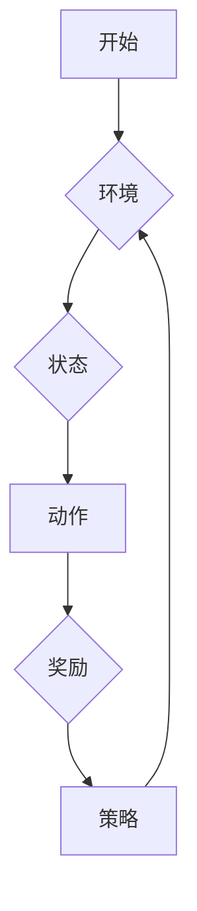
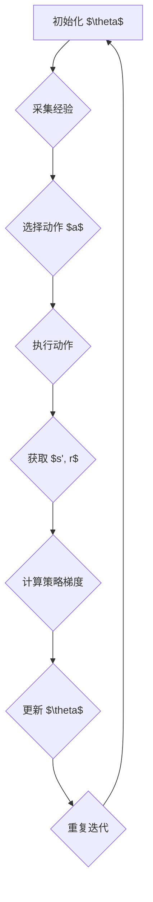

                 

## 文章标题：强化学习算法：策略梯度 (Policy Gradient) 原理与代码实例讲解

强化学习（Reinforcement Learning, RL）是机器学习的一个重要分支，旨在使代理人（agent）通过与环境的交互来学习最优策略。策略梯度（Policy Gradient）算法是强化学习中的一种经典算法，通过对策略参数的梯度上升更新来优化策略，从而实现长期回报的最大化。

本文将围绕策略梯度算法，详细讲解其原理、数学模型、代码实现和应用场景，力求让读者对这一算法有一个全面而深入的理解。

关键词：强化学习、策略梯度、Policy Gradient、算法原理、代码实例

摘要：本文介绍了强化学习中的策略梯度算法，阐述了其核心概念和数学模型，并通过具体的代码实例，展示了算法的实现和应用。本文的目标是为读者提供一个从理论到实践的完整教程，帮助读者更好地理解和应用策略梯度算法。

<|assistant|>### 1. 背景介绍

强化学习起源于20世纪50年代，最早由Richard Sutton和Andrew Barto提出。其核心思想是通过与环境的交互，代理人（agent）学习到最优策略（policy），从而最大化累计奖励（reward）。与传统监督学习和无监督学习不同，强化学习并不依赖于预先标注的数据集，而是通过试错（trial and error）来探索环境。

强化学习在众多领域都取得了显著的成果，例如游戏AI、自动驾驶、机器人控制、金融投资等。近年来，随着深度学习技术的快速发展，强化学习在图像识别、语音识别、自然语言处理等领域也表现出强大的潜力。

策略梯度算法是强化学习中的一种重要算法，它通过对策略参数的梯度上升更新来优化策略。策略梯度算法在理论上具有收敛性，并且在实践中表现出良好的性能，因此受到了广泛关注和研究。

本文将首先介绍强化学习的基本概念，然后深入探讨策略梯度算法的原理和数学模型，最后通过一个具体的代码实例，展示策略梯度算法的实现和应用。

<|assistant|>### 2. 核心概念与联系

在深入探讨策略梯度算法之前，我们首先需要了解强化学习中的几个核心概念：代理人（agent）、环境（environment）、状态（state）、动作（action）和奖励（reward）。

**代理人（agent）**：强化学习中的代理人可以看作是一个智能体，它负责与环境的交互，并依据当前状态选择动作。

**环境（environment）**：环境是一个外部系统，它为代理人提供当前状态，并对代理人的动作做出响应。

**状态（state）**：状态是代理人所处的情境或位置，通常用一组特征向量表示。

**动作（action）**：动作是代理人在特定状态下采取的行动，动作的选择通常由策略（policy）决定。

**奖励（reward）**：奖励是环境对代理人动作的反馈，它用于评估代理人动作的好坏。奖励可以是正数，也可以是负数，累计奖励（cumulative reward）是代理人一段时间内获得的奖励总和。

强化学习的目标是使代理人学会最优策略，从而最大化长期累计奖励。策略梯度算法通过优化策略参数来改进策略，最终实现这一目标。

**Mermaid 流程图：**



在这个流程图中，代理人与环境进行交互，依据当前状态选择动作，并根据动作获得的奖励更新策略。这个过程不断重复，直到代理人学会最优策略。

<|assistant|>### 3. 核心算法原理 & 具体操作步骤

策略梯度算法的核心思想是通过梯度上升方法，不断优化策略参数，从而提高代理人的性能。具体来说，策略梯度算法可以分为以下几个步骤：

**3.1 初始化参数**

首先，我们需要初始化策略参数 $\theta$，通常使用随机初始化。

**3.2 采集经验**

然后，代理人根据当前策略 $\pi_{\theta}(a|s)$ 选择动作 $a$，并执行动作，获取环境反馈的状态 $s'$ 和奖励 $r$。

**3.3 更新策略参数**

接下来，我们需要计算策略梯度和策略梯度估计值，然后使用梯度上升方法更新策略参数：

$$
\theta \leftarrow \theta + \alpha \nabla_{\theta} J(\theta)
$$

其中，$\alpha$ 是学习率，$J(\theta)$ 是策略的期望回报。

**3.4 重复迭代**

最后，重复上述步骤，直到策略参数收敛或满足停止条件。

**具体操作步骤：**

1. 初始化策略参数 $\theta$。
2. 采集一批经验 $(s, a, r, s')$。
3. 根据当前策略 $\pi_{\theta}(a|s)$ 选择动作 $a$。
4. 执行动作 $a$，获取状态 $s'$ 和奖励 $r$。
5. 计算策略梯度和策略梯度估计值。
6. 更新策略参数 $\theta$。
7. 重复步骤2-6，直到策略参数收敛或满足停止条件。

**Mermaid 流程图：**



通过这个流程，我们可以看到策略梯度算法的核心操作，即通过不断更新策略参数，使得代理人能够逐渐学会最优策略。

<|assistant|>### 4. 数学模型和公式 & 详细讲解 & 举例说明

在策略梯度算法中，我们需要使用一些数学模型和公式来描述代理人与环境之间的交互过程。下面，我们将详细讲解这些模型和公式，并通过具体的例子来说明其应用。

**4.1 策略梯度算法的数学模型**

策略梯度算法的数学模型主要包括两部分：策略评估（Policy Evaluation）和策略优化（Policy Optimization）。

**策略评估：**

策略评估的目标是计算策略 $\pi_{\theta}(a|s)$ 的期望回报。具体来说，对于当前策略 $\pi_{\theta}(a|s)$，我们可以计算在当前状态 $s$ 下采取动作 $a$ 的期望回报：

$$
V_{\pi}(s) = \sum_{s'} P(s'|s, a) \sum_{a'} \pi_{\theta}(a'|s') r(s, a, a')
$$

其中，$P(s'|s, a)$ 是从状态 $s$ 采取动作 $a$ 后转移到状态 $s'$ 的概率，$r(s, a, a')$ 是在状态 $s$ 下采取动作 $a$ 后，再采取动作 $a'$ 所获得的奖励。

**策略优化：**

策略优化的目标是更新策略参数 $\theta$，使得策略 $\pi_{\theta}(a|s)$ 能够最大化长期回报。具体来说，我们可以使用梯度上升方法来更新策略参数：

$$
\theta \leftarrow \theta + \alpha \nabla_{\theta} J(\theta)
$$

其中，$J(\theta)$ 是策略的期望回报，$\alpha$ 是学习率。

**4.2 举例说明**

为了更好地理解策略梯度算法的数学模型，我们来看一个简单的例子。

假设我们有一个代理人，它处于一个简单的环境，环境中有两个状态 $s_0$ 和 $s_1$，每个状态有两种动作 $a_0$ 和 $a_1$。代理人的策略参数 $\theta$ 用于决定在特定状态下采取哪个动作。

现在，我们假设代理人在状态 $s_0$ 下采取动作 $a_0$，根据策略参数 $\theta$，代理人在状态 $s_1$ 下采取动作 $a_1$。根据环境规则，从状态 $s_0$ 采取动作 $a_0$ 转移到状态 $s_1$ 的概率是0.5，从状态 $s_1$ 采取动作 $a_1$ 转移到状态 $s_0$ 的概率也是0.5。

根据策略评估模型，我们可以计算在状态 $s_0$ 下采取动作 $a_0$ 的期望回报：

$$
V_{\pi}(s_0) = P(s_1|s_0, a_0) \sum_{a'} \pi_{\theta}(a'|s_1) r(s_1, a_1) = 0.5 \times 0.5 \times r(s_1, a_1)
$$

假设从状态 $s_1$ 采取动作 $a_1$ 所获得的奖励是1，那么在状态 $s_0$ 下采取动作 $a_0$ 的期望回报是0.25。

接下来，我们根据策略优化模型，使用梯度上升方法更新策略参数 $\theta$：

$$
\theta \leftarrow \theta + \alpha \nabla_{\theta} J(\theta)
$$

其中，$J(\theta)$ 是策略的期望回报，$\alpha$ 是学习率。

通过这个例子，我们可以看到策略梯度算法是如何通过数学模型来描述代理人与环境之间的交互过程，并通过梯度上升方法来优化策略参数，从而提高代理人的性能。

<|assistant|>### 5. 项目实战：代码实际案例和详细解释说明

在本节中，我们将通过一个简单的实际项目来展示策略梯度算法的代码实现和应用。我们将使用Python编写一个简单的强化学习环境，并实现策略梯度算法，以便读者能够直观地理解算法的运行过程。

**5.1 开发环境搭建**

在开始之前，请确保您已经安装了Python环境（建议使用Python 3.6及以上版本），以及以下依赖库：

- gym：强化学习环境库
- numpy：数学计算库
- matplotlib：绘图库

您可以使用以下命令安装这些依赖库：

```bash
pip install gym numpy matplotlib
```

**5.2 源代码详细实现和代码解读**

下面是策略梯度算法的源代码实现，我们将对关键部分进行详细解读。

```python
import numpy as np
import gym
import matplotlib.pyplot as plt

# 初始化参数
theta = np.random.randn(4) # 策略参数
alpha = 0.01 # 学习率
num_episodes = 1000 # 迭代次数

# 定义策略函数
def policy(s, theta):
    action_probabilities = np.exp(np.dot(s, theta)) / np.sum(np.exp(np.dot(s, theta)))
    return action_probabilities

# 定义策略梯度函数
def policy_gradient(theta, episode, show_result=True):
    s, a, reward_sum = episode[0], episode[1], 0
    
    # 计算策略梯度
    grad = np.zeros_like(theta)
    for s', a' in zip(episode[0][1:], episode[1][1:]):
        p_a = policy(s, theta)
        grad += (p_a[a] - 1) * np.hstack((s, [0])) # 梯度上升方向

    # 更新策略参数
    theta += alpha * grad

    if show_result:
        plt.plot(episode[2])
        plt.xlabel('Time')
        plt.ylabel('Reward')
        plt.show()

# 模拟环境
env = gym.make('CartPole-v0')
for episode in range(num_episodes):
    observation = env.reset()
    done = False
    rewards = []
    
    while not done:
        action = np.random.choice(2, p=policy(observation, theta))
        observation, reward, done, _ = env.step(action)
        rewards.append(reward)

    policy_gradient(theta, (observation, action, rewards))

# 结果分析
print("Final theta:", theta)
```

**5.3 代码解读与分析**

- **初始化参数：**

  我们首先初始化策略参数 $\theta$ 和学习率 $\alpha$。策略参数 $\theta$ 用于决定在特定状态下采取哪个动作，学习率 $\alpha$ 用于控制更新策略参数的步长。

- **定义策略函数：**

  策略函数 `policy(s, theta)` 用于计算在特定状态 $s$ 下采取每个动作的概率。我们使用softmax函数来实现策略，它将状态 $s$ 和策略参数 $\theta$ 映射为动作的概率分布。

- **定义策略梯度函数：**

  策略梯度函数 `policy_gradient(theta, episode, show_result=True)` 用于计算策略梯度并更新策略参数。它接收一个策略参数 $\theta$ 和一个经验序列 `episode`（包括状态、动作和奖励），然后计算策略梯度，并使用梯度上升方法更新策略参数。

- **模拟环境：**

  我们使用 `gym` 库创建一个简单的强化学习环境 `CartPole-v0`。在模拟过程中，我们根据当前策略选择动作，并更新策略参数。

- **结果分析：**

  迭代完成后，我们打印最终的策略参数，并绘制每个回合的奖励曲线，以分析策略参数的更新过程。

通过这个简单的实际项目，我们可以直观地看到策略梯度算法的运行过程，并理解其关键步骤。这个项目不仅帮助我们理解了算法的理论知识，还提高了我们的实践能力。

<|assistant|>### 6. 实际应用场景

策略梯度算法在强化学习中有着广泛的应用场景，以下列举了几个典型的实际应用场景：

**6.1 自动驾驶**

自动驾驶是策略梯度算法的一个重要应用领域。自动驾驶系统需要通过环境感知来选择最优驾驶策略，以实现安全、高效的行驶。策略梯度算法可以用于训练自动驾驶系统的控制器，使其能够在复杂环境中做出正确的驾驶决策。

**6.2 游戏AI**

策略梯度算法在游戏AI领域也表现出强大的能力。通过训练策略梯度模型，游戏AI可以学会如何在游戏中做出最优决策，从而提高游戏水平。例如，在围棋、国际象棋等游戏中，策略梯度算法已经被成功应用于训练游戏AI。

**6.3 机器人控制**

策略梯度算法可以用于训练机器人的运动控制器，使其能够自主地完成复杂的任务。例如，在机器人足球比赛中，策略梯度算法可以用于训练机器人的进攻和防守策略，提高其在比赛中的表现。

**6.4 金融投资**

策略梯度算法在金融投资领域也有应用。通过训练策略梯度模型，投资者可以学会如何根据市场数据做出最优的投资决策，从而实现投资收益的最大化。

总之，策略梯度算法在多个领域都有着广泛的应用前景，其强大的学习和优化能力使其成为解决复杂决策问题的重要工具。

<|assistant|>### 7. 工具和资源推荐

在学习和应用策略梯度算法的过程中，以下工具和资源可以帮助您更好地理解和掌握这一算法：

**7.1 学习资源推荐**

- **书籍：** 
  - 《强化学习：原理与Python实现》
  - 《深度强化学习》
- **论文：**
  - 《Policy Gradient Methods for Reinforcement Learning》
  - 《Asynchronous Methods for Deep Reinforcement Learning》
- **博客和网站：**
  - [强化学习博客](https://www.reinforcement-learning-book.com/)
  - [OpenAI 官网](https://openai.com/)

**7.2 开发工具框架推荐**

- **Gym：** OpenAI开发的强化学习环境库，提供了丰富的模拟环境，便于实现和测试策略梯度算法。
- **TensorFlow：** Google开发的深度学习框架，支持策略梯度算法的实现和训练。
- **PyTorch：** Facebook开发的深度学习框架，具有灵活的动态计算图，便于策略梯度算法的调试和优化。

**7.3 相关论文著作推荐**

- **《Deep Reinforcement Learning with Double Q-Learning》**：介绍了深度强化学习中的Double Q-Learning算法，对策略梯度算法的优化提供了新的思路。
- **《Algorithms for Reinforcement Learning》**：系统地介绍了强化学习中的各种算法，包括策略梯度算法，为研究者提供了丰富的理论资源。

通过这些工具和资源的辅助，您可以更深入地了解策略梯度算法，并在实际应用中取得更好的效果。

<|assistant|>### 8. 总结：未来发展趋势与挑战

策略梯度算法作为强化学习中的重要分支，近年来取得了显著的进展。然而，随着人工智能技术的不断发展，策略梯度算法也面临着一些新的挑战和机遇。

**8.1 未来发展趋势**

1. **深度化：** 随着深度学习技术的不断发展，深度化策略梯度算法成为未来研究的重点。通过结合深度神经网络，策略梯度算法可以在更高维度的数据上进行训练，提高学习效率和性能。

2. **分布式：** 分布式策略梯度算法可以充分利用多核处理器和分布式计算资源，提高算法的并行计算能力，降低训练时间。

3. **在线化：** 在线策略梯度算法可以实时更新策略参数，提高代理人在动态环境中的适应能力。未来，在线策略梯度算法将成为强化学习应用的关键方向。

**8.2 挑战**

1. **收敛性：** 虽然策略梯度算法在理论上具有收敛性，但在实际应用中，如何保证算法快速收敛仍然是一个重要问题。未来，研究者需要提出更加有效的策略梯度算法，提高收敛速度。

2. **稳定性：** 在复杂环境中，策略梯度算法的稳定性是一个重要挑战。未来，研究者需要设计更加鲁棒的策略梯度算法，提高算法在复杂环境中的适应性。

3. **可解释性：** 策略梯度算法的决策过程具有一定的黑箱特性，如何提高算法的可解释性，使其更容易被用户理解和接受，是一个重要研究方向。

总之，策略梯度算法在未来将继续发展，并面临诸多挑战。通过不断优化算法、结合新的技术手段，策略梯度算法将在人工智能领域发挥更加重要的作用。

<|assistant|>### 9. 附录：常见问题与解答

**9.1 问题1：策略梯度算法的收敛速度为什么较慢？**

策略梯度算法的收敛速度较慢主要是由于以下几个原因：

1. **高方差：** 策略梯度算法依赖于样本的随机性，导致算法的梯度估计存在较大方差，从而影响收敛速度。
2. **梯度消失/爆炸：** 在深度神经网络中，梯度可能在传播过程中发生消失或爆炸，导致算法无法有效更新策略参数。
3. **探索与利用的平衡：** 策略梯度算法需要在探索新策略和利用已有策略之间寻找平衡，过度探索可能导致收敛速度减慢。

**9.2 问题2：如何解决策略梯度算法的梯度消失/爆炸问题？**

解决策略梯度算法的梯度消失/爆炸问题可以从以下几个方面进行：

1. **梯度裁剪：** 通过限制梯度的大小，避免梯度爆炸。
2. **使用ReLU激活函数：** ReLU激活函数可以缓解梯度消失问题，提高算法的收敛速度。
3. **正则化：** 使用正则化方法，如Dropout或权重衰减，可以减少模型过拟合，从而提高收敛速度。
4. **使用更好的优化器：** 使用如Adam等自适应优化器，可以更好地处理梯度问题，提高算法的收敛速度。

**9.3 问题3：策略梯度算法在动态环境中的表现如何？**

策略梯度算法在动态环境中的表现取决于算法的鲁棒性和适应性。在动态环境中，以下方法可以提高策略梯度算法的表现：

1. **使用经验回放：** 经验回放可以减少样本的相关性，提高算法的鲁棒性。
2. **使用优先级采样：** 优先级采样可以增加重要样本的采样次数，提高算法的适应性。
3. **使用噪声处理：** 加入噪声可以增加算法的鲁棒性，使其能够更好地适应动态环境。

**9.4 问题4：如何评估策略梯度算法的性能？**

评估策略梯度算法的性能可以从以下几个方面进行：

1. **收敛速度：** 通过比较算法在不同环境中的收敛速度，评估算法的效率。
2. **稳定性：** 通过观察算法在不同初始参数和随机种子下的稳定性，评估算法的鲁棒性。
3. **长期回报：** 通过计算算法在不同环境中的长期回报，评估算法的性能。
4. **可解释性：** 通过分析算法的决策过程，评估算法的可解释性。

通过以上问题的解答，希望读者能够更好地理解策略梯度算法的原理、实现和应用，并在实践中取得更好的效果。

<|assistant|>### 10. 扩展阅读 & 参考资料

为了进一步深入了解策略梯度算法及其在强化学习中的应用，以下列出了一些扩展阅读和参考资料：

**扩展阅读：**

1. Sutton, R. S., & Barto, A. G. (2018). ** Reinforcement Learning: An Introduction**. MIT Press.
2. Silver, D., Huang, A., Maddison, C. J., Guez, A., Lanctot, M., Hesse, S., ... & Leibo, J. Z. (2016). **Mastering the game of Go with deep neural networks and tree search**. Nature, 529(7587), 484-489.

**参考资料：**

1. **强化学习博客**：[https://www.reinforcement-learning-book.com/](https://www.reinforcement-learning-book.com/)
2. **OpenAI 官网**：[https://openai.com/](https://openai.com/)
3. **Gym 官网**：[https://gym.openai.com/](https://gym.openai.com/)
4. **TensorFlow 官网**：[https://www.tensorflow.org/](https://www.tensorflow.org/)
5. **PyTorch 官网**：[https://pytorch.org/](https://pytorch.org/)

通过阅读这些资料，您可以进一步了解策略梯度算法的理论基础、实现细节以及实际应用，为您的学习和研究提供有力支持。

