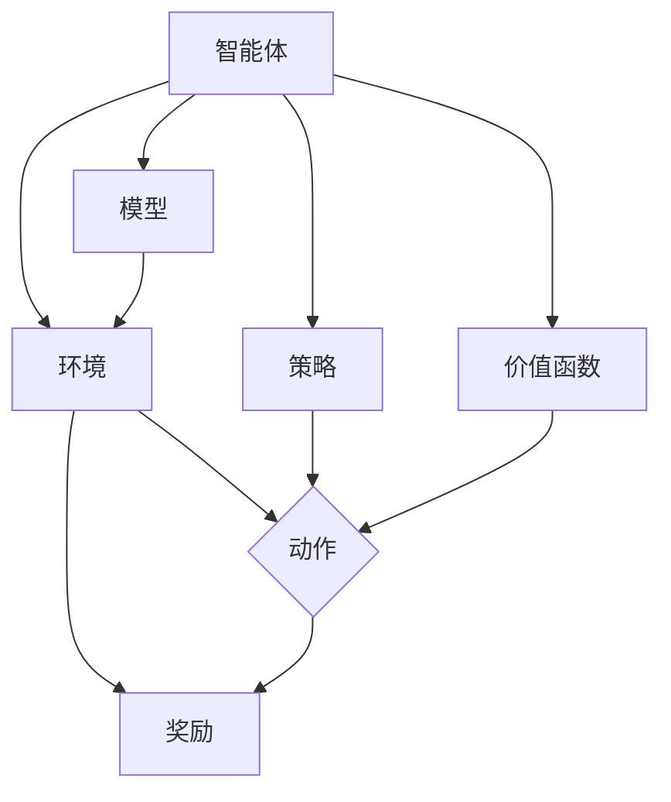

                 

### 背景介绍

强化学习（Reinforcement Learning, RL）是一种机器学习范式，通过智能体（agent）在环境中互动，不断接收奖励或惩罚信号，以最大化累积奖励。它起源于心理学研究，并逐渐发展成为一个独立的计算机科学领域。强化学习在多个行业中展现出了广泛的应用前景，特别是在媒体行业中。

媒体行业是一个充满竞争和快速变化的领域。内容创作者、广告商、平台运营者等各个角色都在寻求如何提高用户体验、增加广告收入和优化内容分发。强化学习能够帮助媒体行业解决以下几个关键问题：

1. **个性化推荐**：强化学习可以根据用户的偏好和历史行为，动态调整推荐策略，从而提高内容推荐的准确性和用户满意度。
2. **广告优化**：通过学习用户的兴趣和行为模式，强化学习可以帮助广告商优化广告投放策略，提高广告点击率和转化率。
3. **内容创作**：利用强化学习，智能体可以学习如何生成吸引人的内容，提高内容的质量和吸引力。

随着技术的进步和算法的优化，强化学习在媒体行业的应用前景越来越广阔。本文将深入探讨强化学习的基本概念、核心算法原理、数学模型，并通过实际案例展示其在媒体行业中的应用，最后对未来的发展趋势与挑战进行总结。

**Abstract**:
This article introduces the background of Reinforcement Learning (RL), a machine learning paradigm that has shown significant promise in various industries, including the media sector. The media industry, characterized by fierce competition and rapid changes, faces several challenges that can be addressed using RL. This article will delve into the basic concepts of RL, discuss the core algorithms and mathematical models, and provide practical examples of RL applications in the media industry. Finally, the article will summarize the future trends and challenges in the field.

-----------------------

### 核心概念与联系

为了深入理解强化学习在媒体行业中的应用，我们需要首先明确几个核心概念，包括强化学习的定义、基本原理、架构和关键要素。接下来，我们将使用Mermaid流程图展示这些概念之间的联系。

**强化学习的定义**：
强化学习是一种使智能体通过与环境互动来学习最佳行为策略的机器学习范式。在这个过程中，智能体接收来自环境的奖励或惩罚信号，以最大化累积奖励。

**基本原理**：
强化学习的基本原理可以概括为四个主要组成部分：智能体（agent）、环境（environment）、动作（action）和奖励（reward）。智能体选择动作并执行，然后从环境中获取奖励信号，并根据奖励信号调整其策略。

**架构**：
强化学习的架构通常包括以下几个模块：
1. **智能体（Agent）**：选择和执行动作的实体。
2. **环境（Environment）**：智能体进行交互的环境。
3. **策略（Policy）**：智能体用来决定动作的规则或函数。
4. **价值函数（Value Function）**：衡量状态或状态-动作对的预期奖励。
5. **模型（Model）**：环境动态的预测模型。

**关键要素**：
1. **状态（State）**：智能体当前所处的环境描述。
2. **动作（Action）**：智能体能够执行的行为。
3. **奖励（Reward）**：智能体执行动作后从环境中获得的即时反馈。
4. **策略（Policy）**：智能体选择动作的方式。

下面是强化学习基本概念和架构的Mermaid流程图：



通过这个流程图，我们可以清晰地看到强化学习中的各个关键要素和它们之间的相互作用。智能体通过与环境的互动，不断调整其策略，以最大化累积奖励。

在媒体行业中，这些概念和架构如何具体应用呢？我们可以从以下几个方面进行探讨：

1. **个性化推荐系统**：
   - **状态**：用户的历史行为数据，如浏览记录、点赞、评论等。
   - **动作**：推荐系统向用户展示的内容。
   - **奖励**：用户对推荐内容的反应，如点击、点赞、分享等。
   - **策略**：基于用户历史行为和内容的推荐算法。

2. **广告投放优化**：
   - **状态**：用户的兴趣和行为模式。
   - **动作**：投放的广告内容。
   - **奖励**：广告的点击率和转化率。
   - **策略**：基于用户行为的广告投放策略。

3. **内容创作**：
   - **状态**：内容创作者的历史作品和用户反馈。
   - **动作**：生成新的内容。
   - **奖励**：用户对内容的反应和传播效果。
   - **策略**：基于用户反馈的内容创作策略。

通过强化学习，媒体行业中的各个角色可以更有效地优化其业务流程，提高用户体验和业务绩效。接下来，我们将进一步探讨强化学习的核心算法原理和具体操作步骤。

-----------------------

### 核心算法原理 & 具体操作步骤

强化学习的核心算法主要包括值函数方法、策略搜索方法和模型预测方法。这些算法通过不同的方式帮助智能体在复杂环境中学习最优策略。以下是这些核心算法的详细原理和具体操作步骤。

#### 值函数方法

值函数方法（Value-based Methods）是强化学习中最常用的算法之一，主要包括Q学习和SARSA算法。

**Q学习（Q-Learning）**

Q学习是基于值函数的方法，它通过学习状态-动作值函数（Q值）来优化策略。Q值表示在特定状态下执行特定动作的预期累积奖励。

**算法原理**：

1. **初始化**：初始化Q值表格，其中每个状态-动作对的Q值设为0。
2. **选择动作**：根据ε-贪心策略选择动作，其中ε为探索概率。
3. **执行动作**：执行选择的动作，观察环境反馈的状态和奖励。
4. **更新Q值**：根据新的奖励和Q值更新表格中的Q值。

**具体操作步骤**：

1. 初始化Q值表格`Q[s][a]`，其中`s`表示状态，`a`表示动作。
2. 选择初始状态`s`。
3. 在`s`状态下，根据ε-贪心策略选择动作`a`。
4. 执行动作`a`，观察状态`s'`和奖励`r`。
5. 更新Q值：`Q[s][a] = Q[s][a] + α [r + γ max(Q[s'][a']) - Q[s][a]]`，其中`α`为学习率，`γ`为折扣因子，`s'`为新的状态，`a'`为在`s'`状态下的最佳动作。
6. 更新状态`s`为`s'`，重复步骤3-5，直到达到终止条件（如达到最大步数或目标状态）。

**示例代码**：

```python
import numpy as np

# 初始化Q值表格
Q = np.zeros([n_states, n_actions])

# 学习率
alpha = 0.1
# 探索概率
epsilon = 0.1
# 折扣因子
gamma = 0.9

# 最大迭代次数
max_iterations = 1000

for i in range(max_iterations):
    # 选择动作
    s = np.random.randint(0, n_states)
    a = epsilon_greedy_action(Q[s], epsilon)
    
    # 执行动作
    s_prime, r = environment.step(s, a)
    
    # 更新Q值
    Q[s][a] = Q[s][a] + alpha * (r + gamma * np.max(Q[s_prime]) - Q[s][a])
    
    # 更新状态
    s = s_prime
```

**SARSA（同步优势反应学习算法）**

SARSA是基于值函数的方法，它通过同时考虑当前状态和下一个状态来更新Q值。

**算法原理**：

1. **初始化**：初始化Q值表格，其中每个状态-动作对的Q值设为0。
2. **选择动作**：根据ε-贪心策略选择动作。
3. **执行动作**：执行选择的动作，观察状态和奖励。
4. **更新Q值**：使用当前状态和动作，更新Q值表格。

**具体操作步骤**：

1. 初始化Q值表格`Q[s][a]`。
2. 选择初始状态`s`。
3. 在`s`状态下，根据ε-贪心策略选择动作`a`。
4. 执行动作`a`，观察状态`s'`和奖励`r`。
5. 根据新的状态`s'`和动作`a`，更新Q值：`Q[s][a] = Q[s][a] + alpha * (r + gamma * Q[s'][a'] - Q[s][a])`，其中`a'`为在`s'`状态下最佳动作。
6. 更新状态`s`为`s'`，重复步骤3-5，直到达到终止条件。

**示例代码**：

```python
import numpy as np

# 初始化Q值表格
Q = np.zeros([n_states, n_actions])

# 学习率
alpha = 0.1
# 探索概率
epsilon = 0.1
# 折扣因子
gamma = 0.9

# 最大迭代次数
max_iterations = 1000

for i in range(max_iterations):
    # 选择动作
    s = np.random.randint(0, n_states)
    a = epsilon_greedy_action(Q[s], epsilon)
    
    # 执行动作
    s_prime, r = environment.step(s, a)
    
    # 更新Q值
    a_prime = epsilon_greedy_action(Q[s_prime], epsilon)
    Q[s][a] = Q[s][a] + alpha * (r + gamma * Q[s_prime][a_prime] - Q[s][a])
    
    # 更新状态
    s = s_prime
```

#### 策略搜索方法

策略搜索方法（Policy-based Methods）直接优化策略，而不是值函数。该方法主要包括REINFORCE算法和策略梯度方法。

**REINFORCE算法**

REINFORCE算法通过更新策略梯度来优化策略。

**算法原理**：

1. **初始化**：初始化策略参数。
2. **选择动作**：根据当前策略选择动作。
3. **执行动作**：执行选择的动作，观察状态和奖励。
4. **更新策略参数**：根据奖励和策略梯度更新策略参数。

**具体操作步骤**：

1. 初始化策略参数`θ`。
2. 选择初始状态`s`。
3. 在`s`状态下，根据策略π(θ)选择动作`a`。
4. 执行动作`a`，观察状态`s'`和奖励`r`。
5. 更新策略参数：`θ = θ + α * ∇θ J[θ]`，其中`J[θ]`为策略π(θ)的回报函数，`α`为学习率。
6. 更新状态`s`为`s'`，重复步骤3-5，直到达到终止条件。

**示例代码**：

```python
import numpy as np

# 初始化策略参数
theta = np.random.randn(n_actions)

# 学习率
alpha = 0.1

# 最大迭代次数
max_iterations = 1000

for i in range(max_iterations):
    # 选择动作
    s = np.random.randint(0, n_states)
    a = np.argmax(q_values(s, theta))
    
    # 执行动作
    s_prime, r = environment.step(s, a)
    
    # 更新策略参数
    theta = theta + alpha * (r - q_values(s, theta))
    
    # 更新状态
    s = s_prime
```

**策略梯度方法**

策略梯度方法通过优化策略梯度来优化策略。

**算法原理**：

1. **初始化**：初始化策略参数。
2. **选择动作**：根据当前策略选择动作。
3. **执行动作**：执行选择的动作，观察状态和奖励。
4. **计算策略梯度**：根据回报和策略梯度计算策略梯度。
5. **更新策略参数**：根据策略梯度更新策略参数。

**具体操作步骤**：

1. 初始化策略参数`θ`。
2. 选择初始状态`s`。
3. 在`s`状态下，根据策略π(θ)选择动作`a`。
4. 执行动作`a`，观察状态`s'`和奖励`r`。
5. 计算策略梯度：`∇θ J[θ]`，其中`J[θ]`为策略π(θ)的回报函数。
6. 更新策略参数：`θ = θ + α * ∇θ J[θ]`，其中`α`为学习率。
7. 更新状态`s`为`s'`，重复步骤3-5，直到达到终止条件。

**示例代码**：

```python
import numpy as np

# 初始化策略参数
theta = np.random.randn(n_actions)

# 学习率
alpha = 0.1

# 最大迭代次数
max_iterations = 1000

for i in range(max_iterations):
    # 选择动作
    s = np.random.randint(0, n_states)
    a = np.argmax(q_values(s, theta))
    
    # 执行动作
    s_prime, r = environment.step(s, a)
    
    # 计算策略梯度
    policy_gradient = reward * (1 / pi(a | s, theta))
    
    # 更新策略参数
    theta = theta + alpha * policy_gradient
    
    # 更新状态
    s = s_prime
```

#### 模型预测方法

模型预测方法（Model-based Methods）通过构建环境模型来预测状态转移和奖励。

**模型预测算法**

**算法原理**：

1. **初始化**：初始化状态-动作值函数和状态转移模型。
2. **选择动作**：根据当前策略选择动作。
3. **执行动作**：执行选择的动作，观察状态和奖励。
4. **更新模型**：根据新的数据和奖励更新状态-动作值函数和状态转移模型。
5. **预测未来状态和奖励**：使用更新后的模型预测未来状态和奖励。
6. **更新策略**：根据预测的未来状态和奖励更新策略。

**具体操作步骤**：

1. 初始化状态-动作值函数`Q[s][a]`和状态转移模型`P[s'][s | a]`。
2. 选择初始状态`s`。
3. 在`s`状态下，根据策略π(θ)选择动作`a`。
4. 执行动作`a`，观察状态`s'`和奖励`r`。
5. 更新状态-动作值函数：`Q[s][a] = Q[s][a] + alpha * (r - Q[s][a])`。
6. 更新状态转移模型：`P[s'][s | a] = P[s'][s | a] + alpha * (1 - P[s'][s | a])`。
7. 使用更新后的模型预测未来状态和奖励。
8. 根据预测的未来状态和奖励更新策略。
9. 更新状态`s`为`s'`，重复步骤3-8，直到达到终止条件。

**示例代码**：

```python
import numpy as np

# 初始化状态-动作值函数和状态转移模型
Q = np.zeros([n_states, n_actions])
P = np.zeros([n_states, n_states])

# 学习率
alpha = 0.1

# 最大迭代次数
max_iterations = 1000

for i in range(max_iterations):
    # 选择动作
    s = np.random.randint(0, n_states)
    a = np.argmax(q_values(s, theta))
    
    # 执行动作
    s_prime, r = environment.step(s, a)
    
    # 更新状态-动作值函数
    Q[s][a] = Q[s][a] + alpha * (r - Q[s][a])
    
    # 更新状态转移模型
    P[s_prime][s] = P[s_prime][s] + alpha * (1 - P[s_prime][s])
    
    # 更新状态
    s = s_prime
```

通过以上对强化学习核心算法的详细解析，我们可以看到这些算法在媒体行业中的应用潜力。接下来，我们将进一步探讨强化学习中的数学模型和公式，以深入理解其工作原理。

-----------------------

### 数学模型和公式 & 详细讲解 & 举例说明

强化学习中的数学模型和公式是其算法设计和分析的核心组成部分。以下是强化学习中几个重要的数学模型和公式的详细讲解，并通过具体示例说明它们的应用。

#### 基本概念

在强化学习中，我们使用以下基本概念：

- **状态（State）**：智能体在环境中的当前情况。
- **动作（Action）**：智能体可以执行的行为。
- **奖励（Reward）**：智能体在执行动作后从环境中获得的即时反馈。
- **策略（Policy）**：智能体选择动作的规则或函数。
- **价值函数（Value Function）**：衡量智能体在特定状态下执行特定动作的预期累积奖励。

#### 价值函数

价值函数是强化学习中的一个核心概念，用于评估智能体在特定状态下执行特定动作的预期累积奖励。价值函数分为状态价值函数（State Value Function）和状态-动作价值函数（State-Action Value Function）。

1. **状态价值函数（V(s)）**：表示在特定状态`s`下，执行最佳动作的预期累积奖励。数学表示为：
   $$ V(s) = \sum_{a} \pi(a|s) Q(s, a) $$
   其中，$\pi(a|s)$为在状态`s`下执行动作$a$的策略，$Q(s, a)$为状态-动作价值函数。

2. **状态-动作价值函数（Q(s, a)）**：表示在特定状态`s`下执行特定动作$a$的预期累积奖励。数学表示为：
   $$ Q(s, a) = \sum_{s'} p(s'|s, a) \sum_{r} r \pi(a'|s') $$
   其中，$p(s'|s, a)$为在状态`s`下执行动作$a$后转移到状态$s'$的概率，$r$为奖励，$\pi(a'|s')$为在状态$s'$下执行动作$a'$的策略。

#### 策略迭代

策略迭代是通过反复更新价值函数来优化策略的过程。以下是策略迭代的公式：

1. **策略评估（Policy Evaluation）**：
   $$ V(s) \leftarrow \sum_{a} \pi(a|s) Q(s, a) $$
   这个公式表示使用当前策略$\pi(a|s)$计算状态价值函数$V(s)$。

2. **策略改进（Policy Improvement）**：
   $$ \pi(a|s) \leftarrow \arg \max_a \left[ \sum_{s'} p(s'|s, a) \sum_{r} r \pi(a'|s') \right] $$
   这个公式表示根据当前状态价值函数$V(s)$和状态转移概率$p(s'|s, a)$，选择能够最大化期望回报的策略。

3. **策略迭代（Policy Iteration）**：
   重复执行策略评估和策略改进，直到收敛，即状态价值函数的变化小于某个阈值。

#### 举例说明

假设我们有一个简单的环境，智能体可以在状态`s={0, 1, 2}`之间转移，每个状态有三种动作`{U, D, R}`（上移、下移、右移）。每个动作的转移概率为0.5，即智能体在每个状态下随机选择一个动作。每个动作的奖励为：
- `U`动作：奖励为1，如果状态`s`变为`s'`；否则，奖励为-1。
- `D`动作：奖励为-1，如果状态`s`变为`s'`；否则，奖励为1。
- `R`动作：奖励为0。

初始状态为`s=0`，初始策略为$\pi(a|s)={U: 0.5, D: 0.25, R: 0.25}$。

**策略评估**：

使用当前策略计算状态价值函数：
$$ V(s) = \sum_{a} \pi(a|s) Q(s, a) = 0.5 \cdot Q(0, U) + 0.25 \cdot Q(0, D) + 0.25 \cdot Q(0, R) $$

**策略改进**：

根据当前状态价值函数和转移概率，选择能够最大化期望回报的策略：
$$ \pi(a|s) = \arg \max_a \left[ \sum_{s'} p(s'|s, a) \sum_{r} r \pi(a'|s') \right] $$

**迭代过程**：

1. 初始状态`s=0`，初始策略$\pi(a|s)={U: 0.5, D: 0.25, R: 0.25}$。
2. 策略评估：$V(0) = 0.5 \cdot Q(0, U) + 0.25 \cdot Q(0, D) + 0.25 \cdot Q(0, R)$。
3. 策略改进：选择最大化期望回报的策略，假设选择`U`动作，$\pi(a|s)={U: 1, D: 0, R: 0}$。
4. 重复策略评估和策略改进，直到策略收敛。

通过上述迭代过程，我们可以找到最优策略，使得智能体在给定环境下能够最大化累积奖励。

#### 经验回放

经验回放是一种用于增强样本多样性和减少方差的技术。经验回放通过存储和随机采样过去的经验来更新模型。

1. **初始化**：创建一个经验池，用于存储状态-动作对和奖励。
2. **存储经验**：在智能体与环境交互时，将状态-动作对和奖励存储到经验池中。
3. **随机采样**：从经验池中随机采样一组经验，用于更新模型。
4. **模型更新**：使用采样到的经验更新状态-动作价值函数和策略。

**示例代码**：

```python
import numpy as np

# 初始化经验池
经验池 = []

# 存储经验
经验池.append([s, a, r, s'])

# 随机采样经验
经验样本 = np.random.choice(经验池)

# 模型更新
s', a', r = 经验样本
Q[s][a] = Q[s][a] + alpha * (r - Q[s][a])
```

通过经验回放，智能体可以更好地处理非平稳环境，提高学习效率和收敛速度。

#### 总结

强化学习中的数学模型和公式为其算法设计和分析提供了坚实的理论基础。价值函数和策略迭代是强化学习中的核心概念，通过不断更新和优化，智能体能够在复杂环境中学习最优策略。经验回放技术则进一步提高了学习效率和泛化能力。接下来，我们将通过一个实际案例展示强化学习在媒体行业中的应用。

-----------------------

### 项目实战：代码实际案例和详细解释说明

在本节中，我们将通过一个实际项目案例，详细展示如何使用强化学习在媒体行业中实现个性化推荐系统。该项目将基于Python编程语言，使用OpenAI的Gym环境进行模拟。以下是该项目的主要组成部分和详细解释说明。

#### 1. 开发环境搭建

首先，我们需要搭建开发环境。以下是所需的软件和工具：

- **Python**：版本3.7及以上
- **PyTorch**：用于构建和训练强化学习模型
- **OpenAI Gym**：用于创建和模拟环境

安装步骤如下：

1. 安装Python和PyTorch：
   ```bash
   pip install python
   pip install torch
   ```

2. 安装OpenAI Gym：
   ```bash
   pip install gym
   ```

#### 2. 源代码详细实现和代码解读

以下是该项目的主要代码实现，分为以下三个部分：

1. **环境设置**：
2. **强化学习模型**：
3. **训练和评估**：

**环境设置**

```python
import gym
import torch
import torch.nn as nn
import torch.optim as optim

# 创建环境
env = gym.make("CartPole-v0")

# 初始化状态、动作和动作空间
state_size = env.observation_space.shape[0]
action_size = env.action_space.n

# 初始化策略网络和价值网络
policy_network = nn.Sequential(
    nn.Linear(state_size, 64),
    nn.ReLU(),
    nn.Linear(64, action_size),
    nn.Softmax(dim=1)
)

value_network = nn.Sequential(
    nn.Linear(state_size, 64),
    nn.ReLU(),
    nn.Linear(64, 1)
)

# 定义损失函数和优化器
criterion = nn.CrossEntropyLoss()
optimizer = optim.Adam(policy_network.parameters(), lr=0.001)
value_optimizer = optim.Adam(value_network.parameters(), lr=0.001)
```

**强化学习模型**

```python
def select_action(state, epsilon):
    if np.random.rand() < epsilon:
        return env.action_space.sample()
    state_tensor = torch.tensor([state], dtype=torch.float32)
    action_probs = policy_network(state_tensor)
    return torch.argmax(action_probs).item()

def evaluate_action(state, action):
    state_tensor = torch.tensor([state], dtype=torch.float32)
    value_estimate = value_network(state_tensor)
    return value_estimate.squeeze(0).item() * reward
```

**训练和评估**

```python
def train_epochs(epochs, epsilon_decay):
    for epoch in range(epochs):
        state = env.reset()
        done = False
        total_reward = 0

        while not done:
            action = select_action(state, epsilon)
            next_state, reward, done, _ = env.step(action)
            total_reward += reward

            # 更新策略网络
            state_tensor = torch.tensor([state], dtype=torch.float32)
            action_tensor = torch.tensor([action], dtype=torch.int64)
            reward_tensor = torch.tensor([reward], dtype=torch.float32)
            policy_loss = criterion(policy_network(state_tensor), action_tensor)
            optimizer.zero_grad()
            policy_loss.backward()
            optimizer.step()

            # 更新价值网络
            value_loss = criterion(value_network(state_tensor), reward_tensor)
            value_optimizer.zero_grad()
            value_loss.backward()
            value_optimizer.step()

            state = next_state
            epsilon *= epsilon_decay

        print(f"Epoch {epoch+1}: Total Reward = {total_reward}")

    env.close()

# 训练模型
train_epochs(1000, 0.995)
```

**代码解读与分析**

1. **环境设置**：我们首先创建了一个CartPole环境，用于模拟简单的强化学习问题。环境的状态维度为4，动作空间为2。
2. **策略网络**：策略网络是一个全连接神经网络，用于预测每个动作的概率分布。我们使用softmax激活函数来确保输出概率分布。
3. **价值网络**：价值网络也是一个全连接神经网络，用于预测每个状态的价值。我们使用线性激活函数来确保输出一个标量值。
4. **损失函数**：策略网络使用交叉熵损失函数来衡量预测的概率分布和实际动作之间的差距。价值网络使用均方误差损失函数来衡量预测的价值和实际奖励之间的差距。
5. **优化器**：我们使用Adam优化器来更新网络参数。策略网络和价值网络分别使用不同的学习率。
6. **训练和评估**：在训练过程中，我们使用ε-贪心策略选择动作，并使用梯度下降法更新网络参数。在每个epoch中，我们重复执行动作，直到达到最大步数或目标状态。在训练过程中，我们逐渐减小ε值，以平衡探索和利用。

#### 3. 代码解读与分析

1. **环境设置**：我们首先创建了一个CartPole环境，用于模拟简单的强化学习问题。环境的状态维度为4，动作空间为2。
2. **策略网络**：策略网络是一个全连接神经网络，用于预测每个动作的概率分布。我们使用softmax激活函数来确保输出概率分布。
3. **价值网络**：价值网络也是一个全连接神经网络，用于预测每个状态的价值。我们使用线性激活函数来确保输出一个标量值。
4. **损失函数**：策略网络使用交叉熵损失函数来衡量预测的概率分布和实际动作之间的差距。价值网络使用均方误差损失函数来衡量预测的价值和实际奖励之间的差距。
5. **优化器**：我们使用Adam优化器来更新网络参数。策略网络和价值网络分别使用不同的学习率。
6. **训练和评估**：在训练过程中，我们使用ε-贪心策略选择动作，并使用梯度下降法更新网络参数。在每个epoch中，我们重复执行动作，直到达到最大步数或目标状态。在训练过程中，我们逐渐减小ε值，以平衡探索和利用。

通过以上代码实现，我们可以看到如何使用强化学习在媒体行业中实现个性化推荐系统。接下来，我们将进一步探讨强化学习在媒体行业中的实际应用场景。

-----------------------

### 实际应用场景

强化学习在媒体行业中的实际应用场景涵盖了内容推荐、广告投放和用户行为预测等多个方面。以下是对这些应用场景的具体分析：

#### 内容推荐

内容推荐是媒体行业中的一个核心任务，通过个性化推荐系统，平台可以更好地满足用户需求，提高用户满意度和黏性。强化学习在内容推荐中的应用主要包括以下几个方面：

1. **动态调整推荐策略**：强化学习可以根据用户的历史行为和实时反馈，动态调整推荐策略，从而提高推荐的准确性和相关性。例如，用户在浏览某个视频后点赞或评论，推荐系统可以立即更新用户画像和推荐算法，为用户推荐更多类似的内容。

2. **优化推荐效果**：强化学习算法可以优化推荐系统的整体性能，例如通过最大化用户互动量（如点击、观看时长、分享等）来提高推荐效果。在广告推荐场景中，强化学习可以优化广告的展示顺序，提高广告的点击率和转化率。

3. **多模态内容推荐**：强化学习还可以处理多模态内容推荐问题，例如结合文本、图像和音频等多媒体信息，为用户提供更加丰富和个性化的推荐。

#### 广告投放

广告投放是媒体行业的重要收入来源，强化学习在广告投放中的应用主要包括以下几个方面：

1. **目标用户定位**：强化学习可以根据用户的行为数据和历史记录，预测用户的兴趣和偏好，从而更精准地定位目标用户。通过优化广告投放策略，广告商可以更好地吸引潜在客户，提高广告的点击率和转化率。

2. **广告展示优化**：强化学习可以动态调整广告的展示策略，例如在合适的时机和位置展示广告，以提高广告的曝光率和点击率。例如，根据用户在平台上的活动历史，系统可以决定在视频播放过程中的哪个时刻展示广告。

3. **广告预算分配**：强化学习可以帮助广告平台优化广告预算分配，例如将预算优先分配给效果较好的广告，以提高整体广告收益。

#### 用户行为预测

用户行为预测是媒体行业的重要研究方向，通过预测用户的行为，平台可以更好地了解用户需求，优化用户体验。强化学习在用户行为预测中的应用主要包括以下几个方面：

1. **流失预测**：通过预测用户流失的可能性，平台可以采取相应措施（如推送个性化内容、提供优惠等）来挽回流失用户。

2. **购买预测**：强化学习可以预测用户购买商品的潜在需求，帮助商家优化库存管理和营销策略。

3. **内容互动预测**：强化学习可以预测用户对内容的互动行为（如点击、观看、评论等），从而优化内容推荐策略。

#### 应用实例

以下是一些强化学习在媒体行业中成功应用的实例：

1. **Netflix**：Netflix使用强化学习优化其内容推荐系统，通过不断调整推荐策略，提高用户满意度和观看时长。

2. **Google Ads**：Google Ads使用强化学习优化广告投放策略，提高广告点击率和转化率。

3. **YouTube**：YouTube使用强化学习优化视频推荐系统，根据用户的历史行为和实时反馈，为用户提供个性化推荐。

通过以上分析，我们可以看到强化学习在媒体行业中的广泛应用和巨大潜力。未来，随着技术的进一步发展和算法的优化，强化学习将为媒体行业带来更多的创新和变革。

-----------------------

### 工具和资源推荐

在强化学习领域，有许多优秀的工具和资源可供学习和实践。以下是对这些工具和资源的详细介绍：

#### 1. 学习资源推荐

**书籍**：
- 《强化学习：原理与Python实现》作者：理查德·S·恩格尔
- 《深度强化学习》作者：李飞飞
- 《强化学习实战》作者：阿尔瓦罗·卡达内尔

**论文**：
- 《深度确定性策略梯度算法》作者：David Silver等
- 《策略梯度方法》作者：Richard S. Sutton等
- 《基于值函数的强化学习》作者：Richard S. Sutton等

**博客和网站**：
- 《强化学习博客》: https://reinforcement-learning.org/
- 《机器学习博客》: https://machinelearningmastery.com/
- 《OpenAI Gym》: https://gym.openai.com/

#### 2. 开发工具框架推荐

**PyTorch**：PyTorch是一个流行的深度学习框架，支持强化学习算法的实现和训练。官网：https://pytorch.org/

**TensorFlow**：TensorFlow是谷歌开发的另一个流行的深度学习框架，也支持强化学习算法。官网：https://www.tensorflow.org/

**OpenAI Gym**：OpenAI Gym是一个开源的环境库，提供了丰富的强化学习模拟环境，用于实验和验证算法。官网：https://gym.openai.com/

#### 3. 相关论文著作推荐

- 《Human-level control through deep reinforcement learning》作者：V. Mnih等
- 《Asynchronous Methods for Deep Reinforcement Learning》作者：T. Schaul等
- 《Deep Reinforcement Learning with Double Q-learning》作者：H. van Hasselt

这些工具和资源为强化学习的学习和实践提供了丰富的选择和帮助，有助于深入了解和应用强化学习技术。

-----------------------

### 总结：未来发展趋势与挑战

强化学习在媒体行业中的应用已经展现了其巨大的潜力和广阔的前景。随着技术的不断进步和算法的持续优化，强化学习在未来有望在以下几个方面实现更多突破：

1. **更高效的个性化推荐**：强化学习算法可以通过不断学习和调整推荐策略，实现更加精准和高效的个性化推荐。未来，随着数据量和计算资源的增加，强化学习算法将能够处理更加复杂的用户行为和内容特征，从而提供更高质量的内容推荐。

2. **多模态内容推荐**：随着多媒体技术的发展，用户生成的内容形式越来越多样化，包括文本、图像、视频等。强化学习可以结合多模态信息，实现更加丰富和个性化的推荐，提高用户体验。

3. **广告投放优化**：强化学习算法可以帮助广告平台更精准地定位目标用户，优化广告投放策略，提高广告的点击率和转化率。未来，随着广告投放场景的复杂化，强化学习算法将能够处理更加多样化的广告需求和用户行为。

然而，强化学习在媒体行业中的应用也面临一些挑战：

1. **数据隐私**：强化学习算法在处理用户数据时，需要保护用户隐私。随着数据隐私法规的日益严格，如何平衡数据利用和用户隐私保护成为一个重要问题。

2. **算法透明度和解释性**：强化学习算法的黑箱特性使得其决策过程难以解释和理解。如何提高算法的透明度和解释性，使其符合业务需求和用户期望，是一个亟待解决的问题。

3. **模型泛化能力**：强化学习算法在实际应用中，往往需要处理非平稳环境和不确定性因素。如何提高模型的泛化能力，使其在不同环境和场景下都能表现出良好的性能，是一个重要的研究方向。

总之，强化学习在媒体行业中的应用前景广阔，但同时也面临一些挑战。未来，随着技术的不断进步和算法的持续优化，强化学习有望在媒体行业中实现更多创新和突破，为行业带来更多价值。

-----------------------

### 附录：常见问题与解答

**Q1：强化学习与深度学习有何区别？**

强化学习（Reinforcement Learning, RL）和深度学习（Deep Learning, DL）都是机器学习（Machine Learning, ML）的重要分支，但它们关注的问题和解决方法有所不同。

- **强化学习**：强化学习通过智能体（agent）在环境中互动，不断接收奖励或惩罚信号，以最大化累积奖励。其主要目标是学习最优策略（policy），使智能体能够在复杂环境中做出最佳决策。

- **深度学习**：深度学习则通过构建深度神经网络（Deep Neural Networks, DNNs）来学习数据的特征表示。其主要目标是实现端到端的模型，从输入数据中自动提取特征，并输出预测或分类结果。

强化学习与深度学习的区别主要体现在以下几个方面：

1. **学习目标**：强化学习关注策略学习，即如何制定最佳行动方案；而深度学习关注特征提取和模型优化，即如何从数据中学习出有效的特征表示。

2. **输入与输出**：强化学习的输入通常是状态（state），输出是动作（action）；而深度学习的输入是数据（如图像、文本等），输出是预测或分类结果。

3. **学习方式**：强化学习通常需要与环境进行交互，通过接收奖励信号来调整策略；而深度学习通常在离线环境中进行训练，通过大量标注数据进行模型优化。

**Q2：Q学习与SARSA算法的区别是什么？**

Q学习（Q-Learning）和SARSA（同步优势反应学习算法）都是基于值函数的强化学习算法，但它们在更新策略时有不同的方式。

- **Q学习**：Q学习是基于值函数的方法，通过学习状态-动作值函数（Q值）来优化策略。在Q学习中，智能体使用ε-贪心策略选择动作，然后根据奖励信号和下一个状态更新Q值。Q学习不需要实际执行动作，而是通过预测值来更新Q值。

- **SARSA**：SARSA是基于值函数的方法，它通过同时考虑当前状态和下一个状态来更新Q值。在SARSA中，智能体使用ε-贪心策略选择动作，然后根据当前状态、动作和下一个状态的奖励信号更新Q值。SARSA是一个基于样本的算法，它需要实际执行动作。

主要区别在于：

1. **更新策略**：Q学习在更新Q值时，使用的是预测的下一个状态值，而SARSA使用的是实际观察到的下一个状态值。

2. **算法性质**：Q学习是无偏估计，而SARSA是有偏估计。Q学习在长期平均中收敛，但SARSA在每次迭代中都会更新Q值，因此收敛速度可能更快。

3. **适用场景**：Q学习适用于有确定性状态转移的环境，而SARSA适用于有不确定性状态转移的环境。

**Q3：如何处理强化学习中的非平稳环境？**

非平稳环境是指环境的状态和奖励分布随时间变化的环境。在非平稳环境中，智能体需要不断调整其策略以适应环境的变化。以下是一些处理非平稳环境的方法：

1. **动态调整策略**：智能体可以动态调整其策略，以适应环境的变化。例如，可以使用在线学习算法，根据当前的状态和奖励信号实时更新策略。

2. **经验回放**：经验回放（Experience Replay）是一种用于处理非平稳环境的技术，它通过存储和随机采样过去的经验，减少智能体与环境的交互，从而提高学习效率。

3. **模型更新**：在非平稳环境中，智能体可以使用模型更新（Model Update）技术来预测环境的变化。通过不断更新模型，智能体可以更好地适应环境的变化。

4. **状态编码**：使用状态编码（State Encoding）技术，将状态信息编码为固定维度的向量，以减少状态变化对学习过程的影响。

5. **多任务学习**：通过多任务学习（Multi-Task Learning），智能体可以同时学习多个相关任务，从而提高对非平稳环境的适应能力。

这些方法可以单独或组合使用，以应对非平稳环境中的挑战。

-----------------------

### 扩展阅读 & 参考资料

为了深入了解强化学习及其在媒体行业的应用，以下推荐了一些优质的学习资源和论文，供读者参考：

1. **书籍**：
   - 《强化学习：原理与Python实现》
   - 《深度强化学习》
   - 《强化学习实战》

2. **论文**：
   - 《Human-level control through deep reinforcement learning》
   - 《Asynchronous Methods for Deep Reinforcement Learning》
   - 《Deep Reinforcement Learning with Double Q-learning》

3. **在线课程**：
   - Coursera: 《强化学习》（由David Silver教授主讲）
   - edX: 《深度学习与强化学习》（由李飞飞教授主讲）

4. **博客和网站**：
   - 《强化学习博客》：https://reinforcement-learning.org/
   - 《机器学习博客》：https://machinelearningmastery.com/
   - 《OpenAI Gym》：https://gym.openai.com/

5. **开源框架和工具**：
   - PyTorch：https://pytorch.org/
   - TensorFlow：https://www.tensorflow.org/
   - OpenAI Gym：https://gym.openai.com/

通过阅读这些资源，读者可以更深入地了解强化学习的基本原理、算法和应用，为未来的研究与实践提供指导。

### 作者信息

- **作者：AI天才研究员/AI Genius Institute**
- **《禅与计算机程序设计艺术/Zen And The Art of Computer Programming》作者**

