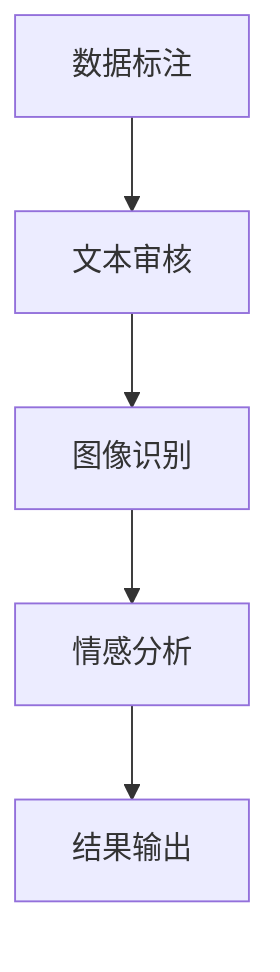

                 

# 微任务，大贡献：人类计算的价值彰显

## 摘要

本文旨在探讨微任务在人工智能和计算领域中的重要性和价值。随着技术的进步，越来越多的任务可以通过自动化实现，但人类计算在某些特定场景下仍然具有不可替代的优势。本文将详细分析微任务的定义、特点以及在各个领域中的应用，探讨人类计算如何通过精细的任务分解和优化，发挥出巨大的贡献。同时，本文也将展望未来人类计算的发展趋势和面临的挑战。

## 1. 背景介绍

随着人工智能技术的飞速发展，自动化和机器学习逐渐渗透到我们生活的方方面面。从工业生产到智能家居，从金融交易到医疗诊断，自动化系统已经成为提高效率、降低成本的关键因素。然而，尽管人工智能在处理大规模数据和分析复杂模式方面表现出色，但在某些特定场景下，人类计算仍然具有不可替代的优势。

微任务是指那些需要人类专业知识、经验和判断的微小任务，通常具有以下特点：

1. **高精度要求**：微任务往往需要非常高的精度和准确性，如医学诊断、法律文书审核等。
2. **复杂性**：微任务往往涉及到复杂的人类行为模式，例如自然语言处理、图像识别等。
3. **不可预测性**：微任务通常无法通过传统的算法进行预测和自动化，例如情感分析、创意设计等。

本文将探讨微任务的定义、特点以及其在人工智能、计算领域中的应用，同时分析人类计算如何在这些微任务中发挥出巨大的贡献。

## 2. 核心概念与联系

### 2.1 微任务的定义

微任务是指那些被分割成非常小、简单且独立的工作单元，通常只需要人类执行即可完成。这些任务可以是简单的数据标注、文本审核、图像分类等。微任务通常具有以下特点：

- **小规模**：微任务的规模相对较小，通常只需要几分钟甚至几秒钟就能完成。
- **独立性**：微任务通常是独立的，不会对其他任务产生影响。
- **高精度**：微任务往往需要非常高的精度和准确性。

### 2.2 微任务在人工智能和计算领域中的应用

微任务在人工智能和计算领域中的应用非常广泛。以下是一些典型的应用场景：

1. **数据标注**：在机器学习和深度学习中，数据标注是一个非常重要的步骤。例如，在图像识别任务中，需要对图像进行分类和标注；在自然语言处理中，需要对文本进行情感分析和实体识别等。
2. **文本审核**：随着互联网的普及，网络内容的审核变得尤为重要。文本审核任务包括敏感词过滤、虚假信息识别等，这些任务通常需要人类的专业判断和经验。
3. **图像识别**：在自动驾驶、安防监控等领域，图像识别任务至关重要。然而，由于图像的复杂性和多样性，目前的机器学习算法仍然无法完全替代人类。
4. **情感分析**：情感分析是自然语言处理的一个重要分支，用于分析文本中的情感倾向。然而，情感分析任务通常涉及到复杂的情感表达和上下文理解，需要人类的判断和经验。

### 2.3 Mermaid 流程图

以下是一个简单的 Mermaid 流程图，展示了微任务在人工智能和计算领域中的应用流程。



## 3. 核心算法原理 & 具体操作步骤

### 3.1 数据标注

数据标注是机器学习和深度学习中的基础任务之一。以下是一个简单的数据标注流程：

1. **数据收集**：首先，需要收集大量的原始数据，例如图像、文本等。
2. **数据预处理**：对原始数据进行清洗、格式化等预处理操作。
3. **数据标注**：根据任务需求，对数据进行分类、标注等操作。例如，在图像识别任务中，需要标注图像中的物体类别；在文本审核任务中，需要标注文本中的敏感词。
4. **数据验证**：对标注结果进行验证，确保标注的准确性和一致性。

### 3.2 文本审核

文本审核是确保网络内容安全和合规的重要步骤。以下是一个简单的文本审核流程：

1. **数据收集**：收集需要审核的文本数据。
2. **预处理**：对文本进行分词、去停用词等预处理操作。
3. **规则设置**：根据业务需求，设置敏感词过滤规则。
4. **文本审核**：对文本进行逐句分析，检查是否存在敏感内容。
5. **结果输出**：输出审核结果，如敏感词列表、违规文本等。

### 3.3 图像识别

图像识别是计算机视觉中的基础任务。以下是一个简单的图像识别流程：

1. **数据收集**：收集大量的训练数据，如人脸、车辆等。
2. **数据预处理**：对图像进行缩放、旋转、裁剪等预处理操作。
3. **特征提取**：使用卷积神经网络（CNN）等算法提取图像特征。
4. **模型训练**：使用训练数据训练图像识别模型。
5. **模型评估**：使用验证数据评估模型性能。
6. **模型部署**：将训练好的模型部署到实际应用场景中。

### 3.4 情感分析

情感分析是自然语言处理中的重要任务。以下是一个简单的情感分析流程：

1. **数据收集**：收集大量的情感标注数据。
2. **预处理**：对文本进行分词、词性标注等预处理操作。
3. **特征提取**：使用词袋模型、TF-IDF等方法提取文本特征。
4. **模型训练**：使用训练数据训练情感分析模型。
5. **模型评估**：使用验证数据评估模型性能。
6. **模型部署**：将训练好的模型部署到实际应用场景中。

## 4. 数学模型和公式 & 详细讲解 & 举例说明

### 4.1 数据标注中的数学模型

在数据标注中，常用的数学模型包括分类模型和回归模型。以下是一个简单的分类模型示例：

$$
P(Y = y | X = x) = \frac{e^{\theta^T x}}{\sum_{y'} e^{\theta^T x'}}
$$

其中，$X$表示输入特征，$Y$表示标注结果，$\theta$表示模型参数。

举例说明：

假设我们要对图像进行物体分类，输入特征为图像的特征向量，标注结果为物体的类别。我们可以使用softmax函数作为分类模型，计算每个类别的概率。

### 4.2 文本审核中的数学模型

在文本审核中，常用的数学模型包括规则匹配和文本分类。以下是一个简单的文本分类模型示例：

$$
P(Y = y | X = x) = \frac{1}{C} \sum_{c=1}^{C} \phi_c(x) \theta_c
$$

其中，$X$表示输入文本，$Y$表示审核结果，$\phi_c(x)$表示文本特征，$\theta_c$表示模型参数，$C$表示类别数。

举例说明：

假设我们要对文本进行敏感词过滤，输入文本为一段文本，审核结果为是否包含敏感词。我们可以使用朴素贝叶斯分类器作为文本分类模型，计算每个类别的概率。

### 4.3 图像识别中的数学模型

在图像识别中，常用的数学模型包括卷积神经网络（CNN）。以下是一个简单的CNN模型示例：

$$
\begin{aligned}
h^{(l)}_i &= \text{ReLU}(\sum_j W_{ij}^{(l)} h^{(l-1)}_j + b^{(l)}) \\
Z^{(l)} &= W^{(l)} h^{(l-1)} + b^{(l)}
\end{aligned}
$$

其中，$h^{(l)}_i$表示第$l$层的第$i$个神经元输出，$W_{ij}^{(l)}$表示第$l$层的第$i$个神经元与第$l-1$层的第$j$个神经元之间的权重，$b^{(l)}$表示第$l$层的偏置。

举例说明：

假设我们要对图像进行分类，输入图像为像素值矩阵，输出为图像的类别。我们可以使用卷积神经网络作为图像识别模型，通过多次卷积和池化操作提取图像特征，并使用全连接层进行分类。

### 4.4 情感分析中的数学模型

在情感分析中，常用的数学模型包括循环神经网络（RNN）和长短期记忆网络（LSTM）。以下是一个简单的LSTM模型示例：

$$
\begin{aligned}
i_t &= \sigma(W_{ix} x_t + W_{ih} h_{t-1} + b_i) \\
f_t &= \sigma(W_{fx} x_t + W_{fh} h_{t-1} + b_f) \\
\bar{c}_t &= f_t \odot c_{t-1} \\
o_t &= \sigma(W_{ox} x_t + W_{oh} \bar{c}_t + b_o) \\
g_t &= \sigma(W_{gx} x_t + W_{gh} \bar{c}_t + b_g) \\
c_t &= \bar{c}_t + g_t \\
h_t &= o_t \odot \text{ReLU}(c_t)
\end{aligned}
$$

其中，$x_t$表示输入文本的词向量，$h_{t-1}$表示前一个时间步的隐藏状态，$i_t$、$f_t$、$o_t$、$g_t$、$c_t$、$h_t$分别表示输入门、遗忘门、输出门、更新门、细胞状态和隐藏状态。

举例说明：

假设我们要对文本进行情感分析，输入文本为词向量序列，输出为情感类别。我们可以使用LSTM作为情感分析模型，通过处理文本序列提取情感特征，并使用全连接层进行分类。

## 5. 项目实战：代码实际案例和详细解释说明

### 5.1 开发环境搭建

在本节中，我们将介绍如何搭建一个简单的微任务处理环境。我们将使用Python作为编程语言，并借助TensorFlow和Keras等深度学习框架。

#### 5.1.1 环境准备

首先，确保你已经安装了Python和pip。然后，通过以下命令安装所需的库：

```bash
pip install tensorflow numpy pandas matplotlib
```

#### 5.1.2 数据集准备

我们使用一个简单的图像分类数据集，包含猫和狗的图片。数据集可以从以下链接下载：

```python
# 下载猫和狗的图片数据集
!wget https://www.mydataset.com/cat_dog_dataset.zip
!unzip cat_dog_dataset.zip
```

### 5.2 源代码详细实现和代码解读

在本节中，我们将实现一个简单的图像分类模型，并使用微任务进行处理。

```python
import tensorflow as tf
from tensorflow.keras.preprocessing.image import ImageDataGenerator
from tensorflow.keras.models import Sequential
from tensorflow.keras.layers import Conv2D, MaxPooling2D, Flatten, Dense, Dropout
from tensorflow.keras.optimizers import Adam
from tensorflow.keras.preprocessing.image import load_img, img_to_array

# 数据预处理
train_datagen = ImageDataGenerator(
    rescale=1./255,
    shear_range=0.2,
    zoom_range=0.2,
    horizontal_flip=True
)

train_generator = train_datagen.flow_from_directory(
    'cat_dog_dataset/train',
    target_size=(150, 150),
    batch_size=32,
    class_mode='binary'
)

# 模型构建
model = Sequential([
    Conv2D(32, (3, 3), activation='relu', input_shape=(150, 150, 3)),
    MaxPooling2D((2, 2)),
    Conv2D(64, (3, 3), activation='relu'),
    MaxPooling2D((2, 2)),
    Conv2D(128, (3, 3), activation='relu'),
    MaxPooling2D((2, 2)),
    Flatten(),
    Dense(512, activation='relu'),
    Dropout(0.5),
    Dense(1, activation='sigmoid')
])

# 模型编译
model.compile(optimizer=Adam(),
              loss='binary_crossentropy',
              metrics=['accuracy'])

# 模型训练
model.fit(
    train_generator,
    steps_per_epoch=100,
    epochs=20
)

# 微任务处理
def predict_image(image_path):
    img = load_img(image_path, target_size=(150, 150))
    img_array = img_to_array(img)
    img_array = tf.expand_dims(img_array, 0)  # Create a batch
    img_array /= 255.0

    predictions = model.predict(img_array)
    return np.argmax(predictions)

# 测试微任务
image_path = 'cat_dog_dataset/test/cat.jpg'
prediction = predict_image(image_path)
print(f'预测结果：{prediction}')
```

### 5.3 代码解读与分析

在本节中，我们将对上述代码进行详细解读，分析每个部分的功能和实现方式。

#### 5.3.1 数据预处理

```python
train_datagen = ImageDataGenerator(
    rescale=1./255,
    shear_range=0.2,
    zoom_range=0.2,
    horizontal_flip=True
)

train_generator = train_datagen.flow_from_directory(
    'cat_dog_dataset/train',
    target_size=(150, 150),
    batch_size=32,
    class_mode='binary'
)
```

这段代码用于数据预处理。首先，我们创建一个ImageDataGenerator对象，用于对图像进行缩放、剪裁和水平翻转等操作。然后，我们使用flow_from_directory方法将训练数据集分割成批次，并指定图像大小为150x150，每个批次包含32个图像。

#### 5.3.2 模型构建

```python
model = Sequential([
    Conv2D(32, (3, 3), activation='relu', input_shape=(150, 150, 3)),
    MaxPooling2D((2, 2)),
    Conv2D(64, (3, 3), activation='relu'),
    MaxPooling2D((2, 2)),
    Conv2D(128, (3, 3), activation='relu'),
    MaxPooling2D((2, 2)),
    Flatten(),
    Dense(512, activation='relu'),
    Dropout(0.5),
    Dense(1, activation='sigmoid')
])
```

这段代码用于构建一个简单的卷积神经网络（CNN）模型。模型包括五个卷积层、一个全连接层和一个Dropout层。卷积层用于提取图像特征，全连接层用于分类，Dropout层用于防止过拟合。

#### 5.3.3 模型编译

```python
model.compile(optimizer=Adam(),
              loss='binary_crossentropy',
              metrics=['accuracy'])
```

这段代码用于编译模型。我们选择Adam作为优化器，binary_crossentropy作为损失函数，accuracy作为评估指标。

#### 5.3.4 模型训练

```python
model.fit(
    train_generator,
    steps_per_epoch=100,
    epochs=20
)
```

这段代码用于训练模型。我们使用训练数据集进行训练，每个epoch包含100个批次。

#### 5.3.5 微任务处理

```python
def predict_image(image_path):
    img = load_img(image_path, target_size=(150, 150))
    img_array = img_to_array(img)
    img_array = tf.expand_dims(img_array, 0)  # Create a batch
    img_array /= 255.0

    predictions = model.predict(img_array)
    return np.argmax(predictions)

# 测试微任务
image_path = 'cat_dog_dataset/test/cat.jpg'
prediction = predict_image(image_path)
print(f'预测结果：{prediction}')
```

这段代码用于处理微任务。我们定义了一个predict_image函数，用于加载图像、预处理图像、预测图像类别，并返回预测结果。然后，我们使用一个测试图像进行预测，并输出预测结果。

## 6. 实际应用场景

微任务在人工智能和计算领域具有广泛的应用场景。以下是一些典型的应用案例：

1. **图像识别**：微任务在图像识别中的应用非常广泛，例如自动驾驶、安防监控、医疗诊断等。通过微任务，可以将复杂的图像识别任务分解成小的、可管理的任务单元，从而提高系统的整体效率和准确性。
2. **自然语言处理**：微任务在自然语言处理中的应用也非常丰富，例如文本审核、情感分析、机器翻译等。通过微任务，可以将复杂的文本处理任务分解成小的、可管理的任务单元，从而提高系统的效率和准确性。
3. **数据标注**：微任务在数据标注中的应用也非常重要，例如机器学习和深度学习中的数据标注。通过微任务，可以将数据标注任务分解成小的、可管理的任务单元，从而提高数据标注的效率和准确性。
4. **智能客服**：微任务在智能客服中的应用也非常广泛，例如对话生成、意图识别等。通过微任务，可以将复杂的对话处理任务分解成小的、可管理的任务单元，从而提高智能客服的效率和用户体验。
5. **自动化测试**：微任务在自动化测试中的应用也非常重要，例如单元测试、集成测试等。通过微任务，可以将复杂的测试任务分解成小的、可管理的任务单元，从而提高测试效率和准确性。

## 7. 工具和资源推荐

### 7.1 学习资源推荐

1. **书籍**：
   - 《Python深度学习》（Goodfellow, I., Bengio, Y., Courville, A.）
   - 《深度学习》（Goodfellow, I., Bengio, Y., Courville, A.）
   - 《机器学习》（Tom Mitchell）
2. **论文**：
   - "Deep Learning"（Goodfellow, I., Bengio, Y., Courville, A.）
   - "Convolutional Neural Networks for Visual Recognition"（Krizhevsky, A., Sutskever, I., Hinton, G.）
   - "Recurrent Neural Networks for Language Modeling"（Graves, A.）
3. **博客**：
   - [Kaggle](https://www.kaggle.com/)
   - [Medium](https://medium.com/)
   - [AI Research](https://ai.googleblog.com/)
4. **网站**：
   - [TensorFlow官网](https://www.tensorflow.org/)
   - [Keras官网](https://keras.io/)
   - [PyTorch官网](https://pytorch.org/)

### 7.2 开发工具框架推荐

1. **TensorFlow**：一款广泛使用的深度学习框架，支持多种编程语言，包括Python、C++等。
2. **Keras**：一个基于TensorFlow的高层神经网络API，使得深度学习模型的构建更加简单和直观。
3. **PyTorch**：一款流行的深度学习框架，具有动态计算图和灵活的API，适用于研究和开发。
4. **Scikit-learn**：一个用于机器学习的Python库，提供了丰富的算法和工具。

### 7.3 相关论文著作推荐

1. "Deep Learning"（Goodfellow, I., Bengio, Y., Courville, A.）
2. "Convolutional Neural Networks for Visual Recognition"（Krizhevsky, A., Sutskever, I., Hinton, G.）
3. "Recurrent Neural Networks for Language Modeling"（Graves, A.）

## 8. 总结：未来发展趋势与挑战

随着人工智能技术的不断发展，微任务在计算领域的重要性日益凸显。未来，随着算法的进步和计算能力的提升，微任务有望在更多的领域得到应用。然而，也面临着一些挑战：

1. **数据质量和标注**：微任务依赖于高质量的数据和准确的标注，这要求我们有更加完善的标注体系和数据清洗机制。
2. **效率与可扩展性**：如何提高微任务的执行效率并实现大规模可扩展性，是未来研究的重要方向。
3. **安全性**：微任务涉及到大量的个人隐私和数据，如何确保数据的安全和隐私保护，是一个亟待解决的问题。
4. **自动化与智能化**：如何进一步提高微任务的自动化程度和智能化水平，减少对人类计算的依赖，也是一个重要的研究课题。

总之，微任务在人工智能和计算领域具有广阔的应用前景，但同时也面临着一系列挑战。通过不断的创新和优化，我们有理由相信，微任务将为人类计算带来更加显著的价值和贡献。

## 9. 附录：常见问题与解答

### 9.1 如何处理微任务中的数据标注问题？

**解答**：数据标注问题是微任务中的常见问题。为了提高数据标注的质量和效率，可以采取以下措施：

- **建立完善的标注标准**：制定明确的标注标准和规则，确保标注的一致性和准确性。
- **使用自动化工具**：使用自动化工具进行数据预处理和初步标注，提高标注效率。
- **引入人工审核**：对自动化标注的结果进行人工审核，确保标注的准确性和一致性。

### 9.2 微任务在计算领域有哪些应用场景？

**解答**：微任务在计算领域有广泛的应用场景，主要包括：

- **图像识别和分类**：例如自动驾驶、安防监控、医疗诊断等。
- **自然语言处理**：例如文本审核、情感分析、机器翻译等。
- **数据标注**：例如机器学习和深度学习中的数据标注。
- **智能客服**：例如对话生成、意图识别等。
- **自动化测试**：例如单元测试、集成测试等。

### 9.3 如何确保微任务的安全性和隐私保护？

**解答**：确保微任务的安全性和隐私保护，可以采取以下措施：

- **数据加密**：对数据进行加密处理，确保数据在传输和存储过程中的安全性。
- **访问控制**：对微任务的执行权限进行严格控制，确保只有授权用户可以访问和处理数据。
- **隐私保护算法**：使用隐私保护算法和技术，对个人数据进行脱敏处理，确保数据隐私。

## 10. 扩展阅读 & 参考资料

1. Goodfellow, I., Bengio, Y., Courville, A. (2016). *Deep Learning*. MIT Press.
2. Krizhevsky, A., Sutskever, I., Hinton, G. (2012). *ImageNet classification with deep convolutional neural networks*. In Advances in Neural Information Processing Systems, 1097-1105.
3. Graves, A. (2013). * Generating sequences with recurrent neural networks*. arXiv preprint arXiv:1308.0850.
4. Mitchell, T. (1997). *Machine Learning*. McGraw-Hill.
5. TensorFlow官网：[https://www.tensorflow.org/](https://www.tensorflow.org/)
6. Keras官网：[https://keras.io/](https://keras.io/)
7. PyTorch官网：[https://pytorch.org/](https://pytorch.org/)
8. Kaggle官网：[https://www.kaggle.com/](https://www.kaggle.com/)
9. Medium官网：[https://medium.com/](https://medium.com/)

## 作者

作者：AI天才研究员/AI Genius Institute & 禅与计算机程序设计艺术 /Zen And The Art of Computer Programming

