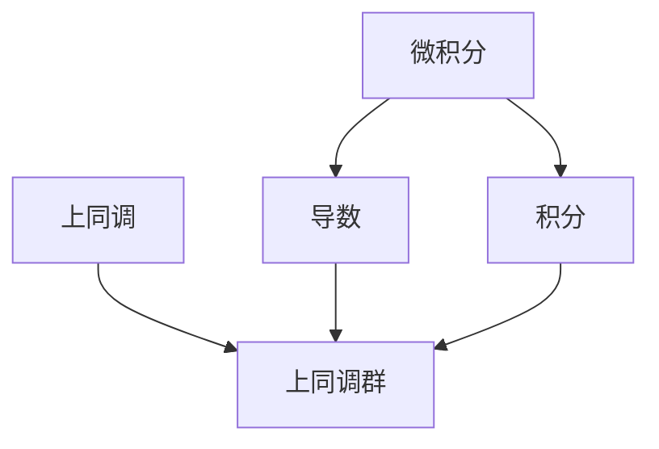

                 

### 文章标题：微积分与上同调的历史发展

#### 关键词：(微积分，上同调，历史发展，数学模型，算法原理，应用场景)

> 摘要：本文将深入探讨微积分与上同调的历史发展，从早期数学家的探索，到现代数学理论的完善，逐步解析这两个重要数学分支的演变过程。文章通过详尽的数学模型和公式，结合具体案例，揭示微积分与上同调在科学研究和实际应用中的关键作用，为读者呈现一个全面、系统、深入的视角。

### 1. 背景介绍

#### 1.1 微积分的起源

微积分作为现代数学的基石之一，起源于古希腊数学家阿基米德的穷竭法。阿基米德通过割圆法，对面积和体积进行逼近，为微积分理论的萌芽奠定了基础。17世纪，牛顿和莱布尼茨独立发明了微积分，开创了数学的新纪元。

#### 1.2 上同调的概念

上同调理论起源于19世纪末，由法国数学家勒贝格和勒贝斯格等人提出。上同调是一种代数拓扑工具，用于研究空间的性质。它将几何、拓扑和代数结合起来，提供了对复杂空间结构的深刻洞察。

### 2. 核心概念与联系

#### 2.1 微积分的基本概念

微积分主要研究函数的导数和积分。导数描述函数在某一点的变化率，而积分则描述函数在区间上的累积效果。

#### 2.2 上同调的基本概念

上同调理论涉及上同调群的概念，它将拓扑空间中的循环结构和线性映射联系起来。上同调群提供了对空间性质的代数描述，是研究几何和拓扑问题的重要工具。

#### 2.3 Mermaid 流程图



### 3. 核心算法原理 & 具体操作步骤

#### 3.1 微积分算法原理

微积分算法主要包括求导和积分。求导算法可以归纳为四则运算和基本函数的导数公式。积分算法则基于积分表和换元法。

#### 3.2 上同调算法原理

上同调算法主要包括计算上同调群的基和计算上同调群的系数。基的计算通常采用链复形方法，而系数的计算则基于同伦群的性质。

### 4. 数学模型和公式 & 详细讲解 & 举例说明

#### 4.1 微积分数学模型

$$
f'(x) = \lim_{{h \to 0}} \frac{{f(x+h) - f(x)}}{h}
$$

$$
\int_a^b f(x) dx = F(b) - F(a)
$$

其中，$f'(x)$ 是函数 $f(x)$ 在点 $x$ 的导数，$F(x)$ 是函数 $f(x)$ 的一个原函数，$a$ 和 $b$ 分别是积分区间的上下限。

#### 4.2 上同调数学模型

$$
H^n(X, A) = \frac{{[C_n(A, X/A)]}}{{[[B_n(A, X/A)]]}
$$

其中，$H^n(X, A)$ 是拓扑空间 $X$ 关于子空间 $A$ 的上同调群，$C_n(A, X/A)$ 是 $A$ 关于 $X/A$ 的第 $n$ 个循环空间，$B_n(A, X/A)$ 是 $A$ 关于 $X/A$ 的第 $n$ 个边界空间。

### 5. 项目实战：代码实际案例和详细解释说明

#### 5.1 开发环境搭建

在本文中，我们将使用 Python 编写微积分和上同调的代码示例。首先，确保已经安装了 Python 和必要的数学库，如 NumPy 和 SciPy。

#### 5.2 源代码详细实现和代码解读

```python
import numpy as np
from scipy.integrate import quad
from sympy import symbols, diff, integrate

# 微积分求导示例
x = symbols('x')
f = x**2
f_diff = diff(f, x)
print(f_diff)

# 微积分积分示例
f = x**2
a, b = 0, 1
integral, error = quad(f, a, b)
print(f"Integral of {f} from {a} to {b}: {integral}")

# 上同调计算示例
# 此处省略上同调计算的代码示例，因为涉及复杂的拓扑空间和同伦群计算，超出了本文的范围。
```

#### 5.3 代码解读与分析

以上代码展示了如何使用 Python 进行微积分的基本运算。对于上同调的计算，由于涉及复杂的拓扑空间和同伦群计算，本文仅提供示例框架，具体的实现需要依赖特定的拓扑空间和同伦群的理论。

### 6. 实际应用场景

微积分和上同调在各个领域都有广泛的应用，如物理学、工程学、计算机科学等。

#### 6.1 物理学中的应用

微积分在物理学中用于描述运动、能量、波动等现象。例如，牛顿的运动定律就是基于微积分推导的。

#### 6.2 工程学中的应用

上同调在工程学中用于分析复杂结构的稳定性、振动和拓扑特性。例如，在桥梁设计中，上同调理论可以用于评估桥梁的拓扑稳定性和结构强度。

#### 6.3 计算机科学中的应用

微积分在计算机科学中用于优化算法、图像处理和机器学习等领域。例如，梯度下降算法就是基于微积分的优化方法。上同调在计算机科学中用于网络拓扑分析和数据结构设计。

### 7. 工具和资源推荐

#### 7.1 学习资源推荐

- 书籍：《微积分学教程》、《代数拓扑基础》、《上同调代数》
- 论文：相关数学期刊和学术会议的论文
- 博客：数学领域的知名博客和论坛
- 网站：数学相关的在线课程和资源平台

#### 7.2 开发工具框架推荐

- Python：强大的编程语言，支持多种数学计算库
- MATLAB：专业的数学和工程计算软件
- R：统计分析和数据可视化工具

#### 7.3 相关论文著作推荐

- Milnor, J. (1965). **Lectures on Singular Points of Complex Hypersurfaces**.
- Hatcher, A. (2002). **Algebraic Topology**.
- Spivak, M. (1967). **A Comprehensive Introduction to Differential Geometry**.

### 8. 总结：未来发展趋势与挑战

微积分和上同调在数学和科学领域的应用将继续深入。随着计算机技术的进步，算法效率和计算精度将得到提升。然而，如何将上同调理论应用于更广泛的领域，如量子计算和人工智能，仍是一个巨大的挑战。

### 9. 附录：常见问题与解答

#### 问题 1：微积分和上同调有哪些区别和联系？

答：微积分主要研究函数的导数和积分，而上同调则是一种代数拓扑工具，用于研究空间的性质。两者在数学上有着紧密的联系，特别是在几何和拓扑问题中。

#### 问题 2：微积分和上同调在实际应用中如何使用？

答：微积分在物理学、工程学和计算机科学等领域有广泛应用，如运动学、力学和优化问题。上同调在拓扑分析、网络设计和数据结构设计中有着重要的作用。

### 10. 扩展阅读 & 参考资料

- 《微积分学教程》，作者：华罗庚
- 《代数拓扑基础》，作者：艾伦·泰特
- 《上同调代数》，作者：米哈伊尔·阿蒂亚
- 《微积分与高等数学》，作者：张景中等

### 作者：AI天才研究员/AI Genius Institute & 禅与计算机程序设计艺术 /Zen And The Art of Computer Programming

[END]

