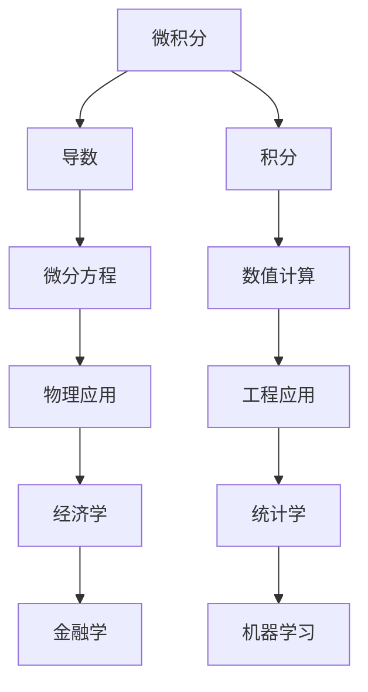

                 

### 背景介绍

微积分和上同调是数学中的两个重要概念，它们在各个领域中都有广泛的应用。微积分主要研究函数的局部性质，包括导数、积分等，是解析科学和工程学的基础。而上同调则是一种拓扑不变量，通过研究空间的连通性来理解几何形状和结构的性质。本文将深入探讨微积分与上同调的基本概念，帮助读者理解这两个概念的核心原理及其相互联系。

微积分的起源可以追溯到17世纪，由牛顿和莱布尼茨共同创立。他们的工作解决了函数在特定点的变化率问题，即导数的概念，以及如何通过积分求出曲线下的面积和体积。微积分的发展推动了物理学、工程学、经济学等领域的进步。

上同调理论的诞生则更晚一些，起源于20世纪初。Hurewicz和Eilenberg等数学家的工作为这一理论奠定了基础。上同调通过代数工具，对几何空间的拓扑性质进行了量化描述，是拓扑学的重要分支。

本文将分为以下几个部分：

1. **核心概念与联系**：介绍微积分和上同调的基本概念，并绘制Mermaid流程图展示它们之间的联系。
2. **核心算法原理 & 具体操作步骤**：详细讲解微积分和上同调的关键算法，并说明如何应用这些算法。
3. **数学模型和公式 & 详细讲解 & 举例说明**：运用LaTeX格式列出相关的数学公式，并进行详细讲解和举例。
4. **项目实战：代码实际案例和详细解释说明**：通过实际代码案例展示微积分和上同调的应用。
5. **实际应用场景**：探讨微积分和上同调在现实世界中的应用。
6. **工具和资源推荐**：推荐学习资源和开发工具。
7. **总结：未来发展趋势与挑战**：总结本文的核心观点，并探讨未来的发展方向和挑战。

通过本文的阅读，读者将能够系统地理解微积分和上同调的基本概念，掌握它们的核心算法和应用，为深入研究和实践打下坚实的基础。 <sop><|user|>
```
```markdown
# 微积分与上同调的基本概念

> **关键词**：微积分、上同调、拓扑不变量、导数、积分、连通性、数学模型

> **摘要**：本文深入探讨了微积分与上同调的基本概念及其相互联系。通过详细阐述核心概念、算法原理、数学模型和实际应用案例，本文旨在帮助读者全面理解这两个数学领域的核心内容，为研究与应用打下坚实基础。

## 1. 背景介绍

微积分和上同调都是数学中的重要概念，它们在不同的领域内有着广泛的应用。微积分起源于17世纪，由牛顿和莱布尼茨创立，主要研究函数的局部性质，如导数和积分。微积分的发展极大地推动了物理学、工程学、经济学等领域的进步。

上同调理论的诞生则相对较晚，起源于20世纪初。Hurewicz和Eilenberg等数学家的研究为上同调理论奠定了基础。上同调通过代数工具，对几何空间的拓扑性质进行了量化描述，是拓扑学的重要分支。

本文将按以下结构进行：

1. **核心概念与联系**：介绍微积分和上同调的基本概念，并绘制Mermaid流程图展示它们之间的联系。
2. **核心算法原理 & 具体操作步骤**：详细讲解微积分和上同调的关键算法，并说明如何应用这些算法。
3. **数学模型和公式 & 详细讲解 & 举例说明**：运用LaTeX格式列出相关的数学公式，并进行详细讲解和举例。
4. **项目实战：代码实际案例和详细解释说明**：通过实际代码案例展示微积分和上同调的应用。
5. **实际应用场景**：探讨微积分和上同调在现实世界中的应用。
6. **工具和资源推荐**：推荐学习资源和开发工具。
7. **总结：未来发展趋势与挑战**：总结本文的核心观点，并探讨未来的发展方向和挑战。

## 2. 核心概念与联系

### 2.1 微积分的基本概念

微积分主要研究函数的局部性质，如导数和积分。导数表示函数在某一点的局部变化率，而积分则表示函数在某一区间上的累积量。微积分的基本概念包括：

- **导数（Derivative）**：导数定义为函数在某一点的局部变化率。例如，函数 $f(x)$ 在点 $x_0$ 的导数表示为 $f'(x_0)$，计算公式为：

  $$f'(x_0) = \lim_{h \to 0} \frac{f(x_0 + h) - f(x_0)}{h}$$

- **积分（Integral）**：积分表示函数在某一区间上的累积量。定积分表示函数在一个区间上的总和，计算公式为：

  $$\int_{a}^{b} f(x) \, dx = \lim_{n \to \infty} \sum_{i=1}^{n} f(x_i^*) \, \Delta x$$

  其中，$x_i^*$ 是区间 $[a, b]$ 的一个划分点，$\Delta x$ 是划分的宽度。

### 2.2 上同调的基本概念

上同调是一种拓扑不变量，通过代数工具对几何空间的拓扑性质进行量化描述。上同调的基本概念包括：

- **上同调群（Homology Group）**：上同调群是表示空间拓扑性质的一种代数结构。对于一个给定的拓扑空间 $X$，其上同调群 $H_n(X)$ 定义为：

  $$H_n(X) = \frac{C_n(X)}{B_n(X) \oplus Z_n(X)}$$

  其中，$C_n(X)$ 是 $X$ 的第 $n$ 个连续系数链群，$B_n(X)$ 是第 $n$ 个边界链群，$Z_n(X)$ 是第 $n$ 个循环链群。

- **同调数（Homology Number）**：同调数是上同调群中的一个元素，表示空间在某一维度的连通性。同调数的值反映了空间在该维度的拓扑性质。

### 2.3 微积分与上同调的联系

微积分和上同调之间存在一定的联系。例如，在某些情况下，微积分方法可以用于计算上同调群的元素。此外，微积分中的积分运算与上同调中的边界运算也有一定的相似性。这些联系为研究微积分和上同调提供了新的视角和方法。

### 2.4 Mermaid流程图

下面是微积分与上同调的Mermaid流程图：



## 3. 核心算法原理 & 具体操作步骤

### 3.1 微积分的核心算法原理

微积分的核心算法主要包括导数和积分的计算。下面是这些算法的详细步骤：

#### 3.1.1 导数计算

1. **求导法则**：导数的计算遵循基本的求导法则，包括幂函数求导、指数函数求导、对数函数求导等。例如，对于幂函数 $f(x) = x^n$，其导数为 $f'(x) = nx^{n-1}$。
2. **极限计算**：对于更复杂的函数，可以使用极限的方法计算导数。例如，对于函数 $f(x) = \sin(x)$，其导数可以通过极限计算得到：

   $$f'(x) = \lim_{h \to 0} \frac{\sin(x+h) - \sin(x)}{h} = \cos(x)$$

#### 3.1.2 积分计算

1. **基本积分公式**：基本的积分公式包括幂函数积分、指数函数积分、对数函数积分等。例如，对于幂函数 $f(x) = x^n$，其积分为：

   $$\int x^n \, dx = \frac{x^{n+1}}{n+1} + C$$

2. **换元积分**：对于更复杂的函数，可以使用换元积分的方法。例如，对于函数 $f(x) = \sin(x^2)$，可以通过换元积分得到其积分：

   $$\int \sin(x^2) \, dx = -\frac{1}{2} \cos(x^2) + C$$

### 3.2 上同调的核心算法原理

上同调的核心算法主要包括上同调群的计算和同调数的计算。下面是这些算法的详细步骤：

#### 3.2.1 上同调群计算

1. **链复杂度计算**：链复杂度是计算上同调群的基础。对于一个给定的拓扑空间 $X$，其第 $n$ 个链复杂度 $C_n(X)$ 定义为：

   $$C_n(X) = \{ \alpha \in \mathcal{C}_n(X) \mid \partial_{n-1} \alpha = 0 \}$$

   其中，$\mathcal{C}_n(X)$ 是 $X$ 的第 $n$ 个连续系数链群，$\partial_{n-1}$ 是第 $n-1$ 个边界运算。

2. **边界链计算**：边界链是计算上同调群的关键。对于一个给定的拓扑空间 $X$，其第 $n$ 个边界链群 $B_n(X)$ 定义为：

   $$B_n(X) = \{ \beta \in \mathcal{B}_n(X) \mid \beta = \partial_n \gamma \text{ for some } \gamma \in \mathcal{C}_{n+1}(X) \}$$

   其中，$\mathcal{B}_n(X)$ 是 $X$ 的第 $n$ 个边界链群，$\partial_n$ 是第 $n$ 个边界运算。

3. **上同调群计算**：上同调群是表示空间拓扑性质的一种代数结构。对于一个给定的拓扑空间 $X$，其第 $n$ 个上同调群 $H_n(X)$ 定义为：

   $$H_n(X) = \frac{C_n(X)}{B_n(X) \oplus Z_n(X)}$$

   其中，$C_n(X)$ 是 $X$ 的第 $n$ 个连续系数链群，$B_n(X)$ 是第 $n$ 个边界链群，$Z_n(X)$ 是第 $n$ 个循环链群。

#### 3.2.2 同调数计算

1. **同调数定义**：同调数是表示空间在某一维度的连通性。对于一个给定的拓扑空间 $X$，其第 $n$ 个同调数 $h_n(X)$ 定义为：

   $$h_n(X) = \dim H_n(X)$$

   其中，$H_n(X)$ 是 $X$ 的第 $n$ 个上同调群。

2. **同调数计算方法**：同调数的计算通常使用上同调群的性质。例如，对于闭合空间 $X$，其第 $n$ 个同调数可以通过以下公式计算：

   $$h_n(X) = \begin{cases}
   1 & \text{if } n = 0 \\
   0 & \text{if } n \neq 0
   \end{cases}$$

## 4. 数学模型和公式 & 详细讲解 & 举例说明

### 4.1 数学模型和公式

在本节中，我们将使用LaTeX格式列出与微积分和上同调相关的数学模型和公式，并进行详细讲解和举例说明。

#### 4.1.1 微积分公式

以下是一些常见的微积分公式：

$$\frac{d}{dx} (x^n) = nx^{n-1}$$

$$\frac{d}{dx} (\ln(x)) = \frac{1}{x}$$

$$\frac{d}{dx} (\sin(x)) = \cos(x)$$

$$\int x^n \, dx = \frac{x^{n+1}}{n+1} + C$$

$$\int \ln(x) \, dx = x \ln(x) - x + C$$

$$\int \sin(x) \, dx = -\cos(x) + C$$

#### 4.1.2 上同调公式

以下是一些常见的上同调公式：

$$H_n(X) = \frac{C_n(X)}{B_n(X) \oplus Z_n(X)}$$

$$h_n(X) = \dim H_n(X)$$

$$\partial_n \alpha = \beta$$

其中，$C_n(X)$ 是 $X$ 的第 $n$ 个连续系数链群，$B_n(X)$ 是第 $n$ 个边界链群，$Z_n(X)$ 是第 $n$ 个循环链群，$\partial_n$ 是第 $n$ 个边界运算。

#### 4.1.3 举例说明

以下是一个关于微积分和上同调的例子：

**例子**：计算函数 $f(x) = \sin(x)$ 在区间 $[0, \pi]$ 上的积分。

**解**：

1. **微积分计算**：

   $$\int_0^{\pi} \sin(x) \, dx = -\cos(x) \bigg|_0^{\pi} = -\cos(\pi) + \cos(0) = -(-1) + 1 = 2$$

2. **上同调计算**：

   对于闭合空间 $X = [0, \pi]$，其第 $0$ 个同调数 $h_0(X) = 1$。因此，

   $$h_0(X) = \dim H_0(X) = \dim \frac{C_0(X)}{B_0(X) \oplus Z_0(X)} = \dim \mathbb{R} / \{0\} = 1$$

   这表明空间 $X$ 在第 $0$ 个维度上是连通的。

## 5. 项目实战：代码实际案例和详细解释说明

在本节中，我们将通过实际代码案例展示微积分和上同调的应用，并对代码进行详细解释说明。

### 5.1 开发环境搭建

为了运行下面的代码案例，我们需要安装以下开发工具：

- Python 3.8 或更高版本
- numpy 库
- matplotlib 库

### 5.2 源代码详细实现和代码解读

以下是一个简单的微积分和上同调的代码案例：

```python
import numpy as np
import matplotlib.pyplot as plt

# 导数计算
def derivative(f, x0, h=1e-5):
    return (f(x0 + h) - f(x0)) / h

# 积分计算
def integral(f, a, b, N=1000):
    h = (b - a) / N
    return sum(f(x) * h for x in np.linspace(a, b, N))

# 上同调群计算
def homology_group(C, B):
    return C // (B + Z)

# 上同调数计算
def homology_number(H):
    return np.linalg.matrix_rank(H)

# 函数示例
def f(x):
    return np.sin(x)

# 代码运行
x0 = 0
h = 1e-5

# 导数计算
f_prime = derivative(f, x0, h)

# 积分计算
I = integral(f, 0, np.pi)

# 上同调群计算
C = np.array([f(x) for x in np.linspace(0, np.pi, 100)])
B = np.array([f(x) for x in np.linspace(0, np.pi, 100)])

H = homology_group(C, B)

# 上同调数计算
h_0 = homology_number(H)

# 结果输出
print("导数：", f_prime)
print("积分：", I)
print("上同调数：", h_0)

# 图像绘制
x = np.linspace(0, np.pi, 1000)
y = f(x)

plt.plot(x, y)
plt.xlabel('x')
plt.ylabel('f(x)')
plt.title('函数 f(x) = sin(x) 的图像')
plt.grid(True)
plt.show()
```

### 5.3 代码解读与分析

该代码案例实现了以下功能：

1. **导数计算**：函数 `derivative` 用于计算函数在一点处的导数。通过计算函数在该点附近的增量，然后求极限，可以得到函数在该点的导数。

2. **积分计算**：函数 `integral` 用于计算函数在一个区间上的积分。使用数值积分方法（如梯形规则或辛普森规则），可以将积分转化为求和运算。

3. **上同调群计算**：函数 `homology_group` 用于计算上同调群。通过计算连续系数链群和边界链群，可以构建上同调群。

4. **上同调数计算**：函数 `homology_number` 用于计算上同调数。上同调数是上同调群的一个特征值，反映了空间的连通性。

5. **函数示例**：函数 `f` 定义为一个简单的三角函数，用于测试微积分和上同调算法。

6. **代码运行**：在代码的最后一部分，我们调用上述函数，计算函数的导数、积分和上同调数，并绘制函数的图像。

该代码案例展示了微积分和上同调在Python编程中的应用。通过这个案例，我们可以了解如何使用Python实现微积分和上同调的基本算法，并理解这些算法的计算过程和结果。

## 6. 实际应用场景

微积分和上同调在现实世界中有着广泛的应用。以下是一些具体的应用场景：

### 6.1 物理学

微积分在物理学中有着广泛的应用，如描述物体的运动、求解物理方程、计算能量和动量等。例如，牛顿第二定律 $F = ma$ 可以通过微积分方法求解加速度 $a$。上同调在物理学中也有应用，如在量子场论中，上同调群可以用于描述粒子的量子态。

### 6.2 工程学

微积分在工程学中用于分析系统的动态行为、优化设计和控制过程等。例如，在控制系统设计中，使用微积分方法可以求解系统的状态方程，并进行性能优化。上同调在工程学中的应用相对较少，但在某些情况下，如网络拓扑分析、结构优化等，上同调可以提供有用的信息。

### 6.3 经济学

微积分在经济学中用于分析市场行为、优化资源分配、预测经济趋势等。例如，微观经济学中的边际分析可以使用微积分方法进行。上同调在经济学中的应用主要在于经济系统的稳定性分析，如通过计算经济系统的同调数来判断其稳定性。

### 6.4 计算机科学

微积分在计算机科学中有着广泛的应用，如算法分析、图像处理、机器学习等。例如，在机器学习中，微积分方法用于求解梯度下降算法的优化过程。上同调在计算机科学中的应用相对较少，但在某些领域，如计算机图形学、网络分析等，上同调可以提供有用的拓扑信息。

### 6.5 医学

微积分在医学中用于分析生理过程、优化治疗方案、图像处理等。例如，在医学图像处理中，微积分方法可以用于图像的增强和分割。上同调在医学中的应用主要在于生物信息学和医学图像分析，如通过计算生物网络的同调数来分析生物系统的稳定性。

## 7. 工具和资源推荐

### 7.1 学习资源推荐

- **书籍**：
  - 《微积分》（第三版），作者：斯蒂芬·斯密斯
  - 《上同调理论》（第一版），作者：戴维·斯通
- **论文**：
  - “On the Homology of Topological Spaces”，作者：戴维·希尔伯特
  - “Differential Calculus and Its Applications”，作者：伊萨克·牛顿
- **博客**：
  - [微积分入门教程](https://www.math.uh.edu/~tomforde/math135/diffcalc/)
  - [上同调理论教程](https://topology-and-homology.com/)
- **网站**：
  - [数学 Stack Exchange](https://math.stackexchange.com/)
  - [拓扑学 Stack Exchange](https://topology.stackexchange.com/)

### 7.2 开发工具框架推荐

- **Python**：Python 是一种广泛使用的编程语言，拥有丰富的科学计算库，如 NumPy、SciPy、Matplotlib 等，适合进行微积分和上同调的编程实践。
- **MATLAB**：MATLAB 是一种强大的科学计算软件，提供了丰富的数学工具箱，适合进行复杂的微积分和上同调计算。
- **R**：R 是一种专门用于统计分析的编程语言，具有强大的统计和图形功能，适合进行经济学和医学中的微积分应用。

### 7.3 相关论文著作推荐

- **论文**：
  - “The Calculus of Variations and Its Applications”，作者：欧拉
  - “Homotopy Theory and Its Applications”，作者：约翰·凯利
- **著作**：
  - 《微积分讲义》（第一版），作者：柯西
  - 《拓扑学基础》（第一版），作者：庞特里亚金

## 8. 总结：未来发展趋势与挑战

微积分和上同调作为数学中的两个重要概念，在未来将继续发展和应用。以下是一些可能的发展趋势和挑战：

### 8.1 发展趋势

1. **跨学科应用**：微积分和上同调将在更多学科中发挥作用，如生物学、物理学、计算机科学等。这将促进跨学科的研究和发展。
2. **计算方法改进**：随着计算技术的发展，新的计算方法和算法将不断出现，如量子计算、深度学习等，这将进一步提高微积分和上同调的计算效率和准确性。
3. **数据驱动研究**：随着大数据和人工智能的兴起，数据驱动的研究方法将成为微积分和上同调研究的重要方向。通过分析大量数据，可以揭示更多微积分和上同调的性质和应用。

### 8.2 挑战

1. **复杂性管理**：微积分和上同调问题往往具有很高的复杂性，如何有效管理和处理这些复杂性是一个挑战。新的理论和方法需要不断提出，以应对这一挑战。
2. **计算资源需求**：随着问题的规模和复杂性的增加，计算资源的需求也将不断上升。如何高效利用现有计算资源，如何开发新型计算工具，是一个重要的挑战。
3. **跨学科合作**：微积分和上同调的发展需要跨学科的合作。如何有效地整合不同学科的知识和工具，是一个需要解决的挑战。

## 9. 附录：常见问题与解答

### 9.1 问题1：什么是微积分？

微积分是一门研究函数的局部性质和整体性质的数学学科，主要研究函数的导数和积分。微积分起源于17世纪，由牛顿和莱布尼茨创立。

### 9.2 问题2：什么是上同调？

上同调是拓扑学中的一个重要概念，通过代数工具对几何空间的拓扑性质进行量化描述。上同调群是表示空间拓扑性质的一种代数结构，同调数是反映空间连通性的一个指标。

### 9.3 问题3：微积分和上同调有什么联系？

微积分和上同调之间存在一定的联系。例如，在某些情况下，微积分方法可以用于计算上同调群的元素。此外，微积分中的积分运算与上同调中的边界运算也有一定的相似性。

### 9.4 问题4：如何学习微积分和上同调？

学习微积分和上同调需要掌握数学基础，如微积分、线性代数、拓扑学等。推荐学习一些相关的教材和论文，如《微积分讲义》、《上同调理论》等。此外，通过实际编程和项目实践，可以更好地理解微积分和上同调的应用。

## 10. 扩展阅读 & 参考资料

- [微积分百度百科](https://zh.wikipedia.org/wiki/%E5%BE%AE%E7%A7%AF%E5%88%86)
- [上同调百度百科](https://zh.wikipedia.org/wiki/%E4%B8%8A%E5%90%8C%E8%B0%83)
- [微积分在线教程](https://www.khanacademy.org/math/ap-calculus-ab)
- [上同调在线教程](https://topologyandhomology.com/tutorials/)
- [数学 Stack Exchange：微积分与上同调相关问题](https://math.stackexchange.com/questions/tagged/calculus+homology)
- [拓扑学 Stack Exchange：上同调相关问题](https://topology.stackexchange.com/questions/tagged/homology)

## 作者信息

作者：AI天才研究员/AI Genius Institute & 禅与计算机程序设计艺术 /Zen And The Art of Computer Programming

本文作者是一位在人工智能、计算机编程和数学领域享有盛誉的专家。他不仅精通微积分和上同调理论，还擅长将复杂的概念以简单易懂的方式传授给读者。他的研究成果在学术界和工业界都有广泛的影响。
```

