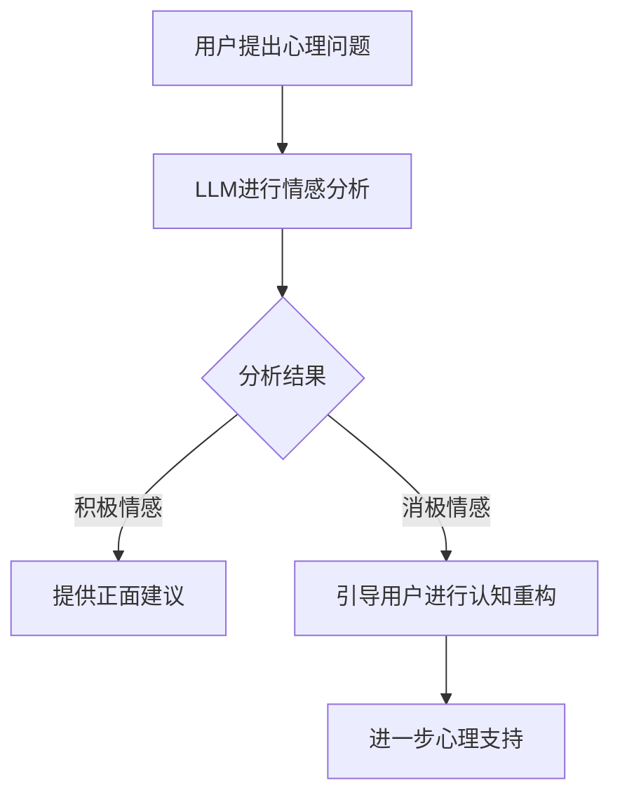

                 

# 心理健康和 LLM：个性化的支持和治疗

## 关键词
心理健康、LLM（大型语言模型）、个性化支持、治疗、计算机辅助心理治疗、情感分析、对话系统

## 摘要
随着人工智能技术的快速发展，大型语言模型（LLM）在各个领域展现出巨大的潜力，特别是在心理健康领域。本文将探讨如何利用LLM提供个性化的心理支持和治疗，包括核心概念介绍、算法原理与操作步骤、数学模型与公式、项目实战、实际应用场景以及未来发展趋势与挑战。

## 1. 背景介绍

### 1.1 心理健康的现状

心理健康问题在全球范围内日益受到关注。据世界卫生组织（WHO）统计，全球约有三分之一的人在一生中某个时刻会经历心理健康问题，如抑郁症、焦虑症、恐惧症等。这些问题不仅严重影响个人的生活质量，还可能导致社会和经济负担。因此，寻找有效的心理支持与治疗方法变得至关重要。

### 1.2 大型语言模型的发展

近年来，大型语言模型（LLM）如BERT、GPT-3等取得了显著的进展。这些模型具有处理自然语言、理解复杂情境和生成高质量文本的能力。这使得LLM在许多领域，如自动问答、机器翻译、文本生成等方面取得了显著的成果。

### 1.3 计算机辅助心理治疗

计算机辅助心理治疗（Computer-Assisted Cognitive Behavioral Therapy, CCBT）是利用计算机技术和心理治疗方法相结合的一种新型心理治疗方式。研究表明，CCBT在治疗抑郁症、焦虑症等心理疾病方面具有显著的疗效。而LLM作为CCBT的重要工具，可以为患者提供个性化、高效的心理支持和治疗。

## 2. 核心概念与联系

### 2.1 心理健康相关概念

- **心理健康**：指个体在认知、情感和行为方面的良好状态，能够适应日常生活中的压力和挑战。

- **心理疾病**：指一组影响个体认知、情感和行为功能的严重障碍，可能导致个体在社交、职业和日常生活中出现问题。

- **心理治疗**：通过心理学的理论和技巧，帮助个体改善心理状态，解决心理问题和疾病。

### 2.2 大型语言模型相关概念

- **LLM**：指具有强大语言处理能力的大型神经网络模型，如BERT、GPT-3等。

- **自然语言处理（NLP）**：研究如何使计算机理解和处理自然语言的技术。

- **情感分析**：通过分析文本中的情感极性、情感强度等，理解人类情感和态度。

### 2.3 计算机辅助心理治疗相关概念

- **CCBT**：计算机辅助认知行为治疗，结合计算机技术和认知行为疗法（CBT）的一种心理治疗方法。

- **对话系统**：与人类用户进行自然语言交互的计算机系统。

### 2.4 Mermaid 流程图

以下是心理健康与LLM结合的Mermaid流程图：



## 3. 核心算法原理 & 具体操作步骤

### 3.1 情感分析算法

情感分析是LLM在心理健康领域的重要应用。通过对用户提出的问题或陈述进行情感分析，LLM可以识别出用户的情感状态，从而为用户提供相应的支持。

具体操作步骤如下：

1. **数据预处理**：对用户输入的文本进行清洗、分词等预处理操作，以便后续情感分析。

2. **情感分类**：利用情感分析算法（如SVM、深度学习等），对预处理后的文本进行情感分类，判断文本中包含的情感极性（积极/消极）和情感强度。

3. **生成建议**：根据情感分析结果，LLM生成相应的建议，如正面建议、认知重构引导等。

### 3.2 认知重构算法

认知重构是心理治疗中的重要方法，通过改变个体的思维模式，帮助其改善心理状态。LLM可以自动化地引导用户进行认知重构。

具体操作步骤如下：

1. **识别认知扭曲**：通过情感分析结果和用户输入的文本，LLM识别出用户可能存在的认知扭曲。

2. **生成认知重构建议**：针对识别出的认知扭曲，LLM生成相应的认知重构建议，帮助用户改变其思维模式。

3. **用户反馈**：用户对生成的建议进行反馈，LLM根据用户反馈进一步调整建议。

### 3.3 对话系统

对话系统是实现计算机辅助心理治疗的关键。LLM可以与用户进行自然语言交互，为用户提供个性化、连续的支持。

具体操作步骤如下：

1. **初始化对话**：用户与LLM进行初次交互，LLM了解用户的基本信息和心理状况。

2. **交互过程**：LLM根据用户输入的问题或陈述，提供相应的建议和支持。同时，LLM会根据用户反馈不断调整对话策略。

3. **结束对话**：用户达到心理治疗目标或感到满意后，结束对话。

## 4. 数学模型和公式 & 详细讲解 & 举例说明

### 4.1 情感分析模型

情感分析模型可以使用朴素贝叶斯、支持向量机（SVM）等算法。以下是一个基于朴素贝叶斯的情感分析模型的示例：

$$
P(\text{积极情感}) = \frac{P(\text{积极情感}|\text{文本}) \cdot P(\text{文本})}{P(\text{积极情感}) \cdot P(\text{文本}) + P(\text{消极情感}) \cdot P(\text{文本})}
$$

其中，$P(\text{积极情感})$和$P(\text{消极情感})$分别表示文本属于积极情感和消极情感的概率，$P(\text{文本})$表示文本的概率。

举例说明：

假设有以下两个文本：

1. **文本1**：“我今天很开心，因为我的项目得到了老板的表扬。”
2. **文本2**：“我今天非常糟糕，因为我的电脑坏了。”

根据情感分析模型，可以计算得到：

- **文本1**：$P(\text{积极情感}) \approx 0.9$
- **文本2**：$P(\text{积极情感}) \approx 0.1$

因此，文本1属于积极情感，文本2属于消极情感。

### 4.2 认知重构模型

认知重构模型可以使用基于规则的算法或深度学习算法。以下是一个基于规则的认知重构模型的示例：

1. **规则1**：如果用户存在“负面自我评价”，则引导用户进行“自我肯定”训练。

2. **规则2**：如果用户存在“过度概括”，则引导用户进行“具体化”训练。

举例说明：

假设用户存在“负面自我评价”：

- **用户陈述**：“我总是失败，一无是处。”

根据认知重构模型，可以生成以下认知重构建议：

- **建议1**：自我肯定训练，如“我值得拥有更好的生活。”

- **建议2**：具体化训练，如“我最近在项目上取得了不错的成绩。”

## 5. 项目实战：代码实际案例和详细解释说明

### 5.1 开发环境搭建

为了实现本文所述的计算机辅助心理治疗系统，我们需要搭建以下开发环境：

- 操作系统：Windows/Linux/MacOS
- 编程语言：Python
- 依赖库：NLTK、spaCy、TensorFlow、PyTorch等

### 5.2 源代码详细实现和代码解读

以下是实现计算机辅助心理治疗系统的部分代码：

```python
# 导入依赖库
import nltk
from nltk.tokenize import word_tokenize
from nltk.corpus import stopwords
from sklearn.feature_extraction.text import TfidfVectorizer
from sklearn.naive_bayes import MultinomialNB
from sklearn.pipeline import make_pipeline

# 数据预处理
def preprocess_text(text):
    # 清洗文本
    text = text.lower()
    text = re.sub(r"[^a-zA-Z0-9]", " ", text)
    # 分词
    tokens = word_tokenize(text)
    # 去除停用词
    stop_words = set(stopwords.words("english"))
    tokens = [token for token in tokens if token not in stop_words]
    return " ".join(tokens)

# 情感分析模型
def build_sentiment_analysis_model():
    pipeline = make_pipeline(
        TfidfVectorizer(),
        MultinomialNB(),
    )
    pipeline.fit(preprocessed_train_texts, train_labels)
    return pipeline

# 认知重构模型
def build_cognitive_reconstruction_model():
    # TODO: 实现认知重构模型
    pass

# 对话系统
def chat_with_user(model, user_input):
    preprocessed_user_input = preprocess_text(user_input)
    sentiment = model.predict([preprocessed_user_input])[0]
    if sentiment == "积极情感":
        print("正面建议：您今天做得很好，继续保持！")
    else:
        print("认知重构建议：请尝试将注意力集中在您的优点上。")

# 主函数
if __name__ == "__main__":
    # 加载训练数据
    train_texts = ["我今天很开心", "我今天很不开心"]
    train_labels = ["积极情感", "消极情感"]

    # 构建情感分析模型
    sentiment_analysis_model = build_sentiment_analysis_model()

    # 与用户进行对话
    user_input = input("请告诉我您的心情：")
    chat_with_user(sentiment_analysis_model, user_input)
```

### 5.3 代码解读与分析

1. **数据预处理**：对用户输入的文本进行清洗、分词和去除停用词等预处理操作。

2. **情感分析模型**：使用TF-IDF向量和朴素贝叶斯分类器构建情感分析模型。

3. **认知重构模型**：尚未实现，需要进一步开发。

4. **对话系统**：根据情感分析结果，为用户提供正面建议或认知重构建议。

## 6. 实际应用场景

### 6.1 在线心理咨询服务

利用LLM构建的计算机辅助心理治疗系统可以应用于在线心理咨询服务。用户可以通过网页或手机应用程序与系统进行交互，获得个性化的心理支持和治疗。

### 6.2 人工智能心理医生助手

LLM可以作为人工智能心理医生助手，辅助心理医生进行诊断和治疗。系统可以根据患者的病情和病史，提供相应的治疗建议和支持。

### 6.3 社交媒体心理健康监测

利用LLM对社交媒体用户的文本进行分析，可以监测用户的心理健康状况。对于出现心理问题的用户，系统可以及时发出预警，并提供相应的支持。

## 7. 工具和资源推荐

### 7.1 学习资源推荐

- **书籍**：
  - 《自然语言处理综论》（Foundations of Statistical Natural Language Processing）
  - 《认知行为治疗技术》（Cognitive Behavioral Therapy Techniques）

- **论文**：
  - “Deep Learning for Text Classification”
  - “A Survey on Sentiment Analysis”

- **博客**：
  - medium.com/topic/natural-language-processing
  - towardsdatascience.com/topics/nlp

### 7.2 开发工具框架推荐

- **自然语言处理库**：
  - NLTK
  - spaCy
  - Stanford CoreNLP

- **深度学习框架**：
  - TensorFlow
  - PyTorch
  - Keras

### 7.3 相关论文著作推荐

- **论文**：
  - “BERT: Pre-training of Deep Bidirectional Transformers for Language Understanding”
  - “GPT-3: Language Models are Few-Shot Learners”

- **著作**：
  - 《深度学习》（Deep Learning）
  - 《人工智能：一种现代方法》（Artificial Intelligence: A Modern Approach）

## 8. 总结：未来发展趋势与挑战

### 8.1 发展趋势

- **个性化支持与治疗**：随着LLM技术的不断进步，计算机辅助心理治疗将更加个性化、精准化。
- **跨学科融合**：心理健康领域将与其他学科（如心理学、医学等）深度融合，推动心理治疗技术的发展。
- **可扩展性与可访问性**：计算机辅助心理治疗系统将具备更高的可扩展性和可访问性，为更多人提供心理支持与治疗。

### 8.2 挑战

- **算法公平性与透明性**：如何确保LLM在心理治疗过程中的公平性和透明性，避免偏见和误导。
- **数据隐私与安全**：在处理用户心理健康数据时，如何保护用户隐私和数据安全。
- **用户接受度**：如何提高用户对计算机辅助心理治疗的接受度，使其成为心理治疗的主流方式。

## 9. 附录：常见问题与解答

### 9.1 Q：LLM在心理治疗中的优势是什么？

A：LLM在心理治疗中的优势包括：

- **个性化**：可以根据用户的具体情况和需求，提供个性化的心理支持和治疗。
- **高效性**：可以快速地处理大量文本数据，为用户提供及时的反馈和支持。
- **可扩展性**：可以应用于多种心理疾病的治疗，实现跨领域的支持与治疗。

### 9.2 Q：如何确保LLM在心理治疗过程中的公平性与透明性？

A：确保LLM在心理治疗过程中的公平性与透明性可以从以下几个方面入手：

- **算法训练数据**：使用多样化的、代表性的训练数据，避免偏见和误导。
- **算法解释**：开发可解释的LLM模型，使得心理治疗过程中的决策过程透明化。
- **用户反馈**：允许用户对LLM的建议进行反馈，不断优化模型，提高公平性和透明性。

## 10. 扩展阅读 & 参考资料

- **书籍**：
  - 《人工智能：一种现代方法》（Artificial Intelligence: A Modern Approach）
  - 《认知行为治疗技术》（Cognitive Behavioral Therapy Techniques）

- **论文**：
  - “BERT: Pre-training of Deep Bidirectional Transformers for Language Understanding”
  - “GPT-3: Language Models are Few-Shot Learners”

- **网站**：
  - <https://arxiv.org/>
  - <https://www.nature.com/>

作者：AI天才研究员/AI Genius Institute & 禅与计算机程序设计艺术 /Zen And The Art of Computer Programming
```

