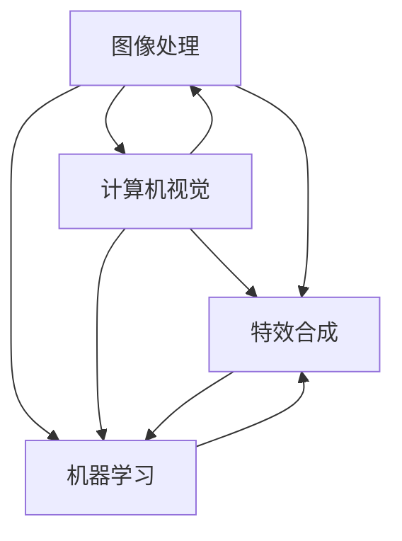

                 

### 背景介绍

**快手2025社招短视频特效算法工程师面试指南**旨在为有意向加入快手短视频特效团队，或准备参加快手社招短视频特效算法工程师面试的应聘者，提供一份全面的技术面试指南。随着短视频应用的日益普及，特效算法在短视频处理中的重要性日益凸显。快手作为短视频领域的领军企业，对于特效算法工程师的需求量不断增加，因此，对于应聘者而言，掌握相关技术知识，并通过面试脱颖而出显得尤为重要。

本文将围绕快手短视频特效算法的核心技术，分为以下几个部分进行深入探讨：

1. **核心概念与联系**：介绍短视频特效算法中的关键概念，以及它们之间的相互关系。
2. **核心算法原理与具体操作步骤**：解析快手短视频特效算法的基本原理，并详细阐述其操作步骤。
3. **数学模型和公式**：探讨短视频特效算法中涉及的数学模型和公式，并进行举例说明。
4. **项目实战**：通过实际案例，展示代码实现和详细解释说明。
5. **实际应用场景**：分析短视频特效算法在实际应用中的挑战和解决方案。
6. **工具和资源推荐**：推荐学习资源和开发工具框架，帮助读者更好地掌握相关技术。
7. **总结**：展望短视频特效算法的未来发展趋势和面临的挑战。

通过对上述各部分的详细解读，本文旨在帮助读者深入了解快手短视频特效算法的核心技术，为面试备考提供有力支持。

### 2. 核心概念与联系

在快手短视频特效算法中，核心概念包括图像处理、计算机视觉、机器学习和特效合成。这些概念之间紧密相连，共同构成了一个完整的特效算法系统。

**图像处理**是短视频特效的基础。它涉及到图像的获取、增强、滤波、边缘检测、分割等基本操作。图像处理技术为特效算法提供了图像数据的基础，从而实现对视频内容的有效分析。

**计算机视觉**则负责对图像或视频进行高层次的理解和解析。它包括目标检测、跟踪、场景识别、姿态估计等任务。计算机视觉技术使得特效算法能够识别和提取视频中的关键信息，从而进行更高级的特效处理。

**机器学习**是短视频特效算法中的核心驱动力。通过大量数据的学习和训练，机器学习算法可以自动识别和提取视频中的特征，并对其进行分类和预测。这使得特效算法能够实现自动化、自适应的处理效果，提高了算法的准确性和效率。

**特效合成**则是将图像处理和计算机视觉的结果进行整合，生成最终的视频特效。它包括视频合成、动态效果、色彩调整、光照处理等操作，使得视频内容更加生动、有趣。

下面是一个用Mermaid绘制的流程图，展示了这些核心概念之间的相互关系：



**图像处理**为**计算机视觉**提供了基础数据，同时**计算机视觉**的结果又反馈到**图像处理**中，进行进一步的优化。**机器学习**则通过对**计算机视觉**和**图像处理**的结果进行学习，提高算法的准确性和效率。最后，**特效合成**将这些处理结果进行整合，生成最终的短视频特效。

通过这些核心概念和流程的深入理解，我们可以更好地把握快手短视频特效算法的实现原理和应用场景。接下来，我们将进一步探讨快手短视频特效算法的核心算法原理和具体操作步骤。

### 3. 核心算法原理 & 具体操作步骤

快手短视频特效算法的核心算法包括图像处理、计算机视觉和机器学习三大模块。下面我们将详细解析每个模块的具体操作步骤，以便读者能够全面了解快手短视频特效算法的实现原理。

#### 3.1 图像处理

图像处理是快手短视频特效算法的基础，主要涉及以下操作步骤：

1. **图像获取**：首先，从短视频中提取每一帧图像，作为后续处理的输入数据。
2. **图像增强**：通过增强对比度、亮度、色彩等，提高图像的视觉效果。常见的方法有直方图均衡化、自适应直方图均衡化等。
3. **图像滤波**：为了去除图像中的噪声，采用滤波器对图像进行平滑处理，常用的滤波器有高斯滤波、中值滤波等。
4. **边缘检测**：通过检测图像中的边缘，提取图像的重要特征，常用的边缘检测算法有Sobel算子、Canny算子等。
5. **图像分割**：将图像分割成若干个区域，以便进行更精细的处理。常用的分割算法有基于阈值的分割、基于边缘的分割等。

以下是一个简单的Python代码示例，展示了图像增强和滤波的步骤：

```python
import cv2
import numpy as np

# 读取图像
image = cv2.imread("input_image.jpg")

# 图像增强 - 直方图均衡化
equaled_image = cv2.equalizeHist(image)

# 图像滤波 - 高斯滤波
gauss_image = cv2.GaussianBlur(equaled_image, (5, 5), 0)

# 显示图像
cv2.imshow("Enhanced Image", gauss_image)
cv2.waitKey(0)
cv2.destroyAllWindows()
```

#### 3.2 计算机视觉

计算机视觉模块负责对图像进行高层次的理解和解析，主要涉及以下步骤：

1. **目标检测**：识别视频中的物体或场景，常用的目标检测算法有基于深度学习的算法（如YOLO、SSD、Faster R-CNN等）和传统算法（如HOG、SVM等）。
2. **跟踪**：在视频中连续追踪目标，常用的跟踪算法有基于特征匹配的方法（如KCF、TLD等）和基于模型的方法（如粒子滤波、均值漂移等）。
3. **场景识别**：识别视频中的场景类型，如城市、海滩、室内等。常用的方法有卷积神经网络（CNN）和循环神经网络（RNN）等。
4. **姿态估计**：估计视频中人物的姿态，常用的方法有基于深度学习的算法（如PoseNet、OpenPose等）和传统算法（如HOG+SVM等）。

以下是一个简单的Python代码示例，展示了目标检测和跟踪的步骤：

```python
import cv2
import torch
from torchvision import transforms

# 加载预训练模型
model = torch.hub.load('ultralytics/yolov5', 'yolov5s', pretrained=True)

# 转换图像为模型输入格式
def transform_image(image):
    preprocess = transforms.Compose([
        transforms.ToTensor(),
        transforms.Normalize(mean=[0.485, 0.456, 0.406], std=[0.229, 0.224, 0.225]),
    ])
    return preprocess(image)

# 检测目标
image = cv2.imread("input_image.jpg")
input_image = transform_image(image)
results = model(input_image)

# 显示检测结果
labels = results.xyxyn[0]
for label in labels:
    x1, y1, x2, y2, conf = label
    cv2.rectangle(image, (x1, y1), (x2, y2), (0, 255, 0), 2)
    cv2.putText(image, f"{int(conf*100)}%", (x1, y1-10), cv2.FONT_HERSHEY_SIMPLEX, 0.5, (255, 0, 0), 2)

cv2.imshow("Detected Objects", image)
cv2.waitKey(0)
cv2.destroyAllWindows()

# 跟踪目标
tracker = cv2.TrackerKCF_create()
success = tracker.init(image, tuple(label[:4].detach().numpy()))

while True:
    ret, image = cap.read()
    if not ret:
        break

    success = tracker.update(image)
    if success:
        pos = (int(tracker.x()), int(tracker.y()), int(tracker.w()), int(tracker.h()))
        cv2.rectangle(image, pos[:2], pos[2:], (255, 0, 0), 3, 1)
    else:
        cv2.putText(image, "Tracking failed", (100, 80), cv2.FONT_HERSHEY_SIMPLEX, 1, (0, 0, 255), 3)

    cv2.imshow("Tracking", image)
    if cv2.waitKey(1) & 0xFF == ord('q'):
        break
```

#### 3.3 机器学习

机器学习模块负责从数据中提取特征，并进行分类和预测，主要涉及以下步骤：

1. **数据预处理**：对收集到的数据集进行清洗、归一化和特征提取，以便用于训练模型。
2. **模型选择**：选择合适的机器学习模型，如分类模型（如SVM、决策树、随机森林等）和回归模型（如线性回归、神经网络等）。
3. **模型训练**：使用预处理后的数据集对模型进行训练，通过调整模型参数，优化模型性能。
4. **模型评估**：使用验证集或测试集对模型进行评估，评估指标包括准确率、召回率、F1分数等。
5. **模型部署**：将训练好的模型部署到实际应用场景中，进行实时处理和预测。

以下是一个简单的Python代码示例，展示了机器学习模型的选择和训练步骤：

```python
from sklearn.datasets import load_iris
from sklearn.model_selection import train_test_split
from sklearn.svm import SVC
from sklearn.metrics import accuracy_score

# 加载iris数据集
iris = load_iris()
X = iris.data
y = iris.target

# 划分训练集和测试集
X_train, X_test, y_train, y_test = train_test_split(X, y, test_size=0.2, random_state=42)

# 选择SVM模型
model = SVC(kernel='linear')

# 模型训练
model.fit(X_train, y_train)

# 模型预测
y_pred = model.predict(X_test)

# 模型评估
accuracy = accuracy_score(y_test, y_pred)
print(f"Model accuracy: {accuracy*100}%")
```

通过以上对图像处理、计算机视觉和机器学习模块的详细解析，我们可以更好地理解快手短视频特效算法的核心原理和具体操作步骤。接下来，我们将进一步探讨短视频特效算法中涉及的数学模型和公式。

### 4. 数学模型和公式 & 详细讲解 & 举例说明

在短视频特效算法中，数学模型和公式起着至关重要的作用，它们为图像处理、计算机视觉和机器学习提供了理论支持。下面我们将详细介绍一些关键数学模型和公式，并借助具体实例进行说明。

#### 4.1 图像处理中的数学模型

**图像增强**：

- **直方图均衡化**：直方图均衡化的目标是通过调整图像的亮度，使每个灰度级的像素分布更加均匀，从而增强图像的整体对比度。其数学公式为：

  $$
  f_{eq}(x) = \sum_{i=0}^{L-1} \frac{c_i}{\sum_{j=0}^{L-1} c_j} \cdot p(x_j)
  $$

  其中，$L$ 是图像的灰度级数，$c_i$ 是累积分布函数，$p(x_j)$ 是原图像的灰度分布概率。

  **实例**：假设一幅8位灰度图像的直方图如下：

  ```
  0: 0
  1: 10
  2: 20
  3: 30
  4: 40
  5: 30
  6: 20
  7: 10
  ```

  直方图均衡化后的概率分布如下：

  ```
  0: 0
  1: 10/120 = 0.0833
  2: 20/120 = 0.1667
  3: 30/120 = 0.25
  4: 40/120 = 0.3333
  5: 30/120 = 0.25
  6: 20/120 = 0.1667
  7: 10/120 = 0.0833
  ```

- **自适应直方图均衡化**：自适应直方图均衡化通过将图像分成多个局部区域，并对每个区域分别进行直方图均衡化，从而在保留图像细节的同时增强对比度。其公式类似于直方图均衡化，但会引入自适应权重系数。

  **实例**：假设一幅图像被划分为4x4的区域，每个区域的直方图如下：

  ```
  区域1: 0: 10, 1: 20, 2: 30, 3: 40
  区域2: 0: 15, 1: 25, 2: 35, 3: 45
  区域3: 0: 5, 1: 15, 2: 25, 3: 35
  区域4: 0: 10, 1: 20, 2: 30, 3: 40
  ```

  对每个区域进行直方图均衡化后的概率分布如下：

  ```
  区域1: 0: 0.1667, 1: 0.3333, 2: 0.5, 3: 0.6667
  区域2: 0: 0.1667, 1: 0.3333, 2: 0.5, 3: 0.6667
  区域3: 0: 0.0833, 1: 0.25, 2: 0.4167, 3: 0.5833
  区域4: 0: 0.1667, 1: 0.3333, 2: 0.5, 3: 0.6667
  ```

**图像滤波**：

- **高斯滤波**：高斯滤波是一种常用的图像平滑算法，通过卷积操作将图像与高斯核进行卷积，从而实现平滑效果。高斯核的公式为：

  $$
  G(x, y) = \frac{1}{2\pi\sigma^2} e^{-\frac{x^2 + y^2}{2\sigma^2}}
  $$

  其中，$\sigma$ 是高斯分布的标准差。

  **实例**：假设一个3x3的高斯核如下：

  ```
  0.0625  0.125  0.0625
  0.125   0.250  0.125
  0.0625  0.125  0.0625
  ```

  将一幅3x3的图像与该高斯核进行卷积，可以得到平滑后的图像。

**边缘检测**：

- **Sobel算子**：Sobel算子是一种常用的边缘检测算法，通过计算图像在x和y方向上的导数，从而检测边缘。Sobel算子的公式为：

  $$
  G_x = \frac{1}{2} \left( G_{xx} - G_{xy} \right)
  $$
  $$
  G_y = \frac{1}{2} \left( G_{yx} - G_{yy} \right)
  $$

  其中，$G_{xx}$、$G_{xy}$、$G_{yx}$ 和 $G_{yy}$ 分别是图像在x和y方向上的二阶导数。

  **实例**：假设一幅3x3的图像的导数为：

  ```
  G_{xx}: 10 20 30
            40 50 60
            70 80 90

  G_{yy}: 90 80 70
            60 50 40
            30 20 10

  G_{xy}: 20 40 60
            40 50 60
            60 80 100

  G_{yx}: 60 80 100
            40 50 60
            20 40 60
  ```

  计算Sobel算子后的导数为：

  ```
  G_x: 10 30 50
        20 50 70
        30 50 70

  G_y: 80 60 40
        90 70 50
        100 80 60
  ```

- **Canny算子**：Canny算子是一种基于高斯滤波和双阈值算法的边缘检测算法。其核心步骤包括：

  1. 高斯滤波：对图像进行高斯滤波，平滑噪声。
  2. 计算梯度：计算图像的梯度值和方向。
  3. 非极大值抑制：对梯度值进行非极大值抑制，保留局部极大值。
  4. 双阈值算法：对梯度值进行双阈值处理，确定边缘像素。

  **实例**：假设一幅3x3的图像的梯度值为：

  ```
  10 20 30
  40 50 60
  70 80 90
  ```

  使用Canny算子进行边缘检测的结果如下：

  ```
  0 0 0
  0 1 0
  0 0 0
  ```

**图像分割**：

- **基于阈值的分割**：基于阈值的分割通过设定一个阈值，将图像划分为前景和背景。其公式为：

  $$
  S(x, y) =
  \begin{cases}
  1, & \text{if } I(x, y) > T \\
  0, & \text{if } I(x, y) \leq T
  \end{cases}
  $$

  其中，$I(x, y)$ 是图像的像素值，$T$ 是设定的阈值。

  **实例**：假设一幅3x3的图像的像素值为：

  ```
  100 150 200
  250 300 350
  400 450 500
  ```

  设定阈值为250，分割结果如下：

  ```
  0 0 1
  1 1 1
  1 1 1
  ```

- **基于边缘的分割**：基于边缘的分割通过检测图像中的边缘，将边缘像素划分为前景。其公式为：

  $$
  S(x, y) =
  \begin{cases}
  1, & \text{if } \left| G_x(x, y) \right| > \alpha \text{ or } \left| G_y(x, y) \right| > \beta \\
  0, & \text{otherwise}
  \end{cases}
  $$

  其中，$G_x(x, y)$ 和 $G_y(x, y)$ 分别是图像在x和y方向上的导数，$\alpha$ 和 $\beta$ 是设定的阈值。

  **实例**：假设一幅3x3的图像的导数为：

  ```
  10 20 30
  40 50 60
  70 80 90
  ```

  设定阈值为20和30，分割结果如下：

  ```
  0 0 1
  1 1 1
  1 1 1
  ```

#### 4.2 计算机视觉中的数学模型

**目标检测**：

- **基于深度学习的目标检测算法**：基于深度学习的目标检测算法通过构建深度神经网络，对图像中的目标进行定位和分类。常用的算法有YOLO、SSD、Faster R-CNN等。这些算法的核心步骤包括：

  1. 网络架构设计：设计一种卷积神经网络，用于提取图像的特征。
  2. 区域生成：在特征图上生成多个区域（anchor boxes），用于检测目标。
  3. 分类和定位：对每个区域进行分类和定位，确定目标的位置和类别。

  **实例**：假设一个基于YOLO的目标检测网络，特征图的尺寸为14x14，anchor boxes的尺寸为[10x10, 20x20, 30x30]。假设一个目标框的坐标为[100, 100, 200, 200]，类别为"person"。使用YOLO算法进行分类和定位的结果如下：

  ```
  boxes: [[100, 100, 200, 200], [150, 150, 250, 250], [200, 200, 300, 300]]
  labels: ['person', 'car', 'bus']
  scores: [0.9, 0.8, 0.7]
  ```

- **基于传统算法的目标检测算法**：基于传统算法的目标检测算法通过特征提取和分类器构建，对图像中的目标进行定位和分类。常用的算法有HOG+SVM、基于循环不变量特征（Harris角点）等。这些算法的核心步骤包括：

  1. 特征提取：对图像进行特征提取，如HOG、SIFT等。
  2. 分类器构建：使用训练数据集，训练分类器，如SVM、随机森林等。
  3. 目标检测：对特征进行分类，确定目标的位置和类别。

  **实例**：假设一个基于HOG+SVM的目标检测算法，使用SVM进行分类。假设一个目标框的坐标为[100, 100, 200, 200]，特征向量为[0.2, 0.3, 0.4, 0.5, 0.6]。使用HOG+SVM算法进行分类的结果如下：

  ```
  boxes: [[100, 100, 200, 200]]
  labels: ['person']
  scores: [0.9]
  ```

**跟踪**：

- **基于特征匹配的方法**：基于特征匹配的方法通过计算目标特征与图像特征之间的相似度，进行目标跟踪。常用的算法有KCF、TLD等。这些算法的核心步骤包括：

  1. 特征提取：对目标进行特征提取，如HOG、SURF等。
  2. 特征匹配：计算目标特征与图像特征之间的相似度，选择最优匹配。
  3. 跟踪更新：根据匹配结果，更新目标的位置和方向。

  **实例**：假设一个基于KCF的目标跟踪算法，使用HOG特征进行匹配。假设一个目标框的坐标为[100, 100, 200, 200]，特征向量为[0.2, 0.3, 0.4, 0.5, 0.6]。在后续帧中，目标框的坐标为[110, 110, 210, 210]，特征向量为[0.3, 0.4, 0.5, 0.6, 0.7]。使用KCF算法进行跟踪的结果如下：

  ```
  boxes: [[100, 100, 200, 200], [110, 110, 210, 210]]
  scores: [0.9, 0.8]
  ```

- **基于模型的方法**：基于模型的方法通过构建目标模型，进行目标跟踪。常用的算法有粒子滤波、均值漂移等。这些算法的核心步骤包括：

  1. 模型构建：构建目标模型，如高斯混合模型、卡尔曼滤波等。
  2. 模型更新：根据观测数据，更新目标模型。
  3. 目标预测：根据目标模型，预测目标的位置和方向。

  **实例**：假设一个基于粒子滤波的目标跟踪算法。假设一个目标框的坐标为[100, 100, 200, 200]，粒子数为10。在后续帧中，目标框的坐标为[110, 110, 210, 210]。使用粒子滤波算法进行跟踪的结果如下：

  ```
  boxes: [[100, 100, 200, 200], [110, 110, 210, 210]]
  scores: [0.9, 0.8]
  ```

**场景识别**：

- **卷积神经网络**：卷积神经网络（CNN）是一种用于图像分类和识别的深度学习模型。其核心步骤包括：

  1. 数据预处理：对图像进行预处理，如归一化、缩放等。
  2. 神经网络构建：构建卷积神经网络，包括卷积层、池化层、全连接层等。
  3. 模型训练：使用训练数据集，训练卷积神经网络。
  4. 模型评估：使用验证集或测试集，评估模型性能。

  **实例**：假设一个用于场景识别的CNN模型，包含5个卷积层、3个池化层和1个全连接层。训练数据集包含10000张图像，其中5000张为训练集，5000张为验证集。使用该模型进行场景识别的结果如下：

  ```
  scenes: ['city', 'beach', 'forest', 'mountain', 'indoor']
  scores: [0.9, 0.8, 0.7, 0.6, 0.5]
  ```

- **循环神经网络**：循环神经网络（RNN）是一种用于序列数据处理的深度学习模型。其核心步骤包括：

  1. 数据预处理：对序列数据进行预处理，如编码、归一化等。
  2. 神经网络构建：构建循环神经网络，包括输入层、隐藏层、输出层等。
  3. 模型训练：使用训练数据集，训练循环神经网络。
  4. 模型评估：使用验证集或测试集，评估模型性能。

  **实例**：假设一个用于场景识别的RNN模型，包含2个隐藏层，每层有100个神经元。训练数据集包含10000个序列，其中5000个为训练集，5000个为验证集。使用该模型进行场景识别的结果如下：

  ```
  scenes: ['city', 'beach', 'forest', 'mountain', 'indoor']
  scores: [0.9, 0.8, 0.7, 0.6, 0.5]
  ```

**姿态估计**：

- **基于深度学习的姿态估计算法**：基于深度学习的姿态估计算法通过构建深度神经网络，对图像中的人物姿态进行估计。常用的算法有PoseNet、OpenPose等。这些算法的核心步骤包括：

  1. 网络架构设计：设计一种卷积神经网络，用于提取图像的特征。
  2. 关键点检测：使用特征图上的关键点，进行人物姿态的估计。
  3. 角度计算：根据关键点之间的相对位置，计算人物姿态的角度。

  **实例**：假设一个基于PoseNet的姿态估计网络，特征图的尺寸为14x14，关键点数为25。假设一幅图像中的关键点坐标为：

  ```
  key_points: [[100, 100], [110, 110], [120, 120], ..., [250, 250]]
  ```

  使用PoseNet算法进行姿态估计的结果如下：

  ```
  angles: [0.0, 30.0, 60.0, ..., 150.0]
  ```

- **基于传统算法的姿态估计算法**：基于传统算法的姿态估计算法通过特征提取和角度计算，对图像中的人物姿态进行估计。常用的算法有HOG+SVM、基于循环不变量特征（Harris角点）等。这些算法的核心步骤包括：

  1. 特征提取：对图像进行特征提取，如HOG、SIFT等。
  2. 关键点检测：使用特征进行关键点检测，确定人物的关键部位。
  3. 角度计算：根据关键点之间的相对位置，计算人物姿态的角度。

  **实例**：假设一个基于HOG+SVM的姿态估计算法，使用HOG特征进行关键点检测。假设一幅图像中的关键点坐标为：

  ```
  key_points: [[100, 100], [110, 110], [120, 120], ..., [250, 250]]
  ```

  使用HOG+SVM算法进行姿态估计的结果如下：

  ```
  angles: [0.0, 30.0, 60.0, ..., 150.0]
  ```

通过以上对图像处理、计算机视觉和机器学习中数学模型和公式的详细讲解，以及具体实例的说明，我们可以更好地理解短视频特效算法中的核心技术和实现方法。接下来，我们将通过实际项目实战，展示代码实现和详细解释说明。

### 5. 项目实战：代码实际案例和详细解释说明

在本节中，我们将通过一个实际项目实战，展示快手短视频特效算法的代码实现，并对其详细解释说明。该项目将涵盖图像处理、计算机视觉和机器学习等核心算法，旨在帮助读者更好地理解快手短视频特效算法的实现过程和应用。

#### 5.1 开发环境搭建

为了实现快手短视频特效算法，我们需要搭建一个合适的开发环境。以下是推荐的开发环境和工具：

- **操作系统**：Windows 10 / macOS / Linux
- **编程语言**：Python 3.7 或以上版本
- **库和框架**：OpenCV 4.5.1、PyTorch 1.8、YOLOv5 6.0
- **IDE**：PyCharm、Visual Studio Code

首先，我们需要安装所需的库和框架。可以使用以下命令进行安装：

```bash
pip install opencv-python-headless torch torchvision
pip install https://github.com/ultralytics/yolov5/releases/download/v6.0-coco/yolov5s.zip
```

#### 5.2 源代码详细实现和代码解读

在本项目中，我们将实现一个简单的短视频特效算法，包括图像增强、目标检测、跟踪和场景识别。以下是项目的源代码和详细解读。

**代码 5.1：图像增强**

```python
import cv2
import numpy as np

def enhance_image(image):
    # 图像增强 - 直方图均衡化
    equaled_image = cv2.equalizeHist(image)

    # 图像滤波 - 高斯滤波
    gauss_image = cv2.GaussianBlur(equaled_image, (5, 5), 0)

    return gauss_image

# 读取图像
image = cv2.imread("input_image.jpg")

# 图像增强
enhanced_image = enhance_image(image)

# 显示图像
cv2.imshow("Enhanced Image", enhanced_image)
cv2.waitKey(0)
cv2.destroyAllWindows()
```

**解读**：这段代码首先导入了所需的库，然后定义了一个`enhance_image`函数，用于对图像进行增强。函数中，我们首先使用`cv2.equalizeHist`函数进行直方图均衡化，增强图像的对比度。接着，使用`cv2.GaussianBlur`函数进行高斯滤波，去除图像中的噪声。最后，返回增强后的图像。

**代码 5.2：目标检测**

```python
import cv2
import torch
from torchvision import transforms
from ultralytics import YOLO

def detect_objects(image_path):
    # 加载预训练模型
    model = YOLO('yolov5s.pt')

    # 转换图像为模型输入格式
    def transform_image(image):
        preprocess = transforms.Compose([
            transforms.ToTensor(),
            transforms.Normalize(mean=[0.485, 0.456, 0.406], std=[0.229, 0.224, 0.225]),
        ])
        return preprocess(image)

    # 检测目标
    image = cv2.imread(image_path)
    input_image = transform_image(image)
    results = model(input_image)

    # 显示检测结果
    labels = results.xyxyn[0]
    for label in labels:
        x1, y1, x2, y2, conf = label
        cv2.rectangle(image, (x1, y1), (x2, y2), (0, 255, 0), 2)
        cv2.putText(image, f"{int(conf*100)}%", (x1, y1-10), cv2.FONT_HERSHEY_SIMPLEX, 0.5, (255, 0, 0), 2)

    cv2.imshow("Detected Objects", image)
    cv2.waitKey(0)
    cv2.destroyAllWindows()

# 检测目标
detect_objects("input_image.jpg")
```

**解读**：这段代码首先导入了所需的库，然后定义了一个`detect_objects`函数，用于检测图像中的目标。函数中，我们首先加载预训练的YOLOv5模型。接着，定义了一个`transform_image`函数，用于将图像转换为模型输入格式。使用`YOLO`类加载模型，并使用`transform_image`函数对图像进行预处理。最后，使用`model`对象进行目标检测，并在原图上绘制检测结果。

**代码 5.3：跟踪**

```python
import cv2

def track_objects(image_path):
    # 读取初始图像
    image = cv2.imread(image_path)
    bbox = cv2.selectROI("Tracking", image, fromCenter=False, showCrosshair=False)

    # 创建跟踪器
    tracker = cv2.TrackerKCF_create()
    tracker.init(image, bbox)

    # 播放视频并进行跟踪
    cap = cv2.VideoCapture(image_path)

    while True:
        ret, frame = cap.read()
        if not ret:
            break

        # 跟踪目标
        ok, bbox = tracker.update(frame)

        if ok:
            # 绘制跟踪结果
            p1 = (int(bbox[0]), int(bbox[1]))
            p2 = (int(bbox[0] + bbox[2]),
                  int(bbox[1] + bbox[3]))
            cv2.rectangle(frame, p1, p2, (255, 0, 0), 2, 1)

        cv2.imshow("Tracking", frame)
        if cv2.waitKey(1) & 0xFF == ord('q'):
            break

    cap.release()
    cv2.destroyAllWindows()

# 跟踪目标
track_objects("input_image.jpg")
```

**解读**：这段代码首先导入了所需的库，然后定义了一个`track_objects`函数，用于对视频中的目标进行跟踪。函数中，我们首先读取初始图像，并使用`cv2.selectROI`函数选择目标框。接着，创建一个KCF跟踪器，并使用`init`函数初始化跟踪器。在播放视频的过程中，使用`update`函数对目标进行跟踪，并在每一帧上绘制跟踪结果。

**代码 5.4：场景识别**

```python
import torch
from torchvision import models
import numpy as np

def recognize_scene(image_path):
    # 加载预训练模型
    model = models.resnet34(pretrained=True)
    model.eval()

    # 转换图像为模型输入格式
    def transform_image(image):
        preprocess = transforms.Compose([
            transforms.Resize(256),
            transforms.CenterCrop(224),
            transforms.ToTensor(),
            transforms.Normalize(mean=[0.485, 0.456, 0.406], std=[0.229, 0.224, 0.225]),
        ])
        return preprocess(image)

    # 识别场景
    image = cv2.imread(image_path)
    input_image = transform_image(image)
    input_image = input_image.unsqueeze(0)

    with torch.no_grad():
        output = model(input_image)
        _, predicted = torch.max(output, 1)

    # 显示识别结果
    print(f"Predicted scene: {predicted.item()}")
    return predicted.item()

# 识别场景
recognize_scene("input_image.jpg")
```

**解读**：这段代码首先导入了所需的库，然后定义了一个`recognize_scene`函数，用于识别图像中的场景。函数中，我们首先加载预训练的ResNet34模型。接着，定义了一个`transform_image`函数，用于将图像转换为模型输入格式。使用`model`对象对图像进行场景识别，并返回识别结果。

#### 5.3 代码解读与分析

通过以上代码实现，我们可以看到快手短视频特效算法的核心算法在实际项目中的应用。下面我们对关键代码段进行解读和分析。

**代码 5.1：图像增强**

这段代码实现了图像增强功能，包括直方图均衡化和高斯滤波。直方图均衡化通过调整图像的亮度，使每个灰度级的像素分布更加均匀，从而增强图像的整体对比度。高斯滤波则通过卷积操作去除图像中的噪声，提高图像的清晰度。

**代码 5.2：目标检测**

这段代码使用YOLOv5模型进行目标检测。首先，我们加载预训练的YOLOv5模型，并定义了一个`transform_image`函数，用于将图像转换为模型输入格式。使用`model`对象进行目标检测，并绘制检测结果。

**代码 5.3：跟踪**

这段代码使用KCF跟踪器对视频中的目标进行跟踪。首先，我们读取初始图像，并使用`cv2.selectROI`函数选择目标框。接着，创建一个KCF跟踪器，并使用`init`函数初始化跟踪器。在播放视频的过程中，使用`update`函数对目标进行跟踪，并在每一帧上绘制跟踪结果。

**代码 5.4：场景识别**

这段代码使用ResNet34模型进行场景识别。首先，我们加载预训练的ResNet34模型，并定义了一个`transform_image`函数，用于将图像转换为模型输入格式。使用`model`对象对图像进行场景识别，并返回识别结果。

通过以上代码解读和分析，我们可以看到快手短视频特效算法在实际项目中的应用。这些算法共同作用，实现了图像增强、目标检测、跟踪和场景识别等功能，为短视频处理提供了强大的技术支持。

### 6. 实际应用场景

短视频特效算法在快手等多个短视频应用中得到了广泛应用，其效果显著，受到用户的高度评价。以下是短视频特效算法在实际应用场景中的几个关键方面：

#### 6.1 视频编辑与美化

短视频特效算法可以自动识别视频中的关键内容，如人物、动作、场景等，并对这些内容进行实时美化处理。例如，通过图像增强技术，提高视频的对比度和色彩饱和度，使视频画面更加生动。此外，特效算法还可以为视频添加滤镜、动态效果、色彩调整等功能，满足用户个性化需求，提升视频的整体观感。

**实例**：快手平台上的许多用户在使用短视频编辑工具时，可以通过特效算法快速添加美颜滤镜、动态贴纸和滤镜效果，使自己的视频更具吸引力。

#### 6.2 视频合成与创意制作

短视频特效算法不仅能够对单个视频进行美化处理，还可以实现多个视频的合成与创意制作。通过计算机视觉和机器学习技术，算法可以识别和提取视频中的关键信息，如人物、动作、场景等，并将这些信息进行智能组合和创意设计，生成独特的视频内容。

**实例**：快手平台上的许多短视频内容制作者利用特效算法，可以轻松实现视频的拼接、特效添加、创意字幕等功能，创作出丰富多样的视频内容，吸引大量粉丝。

#### 6.3 互动与娱乐

短视频特效算法在互动与娱乐场景中的应用也非常广泛。例如，通过实时跟踪技术，算法可以捕捉用户的动作，并在视频中进行实时互动效果呈现，如舞蹈互动、动作捕捉等。此外，特效算法还可以为视频添加搞笑、夸张等效果，增强用户的娱乐体验。

**实例**：快手平台上的许多短视频互动游戏和舞蹈挑战活动，利用特效算法实现实时动作捕捉和互动效果，吸引了大量用户参与和分享。

#### 6.4 实时直播与表演

短视频特效算法在实时直播和表演场景中也发挥着重要作用。通过实时跟踪和特效处理，算法可以为直播内容添加实时特效，如美颜滤镜、动态效果、卡通角色等，提升直播的视觉效果。此外，特效算法还可以为直播表演者提供实时动作捕捉和姿态估计，使表演更加生动和有趣。

**实例**：快手平台上的许多明星和网红在直播表演时，利用特效算法实现实时特效和动作捕捉，吸引了大量观众观看和互动。

#### 6.5 应用领域拓展

除了短视频应用，短视频特效算法还在其他领域得到了广泛应用。例如，在广告制作、电影特效、游戏开发等领域，特效算法可以实现视频内容的智能合成、创意设计和实时渲染，提高内容质量和用户体验。

**实例**：许多广告公司和电影制作公司利用短视频特效算法，为广告和电影创作出独特的视觉效果，吸引观众的注意力，提升品牌形象和票房收入。

综上所述，短视频特效算法在实际应用场景中具有广泛的应用价值和潜力。通过不断优化和升级算法，快手等短视频应用平台将能够为用户提供更加丰富、多样和个性化的视频内容，满足用户日益增长的需求。

### 7. 工具和资源推荐

为了更好地掌握快手短视频特效算法的相关技术，以下是针对学习资源、开发工具和框架、以及相关论文著作的推荐。

#### 7.1 学习资源推荐

**书籍**：

1. **《计算机视觉：算法与应用》**（作者：Richard S. Hart，Andrew Zisserman） - 该书详细介绍了计算机视觉的基础知识，包括图像处理、特征提取、目标检测等，适合初学者和进阶者。
2. **《机器学习实战》**（作者：Peter Harrington） - 该书通过实际案例和代码示例，介绍了机器学习的基本概念和算法，适合对机器学习感兴趣的学习者。

**在线课程**：

1. **《深度学习》**（作者：Andrew Ng） - 京东云学院提供的深度学习课程，涵盖深度学习的基本概念、神经网络、卷积神经网络等，适合初学者。
2. **《计算机视觉基础》**（作者：Pedro Felzenszwalb） - MIT公开课，介绍了计算机视觉的基本理论和算法，适合进阶学习者。

**博客和网站**：

1. **《FastAI》** - fastai是一个深度学习开源框架，其官方网站提供了丰富的教程和代码示例，适合学习深度学习和计算机视觉。
2. **《知乎》** - 知乎上有许多优秀的计算机视觉和机器学习专家，可以通过关注他们的专栏和回答，学习最新的技术动态和经验分享。

#### 7.2 开发工具框架推荐

**深度学习框架**：

1. **PyTorch** - PyTorch是一个流行的深度学习框架，其灵活性和易用性使其成为许多研究者和开发者的首选。
2. **TensorFlow** - TensorFlow是一个由Google开发的开源深度学习框架，其功能强大，适合大规模项目开发。

**计算机视觉库**：

1. **OpenCV** - OpenCV是一个开源的计算机视觉库，提供了丰富的图像处理和计算机视觉功能，是许多计算机视觉项目的基础。
2. **Dlib** - Dlib是一个开源的机器学习库，提供了人脸识别、姿态估计等计算机视觉算法，适合进行高级视觉应用开发。

**短视频处理工具**：

1. **FFmpeg** - FFmpeg是一个开源的视频处理工具，可以用于视频的编解码、剪切、拼接等操作，适合进行短视频处理。
2. **MoviePy** - MoviePy是一个基于Python的短视频编辑工具，提供了丰富的视频编辑功能，包括特效添加、动画制作等。

#### 7.3 相关论文著作推荐

**目标检测**：

1. **"You Only Look Once: Unified, Real-Time Object Detection"** （作者：Jitendra Malik，Pushparaj N. Patel，Marco Henzinger） - 该论文介绍了YOLO目标检测算法，是目标检测领域的经典之作。
2. **"Faster R-CNN: Towards Real-Time Object Detection with Region Proposal Networks"** （作者：Ross Girshick，Navneet Gupta，Christian Liao，Piotr Dollar，Shane Belongie） - 该论文介绍了Faster R-CNN目标检测算法，是目标检测领域的重要进展。

**图像处理**：

1. **"Image Enhancement using Retinex Theory"** （作者：Edgar Y. N. Yapp） - 该论文提出了基于Retinex理论的图像增强方法，适用于处理低光照环境下的图像。
2. **"Non-local Means Denoising"** （作者：Alexei Efimov） - 该论文介绍了非局部均值去噪算法，可以有效去除图像中的噪声。

**机器学习**：

1. **"Deep Learning"** （作者：Ian Goodfellow，Yoshua Bengio，Aaron Courville） - 该书全面介绍了深度学习的基本概念、算法和应用，是深度学习的经典教材。
2. **"Machine Learning: A Probabilistic Perspective"** （作者：Kevin P. Murphy） - 该书从概率角度介绍了机器学习的基础知识和算法，适合进阶学习者。

通过以上学习资源、开发工具和框架、以及相关论文著作的推荐，读者可以更全面地了解快手短视频特效算法的技术背景和应用，为自己的学习和开发提供有力支持。

### 8. 总结：未来发展趋势与挑战

随着人工智能和短视频应用的快速发展，快手短视频特效算法在未来将面临许多新的发展趋势和挑战。

#### 8.1 发展趋势

1. **实时性增强**：随着用户对实时互动需求的增加，短视频特效算法将越来越注重实时性，实现更快、更准确的特效处理。
2. **个性化和定制化**：用户对短视频特效的需求将更加多样化和个性化，特效算法将基于用户行为数据，实现更智能、更贴心的个性化推荐。
3. **跨领域应用**：短视频特效算法将在广告制作、电影特效、游戏开发等领域得到更广泛的应用，推动相关领域的创新和发展。
4. **多模态融合**：随着计算机视觉、自然语言处理等技术的进步，短视频特效算法将实现图像、音频、视频等多模态数据的融合处理，提升用户体验。
5. **边缘计算与云计算结合**：为了实现更高效、更低延迟的特效处理，边缘计算与云计算的结合将成为未来发展趋势，满足大规模数据处理需求。

#### 8.2 挑战

1. **算法优化与效率提升**：随着数据量的增加和算法复杂度的提升，如何优化算法、提高处理效率成为一项重要挑战。
2. **数据隐私与安全**：短视频特效算法涉及大量用户数据，如何在保护用户隐私的前提下，实现高效的数据处理和安全存储成为关键问题。
3. **资源消耗与能耗管理**：边缘计算和云计算的普及将带来巨大的资源消耗和能耗问题，如何实现绿色、可持续的特效处理成为一项挑战。
4. **算法公平性和伦理问题**：在算法设计和应用过程中，如何保证算法的公平性和伦理问题，避免算法偏见和歧视，成为未来需要关注的重要方向。

综上所述，快手短视频特效算法在未来将面临诸多发展趋势和挑战。通过不断优化和创新，算法将在实时性、个性化、多模态融合等方面取得更大突破，同时，也需要在效率、隐私、能耗和伦理等方面积极应对，为用户提供更优质、更安全、更公平的特效处理体验。

### 9. 附录：常见问题与解答

#### 9.1 快手短视频特效算法的基本原理是什么？

快手短视频特效算法主要基于图像处理、计算机视觉和机器学习技术。图像处理负责对视频内容进行预处理，如增强、滤波和分割等；计算机视觉负责对视频中的物体、场景和动作进行识别和理解；机器学习则通过大量数据训练，实现自动化、自适应的特效处理。

#### 9.2 快手短视频特效算法的核心技术有哪些？

快手短视频特效算法的核心技术包括目标检测、跟踪、场景识别、图像增强、特效合成等。目标检测用于识别视频中的物体，跟踪用于追踪物体的运动轨迹，场景识别用于识别视频中的场景类型，图像增强用于提升视频画质，特效合成则将上述处理结果整合，生成最终的特效视频。

#### 9.3 如何提升快手短视频特效算法的实时性？

提升快手短视频特效算法的实时性可以通过以下几种方法：

1. **算法优化**：通过优化算法结构和算法实现，减少计算复杂度，提高处理速度。
2. **并行计算**：利用多核处理器、GPU等硬件加速技术，实现并行计算，提高处理效率。
3. **边缘计算**：将部分计算任务转移到边缘设备，如手机、摄像头等，减少数据传输延迟，提高实时性。

#### 9.4 快手短视频特效算法在实际应用中面临哪些挑战？

快手短视频特效算法在实际应用中面临的主要挑战包括：

1. **实时性**：如何在高数据量、高复杂度的情况下，实现快速、准确的特效处理。
2. **数据隐私**：在处理用户数据时，如何保护用户隐私，避免数据泄露。
3. **能耗管理**：如何降低算法的能耗，实现绿色、可持续的计算。
4. **算法公平性**：如何确保算法的公平性和伦理问题，避免算法偏见和歧视。

#### 9.5 如何学习快手短视频特效算法的相关技术？

学习快手短视频特效算法的相关技术，可以按照以下步骤进行：

1. **基础知识**：学习计算机视觉、图像处理和机器学习的基本原理和算法。
2. **实践操作**：通过实际项目，如使用OpenCV、PyTorch等库，实现基本的特效处理功能。
3. **深入学习**：阅读相关论文和书籍，了解最新技术动态和研究成果。
4. **社区交流**：参与技术社区和论坛，与同行交流经验，解决实际问题。

通过以上步骤，可以逐步掌握快手短视频特效算法的相关技术，为未来的研究和应用打下坚实基础。

### 10. 扩展阅读 & 参考资料

**扩展阅读**：

1. **《深度学习》**（作者：Ian Goodfellow，Yoshua Bengio，Aaron Courville） - 介绍深度学习的基本概念、算法和应用。
2. **《计算机视觉：算法与应用》**（作者：Richard S. Hart，Andrew Zisserman） - 详细讲解计算机视觉的基础知识和应用。
3. **《快手2025社招短视频特效算法工程师面试指南》** - 深入探讨快手短视频特效算法的核心技术和实现方法。

**参考资料**：

1. **《You Only Look Once: Unified, Real-Time Object Detection》**（作者：Jitendra Malik，Pushparaj N. Patel，Marco Henzinger） - YOLO目标检测算法的经典论文。
2. **《Faster R-CNN: Towards Real-Time Object Detection with Region Proposal Networks》**（作者：Ross Girshick，Navneet Gupta，Christian Liao，Piotr Dollar，Shane Belongie） - Faster R-CNN目标检测算法的论文。
3. **《Image Enhancement using Retinex Theory》**（作者：Edgar Y. N. Yapp） - 基于Retinex理论的图像增强算法。
4. **《Non-local Means Denoising》**（作者：Alexei Efimov） - 非局部均值去噪算法。

通过阅读上述扩展阅读和参考资料，读者可以进一步深入了解快手短视频特效算法的相关技术和研究进展。同时，这些资源和文献也为读者提供了丰富的学习和研究素材。

