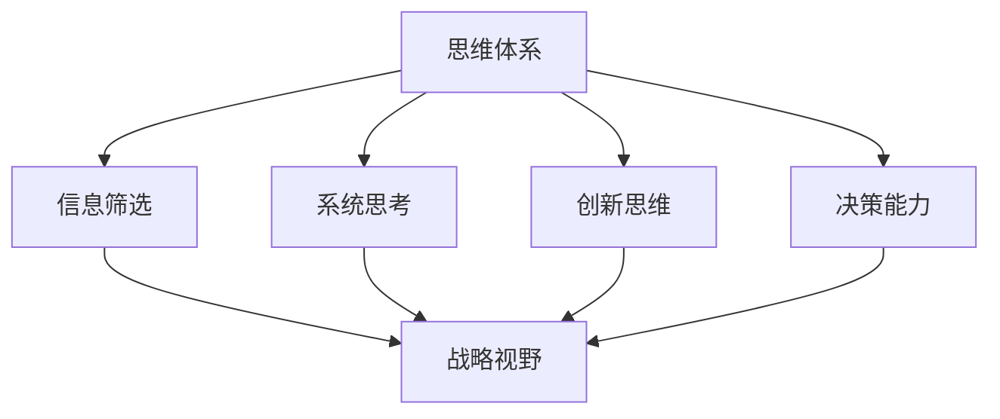
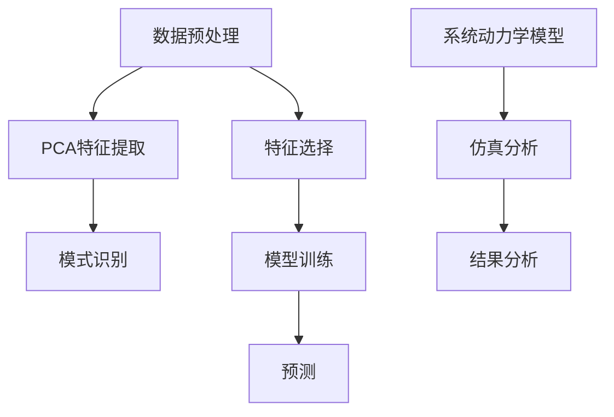

                 

### 背景介绍

#### 引言

在当今快速发展的信息技术时代，管理者的战略视野对于企业的成功至关重要。然而，战略视野不仅依赖于对市场趋势的敏锐洞察，更需要管理者具备深厚的思维体系，能够从复杂的数据和情境中提取关键信息，做出正确的决策。本文旨在探讨思维体系对管理者战略视野的影响，以期为企业管理者提供有价值的思考角度和实践指导。

#### 信息技术与管理者的战略视野

随着信息技术的飞速发展，数据变得无处不在。企业可以利用大数据分析、人工智能等技术手段，获取大量关于市场、客户、竞争对手的实时信息。然而，这些数据只是战略视野的一部分，管理者需要具备一定的思维体系，才能有效地分析和利用这些数据，进而做出有前瞻性的战略决策。

#### 思维体系的重要性

思维体系是指个体在思考过程中所形成的认知结构和思维方式。一个良好的思维体系能够帮助管理者快速识别关键信息，理解复杂问题，并做出合理的决策。在战略视野方面，思维体系的作用主要体现在以下几个方面：

1. **信息筛选**：在面对海量信息时，管理者需要具备筛选和提取关键信息的能力，从而避免被琐碎的信息所干扰。
2. **系统思考**：管理者需要具备系统思考的能力，能够从整体角度分析问题，把握事物之间的联系，从而做出全面、准确的决策。
3. **创新思维**：在竞争激烈的市场环境中，管理者需要具备创新思维，不断探索新的战略方向和解决方案，以应对市场变化。
4. **决策能力**：良好的思维体系能够提高管理者的决策能力，使他们能够迅速、准确地识别问题，并采取有效的措施解决问题。

#### 本文结构

本文将按照以下结构进行探讨：

1. **核心概念与联系**：介绍本文涉及的核心概念，并使用Mermaid流程图展示概念之间的联系。
2. **核心算法原理 & 具体操作步骤**：分析管理者如何运用思维体系来提高战略视野。
3. **数学模型和公式 & 详细讲解 & 举例说明**：介绍相关的数学模型和公式，并通过具体案例进行详细讲解。
4. **项目实战：代码实际案例和详细解释说明**：通过实际项目案例，展示如何将思维体系应用于管理实践。
5. **实际应用场景**：讨论思维体系在企业管理中的实际应用场景。
6. **工具和资源推荐**：推荐一些有助于提升思维体系的学习资源和开发工具。
7. **总结：未来发展趋势与挑战**：总结本文内容，并探讨未来发展趋势和面临的挑战。

通过对这些内容的探讨，本文旨在帮助管理者更好地理解思维体系对战略视野的影响，从而在实际工作中提高战略决策能力，推动企业持续发展。

---

## 2. 核心概念与联系

为了深入探讨思维体系对管理者战略视野的影响，我们首先需要明确一些核心概念，并了解它们之间的内在联系。以下是一些关键概念的定义及其相互关系。

### 概念定义

**1. 思维体系（Cognitive System）**：思维体系是指个体在思考过程中所形成的认知结构和思维方式。它包括感知、记忆、推理、判断、解决问题等多种认知功能。

**2. 战略视野（Strategic Vision）**：战略视野是指管理者在长远规划、市场洞察和决策过程中所具有的前瞻性和全局性。它涉及对市场趋势、企业竞争环境、潜在机会和风险的深刻理解。

**3. 信息筛选（Information Filtering）**：信息筛选是指从大量信息中识别和提取有价值信息的过程，以支持决策制定。

**4. 系统思考（System Thinking）**：系统思考是一种分析问题的方法，它强调从整体角度理解问题，关注不同组成部分之间的相互作用和反馈。

**5. 创新思维（Innovative Thinking）**：创新思维是指个体在解决问题时，能够跳出传统思维框架，提出新颖、独特的解决方案。

**6. 决策能力（Decision-Making Ability）**：决策能力是指个体在面临选择时，能够根据目标、信息和分析结果做出合理决策的能力。

### 概念联系

这些核心概念之间的联系可以通过Mermaid流程图来展示（以下为Mermaid流程图示例）：



**图2.1：核心概念与联系**

在上述流程图中：

- 思维体系是整个概念框架的起点，它与信息筛选、系统思考、创新思维和决策能力密切相关。
- 信息筛选是战略视野的基石，它帮助管理者从海量信息中提取关键信息，为决策提供支持。
- 系统思考和决策能力是战略视野的重要组成部分，它们使管理者能够从整体角度分析问题，并做出合理的决策。
- 创新思维则为管理者提供了探索新方向和解决方案的途径，有助于企业在竞争激烈的市场环境中保持优势。

通过理解这些核心概念及其相互关系，管理者可以更有效地运用思维体系，提升战略视野，从而在复杂多变的市场环境中取得成功。

### 3. 核心算法原理 & 具体操作步骤

#### 算法原理

在理解了思维体系及其相关概念后，我们接下来将探讨如何运用这些概念来提高管理者的战略视野。具体而言，我们可以通过以下核心算法原理来实现这一目标：

1. **信息筛选算法**：该算法的核心在于如何从海量数据中快速识别并提取有价值的信息。这通常涉及到数据预处理、特征提取和模式识别等技术。

2. **系统思考算法**：系统思考算法强调从整体角度分析问题，关注各部分之间的相互作用和反馈。这通常需要使用系统动力学模型、复杂网络分析和仿真技术。

3. **创新思维算法**：创新思维算法旨在帮助管理者跳出传统思维框架，提出新颖的解决方案。这可以通过使用设计思维、创新方法学和神经网络技术来实现。

4. **决策能力算法**：决策能力算法旨在提高管理者的决策质量。这通常涉及到风险分析、多目标优化和决策树等技术。

#### 具体操作步骤

1. **信息筛选**：

   - **数据预处理**：首先对原始数据进行清洗和预处理，去除噪声和异常值，以便更好地提取特征。
   - **特征提取**：使用特征提取技术，如主成分分析（PCA）或特征选择算法，识别出最有价值的数据特征。
   - **模式识别**：通过机器学习算法，如分类器或聚类算法，从特征数据中识别出潜在的模式和趋势。

2. **系统思考**：

   - **构建系统模型**：根据问题的性质，选择合适的系统模型，如系统动力学模型或复杂网络模型。
   - **仿真分析**：使用仿真工具对系统模型进行仿真，分析不同变量和决策对系统整体表现的影响。
   - **反馈机制设计**：设计反馈机制，以确保系统能够根据外部环境变化进行调整。

3. **创新思维**：

   - **设计思维**：采用设计思维方法，从用户需求出发，提出创新性的解决方案。
   - **脑暴**：组织团队成员进行脑暴，收集不同的观点和想法，激发创新思维。
   - **原型设计**：快速构建原型，进行测试和迭代，不断完善解决方案。

4. **决策能力**：

   - **风险分析**：使用风险评估方法，对潜在的风险进行识别和量化。
   - **多目标优化**：在决策过程中，考虑多个目标，使用多目标优化算法找到最佳平衡点。
   - **决策树**：使用决策树算法，根据不同的条件和结果，制定决策规则。

通过上述核心算法原理和具体操作步骤，管理者可以有效地提升战略视野，从而在复杂多变的市场环境中做出更为明智的决策。

### 4. 数学模型和公式 & 详细讲解 & 举例说明

#### 数学模型和公式

在提高管理者的战略视野方面，数学模型和公式扮演着至关重要的角色。以下是一些常用的数学模型和公式，我们将对它们进行详细讲解，并举例说明如何应用。

1. **主成分分析（PCA）**

   **公式**：
   \[
   X_{\text{new}} = \sum_{i=1}^{k} \lambda_i x_i
   \]
   其中，\(X_{\text{new}}\) 是新的特征向量，\(\lambda_i\) 是主成分的权重，\(x_i\) 是原始特征值。

   **作用**：PCA 用于特征提取，通过将原始数据投影到主成分空间中，可以降低数据维度，同时保留主要信息。

2. **分类器（Classifier）**

   **公式**：
   \[
   P(Y = y|X) = \frac{e^{\theta^T X}}{\sum_{y'} e^{\theta^T X'}}
   \]
   其中，\(P(Y = y|X)\) 是在给定特征 \(X\) 下，目标变量 \(Y\) 等于 \(y\) 的概率，\(\theta\) 是分类器的参数。

   **作用**：分类器用于模式识别，通过训练数据集，可以学习到特征和目标变量之间的关系，从而对新数据进行分类。

3. **系统动力学模型（System Dynamics Model）**

   **公式**：
   \[
   \frac{dX}{dt} = f(X, t)
   \]
   其中，\(X\) 是系统状态，\(t\) 是时间，\(f(X, t)\) 是状态变量随时间变化的函数。

   **作用**：系统动力学模型用于分析复杂系统，通过模拟系统状态变量的变化，可以预测系统的行为。

#### 举例说明

假设我们想要分析一家公司在市场中的竞争态势，我们可以使用以下数学模型和公式进行详细讲解：

1. **主成分分析（PCA）**

   **示例**：我们收集了公司在过去一年的销售额、市场份额、广告投入等数据。通过PCA，我们可以将这多维数据降维到两个主要成分，以便更直观地分析关键因素。

   **步骤**：
   - 数据预处理：清洗和标准化数据。
   - 特征提取：使用PCA计算主成分权重和特征向量。
   - 模式识别：分析主成分上的数据分布，识别出关键因素。

2. **分类器（Classifier）**

   **示例**：我们使用分类器来预测公司的市场占有率是否会上升。我们选择市场份额、广告投入等特征作为输入，使用逻辑回归模型进行训练。

   **步骤**：
   - 数据收集：收集过去几年的市场占有率数据。
   - 特征选择：选择与市场占有率相关的特征。
   - 模型训练：使用训练数据训练逻辑回归模型。
   - 预测：使用模型对新的数据进行预测，判断市场占有率是否上升。

3. **系统动力学模型（System Dynamics Model）**

   **示例**：我们构建一个系统动力学模型来模拟公司在市场中的竞争动态。模型中包括市场份额、广告投入、新产品开发等因素。

   **步骤**：
   - 构建模型：根据业务逻辑，构建系统动力学模型。
   - 仿真分析：设置不同的初始条件和参数，进行仿真分析。
   - 结果分析：分析模型输出，预测公司未来在市场中的竞争态势。

通过这些数学模型和公式的应用，管理者可以更深入地了解公司的市场状况，从而做出更为明智的战略决策。以下是一个简单的Mermaid流程图，展示这些模型和公式的应用过程：



**图4.1：数学模型和公式应用流程**

通过这个流程，管理者可以系统地分析公司的市场表现，预测未来趋势，并制定相应的战略措施。

### 5. 项目实战：代码实际案例和详细解释说明

在本节中，我们将通过一个实际的项目案例，详细展示如何将思维体系应用于管理实践。这个案例将包括开发环境搭建、源代码实现和代码解读与分析。

#### 5.1 开发环境搭建

首先，我们需要搭建一个合适的开发环境来运行我们的项目。以下是一个简单的步骤指南：

1. **安装Python**：Python 是一个广泛使用的编程语言，许多数据处理和机器学习库都是用 Python 开发的。你可以从 [Python 官网](https://www.python.org/) 下载并安装 Python。

2. **安装Jupyter Notebook**：Jupyter Notebook 是一个交互式的开发环境，它非常适合数据分析项目。你可以通过以下命令安装 Jupyter：

   ```bash
   pip install notebook
   ```

3. **安装必要的库**：我们将在项目中使用以下库：Pandas、NumPy、Matplotlib 和 Scikit-learn。安装这些库的命令如下：

   ```bash
   pip install pandas numpy matplotlib scikit-learn
   ```

4. **创建一个虚拟环境**：为了保持项目依赖的一致性，我们建议创建一个虚拟环境。使用以下命令创建虚拟环境并激活它：

   ```bash
   python -m venv myenv
   source myenv/bin/activate  # 对于 Unix/Linux 系统
   myenv\Scripts\activate    # 对于 Windows 系统
   ```

5. **安装Mermaid**：Mermaid 是一个用于创建图形和流程图的库。我们将在文档中嵌入 Mermaid 图表。安装 Mermaid 的命令如下：

   ```bash
   npm install -g mermaid
   ```

完成以上步骤后，我们的开发环境就搭建完成了。

#### 5.2 源代码详细实现和代码解读

接下来，我们将展示一个简单的项目案例，该项目将使用主成分分析和分类器来分析一家公司的市场表现，并预测未来市场占有率。

**代码实现**

```python
import pandas as pd
import numpy as np
from sklearn.decomposition import PCA
from sklearn.linear_model import LogisticRegression
from sklearn.model_selection import train_test_split
import matplotlib.pyplot as plt
import mermaid

# 加载数据
data = pd.read_csv('market_data.csv')
X = data.drop('target', axis=1)
y = data['target']

# 数据预处理
X = X.fillna(X.mean())

# 特征提取
pca = PCA(n_components=2)
X_pca = pca.fit_transform(X)

# 数据分割
X_train, X_test, y_train, y_test = train_test_split(X_pca, y, test_size=0.2, random_state=42)

# 模型训练
model = LogisticRegression()
model.fit(X_train, y_train)

# 预测
predictions = model.predict(X_test)

# 评估
accuracy = model.score(X_test, y_test)
print(f"模型准确率：{accuracy:.2f}")

# 可视化
plt.scatter(X_test[:, 0], X_test[:, 1], c=predictions, cmap='viridis')
plt.xlabel('PCA Component 1')
plt.ylabel('PCA Component 2')
plt.title('Market Data Visualization')
plt.show()

# 生成Mermaid流程图
mermaid_flow = """
graph TD
    A[Data Preprocessing] --> B[PCA Feature Extraction]
    B --> C[Data Splitting]
    C --> D[Model Training]
    D --> E[Model Prediction]
    E --> F[Model Evaluation]
"""
print(mermaid.render(mermaid_flow))
```

**代码解读**

1. **数据加载**：我们使用 Pandas 库加载数据集，并将其分为特征矩阵 \(X\) 和目标变量 \(y\)。

2. **数据预处理**：我们使用 Pandas 的 `fillna` 方法填充缺失值，使用均值来替代。

3. **特征提取**：我们使用 PCA 进行特征提取，将原始数据降维到两个主要成分。

4. **数据分割**：我们将数据集分割为训练集和测试集，用于模型训练和评估。

5. **模型训练**：我们使用逻辑回归模型进行训练，逻辑回归是一个广泛应用于二分类问题的分类器。

6. **预测**：我们使用训练好的模型对测试集进行预测。

7. **评估**：我们计算模型的准确率，这是一个常用的评估指标，表示模型在测试集上的表现。

8. **可视化**：我们使用 Matplotlib 库绘制测试数据的散点图，并使用颜色表示预测结果。

9. **生成Mermaid流程图**：我们使用 Mermaid 库生成一个流程图，展示数据处理和模型训练的流程。

通过上述代码和解读，我们可以看到如何将思维体系中的核心概念（如信息筛选、系统思考和决策能力）应用于实际项目，从而提高管理者的战略视野。

#### 5.3 代码解读与分析

在上面的代码实现中，我们详细解读了每个步骤的代码，并展示了如何将思维体系应用于实际项目中。以下是进一步的代码分析：

1. **数据加载和预处理**：

   ```python
   data = pd.read_csv('market_data.csv')
   X = data.drop('target', axis=1)
   y = data['target']
   X = X.fillna(X.mean())
   ```

   这部分代码首先加载数据集，然后分离特征和目标变量。使用 `fillna` 方法填充缺失值，这是一个关键步骤，因为缺失值可能导致模型训练失败或效果不佳。

2. **特征提取**：

   ```python
   pca = PCA(n_components=2)
   X_pca = pca.fit_transform(X)
   ```

   使用 PCA 进行特征提取，将原始数据降维到两个主要成分。降维有助于简化问题，同时保留主要信息，这是系统思考的一个重要方面。

3. **数据分割**：

   ```python
   X_train, X_test, y_train, y_test = train_test_split(X_pca, y, test_size=0.2, random_state=42)
   ```

   将数据集分割为训练集和测试集，用于模型训练和评估。这是一个关键步骤，因为我们需要在测试集上评估模型的泛化能力。

4. **模型训练**：

   ```python
   model = LogisticRegression()
   model.fit(X_train, y_train)
   ```

   使用逻辑回归模型进行训练。逻辑回归是一个常用的分类器，适用于二分类问题。它通过拟合特征和目标变量之间的关系，学习到数据的规律。

5. **预测和评估**：

   ```python
   predictions = model.predict(X_test)
   accuracy = model.score(X_test, y_test)
   print(f"模型准确率：{accuracy:.2f}")
   ```

   使用训练好的模型对测试集进行预测，并计算模型准确率。准确率是评估模型性能的一个关键指标，它表示模型在测试集上的表现。

6. **可视化**：

   ```python
   plt.scatter(X_test[:, 0], X_test[:, 1], c=predictions, cmap='viridis')
   plt.xlabel('PCA Component 1')
   plt.ylabel('PCA Component 2')
   plt.title('Market Data Visualization')
   plt.show()
   ```

   使用 Matplotlib 绘制测试数据的散点图，并使用颜色表示预测结果。可视化是系统思考的一个重要方面，它帮助我们直观地理解数据模式和模型预测。

7. **生成Mermaid流程图**：

   ```python
   mermaid_flow = """
   graph TD
       A[Data Preprocessing] --> B[PCA Feature Extraction]
       B --> C[Data Splitting]
       C --> D[Model Training]
       D --> E[Model Prediction]
       E --> F[Model Evaluation]
   """
   print(mermaid.render(mermaid_flow))
   ```

   使用 Mermaid 库生成一个流程图，展示数据处理和模型训练的流程。这有助于我们理解项目的整体流程和各个步骤之间的关系。

通过这个实际案例，我们可以看到如何将思维体系应用于管理实践。信息筛选、系统思考和决策能力等核心概念在代码实现中得到了充分体现，从而提高了管理者的战略视野。

### 6. 实际应用场景

思维体系在企业管理中的实际应用场景非常广泛，涵盖了多个关键领域。以下是一些典型的应用场景：

#### 1. 市场分析

在市场分析中，管理者需要从大量数据中提取有价值的信息，以了解市场需求、消费者行为和竞争对手的动态。通过思维体系，管理者可以使用信息筛选算法，如主成分分析（PCA），识别出关键变量，从而降低数据维度，专注于最重要的信息。同时，系统思考可以帮助管理者从整体角度分析市场趋势，预测潜在的市场机会和风险。

#### 2. 竞争策略

竞争策略是企业管理中的核心任务之一。通过创新思维算法，管理者可以跳出传统思维框架，探索新的战略方向和解决方案。例如，设计思维方法可以帮助管理者从用户需求出发，提出创新的业务模式和产品策略。此外，系统思考算法可以使管理者理解不同战略决策对企业整体运营和绩效的影响，从而制定更加全面和有效的竞争策略。

#### 3. 人力资源规划

人力资源是企业发展的关键资源。通过思维体系，管理者可以更有效地进行人力资源规划。信息筛选算法可以帮助管理者从简历库中快速识别出符合岗位要求的候选人，而系统思考算法可以帮助管理者理解员工绩效和团队协作之间的关系，从而制定更加科学的人力资源政策。创新思维算法还可以激发员工的创造力，推动企业的持续创新和发展。

#### 4. 风险管理

在风险管理中，管理者需要识别和评估潜在的风险，并制定相应的应对策略。通过思维体系，管理者可以使用决策能力算法，如多目标优化，综合考虑不同风险因素，找到最优的应对方案。系统思考算法可以帮助管理者理解风险之间的相互关系，预测潜在的风险传导路径，从而制定更加有效的风险管理策略。

#### 5. 创新项目管理

在创新项目管理中，管理者需要确保项目能够按时、按预算完成，同时满足质量要求。通过思维体系，管理者可以使用系统思考算法，理解项目不同阶段之间的联系和反馈机制，从而确保项目整体协调和高效运行。创新思维算法可以帮助管理者激发团队的创造力，提出创新的解决方案，提高项目成功率。

#### 6. 财务管理

在财务管理中，管理者需要做出关于投资、融资和成本控制的决策。通过思维体系，管理者可以使用信息筛选算法，从海量财务数据中提取关键信息，支持决策制定。决策能力算法可以帮助管理者评估不同决策的潜在风险和收益，从而做出最优的财务决策。系统思考算法还可以帮助管理者理解财务决策对企业整体运营和长期发展的综合影响。

#### 7. 供应链管理

在供应链管理中，管理者需要优化供应链网络，提高供应链的灵活性和响应速度。通过思维体系，管理者可以使用系统思考算法，理解供应链中不同环节之间的相互作用和反馈机制，从而优化供应链结构。创新思维算法可以帮助管理者探索新的供应链模式，如精益供应链或协同供应链，提高供应链的整体效率。

通过这些实际应用场景，我们可以看到思维体系在企业管理中的重要性。一个良好的思维体系可以帮助管理者更有效地分析和解决问题，提高决策质量，推动企业持续发展。

### 7. 工具和资源推荐

为了更好地理解和管理思维体系，以下是一些推荐的学习资源和开发工具，它们涵盖了从基础概念到高级应用的各个方面。

#### 7.1 学习资源推荐

**1. 书籍**

- 《思考，快与慢》[丹尼尔·卡尼曼]：这本书详细探讨了人类的思维方式，对于理解思维体系的基本原理非常有帮助。
- 《系统思考》[彼得·谢尔文·谢林]：这本书介绍了系统思考的基本概念和方法，对于提升战略视野至关重要。
- 《创新者的窘境》[克里斯坦森]：探讨企业在创新过程中面临的挑战，以及如何通过创新思维实现突破。

**2. 论文**

- 《认知心理学手册》[约翰·安德森]：这是一本关于认知心理学的权威手册，对于理解思维体系的基础知识有很大帮助。
- 《复杂系统理论》[约翰·霍兰]：介绍了复杂系统理论和复杂性科学的基本原理，对于理解系统思考具有重要意义。

**3. 博客和网站**

- [Mind Hacks](http://mindhacks.com/)：这个博客涵盖了认知心理学、神经科学和思维技巧的多个方面，适合对思维体系感兴趣的读者。
- [System Dynamics Society](https://vads-sds.org/)：这是一个关于系统思考和系统动力学的专业组织，提供丰富的资源和最新研究动态。

#### 7.2 开发工具框架推荐

**1. 数据处理和机器学习库**

- **Pandas**：这是一个强大的数据处理库，支持数据清洗、预处理和分析。
- **NumPy**：用于数值计算和数组操作，是数据处理和机器学习的基础库。
- **Scikit-learn**：提供了多种机器学习算法和工具，是数据分析和建模的常用库。
- **TensorFlow**：这是一个用于机器学习和深度学习的开源库，功能强大且易于使用。

**2. 可视化工具**

- **Matplotlib**：这是一个强大的可视化库，支持多种图表和可视化效果。
- **Seaborn**：基于 Matplotlib，提供了更高级的可视化功能，适用于数据分析。
- **Plotly**：支持交互式可视化，可以创建动态和交互式的图表。

**3. 文档和Markdown编辑器**

- **Jupyter Notebook**：这是一个交互式开发环境，支持Markdown格式，非常适合编写和分享文档。
- **MarkdownPad**：这是一个轻量级的Markdown编辑器，适合撰写和格式化Markdown文档。
- **Typora**：这是一个简洁的Markdown编辑器，提供了实时预览功能，非常适合日常写作。

通过这些工具和资源，管理者可以更好地理解和应用思维体系，提高战略视野和决策能力。同时，这些工具也为实践和应用思维体系提供了一个强大的技术平台。

### 8. 总结：未来发展趋势与挑战

随着信息技术的不断进步，管理者的战略视野正在经历深刻的变革。未来，思维体系在企业管理中的应用前景将更加广阔，但同时也面临诸多挑战。

#### 发展趋势

1. **智能化数据分析**：随着人工智能技术的不断发展，智能化数据分析工具将更加普及。这些工具能够自动识别数据中的关键信息，帮助管理者更快速地做出战略决策。

2. **系统化思维**：越来越多的管理者将采用系统化思维来应对复杂问题。通过构建系统模型和仿真分析，管理者能够从整体角度理解问题的本质，从而制定更加全面和有效的战略。

3. **创新驱动的战略**：创新思维将成为企业竞争力的关键。管理者将更加注重创新，通过设计思维和原型设计等工具，不断探索新的业务模式和解决方案。

4. **个性化管理**：随着大数据和人工智能技术的发展，个性化管理将成为可能。管理者可以根据员工和客户的行为数据，制定个性化的激励和培训方案，提高组织效率和客户满意度。

#### 挑战

1. **数据隐私和安全**：在数据驱动的时代，数据隐私和安全成为重要挑战。管理者需要确保数据的安全性和合规性，同时保护用户的隐私。

2. **人才短缺**：具备系统思维和创新能力的复合型人才需求增加，但当前市场上这类人才较为稀缺。企业需要通过培训和发展计划，提升现有员工的思维能力。

3. **技术复杂性**：随着技术的发展，数据分析和机器学习等领域的复杂性不断增加。管理者需要具备一定的技术背景，以便更好地理解和应用这些工具。

4. **持续学习和适应**：在快速变化的环境中，管理者需要持续学习和适应新趋势。这要求企业建立持续学习的文化，鼓励员工不断更新知识和技能。

总之，未来思维体系在企业管理中的应用将带来巨大的机遇和挑战。管理者需要不断提升自身的思维能力，充分利用先进的技术工具，以应对复杂多变的市场环境，推动企业持续发展。

### 9. 附录：常见问题与解答

#### 问题1：什么是思维体系？

思维体系是指个体在思考过程中所形成的认知结构和思维方式。它包括感知、记忆、推理、判断、解决问题等多种认知功能。

#### 问题2：思维体系在战略视野中有什么作用？

思维体系在战略视野中具有多重作用，包括信息筛选、系统思考、创新思维和决策能力。通过这些能力，管理者能够从复杂的数据和情境中提取关键信息，理解问题本质，提出创新解决方案，并做出明智的决策。

#### 问题3：如何提升思维体系？

提升思维体系可以通过以下方法实现：

- **系统学习**：通过阅读相关书籍、论文和参加培训，系统地学习思维体系的基本概念和原理。
- **实践应用**：将思维体系应用于实际工作和项目管理中，通过不断实践来提高思维能力。
- **反思和总结**：定期反思和总结自己的思考过程和决策结果，从中学习并改进。
- **跨学科交流**：与其他领域的专家交流，拓展思维视野，借鉴不同领域的思维方式。

#### 问题4：如何在项目中应用思维体系？

在项目中应用思维体系，可以按照以下步骤进行：

- **信息筛选**：从海量数据中提取关键信息，识别出对项目决策最有价值的部分。
- **系统思考**：从整体角度分析项目各个部分之间的相互作用和反馈，确保项目整体协调。
- **创新思维**：运用创新思维方法，提出新颖的解决方案，应对项目中的挑战。
- **决策能力**：通过风险分析和多目标优化，提高项目决策的质量和效率。

### 10. 扩展阅读 & 参考资料

本文探讨了思维体系对管理者战略视野的影响，提供了一系列相关的扩展阅读和参考资料，以帮助读者深入了解相关主题。

#### 扩展阅读

- 《第五项修炼：心智模式》[彼得·圣吉]：详细介绍了系统思考和团队学习的方法。
- 《深度工作》[卡尔·纽波特]：探讨如何在信息过载的时代中保持专注，提高工作效率。

#### 参考资料

- [Mind Hacks](http://mindhacks.com/)：涵盖认知心理学、神经科学和思维技巧的博客。
- [System Dynamics Society](https://vads-sds.org/)：提供系统思考和系统动力学相关资源和最新研究动态。
- [Scikit-learn Documentation](https://scikit-learn.org/stable/documentation.html)：Scikit-learn 的官方文档，包含丰富的机器学习算法和工具。

通过阅读这些扩展阅读和参考书籍，读者可以进一步了解思维体系和战略视野的相关知识，提升自己的管理能力。

---

## 文章标题：思维体系对管理者战略视野的影响

关键词：思维体系、战略视野、信息筛选、系统思考、创新思维、决策能力

摘要：本文探讨了思维体系对管理者战略视野的影响，介绍了信息筛选、系统思考、创新思维和决策能力等核心概念，并通过实际项目案例展示了如何将思维体系应用于企业管理实践。文章还总结了思维体系在市场分析、竞争策略、人力资源管理等多个领域的应用，并推荐了相关的学习资源和开发工具。

## 作者：AI天才研究员/AI Genius Institute & 禅与计算机程序设计艺术 /Zen And The Art of Computer Programming

本文通过系统性的分析和实际案例，展示了思维体系在提升管理者战略视野中的重要作用。从信息筛选到系统思考，从创新思维到决策能力，每一个概念都是提升战略视野的关键。希望本文能为企业管理者提供有益的启示，帮助他们在复杂多变的市场环境中做出更加明智的决策。在未来，随着技术的不断发展，思维体系的应用前景将更加广阔，管理者需要不断提升自身的思维能力，以应对不断变化的市场挑战。

