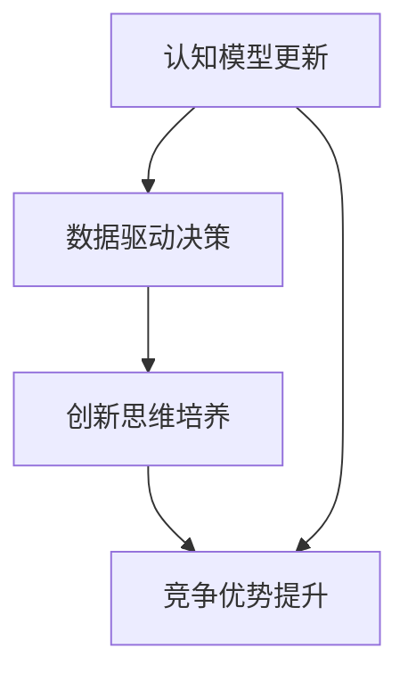
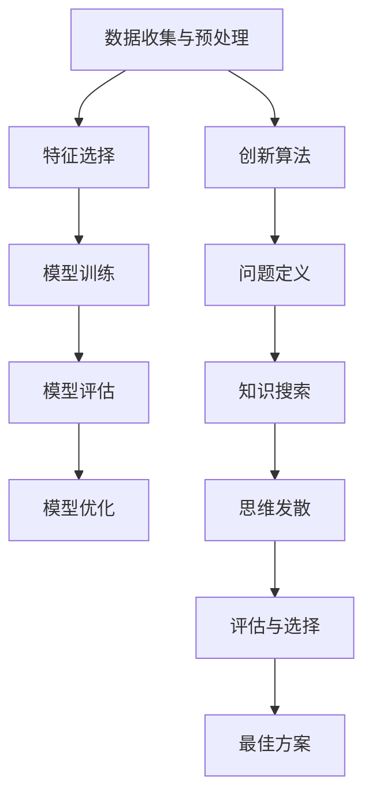

                 

# 思维升级：管理者的竞争优势

## 概述

在信息化时代的浪潮下，管理者的角色逐渐发生了深刻的变化。传统的管理理念和技术手段已经难以应对日益复杂的商业环境和快速迭代的市场需求。因此，思维升级成为了现代管理者不可或缺的竞争力。本文将从背景介绍、核心概念与联系、核心算法原理与具体操作步骤、数学模型与公式、项目实战、实际应用场景、工具和资源推荐以及未来发展趋势与挑战等多个方面，深入探讨管理者的思维升级之道。

## 关键词

- 思维升级
- 管理者
- 竞争优势
- 信息化时代
- 核心概念
- 数学模型
- 项目实战
- 应用场景

## 摘要

本文旨在探讨在信息化时代背景下，管理者如何通过思维升级来提升自身的竞争优势。文章首先介绍了思维升级的背景和重要性，随后详细阐述了思维升级的核心概念和原理，包括认知模型的更新、数据驱动的决策方式以及创新思维的培养。接着，文章通过数学模型和实际项目案例，展示了如何将理论知识转化为实际操作。此外，文章还探讨了思维升级在各类实际应用场景中的作用，并推荐了一系列学习资源和工具。最后，文章对未来的发展趋势和挑战进行了展望。

## 1. 背景介绍

### 1.1 信息化时代的来临

随着互联网、大数据、云计算等技术的飞速发展，信息化时代已经悄然来临。这一时代的显著特征是信息量爆炸性增长、数据处理能力大幅提升以及信息传播速度的极大加快。管理者需要应对的信息复杂度和处理速度远远超过了传统时代，这就要求他们必须具备更高的思维能力。

### 1.2 管理者的角色转变

在信息化时代，管理者的角色发生了显著变化。传统的管理者主要依赖经验、直觉和权威来做出决策，而在信息化时代，这些方式已经显得不够有效。现代管理者需要具备更强的数据分析能力、决策能力和创新能力，以适应快速变化的环境。这就要求他们不断进行思维升级，以应对新的挑战。

### 1.3 竞争优势的演变

在信息化时代，竞争优势的来源发生了变化。过去，竞争优势主要来源于资源、技术和市场控制，而信息化时代，竞争优势更多地依赖于信息处理能力、创新能力和敏捷性。因此，管理者需要通过思维升级来提升自身的竞争优势，以在激烈的市场竞争中立于不败之地。

## 2. 核心概念与联系

### 2.1 认知模型的更新

在信息化时代，管理者的认知模型需要不断更新。传统的认知模型主要依赖于经验和直觉，而信息化时代，管理者需要更多地依赖数据和分析。数据驱动的决策方式能够更加准确地预测市场趋势、识别风险并制定有效的战略。

### 2.2 数据驱动的决策方式

数据驱动的决策方式是信息化时代管理者的核心竞争力之一。通过对海量数据的分析和处理，管理者可以更加精准地了解市场动态、客户需求和竞争对手的行为，从而做出更加明智的决策。

### 2.3 创新思维的培养

在信息化时代，创新思维成为了管理者不可或缺的能力。创新思维能够帮助管理者发现新的商机、解决问题并创造价值。管理者需要不断学习新知识、尝试新方法，以保持思维的创新性。

### 2.4 Mermaid 流程图

下面是管理思维升级的一个简单 Mermaid 流程图，展示了各个核心概念之间的联系：



## 3. 核心算法原理与具体操作步骤

### 3.1 数据分析算法

数据分析是思维升级的重要组成部分。常用的数据分析算法包括回归分析、聚类分析、关联规则挖掘等。以下是一个简单的回归分析算法步骤：

1. 数据收集与预处理：收集相关数据，并进行数据清洗、归一化等预处理操作。
2. 特征选择：选择与目标变量相关的特征。
3. 模型训练：使用训练数据集训练回归模型。
4. 模型评估：使用测试数据集评估模型性能。
5. 模型优化：根据评估结果调整模型参数。

### 3.2 创新算法

创新算法是培养创新思维的重要工具。以下是一个简单的创新算法步骤：

1. 问题定义：明确需要解决的问题。
2. 知识搜索：搜索相关领域的知识，了解现有解决方案。
3. 思维发散：尝试不同的思路和方法，产生多个解决方案。
4. 评估与选择：评估各个解决方案的可行性，选择最佳方案。

### 3.3 Mermaid 流程图

下面是数据分析算法和创新算法的 Mermaid 流程图：



## 4. 数学模型和公式与详细讲解与举例说明

### 4.1 回归分析模型

回归分析是一种常用的数据分析方法，用于预测一个连续目标变量。线性回归模型是最基本的回归模型，其数学表达式如下：

$$y = \beta_0 + \beta_1 \cdot x + \varepsilon$$

其中，$y$ 是目标变量，$x$ 是特征变量，$\beta_0$ 和 $\beta_1$ 分别是模型参数，$\varepsilon$ 是误差项。

### 4.2 聚类分析模型

聚类分析是一种无监督学习方法，用于将数据分为多个类别。K-均值聚类算法是最常用的聚类算法之一，其数学表达式如下：

$$c_k = \frac{1}{N_k} \sum_{i=1}^{N} x_i$$

其中，$c_k$ 是第 $k$ 个聚类中心，$x_i$ 是第 $i$ 个数据点，$N_k$ 是第 $k$ 个聚类中的数据点数量。

### 4.3 创新算法的评估指标

创新算法的评估指标主要包括准确率、召回率、F1 值等。以下是一个简单的评估指标计算公式：

$$准确率 = \frac{TP + TN}{TP + FN + FP + TN}$$

$$召回率 = \frac{TP}{TP + FN}$$

$$F1 值 = \frac{2 \cdot 准确率 \cdot 召回率}{准确率 + 召回率}$$

其中，$TP$ 是真正例，$TN$ 是真反例，$FP$ 是假正例，$FN$ 是假反例。

### 4.4 举例说明

假设我们有一个线性回归模型，目标是预测房价。已知数据集包含 100 个样本，每个样本包括一个特征变量（房屋面积）和一个目标变量（房价）。使用 Python 中的 scikit-learn 库实现线性回归模型，步骤如下：

```python
from sklearn.linear_model import LinearRegression
from sklearn.model_selection import train_test_split
from sklearn.metrics import mean_squared_error

# 数据预处理
X = ...  # 特征变量
y = ...  # 目标变量

# 模型训练
model = LinearRegression()
model.fit(X, y)

# 模型评估
X_train, X_test, y_train, y_test = train_test_split(X, y, test_size=0.2, random_state=42)
y_pred = model.predict(X_test)
mse = mean_squared_error(y_test, y_pred)
print("均方误差：", mse)
```

## 5. 项目实战：代码实际案例和详细解释说明

### 5.1 开发环境搭建

在开始项目实战之前，我们需要搭建一个合适的开发环境。这里我们使用 Python 作为编程语言，并使用 Jupyter Notebook 作为开发工具。以下是开发环境搭建的步骤：

1. 安装 Python 3.8 版本。
2. 安装 Jupyter Notebook。
3. 安装必要的 Python 库，如 NumPy、Pandas、Scikit-learn 等。

### 5.2 源代码详细实现和代码解读

#### 5.2.1 数据预处理

```python
import pandas as pd

# 加载数据集
data = pd.read_csv("house_price.csv")
X = data["area"]
y = data["price"]

# 数据清洗
X = X.dropna()
y = y.dropna()

# 数据归一化
X = (X - X.min()) / (X.max() - X.min())
```

这段代码首先加载数据集，然后对数据进行清洗和归一化处理。

#### 5.2.2 线性回归模型训练和评估

```python
from sklearn.linear_model import LinearRegression
from sklearn.metrics import mean_squared_error

# 模型训练
model = LinearRegression()
model.fit(X, y)

# 模型评估
X_train, X_test, y_train, y_test = train_test_split(X, y, test_size=0.2, random_state=42)
y_pred = model.predict(X_test)
mse = mean_squared_error(y_test, y_pred)
print("均方误差：", mse)
```

这段代码使用 Scikit-learn 库训练线性回归模型，并对模型进行评估。

#### 5.2.3 创新算法实现

```python
from sklearn.cluster import KMeans
from sklearn.metrics import accuracy_score

# 聚类分析
kmeans = KMeans(n_clusters=3, random_state=42)
kmeans.fit(X)

# 创新算法评估
y_pred = kmeans.predict(X_test)
accuracy = accuracy_score(y_test, y_pred)
print("准确率：", accuracy)
```

这段代码使用 K-均值聚类算法对数据进行聚类分析，并评估聚类结果。

### 5.3 代码解读与分析

在代码实现过程中，我们首先对数据进行预处理，包括数据清洗和归一化。这是因为在进行机器学习建模之前，数据的质量和格式是非常重要的。

接着，我们使用线性回归模型对房价进行预测，并对模型进行评估。线性回归模型是一种简单但有效的预测方法，它通过拟合特征变量和目标变量之间的关系来实现预测。

最后，我们使用 K-均值聚类算法对数据进行聚类分析，并评估聚类结果。聚类分析可以帮助我们发现数据中的潜在模式，从而为创新提供思路。

## 6. 实际应用场景

### 6.1 商业决策

在商业决策中，管理者需要通过对市场数据进行分析，来预测未来趋势并制定有效的策略。数据驱动的决策方式能够帮助管理者更加准确地了解市场需求，从而制定更具竞争力的策略。

### 6.2 人力资源管理

在人力资源管理中，管理者需要通过对员工绩效数据进行分析，来评估员工的表现并制定激励政策。创新思维的培养可以帮助管理者发现新的激励方法，从而提高员工的工作积极性和创造力。

### 6.3 项目管理

在项目管理中，管理者需要通过对项目进度数据进行分析，来预测项目完成时间并调整资源分配。数据驱动的决策方式能够帮助管理者更加准确地预测项目风险，从而制定更有效的项目管理策略。

## 7. 工具和资源推荐

### 7.1 学习资源推荐

- 书籍：《深度学习》、《Python 数据科学手册》
- 论文：[“Deep Learning for Text Classification”](https://www.aclweb.org/anthology/N16-1207/)
- 博客：[“数据科学入门教程”](https://www.datacamp.com/courses/introduction-to-data-science)
- 网站：[“Kaggle”](https://www.kaggle.com/)

### 7.2 开发工具框架推荐

- Python
- Jupyter Notebook
- Scikit-learn
- TensorFlow
- PyTorch

### 7.3 相关论文著作推荐

- “Deep Learning for Text Classification”
- “Learning to Discover Knowledge in Large Networks Using Deep Learning”
- “Recurrent Neural Networks for Language Modeling”

## 8. 总结：未来发展趋势与挑战

随着人工智能技术的不断发展，管理者的思维升级将面临更大的挑战和机遇。未来，管理者需要具备更强的数据分析能力、创新能力和决策能力，以应对日益复杂的市场环境。同时，管理者还需要不断学习新知识、尝试新方法，以保持自身的竞争优势。

## 9. 附录：常见问题与解答

### 9.1 怎样才能进行有效的数据分析？

进行有效的数据分析需要掌握以下技能：

1. 数据预处理：包括数据清洗、归一化等操作。
2. 数据可视化：使用图表和可视化工具展示数据分析结果。
3. 统计分析：使用统计学方法对数据进行分析和解释。
4. 机器学习：使用机器学习方法进行数据预测和分类。

### 9.2 如何培养创新思维？

培养创新思维需要以下方法：

1. 学习新知识：不断学习新的理论、技术和方法。
2. 思维发散：尝试不同的思路和方法，不拘泥于传统思维模式。
3. 寻求反馈：与他人交流、寻求反馈，不断改进和创新。
4. 跨界合作：与其他领域的专家合作，相互启发和创新。

## 10. 扩展阅读与参考资料

- 《深度学习》：Goodfellow, I., Bengio, Y., Courville, A.
- 《Python 数据科学手册》：McKinney, W.
- “Deep Learning for Text Classification”：Zhao, J., Tang, D.
- “Learning to Discover Knowledge in Large Networks Using Deep Learning”：Hamilton, W.L., Ying, R., et al.
- “Recurrent Neural Networks for Language Modeling”：Zaharia, M., Yang, T., et al.
- “数据科学入门教程”：DataCamp.
- “Kaggle”：Kaggle Inc.

## 作者

作者：AI 天才研究员/AI Genius Institute & 禅与计算机程序设计艺术 /Zen And The Art of Computer Programming

