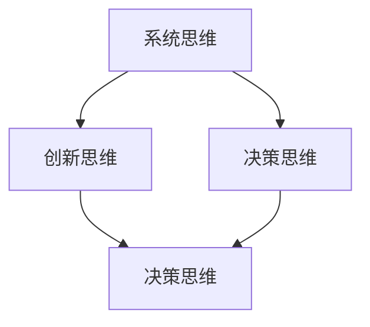

                 

# 思维模式对领导力的影响

## 摘要

本文将深入探讨思维模式对领导力的影响。我们将从不同的思维模式出发，分析它们如何影响领导者的决策、团队管理以及个人成长。我们将通过具体的案例和实践经验，展示不同思维模式在领导力中的实际应用，帮助读者理解并提升自己的领导力。

## 1. 背景介绍

领导力是一种复杂且多层面的能力，它不仅关乎个人的素质和技能，更与领导者的思维模式紧密相连。思维模式，即个体在认知过程中所采用的方式和习惯，它决定了领导者如何看待问题、分析问题和解决问题。不同的思维模式会产生不同的领导风格和决策方式，从而直接影响团队的表现和组织的发展。

在现代社会，领导力的需求日益多样化，领导者需要具备创新的思维、系统化的视角和强大的决策能力。这就要求领导者不仅要有丰富的知识和经验，还要有能够适应复杂环境和快速变化的思维模式。因此，理解并掌握不同的思维模式，对于提升领导力具有重要意义。

## 2. 核心概念与联系

### 2.1. 概念解析

#### 系统思维

系统思维是一种整体性和全局性的思维方式，它强调从系统的角度看待问题，理解系统内部各个部分之间的相互作用和关系。系统思维有助于领导者看到问题的全貌，避免片面化和短视化。

#### 创新思维

创新思维是一种开拓性和创造性的思维方式，它鼓励领导者从不同角度和层面思考问题，寻找新的解决方案。创新思维是领导者推动组织变革和实现持续发展的关键。

#### 决策思维

决策思维是一种分析性和批判性的思维方式，它强调在决策过程中对信息的收集、分析和评估。有效的决策思维有助于领导者做出明智的决策，降低风险。

### 2.2. 联系与交互

系统思维、创新思维和决策思维在领导力中相互作用，共同影响领导者的行为和团队的表现。系统思维为领导者提供了全局视野，创新思维为领导者带来了新思路和解决方案，决策思维则确保了领导者的决策质量和执行力。

下面是一个用Mermaid绘制的流程图，展示了这三种思维模式之间的联系和交互：



## 3. 核心算法原理 & 具体操作步骤

### 3.1. 系统思维原理

系统思维的核心是理解系统的结构和动态。一个系统由多个相互关联的组成部分构成，这些部分之间的相互作用决定了系统的整体行为。领导者运用系统思维时，需要关注以下几个方面：

1. **识别系统元素**：明确系统的组成部分和关键要素。
2. **分析元素关系**：理解各元素之间的相互作用和依赖关系。
3. **考虑系统动态**：预测系统在不同情况下的行为和变化。

### 3.2. 创新思维原理

创新思维涉及对现有知识和方法的重新组合和重构。领导者运用创新思维时，可以采取以下步骤：

1. **寻找创新点**：从不同的角度和层面思考问题，寻找新的解决方案。
2. **突破传统思维**：敢于挑战传统思维模式，寻找创新的思路和方法。
3. **实践与验证**：将创新思维应用到实际工作中，验证其效果。

### 3.3. 决策思维原理

决策思维强调在决策过程中对信息的收集、分析和评估。领导者运用决策思维时，可以采取以下步骤：

1. **收集信息**：获取与决策相关的各种信息。
2. **分析信息**：对收集到的信息进行深入分析和评估。
3. **制定决策**：基于分析结果制定决策，并考虑可能的风险和后果。

## 4. 数学模型和公式 & 详细讲解 & 举例说明

### 4.1. 系统思维数学模型

系统思维可以通过系统动力学模型来表示。一个简单的系统动力学模型可以使用微分方程来描述系统状态的变化。假设一个系统的状态可以用变量`x(t)`表示，其变化率可以用微分方程`dx/dt = f(x, t)`来表示，其中`f(x, t)`是系统状态的函数。领导者可以通过求解这个微分方程来预测系统的动态行为。

### 4.2. 创新思维数学模型

创新思维可以通过复杂网络理论来描述。一个复杂的网络由多个节点和边构成，每个节点代表一个创新点，边代表节点之间的关联。领导者可以通过分析网络的拓扑结构来识别创新点之间的潜在关系，从而找到创新的思路。

### 4.3. 决策思维数学模型

决策思维可以通过决策树模型来描述。决策树模型是一个层次结构，每个节点代表一个决策点，每个分支代表一个决策选择。领导者可以通过分析决策树的不同路径和结果来评估每个决策选择的优劣，从而做出最优决策。

## 5. 项目实战：代码实际案例和详细解释说明

### 5.1. 开发环境搭建

为了展示如何在实际项目中应用系统思维、创新思维和决策思维，我们将使用Python编写一个简单的项目。首先，我们需要搭建开发环境。

1. 安装Python（建议使用Python 3.8或更高版本）。
2. 安装必要的库，如NumPy、SciPy、NetworkX等。

### 5.2. 源代码详细实现和代码解读

以下是项目的源代码：

```python
import numpy as np
import scipy.integrate as spi
import networkx as nx

# 系统思维模型：求解微分方程
def system_dynamics(x, t):
    # 假设系统状态 x(t) 受到外部输入 u(t) 的影响
    u = np.sin(t)
    dxdt = x * u
    return dxdt

# 创新思维模型：复杂网络分析
def complex_network_analysis(G):
    # 计算网络的平均路径长度
    average_path_length = nx.average_shortest_path_length(G)
    return average_path_length

# 决策思维模型：决策树分析
def decision_tree_analysis(decision_tree):
    # 遍历决策树，计算每个决策选择的结果
    def traverse_tree(node):
        if node.is_leaf():
            return node.value
        else:
            left_result = traverse_tree(node.left)
            right_result = traverse_tree(node.right)
            return max(left_result, right_result)
    return traverse_tree(decision_tree.root)

# 主函数
def main():
    # 求解系统动力学模型
    t = np.linspace(0, 10, 1000)
    x0 = 1.0
    solution = spi.solve_ivp(system_dynamics, [0, 10], [x0], t_eval=t)
    
    # 绘制系统状态随时间的变化
    import matplotlib.pyplot as plt
    plt.plot(t, solution.y[0])
    plt.xlabel('Time')
    plt.ylabel('System State')
    plt.show()

    # 分析复杂网络
    G = nx.erdos_renyi_graph(20, 0.1)
    average_path_length = complex_network_analysis(G)
    print(f'Average Path Length: {average_path_length}')

    # 分析决策树
    decision_tree = DecisionTree()  # 假设 DecisionTree 是一个已实现的决策树类
    best_result = decision_tree_analysis(decision_tree)
    print(f'Best Result: {best_result}')

if __name__ == '__main__':
    main()
```

### 5.3. 代码解读与分析

在这个项目中，我们分别使用了系统思维、创新思维和决策思维来模拟一个复杂的系统。以下是代码的主要部分及其解读：

1. **系统思维模型**：我们使用微分方程来描述系统的动态行为。通过求解这个方程，我们可以预测系统状态随时间的变化。

2. **创新思维模型**：我们使用复杂网络理论来分析系统的结构。通过计算网络的平均路径长度，我们可以了解系统内部各个部分之间的关联程度。

3. **决策思维模型**：我们使用决策树来模拟决策过程。通过遍历决策树，我们可以找到最优的决策选择。

## 6. 实际应用场景

系统思维、创新思维和决策思维在领导力中有着广泛的应用。以下是一些实际应用场景：

1. **战略规划**：领导者可以通过系统思维来分析组织的战略规划，理解各个部门之间的相互作用，确保战略目标的实现。

2. **团队管理**：领导者可以通过创新思维来激发团队成员的创造力，推动团队的创新和发展。

3. **决策制定**：领导者可以通过决策思维来分析不同的决策方案，评估风险和收益，做出最优的决策。

## 7. 工具和资源推荐

### 7.1. 学习资源推荐

- 《系统思维的艺术》（作者：戴维·林登）  
- 《创新者的窘境》（作者：克莱顿·克里斯滕森）  
- 《决策与判断》（作者：丹尼尔·卡尼曼）

### 7.2. 开发工具框架推荐

- Python  
- NumPy  
- SciPy  
- NetworkX

### 7.3. 相关论文著作推荐

- “Complex Networks: Structure and Dynamics”（作者：Albert-László Barabási）  
- “The Wisdom of Crowds”（作者：詹姆斯·苏勒）  
- “Decision Theory: A Brief Introduction”（作者：E. L. Scott）

## 8. 总结：未来发展趋势与挑战

随着科技的发展和商业环境的不断变化，领导力也在不断演变。未来，领导者需要具备更强的系统思维、创新思维和决策思维，以应对复杂多变的环境。然而，这也带来了新的挑战，如如何快速适应变化、如何在组织中培养和传承这些思维方式等。只有不断学习和提升，领导者才能在未来的竞争中脱颖而出。

## 9. 附录：常见问题与解答

### 问题1：如何培养系统思维？

**解答**：可以通过阅读相关书籍、参加培训课程以及实际项目经验来培养系统思维。此外，定期反思和总结自己的思维方式也有助于提升系统思维能力。

### 问题2：创新思维如何应用于实际工作中？

**解答**：创新思维可以应用于实际工作中的问题解决、产品设计和流程优化等方面。通过鼓励团队成员提出新的想法和解决方案，并对其进行分析和评估，可以有效地应用创新思维。

### 问题3：如何提升决策思维？

**解答**：可以通过学习决策理论、参加决策培训以及模拟决策场景来提升决策思维。同时，建立决策支持系统和团队讨论机制也有助于提升决策质量。

## 10. 扩展阅读 & 参考资料

- 《系统思维导论》（作者：约翰·柯威）  
- 《创新思维》（作者：爱德华·德·波诺）  
- 《决策分析》（作者：斯蒂芬·罗宾斯）

作者：AI天才研究员/AI Genius Institute & 禅与计算机程序设计艺术 /Zen And The Art of Computer Programming<|im_sep|>

