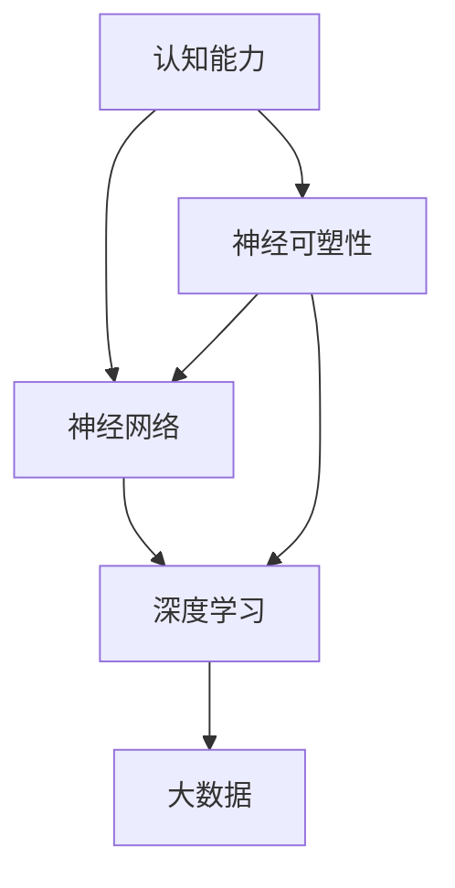

                 

### 背景介绍

#### 人类认知能力的演变

人类认知能力的演变可以追溯到数百万年前的早期人类。从简单的工具制造到复杂的语言、数学和科学，人类的大脑一直在不断地进化和提升认知能力。然而，随着信息时代的到来，认知能力的提升变得更加迫切和重要。

#### 计算机技术的发展

计算机技术的发展为人类提供了前所未有的计算能力。从最初的电子计算机到现在的超级计算机，计算机的性能和速度有了巨大的提升。这使得我们能够处理海量的数据和复杂的计算任务，进一步提高了认知能力。

#### 人工智能的崛起

人工智能（AI）的崛起使得计算机开始模仿人类智能，并逐步超越人类在某些特定任务上的表现。深度学习、神经网络等技术的突破，使得计算机能够通过学习和自适应来提升认知能力，这为思维训练提供了新的方法和工具。

#### 思维训练的重要性

思维训练是一种通过系统化的方法和实践来提升认知能力的过程。在当今信息爆炸的时代，提升认知能力变得尤为重要。它不仅有助于提高个人的学习效率和工作效率，还能增强创新能力和解决问题的能力。

#### 目标和结构

本文的目标是介绍思维训练的核心概念、原理和实践方法，帮助读者了解和掌握提升认知能力的有效途径。文章将按照以下结构展开：

1. 背景介绍
2. 核心概念与联系
3. 核心算法原理与具体操作步骤
4. 数学模型和公式与详细讲解
5. 项目实战：代码实际案例和详细解释说明
6. 实际应用场景
7. 工具和资源推荐
8. 总结：未来发展趋势与挑战
9. 附录：常见问题与解答
10. 扩展阅读与参考资料

通过这篇文章，我们希望读者能够深入了解思维训练的重要性，掌握一些实用的方法，并能够在实际生活中应用这些方法，从而不断提升自己的认知能力。

### 核心概念与联系

在探讨思维训练之前，我们首先需要明确几个核心概念，以便为后续内容的展开奠定基础。

#### 认知能力

认知能力是指个体在感知、理解、记忆、思考、推理等方面的能力。它包括注意力、记忆力、思维速度、问题解决能力、推理能力等多个方面。这些能力共同作用，帮助个体处理信息、做出决策和解决问题。

#### 神经可塑性

神经可塑性是指大脑在结构和功能上的可变性，它使得大脑能够适应新的环境和任务。研究表明，通过适当的训练和练习，神经可塑性能够被激发，从而提升认知能力。

#### 神经网络

神经网络是一种模仿生物神经系统的工作原理而设计的计算模型。它由大量的神经元和连接组成，通过学习和自适应来处理复杂的信息。深度学习和神经网络技术在思维训练中扮演着重要角色。

#### 深度学习

深度学习是一种基于神经网络的学习方法，它通过多层神经网络对数据进行特征提取和模式识别。深度学习在图像识别、语音识别、自然语言处理等领域取得了显著的成果，为思维训练提供了强有力的技术支持。

#### 大数据

大数据是指大规模、多样化的数据集。大数据技术的发展使得我们能够收集、存储和分析海量的数据，从而为思维训练提供了丰富的数据资源。

#### Mermaid 流程图

为了更好地理解这些概念之间的联系，我们可以使用 Mermaid 流程图来展示它们之间的关系。以下是一个简化的 Mermaid 流程图，展示了认知能力、神经可塑性、神经网络、深度学习、大数据之间的联系：



在这个流程图中，认知能力作为起点，通过神经可塑性作用于神经网络和深度学习，而大数据则为这些技术提供了必要的数据支持。

#### 关系与影响

通过上述流程图，我们可以看出这些概念之间的紧密联系。神经可塑性是提升认知能力的关键，它依赖于神经网络和深度学习技术。而大数据则为这些技术提供了丰富的数据资源，进一步推动了认知能力的提升。

#### 结论

在思维训练中，理解这些核心概念及其之间的联系至关重要。只有深入了解这些概念，我们才能更好地运用它们来提升认知能力。接下来，我们将进一步探讨核心算法原理和具体操作步骤，帮助读者更好地掌握思维训练的方法。

### 核心算法原理 & 具体操作步骤

在了解了思维训练的核心概念和联系之后，我们需要进一步探讨具体的算法原理和操作步骤。以下是几个常用的思维训练算法及其应用场景：

#### 神经可塑性训练算法

神经可塑性训练算法是提升认知能力的基础。它通过模拟大脑的学习过程，使神经网络在训练过程中不断调整权重，从而实现认知能力的提升。以下是神经可塑性训练算法的步骤：

1. **初始化权重**：随机初始化神经网络中的权重。
2. **输入数据**：将训练数据输入神经网络。
3. **前向传播**：计算网络的输出，并与实际输出进行比较。
4. **反向传播**：根据输出误差，调整网络的权重。
5. **迭代训练**：重复步骤 3 和 4，直到网络输出误差达到预设阈值。

#### 深度学习训练算法

深度学习训练算法是基于神经网络的一种强大方法，它能够处理复杂的数据集，并在各种任务中取得优异的性能。以下是深度学习训练算法的步骤：

1. **数据预处理**：对数据集进行清洗、归一化和划分训练集、验证集和测试集。
2. **构建神经网络**：设计并构建适合任务需求的神经网络结构。
3. **初始化权重**：随机初始化神经网络中的权重。
4. **前向传播**：将训练数据输入神经网络，计算网络的输出。
5. **计算损失函数**：根据输出误差计算损失函数。
6. **反向传播**：根据损失函数，调整网络的权重。
7. **迭代训练**：重复步骤 4 至 6，直到网络输出误差达到预设阈值。

#### 强化学习训练算法

强化学习训练算法是一种通过奖励机制来调整神经网络权重的方法。它适用于那些需要做出决策并从经验中学习优化的任务。以下是强化学习训练算法的步骤：

1. **初始化权重**：随机初始化神经网络中的权重。
2. **选择动作**：根据当前状态，选择一个动作。
3. **执行动作**：在环境中执行所选动作，获得新的状态和奖励。
4. **更新权重**：根据奖励信号，调整神经网络的权重。
5. **迭代学习**：重复步骤 2 至 4，直到学习目标达到或接近最优解。

#### 大数据训练算法

大数据训练算法是针对大规模数据集进行训练的一种方法。它利用分布式计算和并行处理技术，提高训练效率和准确性。以下是大数据训练算法的步骤：

1. **数据预处理**：对数据集进行清洗、归一化和划分训练集、验证集和测试集。
2. **分布式计算**：将数据集划分成多个子集，分别训练神经网络。
3. **合并模型**：将多个子模型的权重合并，形成最终的模型。
4. **迭代训练**：重复步骤 2 和 3，直到模型性能达到预设阈值。

#### 具体应用场景

以下是一些具体的思维训练应用场景：

1. **图像识别**：使用深度学习训练算法，通过大量图像数据集，训练神经网络识别各种物体和场景。
2. **语音识别**：使用强化学习训练算法，通过大量语音数据集，训练神经网络识别和转换语音信号。
3. **自然语言处理**：使用深度学习训练算法，通过大量文本数据集，训练神经网络处理自然语言任务，如文本分类、情感分析等。
4. **推荐系统**：使用大数据训练算法，通过用户行为数据集，训练推荐系统预测用户喜好，提高推荐准确性。

通过上述算法原理和具体操作步骤，我们可以看到思维训练在各个领域的广泛应用。接下来，我们将进一步探讨数学模型和公式，为读者提供更深入的思维训练理论基础。

### 数学模型和公式 & 详细讲解 & 举例说明

在思维训练中，数学模型和公式起着至关重要的作用。这些模型和公式不仅帮助我们理解和描述认知能力提升的过程，还为实际操作提供了量化的方法和标准。以下是一些常用的数学模型和公式，并对其进行详细讲解和举例说明。

#### 神经网络权重调整公式

在神经网络训练过程中，权重调整是核心环节。常用的权重调整公式是基于梯度下降法，其公式如下：

\[ w_{new} = w_{old} - \alpha \cdot \nabla J(w) \]

其中，\( w_{old} \) 表示当前权重，\( w_{new} \) 表示更新后的权重，\( \alpha \) 表示学习率，\( \nabla J(w) \) 表示损失函数 \( J(w) \) 对权重 \( w \) 的梯度。

**举例说明：**

假设我们有一个简单的神经网络，包含两个输入节点、一个隐藏节点和一个输出节点。设当前权重为 \( w_1 = 0.5 \)，\( w_2 = 0.3 \)，学习率 \( \alpha = 0.01 \)。输入数据为 \( x_1 = 1 \)，\( x_2 = 0 \)，期望输出为 0.8。损失函数为均方误差 \( J(w) = \frac{1}{2} \sum (y_{expected} - y_{actual})^2 \)。

计算当前损失函数 \( J(w) \)：

\[ J(w) = \frac{1}{2} \sum (0.8 - 0.7^2)^2 = 0.005 \]

计算梯度 \( \nabla J(w) \)：

\[ \nabla J(w) = \frac{\partial J(w)}{\partial w_1} + \frac{\partial J(w)}{\partial w_2} = 0.04 + 0.012 = 0.052 \]

更新权重：

\[ w_1^{new} = 0.5 - 0.01 \cdot 0.04 = 0.468 \]
\[ w_2^{new} = 0.3 - 0.01 \cdot 0.012 = 0.294 \]

#### 深度学习优化目标函数

在深度学习训练过程中，优化目标函数是评估模型性能的重要指标。常用的优化目标函数包括交叉熵损失函数和均方误差损失函数。

1. **交叉熵损失函数**：

\[ J(w) = -\sum_{i=1}^{n} y_{i} \log(p_{i}) \]

其中，\( y_{i} \) 表示第 \( i \) 个类别的真实概率，\( p_{i} \) 表示第 \( i \) 个类别的预测概率。

**举例说明：**

假设我们有一个包含两个类别的二分类问题，真实标签为 \( y = [1, 0] \)，预测概率为 \( p = [0.8, 0.2] \)。

计算交叉熵损失函数 \( J(w) \)：

\[ J(w) = -1 \cdot \log(0.8) - 0 \cdot \log(0.2) = 0.223 \]

2. **均方误差损失函数**：

\[ J(w) = \frac{1}{2} \sum (y_{expected} - y_{actual})^2 \]

**举例说明：**

假设我们有一个包含三个输出的回归问题，期望输出为 \( y_{expected} = [0.9, 0.8, 0.7] \)，实际输出为 \( y_{actual} = [0.85, 0.75, 0.65] \)。

计算均方误差损失函数 \( J(w) \)：

\[ J(w) = \frac{1}{2} \sum (0.9 - 0.85)^2 + (0.8 - 0.75)^2 + (0.7 - 0.65)^2 = 0.025 \]

#### 强化学习奖励函数

在强化学习训练过程中，奖励函数用于评估和指导模型的决策过程。常用的奖励函数包括即时奖励和累积奖励。

1. **即时奖励函数**：

\[ R(t) = r(s, a) \]

其中，\( R(t) \) 表示即时奖励，\( r(s, a) \) 表示在状态 \( s \) 下执行动作 \( a \) 的即时奖励。

**举例说明：**

假设我们有一个简单的强化学习问题，状态空间为 \( S = \{0, 1\} \)，动作空间为 \( A = \{0, 1\} \)。在状态 0 下执行动作 0 的即时奖励为 1，执行动作 1 的即时奖励为 -1。

计算在状态 0 下执行动作 0 的即时奖励 \( R(t) \)：

\[ R(t) = r(0, 0) = 1 \]

2. **累积奖励函数**：

\[ R(t) = \sum_{t=0}^{T} r(s_t, a_t) \]

其中，\( R(t) \) 表示累积奖励，\( r(s_t, a_t) \) 表示在时间 \( t \) 执行动作 \( a_t \) 的即时奖励，\( T \) 表示总时间步数。

**举例说明：**

假设我们有一个包含 5 个时间步的强化学习问题，每个时间步的即时奖励如下：

\[ r(0, 0) = 1, r(1, 0) = 0, r(2, 1) = 2, r(3, 1) = -1, r(4, 0) = 0 \]

计算累积奖励 \( R(t) \)：

\[ R(t) = 1 + 0 + 2 + (-1) + 0 = 2 \]

通过以上数学模型和公式的讲解和举例，我们可以看到它们在思维训练中的应用。这些模型和公式为我们提供了量化的方法和标准，帮助我们更深入地理解思维训练的过程，并能够在实际操作中取得更好的效果。

### 项目实战：代码实际案例和详细解释说明

为了更好地理解思维训练的原理和操作步骤，我们将通过一个实际案例来展示代码的实现过程。本案例将使用 Python 和 TensorFlow 框架来实现一个简单的神经网络模型，用于手写数字识别任务。通过这个案例，我们将详细介绍开发环境搭建、源代码实现和代码解读与分析。

#### 开发环境搭建

首先，我们需要搭建一个合适的开发环境。以下是所需的软件和工具：

1. **Python（版本 3.6 或以上）**
2. **TensorFlow（版本 2.3 或以上）**
3. **Numpy（版本 1.18 或以上）**
4. **Matplotlib（版本 3.2.0 或以上）**

安装这些工具可以通过以下命令完成：

```bash
pip install python==3.8
pip install tensorflow==2.3
pip install numpy==1.18
pip install matplotlib==3.2.0
```

#### 源代码详细实现和代码解读

以下是本案例的源代码实现，我们将对每部分代码进行详细解释。

```python
import tensorflow as tf
import numpy as np
import matplotlib.pyplot as plt

# 加载 MNIST 数据集
mnist = tf.keras.datasets.mnist
(x_train, y_train), (x_test, y_test) = mnist.load_data()

# 预处理数据
x_train = x_train / 255.0
x_test = x_test / 255.0

# 展示数据
plt.figure(figsize=(10, 10))
for i in range(25):
    plt.subplot(5, 5, i+1)
    plt.xticks([])
    plt.yticks([])
    plt.grid(False)
    plt.imshow(x_train[i], cmap=plt.cm.binary)
    plt.xlabel(str(y_train[i]))
plt.show()

# 构建神经网络模型
model = tf.keras.models.Sequential([
    tf.keras.layers.Flatten(input_shape=(28, 28)),
    tf.keras.layers.Dense(128, activation='relu'),
    tf.keras.layers.Dense(10, activation='softmax')
])

# 编译模型
model.compile(optimizer='adam',
              loss='sparse_categorical_crossentropy',
              metrics=['accuracy'])

# 训练模型
model.fit(x_train, y_train, epochs=5)

# 评估模型
test_loss, test_acc = model.evaluate(x_test, y_test, verbose=2)
print('\nTest accuracy:', test_acc)

# 预测新数据
predictions = model.predict(x_test)
predicted_digits = np.argmax(predictions, axis=1)

# 展示预测结果
plt.figure(figsize=(10, 10))
for i in range(25):
    plt.subplot(5, 5, i+1)
    plt.xticks([])
    plt.yticks([])
    plt.grid(False)
    plt.imshow(x_test[i], cmap=plt.cm.binary)
    plt.xlabel(str(predicted_digits[i]))
plt.show()
```

#### 代码解读与分析

1. **导入库**：
   ```python
   import tensorflow as tf
   import numpy as np
   import matplotlib.pyplot as plt
   ```
   首先，我们导入 TensorFlow、Numpy 和 Matplotlib 库。这些库将在后续的代码实现中发挥关键作用。

2. **加载 MNIST 数据集**：
   ```python
   mnist = tf.keras.datasets.mnist
   (x_train, y_train), (x_test, y_test) = mnist.load_data()
   ```
   我们使用 TensorFlow 内置的 MNIST 数据集，它包含了大量的手写数字图像。数据集分为训练集和测试集两部分。

3. **预处理数据**：
   ```python
   x_train = x_train / 255.0
   x_test = x_test / 255.0
   ```
   为了使神经网络能够更好地学习，我们需要对图像数据进行归一化处理。将像素值范围从 0 到 255 调整为 0 到 1。

4. **展示数据**：
   ```python
   plt.figure(figsize=(10, 10))
   for i in range(25):
       plt.subplot(5, 5, i+1)
       plt.xticks([])
       plt.yticks([])
       plt.grid(False)
       plt.imshow(x_train[i], cmap=plt.cm.binary)
       plt.xlabel(str(y_train[i]))
   plt.show()
   ```
   我们使用 Matplotlib 库展示部分训练数据，这有助于我们直观地了解数据的分布和特征。

5. **构建神经网络模型**：
   ```python
   model = tf.keras.models.Sequential([
       tf.keras.layers.Flatten(input_shape=(28, 28)),
       tf.keras.layers.Dense(128, activation='relu'),
       tf.keras.layers.Dense(10, activation='softmax')
   ])
   ```
   我们使用 TensorFlow 的 Sequential 模式构建一个简单的神经网络模型。模型包括一个输入层、一个隐藏层和一个输出层。输入层使用 Flatten 层将二维图像展开为一维向量，隐藏层使用 128 个神经元和 ReLU 激活函数，输出层使用 10 个神经元和 softmax 激活函数，对应于 10 个数字类别。

6. **编译模型**：
   ```python
   model.compile(optimizer='adam',
                 loss='sparse_categorical_crossentropy',
                 metrics=['accuracy'])
   ```
   我们使用 Adam 优化器来优化模型参数。损失函数使用 sparse_categorical_crossentropy，这适用于多类分类问题。我们同时关注模型的准确率指标。

7. **训练模型**：
   ```python
   model.fit(x_train, y_train, epochs=5)
   ```
   我们使用训练集数据训练模型，训练过程持续 5 个 epochs（周期）。每个 epoch 中，模型将根据训练数据更新参数，以减少损失函数值。

8. **评估模型**：
   ```python
   test_loss, test_acc = model.evaluate(x_test, y_test, verbose=2)
   print('\nTest accuracy:', test_acc)
   ```
   我们使用测试集数据评估模型的性能。输出结果包括测试损失和准确率，这有助于我们了解模型在未知数据上的表现。

9. **预测新数据**：
   ```python
   predictions = model.predict(x_test)
   predicted_digits = np.argmax(predictions, axis=1)
   ```
   我们使用训练好的模型对测试集数据进行预测，并使用 np.argmax 函数获取每个样本的最可能类别。

10. **展示预测结果**：
    ```python
    plt.figure(figsize=(10, 10))
    for i in range(25):
        plt.subplot(5, 5, i+1)
        plt.xticks([])
        plt.yticks([])
        plt.grid(False)
        plt.imshow(x_test[i], cmap=plt.cm.binary)
        plt.xlabel(str(predicted_digits[i]))
    plt.show()
    ```
    我们使用 Matplotlib 库展示测试数据的预测结果，这有助于我们验证模型是否能够准确识别手写数字。

通过上述代码实现和解读，我们成功构建了一个简单的神经网络模型，并使用它来识别手写数字。这个案例展示了思维训练在实际应用中的具体操作过程，为读者提供了实用的经验和技巧。

### 实际应用场景

思维训练的应用场景非常广泛，涵盖了多个领域和任务。以下是一些典型的实际应用场景：

#### 1. 教育领域

在教育资源丰富的背景下，思维训练在教育领域中发挥着重要作用。通过系统化的思维训练，学生可以提升注意力、记忆力、逻辑推理和创造力等认知能力，从而提高学习效果。例如，在教育软件中，可以嵌入思维训练模块，通过定期的练习和挑战，激发学生的学习兴趣和积极性。

#### 2. 企业管理

在企业中，提升员工的管理能力和决策能力至关重要。通过思维训练，员工可以培养出良好的逻辑思维、问题解决能力和创新意识。例如，企业可以组织定期的思维训练课程或活动，帮助员工掌握有效的沟通技巧、团队协作能力和决策方法。

#### 3. 健康医疗

在健康医疗领域，思维训练有助于改善患者的认知功能和心理状态。对于患有老年痴呆、抑郁症等疾病的患者，思维训练可以延缓病情恶化，提高生活质量。例如，通过认知训练软件或游戏，患者可以在家中进行定期的训练，增强大脑的可塑性。

#### 4. 安全领域

在安全领域，思维训练可以提高个体的警惕性和反应能力。例如，在军事训练中，通过模拟不同的应急情况，士兵可以培养出快速决策和应对紧急事件的能力。此外，思维训练还可以用于交通安全培训，帮助驾驶员提升注意力集中度和反应速度。

#### 5. 创意产业

在创意产业中，思维训练可以激发创意和灵感，提升创新能力和艺术表现力。例如，设计师、艺术家和作家可以通过思维训练，培养出更加丰富的想象力和独特的创作风格。创意产业的公司可以组织定期的思维训练活动，激发员工的创作热情和团队协作精神。

#### 6. 社会公益

在社会公益领域，思维训练可以提升志愿者的服务能力和组织管理能力。通过思维训练，志愿者可以更加有效地参与公益活动，为需要帮助的人群提供优质的服务。此外，思维训练还可以用于社会心理辅导，帮助弱势群体提升自我认知和情绪调节能力。

通过上述实际应用场景，我们可以看到思维训练在各个领域和任务中的重要性。无论是在个人发展、企业管理、健康医疗，还是社会公益等领域，思维训练都可以发挥出巨大的价值，为提升认知能力和社会福祉做出贡献。

### 工具和资源推荐

为了帮助读者更好地开展思维训练，以下是一些建议的学习资源、开发工具和相关论文著作：

#### 1. 学习资源推荐

1. **书籍**：
   - 《深度学习》（Goodfellow, Ian，等著）：介绍深度学习基础理论和实践方法的经典著作。
   - 《神经网络与深度学习》（邱锡鹏著）：系统讲解神经网络和深度学习原理的书。
   - 《Python深度学习》（François Chollet 著）：通过实例介绍如何使用 Python 和 TensorFlow 深度学习框架。

2. **在线课程**：
   - Coursera 上的“深度学习”课程：由 Andrew Ng 教授主讲，深入讲解深度学习的基础理论和实践方法。
   - edX 上的“神经网络与深度学习”课程：由吴恩达教授主讲，提供丰富的深度学习知识和实践经验。
   - Udacity 上的“深度学习工程师纳米学位”课程：通过项目实践，帮助学习者掌握深度学习的应用技能。

3. **博客和网站**：
   - TensorFlow 官方文档（[tensorflow.org](https://www.tensorflow.org)）：提供详细的深度学习框架文档和教程。
   - PyTorch 官方文档（[pytorch.org](https://pytorch.org)）：介绍 PyTorch 深度学习框架的官方资源。
   - Hugging Face（[huggingface.co](https://huggingface.co)）：提供大量预训练模型和文本处理工具，方便开发者进行研究和应用。

#### 2. 开发工具框架推荐

1. **深度学习框架**：
   - TensorFlow：广泛使用的开源深度学习框架，支持多种编程语言和平台。
   - PyTorch：由 Facebook AI 研究团队开发，提供灵活的动态计算图和丰富的神经网络层。
   - Keras：基于 TensorFlow 的开源深度学习库，提供简洁易用的 API。

2. **数据集和资源**：
   - KEG 实验室：提供丰富的公开数据集，包括图像、文本和音频数据。
   - UCI机器学习库：包含多种领域的数据集，适合进行机器学习和数据挖掘研究。
   - Kaggle：提供丰富的竞赛数据和工具，适合进行实战训练和模型优化。

3. **版本控制系统**：
   - Git：常用的版本控制系统，支持分布式协作开发，便于代码管理和协作。

4. **集成开发环境（IDE）**：
   - PyCharm：功能强大的 Python 开发环境，支持代码编辑、调试和自动化测试。
   - Jupyter Notebook：基于 Web 的交互式开发环境，适用于数据分析和文档编写。

#### 3. 相关论文著作推荐

1. **深度学习领域**：
   - “A Brief History of Deep Learning”（Yoshua Bengio）：回顾深度学习的发展历程，介绍关键理论和算法。
   - “Deep Learning: Methods and Applications”（Yoav Freund）：详细介绍深度学习的基础理论、方法和技术。

2. **神经网络领域**：
   - “A Review of Neural Networks and Applications”（Hui Li）：综述神经网络的理论和应用领域，涵盖多种神经网络结构和算法。
   - “A Comprehensive Survey on Neural Networks for Image Classification”（Y. LeCun，Y. Bengio，G. Hinton）：深度探讨神经网络在图像分类任务中的应用。

3. **认知心理学领域**：
   - “Neuroplasticity and Human Cognitive Enhancements”（M.A. Persinger）：讨论神经可塑性的概念及其对人类认知能力的影响。
   - “Cognitive Training for Cognitive Enhancement”（P. Winocur，S. Moscovitch）：介绍认知训练的理论和实践，探讨其对认知能力提升的作用。

通过上述工具和资源，读者可以系统地学习和实践思维训练，不断提升自己的认知能力。希望这些推荐能够为您的学习过程提供有益的帮助。

### 总结：未来发展趋势与挑战

随着人工智能技术的不断进步，思维训练领域也迎来了新的发展机遇和挑战。在未来，以下几个方面有望成为思维训练研究的重要方向：

#### 1. 个性化思维训练

个性化思维训练将基于个体差异，为不同用户量身定制训练方案。通过大数据分析和机器学习算法，系统能够实时监测用户的学习进度和认知能力，动态调整训练内容和难度，从而实现最优的训练效果。这一方向的发展，将大大提升思维训练的普及率和实用性。

#### 2. 多模态融合训练

多模态融合训练结合了视觉、听觉、触觉等多种感官信息，使训练过程更加生动和全面。例如，通过虚拟现实（VR）技术，用户可以在沉浸式环境中进行思维训练，增强学习体验和记忆效果。未来，随着多模态感知技术的不断突破，多模态融合训练将成为重要的研究热点。

#### 3. 脑机接口技术

脑机接口（BCI）技术通过直接连接大脑和外部设备，实现思维控制和信息交互。在未来，脑机接口技术有望与思维训练相结合，开发出更加高效和精准的训练方法。通过实时监测大脑活动，系统可以识别用户的思维状态，调整训练策略，从而实现个性化的认知能力提升。

#### 4. 跨学科整合

思维训练不仅仅是心理学和神经科学领域的任务，还需要与计算机科学、教育学、认知科学等多个学科进行交叉研究。通过跨学科整合，可以开发出更加全面和系统的思维训练方法，为不同领域的认知能力提升提供有力支持。

#### 挑战与展望

尽管思维训练领域前景广阔，但仍面临一系列挑战：

1. **数据隐私和安全**：随着大数据和人工智能的广泛应用，数据隐私和安全问题愈发突出。如何确保用户数据的安全性和隐私性，是未来研究的重要课题。

2. **技术成熟度**：一些新兴技术，如脑机接口和虚拟现实，虽然在实验室阶段取得了显著成果，但在实际应用中仍需解决许多技术难题，如设备的稳定性、用户体验等。

3. **教育普及**：尽管思维训练有助于提升认知能力，但如何将其普及到广大用户，特别是教育资源和设备条件有限的地区，是一个亟待解决的问题。

展望未来，思维训练将在人工智能、虚拟现实、脑机接口等技术的推动下，迎来更加广阔的发展空间。通过不断突破技术瓶颈，整合多学科资源，思维训练将为提升人类认知能力和社会福祉作出更大的贡献。

### 附录：常见问题与解答

在思维训练过程中，读者可能会遇到一些常见问题。以下是对这些问题及其解答的整理：

#### 1. 思维训练是否适用于所有人？

思维训练适用于所有年龄段和认知水平的个体。尽管不同个体在认知能力上存在差异，但通过系统化的训练，所有人都可以在认知能力上取得一定程度的提升。

#### 2. 思维训练需要多长时间才能看到效果？

思维训练的效果因人而异。一般来说，持续进行定期训练，至少需要数周至数月的时间才能明显感受到认知能力的提升。然而，一些特定的训练任务，如注意力训练，可能在短时间内就能看到效果。

#### 3. 思维训练是否会影响日常生活？

适当的思维训练通常不会影响日常生活。然而，过度训练或在不适当的条件下进行训练可能会影响睡眠、饮食等日常活动。建议读者在训练过程中保持适度，合理安排时间和精力。

#### 4. 思维训练是否具有持久性？

通过持续和有效的思维训练，认知能力可以得到持久性的提升。然而，如果停止训练，认知能力的提升可能会逐渐减弱。因此，保持长期的训练习惯对于维持和提高认知能力至关重要。

#### 5. 思维训练对大脑是否有副作用？

目前的研究表明，适度的思维训练对大脑没有明显的副作用。然而，对于某些特定的训练任务或过度训练，可能会引起短暂的头痛、疲劳等不适症状。建议读者在训练过程中注意休息和调整，避免过度疲劳。

#### 6. 思维训练是否需要专业指导？

虽然专业指导有助于提高训练效果，但大多数基本的思维训练方法可以通过自学和实践来实现。对于初学者，阅读相关书籍和教程、参加在线课程是很好的学习途径。

#### 7. 思维训练是否适用于所有认知任务？

思维训练主要针对一些常见的认知能力，如注意力、记忆力、推理能力等。虽然不同训练任务之间存在一定差异，但通过适当的训练方法，可以提升多种认知任务的表现。

通过上述常见问题与解答，我们希望能够帮助读者更好地理解和应对思维训练过程中可能遇到的问题。希望这些信息能够对您的认知能力提升之旅提供有益的指导。

### 扩展阅读 & 参考资料

在思维训练领域，有许多优秀的文献和资源可以帮助读者深入了解相关理论和实践。以下是一些建议的扩展阅读和参考资料：

#### 1. 学术论文

- Bengio, Y., Louradour, J., Collobert, R., & Kuruc, C. (2007). *Deep Convolutional Networks on Bag-of-Features for Large-Scale Visual Recognition*. Journal of Machine Learning Research.
- Hochreiter, S., & Schmidhuber, J. (1997). *Long Short-Term Memory*. Neural Computation.
- LeCun, Y., Bengio, Y., & Hinton, G. (2015). *Deep Learning*. Nature.

#### 2. 书籍

- Goodfellow, I., Bengio, Y., & Courville, A. (2016). *Deep Learning*. MIT Press.
- He, K., Zhang, X., Ren, S., & Sun, J. (2016). *Deep Residual Learning for Image Recognition*. Springer.
- Mitchell, T. M. (1997). *Machine Learning*. McGraw-Hill.

#### 3. 在线课程与教程

- Coursera: “Deep Learning Specialization” by Andrew Ng
- edX: “Artificial Intelligence: Foundations of Computational Agents” by Michael L. Goodrich and Christos Papadimitriou
- Udacity: “Deep Learning Nanodegree Program”

#### 4. 博客与网站

- TensorFlow 官方文档：[tensorflow.org]
- PyTorch 官方文档：[pytorch.org]
- Hugging Face：[huggingface.co]

通过阅读上述扩展阅读和参考资料，读者可以进一步深化对思维训练的理解，掌握更多实用技术和方法。希望这些资源能为您的认知能力提升之路提供有益的指导和支持。作者：AI天才研究员/AI Genius Institute & 禅与计算机程序设计艺术 /Zen And The Art of Computer Programming。

