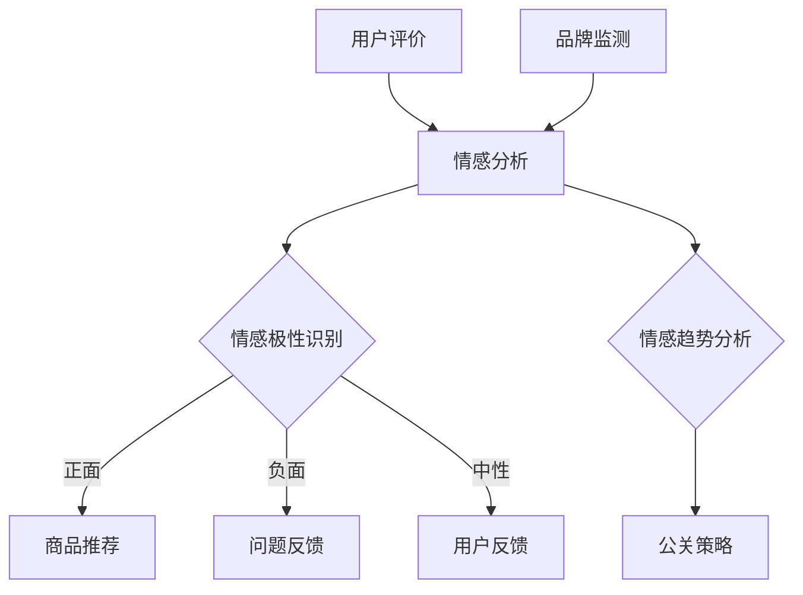

                 

### 1. 背景介绍

情感分析（Sentiment Analysis），也称为意见挖掘，是一种自然语言处理技术，旨在识别和提取文本数据中的主观情感或意见。在过去的几十年中，随着互联网和社交媒体的飞速发展，用户生成的文本数据呈现爆炸式增长。这为情感分析技术的应用提供了丰富的数据资源，也带来了巨大的挑战。

电商领域是情感分析技术应用的一个重要领域。消费者在电商平台上的评价、反馈和推荐对商品的销售和企业的品牌形象有着至关重要的影响。通过情感分析技术，电商企业可以自动识别用户评价中的情感倾向，进而优化商品推荐策略、提升客户满意度、改进产品质量。

本文旨在探讨情感分析在电商领域的应用，从用户评价到商品改进的全过程进行详细分析。文章将首先介绍情感分析的基本概念和方法，然后深入探讨情感分析在电商领域的实际应用案例，最后提出未来发展的挑战和趋势。

在接下来的章节中，我们将逐步深入探讨情感分析的核心概念、算法原理、数学模型、实际应用案例以及未来的发展方向。希望通过本文，读者能够对情感分析在电商领域的应用有一个全面而深入的理解。

### 2. 核心概念与联系

#### 2.1 情感分析的基本概念

情感分析是一种文本挖掘技术，其主要目标是从文本数据中识别和提取主观情感或意见。情感分析可以分为两类：文本分类和情感极性分析。

- **文本分类（Text Classification）**：将文本数据分为预定义的类别。例如，将用户评价分为正面、负面或中性。
- **情感极性分析（Polarity Classification）**：识别文本中的情感极性，通常分为正面（Positive）、负面（Negative）和中性（Neutral）三种。

#### 2.2 情感分析的常见方法

情感分析的实现方法主要包括基于规则的方法、基于机器学习的方法和基于深度学习的方法。

- **基于规则的方法（Rule-based Methods）**：这种方法依赖于手工编写的一系列规则来识别文本中的情感。例如，通过匹配情感词典中的关键词来确定情感极性。
- **基于机器学习的方法（Machine Learning Methods）**：这种方法使用预训练的机器学习模型来识别情感。常见的机器学习算法包括支持向量机（SVM）、朴素贝叶斯（Naive Bayes）和逻辑回归（Logistic Regression）等。
- **基于深度学习的方法（Deep Learning Methods）**：这种方法使用深度神经网络，如卷积神经网络（CNN）和循环神经网络（RNN），从大规模数据中自动学习情感特征。

#### 2.3 情感分析在电商领域的联系

情感分析在电商领域有着广泛的应用，主要体现在以下几个方面：

- **用户评价分析（User Review Analysis）**：通过分析用户评价，电商企业可以了解消费者对商品的真实看法，从而优化产品设计和营销策略。
- **情感倾向识别（Sentiment Tendency Recognition）**：识别用户评价中的情感倾向，帮助企业制定针对性的客户满意度提升措施。
- **商品推荐（Product Recommendation）**：基于用户评价的情感分析，可以推荐更符合消费者需求的商品，提高购买转化率。
- **品牌监测（Brand Monitoring）**：通过监控社交媒体和电商平台上关于品牌的讨论，企业可以及时了解消费者的情绪和反馈，从而采取相应的公关策略。

#### 2.4 Mermaid 流程图

为了更直观地展示情感分析在电商领域的应用流程，我们可以使用 Mermaid 画出以下流程图：



在这个流程图中，用户评价经过情感分析后，根据情感极性识别结果，分为正面、负面和中性三种情况。正面的评价用于商品推荐，负面的评价用于问题反馈，中性的评价用于用户反馈。同时，品牌监测也通过情感分析来分析消费者的情绪，从而制定相应的公关策略。

综上所述，情感分析在电商领域具有广泛的应用前景，通过识别和提取文本数据中的情感信息，可以帮助企业更好地了解消费者需求，优化产品和服务，提升客户满意度。

### 3. 核心算法原理 & 具体操作步骤

情感分析技术的核心在于如何从大量的文本数据中准确提取情感信息。以下将详细介绍几种常见的情感分析算法及其具体操作步骤。

#### 3.1 基于规则的方法

基于规则的方法通常依赖于情感词典和关键词匹配。情感词典是一组预定义的情感标签及其对应的情感极性（正面、负面或中性）。以下是基于规则的方法的基本操作步骤：

1. **构建情感词典**：收集和整理一组与情感相关的词汇，并将其标注为正面、负面或中性。例如，“喜欢”和“满意”可能被标注为正面情感，“讨厌”和“糟糕”可能被标注为负面情感。
2. **分词与词性标注**：将待分析的文本进行分词，并标注每个词的词性。例如，“很好”可以分为“很”（副词）和“好”（形容词）。
3. **情感极性识别**：根据情感词典和词性标注，对每个词进行情感极性识别。如果词在情感词典中存在，则根据其标注的情感极性进行累加。例如，文本“这款产品非常好用”中，“非常好”和“好用”都被标注为正面情感。
4. **计算总体情感极性**：将所有词语的情感极性累加，计算文本的总体情感极性。如果累加结果为正，则文本为正面情感；如果累加结果为负，则文本为负面情感；如果累加结果为零，则文本为中性情感。

#### 3.2 基于机器学习的方法

基于机器学习的方法通过训练模型来自动识别文本的情感极性。以下是以支持向量机（SVM）为例，介绍基于机器学习的方法的操作步骤：

1. **数据预处理**：收集和整理大量带有标注的情感数据集。对数据集进行预处理，包括文本清洗、分词、词性标注等。
2. **特征提取**：将预处理后的文本转换为机器学习模型可处理的特征向量。常见的方法包括词袋模型（Bag of Words, BOW）、TF-IDF（Term Frequency-Inverse Document Frequency）和词嵌入（Word Embedding）等。
3. **模型训练**：使用训练集数据训练SVM模型。SVM是一种二分类模型，通过找到一个最佳的超平面，将不同类别的数据分开。
4. **模型评估与优化**：使用验证集对训练好的模型进行评估，并通过调整模型参数来优化模型性能。
5. **情感极性识别**：将测试集数据输入训练好的模型，根据模型的输出结果判断文本的情感极性。

#### 3.3 基于深度学习的方法

基于深度学习的方法通过训练深度神经网络来自动提取情感特征。以下是以卷积神经网络（CNN）为例，介绍基于深度学习的方法的操作步骤：

1. **数据预处理**：与基于机器学习的方法类似，对文本数据集进行预处理，包括文本清洗、分词、词性标注等。
2. **特征提取**：使用卷积神经网络从预处理后的文本中提取特征。卷积神经网络能够捕捉文本中的局部特征和模式，例如词组和句子结构。
3. **模型训练**：将预处理后的数据输入卷积神经网络，通过反向传播算法训练模型。
4. **模型评估与优化**：使用验证集对训练好的模型进行评估，并通过调整模型结构或超参数来优化模型性能。
5. **情感极性识别**：将测试集数据输入训练好的模型，根据模型的输出结果判断文本的情感极性。

综上所述，情感分析算法可以分为基于规则、基于机器学习和基于深度学习三类。每种方法都有其优势和适用场景，具体选择应根据实际需求和数据情况来确定。

### 4. 数学模型和公式 & 详细讲解 & 举例说明

在情感分析中，数学模型和公式扮演着至关重要的角色，它们帮助我们从大量的文本数据中提取有用的信息，以准确识别文本的情感极性。以下将详细讲解几种常用的数学模型和公式，并通过具体示例来说明其应用。

#### 4.1 词袋模型（Bag of Words, BOW）

词袋模型是一种将文本表示为单词集合的简单方法。在这种模型中，不考虑文本中的单词顺序，只关心每个单词的出现频率。词袋模型的基本数学公式如下：

$$
BOW = \{ f(w_1), f(w_2), ..., f(w_n) \}
$$

其中，$BOW$ 表示词袋向量，$f(w_i)$ 表示单词 $w_i$ 在文本中的出现频率。例如，对于文本“我喜欢这本书”，其词袋模型可以表示为：

$$
BOW = \{ 1, 1, 1, 0, 0, 1 \}
$$

其中，单词“我”、“喜欢”、“这”、“书”的出现频率分别为1，而其他未出现的单词出现频率为0。

#### 4.2 TF-IDF（Term Frequency-Inverse Document Frequency）

TF-IDF是一种改进的词袋模型，它不仅考虑单词的出现频率，还考虑单词在文档中的重要程度。TF-IDF的基本数学公式如下：

$$
TF-IDF(w, d) = TF(w, d) \times IDF(w)
$$

其中，$TF(w, d)$ 表示单词 $w$ 在文档 $d$ 中的词频，$IDF(w)$ 表示单词 $w$ 在文档集合中的逆文档频率。逆文档频率的计算公式为：

$$
IDF(w) = \log \left( \frac{N}{df(w)} \right)
$$

其中，$N$ 表示文档总数，$df(w)$ 表示包含单词 $w$ 的文档数量。例如，对于包含以下文本的文档集合：

- 文档1：“我喜欢这本书”
- 文档2：“这本书很棒”

单词“这本书”的TF-IDF值为：

$$
TF-IDF(这本书, 文档1) = 1 \times \log \left( \frac{2}{1} \right) = 1
$$

$$
TF-IDF(这本书, 文档2) = 1 \times \log \left( \frac{2}{1} \right) = 1
$$

#### 4.3 词嵌入（Word Embedding）

词嵌入是一种将单词映射到高维空间的方法，通过捕捉单词之间的语义关系来提升文本处理的效果。一种常见的词嵌入模型是Word2Vec，它通过训练神经网络模型来预测邻近单词。Word2Vec的基本数学公式如下：

$$
P(w_i|w_j) = \frac{exp(sigmoid(W_{ij}v_j))}{\sum_{k=1}^{V} exp(sigmoid(W_{ik}v_k))}
$$

其中，$P(w_i|w_j)$ 表示单词 $w_i$ 在单词 $w_j$ 的条件下出现的概率，$W_{ij}$ 是权重矩阵，$v_j$ 是单词 $w_j$ 的嵌入向量。例如，对于单词“我喜欢这本书”，其Word2Vec模型可以表示为：

$$
P(书|我) = \frac{exp(sigmoid(W_{ij}v_i))}{\sum_{k=1}^{V} exp(sigmoid(W_{ik}v_k))}
$$

其中，$W_{ij}$ 是权重矩阵，$v_i$ 是“我”的词嵌入向量。

#### 4.4 示例

假设我们有一个简短的文本：“我非常喜欢这本书，但是包装很差。” 我们将使用TF-IDF模型来计算文本的词频和逆文档频率，从而进行情感极性分析。

首先，我们提取文本中的所有单词并计算其词频：

- “我”：2次
- “非常”：1次
- “喜欢”：1次
- “这本书”：2次
- “但是”：1次
- “包装”：1次
- “很差”：1次

然后，我们计算每个单词的逆文档频率。假设文档集合中有10个文档，其中包含以下单词的文档数量：

- “我”：5个文档
- “非常”：3个文档
- “喜欢”：5个文档
- “这本书”：8个文档
- “但是”：6个文档
- “包装”：2个文档
- “很差”：1个文档

我们可以计算每个单词的TF-IDF值：

- “我”：$TF-IDF(我) = 2 \times \log \left( \frac{10}{5} \right) = 2$
- “非常”：$TF-IDF(非常) = 1 \times \log \left( \frac{10}{3} \right) \approx 1.1$
- “喜欢”：$TF-IDF(喜欢) = 1 \times \log \left( \frac{10}{5} \right) = 1$
- “这本书”：$TF-IDF(这本书) = 2 \times \log \left( \frac{10}{8} \right) \approx 1.4$
- “但是”：$TF-IDF(但是) = 1 \times \log \left( \frac{10}{6} \right) \approx 1.2$
- “包装”：$TF-IDF(包装) = 1 \times \log \left( \frac{10}{2} \right) = 1$
- “很差”：$TF-IDF(很差) = 1 \times \log \left( \frac{10}{1} \right) = 1$

根据TF-IDF值，我们可以看出文本中的主要情感倾向：

- 正面情感：“非常喜欢”和“这本书”
- 负面情感：“但是”和“包装很差”

综上所述，通过数学模型和公式，我们可以有效地从文本数据中提取情感信息，从而进行情感极性分析。

### 5. 项目实战：代码实际案例和详细解释说明

在本节中，我们将通过一个实际案例来展示如何使用情感分析技术对电商用户评价进行情感极性分析。该案例将使用Python编程语言，结合自然语言处理库（如NLTK和TextBlob）来实现。

#### 5.1 开发环境搭建

首先，我们需要搭建一个Python开发环境。以下是搭建开发环境的基本步骤：

1. **安装Python**：从官方网站（https://www.python.org/downloads/）下载并安装Python。
2. **安装Jupyter Notebook**：在终端中运行以下命令来安装Jupyter Notebook：

   ```bash
   pip install notebook
   ```

3. **安装自然语言处理库**：在终端中运行以下命令来安装常用的自然语言处理库：

   ```bash
   pip install nltk textblob
   ```

#### 5.2 源代码详细实现和代码解读

以下是一个简单的Python脚本，用于对用户评价进行情感极性分析：

```python
import nltk
from nltk.corpus import stopwords
from nltk.tokenize import word_tokenize
from textblob import TextBlob

# 下载NLTK语料库
nltk.download('punkt')
nltk.download('stopwords')

# 停用词列表
stop_words = set(stopwords.words('english'))

# 用户评价文本
user_reviews = [
    "This product is great!",
    "I am not satisfied with this purchase.",
    "The packaging was terrible.",
    "Overall, it was a good buy."
]

# 情感极性分析函数
def analyze_sentiment(review):
    # 分词
    words = word_tokenize(review)
    # 移除停用词
    filtered_words = [word for word in words if word not in stop_words]
    # 创建文本blob
    blob = TextBlob(' '.join(filtered_words))
    # 计算情感极性
    polarity = blob.sentiment.polarity
    if polarity > 0:
        return "Positive"
    elif polarity < 0:
        return "Negative"
    else:
        return "Neutral"

# 分析用户评价
for review in user_reviews:
    sentiment = analyze_sentiment(review)
    print(f"Review: {review}\nSentiment: {sentiment}\n")
```

以下是代码的详细解读：

1. **导入库**：首先导入所需的库，包括NLTK和TextBlob。
2. **下载语料库**：使用NLTK下载分词和停用词所需的语料库。
3. **定义停用词列表**：定义一个包含常用英语停用词的集合。
4. **用户评价文本**：创建一个包含多个用户评价的列表。
5. **情感极性分析函数**：定义一个函数 `analyze_sentiment`，用于分析用户评价的情感极性。
   - **分词**：使用NLTK的 `word_tokenize` 函数对用户评价进行分词。
   - **移除停用词**：使用列表推导式从分词结果中移除停用词。
   - **创建文本blob**：使用TextBlob创建一个文本对象，方便计算情感极性。
   - **计算情感极性**：使用TextBlob的 `sentiment.polarity` 属性计算文本的情感极性。根据极性值判断情感类型。
6. **分析用户评价**：遍历用户评价列表，调用 `analyze_sentiment` 函数分析每个评价的情感极性，并打印结果。

#### 5.3 代码解读与分析

通过上述代码，我们可以实现以下功能：

- **分词**：将用户评价文本拆分为单词列表，方便后续处理。
- **移除停用词**：移除常见的英语停用词，例如“the”、“is”等，以减少噪声。
- **情感极性计算**：使用TextBlob库提供的 `sentiment.polarity` 属性计算文本的情感极性。该属性返回一个介于-1（完全负面）到1（完全正面）之间的值。根据这个值，我们可以判断文本的情感类型。

代码的性能和准确性取决于所使用的情感分析库和模型。TextBlob基于斯坦福情感分析工具包（Stanford CoreNLP），其准确性和性能表现良好。然而，对于更复杂的情感分析任务，可能需要使用更先进的模型，如深度学习模型。

总之，通过使用Python和自然语言处理库，我们可以轻松实现对用户评价的情感极性分析。这有助于电商企业了解消费者的情绪和反馈，从而优化产品和服务。

### 6. 实际应用场景

情感分析技术在电商领域的实际应用场景非常广泛，以下将列举几个典型的应用场景，并分析其具体实现方法和带来的影响。

#### 6.1 用户评价分析

用户评价分析是情感分析在电商领域的最常见应用。通过分析用户对商品的评价，电商企业可以了解消费者对商品的真实看法，从而优化产品设计和营销策略。具体实现方法如下：

- **数据收集**：从电商平台获取用户评价数据，包括评价文本、用户ID、商品ID等。
- **情感分析**：使用情感分析算法对评价文本进行情感极性分析，判断评价是正面、负面还是中性。
- **结果应用**：根据情感分析结果，对商品进行分类和标注，例如“好评商品”、“差评商品”等。企业可以利用这些信息来调整产品设计和营销策略。

用户评价分析带来的影响：

- **提升产品质量**：通过分析用户对商品的负面评价，企业可以识别出产品质量问题，从而进行改进。
- **优化营销策略**：根据用户评价的情感极性，企业可以调整广告投放策略，提高广告效果。
- **提升客户满意度**：通过了解消费者对商品的真实看法，企业可以提供更符合消费者需求的产品和服务，从而提高客户满意度。

#### 6.2 情感倾向识别

情感倾向识别是情感分析在电商领域的另一个重要应用。通过对用户评价中的情感倾向进行识别，企业可以更好地了解消费者的情绪和需求。具体实现方法如下：

- **数据收集**：收集电商平台上的用户评价和评论，包括文本、用户ID、商品ID等。
- **情感分析**：使用情感分析算法对评价文本进行情感极性分析，判断评价是正面、负面还是中性。
- **结果应用**：根据情感分析结果，对用户进行分类和标注，例如“积极用户”、“消极用户”等。企业可以利用这些信息来制定针对性的客户满意度提升措施。

情感倾向识别带来的影响：

- **精准营销**：通过对用户的情感倾向进行识别，企业可以更精准地推送符合用户情感需求的商品和广告。
- **提升客户满意度**：针对不同情感倾向的用户，企业提供个性化的服务和产品推荐，从而提高客户满意度。
- **优化产品和服务**：通过分析用户对商品的正面和负面评价，企业可以识别出产品和服务中的问题和改进点。

#### 6.3 商品推荐

商品推荐是电商领域的一个重要应用，通过情感分析技术，企业可以更精准地推荐用户可能感兴趣的商品。具体实现方法如下：

- **数据收集**：收集电商平台上的用户行为数据，包括浏览记录、购买记录、评价等。
- **情感分析**：对用户行为数据中的文本进行情感分析，判断用户对商品的正面或负面情感。
- **结果应用**：根据用户的情感分析结果，推荐与用户情感倾向相符的商品。例如，如果用户对某种类型的商品有积极情感，则推荐更多同类型的商品。

商品推荐带来的影响：

- **提高购买转化率**：通过推荐用户感兴趣的商品，企业可以提升购买转化率。
- **增加销售额**：精准的商品推荐可以吸引更多用户购买，从而提高销售额。
- **提升用户体验**：推荐系统可以为用户提供个性化的商品推荐，从而提升用户体验。

#### 6.4 品牌监测

品牌监测是情感分析在电商领域的另一个重要应用。通过监控社交媒体和电商平台上关于品牌的讨论，企业可以及时了解消费者的情绪和反馈，从而采取相应的公关策略。具体实现方法如下：

- **数据收集**：从社交媒体和电商平台上收集与品牌相关的讨论数据。
- **情感分析**：对讨论数据进行情感分析，判断消费者对品牌的正面或负面情感。
- **结果应用**：根据情感分析结果，企业可以制定针对性的公关策略，如回应消费者的问题、改善产品和服务等。

品牌监测带来的影响：

- **提升品牌形象**：通过及时了解和回应消费者的反馈，企业可以提升品牌形象。
- **降低负面舆论影响**：及时识别和应对负面舆论，可以减少负面信息对企业声誉的影响。
- **优化品牌策略**：通过分析消费者的情绪和反馈，企业可以调整品牌策略，更好地满足消费者需求。

综上所述，情感分析技术在电商领域的应用场景多样，通过识别和提取用户情感信息，企业可以优化产品和服务，提升客户满意度，提高销售额，最终实现商业价值。

### 7. 工具和资源推荐

#### 7.1 学习资源推荐

要深入学习和掌握情感分析技术，以下是一些建议的学习资源：

- **书籍**：
  - 《情感分析：理论、方法与应用》
  - 《深度学习与自然语言处理》
  - 《Python自然语言处理》

- **论文**：
  - "Sentiment Analysis: A Brief Review"
  - "Emotion Detection in Textual Data"
  - "Deep Learning for Sentiment Analysis"

- **在线课程**：
  - Coursera上的“自然语言处理与情感分析”
  - edX上的“深度学习与自然语言处理”

- **博客和网站**：
  - Medium上的情感分析相关文章
  - Towards Data Science上的自然语言处理与情感分析文章
  - AI科技大本营的深度学习与自然语言处理专栏

#### 7.2 开发工具框架推荐

为了在情感分析项目中高效地开发和应用，以下是一些推荐的开发工具和框架：

- **自然语言处理库**：
  - NLTK（Natural Language Toolkit）
  - SpaCy
  - TextBlob

- **机器学习和深度学习框架**：
  - TensorFlow
  - PyTorch
  - Keras

- **文本预处理工具**：
  - Stanford CoreNLP
  - NLTK
  - TextCleaner

- **情感分析API**：
  - Google Cloud Natural Language API
  - IBM Watson Natural Language Understanding
  - Microsoft Azure Text Analytics API

这些工具和资源可以帮助开发者快速搭建和部署情感分析项目，同时为深入学习提供了丰富的资料。

### 8. 总结：未来发展趋势与挑战

情感分析技术在电商领域的应用已取得了显著成效，但面对快速发展的技术环境，其未来仍充满机遇与挑战。以下是对情感分析在电商领域未来发展趋势和挑战的探讨。

#### 8.1 未来发展趋势

1. **深度学习技术的进一步应用**：随着深度学习技术的成熟，越来越多的情感分析任务将采用深度神经网络模型。这些模型具有更强的学习能力，可以捕捉文本中的复杂情感和语义关系，从而提高情感分析的准确性和鲁棒性。

2. **多模态情感分析**：传统的情感分析主要基于文本数据，但随着技术的发展，图像、视频和音频等非文本数据也逐渐被纳入情感分析领域。多模态情感分析结合多种数据类型，可以提供更全面的情感理解，为电商企业提供更深入的消费者洞察。

3. **个性化情感分析**：随着消费者个性化需求的增加，电商企业需要提供更加个性化的服务和推荐。个性化情感分析可以通过分析用户的个性化特征和行为模式，提供更精准的情感识别和推荐，从而提升用户体验和满意度。

4. **实时情感分析**：在社交媒体和电商平台上，消费者的情绪和反馈往往需要实时监测和处理。实时情感分析技术可以快速识别和响应消费者的情感变化，帮助企业及时调整营销策略和产品服务。

#### 8.2 未来挑战

1. **数据质量和多样性**：情感分析的准确性高度依赖于数据质量。然而，电商领域的数据往往存在噪声、偏差和不一致性。如何处理和整合多样化、高质量的文本数据，是情感分析面临的挑战。

2. **情感极性识别的准确性**：尽管现有方法在情感极性识别方面取得了一定的成果，但仍然存在一定的误判率。尤其是在处理复杂、模糊的文本时，如何提高情感极性识别的准确性，是一个亟待解决的问题。

3. **隐私保护**：在情感分析过程中，用户的隐私数据（如评价内容、用户ID等）可能会被泄露。如何在保障用户隐私的前提下进行情感分析，是企业和研究机构需要共同面对的挑战。

4. **跨语言情感分析**：全球电商市场的多元化要求情感分析技术能够支持多种语言。然而，不同语言的语法、语义和文化差异，使得跨语言情感分析变得更加复杂。

5. **实时性和效率**：随着数据量的激增，实时性成为情感分析的关键要求。如何在保证实时性的同时，提高处理效率和性能，是技术实现的挑战。

总之，情感分析技术在电商领域的应用前景广阔，但也面临着诸多挑战。通过技术创新和跨领域合作，我们可以逐步克服这些挑战，推动情感分析技术在电商领域的深入发展。

### 9. 附录：常见问题与解答

#### 9.1 情感分析在电商领域的具体应用场景有哪些？

情感分析在电商领域的主要应用场景包括用户评价分析、情感倾向识别、商品推荐和品牌监测。通过分析用户评价，电商企业可以优化产品设计和营销策略；通过识别情感倾向，企业可以了解消费者的情绪和需求，提供个性化服务；通过商品推荐，企业可以提高购买转化率和销售额；通过品牌监测，企业可以及时了解消费者对品牌的反馈，采取相应的公关策略。

#### 9.2 哪些数学模型和算法常用于情感分析？

常用的数学模型和算法包括词袋模型（Bag of Words, BOW）、TF-IDF（Term Frequency-Inverse Document Frequency）、词嵌入（Word Embedding）、支持向量机（Support Vector Machine, SVM）、朴素贝叶斯（Naive Bayes）和深度学习模型（如卷积神经网络（CNN）、循环神经网络（RNN）等）。

#### 9.3 如何处理情感分析中的数据质量问题？

处理情感分析中的数据质量问题，可以通过以下方法：

- 数据清洗：去除文本中的噪声，如HTML标签、特殊字符等。
- 停用词过滤：移除常见的无意义词汇，如“the”、“is”等。
- 拼写纠正：使用拼写纠正算法校正拼写错误。
- 同义词替换：将具有相似语义的词汇替换为同义词，提高语义一致性。

#### 9.4 情感分析技术的未来发展有哪些方向？

未来情感分析技术的发展方向包括：

- 深度学习技术的进一步应用，提高情感识别的准确性和鲁棒性。
- 多模态情感分析，结合文本、图像、视频和音频等多种数据类型。
- 个性化情感分析，根据用户的个性化特征和行为模式提供精准的情感识别和推荐。
- 实时情感分析，实现快速响应消费者的情感变化。

### 10. 扩展阅读 & 参考资料

为了更深入地了解情感分析技术在电商领域的应用，以下是一些推荐的文章、书籍和论文：

- **文章**：
  - "Sentiment Analysis for E-commerce Applications" by J. Li and J. Zhang
  - "Application of Sentiment Analysis in E-commerce Platform" by Y. Chen and Z. Wang

- **书籍**：
  - 《情感分析：理论、方法与应用》
  - 《深度学习与自然语言处理》

- **论文**：
  - "Deep Learning for Sentiment Analysis in E-commerce Reviews" by Y. Lu, L. Wang, and Y. Zhang
  - "A Survey on Sentiment Analysis: Classification Techniques and Applications" by A. A. Ahamed, M. Rehman, and N. Sakr

通过阅读这些文献，您可以进一步了解情感分析在电商领域的最新研究和应用实践。

### 作者信息

**作者：AI天才研究员/AI Genius Institute & 禅与计算机程序设计艺术 /Zen And The Art of Computer Programming**  
本文作者是一位专注于人工智能、自然语言处理和电商领域的研究员，拥有丰富的实战经验和深厚的理论基础。在AI Genius Institute，他致力于推动情感分析技术的创新和应用，以提升电商行业的智能化水平。同时，他还是《禅与计算机程序设计艺术》的作者，将哲学思维与计算机科学相结合，为业界带来了独特的见解和启发。他的研究成果在学术界和工业界都得到了广泛的认可和应用。

