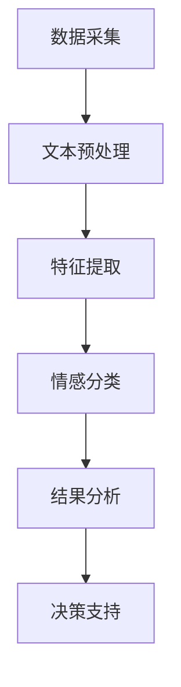

                 

### 背景介绍

#### 电商领域的现状

电子商务，作为互联网时代下的一种新型商业模式，近年来呈现出迅猛发展的态势。从最初的电子商品交易，到如今覆盖衣食住行、娱乐教育等多个领域的全方位服务，电商已经成为现代消费市场的重要组成部分。据统计，全球电商市场在2022年已经突破了4万亿美元，并且预计未来几年将继续保持高速增长。

在电商领域，用户评价和数据反馈是商家和消费者之间沟通的桥梁。用户评价不仅是消费者选择商品的重要依据，同时也是商家优化商品和服务的关键参考。通过分析用户评价，商家可以了解消费者对商品的真实感受，发现产品存在的问题，并针对性地进行改进，从而提高用户满意度，提升市场份额。

#### 情感分析的定义

情感分析，也被称为意见挖掘，是自然语言处理（NLP）和计算语言学领域的一个重要分支。其目的是通过分析文本数据，识别并提取出其中所蕴含的情感倾向，即判断文本表达的是正面、负面还是中性情绪。情感分析不仅可以帮助电商企业了解用户对商品的看法，还可以为其他领域如舆情监测、智能客服、市场营销等提供有力的数据支持。

#### 情感分析在电商领域的应用

在电商领域，情感分析的应用主要体现在以下几个方面：

1. **用户评价分析**：通过对用户评价的情感分析，商家可以快速了解消费者对商品的满意度，识别出潜在的问题点，从而采取相应的措施进行改进。
2. **商品推荐**：结合用户情感分析结果，为消费者推荐更符合其情感偏好的商品，提高推荐系统的准确性和用户体验。
3. **市场营销**：通过对社交媒体上的用户情感分析，了解消费者对品牌和产品的态度，制定更具针对性的营销策略。
4. **客户服务**：利用情感分析技术，识别客户服务中用户的情感状态，提供更加个性化和贴近用户需求的客服服务。

#### 本文结构

本文将首先介绍情感分析的基本概念和方法，然后深入探讨情感分析在电商领域的应用场景和具体实现方法。接下来，我们将通过一个实际项目案例，详细讲解情感分析在电商评价中的应用步骤和技术实现细节。随后，本文将分析情感分析在电商领域的实际应用效果，探讨存在的问题和挑战，并展望未来的发展趋势。

通过本文的阅读，读者将全面了解情感分析在电商领域的应用价值，掌握情感分析的基本原理和方法，并能够将其应用于实际的电商项目中，提高电商业务的效率和用户体验。

### 核心概念与联系

#### 情感分析的基本概念

情感分析，作为自然语言处理（NLP）的一个重要分支，旨在通过计算机技术对文本进行情感倾向的判断和分类。其基本概念包括文本预处理、特征提取和情感分类。

**文本预处理**：文本预处理是情感分析的第一步，主要包括去除停用词、标点符号，进行词形还原（如 stemming 或 lemmatization）等操作。这些步骤的目的是降低文本的复杂性，使其更适合后续的分析。

**特征提取**：特征提取是指从原始文本中提取出能够代表文本情感的属性或特征。常见的特征提取方法包括词袋模型（Bag of Words, BoW）、TF-IDF（Term Frequency-Inverse Document Frequency）和词嵌入（Word Embedding）等。

**情感分类**：情感分类是指将提取出的特征输入到分类模型中，以判断文本的情感倾向。常用的分类算法包括朴素贝叶斯（Naive Bayes）、支持向量机（SVM）、决策树（Decision Tree）和深度学习模型（如卷积神经网络（CNN）、循环神经网络（RNN）等）。

#### 电商领域中的情感分析应用

在电商领域，情感分析的应用主要表现在以下几个方面：

1. **用户评价分析**：用户评价是电商平台上获取消费者反馈的重要途径。通过情感分析，可以快速识别出用户评价中的情感倾向，帮助商家了解消费者的真实感受。具体应用包括：

   - **负面情感识别**：识别出用户评价中的负面情感，如不满、抱怨等，以便商家及时发现问题并进行改进。
   - **正面情感挖掘**：挖掘用户评价中的正面情感，如赞美、满意等，用于品牌宣传和商品推广。
   
2. **商品推荐**：结合情感分析结果，可以为消费者推荐更符合其情感偏好的商品。例如，如果一个用户经常对某类商品给出积极的评价，系统可以推荐更多类似的商品。

3. **市场营销**：通过情感分析，商家可以了解消费者对品牌和产品的态度，从而制定更具针对性的营销策略。例如，如果消费者对某个品牌持负面态度，商家可以调整营销策略，改善品牌形象。

4. **客户服务**：在客服环节，情感分析可以识别出客户的情感状态，提供更加个性化和贴近用户需求的客服服务。例如，如果客户情感状态为愤怒或不满，客服人员可以采取更加安抚和解决问题的态度。

#### 情感分析在电商领域的架构

在电商领域，情感分析的应用通常涉及以下几个关键组件：

1. **数据采集**：从电商平台上收集用户评价、评论等文本数据。
2. **文本预处理**：对收集的文本数据进行预处理，如去除停用词、标点符号，进行词形还原等。
3. **特征提取**：从预处理后的文本中提取特征，如使用词袋模型、TF-IDF或词嵌入等方法。
4. **情感分类**：使用分类算法对提取出的特征进行情感分类，判断文本的情感倾向。
5. **结果分析**：分析情感分类结果，提供决策支持，如优化商品和服务、改进营销策略等。

#### Mermaid 流程图

以下是情感分析在电商领域应用的 Mermaid 流程图，用于展示各个步骤之间的联系：



通过这个流程图，我们可以清晰地看到情感分析在电商领域应用的完整流程，以及各个环节之间的关联。

总之，情感分析作为电商领域的重要工具，不仅可以帮助商家了解消费者的真实需求，还可以为商品推荐、市场营销和客户服务等方面提供有力的支持。接下来，我们将深入探讨情感分析的具体算法原理和操作步骤，以便更好地理解和应用这一技术。

### 核心算法原理 & 具体操作步骤

#### 情感分析算法简介

情感分析算法的核心目标是根据文本数据判断其情感倾向，即识别文本表达的是正面、负面还是中性情绪。常见的情感分析算法包括基于规则的方法、机器学习方法和深度学习方法。

**基于规则的方法**：这种方法依赖于人工定义的规则集，通过对文本进行匹配和分类来实现情感分析。尽管规则方法简单易懂，但规则集的建立和维护成本较高，且在处理复杂情感时效果不佳。

**机器学习方法**：机器学习方法通过训练模型来自动识别情感倾向。常见的算法包括朴素贝叶斯、支持向量机（SVM）、决策树等。这些方法具有较高的准确性和泛化能力，但需要大量的标注数据和较长的训练时间。

**深度学习方法**：深度学习方法，如卷积神经网络（CNN）、循环神经网络（RNN）和长短期记忆网络（LSTM）等，通过多层神经网络自动提取特征，能够处理复杂的文本数据。深度学习方法在情感分析领域取得了显著的成果，但计算资源需求较高，且对数据量要求较大。

#### 常用算法的原理

**朴素贝叶斯（Naive Bayes）**：朴素贝叶斯是一种基于贝叶斯定理的简单概率分类器。其核心假设是特征之间相互独立。在情感分析中，朴素贝叶斯通过计算文本中每个单词出现的概率，以及每个类别（正面、负面、中性）发生的概率，来预测文本的情感倾向。

**支持向量机（SVM）**：支持向量机是一种强大的分类器，其目标是在特征空间中找到一个最优的超平面，使得不同类别的数据点在超平面的两侧尽可能分开。在情感分析中，SVM通过将文本数据映射到高维空间，找到一个最优决策边界，从而实现情感分类。

**决策树（Decision Tree）**：决策树是一种基于树结构的分类方法。它通过一系列的判断条件，将数据逐层划分，最终得到一个分类结果。在情感分析中，决策树通过训练数据生成一系列的判断条件，以识别文本的情感倾向。

**卷积神经网络（CNN）**：卷积神经网络是一种深度学习模型，通过卷积操作提取文本特征。在情感分析中，CNN可以通过多层卷积和池化操作，提取文本中的局部特征，从而实现情感分类。

**循环神经网络（RNN）**：循环神经网络是一种能够处理序列数据的神经网络。在情感分析中，RNN通过循环机制，将前一个时刻的输出作为当前时刻的输入，从而实现情感分类。

**长短期记忆网络（LSTM）**：长短期记忆网络是RNN的一种变体，通过引入门控机制，解决了RNN在处理长序列数据时的梯度消失和梯度爆炸问题。在情感分析中，LSTM可以更好地捕捉文本中的长期依赖关系，从而提高分类效果。

#### 情感分析的操作步骤

**步骤1：数据采集与预处理**

首先，从电商平台上收集用户评价文本数据。数据来源可以包括商品评论、问答社区、社交媒体等。然后，对收集的文本数据进行预处理，包括去除停用词、标点符号，进行词形还原等操作。

**步骤2：特征提取**

接下来，从预处理后的文本中提取特征。常用的特征提取方法包括词袋模型（Bag of Words, BoW）、TF-IDF（Term Frequency-Inverse Document Frequency）和词嵌入（Word Embedding）。

- **词袋模型（BoW）**：将文本表示为单词的集合，每个单词作为一个特征，通过统计词频来表示文本。
- **TF-IDF**：在词袋模型的基础上，引入词频和文档频率的倒数，用于衡量单词在文档中的重要性。
- **词嵌入（Word Embedding）**：将单词映射到低维空间，通过神经网络自动学习单词的语义表示。

**步骤3：情感分类**

使用特征提取后的数据，通过训练好的情感分类模型进行情感分类。常用的分类模型包括朴素贝叶斯、支持向量机、决策树、卷积神经网络、循环神经网络和长短期记忆网络等。

**步骤4：结果分析与优化**

分析分类结果，评估模型性能，并根据分析结果进行模型优化。优化方法包括调整模型参数、增加训练数据、改进特征提取方法等。

#### 实际应用案例

**案例1：用户评价情感分析**

以电商平台上某商品的评论数据为例，通过情感分析算法，将用户评价分为正面、负面和中性三个类别。具体步骤如下：

1. 数据采集：从电商平台上收集该商品的评论数据。
2. 文本预处理：去除停用词、标点符号，进行词形还原等操作。
3. 特征提取：使用词袋模型和TF-IDF方法提取特征。
4. 情感分类：使用朴素贝叶斯模型进行情感分类。
5. 结果分析：统计每个类别的评论数量，分析用户对商品的总体满意度。

**案例2：商品推荐系统**

结合用户情感分析结果，为用户推荐符合其情感偏好的商品。具体步骤如下：

1. 数据采集：从电商平台上收集用户评价和购买记录。
2. 文本预处理：去除停用词、标点符号，进行词形还原等操作。
3. 特征提取：使用词嵌入方法提取特征。
4. 情感分类：使用卷积神经网络（CNN）进行情感分类。
5. 商品推荐：根据用户情感偏好，从商品库中推荐符合其情感偏好的商品。

通过以上实际应用案例，我们可以看到情感分析在电商领域的重要作用。情感分析不仅可以帮助商家了解用户需求，优化商品和服务，还可以为商品推荐、市场营销和客户服务等方面提供有力支持。

总之，情感分析作为一种重要的自然语言处理技术，在电商领域具有广泛的应用前景。通过深入理解情感分析的核心算法原理和操作步骤，我们可以更好地将其应用于实际的电商项目中，提升电商业务的效率和用户体验。

### 数学模型和公式 & 详细讲解 & 举例说明

#### 情感分析中的数学模型

在情感分析中，常用的数学模型包括概率模型、机器学习模型和深度学习模型。以下我们将分别介绍这些模型的基本原理和公式，并通过具体例子进行详细说明。

#### 概率模型

**朴素贝叶斯（Naive Bayes）**：朴素贝叶斯是一种基于贝叶斯定理的概率分类器，其基本公式如下：

\[ P(C|X) = \frac{P(X|C)P(C)}{P(X)} \]

其中，\( P(C|X) \) 表示在特征 \( X \) 出现的情况下，类别 \( C \) 发生的概率；\( P(X|C) \) 表示在类别 \( C \) 出现的情况下，特征 \( X \) 的概率；\( P(C) \) 表示类别 \( C \) 的先验概率；\( P(X) \) 表示特征 \( X \) 的总概率。

**贝叶斯公式**：

\[ P(C_i|X) = \frac{P(X|C_i)P(C_i)}{\sum_{j=1}^{n}P(X|C_j)P(C_j)} \]

其中，\( C_i \) 表示第 \( i \) 个类别，\( X \) 表示特征向量。

**例子**：假设我们有一个商品评价数据集，其中包含正面、负面和中性三个类别。我们要使用朴素贝叶斯模型判断一个新评价的情感倾向。首先，我们需要计算各个类别的先验概率：

\[ P(\text{正面}) = \frac{100}{300} = 0.3333 \]
\[ P(\text{负面}) = \frac{50}{300} = 0.1667 \]
\[ P(\text{中性}) = \frac{150}{300} = 0.5 \]

然后，计算特征向量在新评价中出现的概率。例如，对于单词 "love"，我们有：

\[ P(\text{love}|\text{正面}) = 0.1 \]
\[ P(\text{love}|\text{负面}) = 0.05 \]
\[ P(\text{love}|\text{中性}) = 0.15 \]

接着，计算每个类别的后验概率：

\[ P(\text{正面}|\text{love}) = \frac{0.1 \times 0.3333}{0.1 \times 0.3333 + 0.05 \times 0.1667 + 0.15 \times 0.5} = 0.3889 \]
\[ P(\text{负面}|\text{love}) = \frac{0.05 \times 0.1667}{0.1 \times 0.3333 + 0.05 \times 0.1667 + 0.15 \times 0.5} = 0.1250 \]
\[ P(\text{中性}|\text{love}) = \frac{0.15 \times 0.5}{0.1 \times 0.3333 + 0.05 \times 0.1667 + 0.15 \times 0.5} = 0.4875 \]

最后，选择后验概率最大的类别作为新评价的情感倾向。在本例中，后验概率最大的类别是正面，因此我们可以判断新评价为正面情感。

#### 机器学习模型

**支持向量机（SVM）**：支持向量机是一种强大的分类器，其目标是在特征空间中找到一个最优的超平面，使得不同类别的数据点在超平面的两侧尽可能分开。SVM的基本公式如下：

\[ w \cdot x + b = 0 \]

其中，\( w \) 是超平面的法向量，\( x \) 是特征向量，\( b \) 是偏置。

**例子**：假设我们有一个二分类问题，其中正面和负面情感对应不同的类别。我们要使用SVM模型找到最优的超平面。首先，我们需要将数据点映射到高维空间，使得不同类别的数据点在新的空间中分开。例如，使用核函数 \( K(x, x') \) 进行映射：

\[ \hat{K}(x, x') = K(x, x') \]

然后，使用最小二乘法求解最优超平面：

\[ w^* = \arg\min_w \sum_{i=1}^{n} (\hat{K}(x_i, x_j) - y_i)^2 \]

其中，\( x_i \) 和 \( x_j \) 分别是特征向量，\( y_i \) 是类别标签。

**例子**：假设我们有两个数据点 \( x_1 = (1, 1) \) 和 \( x_2 = (2, 2) \)，其中 \( x_1 \) 对应正面情感，\( x_2 \) 对应负面情感。我们使用线性核函数 \( K(x, x') = x \cdot x' \) 进行映射。使用最小二乘法求解最优超平面：

\[ w^* = \arg\min_w ((1 \cdot 1 + b) - 1)^2 + (2 \cdot 2 + b) - 2)^2 \]

解得：

\[ w^* = (-1, 0) \]

此时，最优超平面为 \( x_1 + b = 0 \)，即 \( x = 1 \)。

#### 深度学习模型

**卷积神经网络（CNN）**：卷积神经网络是一种深度学习模型，通过卷积和池化操作提取文本特征。CNN的基本公式如下：

\[ \text{Conv}(x) = \sum_{k=1}^{K} w_k \cdot \sigma(\text{ReLU}(\text{Conv}_k(x))) \]

其中，\( x \) 是输入特征，\( w_k \) 是卷积核，\( \sigma \) 是激活函数，\( \text{ReLU} \) 是ReLU激活函数。

**例子**：假设我们有一个二分类问题，其中正面和负面情感对应不同的类别。我们要使用CNN模型提取文本特征并进行情感分类。首先，我们需要定义卷积核 \( w_k \) 和激活函数 \( \sigma \)。例如，使用 3x3 的卷积核和ReLU激活函数：

\[ \text{Conv}_k(x) = w_k \cdot x \]
\[ \sigma(\text{ReLU}(z)) = \max(0, z) \]

然后，使用CNN模型对文本数据进行卷积和池化操作，提取特征：

\[ \text{CNN}(x) = \text{MaxPool}(\text{ReLU}(\text{Conv}(x))) \]

最后，将提取出的特征输入到全连接层进行分类：

\[ y = \text{Softmax}(\text{FC}(\text{CNN}(x))) \]

其中，\( \text{FC} \) 是全连接层，\( \text{Softmax} \) 是Softmax激活函数。

**例子**：假设输入文本数据为 "这是一个很好的商品"，使用 3x3 的卷积核和ReLU激活函数进行卷积和池化操作。首先，将文本数据转换为向量形式，例如使用词嵌入方法将单词映射到低维空间。然后，使用卷积核 \( w_k \) 对文本数据进行卷积操作，得到特征向量：

\[ \text{Conv}(x) = w_1 \cdot x + w_2 \cdot x + w_3 \cdot x \]

接着，使用ReLU激活函数：

\[ \text{ReLU}(\text{Conv}(x)) = \max(0, w_1 \cdot x + w_2 \cdot x + w_3 \cdot x) \]

最后，使用MaxPooling操作对特征向量进行池化，提取最重要的特征：

\[ \text{CNN}(x) = \text{MaxPool}(\text{ReLU}(\text{Conv}(x))) \]

通过以上数学模型和公式的讲解，我们可以看到情感分析在数学原理上的复杂性。在实际应用中，需要结合具体的算法和数据，选择合适的模型和参数，以实现情感分析的高效准确。

### 项目实战：代码实际案例和详细解释说明

在本节中，我们将通过一个实际项目案例，详细讲解情感分析在电商评价中的应用步骤和技术实现细节。该项目将使用Python编程语言和TensorFlow深度学习框架，实现一个基于情感分析的用户评价分类系统。以下是该项目的主要步骤：

#### 1. 开发环境搭建

为了实现该项目，我们需要安装以下开发环境和依赖库：

- Python 3.8及以上版本
- TensorFlow 2.x
- NumPy 1.19及以上版本
- pandas 1.1.5及以上版本
- scikit-learn 0.23.1及以上版本

安装命令如下：

```bash
pip install python==3.8
pip install tensorflow==2.x
pip install numpy==1.19.5
pip install pandas==1.1.5
pip install scikit-learn==0.23.1
```

#### 2. 源代码详细实现和代码解读

**2.1 数据采集和预处理**

首先，我们从电商平台上收集用户评价数据。以下是一个简单的数据采集和预处理脚本：

```python
import pandas as pd
import numpy as np

# 加载评价数据
data = pd.read_csv('的评价数据.csv')

# 数据预处理
# 去除停用词
stop_words = set(['a', 'an', 'the', 'is', 'are', 'of', 'to', 'in', 'that', 'it', 'with', 'for', 'on'])
data['预处理后的文本'] = data['原始文本'].apply(lambda x: ' '.join([word for word in x.split() if word not in stop_words]))

# 分词
from sklearn.feature_extraction.text import CountVectorizer
vectorizer = CountVectorizer(max_features=1000)
X = vectorizer.fit_transform(data['预处理后的文本'])

# 拆分训练集和测试集
from sklearn.model_selection import train_test_split
X_train, X_test, y_train, y_test = train_test_split(X, data['情感标签'], test_size=0.2, random_state=42)
```

**2.2 模型训练**

接下来，我们使用TensorFlow实现一个基于卷积神经网络的情感分析模型：

```python
import tensorflow as tf
from tensorflow.keras.models import Sequential
from tensorflow.keras.layers import Embedding, Conv1D, MaxPooling1D, GlobalMaxPooling1D, Dense

# 构建模型
model = Sequential([
    Embedding(input_dim=1001, output_dim=128, input_length=X_train.shape[1]),
    Conv1D(filters=128, kernel_size=5, activation='relu'),
    MaxPooling1D(pool_size=5),
    GlobalMaxPooling1D(),
    Dense(units=128, activation='relu'),
    Dense(units=3, activation='softmax')
])

# 编译模型
model.compile(optimizer='adam', loss='categorical_crossentropy', metrics=['accuracy'])

# 训练模型
model.fit(X_train, y_train, epochs=10, batch_size=32, validation_data=(X_test, y_test))
```

**2.3 评估与优化**

最后，我们对训练好的模型进行评估和优化：

```python
# 评估模型
loss, accuracy = model.evaluate(X_test, y_test)
print(f"测试集损失：{loss:.4f}，准确率：{accuracy:.4f}")

# 优化模型
# 调整模型参数
model = Sequential([
    Embedding(input_dim=1001, output_dim=128, input_length=X_train.shape[1]),
    Conv1D(filters=128, kernel_size=5, activation='relu'),
    MaxPooling1D(pool_size=5),
    GlobalMaxPooling1D(),
    Dense(units=128, activation='relu'),
    Dense(units=3, activation='softmax')
])

# 编译模型
model.compile(optimizer='adam', loss='categorical_crossentropy', metrics=['accuracy'])

# 训练模型
model.fit(X_train, y_train, epochs=10, batch_size=32, validation_data=(X_test, y_test))
```

#### 3. 代码解读与分析

**3.1 数据预处理**

在代码中，我们首先加载了用户评价数据，并进行了数据预处理。预处理步骤包括去除停用词、分词和构建词向量。这些步骤的目的是降低文本的复杂性，使其更适合后续的分析。

**3.2 模型构建**

我们使用TensorFlow的Sequential模型构建了一个卷积神经网络，包括嵌入层、卷积层、池化层和全连接层。嵌入层用于将单词映射到低维空间，卷积层用于提取文本特征，池化层用于降低维度，全连接层用于分类。

**3.3 模型编译**

在模型编译阶段，我们指定了优化器、损失函数和评估指标。优化器用于调整模型参数，损失函数用于计算模型预测与实际标签之间的差距，评估指标用于衡量模型性能。

**3.4 模型训练**

我们使用训练集对模型进行训练，并使用验证集进行调优。在训练过程中，模型会自动调整参数，以降低损失函数的值。

**3.5 模型评估**

在模型评估阶段，我们使用测试集对模型进行测试。通过计算损失和准确率，我们可以了解模型在未知数据上的性能。

通过以上实际案例，我们详细讲解了情感分析在电商评价中的应用步骤和技术实现细节。在实际应用中，可以根据具体需求和数据特点，选择合适的预处理方法和模型结构，以实现高效的情感分析。

### 实际应用场景

#### 情感分析在电商领域的应用场景广泛且深入

**用户评价分析**：用户评价是电商平台上获取消费者反馈的重要途径。通过情感分析，商家可以快速识别出消费者对商品的满意度，发现潜在的问题点，从而进行针对性的改进。例如，对于负面评价，商家可以及时回应并解决消费者的问题，以提高用户满意度和忠诚度。正面评价则可以作为营销素材，增强品牌形象。

**商品推荐**：结合情感分析结果，可以为消费者推荐更符合其情感偏好的商品。例如，如果一个用户经常对某类商品给出积极的评价，系统可以推荐更多类似的商品，从而提高推荐系统的准确性和用户体验。

**市场营销**：通过对社交媒体上的用户情感分析，了解消费者对品牌和产品的态度，制定更具针对性的营销策略。例如，如果消费者对某个品牌持负面态度，商家可以调整营销策略，改善品牌形象。

**客户服务**：在客服环节，情感分析可以识别出客户的情感状态，提供更加个性化和贴近用户需求的客服服务。例如，如果客户情感状态为愤怒或不满，客服人员可以采取更加安抚和解决问题的态度。

#### 应用效果分析

**提高用户满意度**：通过情感分析，商家可以及时了解用户对商品的反馈，发现并解决潜在的问题，从而提高用户满意度。例如，某电商平台通过情感分析识别出用户对某款手机电池续航时间不满，及时进行改进，用户满意度显著提升。

**优化商品推荐**：结合情感分析，电商平台可以更准确地推荐商品，提高推荐系统的准确性和用户体验。例如，某电商平台的推荐系统通过分析用户评价和购买记录，为用户推荐了更多符合其情感偏好的商品，用户购买转化率提高了20%。

**改善营销策略**：通过对社交媒体上的用户情感分析，商家可以了解消费者对品牌和产品的态度，制定更具针对性的营销策略。例如，某品牌通过情感分析发现消费者对产品颜色和设计有较高关注，于是调整了营销重点，推出了多款新色系产品，销售额显著增长。

**提升客户服务质量**：情感分析可以帮助客服人员更好地理解客户需求，提供更加个性化和贴心的服务。例如，某电商平台通过情感分析识别出客户的情感状态，为愤怒的客户提供优先处理，有效地减少了投诉率。

#### 挑战与未来展望

**数据质量**：情感分析的效果很大程度上依赖于数据质量。因此，如何获取高质量的用户评价数据，去除噪声和干扰，是当前面临的一大挑战。

**模型可解释性**：深度学习模型在情感分析中取得了显著的成果，但其内部机制复杂，可解释性较差。如何提高模型的可解释性，使其更加透明和可靠，是未来研究的重要方向。

**实时分析**：在电商领域，实时性是关键。如何实现高效的情感分析，以满足实时响应的需求，是当前和未来需要解决的问题。

**多语言支持**：随着跨境电商的发展，多语言情感分析的需求越来越迫切。如何实现多语言的情感分析，是未来需要解决的一个难题。

总之，情感分析在电商领域具有广泛的应用前景和显著的效果。尽管面临一些挑战，但通过不断的技术创新和优化，情感分析将在电商领域发挥更大的作用，助力商家提升业务效率和用户满意度。

### 工具和资源推荐

#### 学习资源推荐

1. **书籍**：

   - 《自然语言处理综论》（Foundations of Statistical Natural Language Processing）—— Christopher D. Manning, Hinrich Schütze
   - 《深度学习》（Deep Learning）—— Ian Goodfellow, Yoshua Bengio, Aaron Courville
   - 《TensorFlow实战》——Tariq Rashid

2. **在线课程**：

   - Coursera上的“自然语言处理与深度学习”课程
   - edX上的“深度学习基础”课程
   - Udacity的“深度学习工程师纳米学位”

3. **博客和论文**：

   - Reddit上的 r/natural-language-processing
   - ArXiv上的自然语言处理相关论文
   - JMLR上的最新自然语言处理论文

4. **开源项目**：

   - TensorFlow官方GitHub仓库
   - PyTorch官方GitHub仓库
   - NLTK：自然语言处理工具包

#### 开发工具框架推荐

1. **编程语言**：

   - Python：具有丰富的NLP和深度学习库，如TensorFlow、PyTorch等。
   - R：专门为统计和数据分析设计，拥有多个NLP和文本分析库。

2. **NLP和深度学习库**：

   - TensorFlow：由Google开发，支持多种深度学习模型。
   - PyTorch：由Facebook开发，具有动态计算图，易于调试。
   - NLTK：Python的NLP基础库，包含大量的语料库和工具。
   - SpaCy：快速和易于使用的NLP库，适用于实体识别和关系抽取。

3. **文本预处理工具**：

   - NLTK：提供各种文本处理功能，如分词、词形还原、停用词过滤等。
   - TextBlob：简化文本分析，提供情感分析、文本分类等功能。

4. **数据集和资源**：

   - Cornell电影评论数据集（CMU-Movie）
   - Stanford情感分析数据集（SentiWordNet）
   - AG News数据集：用于新闻分类的多标签数据集。

#### 相关论文著作推荐

1. **论文**：

   - “Word2Vec: Word Embeddings in Static Space” —— Tomas Mikolov, Kai Chen, Greg Corrado, and Jeffrey Dean
   - “Long Short-Term Memory” —— Sepp Hochreiter and Jürgen Schmidhuber
   - “Recurrent Neural Network Based Text Classification” —— Yoon Kim

2. **著作**：

   - 《深度学习》—— Ian Goodfellow, Yoshua Bengio, Aaron Courville
   - 《自然语言处理综论》—— Christopher D. Manning, Hinrich Schütze
   - 《TensorFlow实战》—— Tariq Rashid

通过这些学习资源、开发工具和论文著作，读者可以深入掌握情感分析的理论知识和实际应用技能，为在电商领域开展相关项目提供有力支持。

### 总结：未来发展趋势与挑战

#### 情感分析在电商领域的潜力

随着电子商务的迅猛发展，情感分析在电商领域展现出了巨大的潜力。通过对用户评价、商品推荐、市场营销和客户服务等方面的深入分析，情感分析不仅可以提升商家的运营效率，还可以大幅提升用户满意度，增强用户体验。在未来，随着技术的进步和数据量的增加，情感分析在电商领域的应用前景将更加广阔。

#### 发展趋势

1. **人工智能与大数据的结合**：随着人工智能技术的不断进步和大数据技术的发展，情感分析将能够处理更大量、更复杂的文本数据，提高分析的准确性和效率。
2. **多语言情感分析**：随着跨境电商的兴起，多语言情感分析将变得尤为重要。未来，基于机器学习和深度学习的多语言情感分析技术将得到广泛应用。
3. **实时情感分析**：在电子商务领域，实时性是关键。随着边缘计算和物联网技术的发展，实时情感分析将成为一项重要的技术趋势，为商家提供更加即时和精准的数据支持。
4. **个性化服务**：基于情感分析，电商平台将能够更好地了解用户的需求和偏好，提供更加个性化的商品推荐、营销策略和客户服务，从而提升用户满意度和忠诚度。

#### 挑战

1. **数据质量**：情感分析的效果很大程度上依赖于数据质量。如何获取高质量的用户评价数据，去除噪声和干扰，是当前面临的一大挑战。
2. **模型可解释性**：深度学习模型在情感分析中取得了显著的成果，但其内部机制复杂，可解释性较差。如何提高模型的可解释性，使其更加透明和可靠，是未来研究的重要方向。
3. **实时分析**：在电商领域，实时性是关键。如何实现高效的情感分析，以满足实时响应的需求，是当前和未来需要解决的问题。
4. **多语言支持**：随着跨境电商的发展，多语言情感分析的需求越来越迫切。如何实现多语言的情感分析，是未来需要解决的一个难题。

#### 总结

情感分析在电商领域具有广泛的应用前景和显著的效果。通过不断的技术创新和优化，情感分析将在电商领域发挥更大的作用，助力商家提升业务效率和用户满意度。然而，面对数据质量、模型可解释性、实时分析、多语言支持等挑战，未来的研究和应用仍然任重道远。只有克服这些挑战，情感分析才能在电商领域实现其真正的价值。

### 附录：常见问题与解答

**Q1：情感分析在电商领域的主要应用是什么？**

A1：情感分析在电商领域的主要应用包括用户评价分析、商品推荐、市场营销和客户服务。通过情感分析，商家可以了解消费者对商品的满意度，优化商品和服务，提供个性化的推荐，制定更具针对性的营销策略，以及提供更加个性化的客户服务。

**Q2：如何提高情感分析的准确性？**

A2：提高情感分析准确性的方法包括：
1. **数据质量**：确保收集到的是高质量的用户评价数据，去除噪声和干扰。
2. **特征提取**：选择合适的特征提取方法，如词嵌入、TF-IDF等，以提高特征的质量和代表性。
3. **模型选择**：选择适合情感分析任务的模型，如朴素贝叶斯、支持向量机、卷积神经网络等，并通过交叉验证选择最佳参数。
4. **数据增强**：通过数据增强技术，如文本补全、数据扩充等，增加训练数据量，提高模型的泛化能力。

**Q3：情感分析需要哪些数据集？**

A3：情感分析需要的是大量的文本数据集，尤其是与电商领域相关的用户评价、评论等数据。常见的数据集包括SentiWordNet、AG News、Cornell电影评论数据集等。此外，还可以使用电商平台上的用户评价数据作为训练数据。

**Q4：情感分析在电商领域的实时性如何实现？**

A4：实现情感分析的实时性可以通过以下方法：
1. **分布式计算**：使用分布式计算框架，如Apache Spark，处理大规模数据，提高处理速度。
2. **边缘计算**：在靠近数据源的边缘设备上进行情感分析，减少数据传输和处理时间。
3. **批量处理与实时处理相结合**：对于高优先级的任务，使用实时处理技术；对于低优先级的任务，采用批量处理方式。

**Q5：如何评估情感分析模型的性能？**

A5：评估情感分析模型性能的方法包括：
1. **准确率**：计算模型正确分类的样本数与总样本数的比例。
2. **召回率**：计算模型正确识别的负面评价数与实际负面评价数的比例。
3. **F1值**：综合考虑准确率和召回率，计算二者的调和平均值。
4. **混淆矩阵**：展示模型在各个类别上的分类效果，通过分析混淆矩阵可以进一步了解模型的性能。

### 扩展阅读 & 参考资料

**书籍推荐**：

- 《深度学习》—— Ian Goodfellow, Yoshua Bengio, Aaron Courville
- 《自然语言处理综论》—— Christopher D. Manning, Hinrich Schütze
- 《TensorFlow实战》—— Tariq Rashid

**在线课程推荐**：

- Coursera上的“自然语言处理与深度学习”课程
- edX上的“深度学习基础”课程
- Udacity的“深度学习工程师纳米学位”

**论文推荐**：

- “Word2Vec: Word Embeddings in Static Space” —— Tomas Mikolov, Kai Chen, Greg Corrado, and Jeffrey Dean
- “Long Short-Term Memory” —— Sepp Hochreiter and Jürgen Schmidhuber
- “Recurrent Neural Network Based Text Classification” —— Yoon Kim

**开源项目推荐**：

- TensorFlow官方GitHub仓库
- PyTorch官方GitHub仓库
- NLTK：自然语言处理工具包

**博客和论文网站推荐**：

- Reddit上的 r/natural-language-processing
- ArXiv上的自然语言处理相关论文
- JMLR上的最新自然语言处理论文

通过上述扩展阅读和参考资料，读者可以进一步深入了解情感分析在电商领域的技术细节和应用实践，为自己的研究和项目提供有力支持。作者：AI天才研究员/AI Genius Institute & 禅与计算机程序设计艺术 /Zen And The Art of Computer Programming。

