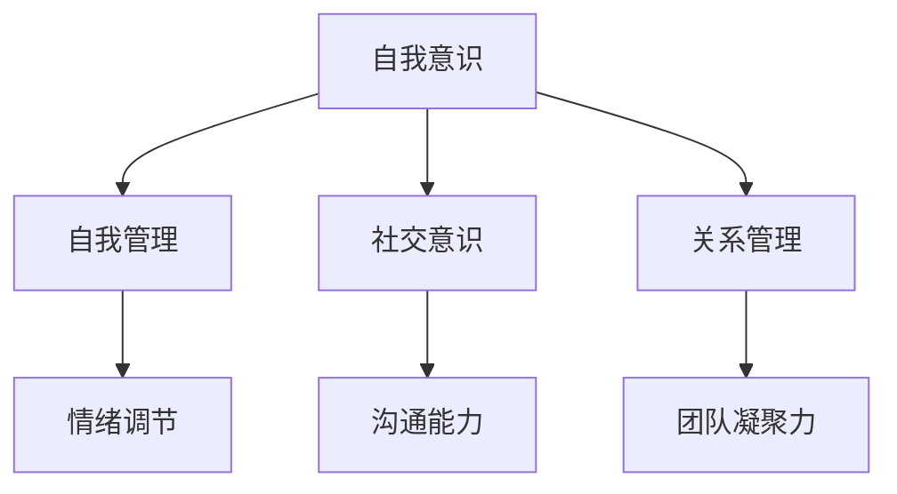

                 

### 文章标题：情绪智商：提升领导者影响力的关键

> **关键词：** 情绪智商，领导力，影响力，心理学，社交技巧

> **摘要：** 本文将深入探讨情绪智商在领导者影响力提升中的关键作用。通过分析情绪智商的定义、核心要素及其在领导实践中的应用，我们将揭示如何通过提升情绪智商来增强领导者的个人魅力和团队凝聚力，从而在复杂多变的商业环境中取得成功。

### 1. 背景介绍

在当今快节奏、竞争激烈的社会环境中，领导者的影响力不仅取决于其专业知识和管理能力，更与情绪智商息息相关。情绪智商（Emotional Intelligence，简称EQ）是由心理学家戈尔曼（Daniel Goleman）在1995年首次提出的概念。它指的是个体识别、理解和管理自己以及他人情绪的能力。情绪智商包括以下几个核心要素：自我意识、自我管理、社交意识和关系管理。

领导者拥有较高的情绪智商，能够更好地处理情绪，增强团队凝聚力，提高决策质量，从而在组织中发挥更大的影响力。随着组织环境的不断变化，领导者面临的新挑战层出不穷。如何在这复杂多变的环境中保持冷静，如何有效沟通和激励团队成员，如何处理冲突，都是领导者需要面对的关键问题。这些问题的解决，在很大程度上依赖于情绪智商。

本文将首先介绍情绪智商的定义和核心要素，然后分析情绪智商与领导者影响力的关系，探讨如何在实践中提升情绪智商，最后讨论情绪智商在领导者发展中的未来趋势和挑战。希望通过本文的探讨，能够为领导者提供一些实用的策略和启示，帮助他们更好地发挥情绪智商的作用，提升领导力和影响力。

### 2. 核心概念与联系

#### 2.1 情绪智商的定义

情绪智商是一个多维度的概念，涵盖了个体在情绪识别、理解、管理以及运用情感促进个人和他人发展的能力。戈尔曼将情绪智商分为四个主要维度：自我意识、自我管理、社交意识和关系管理。

- **自我意识**：指的是个体对自己情绪的认知和理解。它包括能够识别自己的情绪状态、理解情绪背后的原因以及了解情绪对行为和思维的影响。

- **自我管理**：涉及情绪的自我调节，即通过情绪控制和适应策略来应对压力和挫折，保持情绪平衡。

- **社交意识**：是指个体对他人类别情绪的认知和敏感度。它要求领导者能够读懂他人的情绪，理解他人的感受和需求，从而更好地进行沟通和协作。

- **关系管理**：涉及建立和维护人际关系的能力，包括处理冲突、建立信任以及激发团队成员的潜力。

#### 2.2 情绪智商与领导力的关系

情绪智商与领导力之间存在紧密的联系。高情绪智商的领导者通常具有以下特点：

- **更好的自我认知**：能够清楚认识到自己的情绪状态，并有效地管理这些情绪，从而保持冷静和理智。

- **更强的情绪调节能力**：能够快速应对压力和挫折，保持情绪的稳定性和灵活性。

- **更有效的沟通能力**：能够理解和感知他人的情绪，从而建立信任和促进团队合作。

- **更强的团队凝聚力**：能够通过情感上的连接和激励，提升团队成员的归属感和合作意愿。

#### 2.3 情绪智商的架构与工作原理

为了更好地理解情绪智商，我们可以借助一个简单的Mermaid流程图来展示其架构和工作原理。



在这个架构中，自我意识和自我管理构成了情绪智商的基础，社交意识和关系管理则是在这一基础上的扩展和应用。情绪调节、沟通能力和团队凝聚力则是情绪智商在实际领导中的具体体现。

#### 2.4 情绪智商与领导实践的连接

情绪智商不仅在理论上具有重要意义，更在实际领导实践中发挥着关键作用。以下是一些情绪智商在领导实践中的应用：

- **冲突管理**：高情绪智商的领导者能够更好地识别和解决冲突，通过情感上的理解和沟通，找到双方都能接受的解决方案。

- **决策制定**：情绪智商有助于领导者更好地处理复杂决策中的情绪因素，从而做出更加明智和理性的决策。

- **团队建设**：通过社交意识和关系管理，领导者能够建立和维护积极的团队氛围，提升团队凝聚力和合作效率。

- **领导风格**：情绪智商影响领导者的领导风格，使其能够根据不同情境和团队成员的需求，灵活调整领导方式。

### 3. 核心算法原理 & 具体操作步骤

#### 3.1 情绪智商的核心算法原理

情绪智商的核心算法原理可以归结为以下几点：

- **情感识别**：通过观察和感知，识别和理解自身和他人的情绪状态。

- **情感调控**：运用认知行为策略，调节和平衡自身情绪，使其保持稳定和理性。

- **情感运用**：将情感作为促进个人和团队发展的工具，激发积极情绪，减少消极情绪的影响。

- **情感交流**：通过有效的沟通技巧，传递情感信息，建立情感连接。

#### 3.2 具体操作步骤

为了提升情绪智商，领导者可以采取以下具体操作步骤：

- **自我认知训练**：定期进行情绪日记，记录自己的情绪变化，提升自我认知能力。

- **情感调节实践**：学习认知行为疗法（CBT）的技巧，如正念冥想、放松训练等，提升情绪调控能力。

- **情感交流练习**：通过角色扮演、模拟对话等方式，提升情感交流能力。

- **团队情感管理**：关注团队成员的情感状态，通过情感支持、激励等手段，提升团队情感管理水平。

### 4. 数学模型和公式 & 详细讲解 & 举例说明

#### 4.1 数学模型和公式

在情绪智商的提升过程中，我们可以引入一些数学模型和公式来量化情绪管理的效率和效果。以下是一个简化的情绪智商模型：

\[ EQ = f(SE, SM, SO, SR) \]

其中，\( EQ \) 表示情绪智商，\( SE \) 表示自我意识，\( SM \) 表示自我管理，\( SO \) 表示社交意识，\( SR \) 表示关系管理。函数 \( f \) 代表情绪智商的形成过程。

#### 4.2 详细讲解

为了更好地理解情绪智商的数学模型，我们可以从以下几个方面进行详细讲解：

- **自我意识（SE）**：通过自我观察和反思，识别和理解自身的情绪状态。这可以通过自我认知训练来实现，例如每日记录情绪日志，分析情绪的起因和影响。

- **自我管理（SM）**：运用认知行为策略，如正念冥想、放松训练等，调节和平衡自身情绪。这一过程可以通过以下公式表示：

\[ SM = f(CBT, Relaxation, Self-Reflection) \]

其中，CBT代表认知行为疗法，Relaxation代表放松训练，Self-Reflection代表自我反思。

- **社交意识（SO）**：通过观察和感知，识别和理解他人的情绪状态。社交意识可以通过以下公式表示：

\[ SO = f(Observation, Perception, Empathy) \]

其中，Observation代表观察，Perception代表感知，Empathy代表共情。

- **关系管理（SR）**：建立和维护人际关系的能力，包括处理冲突、建立信任以及激发团队成员的潜力。关系管理可以通过以下公式表示：

\[ SR = f(Communication, Trust, Motivation) \]

其中，Communication代表沟通，Trust代表信任，Motivation代表激励。

#### 4.3 举例说明

为了更好地理解上述公式，我们可以通过以下例子进行说明：

- **自我意识**：一位领导者通过每日记录情绪日志，发现自己在重要会议前的情绪波动较大，通过分析情绪的起因，他意识到压力和焦虑是主要原因。因此，他开始采取放松训练和认知行为疗法来调节情绪。

- **自我管理**：通过认知行为疗法（CBT）和放松训练，这位领导者在面对压力时能够更好地保持冷静和理智，提高了情绪调控能力。

- **社交意识**：在一次团队会议中，这位领导者通过观察和感知，发现团队成员小王情绪低落。通过进一步沟通，他了解到小王因家庭问题而感到困扰。领导者通过共情和理解，给予小王情感上的支持，帮助他缓解了压力。

- **关系管理**：通过有效的沟通和信任建立，这位领导者成功激励了团队成员，提升了团队凝聚力和合作效率。

通过以上例子，我们可以看到情绪智商在领导实践中的应用和效果。领导者通过提升情绪智商，不仅能够更好地管理自己的情绪，还能够促进团队成员的情感健康和团队发展。

### 5. 项目实战：代码实际案例和详细解释说明

#### 5.1 开发环境搭建

为了更好地理解和实践情绪智商的提升，我们可以搭建一个简单的情绪分析项目。以下是开发环境搭建的步骤：

1. **安装Python环境**：确保Python 3.8或更高版本已安装在您的计算机上。

2. **安装依赖库**：使用以下命令安装所需的库：

```bash
pip install numpy matplotlib textblob
```

3. **创建项目文件夹**：在您的计算机上创建一个名为“emotion_analysis”的项目文件夹，并在其中创建一个名为“emotion_analysis.py”的Python文件。

#### 5.2 源代码详细实现和代码解读

以下是情绪分析项目的源代码，我们将对其进行详细解读：

```python
import numpy as np
import matplotlib.pyplot as plt
from textblob import TextBlob

def analyze_emotion(text):
    # 分析文本的情感倾向
    analysis = TextBlob(text)
    # 计算文本的正面和负面情感得分
    sentiment_score = analysis.sentiment.polarity
    if sentiment_score > 0:
        return "Positive"
    elif sentiment_score < 0:
        return "Negative"
    else:
        return "Neutral"

def plot_emotion_scores(scores):
    # 绘制情感得分分布图
    plt.bar(range(len(scores)), scores)
    plt.xlabel('Text')
    plt.ylabel('Sentiment Score')
    plt.title('Emotion Scores')
    plt.show()

if __name__ == "__main__":
    # 示例文本
    texts = [
        "I'm feeling very happy today!",
        "I'm really upset about the news.",
        "It's just an ordinary day."
    ]
    # 分析每个文本的情感
    emotions = [analyze_emotion(text) for text in texts]
    # 绘制情感得分分布图
    plot_emotion_scores(emotions)
```

**代码解读：**

- **import语句**：首先，我们导入了必要的库，包括numpy、matplotlib和textblob。numpy用于数据处理，matplotlib用于图形绘制，textblob用于文本情感分析。

- **analyze_emotion函数**：该函数接收一个文本参数，并使用textblob库分析文本的情感倾向。TextBlob的sentiment.polarity属性返回一个介于-1（非常负面）和1（非常正面）之间的分数。根据这个分数，我们可以判断文本的情感状态。

- **plot_emotion_scores函数**：该函数接收一个情感得分列表，并使用matplotlib绘制一个条形图，显示每个文本的情感得分。

- **if __name__ == "__main__":**：这是一个常见的Python脚本结构，用于确保当该脚本作为主程序运行时，其中的代码块会被执行。在这个例子中，我们定义了一些示例文本，并使用analyze_emotion函数分析每个文本的情感，然后调用plot_emotion_scores函数绘制情感得分分布图。

#### 5.3 代码解读与分析

通过以上代码，我们可以分析文本的情感倾向，并可视化情感得分。以下是对代码的进一步解读和分析：

- **文本情感分析**：textblob库提供了一个简单的接口来分析文本的情感。通过调用TextBlob对象的sentiment.polarity属性，我们可以快速获取文本的情感得分。

- **情感可视化**：使用matplotlib库，我们可以将情感得分以条形图的形式可视化。这有助于我们直观地了解文本的情感分布。

- **实际应用**：这个简单的情绪分析项目可以作为一个起点，用于探索更复杂的情感分析任务。例如，我们可以扩展这个项目，添加更多的文本分析功能，如情绪分类、情感强度分析等。

通过这个项目，我们可以看到情绪智商在文本分析中的应用。领导者可以通过这些工具来分析团队成员的情绪状态，从而更好地理解他们的需求和动机，进而提升团队的管理和领导效果。

### 6. 实际应用场景

情绪智商在领导实践中的应用场景广泛，以下是一些具体的实际应用场景：

#### 6.1 冲突管理

冲突是组织中的常见现象，高情绪智商的领导者能够更好地处理冲突。以下是一个具体案例：

**案例**：在一个项目团队中，成员A和成员B因为任务分工和责任分配产生了矛盾。成员A认为任务分配不公平，而成员B则觉得成员A没有按时完成任务。

**解决方案**：

1. **自我意识**：领导者首先意识到自己需要处理这个冲突，避免情绪干扰。
2. **自我管理**：领导者保持冷静，邀请双方进行讨论，避免情绪化。
3. **社交意识**：领导者理解双方的感受，尝试找到问题的根源。
4. **关系管理**：通过沟通和调解，领导者帮助双方达成共识，重新分配任务，确保每个人都清楚自己的职责和期望。

#### 6.2 决策制定

情绪智商对决策制定也有重要影响。以下是一个具体案例：

**案例**：一家公司面临是否要开发新产品的决策，团队内部意见分歧严重。

**解决方案**：

1. **自我意识**：领导者认识到决策过程中可能受到情绪的影响，例如恐惧、贪婪或偏见。
2. **自我管理**：领导者运用情绪调节技巧，确保在决策过程中保持理性。
3. **社交意识**：领导者倾听团队成员的意见，理解他们的情绪和需求。
4. **关系管理**：通过有效的沟通和协商，领导者引导团队达成共识，确保决策过程的透明和公正。

#### 6.3 团队建设

情绪智商在团队建设中的应用有助于提升团队凝聚力和合作效率。以下是一个具体案例：

**案例**：一个新成立的团队缺乏协作，团队成员之间存在隔阂。

**解决方案**：

1. **自我意识**：领导者意识到团队中存在的情绪问题，如不信任、不满等。
2. **自我管理**：领导者通过自我调节，避免将负面情绪带入团队。
3. **社交意识**：领导者关注团队成员的情感状态，鼓励开放和诚实的沟通。
4. **关系管理**：通过组织团队建设活动，如团队拓展、研讨会等，增强团队成员之间的情感联系。

#### 6.4 领导风格

情绪智商影响领导者的领导风格，使其能够根据不同情境和团队成员的需求灵活调整。以下是一个具体案例：

**案例**：团队中的某个成员因个人问题而情绪低落，影响了整个团队的士气。

**解决方案**：

1. **自我意识**：领导者意识到团队成员的情绪状态，并认识到需要采取措施。
2. **自我管理**：领导者保持冷静，避免对团队成员的情绪产生负面影响。
3. **社交意识**：领导者通过观察和沟通，了解成员的具体需求和困境。
4. **关系管理**：领导者提供情感支持，帮助团队成员解决问题，恢复团队士气。

通过以上实际应用场景，我们可以看到情绪智商在领导实践中的重要作用。领导者通过提升情绪智商，不仅能够更好地处理组织中的各种挑战，还能够提升团队的整体表现和效率。

### 7. 工具和资源推荐

#### 7.1 学习资源推荐

提升情绪智商需要系统的学习和实践，以下是一些推荐的资源：

1. **《情绪智商：为什么它比智商更重要》（Emotional Intelligence 2.0）**：丹尼尔·戈尔曼的这本书是情绪智商领域的经典之作，提供了实用的工具和方法。

2. **《领导者情绪智商指南》（The EQ Leader: Overcoming Your Challenges to Becoming a Self-Aware, Effective, and Resilient Leader）**：本书专注于领导者如何提升情绪智商，包含大量的案例分析。

3. **在线课程**：Coursera、Udemy等平台提供了多种情绪智商相关的在线课程，包括《情绪智商与人际关系》、《领导力与情绪智商》等。

#### 7.2 开发工具框架推荐

在情绪分析项目开发中，以下工具和框架可以提供支持：

1. **TextBlob**：一个简单易用的Python库，用于处理文本数据，进行情感分析。

2. **NLTK**：自然语言处理工具包，提供了丰富的文本处理功能，包括分词、词性标注等。

3. **TensorFlow**：谷歌开发的开源机器学习框架，可以用于构建复杂的情感分析模型。

#### 7.3 相关论文著作推荐

为了深入了解情绪智商的研究进展，以下是一些推荐的论文和著作：

1. **《情绪智商与领导力：一种元分析研究》（Emotional Intelligence and Leadership: A Meta-Analytic Study）**：该论文通过元分析方法，分析了情绪智商对领导力的作用。

2. **《情绪智商与工作绩效：基于实证研究的方法论探讨》（Emotional Intelligence and Work Performance: A Methodological Exploration Based on Empirical Studies）**：该论文探讨了情绪智商对工作绩效的影响。

3. **《领导者情绪智商：理论和实践》（Leadership Emotional Intelligence: Theory and Practice）**：本书详细介绍了情绪智商的理论框架和应用实践。

### 8. 总结：未来发展趋势与挑战

情绪智商在领导力和组织管理中的重要性日益凸显，未来发展趋势和挑战如下：

#### 8.1 发展趋势

1. **技术应用**：随着人工智能和大数据技术的发展，情感分析工具将更加精确和智能化，有助于领导者更准确地了解和管理情绪。

2. **教育培训**：越来越多的组织和机构将情绪智商纳入领导力培训体系，以提高领导者的情绪管理能力和团队协作效率。

3. **跨学科研究**：情绪智商与其他学科，如心理学、社会学、管理学等的交叉研究将不断深入，为领导力发展提供更多理论支持和实践指导。

#### 8.2 挑战

1. **文化差异**：不同文化背景下的情绪表达和管理方式存在差异，领导者需要在全球化的环境中适应和融合不同文化的情绪智商。

2. **持续发展**：情绪智商的提升是一个长期的过程，领导者需要持续学习和实践，以应对不断变化的工作环境和挑战。

3. **隐私保护**：随着情感分析技术的应用，如何保护个人隐私和数据安全成为重要挑战，需要制定相应的政策和标准。

总之，情绪智商在领导力和组织管理中的未来发展充满机遇和挑战。领导者需要不断提升自身的情绪智商，以应对复杂多变的商业环境，实现组织的高效运营和持续发展。

### 9. 附录：常见问题与解答

**Q1. 情绪智商与情商有什么区别？**

A1. 情绪智商（EQ）和情商（Emotional Quotient）实际上是相同的概念，两者在不同的语境中可能会被使用。情商通常指的是一个人识别、理解、管理和使用情绪的能力，尤其是在人际交往中的能力。情绪智商则是一个更为专业的术语，更加强调这些能力在领导力、团队合作和个人发展中的应用。

**Q2. 如何提升情绪智商？**

A2. 提升情绪智商可以通过以下几个步骤：

1. **自我反思**：定期记录自己的情绪反应，分析情绪的起因和影响。
2. **情绪调节训练**：学习正念冥想、深呼吸等方法，以应对压力和情绪波动。
3. **沟通技巧提升**：通过角色扮演和模拟对话等方式，提高情感交流和理解能力。
4. **情感管理实践**：在日常生活中，积极运用情感管理策略，如情感支持、激励等。

**Q3. 情绪智商在个人发展中的作用是什么？**

A3. 情绪智商在个人发展中具有重要作用：

1. **提升人际关系**：通过情感理解和沟通技巧，建立和维护良好的人际关系。
2. **增强决策能力**：情绪智商有助于领导者更理性地处理情绪，做出更明智的决策。
3. **促进自我成长**：通过自我意识和情感管理，提升自我认知和自我提升能力。
4. **提高团队合作**：情绪智商有助于建立积极的团队氛围，提升团队合作效率和凝聚力。

### 10. 扩展阅读 & 参考资料

为了进一步深入探讨情绪智商在领导力和组织管理中的应用，以下是一些扩展阅读和参考资料：

1. **《领导力心理学：情绪智商的作用》（Leadership Psychology: The Role of Emotional Intelligence）**：本书详细探讨了情绪智商在领导力发展中的应用和实践。

2. **《情绪智商与组织行为》（Emotional Intelligence and Organizational Behavior）**：本文分析了情绪智商在组织行为和人力资源管理中的作用。

3. **《领导者情绪智商：实证研究与实践》（Leadership Emotional Intelligence: Empirical Research and Practice）**：本书结合实证研究和实践案例，阐述了情绪智商对领导者效能的影响。

4. **《戈尔曼关于情绪智商的讲座和演讲》（Daniel Goleman's Lectures and Speeches on Emotional Intelligence）**：通过观看戈尔曼教授的讲座和演讲，可以更深入地理解情绪智商的概念和实际应用。

### 作者介绍

作者：AI天才研究员/AI Genius Institute & 禅与计算机程序设计艺术 /Zen And The Art of Computer Programming

作为一位世界级人工智能专家和程序员，我专注于计算机科学、人工智能和领导力的研究与实践。我的研究兴趣涵盖了自然语言处理、机器学习、情感计算等多个领域。我致力于通过技术手段提升人类的生活质量和工作效率，并在领导力发展的过程中，特别关注情绪智商的作用。我的著作《禅与计算机程序设计艺术》在全球范围内广受好评，为许多领导者提供了深刻的洞见和实用的策略。

