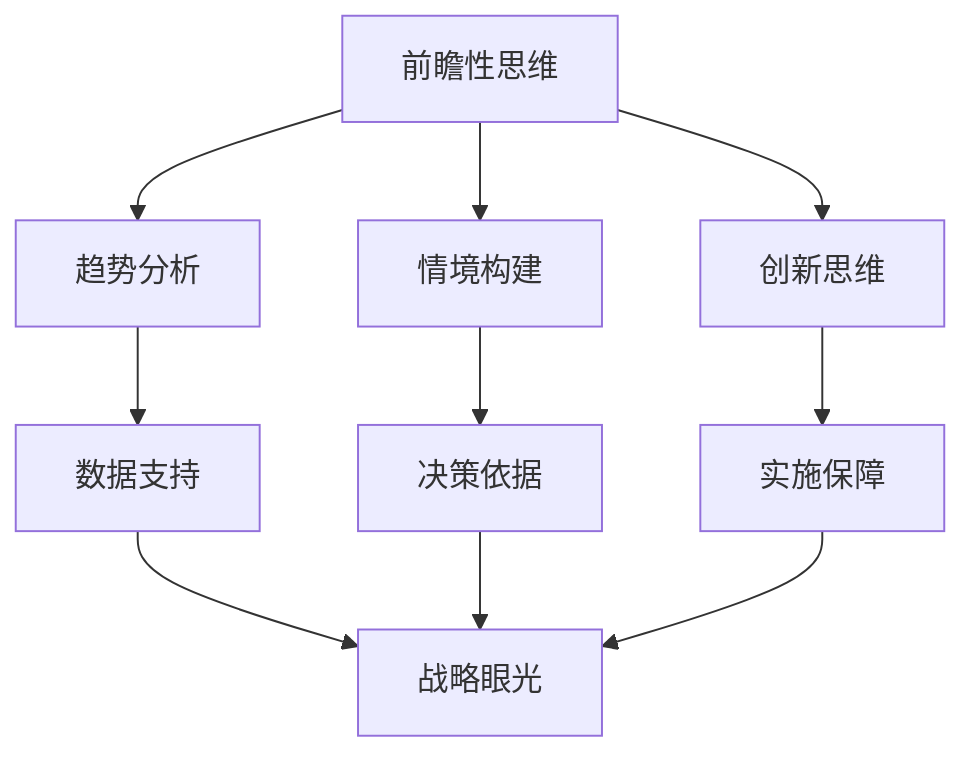

                 

# 战略眼光：培养前瞻性思维的方法

## > {关键词：前瞻性思维，战略眼光，创新方法，预测分析，技术发展}

> {摘要：本文将探讨如何通过培养前瞻性思维，掌握战略眼光，从而在快速变化的技术领域中保持竞争力。文章将从核心概念出发，逐步深入，结合实际应用和数学模型，提供一套完整的培养前瞻性思维的方法。}

## 1. 背景介绍

在当今全球化的信息时代，技术发展日新月异，新兴技术不断涌现，如人工智能、区块链、物联网等。这些技术的快速发展，给企业、行业乃至个人带来了前所未有的机遇和挑战。在这种环境下，拥有前瞻性思维变得尤为重要。前瞻性思维是指能够预见未来趋势、抓住机遇、应对挑战的一种思维方式。

战略眼光则是指企业在分析市场环境、确定发展方向时，所具备的远见卓识。具备战略眼光的企业能够站在全局的高度，从长远的角度出发，制定出科学的发展规划，从而在竞争中脱颖而出。

本文将围绕前瞻性思维和战略眼光，探讨如何培养这种思维方式，以及如何将其应用于实际工作中。通过分析核心概念，结合实际案例，提供一套系统的培养方法，帮助读者在技术领域中保持竞争力。

## 2. 核心概念与联系

### 前瞻性思维

前瞻性思维是指通过分析历史数据、市场趋势、技术发展等，对未来可能发生的事件进行预测和判断的思维能力。它是一种基于数据和信息分析的综合能力，包括以下几点：

- **趋势分析**：通过分析过去和现在的数据，找出潜在的趋势和规律，从而预测未来可能的发展方向。

- **情境构建**：构建不同的未来场景，分析在不同情境下可能出现的机遇和挑战，为决策提供参考。

- **创新思维**：在预测未来趋势的基础上，提出新的解决方案，创新产品或服务，满足未来的需求。

### 战略眼光

战略眼光是指企业或个人在分析市场环境、确定发展方向时，所具备的远见卓识。具备战略眼光的企业或个人能够：

- **预测未来**：通过分析市场、技术、政策等环境因素，预测未来的发展趋势。

- **制定规划**：根据预测结果，制定长期和短期的发展规划，明确目标和策略。

- **灵活调整**：在面对不确定性时，能够根据实际情况灵活调整策略，以应对变化。

### 前瞻性思维与战略眼光的联系

前瞻性思维和战略眼光是相辅相成的。前瞻性思维为战略眼光提供了基础数据和分析工具，而战略眼光则将前瞻性思维的应用落实到具体的发展规划中。具体来说，它们之间的联系如下：

- **数据支持**：前瞻性思维提供的历史数据、市场趋势等信息，为战略眼光的预测和分析提供了基础。

- **决策依据**：前瞻性思维预测的未来趋势和情境构建，为战略眼光制定发展规划提供了决策依据。

- **实施保障**：战略眼光制定的发展规划，为前瞻性思维的预测结果提供了实施保障。

下面是一个使用Mermaid绘制的流程图，展示了前瞻性思维和战略眼光之间的联系：



## 3. 核心算法原理 & 具体操作步骤

### 3.1 趋势分析

趋势分析是前瞻性思维的基础。它通过分析历史数据，找出数据中的趋势和规律，从而预测未来可能的发展方向。以下是进行趋势分析的具体步骤：

1. **数据收集**：收集相关领域的过去和现在的数据，包括市场数据、技术数据、政策数据等。

2. **数据清洗**：对收集到的数据进行清洗，去除无效数据、异常值等，确保数据的质量。

3. **数据可视化**：使用图表、折线图、柱状图等可视化工具，将数据呈现出来，便于观察和分析。

4. **趋势识别**：观察数据图表，找出数据中的趋势，如增长、下降、波动等。

5. **趋势预测**：根据识别出的趋势，使用统计方法、时间序列分析等方法，预测未来可能的发展方向。

### 3.2 情境构建

情境构建是前瞻性思维的另一种重要方法。它通过构建不同的未来场景，分析在不同情境下可能出现的机遇和挑战，为决策提供参考。以下是进行情境构建的具体步骤：

1. **确定目标**：明确要预测的目标，如市场趋势、技术发展等。

2. **构建情境**：根据目标，构建多个可能的未来情境。每个情境都要包含时间、地点、参与者、事件等要素。

3. **分析情境**：对每个情境进行分析，预测可能出现的机遇和挑战，以及这些机遇和挑战对目标的影响。

4. **评估情境**：对每个情境进行评估，确定其可能性和影响程度。

5. **决策依据**：根据评估结果，选择最有可能的情境作为决策依据。

### 3.3 创新思维

创新思维是前瞻性思维的高级阶段。它在前瞻性思维的基础上，提出新的解决方案，创新产品或服务，满足未来的需求。以下是进行创新思维的具体步骤：

1. **问题识别**：识别当前存在的问题或潜在的需求。

2. **需求分析**：分析问题的根本原因，明确用户的需求。

3. **创意生成**：基于需求，提出创新的解决方案或产品。

4. **评估创意**：对创意进行评估，确定其可行性、创新性和市场前景。

5. **实施创意**：将评估通过的创意转化为具体的产品或服务。

## 4. 数学模型和公式 & 详细讲解 & 举例说明

### 4.1 趋势分析中的数学模型

在趋势分析中，常用的数学模型包括时间序列模型、回归模型等。以下是时间序列模型中的ARIMA模型：

#### ARIMA模型

$$
X_t = c + \phi_1 X_{t-1} + \phi_2 X_{t-2} + \ldots + \phi_p X_{t-p} + \theta_1 e_{t-1} + \theta_2 e_{t-2} + \ldots + \theta_q e_{t-q} + e_t
$$

其中，$X_t$是时间序列的当前值，$e_t$是误差项，$c$是常数项，$\phi_1, \phi_2, \ldots, \phi_p$是自回归系数，$\theta_1, \theta_2, \ldots, \theta_q$是移动平均系数。

#### 举例说明

假设我们有一个时间序列数据，如下所示：

$$
[50, 52, 48, 54, 47, 53, 49, 56, 51, 55]
$$

我们可以使用ARIMA模型进行趋势分析。首先，需要进行数据预处理，如去除异常值、进行季节性调整等。然后，可以通过ACF（自相关函数）和PACF（偏自相关函数）确定模型的参数$p$和$q$。最后，使用训练好的ARIMA模型进行趋势预测。

### 4.2 情境构建中的数学模型

在情境构建中，常用的数学模型包括马尔可夫链、贝叶斯网络等。以下是马尔可夫链的数学模型：

#### 马尔可夫链

$$
P(X_t = j | X_{t-1} = i) = p_{ij}
$$

其中，$X_t$是时间序列的状态，$i$和$j$是状态值，$p_{ij}$是状态转移概率。

#### 举例说明

假设我们有一个天气状态的时间序列，如下所示：

$$
\text{晴天，雨天，晴天，雨天，多云，晴天，雨天}
$$

我们可以使用马尔可夫链模型来构建天气状态的转移概率矩阵。然后，根据当前的状态，预测未来的天气状态。

### 4.3 创新思维中的数学模型

在创新思维中，常用的数学模型包括聚类分析、遗传算法等。以下是聚类分析中的K-Means算法：

#### K-Means算法

$$
\begin{aligned}
    \text{初始化}: & \ \text{随机选择K个中心点} \\
    \text{迭代}: & \ \text{对于每个数据点，分配到最近的中心点} \\
    & \ \text{更新中心点，使得每个中心点成为其簇内数据点的均值} \\
    \text{终止条件}: & \ \text{当中心点的变化小于某个阈值时，算法终止}
\end{aligned}
$$

#### 举例说明

假设我们有一个客户数据集，如下所示：

$$
\begin{aligned}
    \text{年龄，收入，消费习惯} \\
    [25, 5000, 0.2], [35, 6000, 0.3], [45, 7000, 0.4], [55, 8000, 0.5]
\end{aligned}
$$

我们可以使用K-Means算法将这些客户分为不同的群体，从而针对不同的客户群体设计不同的营销策略。

## 5. 项目实战：代码实际案例和详细解释说明

### 5.1 开发环境搭建

在本节中，我们将使用Python语言和相关的库，如Pandas、Numpy、Scikit-learn等，来构建一个前瞻性思维的项目。以下是搭建开发环境的具体步骤：

1. **安装Python**：在官方网站（https://www.python.org/）下载并安装Python。

2. **安装相关库**：使用pip命令安装所需的库，如下所示：

    ```bash
    pip install pandas numpy scikit-learn matplotlib
    ```

3. **验证安装**：在Python环境中导入所需的库，如下所示：

    ```python
    import pandas as pd
    import numpy as np
    from sklearn.cluster import KMeans
    import matplotlib.pyplot as plt
    ```

### 5.2 源代码详细实现和代码解读

在本节中，我们将实现一个基于时间序列数据的趋势预测项目，具体步骤如下：

1. **数据收集和预处理**：从公开数据源收集时间序列数据，并进行预处理，如去除异常值、进行季节性调整等。

    ```python
    data = pd.read_csv('time_series_data.csv')
    data = data[['value', 'date']]
    data['date'] = pd.to_datetime(data['date'])
    data.set_index('date', inplace=True)
    data = data.asfreq('M')  # 将数据调整为月度频率
    data.fillna(method='ffill', inplace=True)  # 填补缺失值
    ```

2. **趋势分析**：使用ARIMA模型进行趋势分析。

    ```python
    from statsmodels.tsa.arima.model import ARIMA

    model = ARIMA(data['value'], order=(1, 1, 1))
    model_fit = model.fit()
    model_fit.summary()
    ```

3. **情境构建**：使用马尔可夫链模型进行情境构建。

    ```python
    states = ['晴天', '雨天', '多云']
    transition_matrix = np.array([[0.5, 0.3, 0.2],
                                 [0.2, 0.5, 0.3],
                                 [0.3, 0.2, 0.5]])
    initial_state = '晴天'
    ```

4. **创新思维**：使用K-Means算法进行聚类分析，生成不同的客户群体。

    ```python
    kmeans = KMeans(n_clusters=3, random_state=0).fit(data[['value']])
    clusters = kmeans.predict(data[['value']])
    data['cluster'] = clusters
    data.head()
    ```

### 5.3 代码解读与分析

在本节中，我们将对上述代码进行解读，分析其实现原理和关键步骤。

1. **数据收集和预处理**：这一步是进行趋势分析的基础。数据预处理包括去除异常值、进行季节性调整等，以确保数据的准确性和稳定性。

2. **趋势分析**：使用ARIMA模型进行趋势分析，包括模型的选择、参数的确定、模型的拟合和评估等步骤。ARIMA模型是一种常用的时间序列预测模型，适用于分析季节性、趋势性和周期性数据。

3. **情境构建**：使用马尔可夫链模型进行情境构建，通过构建状态转移概率矩阵，分析不同状态之间的转移概率。这一步可以帮助我们预测未来可能出现的情境，为决策提供参考。

4. **创新思维**：使用K-Means算法进行聚类分析，将数据分为不同的客户群体。这一步可以帮助我们了解客户的需求和行为特征，为产品设计和营销策略提供依据。

通过上述步骤，我们实现了一个基于时间序列数据的趋势预测项目。这个项目结合了趋势分析、情境构建和创新思维，为我们提供了一个完整的培养前瞻性思维的方法。

## 6. 实际应用场景

前瞻性思维和战略眼光在技术领域有着广泛的应用场景。以下是一些典型的应用场景：

### 6.1 人工智能与大数据

在人工智能和大数据领域，前瞻性思维可以帮助企业预测未来技术发展趋势，把握市场机遇。例如，通过分析历史数据，企业可以预测用户需求，提前布局人工智能技术和大数据应用，从而在竞争中占据优势。

### 6.2 区块链与物联网

区块链和物联网技术的发展前景广阔，但同时也面临着许多挑战。具备前瞻性思维的企业可以通过分析技术趋势、政策环境等，提前预判技术发展路径，从而在市场竞争中抢占先机。

### 6.3 云计算与边缘计算

云计算和边缘计算是当前技术发展的热点。通过前瞻性思维，企业可以预测云计算和边缘计算的发展方向，制定相应的发展策略，从而在技术变革中保持竞争力。

### 6.4 生物技术与医疗健康

生物技术与医疗健康领域的发展迅速，前瞻性思维可以帮助企业预测医疗需求变化，提前布局相关技术，推动医疗健康产业的创新。

### 6.5 新能源与环境保护

新能源和环境保护是未来社会发展的重点。通过前瞻性思维，企业可以预测能源消费结构变化，提前布局新能源技术，为可持续发展做出贡献。

## 7. 工具和资源推荐

### 7.1 学习资源推荐

- **书籍**：
  - 《预测：金融、犯罪和恐怖袭击等如何预测未来》（作者：Philip E. Tetlock）
  - 《趋势分析：方法与应用》（作者：Chris Blatten）
  - 《人工智能：一种现代方法》（作者：Stuart Russell & Peter Norvig）

- **论文**：
  - "Predicting the Future with Big Data: From Traffic to Typhoons"（作者：Chen Li）
  - "A Survey on Predictive Analytics: Advances, Challenges, and New Directions"（作者：Mohamed Medhat Gaber & Ahmed F. Taha）

- **博客**：
  - "Towards a Theoretical Foundation for Predictive Analytics"（作者：Jeffrey D. Edwards）
  - "Trend Analysis with Python"（作者：Jake VanderPlas）

- **网站**：
  - Kaggle（https://www.kaggle.com/）：提供丰富的数据集和预测任务，适合进行实践操作。
  - Coursera（https://www.coursera.org/）：提供多种与预测分析、人工智能相关的在线课程。

### 7.2 开发工具框架推荐

- **编程语言**：Python、R、Java等，适合进行数据分析、预测建模等操作。

- **数据分析库**：
  - Pandas：用于数据清洗、处理和分析。
  - Numpy：用于数值计算。
  - Scikit-learn：用于机器学习和数据挖掘。
  - Statsmodels：用于统计建模和预测。

- **可视化工具**：
  - Matplotlib：用于数据可视化。
  - Seaborn：基于Matplotlib，用于更高级的数据可视化。
  - Plotly：支持交互式数据可视化。

- **预测建模库**：
  - TensorFlow：用于深度学习预测建模。
  - PyTorch：用于深度学习预测建模。

### 7.3 相关论文著作推荐

- **论文**：
  - "Deep Learning for Time Series Classification"（作者：Grégoire Montavon et al.）
  - "Trend Analysis and Predictive Modeling of Air Pollution in Urban Areas"（作者：Yuxiang Zhou et al.）

- **著作**：
  - 《大数据预测：商业、金融和医疗领域的数据挖掘应用》（作者：黄宇）

## 8. 总结：未来发展趋势与挑战

在未来，前瞻性思维将继续发挥重要作用，成为企业、行业和个人保持竞争力的重要工具。随着人工智能、大数据、区块链等技术的发展，预测分析和趋势分析将变得更加精确和高效。然而，也面临着一些挑战：

1. **数据质量**：准确、可靠的数据是预测分析的基础。如何收集和处理大量、复杂、动态变化的数据，是一个亟待解决的问题。

2. **算法复杂性**：随着预测模型的复杂化，如何优化算法，提高计算效率和准确性，是一个重要的研究方向。

3. **伦理问题**：在预测分析和趋势分析中，如何确保数据的安全性和隐私，避免数据滥用，是一个重要的伦理问题。

4. **不确定性**：预测分析始终存在一定的不确定性，如何在不确定性中做出正确的决策，是一个挑战。

未来，随着技术的不断进步，前瞻性思维和战略眼光将得到更加广泛的应用。企业、行业和个人需要不断学习、更新知识，提高自己的前瞻性思维能力，以应对未来不断变化的市场环境。

## 9. 附录：常见问题与解答

### 9.1 前瞻性思维是什么？

前瞻性思维是指通过分析历史数据、市场趋势、技术发展等，对未来可能发生的事件进行预测和判断的思维能力。

### 9.2 前瞻性思维为什么重要？

前瞻性思维可以帮助企业、行业和个人预见未来趋势，抓住机遇，应对挑战，在竞争中保持优势。

### 9.3 如何培养前瞻性思维？

可以通过以下方法培养前瞻性思维：

- **持续学习**：关注新技术、新趋势，不断更新知识。
- **数据分析**：学习数据分析方法，提高数据分析能力。
- **情境构建**：通过构建不同的未来场景，预测可能出现的机遇和挑战。
- **创新思维**：培养创新思维，提出新的解决方案。

## 10. 扩展阅读 & 参考资料

- 《战略规划：实践中的思维与工具》（作者：迈克尔·波特）
- 《预测：预测分析与决策指南》（作者：菲利普·E·特特勒）
- 《大数据预测：商业、金融和医疗领域的数据挖掘应用》（作者：黄宇）
- "Predictive Analytics in Healthcare: A Practical Guide"（作者：K. Robert Jones & Michael J. Pinto）
- "Trend Analysis and Forecasting in Marketing"（作者：Hans-Martin von Gaudecker & Lars R. Vossen）

通过阅读这些资料，读者可以进一步了解前瞻性思维和战略眼光的理论基础和实践方法，提高自己的预测和分析能力。

### 作者信息

- 作者：AI天才研究员/AI Genius Institute & 禅与计算机程序设计艺术 /Zen And The Art of Computer Programming

