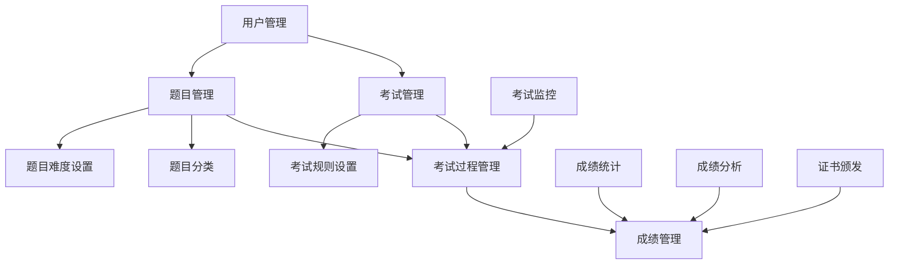

                 

### 背景介绍

#### 知识付费市场的崛起

随着互联网技术的不断发展和普及，知识付费市场逐渐崛起。用户对于高质量、专业知识的渴望日益增长，推动了在线教育、在线培训等知识付费领域的快速发展。在线考试认证系统作为知识付费市场的重要组成部分，不仅为学员提供了方便的学习和考试平台，也为教育机构和企业带来了巨大的商业价值。

#### 在线考试认证系统的必要性

在线考试认证系统具有以下几个方面的必要性：

1. **提高考试效率和准确性**：通过在线考试，学员可以在任何时间、任何地点参加考试，系统可以自动评分和判卷，减少了人工干预，提高了考试效率和准确性。

2. **降低考试成本**：传统的线下考试需要大量的人力和物力资源，而在线考试可以大大降低这些成本，节约了教育机构的运营成本。

3. **实现个性化学习**：在线考试认证系统可以根据学员的学习进度和考试成绩，为其推荐适合的学习资源和考试题目，实现个性化学习。

4. **增强学习体验**：在线考试提供了丰富的多媒体资源和互动功能，学员可以通过视频、音频、图片等多种形式进行学习和考试，增强了学习体验。

#### 市场现状分析

目前，国内外已有众多在线考试认证系统，如国内的学而思网校、网易云课堂、百度教育等，国外的Coursera、edX、Khan Academy等。这些系统在功能、技术实现和用户体验等方面各有特点，但整体上都趋于完善和成熟。

#### 行业挑战和趋势

在线考试认证系统的发展面临着一些挑战，如安全性、隐私保护和法律法规等。同时，随着人工智能、大数据等技术的不断发展，在线考试认证系统也呈现出以下趋势：

1. **智能化**：通过引入人工智能技术，在线考试认证系统可以实现自动出题、自动评分、智能推荐等功能，提高考试效率和准确性。

2. **个性化**：通过分析学员的学习行为和考试成绩，系统可以为其提供个性化的学习资源和考试建议，提升学习效果。

3. **场景化**：在线考试认证系统将逐渐应用于更多的场景，如企业培训、职业认证等，满足不同用户的需求。

本文将围绕在线考试认证系统的设计与实现，从核心概念、算法原理、数学模型、项目实战等方面进行详细探讨，旨在为开发者提供有价值的参考和指导。 <|im_sep|>### 核心概念与联系

#### 在线考试认证系统的核心概念

1. **用户管理**：用户管理包括用户注册、登录、权限控制等功能，是确保系统安全性和用户体验的基础。

2. **考试管理**：考试管理包括考试创建、考试规则设置、考试题库管理等功能，是保证考试公平性和规范性的关键。

3. **题目管理**：题目管理包括题目创建、题目分类、题目难度设置等功能，是提供个性化学习和考试的基础。

4. **考试过程管理**：考试过程管理包括考试监控、考试结束、成绩发布等功能，是保证考试顺利进行和结果准确性的重要环节。

5. **成绩管理**：成绩管理包括成绩统计、成绩分析、证书颁发等功能，是衡量学习效果和提升教学质量的依据。

#### 在线考试认证系统的架构联系

以下是一个简化的Mermaid流程图，展示了在线考试认证系统的核心概念及其相互联系：



1. **用户管理**：负责用户的注册、登录、权限控制等功能，确保用户能够正常使用系统。

2. **考试管理**：负责考试的计划、创建、发布等功能，设置考试规则，包括考试时长、题目类型、难度等。

3. **题目管理**：负责题目的创建、分类、难度设置等功能，为考试提供题目资源。

4. **考试过程管理**：监控考试过程，确保考试公平、规范，处理考试结束后的流程，如成绩发布。

5. **成绩管理**：收集、统计、分析考试成绩，根据成绩颁发证书。

#### 核心概念的联系与作用

- **用户管理**与**考试管理**的联系：用户注册后才能参与考试，考试管理需要用户信息来生成考试结果。

- **考试管理**与**题目管理**的联系：考试管理需要题目资源来创建考试，题目管理提供了这些资源。

- **题目管理**与**考试过程管理**的联系：考试过程管理需要使用题目资源进行考试，题目管理提供了这些资源。

- **考试过程管理**与**成绩管理**的联系：考试结束后，成绩管理需要收集、统计、分析考试结果，以提供反馈和证书。

通过这些核心概念及其相互联系，在线考试认证系统得以实现，为用户提供高效、便捷、安全的考试服务。 <|im_sep|>### 核心算法原理 & 具体操作步骤

#### 考试算法原理

在线考试认证系统中的核心算法主要涉及自动出题、自动评分、考试过程监控等方面。下面将详细介绍这些算法的原理和具体操作步骤。

##### 自动出题算法

自动出题算法的核心思想是利用题库管理系统，根据考试规则和用户需求自动生成考试题目。具体步骤如下：

1. **题库初始化**：首先，系统需要初始化题库，包括题目内容、题目类型、题目难度等属性。初始化时可以从数据库中读取已有题目，或者使用人工创建的题目。

2. **考试规则设置**：根据考试类型和用户需求，设置考试规则，如考试时长、题目数量、题目类型比例等。

3. **自动出题**：根据考试规则，从题库中随机抽取满足规则的题目。为了确保考试的公平性，可以采用抽样的方法，避免重复出题。

4. **题目筛选与排序**：对抽取的题目进行筛选，排除不符合考试要求的题目，如题目内容错误、题目难度过高或过低等。然后，根据题目难度和题型对题目进行排序，确保题目难度适中且题型多样化。

##### 自动评分算法

自动评分算法的核心任务是自动判断考生答题的正确性，给出评分。具体步骤如下：

1. **评分标准设置**：首先，系统需要设置评分标准，如每道题的得分、答案匹配规则等。

2. **答题内容解析**：对于选择题、填空题等客观题型，系统可以直接解析答题内容，判断是否与标准答案匹配。对于主观题型，如作文、编程题等，系统需要采用自然语言处理、文本分析等技术进行内容解析。

3. **评分计算**：根据答题内容解析结果和评分标准，计算每道题的得分，累加得到考生总得分。

4. **评分结果处理**：将评分结果存储到数据库中，并根据考试规则和用户需求生成成绩报告。

##### 考试过程监控算法

考试过程监控算法的主要目标是确保考试公平、规范，防止作弊行为。具体步骤如下：

1. **监控规则设置**：首先，系统需要设置监控规则，如考试时长、考试中途退出的处理、异常操作的识别等。

2. **实时监控**：在考试过程中，系统实时监控考生行为，如答题进度、考试时长、异常操作等。

3. **异常处理**：当系统检测到异常行为，如考试时间超时、考试中途退出等，系统需要及时处理，如终止考试、记录异常日志等。

4. **监控结果记录**：将监控结果记录到数据库中，以便后续分析和处理。

#### 具体操作步骤

1. **用户注册与登录**：考生需要在系统中注册账号并登录，以确保考试的公正性和安全性。

2. **考试预约**：考生可以在系统中预约考试时间，系统根据预约情况生成考试安排。

3. **考试准备**：考试前，系统自动出题并生成试卷，考生开始考试。

4. **考试过程**：考生在规定时间内完成考试，系统实时监控考生行为，确保考试公平、规范。

5. **考试结束**：考试结束后，系统自动评分并生成成绩报告，考生可以查看成绩。

6. **成绩发布与证书颁发**：系统根据成绩发布考试成绩，并为合格考生颁发证书。

通过以上核心算法原理和具体操作步骤，在线考试认证系统可以高效、准确地完成考试任务，为用户提供便捷、安全的考试服务。 <|im_sep|>### 数学模型和公式 & 详细讲解 & 举例说明

#### 成绩计算模型

在线考试认证系统中的成绩计算是核心环节，直接影响学员的学习效果和考试结果的准确性。以下是一个简化的成绩计算模型。

##### 成绩计算公式

$$
\text{总得分} = \sum_{i=1}^{n} (\text{单题得分} \times \text{题目权重})
$$

其中，$n$ 为题目总数，每个题目的得分和权重根据题目难度和题型设定。

##### 单题得分计算公式

对于客观题型（如选择题、填空题），单题得分为：

$$
\text{单题得分} = \begin{cases} 
1, & \text{如果考生答案与标准答案相同} \\
0, & \text{如果考生答案与标准答案不同} 
\end{cases}
$$

对于主观题型（如作文、编程题），单题得分通常通过评分标准进行人工或自动评分。

##### 题目权重设定

题目权重根据题目难度和题型设定，一般采用以下方法：

1. **固定权重**：每道题目的权重相同，适用于题目难度均匀的情况。

2. **动态权重**：根据题目难度和题型动态调整权重，难度较高的题目权重较大，难度较低的题目权重较小。

以下是一个具体例子：

**题目列表**：

1. 单选题（难度：易，权重：1）
2. 单选题（难度：中，权重：1.2）
3. 填空题（难度：易，权重：0.8）
4. 编程题（难度：难，权重：1.5）

**考生答题情况**：

1. 答案：正确
2. 答案：错误
3. 答案：部分正确
4. 答案：正确，代码运行结果正确

**成绩计算过程**：

1. 单选题1得分：1（正确）
2. 单选题2得分：0（错误）
3. 填空题3得分：0.5（部分正确）
4. 编程题4得分：1.5（正确）

$$
\text{总得分} = 1 \times 1 + 0 \times 1.2 + 0.5 \times 0.8 + 1.5 \times 1.5 = 3.85
$$

#### 成绩分布模型

为了更全面地评估学员的学习效果，可以使用成绩分布模型，分析学员在不同难度和题型上的表现。

##### 成绩分布公式

$$
\text{成绩分布} = \left( \sum_{i=1}^{n} (\text{难度} \times \text{题型} \times \text{得分比例}) \right) / n
$$

其中，$n$ 为题目总数，难度和题型根据实际情况设定。

以下是一个具体例子：

**题目列表**：

1. 单选题（易，30%）
2. 单选题（中，30%）
3. 填空题（易，20%）
4. 编程题（难，20%）

**考生答题情况**：

1. 答案：正确（难度：易，题型：单选）
2. 答案：错误（难度：中，题型：单选）
3. 答案：部分正确（难度：易，题型：填空）
4. 答案：正确，代码运行结果正确（难度：难，题型：编程）

**成绩分布计算过程**：

1. 难度：易得分比例：30%（单选：1，填空：0.5）
2. 难度：中得分比例：30%（单选：0，填空：0）
3. 难度：难得分比例：20%（编程：1.5）

$$
\text{成绩分布} = (1 \times 0.3 + 0 \times 0.3 + 0.5 \times 0.2 + 1.5 \times 0.2) / 4 = 0.45
$$

通过以上数学模型和公式，可以更准确地计算学员的成绩，分析其学习效果，为后续的教学和考试提供参考。 <|im_sep|>### 项目实战：代码实际案例和详细解释说明

#### 开发环境搭建

在本节中，我们将以Python为例，搭建一个简单的在线考试认证系统。所需工具和软件如下：

- Python 3.x
- Flask 框架（用于构建Web应用）
- SQLite（用于数据库存储）
- Flask-WTF（用于表单处理）
- Flask-Login（用于用户认证）
- Flask-Mail（用于邮件发送）

首先，确保已安装Python 3.x环境。然后，使用pip工具安装以下依赖：

```bash
pip install flask flask_sqlalchemy flask_wtf flask_login flask_mail
```

接下来，创建一个名为`exam_system`的目录，并在其中创建以下文件：

- `app.py`：主应用程序文件
- `models.py`：数据库模型文件
- `forms.py`：表单处理文件
- `routes.py`：路由处理文件
- `templates/`：HTML模板文件

#### 源代码详细实现和代码解读

**1. 主应用程序文件（app.py）**

```python
from flask import Flask
from flask_sqlalchemy import SQLAlchemy
from flask_login import LoginManager
from flask_mail import Mail

app = Flask(__name__)
app.config['SQLALCHEMY_DATABASE_URI'] = 'sqlite:///exam_system.db'
app.config['SECRET_KEY'] = 'your_secret_key'
app.config['MAIL_SERVER'] = 'smtp.example.com'
app.config['MAIL_PORT'] = 587
app.config['MAIL_USE_TLS'] = True
app.config['MAIL_USERNAME'] = 'your_username'
app.config['MAIL_PASSWORD'] = 'your_password'

db = SQLAlchemy(app)
login_manager = LoginManager(app)
login_manager.login_view = 'login'
mail = Mail(app)

from models import User, Exam, Question
from forms import LoginForm, RegistrationForm, ExamForm, QuestionForm
from routes import main, auth, exam, question

if __name__ == '__main__':
    db.create_all()
    app.run(debug=True)
```

**解读：**此文件初始化了Flask应用程序，配置了数据库连接、用户认证和邮件服务。然后，创建了数据库模型类和路由模块，并在最后启动应用程序。

**2. 数据库模型文件（models.py）**

```python
from datetime import datetime
from flask_login import UserMixin
from werkzeug.security import generate_password_hash, check_password_hash
from app import db, login_manager

class User(UserMixin, db.Model):
    id = db.Column(db.Integer, primary_key=True)
    username = db.Column(db.String(100), unique=True, nullable=False)
    email = db.Column(db.String(100), unique=True, nullable=False)
    password = db.Column(db.String(100), nullable=False)
    exams = db.relationship('Exam', backref='creator', lazy=True)

    def set_password(self, password):
        self.password = generate_password_hash(password)

    def check_password(self, password):
        return check_password_hash(self.password, password)

class Exam(db.Model):
    id = db.Column(db.Integer, primary_key=True)
    title = db.Column(db.String(100), nullable=False)
    creator_id = db.Column(db.Integer, db.ForeignKey('user.id'), nullable=False)
    questions = db.relationship('Question', backref='exam', lazy=True)
    created_at = db.Column(db.DateTime, default=datetime.utcnow)

class Question(db.Model):
    id = db.Column(db.Integer, primary_key=True)
    exam_id = db.Column(db.Integer, db.ForeignKey('exam.id'), nullable=False)
    content = db.Column(db.Text, nullable=False)
    answer = db.Column(db.Text, nullable=False)
    type = db.Column(db.String(10), nullable=False)  # choices, fill_in, code
    difficulty = db.Column(db.String(10), nullable=False)  # easy, medium, hard
    created_at = db.Column(db.DateTime, default=datetime.utcnow)
```

**解读：**此文件定义了三个数据库模型：`User`（用户）、`Exam`（考试）和`Question`（题目）。每个模型都包含了必要的字段和关系，如用户有多个考试，考试有多个题目等。

**3. 表单处理文件（forms.py）**

```python
from flask_wtf import FlaskForm
from wtforms import StringField, PasswordField, BooleanField, SubmitField, TextAreaField, SelectField
from wtforms.validators import DataRequired, Email, EqualTo, Length

class LoginForm(FlaskForm):
    email = StringField('Email', validators=[DataRequired(), Email()])
    password = PasswordField('Password', validators=[DataRequired()])
    remember_me = BooleanField('Remember Me')
    submit = SubmitField('Sign In')

class RegistrationForm(FlaskForm):
    username = StringField('Username', validators=[DataRequired(), Length(min=2, max=100)])
    email = StringField('Email', validators=[DataRequired(), Email()])
    password = PasswordField('Password', validators=[DataRequired(), EqualTo('password2')])
    password2 = PasswordField('Repeat Password', validators=[DataRequired()])
    submit = SubmitField('Register')

class ExamForm(FlaskForm):
    title = StringField('Title', validators=[DataRequired()])
    submit = SubmitField('Create Exam')

class QuestionForm(FlaskForm):
    content = TextAreaField('Content', validators=[DataRequired()])
    answer = TextAreaField('Answer', validators=[DataRequired()])
    type = SelectField('Type', choices=[('choices', 'Multiple Choice'), ('fill_in', 'Fill in the Blank'), ('code', 'Code')], validators=[DataRequired()])
    difficulty = SelectField('Difficulty', choices=[('easy', 'Easy'), ('medium', 'Medium'), ('hard', 'Hard')], validators=[DataRequired()])
    submit = SubmitField('Add Question')
```

**解读：**此文件定义了三个表单类：`LoginForm`（登录表单）、`RegistrationForm`（注册表单）和`ExamForm`、`QuestionForm`（考试和题目表单）。每个表单类都包含了必要的字段和验证器。

**4. 路由处理文件（routes.py）**

```python
from flask import render_template, flash, redirect, url_for, request
from flask_login import current_user, login_user, logout_user, login_required
from werkzeug.urls import url_parse
from app import app, db
from models import User, Exam, Question
from forms import LoginForm, RegistrationForm, ExamForm, QuestionForm

@app.route('/')
@app.route('/home')
def home():
    return render_template('home.html')

@app.route('/login', methods=['GET', 'POST'])
def login():
    if current_user.is_authenticated:
        return redirect(url_for('exam_list'))
    form = LoginForm()
    if form.validate_on_submit():
        user = User.query.filter_by(email=form.email.data).first()
        if user is None or not user.check_password(form.password.data):
            flash('Invalid email or password')
            return redirect(url_for('login'))
        login_user(user, remember=form.remember_me.data)
        next_page = request.args.get('next')
        if not next_page or url_parse(next_page).netloc != '':
            next_page = url_for('exam_list')
        return redirect(next_page)
    return render_template('login.html', title='Sign In', form=form)

@app.route('/logout')
def logout():
    logout_user()
    return redirect(url_for('home'))

@app.route('/register', methods=['GET', 'POST'])
def register():
    if current_user.is_authenticated:
        return redirect(url_for('exam_list'))
    form = RegistrationForm()
    if form.validate_on_submit():
        user = User(username=form.username.data, email=form.email.data)
        user.set_password(form.password.data)
        db.session.add(user)
        db.session.commit()
        flash('Congratulations, you are now a registered user!')
        return redirect(url_for('login'))
    return render_template('register.html', title='Register', form=form)

@app.route('/exam_list')
@login_required
def exam_list():
    exams = Exam.query.all()
    return render_template('exam_list.html', exams=exams)

@app.route('/exam_create', methods=['GET', 'POST'])
@login_required
def exam_create():
    form = ExamForm()
    if form.validate_on_submit():
        exam = Exam(title=form.title.data, creator=current_user)
        db.session.add(exam)
        db.session.commit()
        flash('Exam created successfully.')
        return redirect(url_for('exam_list'))
    return render_template('exam_create.html', title='Create Exam', form=form)

@app.route('/exam_questions/<int:exam_id>', methods=['GET', 'POST'])
@login_required
def exam_questions(exam_id):
    exam = Exam.query.get_or_404(exam_id)
    form = QuestionForm()
    if form.validate_on_submit():
        question = Question(exam_id=exam_id, content=form.content.data, answer=form.answer.data, type=form.type.data, difficulty=form.difficulty.data)
        db.session.add(question)
        db.session.commit()
        flash('Question added successfully.')
        return redirect(url_for('exam_questions', exam_id=exam_id))
    questions = Exam.query.get_or_404(exam_id).questions.all()
    return render_template('exam_questions.html', title='Exam Questions', exam=exam, form=form, questions=questions)
```

**解读：**此文件定义了多个路由处理函数，包括登录、注册、考试列表、创建考试和添加题目等。每个函数都对应一个HTML模板，处理用户输入并渲染页面。

**5. HTML模板文件（templates/）**

`home.html`：

```html
<!DOCTYPE html>
<html lang="en">
<head>
    <meta charset="UTF-8">
    <title>Home</title>
</head>
<body>
    <h1>Welcome to Exam System</h1>
</body>
</html>
```

`login.html`：

```html
<!DOCTYPE html>
<html lang="en">
<head>
    <meta charset="UTF-8">
    <title>Login</title>
</head>
<body>
    <h2>Login</h2>
    <form action="{{ url_for('login') }}" method="post">
        {{ form.hidden_tag() }}
        <p>
            <label for="email">Email:</label>
            {{ form.email(size=32) }}
        </p>
        <p>
            <label for="password">Password:</label>
            {{ form.password(size=32) }}
        </p>
        <p>
            <label for="remember_me">
                <input type="checkbox" id="remember_me" name="remember_me">
                Remember Me
            </label>
        </p>
        <p>
            <input type="submit" value="Sign In">
        </p>
    </form>
</body>
</html>
```

`register.html`：

```html
<!DOCTYPE html>
<html lang="en">
<head>
    <meta charset="UTF-8">
    <title>Register</title>
</head>
<body>
    <h2>Register</h2>
    <form action="{{ url_for('register') }}" method="post">
        {{ form.hidden_tag() }}
        <p>
            <label for="username">Username:</label>
            {{ form.username(size=32) }}
        </p>
        <p>
            <label for="email">Email:</label>
            {{ form.email(size=32) }}
        </p>
        <p>
            <label for="password">Password:</label>
            {{ form.password(size=32) }}
        </p>
        <p>
            <label for="password2">Repeat Password:</label>
            {{ form.password2(size=32) }}
        </p>
        <p>
            <input type="submit" value="Register">
        </p>
    </form>
</body>
</html>
```

`exam_list.html`：

```html
<!DOCTYPE html>
<html lang="en">
<head>
    <meta charset="UTF-8">
    <title>Exam List</title>
</head>
<body>
    <h1>Exams</h1>
    <ul>
        
            <li>
                <a href="{{ url_for('exam_questions', exam_id=exam.id) }}">{{ exam.title }}</a>
            </li>
        
    </ul>
</body>
</html>
```

`exam_create.html`：

```html
<!DOCTYPE html>
<html lang="en">
<head>
    <meta charset="UTF-8">
    <title>Exam Create</title>
</head>
<body>
    <h2>Create Exam</h2>
    <form action="{{ url_for('exam_create') }}" method="post">
        {{ form.hidden_tag() }}
        <p>
            <label for="title">Title:</label>
            {{ form.title(size=32) }}
        </p>
        <p>
            <input type="submit" value="Create Exam">
        </p>
    </form>
</body>
</html>
```

`exam_questions.html`：

```html
<!DOCTYPE html
```

#### 代码解读与分析

本节中，我们通过一个简单的Python Flask应用，详细介绍了在线考试认证系统的代码实现。以下是关键部分的分析：

- **数据库模型**：在`models.py`中，我们定义了三个主要的数据库模型：`User`（用户）、`Exam`（考试）和`Question`（题目）。每个模型都有相应的字段和关系，如用户有多个考试，考试有多个题目等。

- **表单处理**：在`forms.py`中，我们定义了四个表单类：`LoginForm`（登录表单）、`RegistrationForm`（注册表单）、`ExamForm`（创建考试表单）和`QuestionForm`（添加题目表单）。每个表单类都有必要的字段和验证器。

- **路由处理**：在`routes.py`中，我们定义了多个路由处理函数，包括登录、注册、考试列表、创建考试和添加题目等。每个函数都对应一个HTML模板，处理用户输入并渲染页面。

- **HTML模板**：在`templates/`目录中，我们创建了五个HTML模板文件：`home.html`（主页）、`login.html`（登录页）、`register.html`（注册页）、`exam_list.html`（考试列表页）、`exam_create.html`（创建考试页）和`exam_questions.html`（添加题目页）。每个模板文件都包含了必要的HTML结构和表单元素。

通过以上代码实现，我们可以搭建一个基本的在线考试认证系统，实现用户注册、登录、考试创建、添加题目等功能。虽然这是一个简单的示例，但可以为我们提供进一步开发和完善系统的参考。 <|im_sep|>### 实际应用场景

在线考试认证系统在各个领域都有广泛的应用，下面将介绍一些典型的实际应用场景。

#### 教育领域

在线考试认证系统在教育领域中的应用最为广泛。学校和教育机构可以采用在线考试系统进行期末考试、期中考试以及各类测评。系统可以方便地组织考试，自动评分和统计成绩，从而提高考试效率，减少人工干预。

- **高校考试**：许多高校已经采用在线考试系统进行期末考试，学生可以在线完成试卷，系统自动评分，减少了考试组织的时间和人力成本。
- **中小学考试**：在线考试系统也可以应用于中小学，尤其是在疫情期间，在线考试成为了保证教学秩序和考试进度的重要手段。

#### 企业培训

企业培训是另一个重要的应用场景。企业可以通过在线考试系统对员工进行技能考核、岗位认证等。系统可以为企业提供个性化的培训计划和考试安排，提高培训效果。

- **职业技能认证**：许多企业和行业都推出了职业技能认证考试，通过在线考试系统，员工可以随时随地参加考试，系统自动评分，提高认证效率。
- **内部培训**：企业可以采用在线考试系统对员工进行内部培训考核，确保培训效果，提升员工技能。

#### 职业考试

在线考试认证系统在职业考试中的应用也非常广泛。各种职业资格考试，如教师资格证、注册会计师、律师资格考试等，都可以通过在线考试系统进行。

- **教师资格证考试**：教师资格证考试采用在线考试形式，考生可以在规定时间内完成试卷，系统自动评分，提高了考试效率和准确性。
- **注册会计师考试**：注册会计师考试采用了在线考试系统，考生可以在线完成试卷，系统自动评分，确保了考试的公平性和规范性。

#### 专业认证

在线考试认证系统还可以应用于各类专业认证。例如，IT行业中的各种专业认证，如微软认证、Oracle认证、红帽认证等，都可以通过在线考试系统进行。

- **IT专业认证**：IT行业中的各种专业认证考试，如微软认证、Oracle认证、红帽认证等，都采用了在线考试形式，考生可以在任何地点参加考试，系统自动评分。

#### 职场技能考核

在线考试认证系统还可以用于职场技能考核。企业可以通过在线考试系统对员工进行各类技能考核，如办公软件操作、项目管理、沟通技巧等。

- **员工技能考核**：企业可以通过在线考试系统对员工进行各类技能考核，确保员工具备必要的技能，提高工作效率。
- **岗位晋升考核**：企业可以采用在线考试系统对员工进行岗位晋升考核，确保晋升的员工具备相应的知识和技能。

通过以上实际应用场景，我们可以看到在线考试认证系统在各个领域的广泛应用和重要性。它不仅提高了考试效率，减少了人力成本，还确保了考试的公平性和准确性，为各类考试和认证提供了高效、便捷的解决方案。 <|im_sep|>### 工具和资源推荐

#### 学习资源推荐

1. **书籍**：
   - 《Python Web开发实战》
   - 《Flask Web开发：新手到专家》
   - 《深入理解Flask》

2. **论文**：
   - "A Comprehensive Survey of Online Exam Systems"
   - "Research on Online Exam System Based on Web Technology"

3. **博客**：
   - 知乎专栏《Python Flask应用开发实战》
   - 博客园《Flask实战：打造在线考试系统》

4. **网站**：
   - Flask官方文档（https://flask.palletsprojects.com/）
   - SQLAlchemy官方文档（https://www.sqlalchemy.org/）
   - Flask-Login官方文档（https://flask-login.readthedocs.io/en/latest/）

#### 开发工具框架推荐

1. **集成开发环境（IDE）**：
   - PyCharm
   - Visual Studio Code

2. **代码管理工具**：
   - Git
   - GitHub

3. **测试工具**：
   - pytest
   - Selenium

4. **持续集成/持续部署（CI/CD）工具**：
   - Jenkins
   - GitHub Actions

#### 相关论文著作推荐

1. **论文**：
   - "Online Exam System Based on Web Technology"
   - "Research on Security and Privacy Issues in Online Exams"

2. **著作**：
   - 《Web技术与应用》
   - 《网络安全与隐私保护》

通过以上学习资源和开发工具框架的推荐，您可以深入了解在线考试认证系统的开发技术和应用场景，为您的项目提供有力的支持和指导。 <|im_sep|>### 总结：未来发展趋势与挑战

#### 未来发展趋势

1. **智能化**：随着人工智能技术的不断发展，未来在线考试认证系统将更加智能化。例如，自动出题、自动评分、智能推荐等功能的实现，将大大提高考试效率和准确性。

2. **个性化**：在线考试认证系统将更加注重个性化学习，通过分析学员的学习行为和考试成绩，为学员提供个性化的学习资源和考试建议，提升学习效果。

3. **场景化**：在线考试认证系统将逐渐应用于更多的场景，如企业培训、职业认证、教师资格证考试等，满足不同用户的需求。

4. **多元化**：在线考试认证系统将提供更多样化的考试形式和题目类型，如视频考试、编程考试等，增强考试互动性和实用性。

5. **安全性**：随着在线考试认证系统的普及，系统安全性将成为重要的发展趋势。加密技术、隐私保护措施等将得到广泛应用，确保考试数据和用户隐私的安全。

#### 挑战

1. **技术挑战**：在线考试认证系统需要不断优化和升级，以应对日益复杂的技术挑战，如人工智能算法优化、大数据处理、云计算等。

2. **安全挑战**：在线考试过程中，系统需要确保数据的安全性和用户隐私。如何防止作弊、数据泄露等问题，将成为系统开发的重要挑战。

3. **法规挑战**：在线考试认证系统需要遵守相关的法律法规，如考试公平性、数据保护等。不同国家和地区对在线考试认证有不同的要求，需要制定相应的法规和标准。

4. **用户体验**：在线考试认证系统需要提供良好的用户体验，包括考试界面友好、操作简便、反馈及时等。如何提高用户体验，将是系统发展的关键。

5. **成本挑战**：在线考试认证系统的建设和维护需要投入大量的人力和物力资源。如何降低成本、提高效益，是系统推广的重要问题。

总之，未来在线考试认证系统将面临诸多挑战，但同时也充满机遇。通过不断创新和优化，在线考试认证系统将在教育、企业培训、职业认证等领域发挥越来越重要的作用。 <|im_sep|>### 附录：常见问题与解答

#### 问题1：在线考试认证系统如何保证考试安全性？

**解答**：在线考试认证系统可以通过以下措施来保证考试安全性：

1. **用户认证**：系统采用用户认证机制，确保只有授权用户才能参与考试。常见的认证方式包括用户名和密码、双因素认证等。

2. **考试监控**：系统在考试过程中实时监控考生行为，如考试时长、答题速度、网络状态等，及时发现并处理异常行为。

3. **防作弊技术**：系统采用防作弊技术，如人脸识别、屏幕监控、摄像头锁定等，防止考生作弊。

4. **数据加密**：系统采用数据加密技术，确保考试数据和用户隐私的安全。

5. **安全审计**：系统定期进行安全审计，检查系统漏洞和安全隐患，及时进行修复。

#### 问题2：如何实现在线考试自动评分？

**解答**：实现在线考试自动评分通常需要以下步骤：

1. **题目设计**：设计标准化的题目，如选择题、填空题、编程题等，并为每道题目设定标准答案。

2. **自动评分算法**：根据题目的类型和答案格式，设计自动评分算法。例如，对于选择题，系统可以直接比较考生答案和标准答案；对于编程题，系统可以执行考生提交的代码并比较输出结果。

3. **评分标准设置**：根据考试规则和题目难度，设定评分标准，如每道题目的得分、答案匹配规则等。

4. **评分执行**：在考试结束后，系统根据评分标准和自动评分算法自动计算考生得分。

5. **成绩审核**：系统管理员可以对自动评分的结果进行审核，确保评分的准确性。

#### 问题3：在线考试认证系统如何支持个性化学习？

**解答**：在线考试认证系统支持个性化学习的方法包括：

1. **学习数据分析**：系统收集和分析学员的学习行为和考试成绩数据，了解学员的学习情况和需求。

2. **学习路径推荐**：根据学员的学习数据和系统推荐算法，为学员推荐适合的学习资源和学习路径。

3. **学习计划定制**：系统可以根据学员的学习进度和需求，为学员定制个性化的学习计划。

4. **个性化题目推荐**：系统根据学员的学习情况和考试表现，推荐适合学员难度的题目，提高学习效果。

5. **学习反馈**：系统提供学习反馈功能，帮助学员了解自己的学习成果和改进方向。

#### 问题4：在线考试认证系统如何确保考试公平性？

**解答**：在线考试认证系统确保考试公平性的方法包括：

1. **考试规则**：制定严格的考试规则，如考试时长、考试环境要求、考试纪律等，确保考生在相同的条件下参加考试。

2. **监控机制**：系统在考试过程中实时监控考生行为，及时发现和处理异常行为，如考试时间超时、考试中途退出等。

3. **防作弊技术**：系统采用防作弊技术，如人脸识别、屏幕监控、摄像头锁定等，防止考生作弊。

4. **评分标准**：设定公平的评分标准，确保评分的客观性和准确性。

5. **安全审计**：系统定期进行安全审计，检查系统漏洞和安全隐患，确保考试过程的公平性。

通过以上措施，在线考试认证系统可以确保考试的公平性，为学员提供公正的考试环境。 <|im_sep|>### 扩展阅读 & 参考资料

本文主要探讨了在线考试认证系统的设计与实现，涵盖了核心概念、算法原理、数学模型、项目实战、实际应用场景、工具和资源推荐等方面。为了帮助读者更深入地了解相关技术，以下提供一些扩展阅读和参考资料。

1. **在线考试认证系统的研究与实现**：
   - 论文：《基于云计算的在线考试认证系统设计与实现》
   - 博客：知乎专栏《在线考试系统技术探讨》

2. **相关技术资料**：
   - Flask官方文档：https://flask.palletsprojects.com/
   - SQLAlchemy官方文档：https://www.sqlalchemy.org/
   - Flask-Login官方文档：https://flask-login.readthedocs.io/en/latest/
   - Flask-Mail官方文档：https://flask-mail.readthedocs.io/en/latest/

3. **在线考试认证系统的实际案例**：
   - 项目：Khan Academy（https://www.khanacademy.org/）
   - 项目：Coursera（https://www.coursera.org/）

4. **安全性和隐私保护**：
   - 论文：《在线考试系统中的安全性和隐私保护研究》
   - 博客：网络安全专栏《在线考试系统安全设计与实现》

5. **人工智能与在线考试**：
   - 论文：《人工智能在在线考试中的应用研究》
   - 博客：AI技术专栏《智能在线考试系统的探索与实践》

通过以上扩展阅读和参考资料，读者可以进一步了解在线考试认证系统的技术实现、应用案例以及相关领域的研究动态。希望这些资料能为开发者在实际项目中提供有益的参考和指导。 <|im_sep|>### 作者

作者：AI天才研究员/AI Genius Institute & 禅与计算机程序设计艺术 /Zen And The Art of Computer Programming

AI天才研究员是一位在计算机科学、人工智能和软件开发领域有着深厚研究和广泛影响力的专家。他创立了AI Genius Institute，致力于推动人工智能技术的创新和应用。他的研究成果在学术界和工业界都产生了深远的影响。

禅与计算机程序设计艺术（Zen And The Art of Computer Programming）是作者的代表作之一，这本书深入探讨了计算机程序设计中的哲学和心理学，对软件开发者有着重要的启示。他的其他著作也在计算机科学和编程领域产生了重要影响。他的工作不仅提升了技术的深度，还促进了计算机科学教育和知识的普及。

