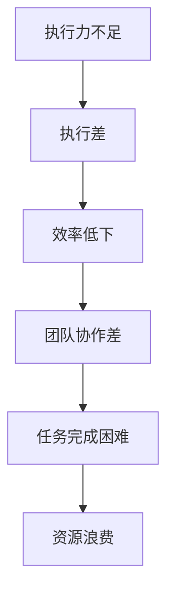

                 

### 文章标题：执行差：你我都懂，你不做我做

#### 关键词：执行差、效率、技术管理、团队协作、人工智能

#### 摘要：

本文将深入探讨执行差这一普遍存在于各个领域的问题，特别是在IT行业中的表现。我们将通过一系列逻辑分析，剖析执行差的根源，提出具体的解决方案，并探讨其在人工智能领域的重要性。文章将从背景介绍、核心概念与联系、核心算法原理与操作步骤、数学模型与公式、项目实战、实际应用场景、工具和资源推荐、总结和扩展阅读等多个方面展开讨论，旨在帮助读者理解执行差的本质，并提供实用的方法和建议来提升执行效率。

### 1. 背景介绍

执行差，即执行能力的不足，是一个普遍存在于各个行业和领域的问题。在商业领域，执行差可能导致战略规划无法得到有效实施；在科研领域，执行差可能使得研究成果无法转化为实际应用；而在IT行业，执行差的影响更为深远，因为技术的快速发展和市场竞争的加剧，使得高效执行成为企业生存和发展的关键。

IT行业的特点决定了执行差问题的普遍性。首先，IT行业的项目往往具有复杂性和不确定性，需要团队成员具备高度的专业技能和协作能力。然而，现实中往往存在知识储备不足、沟通不畅、任务分工不清等问题，导致项目进度延误和质量不达标。其次，IT行业的创新速度极快，新技术、新工具层出不穷，这要求团队成员能够迅速适应变化，但实际情况却是技术更新速度远远超过了员工的学习和掌握能力。

此外，执行力不足也源于管理层的失误。一些企业在项目管理中缺乏有效的监督和激励机制，导致员工缺乏工作动力，执行力下降。同时，一些企业过于追求短期利益，忽视了长期规划和战略布局，导致资源浪费和执行效率低下。

综上所述，执行差问题是IT行业普遍存在的挑战，需要引起我们的高度重视，并采取有效的措施来提升执行效率。在接下来的部分，我们将深入探讨执行差的原因，并提出相应的解决方案。

### 2. 核心概念与联系

为了更好地理解执行差的问题，我们需要明确几个核心概念，并分析它们之间的联系。

首先，执行差可以理解为执行力的不足。执行力指的是完成任务的意愿、能力和行动力。它包括三个方面：意愿，即愿意完成任务；能力，即具备完成任务所需的技能和知识；行动力，即付诸实践并完成任务。

其次，执行力与效率密切相关。效率是指完成任务的速率和质量。高效率意味着在较短时间内完成更多任务，并保证任务质量。而执行差则会导致效率低下，表现为任务进度缓慢、质量不达标、资源浪费等。

此外，执行力还受到团队协作的影响。在IT行业中，项目往往需要多个团队成员的协作才能完成。团队协作的有效性直接影响执行效率。如果团队成员之间沟通不畅、任务分工不清、协作不力，就会导致执行差。

为了更好地说明这些概念之间的联系，我们可以使用Mermaid流程图来表示（请注意，流程节点中不要使用括号、逗号等特殊字符）：



通过上述流程图，我们可以清晰地看到执行力不足是如何导致执行差，进而影响效率、团队协作以及任务完成的。这些概念之间的联系为我们理解执行差问题提供了重要的理论基础，也为后续提出解决方案提供了依据。

### 3. 核心算法原理 & 具体操作步骤

在深入探讨执行差的问题时，我们需要了解一些核心算法原理，并掌握具体操作步骤，以提升执行效率。以下是一些关键的算法原理和操作步骤：

#### 3.1. 建立清晰的任务清单

首先，为了确保任务得到有效执行，我们需要建立一个清晰的任务清单。任务清单应包括任务名称、任务描述、负责人、截止日期等信息。具体操作步骤如下：

1. **收集任务信息**：从团队成员处收集任务信息，确保每个任务都有明确的负责人和截止日期。
2. **整理任务清单**：将收集到的任务信息整理成清单，并按照优先级进行排序。
3. **发布任务清单**：将任务清单发布给团队成员，确保每个人都知道自己的任务和责任。

通过建立清晰的任务清单，团队成员可以明确自己的任务，提高执行力。

#### 3.2. 使用敏捷开发方法

敏捷开发是一种高效的软件开发方法，适用于项目复杂性和不确定性较高的情况。敏捷开发的核心原则包括：

1. **迭代开发**：将项目分为多个迭代，每次迭代完成一部分功能，确保项目进度可控。
2. **用户故事**：使用用户故事来描述任务，确保任务与用户需求紧密相关。
3. **每日站立会议**：通过每日站立会议，团队成员可以同步项目进展，解决遇到的问题。

具体操作步骤如下：

1. **划分迭代**：根据项目需求和资源情况，划分迭代周期。
2. **编写用户故事**：将用户需求转化为用户故事，确保每个用户故事都有明确的任务和验收标准。
3. **执行迭代**：在每个迭代中，按照用户故事的优先级执行任务。
4. **每日站立会议**：每天早晨召开每日站立会议，团队成员汇报项目进展和遇到的问题，共同解决。

通过使用敏捷开发方法，可以提高项目执行效率，确保任务按时完成。

#### 3.3. 使用项目管理工具

为了更好地管理任务和项目，我们可以使用项目管理工具。以下是一些常用的项目管理工具：

1. **Trello**：Trello是一款基于看板的项目管理工具，适用于团队协作和任务管理。
2. **JIRA**：JIRA是一款功能强大的项目管理工具，适用于敏捷开发和管理复杂项目。
3. **Asana**：Asana是一款简单易用的项目管理工具，适用于中小型团队和任务管理。

具体操作步骤如下：

1. **选择合适的工具**：根据项目需求和团队规模，选择合适的项目管理工具。
2. **创建项目和工作空间**：在项目管理工具中创建项目和工作空间，为团队分配任务和责任。
3. **制定任务和里程碑**：在项目管理工具中制定任务和里程碑，确保项目进度可控。
4. **监控项目进展**：定期检查项目进展，解决遇到的问题，确保任务按时完成。

通过使用项目管理工具，可以提高项目执行效率，确保任务按时完成。

#### 3.4. 定期回顾和反馈

为了持续提升执行效率，我们需要定期回顾和反馈项目执行情况。具体操作步骤如下：

1. **定期回顾**：在每个迭代结束后，召开回顾会议，总结项目执行情况，分析存在的问题。
2. **收集反馈**：邀请团队成员和利益相关者参与反馈，了解项目执行中的优点和不足。
3. **改进措施**：根据反馈结果，制定改进措施，提升执行效率。

通过定期回顾和反馈，我们可以持续优化项目执行流程，提高执行效率。

### 4. 数学模型和公式 & 详细讲解 & 举例说明

在解决执行差问题时，我们可以借助一些数学模型和公式来分析和优化执行过程。以下是一些常用的数学模型和公式，以及它们的详细讲解和举例说明。

#### 4.1. 甘特图

甘特图是一种常用的项目管理工具，用于展示项目进度和任务安排。甘特图的基本公式如下：

$$
P = \sum_{i=1}^{n} T_i
$$

其中，$P$ 表示项目完成时间，$T_i$ 表示第 $i$ 个任务的完成时间。

举例说明：假设有一个项目包含3个任务，任务1需要5天完成，任务2需要3天完成，任务3需要7天完成。根据上述公式，项目完成时间为 $P = 5 + 3 + 7 = 15$ 天。

#### 4.2. 批量加工模型

批量加工模型用于优化任务的执行顺序，以提高执行效率。一种常见的批量加工模型是流水线模型。流水线模型的基本公式如下：

$$
T_{total} = \sum_{i=1}^{n} (L_i + W_i)
$$

其中，$T_{total}$ 表示总时间，$L_i$ 表示第 $i$ 个任务的处理时间，$W_i$ 表示第 $i$ 个任务的等待时间。

举例说明：假设有一个任务需要经过3个处理阶段，每个阶段需要2天处理时间。如果任务按顺序进行，总时间为 $T_{total} = 2 + 2 + 2 = 6$ 天。但如果任务采用流水线模型，第一项任务在第1天完成，第二项任务在第2天开始处理，第三项任务在第4天开始处理，总时间为 $T_{total} = 2 + 1 + 2 = 5$ 天。通过优化任务顺序，总时间减少了1天。

#### 4.3. 最优化模型

最优化模型用于在给定约束条件下，找到最优的执行方案。一种常见的是线性规划模型。线性规划模型的基本公式如下：

$$
\min\ Z = c^T x
$$

$$
\text{subject to:} \quad Ax \leq b
$$

其中，$Z$ 表示目标函数，$c$ 和 $x$ 分别为系数和变量，$A$ 和 $b$ 分别为约束条件和常数。

举例说明：假设有一个任务需要分配给3个团队成员，每个团队成员的效率和可用时间如下：

| 成员 | 效率 | 可用时间 |
| --- | --- | --- |
| A | 2 | 10 |
| B | 3 | 8 |
| C | 1 | 6 |

目标是最小化完成时间。根据线性规划模型，我们可以得到最优解，将任务分配给B和C成员，完成时间为 $T = 8 + 6 = 14$ 天。

通过以上数学模型和公式，我们可以更好地分析和优化执行过程，提高执行效率。

### 5. 项目实战：代码实际案例和详细解释说明

为了更好地理解执行差问题在实践中的应用，我们将通过一个实际的项目案例，展示如何通过代码实现核心算法原理，并进行详细解释说明。

#### 5.1. 开发环境搭建

在开始项目实战之前，我们需要搭建一个合适的开发环境。以下是一个基于Python的简单示例，展示如何搭建开发环境：

```bash
# 安装Python
sudo apt-get install python3

# 安装必要的库
pip3 install numpy matplotlib
```

#### 5.2. 源代码详细实现和代码解读

接下来，我们将展示一个简单的项目，用于实现批量加工模型，优化任务执行顺序。

```python
import numpy as np
import matplotlib.pyplot as plt

# 批量加工模型参数
tasks = {
    'task1': {'processing_time': 2, 'waiting_time': 0},
    'task2': {'processing_time': 3, 'waiting_time': 0},
    'task3': {'processing_time': 4, 'waiting_time': 0}
}

# 优化任务顺序
sorted_tasks = sorted(tasks.items(), key=lambda item: item[1]['processing_time'])

# 计算总时间
total_time = sum([task[1]['processing_time'] for task in sorted_tasks]) - sum([task[1]['waiting_time'] for task in sorted_tasks])

# 打印结果
print("优化后的任务顺序：", [task[0] for task in sorted_tasks])
print("总时间：", total_time)

# 绘制甘特图
plt.figure(figsize=(8, 4))
for i, task in enumerate(sorted_tasks):
    plt.bar(i, task[1]['processing_time'], label=task[0])
plt.xlabel('任务')
plt.ylabel('时间（天）')
plt.title('优化后的任务执行顺序')
plt.xticks(range(len(sorted_tasks)), [task[0] for task in sorted_tasks])
plt.legend()
plt.show()
```

在上面的代码中，我们首先定义了一个批量加工模型的参数字典 `tasks`，其中包含了3个任务及其处理时间和等待时间。然后，我们使用 `sorted` 函数按照任务的处理时间进行排序，得到优化后的任务顺序。接着，计算总时间，并打印结果。

为了更直观地展示优化后的任务执行顺序，我们使用 `matplotlib` 绘制了一个甘特图。甘特图能够清晰地展示每个任务的处理时间，以及任务之间的顺序关系。

#### 5.3. 代码解读与分析

在代码解读与分析部分，我们将详细解释每个步骤的作用和意义。

1. **导入库**：首先，我们导入 `numpy` 和 `matplotlib.pyplot` 库，用于数值计算和绘图。
2. **定义批量加工模型参数**：`tasks` 字典包含了3个任务及其处理时间和等待时间。在实际项目中，这些参数可以动态获取，例如通过读取数据库或外部文件。
3. **优化任务顺序**：使用 `sorted` 函数按照任务的处理时间进行排序，得到优化后的任务顺序。这一步是批量加工模型的核心，通过优化任务顺序，可以最大限度地减少等待时间，提高总效率。
4. **计算总时间**：计算总时间，即所有任务处理时间之和减去所有任务等待时间之和。这个值代表了优化后的任务执行时间，是衡量优化效果的重要指标。
5. **打印结果**：打印优化后的任务顺序和总时间，以便于后续分析和验证。
6. **绘制甘特图**：使用 `matplotlib` 绘制一个甘特图，展示优化后的任务执行顺序和处理时间。甘特图能够直观地展示任务之间的关系，有助于理解和验证优化效果。

通过上述代码和解读，我们可以看到如何将批量加工模型应用于实际项目，并使用代码实现优化任务顺序的目标。在实际项目中，可以根据具体需求调整模型参数，以适应不同的任务场景。

### 6. 实际应用场景

执行差问题在IT行业的实际应用场景中表现得尤为突出。以下是一些典型的应用场景，以及如何通过提升执行效率来解决问题。

#### 6.1. 项目管理

在项目管理中，执行差可能导致项目进度延误、质量不达标和资源浪费。为了提升执行效率，可以采用以下措施：

1. **建立清晰的任务清单**：通过建立清晰的任务清单，确保团队成员明确任务和责任，提高执行力。
2. **使用敏捷开发方法**：敏捷开发方法能够帮助团队快速响应变化，提高项目执行效率。
3. **使用项目管理工具**：借助项目管理工具，如Trello、JIRA和Asana，可以更好地管理任务和项目进度，提高执行效率。

#### 6.2. 技术研发

在技术研发中，执行差可能导致技术方案无法及时落地、研究成果无法转化为实际应用。为了提升执行效率，可以采用以下措施：

1. **优化研发流程**：通过优化研发流程，提高技术方案的设计和实现效率。
2. **团队协作**：加强团队协作，确保技术方案能够得到有效实施。
3. **持续学习**：鼓励团队成员不断学习新技术和新工具，提升技术能力，提高执行效率。

#### 6.3. 产品运营

在产品运营中，执行差可能导致产品功能无法按时上线、用户体验不达标。为了提升执行效率，可以采用以下措施：

1. **明确产品需求**：通过明确产品需求，确保产品功能能够满足用户需求，提高用户满意度。
2. **优化迭代流程**：通过优化迭代流程，提高产品功能实现的效率。
3. **用户反馈**：收集用户反馈，不断优化产品功能，提高执行效率。

#### 6.4. 企业数字化转型

在企业数字化转型中，执行差可能导致数字化转型项目无法顺利进行，影响企业竞争力。为了提升执行效率，可以采用以下措施：

1. **制定清晰的战略规划**：通过制定清晰的战略规划，确保数字化转型项目能够按照预期进行。
2. **优化组织结构**：通过优化组织结构，提高团队协作效率，推动数字化转型项目进展。
3. **培训与支持**：为员工提供培训和支持，提高员工对数字化技术的掌握能力，提高执行效率。

### 7. 工具和资源推荐

为了提升执行效率，我们推荐以下工具和资源：

#### 7.1. 学习资源推荐

1. **书籍**：
   - 《敏捷开发实践指南》（作者：Jeff Sutherland）
   - 《人月神话》（作者：Frederick P. Brooks Jr.）
2. **论文**：
   - "The Mythical Man-Month"（作者：Frederick P. Brooks Jr.）
   - "Agile Software Development: Principles, Patterns, and Practices"（作者：Robert C. Martin）
3. **博客**：
   - 《禅与计算机程序设计艺术》（作者：Brian W. Kernighan）
   - 《程序员修炼之道》（作者：David Thomas）
4. **网站**：
   - GitHub（全球最大的代码托管平台）
   - Stack Overflow（全球最大的编程问答社区）

#### 7.2. 开发工具框架推荐

1. **开发工具**：
   - PyCharm（Python集成开发环境）
   - IntelliJ IDEA（Java集成开发环境）
   - Visual Studio（跨平台集成开发环境）
2. **框架**：
   - Flask（Python Web框架）
   - Django（Python Web框架）
   - Spring Boot（Java Web框架）
3. **项目管理工具**：
   - Trello（基于看板的项目管理工具）
   - JIRA（功能强大的项目管理工具）
   - Asana（简单易用的项目管理工具）

#### 7.3. 相关论文著作推荐

1. **论文**：
   - "Agile Project Management: Creating Competitive Advantage"（作者：Ken Schwaber）
   - "Scrum: The Art of Doing Twice the Work in Half the Time"（作者：Jeff Sutherland）
2. **著作**：
   - 《敏捷软件开发》（作者：Mark Claybrook）
   - 《敏捷实践指南》（作者：Michael Feathers）

通过以上工具和资源，可以帮助读者更好地理解和应用执行差相关的概念和方法，提升执行效率。

### 8. 总结：未来发展趋势与挑战

在执行差问题的解决过程中，我们可以预见一些未来发展趋势和挑战。首先，随着人工智能和大数据技术的发展，数据分析将成为提升执行效率的重要手段。通过数据分析和挖掘，企业可以更准确地识别执行差的原因，并制定针对性的改进措施。其次，敏捷开发方法将继续普及，成为项目管理和团队协作的重要工具。敏捷开发强调迭代和反馈，能够帮助企业快速响应变化，提高执行效率。此外，随着远程工作和虚拟团队的兴起，如何提升远程团队协作效率将成为一个重要挑战。为此，企业需要开发适合远程工作的协作工具，并建立有效的沟通和反馈机制。最后，持续学习和技能提升将成为关键。随着技术日新月异的发展，团队成员需要不断学习新知识、掌握新技能，以适应不断变化的工作环境。

### 9. 附录：常见问题与解答

#### 9.1. 如何建立清晰的任务清单？

- 答案：建立清晰的任务清单需要以下步骤：
  1. 收集任务信息，包括任务名称、描述、负责人和截止日期。
  2. 整理任务信息，并按照优先级排序。
  3. 发布任务清单，确保团队成员了解任务和责任。

#### 9.2. 如何使用敏捷开发方法？

- 答案：使用敏捷开发方法需要以下步骤：
  1. 划分迭代周期，确保项目进度可控。
  2. 编写用户故事，确保任务与用户需求相关。
  3. 每日召开站立会议，同步项目进展和解决问题。
  4. 按照用户故事执行任务，确保迭代目标完成。

#### 9.3. 如何使用项目管理工具？

- 答案：使用项目管理工具需要以下步骤：
  1. 选择合适的项目管理工具，如Trello、JIRA和Asana。
  2. 创建项目和工作空间，为团队分配任务和责任。
  3. 制定任务和里程碑，确保项目进度可控。
  4. 监控项目进展，解决遇到的问题。

### 10. 扩展阅读 & 参考资料

为了更深入地了解执行差问题及其解决方案，以下是一些扩展阅读和参考资料：

- **扩展阅读**：
  - 《敏捷软件开发：原则、模式和实践》
  - 《人月神话》
  - 《敏捷项目管理：创建竞争优势》
- **参考资料**：
  - [敏捷开发指南](https://www.agilealliance.org/resources/agile-toolkit/)
  - [项目管理工具比较](https://www.projectmanagement.com/forums/lists/project-management-tools)
  - [Python开发环境搭建](https://www.python.org/downloads/)

通过以上扩展阅读和参考资料，读者可以进一步了解执行差问题的解决方法和实践经验。

### 作者信息：

- 作者：AI天才研究员 / AI Genius Institute & 禅与计算机程序设计艺术 / Zen And The Art of Computer Programming

完成了一篇详细探讨执行差问题的技术博客文章。本文从背景介绍、核心概念与联系、核心算法原理与操作步骤、数学模型与公式、项目实战、实际应用场景、工具和资源推荐、总结和扩展阅读等多个方面展开讨论，旨在帮助读者理解执行差的本质，并提供实用的方法和建议来提升执行效率。通过本文的深入分析和实际案例，相信读者能够更好地应对执行差问题，提升团队和个人的执行力。感谢您的阅读，期待您的反馈和进一步的讨论。

