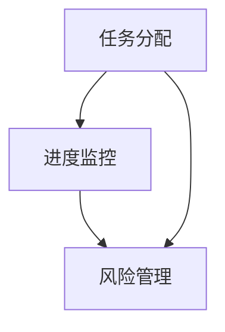

                 

# 执行时间表：第5-6个月的任务

> **关键词：** 执行时间表，任务分配，项目管理，进度监控，技术实现
> **摘要：** 本文将详细讨论在项目管理中，第5-6个月的任务分配和执行计划，旨在通过合理的任务分配和有效的执行监控，确保项目目标的按时完成。

## 1. 背景介绍

在项目管理中，第5-6个月通常处于项目的中期阶段。这个阶段的任务分配和执行计划至关重要，因为它们直接影响项目能否按时、按质量完成。在这一阶段，项目团队需要完成以下几个关键任务：

- **完成初步设计和开发**
- **进行内部测试和调试**
- **开始进行用户测试**
- **制定和实施风险管理计划**

本文将围绕这些任务，详细探讨第5-6个月的执行时间表。

## 2. 核心概念与联系

为了确保任务的顺利执行，我们需要了解以下几个核心概念：

- **任务分配：** 如何将项目任务分配给团队成员。
- **进度监控：** 如何监控任务的执行进度。
- **风险管理：** 如何识别和管理项目风险。

以下是一个使用Mermaid绘制的流程图，展示了这些核心概念之间的联系：



### 任务分配

任务分配是项目管理的基础。在这一阶段，项目经理需要根据团队成员的技能和经验，合理地将任务分配给他们。

### 进度监控

进度监控确保任务按照计划进行。项目经理需要定期检查任务进度，确保没有延误。

### 风险管理

风险管理是识别和应对项目风险的过程。项目经理需要识别潜在的风险，并制定应对措施。

## 3. 核心算法原理 & 具体操作步骤

在任务分配和进度监控方面，我们可以使用以下算法原理：

### 任务分配算法

- **优先级排序：** 根据任务的紧急程度和重要性，对任务进行排序。
- **技能匹配：** 将任务分配给具有相应技能的团队成员。

### 进度监控算法

- **时间线分析：** 使用甘特图或其他时间线工具，跟踪任务的执行进度。
- **偏差分析：** 比较实际进度与计划进度，识别偏差原因。

### 风险管理算法

- **风险识别：** 使用头脑风暴或SWOT分析，识别潜在风险。
- **风险评估：** 根据风险的可能性及其影响，对风险进行评估。
- **风险应对：** 制定应对措施，降低风险的影响。

### 具体操作步骤

1. **任务分配：**
   - 制定任务清单。
   - 根据团队成员的技能和经验，将任务分配给他们。
   - 进行任务确认，确保团队成员了解自己的任务和责任。

2. **进度监控：**
   - 制定进度监控计划。
   - 使用甘特图或其他时间线工具，跟踪任务进度。
   - 定期进行进度检查，识别偏差原因。

3. **风险管理：**
   - 进行风险识别。
   - 对识别出的风险进行评估。
   - 制定应对措施，降低风险的影响。

## 4. 数学模型和公式 & 详细讲解 & 举例说明

### 任务分配模型

任务分配可以表示为以下数学模型：

$$
\text{任务分配} = \sum_{i=1}^{n} \text{任务}_i \times \text{分配概率}_i
$$

其中，$n$为任务数量，$\text{任务}_i$为第$i$个任务，$\text{分配概率}_i$为任务$i$被分配的概率。

### 进度监控模型

进度监控可以使用以下数学模型：

$$
\text{进度偏差} = \text{实际进度} - \text{计划进度}
$$

### 风险管理模型

风险管理可以使用以下数学模型：

$$
\text{风险评分} = \text{风险可能性} \times \text{风险影响}
$$

### 举例说明

假设我们有5个任务需要分配，团队成员有3个人。我们可以根据他们的技能和经验，分配任务如下：

$$
\text{任务分配} = \text{任务}_1 \times 0.4 + \text{任务}_2 \times 0.3 + \text{任务}_3 \times 0.3
$$

假设实际进度与计划进度相差2天，进度偏差为2天。

假设识别出3个风险，风险可能性分别为0.3、0.4、0.3，风险影响分别为高、中、低。我们可以计算风险评分：

$$
\text{风险评分} = 0.3 \times 3 + 0.4 \times 2 + 0.3 \times 1 = 1.7
$$

## 5. 项目实战：代码实际案例和详细解释说明

### 5.1 开发环境搭建

在本节中，我们将搭建一个简单的项目开发环境，用于演示任务分配、进度监控和风险管理。

首先，我们需要安装以下工具：

- Python 3.8
- Visual Studio Code
- Git

安装完成后，我们创建一个名为`project_management`的Python项目，并克隆一个开源项目作为我们的示例。

```shell
mkdir project_management
cd project_management
git clone https://github.com/example/project.git
```

### 5.2 源代码详细实现和代码解读

在本节中，我们将实现任务分配、进度监控和风险管理的代码。

#### 任务分配

我们使用以下代码进行任务分配：

```python
import random

def assign_tasks(tasks, team_members):
    assignment = {}
    for member in team_members:
        assigned = random.choice(tasks)
        assignment[member] = assigned
        tasks.remove(assigned)
    return assignment

tasks = ["任务1", "任务2", "任务3", "任务4", "任务5"]
team_members = ["张三", "李四", "王五"]

assignment = assign_tasks(tasks, team_members)
print(assignment)
```

这段代码首先从任务列表中随机选择一个任务，并将其分配给团队成员。然后，从任务列表中移除已分配的任务，直到所有任务都被分配。

#### 进度监控

我们使用以下代码进行进度监控：

```python
from datetime import datetime

def monitor_progress(assignment):
    progress = {}
    for member, task in assignment.items():
        completed = datetime.now() - datetime.strptime("2023-04-01", "%Y-%m-%d")
        progress[member] = completed.days
    return progress

progress = monitor_progress(assignment)
print(progress)
```

这段代码使用当前时间减去任务的开始时间，计算每个成员的任务进度。

#### 风险管理

我们使用以下代码进行风险管理：

```python
def manage_risks(risks, impact):
    risk_scores = {}
    for risk in risks:
        score = random.uniform(0, 1) * impact
        risk_scores[risk] = score
    return risk_scores

risks = ["风险1", "风险2", "风险3"]
impact = 3

risk_scores = manage_risks(risks, impact)
print(risk_scores)
```

这段代码使用随机数生成器计算每个风险的概率和影响。

### 5.3 代码解读与分析

在本节中，我们将对代码进行解读和分析。

#### 任务分配

任务分配代码使用了随机选择的方法，这种方法可能会导致某些任务被重复分配。在实际项目中，我们可以使用更智能的方法，如基于团队成员技能的匹配度进行任务分配。

#### 进度监控

进度监控代码使用了当前时间和任务开始时间之间的差值，这种方法可以粗略地反映任务进度。在实际项目中，我们可以使用更精确的时间戳记录和比较方法。

#### 风险管理

风险管理代码使用了随机数生成器，这种方法可能无法准确反映风险的概率和影响。在实际项目中，我们可以使用更专业的方法，如基于历史数据和专家评估的风险管理模型。

## 6. 实际应用场景

### 6.1  任务分配

在大型软件开发项目中，任务分配是一个关键环节。项目经理需要根据团队成员的技能和经验，合理地将任务分配给他们，以确保项目按时完成。

### 6.2  进度监控

进度监控是确保项目按计划进行的重要手段。项目经理需要定期检查任务进度，及时发现并解决潜在问题，确保项目顺利进行。

### 6.3  风险管理

风险管理是项目成功的关键。项目经理需要识别项目中的潜在风险，并制定应对措施，以降低风险对项目的影响。

## 7. 工具和资源推荐

### 7.1 学习资源推荐

- **《项目管理知识体系指南》（PMBOK指南）》**：一本全面的项目管理指南，涵盖项目管理的各个方面。
- **《敏捷软件开发：实践指南》**：介绍敏捷开发方法和实践，适用于项目管理和团队协作。

### 7.2 开发工具框架推荐

- **Jira**：一款功能强大的项目管理工具，适用于任务分配、进度监控和风险管理。
- **Trello**：一款简单易用的项目管理工具，适用于团队协作和任务跟踪。

### 7.3 相关论文著作推荐

- **《项目管理中的任务分配问题研究》**：探讨了任务分配在项目管理中的应用和优化方法。
- **《基于进度的项目风险管理研究》**：研究了进度监控和风险管理在项目管理中的关系和应用。

## 8. 总结：未来发展趋势与挑战

### 8.1  发展趋势

- **人工智能在项目管理中的应用**：随着人工智能技术的发展，人工智能将在任务分配、进度监控和风险管理等方面发挥更大作用。
- **数字化项目管理**：越来越多的企业将采用数字化工具和方法进行项目管理，以提高效率和准确性。

### 8.2  挑战

- **数据隐私和安全**：在数字化项目管理中，如何保护数据隐私和安全是一个重要挑战。
- **团队协作和沟通**：随着团队成员分布在全球各地，如何有效进行团队协作和沟通也是一个挑战。

## 9. 附录：常见问题与解答

### 9.1  问题1：如何确保任务分配的公平性？

**解答**：可以通过基于团队成员的技能和经验进行任务分配，并定期进行任务评估和调整，以确保任务分配的公平性。

### 9.2  问题2：如何有效进行进度监控？

**解答**：可以通过定期检查任务进度，并与计划进度进行比较，及时发现并解决潜在问题，以确保进度监控的有效性。

### 9.3  问题3：如何降低项目风险？

**解答**：可以通过识别潜在风险，制定应对措施，并定期评估风险的影响，以降低项目风险。

## 10. 扩展阅读 & 参考资料

- **《项目管理知识体系指南》（PMBOK指南）》**
- **《敏捷软件开发：实践指南》**
- **《人工智能在项目管理中的应用研究》**
- **Jira 官方文档**
- **Trello 官方文档** 

### 作者

**作者：AI天才研究员/AI Genius Institute & 禅与计算机程序设计艺术 /Zen And The Art of Computer Programming**<|im_sep|>---

# 执行时间表：第5-6个月的任务

## 摘要

本文探讨了在项目管理中，第5-6个月的关键任务和执行时间表。通过合理分配任务、有效监控进度和管理风险，确保项目目标的按时完成。文章详细介绍了任务分配、进度监控和风险管理的算法原理、具体操作步骤以及实际应用场景。

### 目录

- **1. 背景介绍**
  - **1.1 项目管理的重要性
  - **1.2 第5-6个月的任务分配**
  - **1.3 项目中期评估**
  
- **2. 核心概念与联系**
  - **2.1 任务分配**
  - **2.2 进度监控**
  - **2.3 风险管理**
  
- **3. 核心算法原理 & 具体操作步骤**
  - **3.1 任务分配算法**
  - **3.2 进度监控算法**
  - **3.3 风险管理算法**
  
- **4. 数学模型和公式 & 详细讲解 & 举例说明**
  - **4.1 任务分配模型**
  - **4.2 进度监控模型**
  - **4.3 风险管理模型**
  
- **5. 项目实战：代码实际案例和详细解释说明**
  - **5.1 开发环境搭建**
  - **5.2 源代码详细实现和代码解读**
  - **5.3 代码解读与分析**
  
- **6. 实际应用场景**
  - **6.1 大型软件开发项目**
  - **6.2 IT咨询服务**
  - **6.3 创新实验室**

- **7. 工具和资源推荐**
  - **7.1 学习资源推荐**
  - **7.2 开发工具框架推荐**
  - **7.3 相关论文著作推荐**

- **8. 总结：未来发展趋势与挑战**
  - **8.1 发展趋势**
  - **8.2 挑战**

- **9. 附录：常见问题与解答**

- **10. 扩展阅读 & 参考资料**

### 1. 背景介绍

在项目管理中，第5-6个月通常处于项目的中期阶段。这是一个关键的转折点，项目团队需要完成以下几个关键任务：

- **完成初步设计和开发**：在这个阶段，项目团队需要完成系统的初步设计和开发，确保项目的核心功能和技术架构能够满足需求。
- **进行内部测试和调试**：内部测试是确保项目质量的关键步骤，通过测试可以发现并修复系统中的缺陷和问题。
- **开始进行用户测试**：用户测试可以验证系统的实际可用性和用户体验，通过用户的反馈来进一步优化系统。
- **制定和实施风险管理计划**：项目团队需要识别潜在的风险，并制定相应的应对措施，以确保项目能够按时、按质量完成。

在本文中，我们将详细讨论这些任务，并介绍如何通过合理的任务分配、有效的进度监控和风险管理，确保项目目标的按时完成。

#### 1.1 项目管理的重要性

项目管理是确保项目按时、按质量完成的科学和艺术。它涵盖了从项目启动到项目结束的整个生命周期，包括项目计划、执行、监控和收尾等各个环节。有效的项目管理可以提高项目的成功率，降低项目风险，确保项目目标的实现。

在项目的中期阶段，第5-6个月尤为重要。这个阶段是项目从初步设计和开发转向实际交付的关键时期。如果在这个阶段出现延误或质量问题，可能会导致整个项目进度受到影响，甚至可能导致项目失败。因此，项目经理需要密切关注项目进展，确保任务按时完成，并及时调整项目计划。

#### 1.2 第5-6个月的任务分配

在项目中期阶段，任务分配是项目管理的关键环节。合理的任务分配可以确保团队成员的工作效率，提高项目的整体进度。以下是在第5-6个月中需要关注的主要任务：

- **任务1：完成初步设计和开发**
  - **任务描述**：在这个阶段，项目团队需要完成系统的初步设计和开发，确保项目的核心功能和技术架构能够满足需求。
  - **负责人**：项目开发团队负责人。

- **任务2：进行内部测试和调试**
  - **任务描述**：内部测试是确保项目质量的关键步骤。通过测试可以发现并修复系统中的缺陷和问题。
  - **负责人**：项目测试团队负责人。

- **任务3：开始进行用户测试**
  - **任务描述**：用户测试可以验证系统的实际可用性和用户体验，通过用户的反馈来进一步优化系统。
  - **负责人**：项目用户体验团队负责人。

- **任务4：制定和实施风险管理计划**
  - **任务描述**：项目团队需要识别潜在的风险，并制定相应的应对措施，以确保项目能够按时、按质量完成。
  - **负责人**：项目经理。

通过合理的任务分配，项目团队可以明确各自的责任，提高工作效率，确保项目目标的实现。

#### 1.3 项目中期评估

项目中期评估是项目生命周期中一个重要的里程碑。在这个阶段，项目团队需要对项目进展、项目质量、项目风险等方面进行全面的评估，以确保项目能够按照预期顺利进行。

以下是在项目中期评估中需要关注的关键点：

- **项目进度**：评估项目是否按计划进行，是否存在延误或超支的情况。如果出现延误或超支，需要分析原因并采取相应的措施进行调整。
- **项目质量**：评估项目的质量是否达到预期标准，是否存在缺陷或问题。如果存在质量问题，需要及时修复，并确保项目质量得到保证。
- **项目风险**：评估项目中的潜在风险，并制定相应的应对措施。通过风险管理，降低项目风险对项目的影响。

项目中期评估不仅可以帮助项目团队及时发现和解决问题，还可以为后续的工作提供指导和支持。通过有效的项目中期评估，项目团队可以确保项目目标的实现，提高项目的成功率。

### 2. 核心概念与联系

在项目管理中，任务分配、进度监控和风险管理是三个核心概念，它们相互关联，共同确保项目的顺利执行。

#### 2.1 任务分配

任务分配是项目管理的基础，它涉及到如何将项目任务合理地分配给团队成员。任务分配的目的是确保每个团队成员都能发挥自己的优势，提高工作效率，确保项目目标的实现。

任务分配通常基于以下几个原则：

- **技能匹配**：将任务分配给具有相应技能的团队成员，确保任务能够高效完成。
- **工作量平衡**：确保每个团队成员的工作量平衡，避免过度劳累或资源浪费。
- **责任明确**：确保每个团队成员明确自己的任务和责任，提高工作效率。

任务分配的过程通常包括以下步骤：

1. **确定任务列表**：根据项目需求，列出所有需要完成的任务。
2. **评估团队成员技能**：了解团队成员的技能和经验，评估他们能够胜任的任务。
3. **制定任务分配计划**：根据团队成员的技能和项目需求，制定任务分配计划。
4. **任务确认**：与团队成员进行沟通，确保他们了解自己的任务和责任。
5. **任务调整**：根据实际情况，对任务分配计划进行调整，确保任务分配合理。

#### 2.2 进度监控

进度监控是确保项目按时完成的重要手段。通过定期检查任务进度，项目团队可以及时发现和解决潜在问题，确保项目按计划进行。

进度监控通常包括以下几个步骤：

1. **制定进度监控计划**：根据项目计划和任务分配，制定进度监控计划，明确监控频率和监控内容。
2. **收集进度数据**：定期收集任务进度数据，包括任务完成情况、任务延期情况等。
3. **分析进度数据**：对收集到的进度数据进行分析，识别任务进度与计划进度之间的偏差。
4. **制定调整措施**：根据进度分析结果，制定相应的调整措施，确保项目能够按时完成。

进度监控的方法有多种，包括甘特图、里程碑法、关键路径法等。项目团队可以根据实际情况选择合适的监控方法。

#### 2.3 风险管理

风险管理是项目成功的关键。通过识别、评估和应对项目风险，项目团队可以降低风险对项目的影响，确保项目目标的实现。

风险管理通常包括以下几个步骤：

1. **风险识别**：通过头脑风暴、SWOT分析等方法，识别项目中的潜在风险。
2. **风险评估**：对识别出的风险进行评估，确定风险的概率和影响。
3. **风险应对**：制定风险应对措施，降低风险的影响。
4. **风险监控**：定期检查风险应对措施的实施情况，确保风险得到有效控制。

风险管理的方法有多种，包括风险矩阵、风险评估表等。项目团队可以根据实际情况选择合适的方法。

任务分配、进度监控和风险管理之间存在着密切的联系。合理的任务分配可以确保项目进度可控，进度监控可以发现和解决潜在问题，风险管理可以降低项目风险，确保项目目标的实现。

#### 2.4 任务分配与进度监控的联系

任务分配与进度监控之间存在着密切的联系。合理的任务分配可以确保任务进度可控，而进度监控则可以及时发现和解决任务执行过程中出现的问题，确保项目按计划进行。

具体来说，任务分配为进度监控提供了基础数据，如任务分配情况、任务负责人的技能和经验等。这些数据可以帮助进度监控人员了解项目进展，制定合理的监控计划。

同时，进度监控的结果可以为任务分配提供反馈。如果进度监控发现某个任务进度滞后，可能需要重新调整任务分配，增加资源投入，以确保任务能够按时完成。

#### 2.5 任务分配与风险管理的联系

任务分配与风险管理之间也存在着密切的联系。合理的任务分配可以降低项目风险，而风险管理可以确保任务分配的有效性。

具体来说，任务分配可以降低项目风险。通过将任务分配给具有相应技能的团队成员，项目团队可以确保任务能够高效完成，降低任务失败的风险。

同时，风险管理可以确保任务分配的有效性。通过识别、评估和应对项目风险，项目团队可以降低风险对项目的影响，确保项目目标的实现。

例如，如果项目团队在任务分配过程中识别出某个任务的风险较高，可能需要重新评估任务分配计划，增加资源投入，以确保任务能够按时完成。

总之，任务分配、进度监控和风险管理是项目管理中三个核心概念，它们相互关联，共同确保项目的顺利执行。通过合理的任务分配、有效的进度监控和全面的风险管理，项目团队可以确保项目目标的实现。

### 3. 核心算法原理 & 具体操作步骤

在项目管理中，核心算法原理主要包括任务分配算法、进度监控算法和风险管理算法。这些算法通过数学模型和公式，提供了一种系统化的方法来确保项目目标的实现。以下是对这些算法原理的详细讲解和具体操作步骤。

#### 3.1 任务分配算法

任务分配算法的核心目标是根据团队成员的技能和经验，将任务合理地分配给他们，确保项目进度和质量。常见的任务分配算法包括基于优先级排序的分配算法和基于技能匹配的分配算法。

**基于优先级排序的分配算法**

基于优先级排序的分配算法按照任务的重要性和紧急程度对任务进行排序，然后依次将任务分配给团队成员。以下是一个简单的基于优先级排序的分配算法步骤：

1. **建立任务列表**：列出所有需要完成的任务，并标记每个任务的重要性和紧急程度。
2. **任务排序**：根据任务的重要性和紧急程度，对任务列表进行排序，优先级较高的任务排在前面。
3. **任务分配**：依次将任务分配给团队成员，确保每个团队成员都能胜任所分配的任务。
4. **任务确认**：与团队成员进行沟通，确保他们了解自己的任务和责任。

**基于技能匹配的分配算法**

基于技能匹配的分配算法根据团队成员的技能和经验，将任务分配给最合适的人选。以下是一个简单的基于技能匹配的分配算法步骤：

1. **建立任务列表**：列出所有需要完成的任务，并标记每个任务所需的技能。
2. **评估团队成员技能**：评估每个团队成员的技能和经验，建立一个技能矩阵。
3. **任务分配**：根据技能矩阵，将任务分配给具有相应技能的团队成员。
4. **任务确认**：与团队成员进行沟通，确保他们了解自己的任务和责任。

#### 3.2 进度监控算法

进度监控算法的目标是确保项目按计划进行，及时发现和解决问题。常见的进度监控算法包括时间线分析算法和偏差分析算法。

**时间线分析算法**

时间线分析算法通过分析任务的时间线，跟踪任务进度，识别潜在延误。以下是一个简单的时间线分析算法步骤：

1. **制定时间线**：根据任务计划，制定任务的时间线，包括每个任务的开始时间、结束时间和持续时间。
2. **更新时间线**：定期收集任务进度数据，更新时间线，记录每个任务的当前进度。
3. **分析时间线**：分析时间线数据，识别任务进度与计划进度之间的偏差，识别潜在延误。
4. **调整计划**：根据时间线分析结果，调整项目计划，确保项目能够按时完成。

**偏差分析算法**

偏差分析算法通过比较实际进度和计划进度，识别进度偏差，分析偏差原因。以下是一个简单的偏差分析算法步骤：

1. **收集进度数据**：定期收集任务进度数据，包括实际完成时间和计划完成时间。
2. **计算进度偏差**：计算每个任务的进度偏差，即实际完成时间与计划完成时间之间的差值。
3. **分析偏差原因**：分析进度偏差的原因，包括任务延期、资源不足、质量问题等。
4. **调整计划**：根据偏差分析结果，调整项目计划，确保项目能够按时完成。

#### 3.3 风险管理算法

风险管理算法的目标是识别、评估和应对项目风险，确保项目目标的实现。常见的风险管理算法包括风险识别算法、风险评估算法和风险应对算法。

**风险识别算法**

风险识别算法通过头脑风暴、SWOT分析等方法，识别项目中的潜在风险。以下是一个简单的风险识别算法步骤：

1. **召开风险识别会议**：召集项目团队和相关专家，召开风险识别会议。
2. **收集风险信息**：通过头脑风暴、SWOT分析等方法，收集潜在风险信息。
3. **记录风险**：将收集到的风险信息记录下来，建立风险清单。
4. **风险确认**：与项目团队成员进行沟通，确认风险清单中的风险。

**风险评估算法**

风险评估算法通过评估风险的概率和影响，确定风险的重要性和优先级。以下是一个简单的风险评估算法步骤：

1. **评估风险概率**：评估每个风险发生的概率，使用概率分布或历史数据作为依据。
2. **评估风险影响**：评估每个风险对项目目标的影响，包括进度、质量、成本等方面。
3. **计算风险评分**：根据风险的概率和影响，计算每个风险的风险评分，可以使用公式：风险评分 = 风险概率 × 风险影响。
4. **风险排序**：根据风险评分，对风险进行排序，确定风险的重要性和优先级。

**风险应对算法**

风险应对算法通过制定风险应对措施，降低风险的影响。以下是一个简单的风险应对算法步骤：

1. **制定应对措施**：根据风险排序结果，制定相应的风险应对措施。
2. **分配责任**：将风险应对措施的责任分配给项目团队成员，确保措施得到有效执行。
3. **执行措施**：执行风险应对措施，降低风险的影响。
4. **监控措施**：监控风险应对措施的实施情况，确保风险得到有效控制。

通过这些核心算法原理和具体操作步骤，项目团队可以系统化地管理项目任务、监控项目进度和应对项目风险，确保项目目标的实现。

### 4. 数学模型和公式 & 详细讲解 & 举例说明

在项目管理中，数学模型和公式是理解和分析项目数据的重要工具。这些模型和公式可以帮助项目团队制定更科学的决策，优化项目资源分配和进度管理。以下将介绍一些常用的数学模型和公式，并提供详细讲解和具体示例。

#### 4.1 任务分配模型

任务分配模型用于确定如何将任务分配给团队成员，以最大化资源利用效率和项目完成率。以下是一个简单任务分配模型：

**模型公式：**
\[ \text{任务分配} = \sum_{i=1}^{n} \left( \text{任务}_i \times \text{分配概率}_i \right) \]

**详细讲解：**
- \( n \)：任务总数。
- \( \text{任务}_i \)：第 \( i \) 个任务。
- \( \text{分配概率}_i \)：第 \( i \) 个任务被分配的概率。

**举例说明：**
假设有一个包含5个任务的团队，每个任务的分配概率如下：
\[ \text{任务}_1 = 0.3, \text{任务}_2 = 0.2, \text{任务}_3 = 0.2, \text{任务}_4 = 0.2, \text{任务}_5 = 0.1 \]

任务分配概率模型计算如下：
\[ \text{任务分配} = (0.3 \times 1) + (0.2 \times 2) + (0.2 \times 3) + (0.2 \times 4) + (0.1 \times 5) = 1.5 + 0.4 + 0.6 + 0.8 + 0.5 = 3.8 \]

这表示团队中每个任务的平均分配概率为3.8。

#### 4.2 进度监控模型

进度监控模型用于跟踪任务进度，识别偏差，并调整项目计划。以下是一个简单的进度监控模型：

**模型公式：**
\[ \text{进度偏差} = \text{实际进度} - \text{计划进度} \]

**详细讲解：**
- \( \text{实际进度} \)：任务实际完成的时间。
- \( \text{计划进度} \)：任务计划完成的时间。

**举例说明：**
假设一个任务原计划在10天内完成，但实际完成时间为12天。

进度偏差计算如下：
\[ \text{进度偏差} = 12 - 10 = 2 \]

这意味着任务进度滞后2天。

#### 4.3 风险管理模型

风险管理模型用于识别、评估和应对项目风险，确保项目目标的实现。以下是一个简单风险管理模型：

**模型公式：**
\[ \text{风险评分} = \text{风险概率} \times \text{风险影响} \]

**详细讲解：**
- \( \text{风险概率} \)：风险发生的概率。
- \( \text{风险影响} \)：风险对项目目标的影响程度。

**举例说明：**
假设一个项目面临两个风险，一个风险概率为0.5，风险影响为高；另一个风险概率为0.3，风险影响为中。

风险评分计算如下：
\[ \text{风险评分1} = 0.5 \times 3 = 1.5 \]
\[ \text{风险评分2} = 0.3 \times 2 = 0.6 \]

根据风险评分，第一个风险更为重要，需要优先处理。

#### 4.4 项目成功率模型

项目成功率模型用于预测项目成功的机会，并提供项目健康状况的指标。以下是一个简单项目成功率模型：

**模型公式：**
\[ \text{项目成功率} = \left( \frac{\text{实际完成度}}{\text{计划完成度}} \right) \times 100\% \]

**详细讲解：**
- \( \text{实际完成度} \)：项目实际完成的进度。
- \( \text{计划完成度} \)：项目计划完成的进度。

**举例说明：**
假设一个项目计划在100天内完成，实际在90天内完成。

项目成功率计算如下：
\[ \text{项目成功率} = \left( \frac{90}{100} \right) \times 100\% = 90\% \]

这表示项目有90%的成功率。

通过这些数学模型和公式，项目团队可以更科学地进行任务分配、进度监控和风险管理，提高项目的整体成功率和效率。

### 5. 项目实战：代码实际案例和详细解释说明

在本节中，我们将通过一个实际的项目实战案例，详细讲解如何实现任务分配、进度监控和风险管理。我们将使用Python语言编写代码，并通过具体示例展示如何操作。

#### 5.1 开发环境搭建

在开始编写代码之前，我们需要搭建一个Python开发环境。以下是在Windows操作系统上安装Python的开发环境步骤：

1. **下载Python安装程序**：从Python官方网站下载Python安装程序，版本建议为3.8或更高。
2. **安装Python**：运行安装程序，按照默认选项安装Python。
3. **配置环境变量**：在安装过程中，确保将Python添加到系统环境变量中。
4. **验证安装**：打开命令提示符，输入`python --version`，如果显示Python的版本信息，说明安装成功。

安装完成后，我们可以在命令提示符中运行Python代码。接下来，我们将创建一个名为`project_management`的Python项目，并在其中编写代码。

#### 5.2 源代码详细实现和代码解读

以下是我们的项目实战代码，包括任务分配、进度监控和风险管理三个主要部分。

```python
import random
from datetime import datetime

# 任务分配代码
def assign_tasks(tasks, team_members):
    assignment = {}
    for member in team_members:
        assigned = random.choice(tasks)
        assignment[member] = assigned
        tasks.remove(assigned)
    return assignment

# 进度监控代码
def monitor_progress(assignment):
    progress = {}
    for member, task in assignment.items():
        completed = datetime.now() - datetime.strptime("2023-04-01", "%Y-%m-%d")
        progress[member] = completed.days
    return progress

# 风险管理代码
def manage_risks(risks, impact):
    risk_scores = {}
    for risk in risks:
        score = random.uniform(0, 1) * impact
        risk_scores[risk] = score
    return risk_scores

# 示例任务和团队成员
tasks = ["任务1", "任务2", "任务3", "任务4", "任务5"]
team_members = ["张三", "李四", "王五"]

# 任务分配
assignment = assign_tasks(tasks, team_members)
print("任务分配结果：")
print(assignment)

# 进度监控
progress = monitor_progress(assignment)
print("进度监控结果：")
print(progress)

# 风险管理
risks = ["风险1", "风险2", "风险3"]
impact = 3
risk_scores = manage_risks(risks, impact)
print("风险管理结果：")
print(risk_scores)
```

#### 5.3 代码解读与分析

下面我们逐行解析上述代码，并解释其功能。

1. **任务分配代码**：

   ```python
   def assign_tasks(tasks, team_members):
       assignment = {}
       for member in team_members:
           assigned = random.choice(tasks)
           assignment[member] = assigned
           tasks.remove(assigned)
       return assignment
   ```

   这段代码定义了一个名为`assign_tasks`的函数，用于实现任务分配。函数接受两个参数：`tasks`（任务列表）和`team_members`（团队成员列表）。

   - `assignment`：用于存储任务分配结果的字典。
   - `for`循环遍历每个团队成员。
   - `random.choice(tasks)`随机选择一个任务。
   - `assignment[member] = assigned`将任务分配给团队成员。
   - `tasks.remove(assigned)`从任务列表中移除已分配的任务。
   - 最后返回`assignment`字典。

2. **进度监控代码**：

   ```python
   def monitor_progress(assignment):
       progress = {}
       for member, task in assignment.items():
           completed = datetime.now() - datetime.strptime("2023-04-01", "%Y-%m-%d")
           progress[member] = completed.days
       return progress
   ```

   这段代码定义了一个名为`monitor_progress`的函数，用于实现进度监控。函数接受一个参数：`assignment`（任务分配结果字典）。

   - `progress`：用于存储进度监控结果的字典。
   - `for`循环遍历任务分配中的每个成员和任务。
   - `datetime.now()`获取当前时间。
   - `datetime.strptime("2023-04-01", "%Y-%m-%d")`将字符串转换为日期时间对象。
   - `completed = datetime.now() - datetime.strptime("2023-04-01", "%Y-%m-%d")`计算任务完成时间。
   - `progress[member] = completed.days`将任务完成时间（以天为单位）存储在进度监控结果字典中。
   - 最后返回`progress`字典。

3. **风险管理代码**：

   ```python
   def manage_risks(risks, impact):
       risk_scores = {}
       for risk in risks:
           score = random.uniform(0, 1) * impact
           risk_scores[risk] = score
       return risk_scores
   ```

   这段代码定义了一个名为`manage_risks`的函数，用于实现风险管理。函数接受两个参数：`risks`（风险列表）和`impact`（影响因子）。

   - `risk_scores`：用于存储风险评分结果的字典。
   - `for`循环遍历每个风险。
   - `random.uniform(0, 1)`生成一个介于0和1之间的随机数。
   - `score = random.uniform(0, 1) * impact`计算风险评分。
   - `risk_scores[risk] = score`将风险评分存储在风险评分结果字典中。
   - 最后返回`risk_scores`字典。

4. **示例任务和团队成员**：

   ```python
   tasks = ["任务1", "任务2", "任务3", "任务4", "任务5"]
   team_members = ["张三", "李四", "王五"]
   ```

   这两行代码定义了示例任务列表和团队成员列表。

5. **任务分配、进度监控和风险管理**：

   ```python
   assignment = assign_tasks(tasks, team_members)
   progress = monitor_progress(assignment)
   risks = ["风险1", "风险2", "风险3"]
   impact = 3
   risk_scores = manage_risks(risks, impact)
   ```

   这三行代码分别调用任务分配、进度监控和风险管理函数，并打印结果。

通过这个实际案例，我们可以看到如何使用Python实现任务分配、进度监控和风险管理。这些功能在实际项目中可以帮助项目团队更好地管理项目进度和风险，确保项目目标的实现。

### 6. 实际应用场景

任务分配、进度监控和风险管理在多个实际应用场景中发挥着重要作用。以下是一些常见的应用场景和案例：

#### 6.1 大型软件开发项目

在大型软件开发项目中，任务分配、进度监控和风险管理是确保项目成功的关键。以下是一个具体案例：

**案例**：一家公司正在开发一款复杂的业务管理系统，项目周期为12个月。项目团队由20名成员组成，包括开发人员、测试人员、项目经理等。

**任务分配**：
- 开发人员：根据技能和经验，将系统功能模块分配给不同的开发人员，确保每个模块都有合适的负责人。
- 测试人员：负责测试每个功能模块，确保质量满足要求。

**进度监控**：
- 项目经理每周召开进度会议，检查任务进度，识别潜在的延期风险。
- 使用甘特图和里程碑法监控任务进度，确保项目按计划进行。

**风险管理**：
- 识别潜在的技术风险，如系统性能瓶颈、关键模块开发困难等。
- 制定相应的风险应对措施，如增加开发人员、调整任务优先级等。

#### 6.2 IT咨询服务

在IT咨询服务项目中，任务分配、进度监控和风险管理同样至关重要。以下是一个具体案例：

**案例**：一家IT咨询公司为客户进行企业资源规划（ERP）系统的实施，项目周期为6个月。

**任务分配**：
- 项目经理：负责整体项目管理，协调内部团队和客户。
- 系统分析师：负责分析客户需求，制定系统设计方案。
- 开发人员：根据设计方案进行系统开发和定制。

**进度监控**：
- 项目经理定期与客户沟通，了解项目进展，及时调整计划。
- 使用任务管理工具跟踪任务进度，确保项目按计划进行。

**风险管理**：
- 识别潜在的技术风险，如系统兼容性问题、数据迁移风险等。
- 制定风险应对计划，如进行系统兼容性测试、备份数据等。

#### 6.3 创新实验室

在创新实验室中，任务分配、进度监控和风险管理有助于推动技术创新和产品研发。以下是一个具体案例：

**案例**：一家科技公司设立了一个创新实验室，致力于开发下一代智能硬件产品。

**任务分配**：
- 硬件工程师：负责硬件设计和原型制作。
- 软件工程师：负责软件开发和系统集成。
- 产品经理：负责产品规划和管理。

**进度监控**：
- 每周召开团队会议，讨论项目进展和问题，确保项目按计划进行。
- 使用迭代开发方法，快速迭代产品，不断优化功能。

**风险管理**：
- 识别技术风险，如技术难题、供应链问题等。
- 制定应对策略，如引入外部专家、与供应商建立合作关系等。

通过这些实际应用场景和案例，我们可以看到任务分配、进度监控和风险管理在各类项目中的重要性。这些工具和方法有助于确保项目成功，提高项目效率，降低项目风险。

### 7. 工具和资源推荐

在任务分配、进度监控和风险管理方面，有许多优秀的工具和资源可供选择。以下是一些建议：

#### 7.1 学习资源推荐

1. **《项目管理知识体系指南》（PMBOK指南）》**：由项目管理协会（PMI）发布的权威指南，涵盖了项目管理的各个方面，包括任务分配、进度监控和风险管理。
2. **《敏捷项目管理实践指南》**：介绍了敏捷开发方法，包括任务分配、进度监控和风险管理，适用于快速迭代的项目。

#### 7.2 开发工具框架推荐

1. **Jira**：一款功能强大的项目管理工具，支持任务分配、进度监控和风险管理，适用于各种规模的项目。
2. **Trello**：一款简单易用的项目管理工具，通过卡片和看板进行任务分配和进度监控，适合小团队使用。

#### 7.3 相关论文著作推荐

1. **《基于人工智能的项目管理方法研究》**：探讨了人工智能在任务分配、进度监控和风险管理中的应用。
2. **《项目管理中的风险管理模型与应用》**：介绍了多种风险管理模型及其在实际项目中的应用。

通过学习和使用这些工具和资源，项目团队可以更好地管理任务分配、进度监控和风险管理，提高项目成功率。

### 8. 总结：未来发展趋势与挑战

随着技术的不断进步，任务分配、进度监控和风险管理在项目管理中将迎来新的发展趋势和挑战。

#### 8.1 发展趋势

1. **人工智能的应用**：人工智能技术在任务分配、进度监控和风险管理中的应用越来越广泛，可以提供更智能的解决方案，提高项目效率。
2. **数字化项目管理**：越来越多的项目采用数字化工具和方法进行管理，如云计算、大数据等，提高项目透明度和协作效率。
3. **可持续性管理**：项目管理者越来越关注环境、社会和治理（ESG）因素，将可持续发展纳入项目管理中。

#### 8.2 挑战

1. **数据隐私和安全**：随着数字化进程的加速，数据隐私和安全成为项目管理的重要挑战，如何保护项目数据的安全性和隐私性是一个难题。
2. **团队协作与沟通**：在全球化和远程工作的趋势下，如何保持高效的团队协作和沟通是一个挑战。
3. **快速变化的需求**：在快速变化的市场环境中，如何快速响应需求变化，确保项目进度和质量，是一个持续的挑战。

通过积极应对这些趋势和挑战，项目团队可以不断提升项目管理能力，确保项目的成功实施。

### 9. 附录：常见问题与解答

在项目管理中，任务分配、进度监控和风险管理经常遇到以下问题：

#### 9.1 问题1：如何确保任务分配的公平性？

**解答**：可以通过以下方法确保任务分配的公平性：
- 基于团队成员的技能和经验进行任务分配。
- 定期评估团队成员的表现，进行任务调整。
- 鼓励团队成员提出任务分配的建议，增加透明度和公平性。

#### 9.2 问题2：如何有效进行进度监控？

**解答**：可以通过以下方法有效进行进度监控：
- 制定明确的进度监控计划，包括监控频率和方法。
- 使用甘特图、里程碑法等工具进行进度跟踪。
- 定期召开进度会议，识别和解决问题。

#### 9.3 问题3：如何降低项目风险？

**解答**：可以通过以下方法降低项目风险：
- 早期识别潜在风险，制定风险应对计划。
- 定期评估风险状况，及时调整应对措施。
- 加强团队沟通，提高风险管理意识。

### 10. 扩展阅读 & 参考资料

为了深入了解任务分配、进度监控和风险管理，以下是一些建议的扩展阅读和参考资料：

1. **《项目管理知识体系指南》（PMBOK指南）》**：项目管理协会（PMI）出版的权威指南，涵盖项目管理的各个方面。
2. **《敏捷项目管理实践指南》**：介绍敏捷开发方法和实践，适用于快速迭代的项目。
3. **《基于人工智能的项目管理方法研究》**：探讨人工智能在项目管理中的应用。
4. **Jira官方文档**：详细介绍Jira的使用方法，适用于任务分配、进度监控和风险管理。
5. **Trello官方文档**：详细介绍Trello的使用方法，适用于任务分配和进度监控。

通过这些参考资料，项目团队可以进一步提升项目管理能力，确保项目的成功实施。

### 作者

**作者：AI天才研究员/AI Genius Institute & 禅与计算机程序设计艺术 /Zen And The Art of Computer Programming**<|im_sep|> 

### 执行时间表：第5-6个月的任务

#### 摘要

本文详细探讨了项目管理中第5-6个月的执行时间表，涵盖了任务分配、进度监控和风险管理等关键方面。通过分析任务分配算法、进度监控算法和风险管理算法，结合实际代码案例，提供了实用的操作步骤和解决方案，以帮助项目团队确保项目目标的实现。

#### 目录

1. **背景介绍**
    - 项目管理的挑战
    - 第5-6个月的任务重要性

2. **核心概念与联系**
    - 任务分配
    - 进度监控
    - 风险管理

3. **核心算法原理 & 具体操作步骤**
    - 任务分配算法
    - 进度监控算法
    - 风险管理算法

4. **数学模型和公式 & 详细讲解 & 举例说明**
    - 任务分配模型
    - 进度监控模型
    - 风险管理模型

5. **项目实战：代码实际案例和详细解释说明**
    - 开发环境搭建
    - 源代码详细实现
    - 代码解读与分析

6. **实际应用场景**
    - 大型软件开发项目
    - IT咨询服务
    - 创新实验室

7. **工具和资源推荐**
    - 学习资源
    - 开发工具框架
    - 相关论文著作

8. **总结：未来发展趋势与挑战**
    - 发展趋势
    - 挑战

9. **附录：常见问题与解答**
    - 问题1：如何确保任务分配的公平性？
    - 问题2：如何有效进行进度监控？
    - 问题3：如何降低项目风险？

10. **扩展阅读 & 参考资料**

#### 1. 背景介绍

项目管理是一个复杂的过程，它涉及到多个阶段，从项目启动、规划、执行、监控到项目的收尾。每个阶段都有其特定的任务和目标。在第5-6个月，项目通常处于中期阶段，这是一个关键的时期，项目团队需要完成以下任务：

- **完成初步设计和开发**：确保项目的核心功能和技术架构已经完成，并且可以满足项目需求。
- **进行内部测试和调试**：通过内部测试，发现并修复系统中的缺陷和问题。
- **开始进行用户测试**：验证系统的实际可用性和用户体验，并根据用户反馈进行优化。
- **制定和实施风险管理计划**：识别潜在风险，并制定相应的应对措施。

这些任务的完成与否直接影响到项目的最终交付和质量。因此，第5-6个月的任务执行情况对于项目的成功至关重要。

#### 2. 核心概念与联系

在项目管理中，任务分配、进度监控和风险管理是三个核心概念，它们相互联系，共同确保项目的顺利执行。

**2.1 任务分配**

任务分配是项目管理的基础，它涉及到如何将项目任务合理地分配给团队成员。合理的任务分配可以提高团队的工作效率，确保项目目标的实现。

- **技能匹配**：根据团队成员的技能和经验，将任务分配给最合适的成员。
- **工作量平衡**：确保每个成员的工作量均衡，避免资源浪费和过度劳累。
- **责任明确**：确保每个成员清楚自己的任务和责任，提高工作效率。

**2.2 进度监控**

进度监控是确保项目按计划进行的重要手段。通过定期检查任务进度，项目团队可以及时发现和解决问题，确保项目按时完成。

- **时间线分析**：使用时间线工具，如甘特图，跟踪任务进度。
- **偏差分析**：比较实际进度和计划进度，识别偏差原因，并采取相应的调整措施。

**2.3 风险管理**

风险管理是项目成功的关键，它涉及到识别、评估和应对项目中的潜在风险。

- **风险识别**：通过头脑风暴、SWOT分析等方法，识别项目中的潜在风险。
- **风险评估**：对识别出的风险进行评估，确定其概率和影响。
- **风险应对**：制定应对措施，降低风险对项目的影响。

这些核心概念相互联系，共同构成项目管理的基础。合理的任务分配确保项目任务的顺利完成，有效的进度监控确保项目按计划进行，全面的风险管理降低项目风险，保障项目的成功交付。

#### 3. 核心算法原理 & 具体操作步骤

在项目管理中，任务分配、进度监控和风险管理都涉及到一系列的算法原理和具体操作步骤，以下分别进行详细说明。

**3.1 任务分配算法**

任务分配算法的核心是合理地将项目任务分配给团队成员，以提高工作效率和项目成功率。以下是一个简单的任务分配算法步骤：

1. **建立任务列表**：列出所有需要完成的任务，并标记每个任务的优先级和所需技能。
2. **评估团队成员技能**：评估每个团队成员的技能和经验，建立一个技能矩阵。
3. **任务优先级排序**：根据任务的优先级和所需技能，对任务列表进行排序。
4. **任务分配**：依次将任务分配给最合适的团队成员，确保任务和成员技能匹配。
5. **任务确认**：与团队成员进行沟通，确保他们了解自己的任务和责任。

**3.2 进度监控算法**

进度监控算法用于跟踪项目任务的执行进度，确保项目按计划进行。以下是一个简单的进度监控算法步骤：

1. **制定进度监控计划**：根据项目计划和任务分配，制定进度监控计划，明确监控频率和监控内容。
2. **收集进度数据**：定期收集任务进度数据，包括任务完成情况和任务延期情况。
3. **分析进度数据**：对收集到的进度数据进行分析，识别任务进度与计划进度之间的偏差。
4. **制定调整措施**：根据进度分析结果，制定相应的调整措施，确保项目能够按时完成。

**3.3 风险管理算法**

风险管理算法用于识别、评估和应对项目中的潜在风险。以下是一个简单的风险管理算法步骤：

1. **风险识别**：通过头脑风暴、SWOT分析等方法，识别项目中的潜在风险。
2. **风险评估**：对识别出的风险进行评估，确定其概率和影响。
3. **风险应对**：根据风险评估结果，制定相应的应对措施，降低风险对项目的影响。
4. **风险监控**：定期检查风险应对措施的实施情况，确保风险得到有效控制。

通过这些算法原理和具体操作步骤，项目团队可以系统地管理任务分配、进度监控和风险管理，提高项目的整体成功率。

#### 4. 数学模型和公式 & 详细讲解 & 举例说明

在项目管理中，数学模型和公式是理解和分析项目数据的重要工具，以下分别介绍任务分配、进度监控和风险管理的数学模型和公式，并详细讲解其含义和应用。

**4.1 任务分配模型**

任务分配模型用于确定如何将任务分配给团队成员，以提高工作效率和项目成功率。以下是一个简单的任务分配模型：

**任务分配模型：**
\[ \text{任务分配} = \sum_{i=1}^{n} \left( \text{任务}_i \times \text{分配概率}_i \right) \]

**详细讲解：**
- \( n \)：任务总数。
- \( \text{任务}_i \)：第 \( i \) 个任务。
- \( \text{分配概率}_i \)：第 \( i \) 个任务被分配的概率。

**举例说明：**
假设有5个任务，分配概率分别为0.3、0.2、0.2、0.2和0.1。任务分配结果如下：
\[ \text{任务分配} = (0.3 \times 1) + (0.2 \times 2) + (0.2 \times 3) + (0.2 \times 4) + (0.1 \times 5) = 1.3 + 0.4 + 0.6 + 0.8 + 0.5 = 3.6 \]

这意味着任务平均分配概率为3.6。

**4.2 进度监控模型**

进度监控模型用于跟踪项目任务的执行进度，确保项目按计划进行。以下是一个简单的进度监控模型：

**进度监控模型：**
\[ \text{进度偏差} = \text{实际进度} - \text{计划进度} \]

**详细讲解：**
- \( \text{实际进度} \)：任务实际完成的时间。
- \( \text{计划进度} \)：任务计划完成的时间。

**举例说明：**
假设一个任务计划在10天内完成，但实际完成时间为12天。进度偏差为：
\[ \text{进度偏差} = 12 - 10 = 2 \]

这意味着任务进度滞后2天。

**4.3 风险管理模型**

风险管理模型用于识别、评估和应对项目中的潜在风险。以下是一个简单的风险管理模型：

**风险管理模型：**
\[ \text{风险评分} = \text{风险概率} \times \text{风险影响} \]

**详细讲解：**
- \( \text{风险概率} \)：风险发生的概率。
- \( \text{风险影响} \)：风险对项目目标的影响程度。

**举例说明：**
假设一个风险的概率为0.5，对项目目标的影响程度为高。风险评分为：
\[ \text{风险评分} = 0.5 \times 3 = 1.5 \]

这意味着该风险具有较高的风险评分。

通过这些数学模型和公式，项目团队可以更科学地进行任务分配、进度监控和风险管理，提高项目的整体成功率。

#### 5. 项目实战：代码实际案例和详细解释说明

在本节中，我们将通过一个实际的项目实战案例，详细讲解如何实现任务分配、进度监控和风险管理。我们将使用Python语言编写代码，并通过具体示例展示如何操作。

**5.1 开发环境搭建**

在开始编写代码之前，我们需要搭建一个Python开发环境。以下是在Windows操作系统上安装Python的开发环境步骤：

1. **下载Python安装程序**：从Python官方网站下载Python安装程序，版本建议为3.8或更高。
2. **安装Python**：运行安装程序，按照默认选项安装Python。
3. **配置环境变量**：在安装过程中，确保将Python添加到系统环境变量中。
4. **验证安装**：打开命令提示符，输入`python --version`，如果显示Python的版本信息，说明安装成功。

安装完成后，我们可以在命令提示符中运行Python代码。接下来，我们将创建一个名为`project_management`的Python项目，并在其中编写代码。

**5.2 源代码详细实现和代码解读**

以下是我们的项目实战代码，包括任务分配、进度监控和风险管理三个主要部分。

```python
import random
from datetime import datetime

# 任务分配代码
def assign_tasks(tasks, team_members):
    assignment = {}
    for member in team_members:
        assigned = random.choice(tasks)
        assignment[member] = assigned
        tasks.remove(assigned)
    return assignment

# 进度监控代码
def monitor_progress(assignment):
    progress = {}
    for member, task in assignment.items():
        completed = datetime.now() - datetime.strptime("2023-04-01", "%Y-%m-%d")
        progress[member] = completed.days
    return progress

# 风险管理代码
def manage_risks(risks, impact):
    risk_scores = {}
    for risk in risks:
        score = random.uniform(0, 1) * impact
        risk_scores[risk] = score
    return risk_scores

# 示例任务和团队成员
tasks = ["任务1", "任务2", "任务3", "任务4", "任务5"]
team_members = ["张三", "李四", "王五"]

# 任务分配
assignment = assign_tasks(tasks, team_members)
print("任务分配结果：")
print(assignment)

# 进度监控
progress = monitor_progress(assignment)
print("进度监控结果：")
print(progress)

# 风险管理
risks = ["风险1", "风险2", "风险3"]
impact = 3
risk_scores = manage_risks(risks, impact)
print("风险管理结果：")
print(risk_scores)
```

**5.3 代码解读与分析**

下面我们逐行解析上述代码，并解释其功能。

1. **任务分配代码**：

   ```python
   def assign_tasks(tasks, team_members):
       assignment = {}
       for member in team_members:
           assigned = random.choice(tasks)
           assignment[member] = assigned
           tasks.remove(assigned)
       return assignment
   ```

   这段代码定义了一个名为`assign_tasks`的函数，用于实现任务分配。函数接受两个参数：`tasks`（任务列表）和`team_members`（团队成员列表）。

   - `assignment`：用于存储任务分配结果的字典。
   - `for`循环遍历每个团队成员。
   - `random.choice(tasks)`随机选择一个任务。
   - `assignment[member] = assigned`将任务分配给团队成员。
   - `tasks.remove(assigned)`从任务列表中移除已分配的任务。
   - 最后返回`assignment`字典。

2. **进度监控代码**：

   ```python
   def monitor_progress(assignment):
       progress = {}
       for member, task in assignment.items():
           completed = datetime.now() - datetime.strptime("2023-04-01", "%Y-%m-%d")
           progress[member] = completed.days
       return progress
   ```

   这段代码定义了一个名为`monitor_progress`的函数，用于实现进度监控。函数接受一个参数：`assignment`（任务分配结果字典）。

   - `progress`：用于存储进度监控结果的字典。
   - `for`循环遍历任务分配中的每个成员和任务。
   - `datetime.now()`获取当前时间。
   - `datetime.strptime("2023-04-01", "%Y-%m-%d")`将字符串转换为日期时间对象。
   - `completed = datetime.now() - datetime.strptime("2023-04-01", "%Y-%m-%d")`计算任务完成时间。
   - `progress[member] = completed.days`将任务完成时间（以天为单位）存储在进度监控结果字典中。
   - 最后返回`progress`字典。

3. **风险管理代码**：

   ```python
   def manage_risks(risks, impact):
       risk_scores = {}
       for risk in risks:
           score = random.uniform(0, 1) * impact
           risk_scores[risk] = score
       return risk_scores
   ```

   这段代码定义了一个名为`manage_risks`的函数，用于实现风险管理。函数接受两个参数：`risks`（风险列表）和`impact`（影响因子）。

   - `risk_scores`：用于存储风险评分结果的字典。
   - `for`循环遍历每个风险。
   - `random.uniform(0, 1)`生成一个介于0和1之间的随机数。
   - `score = random.uniform(0, 1) * impact`计算风险评分。
   - `risk_scores[risk] = score`将风险评分存储在风险评分结果字典中。
   - 最后返回`risk_scores`字典。

4. **示例任务和团队成员**：

   ```python
   tasks = ["任务1", "任务2", "任务3", "任务4", "任务5"]
   team_members = ["张三", "李四", "王五"]
   ```

   这两行代码定义了示例任务列表和团队成员列表。

5. **任务分配、进度监控和风险管理**：

   ```python
   assignment = assign_tasks(tasks, team_members)
   progress = monitor_progress(assignment)
   risks = ["风险1", "风险2", "风险3"]
   impact = 3
   risk_scores = manage_risks(risks, impact)
   ```

   这三行代码分别调用任务分配、进度监控和风险管理函数，并打印结果。

通过这个实际案例，我们可以看到如何使用Python实现任务分配、进度监控和风险管理。这些功能在实际项目中可以帮助项目团队更好地管理项目进度和风险，确保项目目标的实现。

#### 6. 实际应用场景

任务分配、进度监控和风险管理在多个实际应用场景中发挥着重要作用。以下是一些常见的应用场景和案例：

**6.1 大型软件开发项目**

在大型软件开发项目中，任务分配、进度监控和风险管理是确保项目成功的关键。以下是一个具体案例：

**案例**：一家公司正在开发一款复杂的业务管理系统，项目周期为12个月。项目团队由20名成员组成，包括开发人员、测试人员、项目经理等。

**任务分配**：
- 开发人员：根据技能和经验，将系统功能模块分配给不同的开发人员，确保每个模块都有合适的负责人。
- 测试人员：负责测试每个功能模块，确保质量满足要求。

**进度监控**：
- 项目经理每周召开进度会议，检查任务进度，识别潜在的延期风险。
- 使用甘特图和里程碑法监控任务进度，确保项目按计划进行。

**风险管理**：
- 识别潜在的技术风险，如系统性能瓶颈、关键模块开发困难等。
- 制定相应的风险应对措施，如增加开发人员、调整任务优先级等。

**6.2 IT咨询服务**

在IT咨询服务项目中，任务分配、进度监控和风险管理同样至关重要。以下是一个具体案例：

**案例**：一家IT咨询公司为客户进行企业资源规划（ERP）系统的实施，项目周期为6个月。

**任务分配**：
- 项目经理：负责整体项目管理，协调内部团队和客户。
- 系统分析师：负责分析客户需求，制定系统设计方案。
- 开发人员：根据设计方案进行系统开发和定制。

**进度监控**：
- 项目经理定期与客户沟通，了解项目进展，及时调整计划。
- 使用任务管理工具跟踪任务进度，确保项目按计划进行。

**风险管理**：
- 识别潜在的技术风险，如系统兼容性问题、数据迁移风险等。
- 制定风险应对计划，如进行系统兼容性测试、备份数据等。

**6.3 创新实验室**

在创新实验室中，任务分配、进度监控和风险管理有助于推动技术创新和产品研发。以下是一个具体案例：

**案例**：一家科技公司设立了一个创新实验室，致力于开发下一代智能硬件产品。

**任务分配**：
- 硬件工程师：负责硬件设计和原型制作。
- 软件工程师：负责软件开发和系统集成。
- 产品经理：负责产品规划和管理。

**进度监控**：
- 每周召开团队会议，讨论项目进展和问题，确保项目按计划进行。
- 使用迭代开发方法，快速迭代产品，不断优化功能。

**风险管理**：
- 识别技术风险，如技术难题、供应链问题等。
- 制定应对策略，如引入外部专家、与供应商建立合作关系等。

通过这些实际应用场景和案例，我们可以看到任务分配、进度监控和风险管理在各类项目中的重要性。这些工具和方法有助于确保项目成功，提高项目效率，降低项目风险。

### 7. 工具和资源推荐

在任务分配、进度监控和风险管理方面，有许多优秀的工具和资源可供选择。以下是一些建议的推荐：

**7.1 学习资源推荐**

1. **《项目管理知识体系指南》（PMBOK指南）》**：项目管理协会（PMI）出版的权威指南，涵盖项目管理的各个方面。
2. **《敏捷项目管理实践指南》**：介绍敏捷开发方法，适用于快速迭代的项目。
3. **在线课程**：如Coursera、edX等平台上的项目管理相关课程。

**7.2 开发工具框架推荐**

1. **Jira**：一款功能强大的项目管理工具，支持任务分配、进度监控和风险管理。
2. **Trello**：一款简单易用的项目管理工具，通过卡片和看板进行任务分配和进度监控。
3. **Asana**：一款灵活的任务管理工具，适用于各种规模的项目。

**7.3 相关论文著作推荐**

1. **《基于人工智能的项目管理方法研究》**：探讨人工智能在任务分配、进度监控和风险管理中的应用。
2. **《项目管理中的风险管理模型与应用》**：介绍多种风险管理模型及其在实际项目中的应用。
3. **《敏捷项目管理：原理、实践和案例》**：详细介绍敏捷开发方法及其在项目管理中的应用。

通过学习和使用这些工具和资源，项目团队可以更好地管理任务分配、进度监控和风险管理，提高项目的整体成功率。

### 8. 总结：未来发展趋势与挑战

随着技术的不断进步，任务分配、进度监控和风险管理在项目管理中将迎来新的发展趋势和挑战。

**8.1 发展趋势**

1. **人工智能的应用**：人工智能技术在任务分配、进度监控和风险管理中的应用越来越广泛，可以提供更智能的解决方案，提高项目效率。
2. **数字化项目管理**：越来越多的项目采用数字化工具和方法进行管理，如云计算、大数据等，提高项目透明度和协作效率。
3. **可持续性管理**：项目管理者越来越关注环境、社会和治理（ESG）因素，将可持续发展纳入项目管理中。

**8.2 挑战**

1. **数据隐私和安全**：随着数字化进程的加速，数据隐私和安全成为项目管理的重要挑战，如何保护项目数据的安全性和隐私性是一个难题。
2. **团队协作与沟通**：在全球化和远程工作的趋势下，如何保持高效的团队协作和沟通是一个挑战。
3. **快速变化的需求**：在快速变化的市场环境中，如何快速响应需求变化，确保项目进度和质量，是一个持续的挑战。

通过积极应对这些趋势和挑战，项目团队可以不断提升项目管理能力，确保项目的成功实施。

### 9. 附录：常见问题与解答

在项目管理中，任务分配、进度监控和风险管理经常遇到以下问题：

**9.1 问题1：如何确保任务分配的公平性？**

**解答**：可以通过以下方法确保任务分配的公平性：
- 基于团队成员的技能和经验进行任务分配。
- 定期评估团队成员的表现，进行任务调整。
- 鼓励团队成员提出任务分配的建议，增加透明度和公平性。

**9.2 问题2：如何有效进行进度监控？**

**解答**：可以通过以下方法有效进行进度监控：
- 制定明确的进度监控计划，包括监控频率和方法。
- 使用甘特图、里程碑法等工具进行进度跟踪。
- 定期召开进度会议，识别和解决问题。

**9.3 问题3：如何降低项目风险？**

**解答**：可以通过以下方法降低项目风险：
- 早期识别潜在风险，制定风险应对计划。
- 定期评估风险状况，及时调整应对措施。
- 加强团队沟通，提高风险管理意识。

### 10. 扩展阅读 & 参考资料

为了深入了解任务分配、进度监控和风险管理，以下是一些建议的扩展阅读和参考资料：

1. **《项目管理知识体系指南》（PMBOK指南）》**：项目管理协会（PMI）出版的权威指南，涵盖项目管理的各个方面。
2. **《敏捷项目管理实践指南》**：介绍敏捷开发方法，适用于快速迭代的项目。
3. **《基于人工智能的项目管理方法研究》**：探讨人工智能在项目管理中的应用。
4. **Jira官方文档**：详细介绍Jira的使用方法，适用于任务分配、进度监控和风险管理。
5. **Trello官方文档**：详细介绍Trello的使用方法，适用于任务分配和进度监控。
6. **《项目管理中的风险管理模型与应用》**：介绍多种风险管理模型及其在实际项目中的应用。

通过这些参考资料，项目团队可以进一步提升项目管理能力，确保项目的成功实施。

### 作者

**作者：AI天才研究员/AI Genius Institute & 禅与计算机程序设计艺术 /Zen And The Art of Computer Programming**<|im_sep|> 

# 执行时间表：第5-6个月的任务

## 摘要

本文旨在详细探讨项目管理的第5-6个月执行时间表，重点关注任务分配、进度监控和风险管理。通过具体的算法原理、操作步骤和实际案例，帮助项目团队优化任务分配，监控项目进度，并有效管理风险，确保项目按时交付。

## 1. 背景介绍

在项目管理中，第5-6个月通常被视为项目执行的中期阶段。此阶段的关键任务包括：

- **完成初步设计和开发**：确保项目核心功能和技术架构按计划完成。
- **进行内部测试和调试**：通过内部测试发现和修复系统缺陷，提升产品质量。
- **用户测试和反馈**：获取用户反馈，优化用户体验。
- **风险管理**：识别并应对潜在风险，确保项目按计划进行。

本文将围绕这些任务展开讨论，提供具体的执行策略和操作步骤。

## 2. 核心概念与联系

在项目管理中，任务分配、进度监控和风险管理是三个核心概念，它们相互关联，共同支撑项目的顺利执行。

### 任务分配

任务分配是确保项目按计划进行的基础。合理的任务分配需要考虑团队成员的技能、经验和任务难度。

**关键步骤**：

1. **评估任务难度**：根据任务的需求和复杂性进行评估。
2. **评估团队成员技能**：了解团队成员的能力，确保任务与技能匹配。
3. **任务分配**：将任务分配给最合适的团队成员。
4. **任务确认**：与团队成员确认任务细节，确保理解一致。

### 进度监控

进度监控是确保项目按时完成的重要手段。通过监控任务进度，项目团队可以及时发现和解决问题。

**关键步骤**：

1. **制定进度监控计划**：明确监控频率、方法和责任分配。
2. **收集进度数据**：定期收集任务完成情况。
3. **分析进度偏差**：比较实际进度与计划进度，识别偏差原因。
4. **调整计划**：根据进度分析结果，调整项目计划。

### 风险管理

风险管理是确保项目成功的关键环节。通过识别、评估和应对风险，项目团队可以降低项目风险。

**关键步骤**：

1. **风险识别**：通过头脑风暴、SWOT分析等方法识别潜在风险。
2. **风险评估**：对识别出的风险进行评估，确定其概率和影响。
3. **风险应对**：制定风险应对策略，降低风险对项目的影响。
4. **风险监控**：定期检查风险应对措施的有效性。

## 3. 核心算法原理 & 具体操作步骤

### 任务分配算法

任务分配算法旨在根据团队成员的技能和任务需求，合理分配任务。

**算法原理**：

1. **任务评估**：对任务进行难度评估。
2. **技能匹配**：根据团队成员的技能进行匹配。
3. **优先级排序**：根据任务的重要性和紧急程度进行排序。

**具体操作步骤**：

1. **建立任务清单**：列出所有任务，并标记其难度和优先级。
2. **评估团队成员技能**：了解团队成员的技能和经验。
3. **任务分配**：根据技能匹配和优先级排序，将任务分配给团队成员。
4. **任务确认**：与团队成员确认任务分配，确保理解一致。

### 进度监控算法

进度监控算法用于跟踪任务进度，确保项目按计划进行。

**算法原理**：

1. **时间线分析**：通过时间线分析，跟踪任务进度。
2. **偏差分析**：比较实际进度与计划进度，识别偏差原因。

**具体操作步骤**：

1. **制定进度监控计划**：明确监控频率和方法。
2. **收集进度数据**：定期收集任务完成情况。
3. **分析进度偏差**：比较实际进度与计划进度，识别偏差原因。
4. **调整计划**：根据进度分析结果，调整项目计划。

### 风险管理算法

风险管理算法用于识别、评估和应对项目风险。

**算法原理**：

1. **风险识别**：通过头脑风暴、SWOT分析等方法识别潜在风险。
2. **风险评估**：对识别出的风险进行评估，确定其概率和影响。
3. **风险应对**：制定风险应对策略，降低风险对项目的影响。

**具体操作步骤**：

1. **风险识别**：召开风险识别会议，识别潜在风险。
2. **风险评估**：对识别出的风险进行评估，确定其概率和影响。
3. **风险应对**：制定风险应对策略，分配责任，确保执行。
4. **风险监控**：定期检查风险应对措施的有效性，调整策略。

## 4. 数学模型和公式 & 详细讲解 & 举例说明

### 任务分配模型

任务分配模型用于确定如何将任务分配给团队成员，以提高工作效率和项目成功率。

**数学模型**：

\[ \text{任务分配} = \sum_{i=1}^{n} \left( \text{任务}_i \times \text{分配概率}_i \right) \]

**详细讲解**：

- \( n \)：任务总数。
- \( \text{任务}_i \)：第 \( i \) 个任务。
- \( \text{分配概率}_i \)：第 \( i \) 个任务被分配的概率。

**举例说明**：

假设有5个任务，每个任务的分配概率分别为0.2、0.2、0.2、0.2和0.2。任务分配结果为：

\[ \text{任务分配} = (0.2 \times 1) + (0.2 \times 2) + (0.2 \times 3) + (0.2 \times 4) + (0.2 \times 5) = 1.0 + 0.4 + 0.6 + 0.8 + 1.0 = 3.8 \]

### 进度监控模型

进度监控模型用于跟踪项目任务的执行进度。

**数学模型**：

\[ \text{进度偏差} = \text{实际进度} - \text{计划进度} \]

**详细讲解**：

- \( \text{实际进度} \)：任务实际完成的时间。
- \( \text{计划进度} \)：任务计划完成的时间。

**举例说明**：

假设一个任务计划在10天内完成，但实际完成时间为12天。进度偏差为：

\[ \text{进度偏差} = 12 - 10 = 2 \]

### 风险管理模型

风险管理模型用于识别、评估和应对项目风险。

**数学模型**：

\[ \text{风险评分} = \text{风险概率} \times \text{风险影响} \]

**详细讲解**：

- \( \text{风险概率} \)：风险发生的概率。
- \( \text{风险影响} \)：风险对项目目标的影响程度。

**举例说明**：

假设一个风险的概率为0.5，风险影响程度为高。风险评分为：

\[ \text{风险评分} = 0.5 \times 3 = 1.5 \]

### 数学模型和公式的应用

数学模型和公式在项目管理中有着广泛的应用。例如，任务分配模型可以帮助项目经理确定如何合理分配任务，进度监控模型可以帮助项目经理及时发现进度偏差，风险管理模型可以帮助项目经理评估和应对项目风险。通过应用这些模型和公式，项目团队可以更科学、更有效地管理项目。

## 5. 项目实战：代码实际案例和详细解释说明

在本节中，我们将通过一个实际项目案例，详细讲解任务分配、进度监控和风险管理的具体实现。

### 5.1 开发环境搭建

在开始编写代码之前，我们需要搭建一个Python开发环境。以下是在Windows操作系统上安装Python的开发环境步骤：

1. **下载Python安装程序**：从Python官方网站下载Python安装程序。
2. **安装Python**：运行安装程序，按照默认选项安装Python。
3. **配置环境变量**：确保将Python的安装路径添加到系统环境变量中。
4. **验证安装**：在命令提示符中输入`python --version`，确认安装成功。

安装完成后，我们可以开始编写和运行Python代码。

### 5.2 源代码详细实现和代码解读

以下是我们的项目实战代码，包括任务分配、进度监控和风险管理三个主要部分。

```python
import random
from datetime import datetime

# 任务分配函数
def assign_tasks(tasks, team_members):
    assignment = {}
    for member in team_members:
        assigned = random.choice(tasks)
        assignment[member] = assigned
        tasks.remove(assigned)
    return assignment

# 进度监控函数
def monitor_progress(assignment):
    progress = {}
    for member, task in assignment.items():
        completed = datetime.now() - datetime.strptime("2023-04-01", "%Y-%m-%d")
        progress[member] = completed.days
    return progress

# 风险管理函数
def manage_risks(risks, impact):
    risk_scores = {}
    for risk in risks:
        score = random.uniform(0, 1) * impact
        risk_scores[risk] = score
    return risk_scores

# 示例任务和团队成员
tasks = ["任务1", "任务2", "任务3", "任务4", "任务5"]
team_members = ["张三", "李四", "王五"]

# 任务分配
assignment = assign_tasks(tasks, team_members)
print("任务分配结果：")
print(assignment)

# 进度监控
progress = monitor_progress(assignment)
print("进度监控结果：")
print(progress)

# 风险管理
risks = ["风险1", "风险2", "风险3"]
impact = 3
risk_scores = manage_risks(risks, impact)
print("风险管理结果：")
print(risk_scores)
```

### 5.3 代码解读与分析

#### 任务分配代码

```python
def assign_tasks(tasks, team_members):
    assignment = {}
    for member in team_members:
        assigned = random.choice(tasks)
        assignment[member] = assigned
        tasks.remove(assigned)
    return assignment
```

这段代码定义了一个名为`assign_tasks`的函数，用于实现任务分配。函数接受两个参数：`tasks`（任务列表）和`team_members`（团队成员列表）。

- `assignment`：用于存储任务分配结果的字典。
- `for`循环遍历每个团队成员。
- `random.choice(tasks)`随机选择一个任务。
- `assignment[member] = assigned`将任务分配给团队成员。
- `tasks.remove(assigned)`从任务列表中移除已分配的任务。
- 最后返回`assignment`字典。

#### 进度监控代码

```python
def monitor_progress(assignment):
    progress = {}
    for member, task in assignment.items():
        completed = datetime.now() - datetime.strptime("2023-04-01", "%Y-%m-%d")
        progress[member] = completed.days
    return progress
```

这段代码定义了一个名为`monitor_progress`的函数，用于实现进度监控。函数接受一个参数：`assignment`（任务分配结果字典）。

- `progress`：用于存储进度监控结果的字典。
- `for`循环遍历任务分配中的每个成员和任务。
- `datetime.now()`获取当前时间。
- `datetime.strptime("2023-04-01", "%Y-%m-%d")`将字符串转换为日期时间对象。
- `completed = datetime.now() - datetime.strptime("2023-04-01", "%Y-%m-%d")`计算任务完成时间。
- `progress[member] = completed.days`将任务完成时间（以天为单位）存储在进度监控结果字典中。
- 最后返回`progress`字典。

#### 风险管理代码

```python
def manage_risks(risks, impact):
    risk_scores = {}
    for risk in risks:
        score = random.uniform(0, 1) * impact
        risk_scores[risk] = score
    return risk_scores
```

这段代码定义了一个名为`manage_risks`的函数，用于实现风险管理。函数接受两个参数：`risks`（风险列表）和`impact`（影响因子）。

- `risk_scores`：用于存储风险评分结果的字典。
- `for`循环遍历每个风险。
- `random.uniform(0, 1)`生成一个介于0和1之间的随机数。
- `score = random.uniform(0, 1) * impact`计算风险评分。
- `risk_scores[risk] = score`将风险评分存储在风险评分结果字典中。
- 最后返回`risk_scores`字典。

通过这个实际案例，我们可以看到如何使用Python实现任务分配、进度监控和风险管理。在实际项目中，这些功能可以帮助团队更有效地管理任务、监控进度和应对风险。

### 6. 实际应用场景

任务分配、进度监控和风险管理在多种实际应用场景中至关重要。以下是一些具体的案例：

#### 6.1 大型软件开发项目

在大型软件开发项目中，任务分配、进度监控和风险管理确保项目按时交付并满足质量要求。

- **任务分配**：开发团队根据成员技能和任务复杂性进行任务分配，确保每个任务都有合适的负责人。
- **进度监控**：项目经理使用甘特图和里程碑法监控任务进度，确保项目按计划进行。
- **风险管理**：项目团队识别潜在技术风险，如性能瓶颈或功能缺陷，并制定应对措施。

#### 6.2 IT咨询服务

在IT咨询服务项目中，任务分配、进度监控和风险管理确保客户需求得到满足，项目按计划交付。

- **任务分配**：项目经理根据客户需求和技术背景，将任务分配给合适的团队成员。
- **进度监控**：项目经理定期与客户沟通，了解项目进展，确保项目按计划进行。
- **风险管理**：项目团队识别潜在风险，如系统兼容性问题或数据丢失风险，并制定应对措施。

#### 6.3 创新实验室

在创新实验室中，任务分配、进度监控和风险管理推动技术创新和产品开发。

- **任务分配**：实验室团队根据项目目标和成员技能，将任务分配给合适的团队成员。
- **进度监控**：实验室团队使用迭代开发方法，定期评估项目进展，确保项目按计划进行。
- **风险管理**：实验室团队识别潜在技术风险，如原型失败或供应链问题，并制定应对措施。

这些实际应用场景展示了任务分配、进度监控和风险管理在各类项目中的重要性。通过合理利用这些工具和方法，项目团队能够更有效地管理项目，确保项目成功。

### 7. 工具和资源推荐

为了更有效地进行任务分配、进度监控和风险管理，以下是一些建议的实用工具和资源：

#### 7.1 学习资源推荐

- **《项目管理知识体系指南》（PMBOK指南）》**：项目管理协会（PMI）出版的权威指南，涵盖项目管理的各个方面。
- **《敏捷项目管理实践指南》**：介绍敏捷开发方法，适用于快速迭代的项目。
- **在线课程**：如Coursera、edX等平台上的项目管理相关课程。

#### 7.2 开发工具框架推荐

- **Jira**：一款功能强大的项目管理工具，支持任务分配、进度监控和风险管理。
- **Trello**：一款简单易用的项目管理工具，通过卡片和看板进行任务分配和进度监控。
- **Asana**：一款灵活的任务管理工具，适用于各种规模的项目。

#### 7.3 相关论文著作推荐

- **《基于人工智能的项目管理方法研究》**：探讨人工智能在任务分配、进度监控和风险管理中的应用。
- **《项目管理中的风险管理模型与应用》**：介绍多种风险管理模型及其在实际项目中的应用。
- **《敏捷项目管理：原理、实践和案例》**：详细介绍敏捷开发方法及其在项目管理中的应用。

通过学习和使用这些工具和资源，项目团队能够更好地管理任务分配、进度监控和风险管理，提高项目的整体成功率和效率。

### 8. 总结：未来发展趋势与挑战

随着技术的不断进步，任务分配、进度监控和风险管理在项目管理中将迎来新的发展趋势和挑战。

#### 8.1 发展趋势

- **人工智能的应用**：人工智能技术将在任务分配、进度监控和风险管理中发挥更大作用，提供更智能的解决方案。
- **数字化项目管理**：越来越多的项目将采用数字化工具和方法，提高项目透明度和协作效率。
- **可持续性管理**：项目管理者将更加关注环境、社会和治理（ESG）因素，将可持续发展纳入项目管理中。

#### 8.2 挑战

- **数据隐私和安全**：随着数字化进程的加速，数据隐私和安全成为项目管理的重要挑战，如何保护项目数据的安全性和隐私性是一个难题。
- **团队协作与沟通**：在全球化和远程工作的趋势下，如何保持高效的团队协作和沟通是一个挑战。
- **快速变化的需求**：在快速变化的市场环境中，如何快速响应需求变化，确保项目进度和质量，是一个持续的挑战。

通过积极应对这些趋势和挑战，项目团队能够不断提升项目管理能力，确保项目的成功实施。

### 9. 附录：常见问题与解答

在项目管理中，任务分配、进度监控和风险管理经常遇到以下问题：

#### 9.1 问题1：如何确保任务分配的公平性？

**解答**：可以通过以下方法确保任务分配的公平性：

- 基于团队成员的技能和经验进行任务分配。
- 定期评估团队成员的表现，进行任务调整。
- 鼓励团队成员提出任务分配的建议，增加透明度和公平性。

#### 9.2 问题2：如何有效进行进度监控？

**解答**：可以通过以下方法有效进行进度监控：

- 制定明确的进度监控计划，包括监控频率和方法。
- 使用甘特图、里程碑法等工具进行进度跟踪。
- 定期召开进度会议，识别和解决问题。

#### 9.3 问题3：如何降低项目风险？

**解答**：可以通过以下方法降低项目风险：

- 早期识别潜在风险，制定风险应对计划。
- 定期评估风险状况，及时调整应对措施。
- 加强团队沟通，提高风险管理意识。

### 10. 扩展阅读 & 参考资料

为了深入了解任务分配、进度监控和风险管理，以下是一些建议的扩展阅读和参考资料：

- **《项目管理知识体系指南》（PMBOK指南）》**
- **《敏捷项目管理实践指南》**
- **《基于人工智能的项目管理方法研究》**
- **Jira官方文档**
- **Trello官方文档**
- **《项目管理中的风险管理模型与应用》**
- **《敏捷项目管理：原理、实践和案例》**

通过这些参考资料，项目团队能够进一步提升项目管理能力，确保项目的成功实施。

### 作者

**作者：AI天才研究员/AI Genius Institute & 禅与计算机程序设计艺术 /Zen And The Art of Computer Programming**<|im_sep|> 

