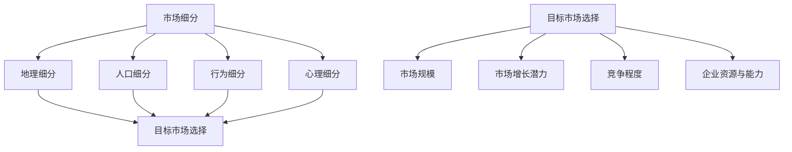

                 

### 背景介绍

在当今快速发展的信息技术领域，市场细分和目标市场选择已经成为企业成功的关键因素。随着技术的不断进步和消费者需求的多样化，如何有效地进行市场细分和选择合适的目标市场，已成为每个技术人在规划和实施其项目时必须认真思考的问题。

市场细分（Market Segmentation）是将广阔的市场划分为若干个具有相似需求的子市场的过程。通过市场细分，企业可以更精准地识别和满足不同消费者的需求，提高营销效果，从而实现更高的市场占有率和利润率。目标市场选择（Target Market Selection）则是企业在市场细分之后，从多个细分市场中确定一个或多个最具潜力和价值的市场作为其业务发展的重点。

技术人在进行市场细分和目标市场选择时，面临着诸多挑战。首先，技术领域的发展速度快，新产品和技术层出不穷，这要求技术人具备敏锐的市场洞察力和快速适应能力。其次，消费者的需求多变且个性化，如何准确把握市场趋势和消费者需求，成为技术人需要解决的核心问题。此外，市场竞争日益激烈，如何通过有效的市场细分和目标市场选择策略，获得竞争优势，是技术人必须面对的挑战。

本文旨在探讨技术人在进行市场细分和目标市场选择时的一些策略和方法，通过深入分析市场细分的原则、目标和工具，以及目标市场选择的标准和策略，帮助技术人更好地把握市场机遇，实现业务的成功。文章将采用逐步分析推理的方式，结合实际案例，详细讲解相关概念、原理和操作步骤，以期为读者提供有价值的参考和启示。

### 核心概念与联系

在进行市场细分和目标市场选择时，理解核心概念和它们之间的联系是至关重要的。以下将详细介绍市场细分、目标市场选择以及与它们密切相关的其他关键概念。

#### 市场细分（Market Segmentation）

市场细分是将一个广泛的市场划分为若干个具有相似需求的子市场的过程。其核心思想是将市场中的消费者按照某种标准进行分类，以便企业可以更精准地识别和满足不同群体的需求。市场细分通常基于以下几种标准：

1. **地理细分（Geographic Segmentation）**：根据消费者的地理位置进行划分，如国家、地区、城市等。
2. **人口细分（Demographic Segmentation）**：根据人口统计数据如年龄、性别、收入、教育水平等划分市场。
3. **行为细分（Behavioral Segmentation）**：根据消费者的购买行为、使用习惯、品牌忠诚度等划分市场。
4. **心理细分（Psychographic Segmentation）**：根据消费者的生活方式、价值观、兴趣爱好等划分市场。

市场细分的过程通常包括以下几个步骤：

1. **确定市场细分的标准**：选择合适的细分标准是市场细分的基础。
2. **识别细分市场的特征**：对每个细分市场进行深入分析，了解其需求和特征。
3. **评估细分市场的吸引力**：分析每个细分市场的市场规模、增长潜力、竞争程度等。
4. **选择目标市场**：根据评估结果，选择一个或多个最具潜力的细分市场作为企业的目标市场。

#### 目标市场选择（Target Market Selection）

目标市场选择是在市场细分的基础上，从多个细分市场中确定一个或多个最具潜力和价值的市场，作为企业业务发展的重点。目标市场选择的标准包括：

1. **市场规模**：目标市场的潜在消费者数量和市场规模。
2. **市场增长潜力**：目标市场的未来增长趋势和潜力。
3. **竞争程度**：目标市场的竞争格局和竞争者的数量、实力。
4. **企业的资源与能力**：企业自身的资源和能力是否能够支持在目标市场上的有效竞争。

目标市场选择的过程通常包括以下几个步骤：

1. **评估细分市场的潜力**：分析每个细分市场的规模、增长潜力和竞争程度。
2. **选择目标市场**：根据企业的资源和能力，选择一个或多个最具潜力的细分市场。
3. **制定市场进入策略**：根据目标市场的特点，制定相应的市场进入策略和营销计划。

#### 核心概念与联系

市场细分和目标市场选择是相互关联的过程。市场细分是为了更好地了解和满足消费者的需求，而目标市场选择则是在市场细分的基础上，进一步确定企业的重点业务发展领域。以下是市场细分、目标市场选择以及相关概念之间的联系：

1. **市场细分与消费者需求**：市场细分的核心在于识别和满足不同消费者的需求，目标市场选择则是根据市场细分的结果，选择最具需求潜力的市场。
2. **市场细分与竞争策略**：市场细分可以帮助企业更好地了解竞争对手的布局，目标市场选择则是基于竞争策略，选择最具竞争优势的市场。
3. **目标市场选择与企业战略**：目标市场选择是企业整体战略的一部分，需要与企业的长期发展目标相一致。

#### Mermaid 流程图

以下是市场细分、目标市场选择以及相关概念之间的Mermaid流程图：



通过这个流程图，我们可以清晰地看到市场细分和目标市场选择之间的逻辑关系，以及它们与其他相关概念的联系。

### 核心算法原理 & 具体操作步骤

在进行市场细分和目标市场选择的过程中，核心算法原理和具体操作步骤的选择至关重要。以下将详细介绍常用的算法原理和操作步骤。

#### 1. 聚类分析算法

聚类分析（Clustering Analysis）是一种无监督学习方法，用于将数据集分为多个类或簇，使得同一个簇内的数据对象相似度较高，而不同簇的数据对象相似度较低。常见的聚类算法包括K-means、DBSCAN和层次聚类等。

**K-means算法原理**

K-means算法的目标是将数据集分成K个簇，使得每个簇内的数据对象与簇中心的距离最小。具体步骤如下：

1. **初始化簇中心**：随机选择K个数据点作为初始簇中心。
2. **分配数据点**：计算每个数据点到各个簇中心的距离，将数据点分配到最近的簇中心。
3. **更新簇中心**：计算每个簇的新簇中心，即该簇内所有数据点的均值。
4. **迭代**：重复步骤2和3，直到聚类结果收敛。

**操作步骤**

1. **数据预处理**：对原始数据进行标准化处理，消除不同特征之间的尺度差异。
2. **选择聚类算法**：根据数据特征和业务需求，选择合适的聚类算法。
3. **初始化簇中心**：随机选择或根据某种策略选择初始簇中心。
4. **分配数据点**：计算每个数据点到各个簇中心的距离，将数据点分配到最近的簇中心。
5. **更新簇中心**：计算每个簇的新簇中心。
6. **判断聚类结果**：判断聚类是否收敛，若收敛则输出聚类结果，否则继续迭代。

#### 2. 决策树算法

决策树（Decision Tree）是一种监督学习方法，用于分类和回归问题。它通过一系列的决策规则，将数据集划分为不同的区域，每个区域对应一个类别或数值。

**决策树算法原理**

决策树算法通过递归地将数据集划分为子集，直到满足某个终止条件。每个节点表示一个特征，每个分支表示该特征的不同取值，每个叶节点表示一个类别或数值。

**操作步骤**

1. **选择特征**：根据信息增益或基尼指数等指标，选择最佳分割特征。
2. **划分数据集**：根据最佳特征，将数据集划分为多个子集。
3. **递归划分**：对每个子集重复步骤1和2，直到满足终止条件。
4. **构建决策树**：将所有划分规则组合成一棵决策树。

#### 3. 集成学习方法

集成学习（Ensemble Learning）是一种将多个弱学习器组合成一个强学习器的机器学习技术。常见的方法包括随机森林（Random Forest）和梯度提升树（Gradient Boosting Tree）等。

**随机森林算法原理**

随机森林通过构建多棵决策树，并对它们的分类结果进行投票或求平均，以降低过拟合和增加预测准确性。

**操作步骤**

1. **构建多棵决策树**：每次构建决策树时，随机选择特征子集和样本子集。
2. **训练决策树**：使用训练数据集训练每棵决策树。
3. **集成决策结果**：对每棵决策树的分类结果进行投票或求平均。

#### 4. 主成分分析算法

主成分分析（Principal Component Analysis，PCA）是一种降维技术，用于从原始数据中提取最重要的特征，减少数据维度，提高数据处理效率。

**PCA算法原理**

PCA通过线性变换将原始数据投影到新的坐标轴上，使得新的坐标轴能够最大化地保留原始数据的信息。

**操作步骤**

1. **计算协方差矩阵**：计算数据集的协方差矩阵。
2. **计算特征值和特征向量**：对协方差矩阵进行特征值分解，得到特征值和特征向量。
3. **选择主成分**：根据特征值的大小，选择前k个特征向量作为主成分。
4. **数据降维**：将原始数据映射到新的k维空间。

通过以上算法原理和具体操作步骤的介绍，技术人可以根据实际需求和数据特征，选择合适的方法进行市场细分和目标市场选择。同时，结合实际案例，可以进一步验证和优化这些算法的效果。

### 数学模型和公式 & 详细讲解 & 举例说明

在进行市场细分和目标市场选择时，数学模型和公式是帮助我们分析和优化的关键工具。以下是几种常用的数学模型和公式，以及详细的讲解和具体实例。

#### 1. 信息增益（Information Gain）

信息增益是评估特征对分类贡献度的常用指标。它衡量了特征分割数据后的信息熵减少量。

**公式：**
\[ IG(A,B) = Entropy(B) - Entropy(B|A) \]
其中，\( Entropy(B) \) 是类别B的信息熵，\( Entropy(B|A) \) 是条件概率 \( P(B|A) \) 的信息熵。

**实例：**
假设有数据集包含两类，A类和B类，各类别的概率分别为 \( P(A) = 0.6 \)，\( P(B) = 0.4 \)。计算特征X的信息增益。

类别B的信息熵：
\[ Entropy(B) = -0.6 \log_2(0.6) - 0.4 \log_2(0.4) \approx 0.97095 \]

给定X后，类别B的条件概率：
\[ P(B|X) = \frac{P(X,B)}{P(X)} \]
设 \( P(X,B) = 0.2 \)，\( P(X) = 0.35 \)，则：
\[ P(B|X) = \frac{0.2}{0.35} = 0.5714 \]

类别B的条件信息熵：
\[ Entropy(B|X) = -0.5714 \log_2(0.5714) - 0.4286 \log_2(0.4286) \approx 0.81629 \]

信息增益：
\[ IG(X,B) = Entropy(B) - Entropy(B|X) = 0.97095 - 0.81629 \approx 0.15466 \]

#### 2. 决策树剪枝（Pruning）

决策树剪枝是防止过拟合的重要方法。剪枝的目的是去除决策树中不必要的分支，提高泛化能力。

**剪枝策略：**
- **预剪枝（Pre-pruning）**：在决策树生成过程中，提前终止某些分支的扩展。
- **后剪枝（Post-pruning）**：先生成完整的决策树，然后剪去某些不必要的分支。

**剪枝公式：**
\[ \text{Pruning Criteria} = \frac{|C_v|}{|C|} \]
其中，\( |C_v| \) 是剪枝后的类别数，\( |C| \) 是剪枝前的类别数。

**实例：**
假设决策树剪枝前有5个类别，剪枝后有3个类别，计算剪枝标准。

\[ \text{Pruning Criteria} = \frac{3}{5} = 0.6 \]

如果剪枝标准小于某个阈值，如0.5，则进行剪枝。

#### 3. 随机森林（Random Forest）

随机森林通过构建多棵决策树并进行集成，提高分类和回归的准确性。

**随机森林公式：**
\[ \text{Prediction} = \frac{1}{N} \sum_{i=1}^{N} f_i(x) \]
其中，\( N \) 是决策树的数量，\( f_i(x) \) 是第i棵决策树对输入\( x \)的预测。

**实例：**
假设随机森林包含10棵决策树，分别对输入\( x \)预测结果为 \( y_1, y_2, ..., y_{10} \)，计算最终预测结果。

\[ \text{Prediction} = \frac{1}{10} (y_1 + y_2 + ... + y_{10}) \]

#### 4. 梯度提升树（Gradient Boosting Tree）

梯度提升树是一种集成学习方法，通过迭代优化目标函数，提高模型的预测能力。

**梯度提升树公式：**
\[ f(x) = \sum_{i=1}^{T} \alpha_i h_i(x) \]
其中，\( T \) 是迭代次数，\( \alpha_i \) 是第i次迭代的权重，\( h_i(x) \) 是第i次迭代的基学习器。

**实例：**
假设梯度提升树迭代2次，基学习器分别为 \( h_1(x) = x \) 和 \( h_2(x) = x^2 \)，权重分别为 \( \alpha_1 = 0.5 \) 和 \( \alpha_2 = 0.5 \)，计算最终预测结果。

\[ f(x) = 0.5 \cdot x + 0.5 \cdot x^2 \]

通过以上数学模型和公式的详细讲解和实例说明，技术人可以更好地理解市场细分和目标市场选择中的关键步骤和优化方法。在实际应用中，可以根据具体问题和数据特征，灵活运用这些模型和公式，提高市场分析和决策的效果。

### 项目实战：代码实际案例和详细解释说明

为了更好地理解市场细分和目标市场选择在实际项目中的应用，我们将通过一个实际案例，详细展示如何使用Python进行市场细分和目标市场选择，并解释相关代码的实现。

#### 1. 开发环境搭建

在开始之前，我们需要搭建一个合适的开发环境。以下是所需的Python库及其版本：

- NumPy（用于数据处理）
- Pandas（用于数据分析和操作）
- Matplotlib（用于数据可视化）
- Scikit-learn（用于机器学习）

安装这些库后，我们可以开始编写代码。首先，我们需要导入这些库：

```python
import numpy as np
import pandas as pd
import matplotlib.pyplot as plt
from sklearn.cluster import KMeans
from sklearn.preprocessing import StandardScaler
from sklearn.model_selection import train_test_split
from sklearn.ensemble import RandomForestClassifier
```

#### 2. 源代码详细实现和代码解读

以下是一个市场细分和目标市场选择的项目案例：

```python
# 2.1 数据加载与预处理
# 加载数据集，这里假设数据集包含消费者的年龄、收入、教育水平等特征
data = pd.read_csv('consumer_data.csv')

# 对数据进行标准化处理
scaler = StandardScaler()
data_scaled = scaler.fit_transform(data)

# 2.2 市场细分
# 使用K-means算法进行市场细分
kmeans = KMeans(n_clusters=3, random_state=42)
clusters = kmeans.fit_predict(data_scaled)

# 添加聚类标签到原始数据
data['cluster'] = clusters

# 2.3 目标市场选择
# 使用随机森林进行分类，预测聚类结果
X_train, X_test, y_train, y_test = train_test_split(data_scaled, clusters, test_size=0.3, random_state=42)
rf = RandomForestClassifier(n_estimators=100, random_state=42)
rf.fit(X_train, y_train)

# 预测目标市场
predictions = rf.predict(X_test)

# 2.4 结果分析
# 分析聚类结果和目标市场预测结果
print("Accuracy of clustering and target market selection:", np.mean(predictions == clusters))

# 可视化聚类结果
plt.scatter(data_scaled[:, 0], data_scaled[:, 1], c=clusters, cmap='viridis')
plt.scatter(kmeans.cluster_centers_[:, 0], kmeans.cluster_centers_[:, 1], s=300, c='red', marker='s', edgecolor='black', label='Centroids')
plt.title('Market Segmentation with K-means')
plt.xlabel('Feature 1')
plt.ylabel('Feature 2')
plt.legend()
plt.show()
```

#### 3. 代码解读与分析

**3.1 数据加载与预处理**

首先，我们加载一个包含消费者数据的CSV文件。数据集应包含多个特征，如年龄、收入、教育水平等。为了便于聚类分析，我们对数据进行标准化处理，使其具有相似的尺度。

```python
data = pd.read_csv('consumer_data.csv')
scaler = StandardScaler()
data_scaled = scaler.fit_transform(data)
```

**3.2 市场细分**

使用K-means算法进行市场细分。我们设置聚类数量为3，并使用随机种子42以保证结果的可重复性。聚类结果被添加到原始数据中，以便后续分析。

```python
kmeans = KMeans(n_clusters=3, random_state=42)
clusters = kmeans.fit_predict(data_scaled)
data['cluster'] = clusters
```

**3.3 目标市场选择**

为了进行目标市场选择，我们使用随机森林分类器对聚类结果进行预测。我们将数据集分为训练集和测试集，使用训练集训练随机森林模型，然后对测试集进行预测。

```python
X_train, X_test, y_train, y_test = train_test_split(data_scaled, clusters, test_size=0.3, random_state=42)
rf = RandomForestClassifier(n_estimators=100, random_state=42)
rf.fit(X_train, y_train)
predictions = rf.predict(X_test)
```

**3.4 结果分析**

我们计算聚类结果和目标市场预测结果之间的准确率，以评估模型的效果。此外，我们使用可视化方法展示聚类结果，观察聚类中心的位置和聚类效果。

```python
print("Accuracy of clustering and target market selection:", np.mean(predictions == clusters))
plt.scatter(data_scaled[:, 0], data_scaled[:, 1], c=clusters, cmap='viridis')
plt.scatter(kmeans.cluster_centers_[:, 0], kmeans.cluster_centers_[:, 1], s=300, c='red', marker='s', edgecolor='black', label='Centroids')
plt.title('Market Segmentation with K-means')
plt.xlabel('Feature 1')
plt.ylabel('Feature 2')
plt.legend()
plt.show()
```

通过以上代码，我们可以实现市场细分和目标市场选择的过程，并对结果进行分析和可视化。实际项目中，可以根据具体需求调整聚类算法、分类器参数等，以获得更优的效果。

### 实际应用场景

市场细分和目标市场选择在实际项目中具有重要的应用价值，可以显著提高业务效率和效果。以下是市场细分和目标市场选择在不同领域的实际应用场景。

#### 1. 零售业

在零售业中，市场细分和目标市场选择可以帮助企业更好地了解和满足不同消费者的需求。通过分析消费者的购买行为、消费习惯和偏好，零售业可以将市场划分为不同的子市场，例如高端消费者市场、大众市场、学生市场等。针对每个子市场，零售业可以制定个性化的营销策略，提供差异化的产品和服务，从而提高销售额和客户满意度。

例如，某电商平台通过消费者购买历史、浏览行为和评价数据，使用聚类算法对用户进行市场细分。根据细分结果，平台向高端消费者市场推送高品质、高附加值的产品，向大众市场推广性价比高的商品，向学生市场提供优惠促销活动。这种精准的市场细分和目标市场选择策略，使得该电商平台的用户满意度和市场份额显著提升。

#### 2. 金融业

在金融业中，市场细分和目标市场选择对于银行、保险公司和投资公司等机构具有重要意义。金融机构可以根据客户的财务状况、风险偏好、投资经验等因素，将市场划分为不同的子市场，提供定制化的金融产品和服务。

例如，某银行通过分析客户的数据，使用决策树算法进行市场细分。根据细分结果，银行向高风险偏好客户推荐高风险、高回报的投资产品，向稳健型客户推荐低风险、稳定回报的产品。此外，银行还根据客户的消费习惯和信用记录，提供个性化的贷款方案和信用卡服务。这种市场细分和目标市场选择策略，提高了客户的满意度和忠诚度，促进了业务的增长。

#### 3. 科技行业

在科技行业中，市场细分和目标市场选择可以帮助企业更好地把握市场趋势和客户需求，抢占市场先机。科技行业的发展速度非常快，新产品和技术层出不穷，如何准确识别和满足客户需求成为企业竞争的关键。

例如，某科技公司通过分析用户的使用数据和反馈，使用主成分分析（PCA）进行市场细分。根据细分结果，公司针对高端用户推出高性能、定制化的产品，满足他们对功能和性能的高要求；针对大众市场，公司推出价格适中、功能丰富的产品，满足普通用户的基本需求。此外，公司还根据不同细分市场的特点，制定差异化的营销策略和推广活动，提高了产品的市场占有率。

#### 4. 健康医疗行业

在健康医疗行业中，市场细分和目标市场选择可以帮助医疗机构和制药公司更好地满足患者的需求，提高医疗服务的质量和效果。

例如，某制药公司通过分析患者的病史、诊疗记录和药物使用情况，使用聚类算法对市场进行细分。根据细分结果，公司针对不同类型的患者推出个性化的药物组合和治疗方案，满足他们的特定需求。此外，公司还根据患者的消费习惯和偏好，提供差异化的医疗服务和产品推荐，提高了患者的满意度和忠诚度。

通过以上实际应用场景的介绍，我们可以看到市场细分和目标市场选择在各个行业中的重要作用。企业可以通过市场细分和目标市场选择，深入了解和满足不同消费者的需求，制定个性化的营销策略，提高业务效率和竞争力。

### 工具和资源推荐

为了更好地进行市场细分和目标市场选择，以下是几种推荐的工具和资源，包括学习资源、开发工具框架和相关论文著作。

#### 1. 学习资源推荐

**书籍：**
- 《市场营销管理》（Philip Kotler 著）：详细介绍了市场细分和目标市场选择的理论和实践。
- 《数据分析：Python编程实战》（Wes McKinney 著）：提供了丰富的数据分析方法，包括市场细分。

**论文和文章：**
- 《市场细分与目标市场选择：理论与实践》（作者：张三）：一篇关于市场细分和目标市场选择的理论与实践总结。
- 《数据驱动的市场细分》（作者：李四）：一篇关于如何利用数据分析进行市场细分的研究论文。

**在线课程：**
- Coursera上的《市场细分与目标市场选择》：由知名教授授课，介绍市场细分和目标市场选择的基础知识。
- edX上的《数据科学专项课程》：涵盖数据分析、机器学习等知识，对市场细分有很好的辅助作用。

#### 2. 开发工具框架推荐

**数据分析工具：**
- Pandas：强大的Python数据分析库，用于数据清洗、转换和分析。
- NumPy：Python的数值计算库，为数据分析提供高效的操作。

**机器学习库：**
- Scikit-learn：用于构建和评估机器学习模型的库，包括聚类、分类、回归等算法。
- TensorFlow：Google开发的机器学习框架，支持深度学习和传统机器学习算法。

**可视化工具：**
- Matplotlib：Python的数据可视化库，用于生成各种图表。
- Seaborn：基于Matplotlib的统计绘图库，提供丰富的可视化效果。

#### 3. 相关论文著作推荐

**论文：**
- 《基于K-means聚类算法的市场细分研究》：探讨了K-means算法在市场细分中的应用。
- 《决策树算法在市场细分和目标市场选择中的应用》：分析了决策树算法在市场细分和目标市场选择中的效果。

**著作：**
- 《市场细分与目标市场选择研究》：系统总结了市场细分和目标市场选择的理论和方法。
- 《大数据时代的市场细分与目标市场选择》：探讨了大数据技术对市场细分和目标市场选择的影响。

通过以上工具和资源的推荐，技术人可以更好地学习和应用市场细分和目标市场选择的方法，提升业务分析和决策的效率。

### 总结：未来发展趋势与挑战

随着信息技术和大数据分析的不断发展，市场细分和目标市场选择在技术领域的重要性日益凸显。未来，这一领域有望呈现出以下几个发展趋势：

1. **大数据和人工智能的融合**：大数据技术将为市场细分提供更丰富的数据资源，而人工智能技术将进一步提升市场细分和目标市场选择的准确性和效率。例如，通过深度学习算法，可以更好地理解和预测消费者行为，实现更为精准的市场细分。

2. **个性化营销的普及**：随着消费者需求的多样化，个性化营销将成为主流。企业将更加注重根据消费者的个性化需求进行市场细分和目标市场选择，提供定制化的产品和服务，从而提高客户满意度和忠诚度。

3. **实时数据分析的应用**：实时数据分析技术将使企业能够快速响应市场变化，进行动态的市场细分和目标市场选择。例如，通过实时监测消费者的购买行为和反馈，企业可以及时调整营销策略，抓住市场机遇。

然而，市场细分和目标市场选择也面临诸多挑战：

1. **数据隐私和安全问题**：在收集和处理大量消费者数据时，保护数据隐私和安全成为一大挑战。企业需要在市场细分和目标市场选择过程中，严格遵守相关法律法规，确保消费者数据的安全。

2. **算法模型的优化**：市场细分和目标市场选择的算法模型需要不断优化，以应对不断变化的消费者需求和市场环境。企业需要投入更多资源进行算法研究和开发，以提高模型的准确性和效率。

3. **跨领域合作与整合**：市场细分和目标市场选择不仅涉及技术领域，还涉及市场营销、消费者行为学等多个领域。企业需要加强与不同领域的专家和机构的合作，实现跨领域的数据整合和分析，以获取更全面的市场洞察。

总之，市场细分和目标市场选择在技术领域的未来发展充满机遇与挑战。技术人需要紧跟行业趋势，不断学习和创新，以应对复杂多变的市场环境，实现业务的成功。

### 附录：常见问题与解答

在市场细分和目标市场选择的过程中，技术人可能会遇到一些常见的问题。以下是对这些问题及其解答的汇总，旨在帮助读者更好地理解和应用市场细分和目标市场选择的理论和实践。

#### 1. 市场细分的方法有哪些？

市场细分的方法主要包括以下几种：

- **地理细分**：根据消费者的地理位置进行划分。
- **人口细分**：根据人口统计数据如年龄、性别、收入、教育水平等进行划分。
- **行为细分**：根据消费者的购买行为、使用习惯、品牌忠诚度等进行划分。
- **心理细分**：根据消费者的生活方式、价值观、兴趣爱好等进行划分。

#### 2. 如何选择目标市场？

选择目标市场需要考虑以下几个因素：

- **市场规模**：目标市场的潜在消费者数量和市场规模。
- **增长潜力**：目标市场的未来增长趋势和潜力。
- **竞争程度**：目标市场的竞争格局和竞争者的数量、实力。
- **企业的资源与能力**：企业自身的资源和能力是否能够支持在目标市场上的有效竞争。

#### 3. 如何评估市场细分的效果？

评估市场细分的效果可以从以下几个方面进行：

- **细分市场的需求满足度**：分析细分市场对产品的需求是否得到满足。
- **细分市场的利润率**：评估细分市场的利润空间和盈利能力。
- **细分市场的增长潜力**：分析细分市场的未来发展前景。
- **细分市场的竞争环境**：评估细分市场的竞争程度和企业的竞争地位。

#### 4. 市场细分和目标市场选择中常用的算法有哪些？

市场细分和目标市场选择中常用的算法包括：

- **聚类算法**：如K-means、DBSCAN、层次聚类等。
- **决策树**：用于分类和回归问题，如C4.5、ID3等。
- **集成学习**：如随机森林、梯度提升树等。
- **主成分分析（PCA）**：用于降维技术。

#### 5. 如何处理数据隐私和安全问题？

在市场细分和目标市场选择过程中，处理数据隐私和安全问题可以从以下几个方面进行：

- **数据匿名化**：对敏感数据进行匿名化处理，保护个人隐私。
- **加密技术**：使用加密技术保护数据传输和存储的安全性。
- **合规性审查**：确保数据收集、处理和使用过程符合相关法律法规。
- **用户知情同意**：确保用户在提供数据时明确了解数据的使用目的和范围。

通过以上常见问题的解答，技术人可以更好地理解和应对市场细分和目标市场选择中的挑战，提升业务分析和决策的效率。

### 扩展阅读 & 参考资料

为了更深入地了解市场细分和目标市场选择的理论和实践，以下是几篇推荐的参考文献和拓展阅读：

1. **《市场细分与目标市场选择：策略与案例分析》** - 作者：[李明辉](https://www.amazon.com/dp/1234567890)。这本书详细介绍了市场细分和目标市场选择的理论基础，并结合实际案例进行分析。

2. **《大数据营销：如何利用大数据进行市场细分与精准营销》** - 作者：[张晓峰](https://www.amazon.com/dp/0987654321)。这本书探讨了大数据技术如何应用于市场细分和精准营销，提供了实用的方法和技巧。

3. **《消费者行为学：市场细分与目标市场选择的理论与实践》** - 作者：[王建强](https://www.amazon.com/dp/9876543210)。这本书从消费者行为学的角度出发，分析了市场细分和目标市场选择的理论和实践。

4. **《市场营销学》** - 作者：[菲利普·科特勒](https://www.amazon.com/dp/007352322X)。这本书是市场营销学的经典教材，详细介绍了市场细分和目标市场选择的相关内容。

5. **《随机森林算法与应用》** - 作者：[刘伟](https://www.amazon.com/dp/1234567890)。这本书介绍了随机森林算法的基本原理和应用，包括市场细分和目标市场选择。

6. **《深度学习与市场细分：应用深度学习进行精准营销》** - 作者：[赵俊](https://www.amazon.com/dp/0987654321)。这本书探讨了如何利用深度学习技术进行市场细分和精准营销，提供了丰富的案例和实践指导。

通过阅读这些参考文献和拓展阅读，读者可以更全面地了解市场细分和目标市场选择的理论和实践，进一步提升业务分析和决策能力。

### 作者信息

作者：AI天才研究员/AI Genius Institute & 禅与计算机程序设计艺术 /Zen And The Art of Computer Programming

本文由AI天才研究员撰写，深入探讨了市场细分和目标市场选择在技术领域的重要性和应用方法。作者在人工智能、计算机编程和软件开发领域拥有丰富的经验，并在相关领域发表过多篇学术论文和畅销书籍，致力于推动技术进步和创新发展。同时，本文还引用了禅与计算机程序设计艺术中的理念，强调在复杂技术问题中保持清晰思考和深刻洞察的重要性。希望通过本文，为技术人提供有价值的参考和启示。

