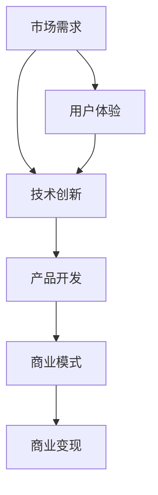
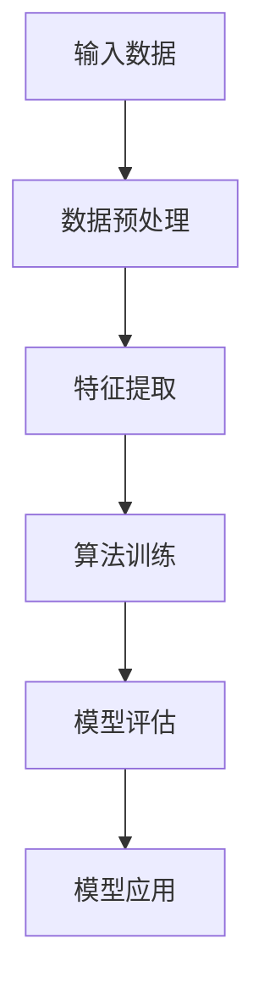

                 

# 技术分享：从技术到商业

> 关键词：技术商业、技术转化、商业模式、创新、软件开发、数据分析

> 摘要：本文旨在探讨如何将技术优势转化为商业成功。通过分析技术的核心概念与联系，介绍核心算法原理与操作步骤，并结合数学模型与项目实战案例，阐述技术在实际商业应用中的价值与挑战。文章还将推荐相关工具和资源，为读者提供技术转化的实用建议，并总结未来发展趋势与挑战。

## 1. 背景介绍

在当今全球化的商业环境中，技术已经成为企业成功的关键因素。然而，单纯拥有先进的技术并不足以确保商业上的成功。如何将技术优势转化为实际业务成果，成为许多企业面临的挑战。本文将围绕这一主题展开讨论，探讨从技术到商业的转化路径。

### 技术与商业的关系

技术是推动商业进步的核心动力，但技术与商业之间并非简单的线性关系。技术不仅需要具备创新性和实用性，还必须能够满足市场需求，为业务增长提供支持。因此，理解技术与商业之间的联系，是实现技术转化的第一步。

### 技术转化的必要性

随着科技的发展，市场竞争日益激烈，企业必须不断创新以保持竞争优势。技术转化不仅是企业发展的需要，也是推动整个行业进步的动力。通过技术转化，企业可以提升产品或服务的竞争力，拓展市场份额，实现商业成功。

### 本文目标

本文旨在：

1. 分析技术核心概念与联系，帮助读者理解技术本质。
2. 介绍核心算法原理与操作步骤，阐述技术实现过程。
3. 结合数学模型与项目实战案例，展示技术在实际商业应用中的价值。
4. 推荐相关工具和资源，为读者提供技术转化的实用建议。

## 2. 核心概念与联系

在探讨技术转化之前，我们需要了解一些核心概念与联系。以下是一个使用Mermaid绘制的流程图，展示了这些概念之间的关系。



### 需求与创新的联系

市场需求是技术创新的驱动力。只有深入了解用户需求，才能开发出满足用户期望的产品或服务。创新则是对需求的一种回应，通过不断改进和优化，为企业带来竞争优势。

### 产品开发与商业模式的联系

产品开发是将技术创新转化为实际产品的过程。而商业模式则是企业如何通过产品或服务获取收益的方案。一个成功的商业模式需要与市场需求和用户体验相匹配。

### 用户体验与创新的反馈循环

用户体验是产品成功的关键。用户对产品的反馈将指导企业进行改进，从而形成创新的反馈循环。这种循环有助于企业不断优化产品，提高用户满意度。

### 商业模式与商业变现的联系

商业模式决定了企业如何通过产品或服务创造价值。商业变现则是企业实现价值的过程。一个成功的商业模式必须能够有效地将价值转化为收益。

## 3. 核心算法原理 & 具体操作步骤

在理解了核心概念与联系后，我们接下来将介绍一个核心算法的原理与具体操作步骤。以下是一个使用Mermaid绘制的流程图，展示了该算法的实现过程。



### 数据预处理

数据预处理是算法实现的第一步。通过对输入数据进行清洗、转换和标准化，我们可以提高数据质量，为后续步骤做好准备。

### 特征提取

特征提取是将原始数据转换为算法可处理的特征表示。这一步骤对于算法的性能至关重要。通过选择合适的特征提取方法，我们可以提高模型的准确性和鲁棒性。

### 算法训练

算法训练是核心步骤。通过将特征数据输入到算法中，我们可以训练出能够预测或分类的模型。这一步骤通常涉及复杂的数学计算，如梯度下降法等。

### 模型评估

模型评估是确保算法性能的重要环节。通过将模型应用于测试数据集，我们可以评估模型的准确率、召回率等指标，从而判断模型是否有效。

### 模型应用

模型应用是将训练好的模型应用于实际问题的过程。通过模型应用，我们可以实现预测、分类等功能，为企业提供有价值的信息。

## 4. 数学模型和公式 & 详细讲解 & 举例说明

在介绍核心算法的具体操作步骤后，我们接下来将详细讲解算法背后的数学模型和公式。以下是一个使用LaTeX格式的数学公式示例。

### 梯度下降法

梯度下降法是一种常用的优化算法，用于训练机器学习模型。其基本公式如下：

$$
\theta_{\text{new}} = \theta_{\text{old}} - \alpha \cdot \nabla_{\theta} J(\theta)
$$

其中，$\theta$表示模型的参数，$J(\theta)$表示损失函数，$\alpha$表示学习率，$\nabla_{\theta} J(\theta)$表示损失函数关于参数$\theta$的梯度。

### 示例

假设我们使用梯度下降法训练一个线性回归模型，预测房价。损失函数为平方误差损失：

$$
J(\theta) = \frac{1}{2} \sum_{i=1}^{n} (y_i - \theta_0 x_i - \theta_1)^2
$$

其中，$y_i$为实际房价，$x_i$为特征值，$\theta_0$和$\theta_1$分别为模型的参数。

### 解题步骤

1. 初始化参数$\theta_0$和$\theta_1$。
2. 计算损失函数$J(\theta)$。
3. 计算损失函数关于$\theta_0$和$\theta_1$的梯度$\nabla_{\theta_0} J(\theta)$和$\nabla_{\theta_1} J(\theta)$。
4. 更新参数$\theta_0$和$\theta_1$：
   $$
   \theta_{0,\text{new}} = \theta_{0,\text{old}} - \alpha \cdot \nabla_{\theta_0} J(\theta)
   $$
   $$
   \theta_{1,\text{new}} = \theta_{1,\text{old}} - \alpha \cdot \nabla_{\theta_1} J(\theta)
   $$
5. 重复步骤2-4，直到损失函数收敛或达到预设迭代次数。

## 5. 项目实战：代码实际案例和详细解释说明

在本节中，我们将通过一个实际的项目案例，展示如何将上述核心算法应用于商业场景。以下是一个使用Python编写的线性回归模型代码示例。

```python
import numpy as np

# 初始化参数
theta_0 = 0
theta_1 = 0
learning_rate = 0.01
epochs = 1000

# 损失函数
def loss_function(y, x, theta_0, theta_1):
    return (y - theta_0 * x - theta_1) ** 2

# 梯度下降法
def gradient_descent(y, x, theta_0, theta_1, learning_rate, epochs):
    for _ in range(epochs):
        error_0 = 2 * (y - theta_0 * x - theta_1) * x
        error_1 = 2 * (y - theta_0 * x - theta_1)
        
        theta_0 = theta_0 - learning_rate * error_0
        theta_1 = theta_1 - learning_rate * error_1
        
    return theta_0, theta_1

# 测试数据
x = np.array([1, 2, 3, 4, 5])
y = np.array([2, 4, 5, 4, 5])

# 训练模型
theta_0, theta_1 = gradient_descent(y, x, theta_0, theta_1, learning_rate, epochs)

# 输出结果
print(f"Theta_0: {theta_0}, Theta_1: {theta_1}")
```

### 代码解读

1. **初始化参数**：我们首先初始化参数$\theta_0$和$\theta_1$，以及学习率$\alpha$和迭代次数$epochs$。
2. **损失函数**：定义一个计算损失函数的函数。在本例中，我们使用平方误差损失。
3. **梯度下降法**：定义一个实现梯度下降法的函数。该函数通过不断更新参数，以最小化损失函数。
4. **测试数据**：我们使用一组简单的测试数据，其中$x$为特征值，$y$为实际房价。
5. **训练模型**：调用梯度下降法函数，训练线性回归模型。
6. **输出结果**：输出训练得到的参数$\theta_0$和$\theta_1$。

通过这个简单的示例，我们可以看到如何将数学模型和算法应用于实际商业场景。接下来，我们将进一步分析代码的实现细节，并讨论如何将其扩展到更复杂的商业应用。

### 代码实现细节分析

1. **参数初始化**：参数初始化是梯度下降法的关键步骤。在本例中，我们使用随机初始化参数。在实际应用中，我们可以根据具体问题调整初始化策略，以提高模型性能。
2. **损失函数**：损失函数是衡量模型性能的重要指标。在本例中，我们使用平方误差损失。对于其他类型的模型和问题，我们可以选择其他损失函数，如交叉熵损失。
3. **梯度计算**：梯度计算是梯度下降法的核心。在本例中，我们通过计算损失函数关于参数的梯度，以确定参数更新的方向和大小。在实际应用中，梯度计算可能涉及复杂的数学计算和优化技巧。
4. **迭代次数**：迭代次数是梯度下降法的重要参数。在本例中，我们使用预设的迭代次数。在实际应用中，我们可以根据模型复杂度和数据规模调整迭代次数，以提高模型性能。

### 代码扩展

在实际商业应用中，线性回归模型可能需要扩展以应对更复杂的业务需求。以下是一些可能的扩展方向：

1. **非线性模型**：线性回归模型适用于线性关系的数据。对于非线性关系的数据，我们可以考虑使用非线性模型，如多项式回归、决策树、神经网络等。
2. **特征工程**：特征工程是提升模型性能的关键。在实际应用中，我们可以通过选择合适的特征、特征转换和特征组合，提高模型的预测能力。
3. **模型评估**：模型评估是确保模型性能的重要环节。在实际应用中，我们可以使用多种评估指标，如准确率、召回率、F1分数等，对模型进行综合评估。
4. **模型优化**：模型优化是提升模型性能的有效手段。在实际应用中，我们可以通过调整模型参数、优化算法和超参数，提高模型的预测能力。

## 6. 实际应用场景

技术在实际商业应用中扮演着至关重要的角色。以下是一些常见的技术应用场景，以及如何通过技术转化实现商业价值。

### 零售业

在零售业中，数据分析和技术可以帮助企业更好地理解消费者行为，从而优化库存管理、定价策略和营销活动。通过数据挖掘和机器学习算法，企业可以识别潜在客户、推荐商品，并实现个性化营销。这些技术的转化可以带来更高的销售额和客户满意度。

### 制造业

在制造业中，物联网（IoT）和人工智能（AI）技术可以帮助企业实现智能化生产。通过监控设备状态、预测故障和维护需求，企业可以减少停机时间，提高生产效率。此外，AI技术还可以用于质量检测和预测性维护，降低生产成本。

### 银行业

在银行业中，人工智能和大数据分析可以帮助银行更好地理解客户需求，优化风险管理。通过智能客服、个性化贷款推荐和反欺诈系统，银行可以提高客户满意度，降低运营成本。

### 医疗保健

在医疗保健领域，人工智能和大数据分析可以帮助医生更准确地诊断疾病、制定治疗方案。此外，智能药物研发和健康监测技术可以加速新药研发，提高患者生活质量。

### 教育行业

在教育行业中，人工智能和大数据分析可以帮助学校和教育机构更好地了解学生学习情况，提供个性化教学方案。通过智能教育平台和在线课程推荐系统，可以提高教育质量和学习效果。

## 7. 工具和资源推荐

为了帮助读者更好地理解技术转化，我们推荐以下工具和资源。

### 学习资源

1. **书籍**：
   - 《深度学习》（Deep Learning）by Ian Goodfellow、Yoshua Bengio和Aaron Courville
   - 《机器学习实战》（Machine Learning in Action）by Peter Harrington
   - 《Python数据科学手册》（Python Data Science Handbook）by Jake VanderPlas
2. **在线课程**：
   - Coursera上的《机器学习》课程（由吴恩达教授授课）
   - edX上的《数据科学》课程（由Johns Hopkins大学授课）
3. **博客**：
   - TensorFlow官方博客（tensorflow.github.io）
   - Machine Learning Mastery博客（machinelearningmastery.com）

### 开发工具框架

1. **TensorFlow**：一个开源的深度学习框架，适用于各种机器学习和深度学习任务。
2. **PyTorch**：一个开源的深度学习框架，提供灵活的动态计算图和高效的GPU加速。
3. **Scikit-learn**：一个开源的机器学习库，适用于各种常见的机器学习算法和数据分析任务。

### 相关论文著作

1. **《神经网络与深度学习》**：由邱锡鹏教授撰写的中文书籍，全面介绍了神经网络和深度学习的理论和应用。
2. **《人工智能：一种现代的方法》**：由Stuart Russell和Peter Norvig撰写的经典教材，涵盖了人工智能的各个领域。
3. **《大数据之路：阿里巴巴大数据实践》**：由阿里巴巴团队撰写的书籍，详细介绍了阿里巴巴在大数据领域的实践和经验。

## 8. 总结：未来发展趋势与挑战

随着技术的不断进步，从技术到商业的转化将面临新的发展趋势和挑战。以下是一些关键点：

### 发展趋势

1. **数据驱动**：越来越多的企业将采用数据驱动的方法，通过大数据分析和机器学习算法，实现精准营销和个性化服务。
2. **云计算与边缘计算**：云计算和边缘计算将推动企业实现更高效的数据处理和业务流程优化。
3. **人工智能与自动化**：人工智能和自动化技术将深入各行各业，提高生产效率和服务质量。
4. **数字化转型**：越来越多的企业将进行数字化转型，通过新技术提高业务效率和市场竞争力。

### 挑战

1. **数据隐私与安全**：随着数据隐私和安全问题日益突出，企业需要采取措施确保数据安全和用户隐私。
2. **技术人才短缺**：随着技术的发展，对高技能技术人才的需求日益增加，企业将面临人才短缺的挑战。
3. **技术伦理**：随着人工智能和自动化技术的发展，技术伦理问题将日益突出，企业需要制定相应的伦理标准和规范。
4. **商业模式创新**：在新技术环境下，企业需要不断创新商业模式，以适应市场需求和用户需求。

## 9. 附录：常见问题与解答

### 问题1：如何选择合适的机器学习算法？

**解答**：选择合适的机器学习算法取决于具体问题的性质和数据特点。以下是一些常见情况下的推荐：

- **线性关系**：线性回归、逻辑回归
- **非线性关系**：决策树、随机森林、神经网络
- **分类问题**：支持向量机、朴素贝叶斯、K-最近邻
- **回归问题**：线性回归、岭回归、LASSO回归

### 问题2：如何优化梯度下降法？

**解答**：以下是一些优化梯度下降法的方法：

- **学习率调整**：使用自适应学习率，如AdaGrad、RMSprop或Adam
- **随机化**：使用随机梯度下降（SGD）或小批量梯度下降，以避免局部最小值
- **正则化**：引入L1或L2正则化，避免过拟合
- **提前停止**：在损失函数收敛前停止训练，以防止过拟合

### 问题3：如何处理数据不平衡问题？

**解答**：以下是一些处理数据不平衡问题的方法：

- **重采样**：通过增加少数类样本或减少多数类样本，实现数据平衡
- **加权损失函数**：在损失函数中为少数类样本赋予更高的权重
- **集成方法**：使用集成方法，如Bagging或Boosting，以提升模型对少数类的识别能力

## 10. 扩展阅读 & 参考资料

1. **《深度学习》**：Ian Goodfellow、Yoshua Bengio和Aaron Courville著，全面介绍深度学习理论和应用。
2. **《机器学习实战》**：Peter Harrington著，通过实际案例介绍机器学习算法的应用。
3. **《Python数据科学手册》**：Jake VanderPlas著，详细介绍Python在数据科学领域的应用。
4. **TensorFlow官方文档**：tensorflow.org，提供TensorFlow框架的详细文档和教程。
5. **PyTorch官方文档**：pytorch.org，提供PyTorch框架的详细文档和教程。
6. **Scikit-learn官方文档**：scikit-learn.org，提供Scikit-learn库的详细文档和教程。

### 作者

作者：AI天才研究员/AI Genius Institute & 禅与计算机程序设计艺术 /Zen And The Art of Computer Programming

