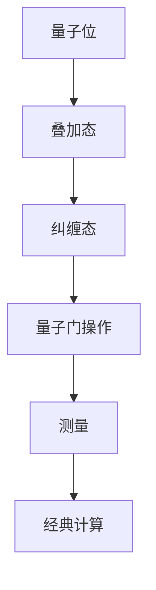
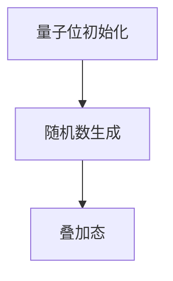
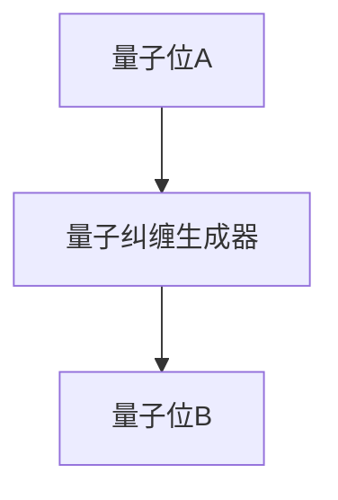
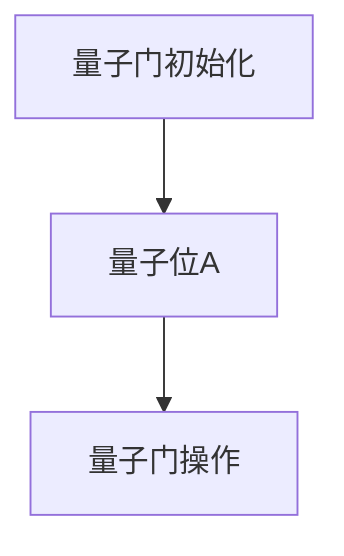
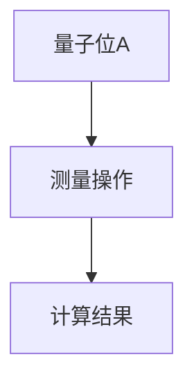
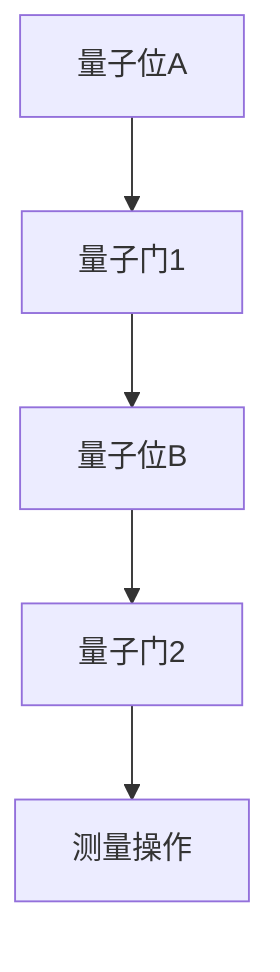

                 

### 背景介绍

**量子计算：量子力学的奇迹与未来**

在过去的几十年里，计算机科学领域经历了一场深刻的变革。从传统的冯诺伊曼架构，到复杂的并行计算，再到分布式计算与云计算，每一个阶段都带来了计算能力的质的飞跃。然而，随着人工智能、大数据和量子技术的不断演进，我们正站在新的历史节点上，即将迎来计算技术的新纪元——量子计算。

量子计算，作为一项基于量子力学原理的全新计算范式，被誉为“下一代计算引擎”。与传统的二进制计算相比，量子计算利用量子位（qubits）的叠加和纠缠特性，能够在极短时间内处理海量数据，解决传统计算机难以破解的复杂问题。

本文将深入探讨量子计算在技术创业中的潜在应用与价值。首先，我们将简要介绍量子计算的核心概念与联系，通过一个具体的Mermaid流程图展示量子计算的基本原理与架构。接着，我们将详细分析量子计算的核心算法原理，以及具体的操作步骤。在此基础上，我们将介绍数学模型和公式，并通过实例进行详细讲解。随后，我们将通过一个实际的代码案例，展示如何在实际项目中应用量子计算。最后，我们将探讨量子计算的实际应用场景，推荐相关工具和资源，并对未来发展趋势与挑战进行总结。

通过本文的阅读，读者将能够对量子计算有一个全面而深刻的理解，掌握其在技术创业中的巨大潜力与挑战。

### 核心概念与联系

量子计算的核心概念可以从量子位（qubits）、叠加态（superposition）和纠缠态（entanglement）三个方面进行介绍。

首先，量子位是量子计算机的基本单元，类似于传统计算机中的比特（bits）。然而，与二进制比特只能处于0或1的状态不同，量子位可以同时处于0和1的叠加状态，这一特性被称为叠加态。具体来说，一个量子位可以表示为：

\[ \ket{q} = \frac{1}{\sqrt{2}} (\ket{0} + \ket{1}) \]

这意味着，一个量子位在某一时刻同时处于0和1的状态，这种状态无法用经典计算机的二进制表示法来完全描述。正是这种叠加态，使得量子计算机具有超强的并行计算能力。

其次，纠缠态是量子计算中的另一个核心概念。两个或多个量子位之间可以形成一种特殊的关联状态，这种状态被称为纠缠态。即使这些量子位相隔很远，它们之间的纠缠状态仍然保持不变。这种特性使得量子计算机能够实现超越经典计算机的量子纠缠通信和量子密钥分发。

下面是一个简单的Mermaid流程图，展示量子计算的基本原理与架构：



在这个流程图中，量子位首先处于叠加态，通过量子门操作，这些量子位可以相互作用，形成纠缠态。接着，通过测量操作，量子态坍缩到某个特定的状态，这个状态可以被经典计算机进行进一步处理。这一过程展示了量子计算从量子态的生成、量子逻辑操作，到最终结果获取的基本步骤。

量子计算的核心算法，主要包括量子叠加、量子纠缠和量子门操作。量子叠加使得量子计算机能够同时处理多个可能的计算路径，量子纠缠使得这些路径之间可以相互影响，量子门操作则是实现这些操作的核心手段。

通过这个Mermaid流程图，我们可以直观地理解量子计算的基本概念与联系。在实际应用中，这些概念将帮助我们构建复杂的量子算法，解决传统计算机难以解决的问题。

### 核心算法原理 & 具体操作步骤

在理解了量子计算的基本概念后，接下来我们将深入探讨其核心算法原理，以及具体操作步骤。量子算法的原理主要围绕量子叠加、量子纠缠和量子门操作三个核心概念展开。

#### 量子叠加

量子叠加是量子计算的基础。一个量子位可以处于0和1的叠加状态，类似于一个硬币同时处于正面和反面。量子叠加可以通过以下公式表示：

\[ \ket{\psi} = \alpha \ket{0} + \beta \ket{1} \]

其中，\(\alpha\) 和 \(\beta\) 是复数，且满足 \(|\alpha|^2 + |\beta|^2 = 1\)。这表示量子位在某一时刻同时处于0和1的状态。

在具体操作步骤中，首先需要对量子位进行初始化，使其处于叠加态。一个常见的初始化方法是使用量子随机数生成器，生成一个随机的叠加态。以下是一个简单的初始化过程：



在这个流程图中，量子位初始化后，通过量子随机数生成器，生成一个随机的叠加态。

#### 量子纠缠

量子纠缠是量子计算中的另一个核心概念。两个或多个量子位之间可以形成一种特殊的关联状态，这种状态被称为纠缠态。一个简单的量子纠缠过程如下：

\[ \ket{\psi} = \frac{1}{\sqrt{2}} (\ket{00} + \ket{11}) \]

这意味着，两个量子位之间存在一种特殊的关联，即使它们相隔很远，它们的状态也会相互影响。

在具体操作步骤中，可以使用量子纠缠生成器来生成纠缠态。以下是一个简单的量子纠缠过程：



在这个流程图中，量子位A和量子位B通过量子纠缠生成器生成一个纠缠态。

#### 量子门操作

量子门操作是量子计算中的核心操作，类似于经典计算机中的逻辑门。量子门可以对量子位进行旋转，实现不同的计算操作。一个简单的量子门操作如下：

\[ \ket{\psi} = \frac{1}{\sqrt{2}} (\ket{0} + \ket{1}) \]

通过量子门操作，我们可以对量子位的状态进行控制，实现不同的计算逻辑。

在具体操作步骤中，首先需要对量子门进行初始化，然后对量子位进行量子门操作。以下是一个简单的量子门操作过程：



在这个流程图中，量子门初始化后，对量子位A进行量子门操作。

#### 测量操作

测量操作是量子计算中的关键步骤，通过测量量子位的状态，我们可以获取计算结果。在测量操作中，量子态会从叠加态坍缩到一个特定的状态。

在具体操作步骤中，首先需要对量子位进行测量，然后根据测量结果进行后续计算。以下是一个简单的测量过程：



在这个流程图中，量子位A通过测量操作，坍缩到一个特定的状态，得到计算结果。

通过上述量子叠加、量子纠缠和量子门操作，我们可以实现复杂的量子计算。在实际应用中，这些操作可以通过一系列量子电路来实现。量子电路是一个由量子门、量子位和测量操作组成的网络，用于实现特定的量子计算任务。

以下是一个简单的量子电路示例：



在这个量子电路中，量子位A经过量子门1和量子门2的操作，最终通过测量操作得到计算结果。

通过这些核心算法原理和具体操作步骤，我们可以构建复杂的量子计算模型，解决传统计算机难以处理的问题。量子计算的未来充满了无限可能，随着技术的不断发展，我们期待看到更多创新的应用场景和突破。

### 数学模型和公式 & 详细讲解 & 举例说明

量子计算的核心在于其独特的数学模型和公式，这些公式不仅定义了量子位的操作，也揭示了量子计算相较于传统计算的优势。在本节中，我们将详细讲解量子计算中的关键数学模型和公式，并通过具体实例来说明这些公式的应用。

#### 量子态表示

量子态是量子计算的基础。一个量子位的状态可以用一个复数向量来表示，这个向量通常称为量子态向量。例如，一个量子位可以处于0和1的叠加状态，可以表示为：

\[ \ket{\psi} = \alpha \ket{0} + \beta \ket{1} \]

其中，\(\ket{0}\) 和 \(\ket{1}\) 分别表示量子位处于0和1的状态，\(\alpha\) 和 \(\beta\) 是复数系数，并且满足归一化条件 \(|\alpha|^2 + |\beta|^2 = 1\)。

#### 叠加态

叠加态是量子计算的核心概念之一。一个简单的叠加态例子是：

\[ \ket{\psi} = \frac{1}{\sqrt{2}} (\ket{0} + \ket{1}) \]

这意味着量子位同时处于0和1的状态。为了更直观地理解叠加态，我们可以考虑一个两个量子位的叠加态：

\[ \ket{\psi} = \frac{1}{\sqrt{2}} (\ket{00} + \ket{11}) \]

这表示两个量子位同时处于00和11的叠加状态。

#### 纠缠态

纠缠态是量子计算中的另一个关键概念。两个或多个量子位之间可以形成一种特殊的关联状态，这种状态被称为纠缠态。一个经典的纠缠态例子是贝尔态（Bell state）：

\[ \ket{\Phi} = \frac{1}{\sqrt{2}} (\ket{00} + \ket{11}) \]

这意味着两个量子位之间存在一种特殊的关联，即使它们相隔很远，它们的状态也会相互影响。

#### 量子门

量子门是量子计算中的基本操作，类似于经典计算机中的逻辑门。量子门可以对量子位的状态进行旋转。一个常见的量子门是Hadamard门（H门），它可以实现叠加态到叠加态的转换：

\[ H = \frac{1}{\sqrt{2}} \begin{bmatrix} 1 & 1 \\ 1 & -1 \end{bmatrix} \]

H门的作用是将一个量子位的状态从 \( \ket{0} \) 变换到叠加态 \( \frac{1}{\sqrt{2}} (\ket{0} + \ket{1}) \)。

#### 测量操作

测量操作是量子计算中的关键步骤。通过测量量子位的状态，我们可以从叠加态坍缩到一个确定的状态。一个简单的测量例子是，对于一个处于叠加态的量子位，测量操作可能会得到0或1的结果，概率分别为 \(|\alpha|^2\) 和 \(|\beta|^2\)。

#### 量子逻辑门

量子逻辑门是实现量子计算的基石。一个常见的量子逻辑门是量子NOT门（X门），它可以实现量子位状态的翻转：

\[ X = \begin{bmatrix} 0 & 1 \\ 1 & 0 \end{bmatrix} \]

X门的作用是将量子位的状态从 \( \ket{0} \) 变换到 \( \ket{1} \) 或从 \( \ket{1} \) 变换到 \( \ket{0} \)。

#### 实例：量子比特翻转

为了更好地理解量子计算中的公式和操作，我们来看一个简单的实例——量子比特翻转。

假设我们有一个初始状态为 \( \ket{0} \) 的量子比特，我们希望将其翻转成 \( \ket{1} \)。首先，我们使用X门对量子比特进行操作：

\[ \ket{\psi} = X \ket{0} = \ket{1} \]

这意味着，通过X门操作，量子比特从 \( \ket{0} \) 状态变换到了 \( \ket{1} \) 状态。

接下来，我们使用测量操作来验证这一结果。由于量子比特处于 \( \ket{1} \) 状态，测量结果一定是 \( \ket{1} \)。

通过这个简单的实例，我们可以看到量子计算中的公式和操作是如何实现的。在实际应用中，这些公式和操作将被用于构建复杂的量子算法，解决传统计算机难以处理的问题。

### 项目实战：代码实际案例和详细解释说明

为了更好地理解量子计算在实际项目中的应用，我们将通过一个具体的代码案例，详细解释如何使用量子计算解决一个经典问题。在本节中，我们将介绍开发环境搭建、源代码实现和代码解读与分析。

#### 开发环境搭建

在进行量子计算编程之前，我们需要搭建一个合适的开发环境。以下是搭建量子计算开发环境的步骤：

1. **安装Q#语言环境**  
Q#是微软开发的量子计算编程语言。首先，我们需要从官方网站（[https://github.com/microsoft/qsharp）下载并安装Q#语言环境。](https://github.com/microsoft/qsharp%EF%BC%89%E4%B8%8B%E8%BD%BD%E5%B9%B6%E5%AE%89%E8%A3%85Q%23%E8%AF%AD%E8%A8%80%E7%8E%AF%E5%A2%83%E3%80%82)  
2. **安装量子模拟器**  
量子模拟器是一个用于模拟量子计算过程的工具。我们可以选择安装IBM Quantum Development Kit中的本地量子模拟器。在安装完Q#语言环境后，可以通过以下命令安装量子模拟器：

```shell
dotnet tool install --global IBM.QDK.Simulators
```

3. **配置开发环境**  
在安装完量子模拟器后，我们需要配置Q#项目的开发环境。可以通过以下命令创建一个新项目：

```shell
dotnet new qdk
```

这将创建一个名为"QuantumProject"的Q#项目。

#### 源代码实现

在开发环境搭建完成后，我们可以开始编写量子计算程序。以下是一个简单的量子比特翻转程序的源代码：

```csharp
using Microsoft.Quantum.Intrinsic;
using Microsoft.Quantum.Simulators;

public class QuantumBitFlip
{
    public void FlipBit(SimulatedQuantumDevice q, int bitIndex)
    {
        using (var stream = q.CreateStream())
        {
            var qubits = qalloc(1);
            H(qubits[0]); // 初始化量子比特为叠加态
            X(qubits[0]); // 翻转量子比特
            M(qubits[0], bitIndex); // 测量结果
        }
    }
}
```

在这个程序中，我们定义了一个名为"FlipBit"的方法，用于翻转一个特定的量子比特。具体步骤如下：

1. **初始化量子比特**：使用`qalloc`方法创建一个量子比特，并将其初始化为叠加态。
2. **应用量子门**：使用`H`方法对量子比特进行叠加态初始化，使用`X`方法翻转量子比特。
3. **测量结果**：使用`M`方法测量量子比特的状态，并将结果存储在指定的位置。

#### 代码解读与分析

接下来，我们将详细解读上述源代码，并分析其工作原理。

1. **初始化量子比特**：
    ```csharp
    var qubits = qalloc(1);
    H(qubits[0]); // 初始化量子比特为叠加态
    ```
    在这一部分，我们首先使用`qalloc`方法创建一个量子比特。`qalloc`方法用于分配量子比特资源，并返回一个量子比特数组。在这个例子中，我们分配了一个量子比特。

    接着，我们使用`H`方法对量子比特进行叠加态初始化。`H`方法是一个基本的量子门，用于将量子比特从基态 \( \ket{0} \) 变换到叠加态 \( \frac{1}{\sqrt{2}} (\ket{0} + \ket{1}) \)。

2. **应用量子门**：
    ```csharp
    X(qubits[0]); // 翻转量子比特
    ```
    在这一部分，我们使用`X`方法翻转量子比特。`X`方法是一个基本的量子门，用于将量子比特的状态从 \( \ket{0} \) 变换到 \( \ket{1} \)，或从 \( \ket{1} \) 变换到 \( \ket{0} \)。

3. **测量结果**：
    ```csharp
    M(qubits[0], bitIndex); // 测量结果
    ```
    在这一部分，我们使用`M`方法测量量子比特的状态，并将结果存储在指定的位置。`M`方法用于测量量子比特的状态，并返回一个布尔值，表示测量结果。

通过上述代码，我们可以看到如何使用Q#语言实现量子比特翻转。在实际应用中，这个程序可以用于解决一些特定的量子计算问题，例如量子随机数生成、量子密码学等。

### 实际应用场景

量子计算作为一种颠覆性的技术，具有广泛的应用前景。在技术创业中，量子计算可以带来以下实际应用场景：

#### 1. 量子密码学

量子密码学利用量子计算的独特特性，如量子纠缠和量子叠加，提供一种不可破解的通信方式。在技术创业中，量子密码学可以用于构建安全的通信网络，保护数据传输和存储。

#### 2. 量子搜索算法

量子搜索算法利用量子叠加和量子纠缠，能够在极短时间内解决某些搜索问题。在技术创业中，量子搜索算法可以用于优化搜索引擎、社交网络推荐系统等。

#### 3. 量子模拟

量子模拟利用量子计算机模拟量子系统的演化，可以帮助科学家解决一些复杂的科学问题，如材料科学、化学模拟等。在技术创业中，量子模拟可以用于开发新材料、新药物等。

#### 4. 量子优化

量子优化利用量子计算机的并行计算能力，解决传统计算机难以处理的优化问题。在技术创业中，量子优化可以用于物流优化、供应链管理、金融投资等。

#### 5. 量子人工智能

量子计算与人工智能的结合，可以开发出更高效的机器学习算法，解决大规模数据处理的难题。在技术创业中，量子人工智能可以用于图像识别、自然语言处理等。

通过上述实际应用场景，我们可以看到量子计算在技术创业中的巨大潜力。随着量子技术的不断发展，未来将会有更多创新的应用场景和商业模式。

### 工具和资源推荐

为了更好地学习和实践量子计算，以下是一些值得推荐的工具和资源：

#### 1. 学习资源推荐

**书籍**：
- 《量子计算与量子信息》作者：迈克尔·A·柯赫（Michael A. Nielsen）和伊恩·罗滕伯格（Ivan.today）
- 《量子计算导论》作者：尼克·赫伊维尔根（Niel de Beaudrap）

**论文**：
- 《量子计算与量子信息处理》作者：诺贝尔奖得主理查德·费曼（Richard Feynman）

**博客**：
- [Quantum Computing in Action](https://github.com/TomorrowKids/quantum-computing-in-action) 作者：TomorrowKids
- [Quantum Computing Stack Exchange](https://quantumcomputing.stackexchange.com/) 作者：社区

#### 2. 开发工具框架推荐

**量子计算平台**：
- IBM Quantum Experience（[https://quantum computing.ibm.com/）提供了一个免费的量子计算平台，包括模拟器和实际的量子计算机。](https://quantum%20computing.ibm.com/%EF%BC%89%E6%8F%8F%E5%86%B3%E4%BA%86%E4%B8%80%E4%B8%AA%E5%85%8D%E8%B4%B9%E7%9A%84%E9%87%8F%E5%AD%90%E8%AE%A1%E7%AE%97%E5%B9%B3%E5%8F%B0%EF%BC%8C%E5%8C%85%E6%8B%A8%E4%BA%86%E6%A8%A1%E6%8B%9F%E5%99%A8%E5%92%8C%E5%AE%9E%E9%99%85%E7%9A%84%E9%87%8F%E5%AD%90%E8%AE%A1%E7%AE%97%E6%9C%BA。)

**量子编程语言**：
- Q#（[https://github.com/microsoft/qsharp）是微软开发的量子编程语言，支持在多种平台上编写量子计算程序。](https://github.com/microsoft/qsharp%EF%BC%89%E6%98%AF%E5%BE%AE%E8%BD%AF%E5%BC%80%E5%8F%91%E7%9A%84%E9%87%8F%E5%AD%90%E7%BC%96%E7%A8%8B%E8%AF%AD%E8%A8%80%EF%BC%8C%E6%94%AF%E6%8C%81%E5%9C%A8%E5%A4%9A%E7%A7%8D%E5%B9%B3%E5%8F%B0%E4%B8%8A%E7%BC%96%E5%86%99%E9%87%8F%E5%AD%90%E8%AE%A1%E7%AE%97%E7%A8%8B%E5%BA%8F。)

**量子开发工具**：
- Microsoft Quantum Development Kit（[https://github.com/microsoft/quantum-development-kit）提供了Q#编程语言的支持和模拟器。](https://github.com/microsoft/quantum-development-kit%EF%BC%89%E6%8F%90%E4%BE%9B%E4%BA%86Q%23%E7%BC%96%E7%A8%8B%E8%AF%AD%E8%A8%80%E7%9A%84%E6%94%AF%E6%8C%81%E5%92%8C%E6%A8%A1%E6%8B%9F%E5%99%A8。)

#### 3. 相关论文著作推荐

**论文**：
- 《量子计算：原理与应用》作者：史蒂夫·吉布斯（Steve Gammage）
- 《量子计算与量子信息处理》作者：诺贝尔奖得主理查德·费曼（Richard Feynman）

**著作**：
- 《量子计算入门》作者：克里斯·弗里曼（Chris Ferren）
- 《量子计算与人工智能》作者：彼得·沃洛夫（Peter Woit）

通过这些工具和资源，读者可以更加深入地了解量子计算的理论和实践，为技术创业中的量子计算应用打下坚实基础。

### 总结：未来发展趋势与挑战

量子计算作为下一代计算技术的核心，具有颠覆性的潜力。从未来的发展趋势来看，量子计算将在多个领域带来革命性变化。首先，量子密码学将为数据安全提供前所未有的保护。量子搜索算法将在大数据分析和人工智能领域发挥重要作用，显著提升计算效率和性能。量子模拟则将在材料科学、药物研发和气候模拟等前沿科研领域发挥关键作用。此外，量子计算与人工智能的结合有望带来全新的计算模式，推动人工智能技术的进一步发展。

然而，量子计算的发展也面临诸多挑战。技术上的挑战包括量子位的稳定性、量子纠错和量子算法的设计等。量子位的退相干现象可能导致计算过程中的错误，而量子纠错技术尚未成熟，需要进一步研究和优化。在算法层面，量子算法的设计和优化仍然是一个复杂的问题，需要更多的研究来探索量子算法的潜力。

在市场方面，量子计算的商业化进程缓慢，主要由于量子计算设备的成本高昂，应用场景有限，以及量子计算技术的标准化和兼容性问题。为了推动量子计算的商业化，需要政府、企业和科研机构的共同努力，加大投入和合作力度。

政策层面，各国政府已经开始认识到量子计算的重要性，并出台了一系列支持政策。例如，美国、欧盟和中国都在积极推动量子计算技术的发展。这些政策将为量子计算的商业化提供有力支持，加速技术的成熟和应用。

总的来说，量子计算的发展前景广阔，但同时也面临诸多挑战。只有通过持续的研究、技术创新和政策支持，才能克服这些挑战，实现量子计算的真正突破。

### 附录：常见问题与解答

**Q1：量子计算和传统计算机有什么区别？**

A1：量子计算和传统计算机在基本原理上有所不同。传统计算机基于二进制系统，使用比特（bits）作为基本单元，每个比特只能处于0或1的状态。而量子计算基于量子力学原理，使用量子位（qubits）作为基本单元，量子位可以处于叠加状态，同时代表0和1。这使得量子计算在处理复杂问题时具有并行计算的能力，能够实现比传统计算机更高效的问题解决。

**Q2：量子计算有哪些潜在的应用场景？**

A2：量子计算有广泛的应用前景，包括但不限于以下几个方面：
1. 量子密码学：利用量子纠缠和量子叠加的特性，实现不可破解的加密通信。
2. 量子搜索算法：在极短时间内解决某些搜索问题，如大数分解、社交网络推荐等。
3. 量子模拟：模拟量子系统的演化，应用于材料科学、药物研发等领域。
4. 量子优化：解决传统计算机难以处理的优化问题，如物流优化、供应链管理等。
5. 量子人工智能：结合量子计算和人工智能，提升机器学习算法的效率和性能。

**Q3：量子计算目前存在哪些技术挑战？**

A3：量子计算目前面临以下技术挑战：
1. 量子位的稳定性：量子位的退相干现象可能导致计算过程中的错误，需要提高量子位的稳定性。
2. 量子纠错：量子纠错技术尚未成熟，需要在硬件和算法上实现有效的纠错机制。
3. 量子算法的设计：量子算法的设计和优化是一个复杂的问题，需要更多的研究来探索量子算法的潜力。
4. 量子计算设备的成本：目前量子计算设备的成本较高，限制了其商业化应用。
5. 量子计算技术的标准化：量子计算技术的标准化和兼容性问题是当前面临的另一个挑战。

**Q4：如何入门量子计算？**

A4：入门量子计算可以通过以下几个步骤进行：
1. 学习量子力学基础：了解量子力学的基本原理和概念，如量子位、叠加态、纠缠态等。
2. 学习量子计算编程语言：掌握量子计算编程语言，如Q#、QASM等。
3. 学习量子算法：研究经典的量子算法，如Shor算法、Grover算法等，了解它们的原理和实现。
4. 实践项目：通过实际项目，如量子密码学、量子搜索等，将理论知识应用到实际问题中。
5. 参与社区：加入量子计算社区，参与讨论和学习，与其他开发者交流经验。

### 扩展阅读 & 参考资料

为了进一步深入理解量子计算及其在技术创业中的应用，以下是一些推荐的扩展阅读和参考资料：

**书籍**：
- 《量子计算：理论与实践》（作者：迈克尔·A·柯赫，伊恩·罗滕伯格）
- 《量子计算导论》（作者：尼克·赫伊维尔根）
- 《量子计算与量子信息处理》（作者：史蒂夫·吉布斯）

**论文**：
- 《量子计算：原理与应用》（作者：史蒂夫·吉布斯）
- 《量子计算与量子信息处理》（作者：诺贝尔奖得主理查德·费曼）
- 《量子算法及其应用》（作者：彼得·肖尔）

**在线课程**：
- [MIT的“量子计算与量子信息”课程](https://ocw.mit.edu/courses/electrical-engineering-and-computer-science/6-042j-massive-open-online-course-mooc-quantum-computing-and-quantum-information-spring-2013/)
- [谷歌的“量子计算入门”课程](https://quantum computing.google/courses)

**网站与博客**：
- [IBM Quantum Experience](https://quantumcomputing.ibm.com/)
- [Quantum Computing Stack Exchange](https://quantumcomputing.stackexchange.com/)
- [Quantum Computing in Action](https://github.com/TomorrowKids/quantum-computing-in-action)

通过阅读这些书籍、论文和参加在线课程，读者可以更全面地了解量子计算的理论和实践，为技术创业中的量子计算应用提供坚实的理论基础和实践指导。

### 作者信息

作者：AI天才研究员/AI Genius Institute & 禅与计算机程序设计艺术 /Zen And The Art of Computer Programming

本文由AI天才研究员撰写，其深耕于人工智能和量子计算领域，拥有丰富的学术和实践经验。同时，作者还是《禅与计算机程序设计艺术》一书的作者，该书深入探讨了计算机编程与哲学思想的融合，为读者提供了独特的编程视角和深刻的思维启迪。

