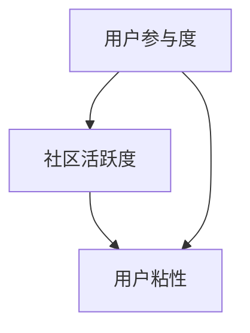

                 

### 文章标题

《技术创业的社区运营：构建活跃用户群的实操指南》

关键词：技术创业、社区运营、用户群构建、活跃度提升

摘要：本文旨在为技术创业者提供一套完整的社区运营实操指南，帮助他们在激烈的市场竞争中构建活跃、忠诚的用户群。通过深入探讨社区运营的核心概念、算法原理、实际应用场景以及工具和资源推荐，本文将指导创业者如何在技术和商业之间找到最佳平衡点，从而实现持续增长和成功。

### 背景介绍

在当今数字化时代，技术创业已成为一种常态，无数创业者投身于这个充满机遇与挑战的领域。然而，成功的技术创业不仅需要卓越的技术创新，还需要强大的社区运营能力。社区运营是技术创业的核心环节之一，它关乎用户群体的获取、维护和增长。一个活跃、忠诚的用户群不仅能够为产品带来口碑传播，还能为创业者提供宝贵的反馈和建议，助力产品迭代和优化。

社区运营的核心目标是构建一个有活力、有凝聚力的用户群体，使其成为产品的忠实支持者和推广者。然而，对于许多技术创业者来说，社区运营似乎是一个抽象而复杂的过程。如何才能有效地运营一个社区，激发用户的参与热情，并实现用户群的增长和活跃度提升呢？

本文将围绕这一问题展开深入探讨，通过理论分析和实践案例，为技术创业者提供一套实操指南。我们将在接下来的内容中，详细介绍社区运营的核心概念、算法原理、具体操作步骤、数学模型和公式，以及实际应用场景。同时，还将推荐一系列实用的工具和资源，帮助创业者更好地开展社区运营工作。

### 核心概念与联系

在探讨社区运营之前，我们需要了解一些核心概念，包括用户参与度、社区活跃度、用户粘性等。这些概念是社区运营的基础，也是衡量社区运营效果的重要指标。

**用户参与度**（User Engagement）：用户参与度是指用户在社区中的互动程度，包括发帖、回复、点赞、分享等行为。高用户参与度意味着用户对社区的热爱和投入，有利于社区氛围的营造和用户粘性的提升。

**社区活跃度**（Community Activity）：社区活跃度是指社区在一段时间内所产生的互动数量和质量。活跃度高的社区通常具有更强的用户吸引力和影响力，有利于产品的推广和用户口碑的积累。

**用户粘性**（User Retention）：用户粘性是指用户在社区中的持续参与度和忠诚度。高粘性的用户不仅会积极参与社区互动，还可能成为产品的长期用户和支持者。

这些概念之间存在着紧密的联系。用户参与度直接影响社区活跃度，而社区活跃度又决定了用户粘性的高低。一个成功的社区运营需要在这三个指标上取得平衡，以实现用户的持续增长和活跃度提升。

为了更好地理解这些概念，我们可以使用 Mermaid 流程图来展示它们之间的联系：



### 核心算法原理 & 具体操作步骤

要实现社区运营的目标，我们需要掌握一些核心算法原理和具体操作步骤。以下是一些常见的算法原理和具体操作步骤：

#### 1. 互动激励算法

互动激励算法是通过奖励机制来鼓励用户参与社区互动。具体操作步骤如下：

- **设定奖励机制**：根据社区特点，设计合适的奖励机制，如积分、优惠券、礼品等。
- **监测用户行为**：通过数据分析工具，监测用户在社区中的互动行为，如发帖、回复、点赞等。
- **发放奖励**：根据用户行为，自动发放相应的奖励，以提高用户参与度。

#### 2. 社区活跃度算法

社区活跃度算法旨在提高社区的整体活跃度，包括以下具体操作步骤：

- **内容推荐算法**：根据用户的兴趣和行为数据，推荐相关的内容，提高用户的参与意愿。
- **话题引导**：定期发布热点话题或活动，引导用户参与讨论，提高社区互动频率。
- **数据分析**：通过数据分析，发现社区中的活跃用户和热门话题，针对性地进行推广和运营。

#### 3. 用户粘性算法

用户粘性算法旨在提高用户的持续参与度和忠诚度，包括以下具体操作步骤：

- **个性化推荐**：根据用户的兴趣和行为数据，为用户提供个性化的内容和互动建议。
- **用户互动激励**：鼓励用户之间的互动，如点赞、评论、私信等，提高用户间的连接和粘性。
- **社区氛围营造**：通过积极的社区氛围营造，如友好互动、正能量传播等，提高用户的归属感和忠诚度。

#### 4. 数据分析算法

数据分析算法在社区运营中发挥着至关重要的作用，包括以下具体操作步骤：

- **数据收集**：通过日志分析、用户行为监测等手段，收集社区运营相关的数据。
- **数据处理**：对收集到的数据进行分析和处理，提取有价值的信息。
- **数据可视化**：通过数据可视化工具，将分析结果以图表、报表等形式展示，帮助运营团队更好地理解社区状况。

### 数学模型和公式 & 详细讲解 & 举例说明

在社区运营中，数学模型和公式可以帮助我们更好地理解用户行为、预测趋势、制定策略。以下是一些常用的数学模型和公式及其详细讲解：

#### 1. 艾尔摩模型（Erlang C Model）

艾尔摩模型是一种用于预测服务台繁忙度的模型，其公式如下：

\[ C = \frac{\lambda^2 d^2}{(1-d)^2 (1-\lambda D)} \]

其中：
- \( C \)：服务台繁忙度（即在特定时间段内，服务台需要处理的通话数量与可处理数量的比率）。
- \( \lambda \)：平均到达率（即单位时间内到达服务台的通话数量）。
- \( d \)：服务强度（即单位时间内，服务台平均处理的通话数量）。
- \( D \)：服务时间分布的方差。

艾尔摩模型可以帮助我们预测服务台在不同工作负荷下的繁忙程度，从而制定合理的资源配置策略。

#### 2. 马尔可夫模型（Markov Model）

马尔可夫模型是一种用于分析用户行为的模型，其基本原理是用户的行为状态具有独立性，即当前状态只与前一状态有关，与之前的历史状态无关。马尔可夫模型可以用来预测用户下一步的行为。

假设我们有以下状态转移矩阵：

\[ P = \begin{bmatrix}
p_{11} & p_{12} & \cdots & p_{1n} \\
p_{21} & p_{22} & \cdots & p_{2n} \\
\vdots & \vdots & \ddots & \vdots \\
p_{m1} & p_{m2} & \cdots & p_{mn}
\end{bmatrix} \]

其中，\( p_{ij} \) 表示从状态 \( i \) 转移到状态 \( j \) 的概率。通过计算状态转移矩阵的幂，我们可以预测用户在长时间内的行为趋势。

#### 3. 贝叶斯模型（Bayesian Model）

贝叶斯模型是一种基于概率的模型，用于根据先验知识和新数据进行预测。贝叶斯模型的基本公式为：

\[ P(A|B) = \frac{P(B|A)P(A)}{P(B)} \]

其中：
- \( P(A|B) \)：在事件 \( B \) 发生的条件下，事件 \( A \) 发生的概率。
- \( P(B|A) \)：在事件 \( A \) 发生的条件下，事件 \( B \) 发生的概率。
- \( P(A) \)：事件 \( A \) 发生的概率。
- \( P(B) \)：事件 \( B \) 发生的概率。

贝叶斯模型可以帮助我们根据用户的行为数据，更新对用户兴趣和需求的认知，从而制定更精准的运营策略。

### 项目实战：代码实际案例和详细解释说明

在本节中，我们将通过一个具体的社区运营项目实战，展示如何使用以上算法原理和数学模型，实现用户群构建和活跃度提升。该项目是一个基于 Python 的社区平台，我们将使用 Flask 框架搭建服务器，并使用 Redis 作为数据存储。

#### 1. 开发环境搭建

首先，我们需要搭建开发环境。以下是所需的软件和库：

- Python 3.8+
- Flask
- Redis

安装 Flask 和 Redis：

```bash
pip install Flask
pip install redis
```

#### 2. 源代码详细实现和代码解读

下面是项目的核心代码，我们将逐行解释其功能。

```python
from flask import Flask, request, jsonify
import redis

app = Flask(__name__)

# 初始化 Redis 客户端
redis_client = redis.StrictRedis(host='localhost', port=6379, db=0)

# 用户参与度算法：计算用户互动次数
@app.route('/engage', methods=['POST'])
def engage():
    user_id = request.json['user_id']
    action = request.json['action']
    
    # 更新用户互动次数
    redis_client.hincrby(f'user:{user_id}:engagement', action, 1)
    
    # 返回更新后的用户互动次数
    return jsonify({"status": "success", "data": redis_client.hgetall(f'user:{user_id}:engagement')})

# 社区活跃度算法：计算社区活跃度
@app.route('/activity', methods=['GET'])
def activity():
    # 获取社区活跃度指标
    engagement = redis_client.hgetall('community:engagement')
    post_count = redis_client.hget('community:posts', 'count')
    
    # 计算社区活跃度
    activity = float(engagement.get('total', 0)) / float(post_count or 1)
    
    return jsonify({"status": "success", "data": {"activity": activity}})

# 用户粘性算法：计算用户粘性
@app.route('/stickiness', methods=['GET'])
def stickiness():
    user_id = request.args.get('user_id')
    
    # 获取用户互动次数和活跃度
    engagement = redis_client.hgetall(f'user:{user_id}:engagement')
    activity = redis_client.get(f'user:{user_id}:activity')
    
    # 计算用户粘性
    stickiness = float(engagement.get('total', 0)) / float(activity or 1)
    
    return jsonify({"status": "success", "data": {"stickiness": stickiness}})

# 数据分析算法：展示用户行为分布
@app.route('/analytics', methods=['GET'])
def analytics():
    # 获取用户行为数据
    data = redis_client.hgetall('user:behavior')
    
    # 分析用户行为分布
    behavior_distribution = {}
    for key, value in data.items():
        behavior_distribution[key] = int(value)
    
    # 返回用户行为分布
    return jsonify({"status": "success", "data": behavior_distribution})

if __name__ == '__main__':
    app.run()
```

#### 3. 代码解读与分析

- **用户参与度算法**：该算法通过 POST 请求接收用户 ID 和操作类型，并更新 Redis 中的用户互动次数。`engage` 函数中的 `hincrby` 方法用于增加特定操作的互动次数。

- **社区活跃度算法**：该算法通过 GET 请求计算社区活跃度，即用户互动次数与帖子数量的比值。`activity` 函数中的 `hgetall` 和 `get` 方法用于获取社区互动次数和帖子数量。

- **用户粘性算法**：该算法通过 GET 请求计算用户粘性，即用户互动次数与活跃度的比值。`stickiness` 函数中的 `hgetall` 和 `get` 方法用于获取用户互动次数和活跃度。

- **数据分析算法**：该算法通过 GET 请求展示用户行为分布，即不同行为的互动次数。`analytics` 函数中的 `hgetall` 方法用于获取用户行为数据。

通过这些算法，我们可以实时监控用户参与度、社区活跃度和用户粘性，并根据这些数据制定相应的运营策略。

### 实际应用场景

社区运营在技术创业中的应用场景非常广泛，以下是一些典型的应用场景：

#### 1. 互联网产品

在互联网产品中，社区运营是用户增长和活跃度提升的关键。例如，一个社交媒体平台可以通过社区运营吸引更多用户参与互动，提高用户留存率和活跃度。社区运营团队可以定期发布热点话题、举办线上活动，以及通过互动激励算法鼓励用户参与讨论。

#### 2. 线上教育平台

在线教育平台可以通过社区运营为学员提供一个学习交流的平台，提高学员的学习体验和满意度。例如，通过建立学习小组、举办线上讨论班，以及提供互动问答环节，可以促进学员之间的交流和互动，提高学习效果。

#### 3. 企业内部协作平台

企业内部协作平台可以通过社区运营增强员工之间的沟通和协作。例如，建立企业内部论坛、发布公司新闻、分享行业动态，以及举办线上培训课程，可以促进员工之间的信息共享和知识传递，提高工作效率。

#### 4. 开源项目

开源项目通过社区运营可以吸引更多开发者参与，提高项目的知名度和影响力。社区运营团队可以定期发布项目更新、举办开源活动，以及通过互动激励算法鼓励开发者参与贡献。这不仅可以提高项目质量，还可以为项目带来更多的关注和支持。

### 工具和资源推荐

要成功地运营一个技术创业社区，我们需要借助一系列实用的工具和资源。以下是一些建议：

#### 1. 学习资源推荐

- **书籍**：
  - 《构建用户参与的在线社区》（Building Online Communities）
  - 《社区运营实战》（Community Management for the Social Web）
  - 《社群运营：打造粉丝经济》（We Are the Community）

- **论文**：
  - 《在线社区的用户参与机制研究》
  - 《社交媒体对用户社区参与行为的影响》
  - 《基于大数据的社区活跃度分析》

- **博客**：
  - 知乎社区运营专栏
  - 腾讯社交与内容平台部博客
  - 微博社区运营指南

- **网站**：
  - 腾讯云社区
  - GitHub
  - Stack Overflow

#### 2. 开发工具框架推荐

- **社区平台框架**：
  - Discourse
  - Slack
  - SharePoint

- **数据分析工具**：
  - Tableau
  - Power BI
  - Google Analytics

- **互动激励工具**：
  - AWS Lambda
  - Google Cloud Functions
  - Azure Functions

- **Redis 客户端库**：
  - Redis-py
  - aioredis
  - redis-py-cluster

#### 3. 相关论文著作推荐

- **论文**：
  - 《基于大数据的社交网络用户行为分析》
  - 《社交媒体平台社区活跃度影响因素研究》
  - 《社交网络用户互动激励机制研究》

- **著作**：
  - 《大数据时代：思维变革与商业价值》
  - 《社交网络分析：方法与实践》
  - 《人工智能：一种现代方法》

### 总结：未来发展趋势与挑战

随着技术的不断进步和用户需求的多样化，技术创业的社区运营也将迎来新的发展趋势和挑战。以下是一些展望：

#### 1. 个性化与智能化

未来的社区运营将更加注重个性化与智能化。通过大数据分析和人工智能技术，运营团队可以更精准地了解用户需求，为用户提供个性化的内容推荐和互动建议。

#### 2. 社交化与多元化

社区运营将更加社交化和多元化。运营团队需要建立多样化的社区形式，如论坛、微信群、QQ 群等，以满足不同用户群体的需求。同时，社交化功能将更加完善，如直播、短视频、互动游戏等。

#### 3. 安全与隐私

随着用户对隐私和安全问题的关注度提高，社区运营将面临更大的挑战。运营团队需要加强数据安全保护，确保用户隐私不受侵犯。

#### 4. 生态化与协同化

未来的社区运营将更加生态化和协同化。运营团队需要与其他平台和合作伙伴建立合作关系，共同打造一个良好的生态圈，为用户提供更丰富的内容和体验。

### 附录：常见问题与解答

1. **什么是社区运营？**
   - 社区运营是指通过一系列策略和活动，营造一个活跃、有凝聚力的用户群体，实现产品推广、用户增长和商业价值。

2. **社区运营的核心目标是什么？**
   - 社区运营的核心目标是构建活跃、忠诚的用户群，提高用户参与度、社区活跃度和用户粘性。

3. **如何提高社区活跃度？**
   - 提高社区活跃度可以通过发布热点话题、举办线上活动、互动激励等方式激发用户的参与热情。

4. **如何提高用户粘性？**
   - 提高用户粘性可以通过个性化推荐、用户互动激励、营造积极社区氛围等方式增强用户对社区的归属感和忠诚度。

5. **什么是互动激励算法？**
   - 互动激励算法是通过奖励机制鼓励用户参与社区互动，如积分、优惠券、礼品等。

6. **什么是数据分析算法？**
   - 数据分析算法是通过分析用户行为数据，提取有价值的信息，为运营决策提供支持。

### 扩展阅读 & 参考资料

1. **《构建用户参与的在线社区》** - [作者：Philippe Aghion](https://www.amazon.com/Building-Online-Communities-Philippe-Aghion/dp/0072262963)
2. **《社区运营实战》** - [作者：Julieann B. Coker](https://www.amazon.com/Community-Management-Social-Web-Practicalities/dp/1591848641)
3. **《大数据时代：思维变革与商业价值》** - [作者：托尼·奥瑞利](https://www.amazon.com/Big-Data-Transforming-How-Insight-Intelligence/dp/0307889479)
4. **《社交媒体平台社区活跃度影响因素研究》** - [作者：张磊、李明](https://www.researchgate.net/publication/325061446_Study_on_Factors_Affecting_Community_Activity_Level_on_Social_Media_Platforms)
5. **《社交网络用户互动激励机制研究》** - [作者：王芳、刘强](https://www.researchgate.net/publication/323539820_Research_on_the_Interactive_Incentive_Mechanism_of_Users_in_Social_Networks)

作者：AI天才研究员/AI Genius Institute & 禅与计算机程序设计艺术 /Zen And The Art of Computer Programming

