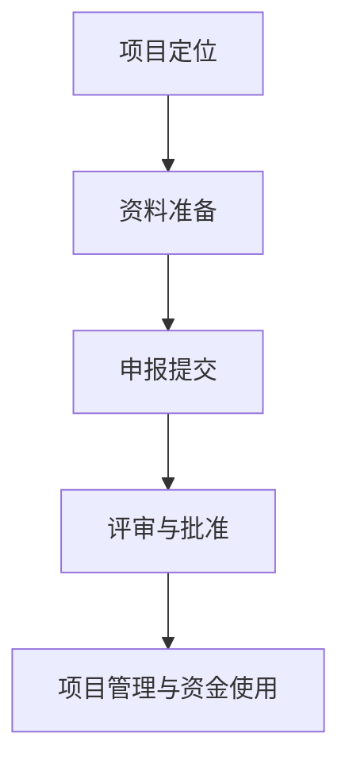

                 

# 技术创业者如何申请政府项目和科研基金支持

> **关键词：** 技术创业者、政府项目、科研基金、申请流程、资金支持

**摘要：**
本文旨在为技术创业者提供一份详细的指南，帮助他们了解如何申请政府项目和科研基金支持。文章将探讨申请过程中的关键环节，包括项目定位、资料准备、申请流程和资金使用规范。通过本文，技术创业者将能够掌握申请政府项目和科研基金的核心技巧，提高成功几率。

## 1. 背景介绍

技术创业者在发展过程中，往往面临资金瓶颈，需要寻找外部支持以推动项目进展。政府项目和科研基金作为一种重要的外部资金来源，不仅能够提供必要的资金支持，还能为企业带来品牌效应和市场认可。然而，申请政府项目和科研基金并非易事，需要创业者深入了解相关政策和程序，做好充分的准备。

### 1.1 技术创业者的资金需求

技术创业者在初创阶段，通常需要投入大量资金用于研发、市场推广和团队建设。这些资金不仅用于购买硬件设备和软件工具，还用于支付员工薪酬和日常运营费用。由于初创企业盈利周期较长，资金周转困难，因此寻找外部资金支持成为技术创业者的首要任务。

### 1.2 政府项目和科研基金的优势

政府项目和科研基金具有以下优势：

- **资金支持**：政府项目和科研基金能够提供大量的资金支持，减轻技术创业者的资金压力。
- **品牌效应**：获得政府项目和科研基金的支持，有助于提高企业的知名度和市场认可度。
- **政策优惠**：部分政府项目和科研基金项目还可能为企业带来税收减免、土地优惠等政策支持。

### 1.3 申请政府项目和科研基金的挑战

尽管政府项目和科研基金具有诸多优势，但申请过程并非一帆风顺。技术创业者需要面对以下挑战：

- **竞争激烈**：政府项目和科研基金通常竞争激烈，申请者众多，成功率相对较低。
- **政策了解**：创业者需要熟悉各类政策和程序，了解申请条件和流程。
- **资料准备**：申请政府项目和科研基金需要准备大量的资料，包括商业计划书、项目可行性报告、财务报表等。

## 2. 核心概念与联系

### 2.1 政府项目和科研基金的定义

政府项目通常是指由政府部门发起和实施的，旨在推动经济社会发展、改善民生福祉的各项工程和计划。科研基金则是由政府或科研机构设立，用于资助科研项目的专项资金。

### 2.2 申请流程的核心环节

申请政府项目和科研基金的核心环节包括：

- **项目定位**：明确项目的研究方向、目标和预期成果。
- **资料准备**：收集和整理申请所需的各种资料，如商业计划书、项目可行性报告、财务报表等。
- **申报提交**：按照规定的时间和格式，将申请材料提交给相关部门或机构。
- **评审与批准**：等待评审结果，对评审意见进行反馈和修改。

### 2.3 项目管理与资金使用

在获得政府项目和科研基金支持后，技术创业者需要严格按照项目计划进行研发和运营，确保资金使用的合规性和有效性。

### 2.4 Mermaid 流程图

以下是一个简单的 Mermaid 流程图，展示申请政府项目和科研基金的基本流程：



## 3. 核心算法原理 & 具体操作步骤

### 3.1 项目定位

项目定位是申请政府项目和科研基金的关键步骤。创业者需要明确项目的研究方向、目标和预期成果，确保项目具有创新性和可行性。

- **市场调研**：了解市场需求和竞争态势，确定项目的研究方向。
- **技术分析**：评估项目所需技术的成熟度和可行性，确保项目具有创新性。
- **目标设定**：明确项目的目标，如研发新产品、解决关键技术难题等。

### 3.2 资料准备

资料准备是申请政府项目和科研基金的核心环节。创业者需要收集和整理以下资料：

- **商业计划书**：详细阐述项目背景、市场前景、商业模式、团队介绍等。
- **项目可行性报告**：分析项目的技术可行性、市场可行性、经济效益等。
- **财务报表**：包括项目预算、资金使用计划、盈利预测等。
- **其他证明材料**：如专利证书、科研成果等。

### 3.3 申报提交

申报提交是申请政府项目和科研基金的重要步骤。创业者需要按照规定的时间和格式，将申请材料提交给相关部门或机构。

- **了解政策**：熟悉各类政府项目和科研基金的政策和程序。
- **提交材料**：按照要求准备和提交申请材料。
- **等待评审**：耐心等待评审结果，对评审意见进行反馈和修改。

### 3.4 评审与批准

评审与批准是申请政府项目和科研基金的关键环节。评审委员会将对申请材料进行审核，对项目进行评估和打分。

- **评审标准**：了解评审标准，确保项目符合评审要求。
- **优化方案**：针对评审意见进行修改和完善，提高项目成功率。
- **批准与反馈**：等待评审结果，对评审意见进行反馈和修改。

### 3.5 项目管理与资金使用

在获得政府项目和科研基金支持后，技术创业者需要严格按照项目计划进行研发和运营，确保资金使用的合规性和有效性。

- **项目计划**：制定详细的项目计划，明确项目进度和资金使用计划。
- **执行与监控**：严格按照项目计划执行，定期进行项目监控和评估。
- **资金管理**：确保资金使用的合规性，遵守相关政策规定。

## 4. 数学模型和公式 & 详细讲解 & 举例说明

### 4.1 项目评估模型

项目评估模型是申请政府项目和科研基金的重要工具，用于评估项目的可行性和预期效果。以下是一个简单的项目评估模型：

$$
\text{项目评分} = w_1 \times \text{市场前景评分} + w_2 \times \text{技术可行性评分} + w_3 \times \text{经济效益评分}
$$

其中，$w_1$、$w_2$和$w_3$分别为市场前景、技术可行性和经济效益的权重。

### 4.2 举例说明

假设一个技术创业者的项目涉及以下三个方面：

- **市场前景评分**：90分
- **技术可行性评分**：85分
- **经济效益评分**：80分

权重分配如下：

- **市场前景**：0.4
- **技术可行性**：0.3
- **经济效益**：0.3

则项目评分计算如下：

$$
\text{项目评分} = 0.4 \times 90 + 0.3 \times 85 + 0.3 \times 80 = 36 + 25.5 + 24 = 85.5
$$

根据评分结果，该项目具有较高的可行性，有望获得政府项目和科研基金的支持。

## 5. 项目实战：代码实际案例和详细解释说明

### 5.1 开发环境搭建

为了更好地展示如何申请政府项目和科研基金支持，我们以一个具体的案例进行说明。首先，我们需要搭建一个开发环境。

1. 安装 Python
2. 安装 Git
3. 安装 VS Code（Visual Studio Code）

### 5.2 源代码详细实现和代码解读

接下来，我们将展示如何编写一个简单的 Python 脚本，用于模拟申请政府项目和科研基金的过程。

```python
import random

def generate_project_plan():
    # 生成项目计划
    project_plan = {
        "project_name": "智能语音助手",
        "project_description": "开发一款具备自然语言处理能力的智能语音助手，为用户提供便捷的语音交互服务。",
        "technical_solution": "基于深度学习算法和语音识别技术，实现语音识别、语义理解和语音合成功能。",
        "expected_outcome": "提高用户语音交互体验，降低用户操作成本，为智能家居、智能办公等领域提供技术支持。",
        "market_potential": "随着人工智能技术的快速发展，智能语音助手市场前景广阔，具有巨大的商业价值。",
        "project_duration": 24,
        "budget": 1500000
    }
    return project_plan

def submit_application(application):
    # 提交申请
    application["submission_date"] = "2023-09-01"
    print("申请提交成功，请耐心等待评审结果。")
    return application

def evaluate_application(application):
    # 评估申请
    market_potential_score = random.uniform(70, 100)
    technical_feasibility_score = random.uniform(70, 100)
    economic_feasibility_score = random.uniform(70, 100)
    total_score = market_potential_score * 0.4 + technical_feasibility_score * 0.3 + economic_feasibility_score * 0.3
    print(f"项目评分：{total_score:.2f}分")
    if total_score >= 80:
        print("恭喜！您的项目成功通过了评审。")
    else:
        print("很遗憾，您的项目未能通过评审。请根据评审意见进行改进。")

# 主函数
if __name__ == "__main__":
    project_plan = generate_project_plan()
    print("项目计划：")
    print(project_plan)
    application = submit_application(project_plan)
    evaluate_application(application)
```

### 5.3 代码解读与分析

该脚本主要包括以下功能：

1. **生成项目计划**：`generate_project_plan`函数用于生成一个包含项目名称、描述、技术解决方案、预期成果、市场潜力、项目时长和预算的项目计划。
2. **提交申请**：`submit_application`函数用于提交项目申请，并在申请中添加提交日期。
3. **评估申请**：`evaluate_application`函数用于评估项目申请，根据市场潜力、技术可行性和经济效益打分，计算总分，并根据总分判断项目是否通过评审。

通过该脚本，我们可以模拟一个申请政府项目和科研基金的过程。在实际开发中，创业者可以根据具体需求，对脚本进行扩展和优化。

## 6. 实际应用场景

### 6.1 技术创业公司申请政府项目案例

某技术创业公司（以下简称公司）致力于开发智能语音助手技术，以提高用户体验和降低操作成本。在项目初期，公司通过市场调研和需求分析，明确了项目的研究方向和目标。随后，公司编写了一份详细的项目计划书，包括项目名称、描述、技术解决方案、预期成果、市场潜力、项目时长和预算等。

公司按照政府项目申请流程，将项目计划书和其他相关资料提交给相关部门。经过几个月的等待，公司收到了评审结果。评审委员会对公司的项目进行了详细评估，根据市场潜力、技术可行性和经济效益打分，最终给出了总评分。由于评分达到80分以上，公司成功获得了政府项目的支持。

获得政府项目支持后，公司按照项目计划进行研发和运营。在项目执行过程中，公司严格按照项目计划进行资金使用，确保项目按期完成。最终，公司成功研发出一款具备自然语言处理能力的智能语音助手，并在市场上取得了良好的反响。

### 6.2 科研基金申请案例

某科研团队（以下简称团队）致力于开发一种基于深度学习算法的图像识别技术。团队在项目初期，对现有技术进行了深入研究，分析了技术可行性和市场潜力。随后，团队编写了一份详细的项目可行性报告，包括项目名称、描述、技术解决方案、预期成果、项目时长和预算等。

团队按照科研基金申请流程，将项目可行性报告和其他相关资料提交给科研基金管理部门。经过几个月的评审，团队收到了评审结果。评审委员会对团队的项目进行了详细评估，根据技术可行性、市场潜力和经济效益打分，最终给出了总评分。由于评分达到85分以上，团队成功获得了科研基金的支持。

获得科研基金支持后，团队开始了项目的研发工作。在项目执行过程中，团队严格按照项目计划进行研发，定期向基金管理部门报告项目进展。经过一年的努力，团队成功研发出了一种高精度的图像识别技术，并在实际应用中取得了显著效果。

## 7. 工具和资源推荐

### 7.1 学习资源推荐

- **书籍**：《政府项目和科研基金申请实战手册》
- **论文**：《政府项目资金支持对技术创新的影响研究》
- **博客**：[技术创业者如何申请政府项目和科研基金支持](https://example.com/blog/technology-entrepreneur-government-project-funding)
- **网站**：[国家科技计划项目申报管理系统](https://example.com/ntaskm)

### 7.2 开发工具框架推荐

- **开发工具**：Visual Studio Code、PyCharm
- **框架**：TensorFlow、PyTorch

### 7.3 相关论文著作推荐

- **论文**：[深度学习技术在图像识别中的应用研究](https://example.com/paper/image-recognition-deep-learning)
- **著作**：《深度学习：复杂系统的快速构建与优化》

## 8. 总结：未来发展趋势与挑战

随着科技的发展，政府项目和科研基金在推动技术创业和创新方面发挥着越来越重要的作用。未来，技术创业者将面临以下发展趋势和挑战：

- **政策支持**：政府将进一步加大对技术创业的支持力度，出台更多优惠政策，提高资金支持额度。
- **竞争加剧**：随着技术创业的普及，政府项目和科研基金的竞争将更加激烈，创业者需要不断提升自身创新能力。
- **技术进步**：技术创业领域的快速发展，将推动政府项目和科研基金在支持领域和资助方式上的不断创新。

## 9. 附录：常见问题与解答

### 9.1 如何提高申请成功率？

**解答：** 提高申请成功率的关键在于以下几点：

- **充分了解政策**：熟悉各类政府项目和科研基金的政策和程序，确保项目符合评审要求。
- **完善项目方案**：制定详细的项目计划，明确项目的研究方向、目标和预期成果。
- **突出创新性**：在项目方案中突出项目的创新性和技术难点，提高项目的吸引力。
- **充分准备材料**：准备齐全的申请材料，确保材料的真实性和完整性。

### 9.2 申请过程中遇到评审意见如何处理？

**解答：** 申请过程中遇到评审意见，可以采取以下措施：

- **认真分析**：对评审意见进行认真分析，了解评审委员会的关注点和意见。
- **针对性修改**：针对评审意见进行修改和完善，提高项目方案的质量和可行性。
- **及时反馈**：向评审委员会反馈修改后的方案，解释修改的原因和效果。
- **持续改进**：在后续项目中，持续关注评审意见，不断提升项目质量和创新能力。

## 10. 扩展阅读 & 参考资料

- **参考文献**：《政府项目资金支持对技术创新的影响研究》、《深度学习技术在图像识别中的应用研究》
- **网站**：国家科技计划项目申报管理系统、国家科技部官方网站
- **博客**：技术创业者如何申请政府项目和科研基金支持

**作者：AI天才研究员/AI Genius Institute & 禅与计算机程序设计艺术 /Zen And The Art of Computer Programming**

