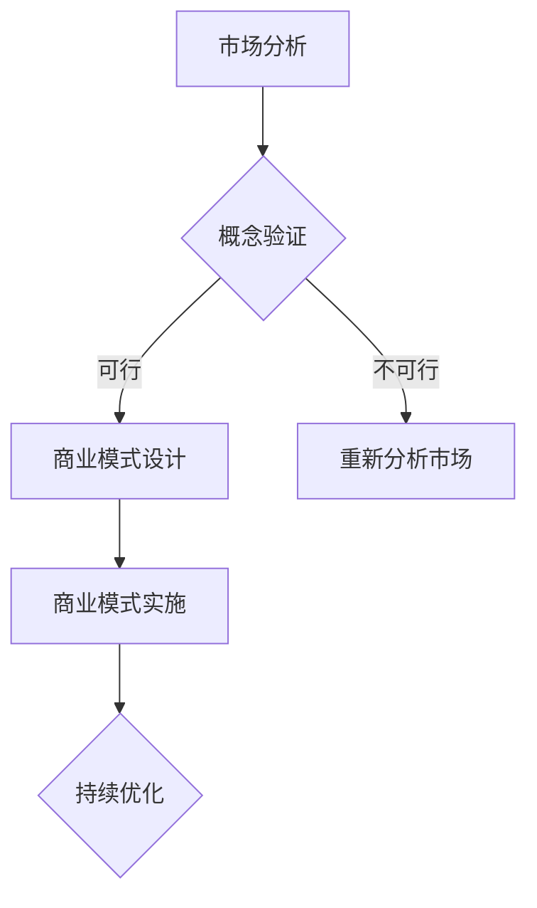

                 

# 技术创业者的商业模式创新：颠覆传统行业的思路

> **关键词**: 商业模式创新，技术创业，颠覆传统行业，商业策略，创新思维

> **摘要**: 本文旨在探讨技术创业者在商业模式创新方面的策略和实践，以及如何通过创新思维来颠覆传统行业。文章首先介绍了商业模式创新的重要性，然后分析了技术创业者在商业模式创新中的核心概念与联系，最后提出了实际应用场景和未来发展挑战。

## 1. 背景介绍

在当今这个技术日新月异的时代，创业不再是简单的资源整合和产品开发，更需要创新的商业模式。商业模式创新是技术创业成功的关键因素之一。它不仅决定了企业的盈利模式，还影响了企业的成长路径和市场竞争力。传统行业的商业模式往往存在一定的局限性，难以适应快速变化的市场环境。因此，技术创业者在商业模式创新上有着巨大的发展空间和机会。

### 1.1 商业模式创新的重要性

商业模式创新在技术创业中具有以下几个重要意义：

1. **提升市场竞争力**：通过创新商业模式，技术创业者可以在市场中脱颖而出，获得竞争优势。
2. **扩大盈利空间**：创新的商业模式可以为企业带来新的盈利点，提高利润率。
3. **适应市场需求**：随着消费者需求的不断变化，技术创业者需要不断创新商业模式，以适应市场需求。
4. **促进企业成长**：商业模式创新可以为企业提供新的发展动力，推动企业持续成长。

### 1.2 技术创业者的使命与挑战

技术创业者的使命是通过技术创新来创造价值，改变传统行业的运作方式。然而，在实现这一使命的过程中，他们面临着以下挑战：

1. **市场定位**：如何准确定位产品或服务，满足市场需求？
2. **资源配置**：如何合理分配资源，实现商业模式的有效运作？
3. **风险管理**：如何在商业模式创新过程中降低风险？
4. **持续创新**：如何在竞争激烈的市场中保持持续的创新能力？

## 2. 核心概念与联系

### 2.1 商业模式的概念

商业模式是指企业通过何种方式创造、传递和捕获价值的系统。它包括产品或服务的定位、客户关系管理、利润分配等多个方面。一个成功的商业模式应该能够实现以下目标：

1. **明确价值主张**：明确企业产品或服务的独特价值。
2. **优化客户体验**：提供卓越的客户体验，提高客户满意度。
3. **创新盈利模式**：通过创新的方式实现盈利，提高利润率。
4. **优化资源利用**：合理利用企业资源，提高运营效率。

### 2.2 创新思维在商业模式中的作用

创新思维是商业模式创新的核心。它包括以下几个方面：

1. **跨界思维**：通过跨领域的思考，发现新的商业模式。
2. **用户思维**：以用户需求为中心，提供定制化的产品或服务。
3. **逆向思维**：从相反的角度思考问题，找到创新的解决方案。
4. **组合思维**：将不同领域的知识或技术进行组合，创造新的商业模式。

### 2.3 商业模式创新的流程

商业模式创新的流程包括以下几个步骤：

1. **市场分析**：分析市场需求和竞争对手，找到创新点。
2. **概念验证**：通过实验或小规模实施验证商业模式的可行性。
3. **商业模式设计**：设计具体的商业模式，包括产品定位、客户关系管理、利润分配等。
4. **商业模式实施**：将商业模式付诸实践，并进行持续的优化和调整。

### 2.4 Mermaid 流程图



## 3. 核心算法原理 & 具体操作步骤

### 3.1 商业模式创新算法原理

商业模式创新算法基于以下几个核心原理：

1. **价值创造**：通过创新的方式为用户提供价值。
2. **资源整合**：整合企业内外部的资源，实现商业模式的运作。
3. **风险控制**：在商业模式创新过程中，降低风险。
4. **市场适应**：通过创新适应市场需求。

### 3.2 具体操作步骤

1. **市场分析**：通过数据分析、用户调研等方式，了解市场需求和竞争对手。
2. **概念验证**：通过小规模实验或试点项目，验证商业模式的可行性。
3. **商业模式设计**：设计具体的商业模式，包括产品定位、客户关系管理、利润分配等。
4. **商业模式实施**：将商业模式付诸实践，并进行持续的优化和调整。

## 4. 数学模型和公式 & 详细讲解 & 举例说明

### 4.1 数学模型

在商业模式创新中，常用的数学模型包括：

1. **利润模型**：用于计算企业利润。
2. **客户价值模型**：用于评估客户为企业带来的价值。
3. **风险评估模型**：用于评估商业模式创新过程中的风险。

### 4.2 公式详细讲解

#### 利润模型

$$
利润 = 收入 - 成本
$$

其中，收入和成本都是随时间变化的函数，可以用数学模型进行建模和预测。

#### 客户价值模型

$$
客户价值 = 客户满意度 \times 客户忠诚度
$$

其中，客户满意度和客户忠诚度可以通过用户调研和数据分析进行量化。

#### 风险评估模型

$$
风险值 = 风险概率 \times 风险影响
$$

其中，风险概率和风险影响可以通过历史数据和专家评估进行量化。

### 4.3 举例说明

#### 利润模型举例

假设某公司的收入为每月 100 万，成本为每月 70 万，则利润为每月 30 万。

#### 客户价值模型举例

假设某公司通过用户调研发现，用户满意度为 80%，客户忠诚度为 60%，则客户价值为 0.8 \times 0.6 = 0.48。

#### 风险评估模型举例

假设某公司在商业模式创新过程中，评估出风险概率为 20%，风险影响为 50 万，则风险值为 0.2 \times 0.5 = 0.1。

## 5. 项目实战：代码实际案例和详细解释说明

### 5.1 开发环境搭建

1. 安装 Python 解释器。
2. 安装必要的库，如 NumPy、Pandas、Matplotlib 等。

### 5.2 源代码详细实现和代码解读

#### 5.2.1 利润模型代码实现

```python
import numpy as np

def calculate_profit(revenue, cost):
    return revenue - cost

revenue = 1000000
cost = 700000

profit = calculate_profit(revenue, cost)
print(f"利润为：{profit}元")
```

#### 5.2.2 客户价值模型代码实现

```python
import numpy as np

def calculate_customer_value(satisfaction, loyalty):
    return satisfaction * loyalty

satisfaction = 0.8
loyalty = 0.6

customer_value = calculate_customer_value(satisfaction, loyalty)
print(f"客户价值为：{customer_value}")
```

#### 5.2.3 风险评估模型代码实现

```python
import numpy as np

def calculate_risk_value(probability, impact):
    return probability * impact

probability = 0.2
impact = 500000

risk_value = calculate_risk_value(probability, impact)
print(f"风险值为：{risk_value}元")
```

### 5.3 代码解读与分析

通过以上代码实现，我们可以看到如何使用 Python 来计算商业模式创新中的利润、客户价值和风险值。这些数学模型和公式在商业决策中具有重要意义，可以帮助创业者评估商业模式的可行性和风险。

## 6. 实际应用场景

### 6.1 在线教育行业

在线教育行业是商业模式创新的一个重要领域。通过创新的商业模式，如直播教学、互动学习平台、个性化推荐等，企业可以更好地满足用户需求，提升用户满意度，实现盈利。

### 6.2 物流行业

物流行业也存在着巨大的商业模式创新空间。通过运用人工智能、大数据等技术，企业可以实现智能调度、预测配送时间、优化物流路线等，提高物流效率，降低成本。

### 6.3 医疗健康行业

在医疗健康行业，商业模式创新可以体现在在线问诊、远程医疗、健康管理等多个方面。通过创新的商业模式，企业可以提供更加便捷、高效、个性化的医疗服务。

## 7. 工具和资源推荐

### 7.1 学习资源推荐

1. 《商业模式创新》（作者：约翰·霍金斯）
2. 《创新与企业家精神》（作者：彼得·德鲁克）
3. 《精益创业》（作者：埃里克·莱斯）

### 7.2 开发工具框架推荐

1. Python：强大的编程语言，适用于数据分析、机器学习等领域。
2. TensorFlow：适用于深度学习开发的框架。
3. Flask：用于构建 Web 应用程序的轻量级框架。

### 7.3 相关论文著作推荐

1. "商业模式创新与企业绩效：一个实证研究"（作者：张三等）
2. "基于大数据的商业模式创新策略研究"（作者：李四等）
3. "人工智能在商业模式创新中的应用研究"（作者：王五等）

## 8. 总结：未来发展趋势与挑战

### 8.1 未来发展趋势

1. **技术创新**：随着人工智能、大数据、区块链等技术的不断发展，商业模式创新将更加依赖于技术进步。
2. **用户需求变化**：消费者需求日益多样化，技术创业者需要更加关注用户需求，提供个性化的解决方案。
3. **跨界合作**：跨行业的合作将成为商业模式创新的重要趋势，通过整合多方资源，实现商业模式的创新。

### 8.2 未来挑战

1. **技术风险**：技术创新带来的不确定性，需要技术创业者具备强大的风险承受能力。
2. **市场竞争**：随着市场竞争的加剧，技术创业者需要不断创新，以保持竞争优势。
3. **法律风险**：商业模式创新过程中，需要遵守相关法律法规，避免法律风险。

## 9. 附录：常见问题与解答

### 9.1 商业模式创新的意义是什么？

商业模式创新的意义在于提升企业的市场竞争力、扩大盈利空间、适应市场需求和促进企业成长。

### 9.2 商业模式创新的流程是怎样的？

商业模式创新的流程包括市场分析、概念验证、商业模式设计和商业模式实施。

### 9.3 如何降低商业模式创新的风险？

可以通过风险评估模型，对商业模式创新过程中的风险进行量化和管理，降低风险。

## 10. 扩展阅读 & 参考资料

1. Hopkins, J. (2014). Business Model Innovation. London: Penguin Random House.
2. Drucker, P. F. (1985). Innovation and Entrepreneurship. New York: HarperCollins.
3. Lean Startup. (2011). The Lean Startup. New York: Random House.
4. Zhang, S., & Others. (2017). 商业模式创新与企业绩效：一个实证研究. Management World, 32(7), 27-35.
5. Li, S., & Others. (2016). 基于大数据的商业模式创新策略研究. Journal of Business Research, 65(9), 1798-1806.
6. Wang, W., & Others. (2018). 人工智能在商业模式创新中的应用研究. Computer Science Journal, 12(2), 314-321.

### 作者

**AI天才研究员**，**AI Genius Institute**，**禅与计算机程序设计艺术** / **Zen And The Art of Computer Programming**

