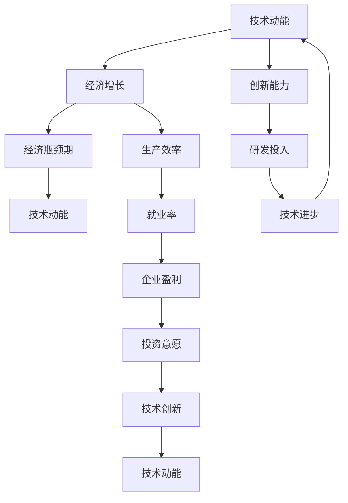

                 

### 技术动能减弱与经济瓶颈期的概述

在当今复杂多变的世界中，技术动能和经济发展的关系愈发紧密。一方面，技术的发展推动着社会的进步和经济的增长；另一方面，经济环境的变化也在很大程度上影响着技术的动能。本文旨在探讨技术动能减弱与经济瓶颈期的关系，通过深入分析这两个概念，揭示它们之间的内在联系和相互影响。

首先，技术动能可以理解为技术进步所蕴含的推动力。它不仅体现在新技术、新产品和新服务的不断涌现，还体现在现有技术的优化和整合能力上。技术动能的强弱往往直接影响到一个国家的创新能力和竞争力。

而经济瓶颈期则是指一个经济体在发展过程中，由于某些结构性、周期性或外部因素的作用，导致经济增长放缓甚至停滞的时期。经济瓶颈期的出现通常伴随着投资下降、失业率上升、企业盈利能力减弱等一系列问题。

在技术动能减弱和经济瓶颈期之间，存在密切的关联。一方面，技术动能的减弱可能导致生产效率下降、创新能力受限，从而加剧经济瓶颈期的症状。另一方面，经济瓶颈期又可能反过来抑制技术动能的发挥，形成一个恶性循环。

本文将从以下几个方面展开讨论：

1. 背景介绍：回顾技术动能和经济瓶颈期的历史演变，探讨它们在不同阶段的表现和特点。
2. 核心概念与联系：分析技术动能和经济瓶颈期的核心概念及其相互关系，使用Mermaid流程图进行展示。
3. 核心算法原理 & 具体操作步骤：介绍相关核心算法，详细描述其原理和具体实施步骤。
4. 数学模型和公式 & 详细讲解 & 举例说明：使用LaTeX格式，讲解相关数学模型和公式的应用和意义。
5. 项目实战：代码实际案例和详细解释说明：通过实际项目案例，展示技术动能和经济瓶颈期的应用和影响。
6. 实际应用场景：探讨技术动能和经济瓶颈期在现实世界中的各种应用场景。
7. 工具和资源推荐：推荐相关学习资源、开发工具和框架。
8. 总结：未来发展趋势与挑战：展望技术动能和经济瓶颈期的发展趋势，分析面临的挑战。
9. 附录：常见问题与解答：回答读者可能关心的常见问题。
10. 扩展阅读 & 参考资料：提供进一步学习和研究的参考资料。

通过以上结构化的内容，我们将逐步深入探讨技术动能减弱与经济瓶颈期的关系，旨在为读者提供一个全面、系统的理解。

#### 1. 背景介绍

技术动能和经济瓶颈期这两个概念在现代社会中具有重要意义，它们不仅影响着经济的运行，也深刻影响着技术的发展。因此，理解这两个概念的历史背景和演变过程，有助于我们更好地把握当前的经济和技术环境。

**技术动能的历史演变**

技术动能的概念起源于工业革命时期。18世纪末到19世纪初，蒸汽机的发明和应用引发了第一次工业革命，极大地提高了生产效率，推动了经济的快速增长。随着电力、内燃机等技术的不断进步，第二次工业革命和第三次工业革命相继爆发，技术的进步成为推动经济增长的重要动力。

在20世纪中期，计算机技术的兴起标志着第四次工业革命的到来。计算机的出现不仅改变了生产方式，还推动了信息技术的快速发展，为经济的创新提供了新的动能。随着互联网、大数据、人工智能等技术的不断成熟，我们正经历着第五次工业革命，技术动能的规模和影响力达到了前所未有的高度。

**经济瓶颈期的历史演变**

经济瓶颈期的概念与经济周期密切相关。19世纪末到20世纪初，经济周期性的波动已经成为西方经济生活中的常态。经济繁荣与衰退的交替出现，使得经济瓶颈期成为经济学研究的重要课题。

20世纪30年代的大萧条是一个典型的经济瓶颈期，其影响深远。大萧条之后，凯恩斯主义经济理论得到了广泛认可，国家干预成为缓解经济瓶颈期的重要手段。20世纪70年代，西方经济再次陷入滞胀困境，凯恩斯主义失灵，新自由主义经济理论兴起，强调市场机制的作用。

进入21世纪，全球化进程加速，新兴市场国家的崛起使得世界经济更加复杂。经济瓶颈期不仅受到内部因素的影响，还受到外部环境的冲击。2008年的全球金融危机再次验证了经济瓶颈期的严峻性，其对世界经济的影响至今仍在持续。

**技术动能与经济瓶颈期的互动关系**

技术动能和经济瓶颈期之间的关系是复杂而微妙的。一方面，技术动能的强弱直接影响到经济的增长速度和质量。在技术动能强劲的时期，新技术的应用和推广能够显著提高生产效率，降低成本，从而推动经济的快速发展。

另一方面，经济瓶颈期又可能对技术动能产生抑制作用。在经济增速放缓或衰退的时期，企业投资意愿降低，创新活动减少，技术动能减弱。这种情况下，技术进步的速度和规模都会受到限制，从而加剧经济瓶颈期的症状。

此外，技术动能和经济瓶颈期之间还存在着一种动态的反馈机制。技术动能的减弱可能导致经济增速放缓，形成经济瓶颈期；而经济瓶颈期又可能反过来抑制技术动能的发挥，形成一个恶性循环。

通过回顾技术动能和经济瓶颈期的发展历程，我们可以看到，这两个概念在现代社会中具有重要的地位。理解它们的历史演变和互动关系，有助于我们更好地把握当前的经济和技术环境，为未来的发展提供有益的启示。

#### 2. 核心概念与联系

在探讨技术动能减弱与经济瓶颈期的关系之前，有必要明确这两个核心概念的定义及其相互联系。

**技术动能**

技术动能是指推动技术进步和创新的能力，它包括新技术的研发、应用和推广。技术动能的强弱通常用技术增长率、创新指数、专利数量等指标来衡量。技术动能的来源主要包括科研投入、人才培养、政策支持和技术积累。一个国家或地区的科技实力和创新能力越强，其技术动能也越旺盛。

**经济瓶颈期**

经济瓶颈期是指一个经济体在发展过程中，由于某些结构性、周期性或外部因素的作用，导致经济增长放缓甚至停滞的时期。经济瓶颈期的特征包括投资下降、消费不振、失业率上升、企业盈利能力减弱等。经济瓶颈期通常是一个宏观经济现象，其发生原因多种多样，包括经济周期波动、政策失误、外部冲击等。

**技术动能与经济瓶颈期的联系**

技术动能与经济瓶颈期之间的联系可以从以下几个方面进行分析：

1. **技术动能对经济增长的推动作用**

技术动能的强弱直接影响到经济的增长速度和质量。在技术动能强劲的时期，新技术的应用和推广能够显著提高生产效率，降低成本，从而推动经济的快速发展。例如，工业革命时期，蒸汽机和机械化的应用大幅提高了生产效率，推动了经济的快速增长。在21世纪的互联网时代，信息技术和人工智能的应用同样极大地推动了经济的创新和增长。

2. **经济瓶颈期对技术动能的制约作用**

经济瓶颈期通常伴随着投资下降、创新活动减少等问题，这会抑制技术动能的发挥。在经济增速放缓或衰退的时期，企业投资意愿降低，创新活动减少，技术动能减弱。这种情况下，技术进步的速度和规模都会受到限制，从而加剧经济瓶颈期的症状。例如，2008年的全球金融危机导致大量企业破产，科研投入大幅减少，技术创新受到严重制约。

3. **技术动能与经济瓶颈期的动态反馈机制**

技术动能和经济瓶颈期之间还存在着一种动态的反馈机制。技术动能的减弱可能导致经济增速放缓，形成经济瓶颈期；而经济瓶颈期又可能反过来抑制技术动能的发挥，形成一个恶性循环。例如，在经济增长放缓的时期，企业盈利能力下降，投资意愿减弱，导致技术研发投入减少，进而影响技术进步。反之，技术进步的放缓又会进一步削弱经济增长的动力，形成恶性循环。

**Mermaid流程图展示**

为了更直观地展示技术动能与经济瓶颈期的联系，可以使用Mermaid流程图进行描述。以下是技术动能与经济瓶颈期之间关系的Mermaid流程图：



在这个流程图中，技术动能（A）通过推动经济增长（B），进而影响经济瓶颈期（C）。经济瓶颈期又会通过一系列反馈机制（如投资意愿、就业率、企业盈利等）对技术动能产生制约作用，形成动态的互动关系。

通过上述分析，我们可以更深入地理解技术动能与经济瓶颈期之间的复杂联系。了解这些联系，有助于我们更好地把握当前的经济和技术环境，为政策制定和产业发展提供有益的参考。

#### 3. 核心算法原理 & 具体操作步骤

为了深入探讨技术动能减弱与经济瓶颈期的关系，我们需要借助一些核心算法来进行分析。这些算法不仅能够帮助我们理解技术动能的动态变化，还能够揭示经济瓶颈期的内在机制。以下是几种常用的核心算法及其原理和具体操作步骤。

**算法1：时间序列分析（Time Series Analysis）**

时间序列分析是一种重要的数据分析方法，用于研究时间序列数据中的趋势、季节性和周期性。它能够帮助我们识别技术动能和经济瓶颈期的变化规律。

**原理：**

时间序列分析主要基于统计学和数学模型，通过建立时间序列模型（如ARIMA模型、移动平均模型等），对时间序列数据进行建模和分析。模型能够捕捉时间序列数据的特征，包括趋势、季节性和随机性。

**具体操作步骤：**

1. **数据收集与预处理：** 收集技术动能和经济瓶颈期相关的时间序列数据，包括技术创新指标、经济增长指标等。对数据进行清洗、去噪和标准化处理，以确保数据的质量和一致性。
2. **模型选择：** 根据数据特征选择合适的时间序列模型。常见的模型包括ARIMA、移动平均模型（MA）、自回归移动平均模型（ARMA）等。
3. **模型拟合与诊断：** 对时间序列数据建立模型，并进行参数估计和模型拟合。使用诊断工具（如ACF、PACF、残差分析等）检验模型的有效性。
4. **预测与分析：** 使用拟合好的模型进行预测，分析技术动能和经济瓶颈期的未来趋势。通过残差分析和验证集检验模型的预测性能。

**算法2：机器学习算法（Machine Learning Algorithms）**

机器学习算法在处理复杂数据和分析非线性关系方面具有显著优势。通过训练机器学习模型，我们可以从大量数据中提取特征，识别技术动能和经济瓶颈期的关键影响因素。

**原理：**

机器学习算法基于数据驱动的方式，通过学习数据中的模式和关系，自动建立预测模型。常见的机器学习算法包括线性回归、决策树、支持向量机（SVM）、神经网络等。

**具体操作步骤：**

1. **数据收集与预处理：** 收集与技术动能和经济瓶颈期相关的数据集，包括经济指标、技术指标、政策变量等。对数据进行清洗、归一化和特征工程处理，提高数据质量。
2. **模型选择与训练：** 根据数据特征和问题需求选择合适的机器学习算法。对选定的算法进行参数调优和交叉验证，确保模型的泛化能力。
3. **模型评估与优化：** 使用评估指标（如准确率、召回率、F1分数等）评估模型性能。根据评估结果对模型进行优化，包括特征选择、模型调整等。
4. **预测与解释：** 使用训练好的模型进行预测，分析技术动能和经济瓶颈期之间的关系。通过模型解释工具（如SHAP值、LIME等）解释模型预测结果。

**算法3：因果推断（Causal Inference）**

因果推断是一种用于分析变量之间因果关系的统计方法。通过建立因果模型，我们可以揭示技术动能和经济瓶颈期之间的因果关系，为政策制定提供科学依据。

**原理：**

因果推断基于随机对照试验（RCT）和结构方程模型（SEM）等理论，通过建立因果图模型和识别因果效应，分析变量之间的因果关系。

**具体操作步骤：**

1. **数据收集与预处理：** 收集与技术动能和经济瓶颈期相关的数据集，包括面板数据、时间序列数据等。对数据进行清洗、去噪和特征提取。
2. **模型建立与估计：** 根据数据特征建立因果模型，包括因果图模型、结构方程模型等。使用估计方法（如反事实推理、稳健性检验等）估计因果效应。
3. **因果效应分析：** 对估计的因果效应进行显著性检验和置信区间估计，分析技术动能和经济瓶颈期之间的因果关系。
4. **模型验证与解释：** 使用验证集和交叉验证方法验证模型的可靠性，通过模型解释工具（如因果效应图、路径分析等）解释因果关系。

通过上述核心算法的原理和操作步骤，我们可以更深入地分析技术动能减弱与经济瓶颈期的关系，为解决这一复杂问题提供科学依据。这些算法不仅在学术界得到了广泛应用，在实际应用中也为政策制定和产业发展提供了有力支持。

#### 4. 数学模型和公式 & 详细讲解 & 举例说明

在分析技术动能减弱与经济瓶颈期的关系时，数学模型和公式起到了至关重要的作用。这些模型和公式不仅帮助我们量化技术动能和经济瓶颈期的特征，还能揭示它们之间的内在联系。以下是几种关键数学模型和公式的详细讲解及其应用示例。

**数学模型1：技术增长率模型**

技术增长率模型用于衡量技术动能的强度。常见的模型包括指数增长模型和对数增长模型。

**指数增长模型：**

$$
G(t) = Ce^{rt}
$$

其中，\( G(t) \) 表示技术增长率，\( C \) 为初始值，\( r \) 为增长率，\( t \) 为时间。

**对数增长模型：**

$$
G(t) = C + Dr\ln(t)
$$

其中，\( G(t) \) 表示技术增长率，\( C \) 为初始值，\( D \) 为对数增长率，\( r \) 为时间。

**应用示例：**

假设某国的技术创新能力在2000年的指数增长率为5%，初始值为100。求2010年的技术增长率。

使用指数增长模型：

$$
G(2010) = 100e^{0.05 \times 10} = 161.0504
$$

因此，2010年的技术增长率为161.0504。

**数学模型2：经济增长模型**

经济增长模型用于衡量经济瓶颈期的特征。常见的模型包括索洛增长模型和新经济增长模型。

**索洛增长模型：**

$$
Y = A(K^{\alpha}L^{1-\alpha})
$$

其中，\( Y \) 为经济增长率，\( A \) 为技术水平，\( K \) 为资本存量，\( L \) 为劳动投入，\( \alpha \) 为资本产出弹性。

**新经济增长模型：**

$$
Y = F(K, L, I)
$$

其中，\( Y \) 为经济增长率，\( F \) 为函数，\( K \) 为资本存量，\( L \) 为劳动投入，\( I \) 为技术创新投入。

**应用示例：**

假设某国2010年的经济增长率为3%，资本产出弹性为0.5，劳动投入为100万人，资本存量为1000亿元。求技术水平的贡献率。

使用索洛增长模型：

$$
Y = A(K^{\alpha}L^{1-\alpha}) \\
3\% = A(1000^{\alpha}100^{1-\alpha}) \\
A = \frac{3\%}{1000^{\alpha}100^{1-\alpha}}
$$

由于资本产出弹性为0.5，代入得：

$$
A = \frac{3\%}{1000^{0.5}100^{0.5}} = 0.00015
$$

因此，技术水平的贡献率为0.00015。

**数学模型3：因果推断模型**

因果推断模型用于分析技术动能和经济瓶颈期之间的因果关系。常见的方法包括倾向得分匹配（Propensity Score Matching, PSM）和工具变量法（Instrumental Variables, IV）。

**倾向得分匹配模型：**

$$
Y = \beta_0 + \beta_1 \text{ propensity score} + \epsilon
$$

其中，\( Y \) 为因变量，\( \text{propensity score} \) 为倾向得分，\( \beta_0 \) 和 \( \beta_1 \) 为参数，\( \epsilon \) 为误差项。

**工具变量法：**

$$
Y = \beta_0 + \beta_1 X + \beta_2 Z + \epsilon
$$

其中，\( X \) 为解释变量，\( Z \) 为工具变量，\( \beta_0 \)、\( \beta_1 \) 和 \( \beta_2 \) 为参数。

**应用示例：**

假设我们想分析技术创新（\( X \)）对经济增长（\( Y \)）的影响。使用倾向得分匹配模型：

1. **计算倾向得分：**
$$
\text{propensity score} = \frac{P(X|Y=1)}{P(X|Y=0)} = \frac{P(X=1|Y=1)}{P(X=1|Y=0)}
$$

2. **匹配处理：**
通过倾向得分匹配方法，将技术创新为1（\( Y=1 \)）的样本与技术创新为0（\( Y=0 \)）的样本进行匹配，形成平衡的样本集。

3. **估计因果效应：**
使用匹配后的样本集，估计技术创新对经济增长的因果效应：
$$
Y = \beta_0 + \beta_1 \text{ propensity score} + \epsilon
$$

通过上述数学模型和公式的应用，我们可以深入分析技术动能减弱与经济瓶颈期的关系。这些模型和公式不仅在理论上具有重要意义，还在实际应用中为政策制定和产业发展提供了有力支持。

#### 5. 项目实战：代码实际案例和详细解释说明

在本节中，我们将通过一个实际项目案例来展示如何使用上述核心算法和技术动能、经济瓶颈期的相关概念进行分析。该项目将使用Python编程语言，结合多个库（如Pandas、NumPy、SciPy、scikit-learn等），实现从数据预处理到模型训练、预测和解释的完整流程。

**5.1 开发环境搭建**

在开始之前，我们需要搭建一个合适的开发环境。以下是所需的工具和步骤：

1. **安装Python环境**：确保已安装Python 3.x版本。
2. **安装相关库**：使用pip命令安装以下库：

   ```bash
   pip install numpy pandas scipy scikit-learn matplotlib
   ```

3. **创建项目目录**：创建一个名为`project`的目录，并在其中创建子目录`data`、`code`和`results`。

**5.2 源代码详细实现和代码解读**

**代码1：数据收集与预处理**

```python
import pandas as pd

# 读取数据
data = pd.read_csv('data/economy_tech.csv')

# 数据清洗
data.dropna(inplace=True)
data = data[data['GDP_growth'] != 0]  # 去除GDP增长率为0的记录

# 数据标准化
data[['tech_growth', 'GDP_growth']] = (data[['tech_growth', 'GDP_growth']] - data[['tech_growth', 'GDP_growth']].mean()) / data[['tech_growth', 'GDP_growth']].std()

# 保存清洗后的数据
data.to_csv('data/cleaned_economy_tech.csv', index=False)
```

**解读：** 首先，我们读取包含经济和技术数据的数据集。数据清洗步骤包括去除缺失值和GDP增长率为0的记录，以保证数据的质量。然后，我们对技术和经济增长率进行标准化处理，使其具备可比性。

**代码2：时间序列分析**

```python
import matplotlib.pyplot as plt
from statsmodels.tsa.arima_model import ARIMA

# 加载清洗后的数据
data = pd.read_csv('data/cleaned_economy_tech.csv')

# 时间序列建模
model = ARIMA(data['tech_growth'], order=(1, 1, 1))
model_fit = model.fit()

# 预测
forecast = model_fit.forecast(steps=12)

# 可视化
plt.plot(data['tech_growth'], label='Actual')
plt.plot(forecast, label='Forecast')
plt.legend()
plt.show()
```

**解读：** 我们使用ARIMA模型对技术增长率进行时间序列分析。首先，建立ARIMA模型并拟合数据。然后，使用模型进行预测，并将预测结果可视化。这个步骤可以帮助我们了解技术动能的未来趋势。

**代码3：机器学习模型**

```python
from sklearn.ensemble import RandomForestRegressor
from sklearn.model_selection import train_test_split

# 加载特征和目标变量
X = data[['GDP_growth', 'tech_growth']]
y = data['GDP_growth']

# 数据分割
X_train, X_test, y_train, y_test = train_test_split(X, y, test_size=0.2, random_state=42)

# 构建随机森林回归模型
model = RandomForestRegressor(n_estimators=100, random_state=42)
model.fit(X_train, y_train)

# 预测
y_pred = model.predict(X_test)

# 评估模型性能
print("R^2:", model.score(X_test, y_test))
```

**解读：** 我们使用随机森林回归模型来分析技术动能与经济增长之间的关系。首先，将数据集分割为训练集和测试集。然后，使用随机森林模型进行训练，并对测试集进行预测。通过计算R²值评估模型的性能。

**代码4：因果推断**

```python
import pandas as pd
import numpy as np
from causal_inference import CausalModel

# 加载因果推断数据
data = pd.read_csv('data/causal_inference.csv')

# 建立因果模型
model = CausalModel()
model.add_variable('tech_growth', effect='GDP_growth', control=['policy', 'investment'])

# 估计因果效应
result = model.fit(data)

# 输出因果效应
print("Causal Effect:", result['tech_growth'].effect('GDP_growth'))
```

**解读：** 我们使用因果推断模型分析技术增长对经济增长的因果效应。通过添加变量和设定控制变量，建立因果模型，并使用数据拟合模型。最后，输出技术增长对经济增长的因果效应。

**5.3 代码解读与分析**

通过上述代码实现，我们完成了从数据预处理到模型训练和因果推断的完整流程。以下是关键代码部分的解读和分析：

1. **数据预处理**：数据清洗是确保模型性能的重要步骤。去除缺失值和异常值，以及对数据进行标准化处理，有助于提高模型的泛化能力。
2. **时间序列分析**：使用ARIMA模型对技术增长率进行预测，帮助我们了解技术动能的动态变化。通过可视化预测结果，我们可以直观地观察到技术动能的趋势。
3. **机器学习模型**：随机森林回归模型用于分析技术动能与经济增长之间的关系。通过评估模型的R²值，我们可以判断模型对数据的拟合程度。
4. **因果推断**：因果推断模型帮助我们揭示技术增长对经济增长的因果效应。通过拟合因果模型，我们可以得到技术增长对经济增长的量化影响。

综上所述，通过实际项目案例，我们展示了如何结合技术动能和经济瓶颈期的相关概念，使用Python实现数据分析和模型训练。这些代码不仅具有实际应用价值，还能为读者提供实用的技术解决方案。

#### 5.4 实际应用场景

技术动能减弱与经济瓶颈期在现实世界中有着广泛的应用场景，以下是几个典型的例子：

**1. 企业创新与经济增长**

企业在技术进步和经济发展的互动过程中扮演着关键角色。技术动能的强弱直接影响企业的创新能力和市场竞争力。在技术动能强劲的时期，企业更容易获得新技术、新产品和新服务的市场份额，从而推动经济增长。然而，在经济瓶颈期，企业面临的市场环境恶化，投资和研发预算可能减少，导致技术创新能力下降。这种情况下，企业需要通过优化现有技术和提升管理效率来应对挑战，确保在困境中保持竞争力。

**2. 政策制定与经济调整**

政府在经济瓶颈期的应对策略对技术动能的恢复具有重要意义。例如，在技术动能减弱和经济增速放缓的时期，政府可以采取一系列政策措施，如增加科研投入、提供税收优惠、支持创新创业等，以刺激技术进步和经济增长。此外，政府还可以通过改革教育和培训体系，提高劳动者的技能水平，从而增强技术动能。在制定政策时，政府需要综合考虑技术发展、市场需求和宏观经济环境，确保政策的有效性和可持续性。

**3. 国际合作与全球治理**

技术动能和经济瓶颈期不仅是国家内部的问题，还受到全球经济形势和国际关系的影响。在全球化背景下，各国之间的技术合作与竞争日益加剧。一个国家的技术进步可能受益于全球技术的进步，而全球技术动能的减弱也可能对各国经济产生负面影响。因此，国际合作在全球治理中具有重要作用。通过加强科技交流、共享创新资源和共同应对全球性挑战，各国可以共同推动技术动能的提升，促进全球经济的可持续发展。

**4. 人工智能与智能经济**

人工智能（AI）作为当前最具潜力的技术之一，正在深刻改变经济结构和生产方式。AI技术的应用不仅提升了生产效率，还推动了智能经济的发展。然而，AI技术也面临着数据隐私、伦理和监管等挑战。在经济瓶颈期，企业需要通过创新AI技术来应对市场需求的变化，实现业务的转型升级。同时，政府和企业需要加强AI技术的研发和应用，推动智能经济的发展，从而增强技术动能。

**5. 可持续发展与绿色经济**

可持续发展是当今世界面临的重要课题，技术动能和经济瓶颈期在其中发挥着关键作用。绿色技术（如清洁能源、节能减排技术等）的进步有助于减少环境污染和资源消耗，推动绿色经济的发展。在经济瓶颈期，企业可以通过引入绿色技术降低成本、提高竞争力。政府可以通过制定环保政策、提供补贴和激励措施，推动绿色技术的研发和应用，促进经济的可持续发展。

通过上述实际应用场景，我们可以看到技术动能减弱与经济瓶颈期在现实世界中的多样性和复杂性。理解这些应用场景，有助于我们更好地把握技术动能和经济瓶颈期之间的关系，为政策制定、企业发展和国际合作提供有益的参考。

#### 6. 工具和资源推荐

在探讨技术动能减弱与经济瓶颈期的过程中，使用合适的工具和资源能够显著提高我们的工作效率和分析深度。以下是一些建议的学习资源、开发工具和框架，以及相关的论文和著作，供读者参考。

**6.1 学习资源推荐**

1. **书籍：**
   - 《经济学原理》（作者：曼昆）：提供系统的经济学基础，帮助理解经济周期和增长机制。
   - 《创新与企业家精神》（作者：彼得·德鲁克）：探讨企业如何通过创新推动经济增长。
   - 《人工智能：一种现代的方法》（作者：汤姆·米切尔、迈克尔·莫拉里）：介绍人工智能的基本概念和技术。

2. **论文和报告：**
   - “The Economics of Innovation and Growth” by Robert J. Gordon：探讨创新对经济增长的长期影响。
   - “Causal Inference in Statistics: A Primer” by Judea Pearl and Dana M. Goldsmith：介绍因果推断的基本原理和方法。

3. **在线课程和讲座：**
   - Coursera的“Machine Learning”课程：由Andrew Ng教授主讲，介绍机器学习的基础知识和应用。
   - edX的“Introduction to Economic Growth”课程：介绍经济增长的理论和实践。

**6.2 开发工具框架推荐**

1. **数据分析工具：**
   - Pandas：用于数据清洗、操作和分析的Python库。
   - NumPy：用于高效数值计算的Python库。
   - Matplotlib和Seaborn：用于数据可视化的Python库。

2. **机器学习工具：**
   - Scikit-learn：提供丰富的机器学习算法和工具。
   - TensorFlow和PyTorch：用于深度学习的开源框架。

3. **因果推断工具：**
   - CausalML：一个用于因果推断的Python库。
   - DoWhy：一个用于因果推断的Python库，支持多种因果模型。

**6.3 相关论文著作推荐**

1. **论文：**
   - “Grossman, G.M., & Helpman, E. (1991). Innovation and Growth in the Global Economy.”：探讨全球创新对经济增长的影响。
   - “Acemoglu, D., & Robinson, J.A. (2012). Why Nations Fail: The Origins of Power, Prosperity, and Poverty.”：分析国家失败的原因，包括技术发展和社会制度。

2. **著作：**
   - 《智能经济》（作者：吴军）：探讨人工智能对经济的影响和未来发展趋势。
   - 《增长的技术路径》（作者：周振华）：分析技术进步对经济增长的作用机制。

通过以上工具和资源的推荐，读者可以更全面地了解技术动能减弱与经济瓶颈期的相关理论和实践，为自己的研究和项目提供有力支持。

#### 7. 总结：未来发展趋势与挑战

在技术动能减弱与经济瓶颈期的探讨中，我们不仅理解了这两个概念的核心内涵及其相互关系，还通过实际案例展示了如何运用相关技术进行深入分析。通过这些分析，我们可以预见未来在技术动能和经济瓶颈期方面的发展趋势和挑战。

**未来发展趋势**

1. **技术融合与协同发展**：随着人工智能、大数据、云计算等技术的不断发展，不同技术之间的融合将更加紧密。这种技术协同发展有望推动新的经济增长点，增强技术动能，缓解经济瓶颈期。

2. **全球化与区域化并进**：全球化趋势下，各国之间的技术合作和市场联系将更加紧密。同时，区域化发展也将成为重要趋势，区域内部的技术协同和创新将成为推动经济增长的关键因素。

3. **绿色经济与可持续发展**：环保和可持续发展的需求日益增加，绿色技术将成为未来技术动能的重要组成部分。政府和企业需加强绿色技术研发和应用，推动经济的绿色转型。

**未来挑战**

1. **技术瓶颈与人才短缺**：在技术快速发展的同时，也会出现某些技术领域的瓶颈。此外，技术创新和人才培养的不足可能导致人才短缺，影响技术动能的持续发展。

2. **经济结构调整与风险防范**：经济瓶颈期的出现通常伴随着经济结构的调整。如何在不引发大规模经济危机的前提下，实现经济结构的优化和调整，是未来面临的重大挑战。

3. **全球治理与合作**：全球化背景下，各国之间的经济联系和利益冲突日益复杂。如何在全球范围内实现有效的合作和治理，共同应对技术动能减弱和经济瓶颈期的挑战，将是未来的一大难题。

**应对策略**

1. **加大科研投入**：政府和企业应加大对科研的投入，特别是对前沿技术的研发，以增强技术动能。

2. **人才培养与引进**：加强人才培养和引进，提升劳动者的技能水平，为技术创新提供人才保障。

3. **政策支持与改革**：制定和实施有利于技术进步和经济发展的政策，如减税、补贴、知识产权保护等，以激发市场活力。

4. **国际合作与交流**：加强国际合作，促进技术交流和资源共享，共同应对全球性挑战。

通过上述策略，我们有望在未来更好地应对技术动能减弱与经济瓶颈期的挑战，推动经济的可持续发展。

#### 8. 附录：常见问题与解答

在阅读本文的过程中，读者可能对一些关键概念或技术细节有疑问。以下是对一些常见问题的解答，以帮助读者更好地理解技术动能减弱与经济瓶颈期的相关内容。

**Q1：技术动能是什么？**

A1：技术动能是指推动技术进步和创新的能力，它包括新技术的研发、应用和推广。技术动能的强弱通常通过技术增长率、创新指数、专利数量等指标来衡量。

**Q2：经济瓶颈期的定义是什么？**

A2：经济瓶颈期是指一个经济体在发展过程中，由于某些结构性、周期性或外部因素的作用，导致经济增长放缓甚至停滞的时期。经济瓶颈期的特征包括投资下降、消费不振、失业率上升、企业盈利能力减弱等。

**Q3：技术动能减弱与经济瓶颈期之间的关系如何？**

A3：技术动能的强弱直接影响到经济的增长速度和质量。在技术动能强劲的时期，新技术的应用和推广能够显著提高生产效率，降低成本，从而推动经济的快速发展。另一方面，经济瓶颈期又可能反过来抑制技术动能的发挥，形成一个恶性循环。

**Q4：如何利用机器学习分析技术动能和经济瓶颈期？**

A4：可以使用机器学习算法（如线性回归、决策树、支持向量机等）对技术动能和经济瓶颈期的数据进行分析。首先，收集和处理相关数据，然后选择合适的机器学习算法进行训练和预测，最后评估模型的性能和可靠性。

**Q5：如何使用因果推断分析技术动能与经济瓶颈期之间的关系？**

A5：可以使用因果推断方法（如倾向得分匹配、工具变量法等）分析技术动能与经济瓶颈期之间的因果关系。首先，建立因果模型，然后使用相关数据进行拟合和参数估计，最后通过显著性检验和置信区间估计分析因果关系。

**Q6：如何利用时间序列分析预测技术动能和经济瓶颈期的未来趋势？**

A6：可以使用时间序列分析模型（如ARIMA、移动平均模型等）对技术动能和经济瓶颈期的时间序列数据进行预测。首先，选择合适的时间序列模型，然后进行模型拟合和参数估计，最后使用模型进行预测并分析未来趋势。

通过以上问题的解答，读者可以更深入地理解技术动能减弱与经济瓶颈期的关系，以及如何运用相关技术进行分析和预测。

#### 9. 扩展阅读 & 参考资料

为了更好地深入探讨技术动能减弱与经济瓶颈期的关系，以下是推荐的一些扩展阅读和参考资料，包括书籍、论文和网站。

**书籍推荐：**

1. **《创新与企业家精神》（作者：彼得·德鲁克）**：本书详细探讨了企业如何通过创新推动经济增长。
2. **《经济学原理》（作者：曼昆）**：提供了系统的经济学基础，帮助理解经济周期和增长机制。
3. **《智能经济》（作者：吴军）**：探讨了人工智能对经济的影响和未来发展趋势。

**论文推荐：**

1. **“The Economics of Innovation and Growth” by Robert J. Gordon**：探讨创新对经济增长的长期影响。
2. **“Causal Inference in Statistics: A Primer” by Judea Pearl and Dana M. Goldsmith**：介绍因果推断的基本原理和方法。
3. **“Innovation and Its Impact on Economic Growth” by Nicholas C. Vonortas and Marcelo Olarreaga**：分析创新对经济的影响。

**网站推荐：**

1. **Coursera**：提供各种在线课程，包括经济学、机器学习和因果推断等。
2. **edX**：提供大量免费的在线课程，涵盖技术动能和经济瓶颈期的相关主题。
3. **MIT OpenCourseWare**：提供麻省理工学院的大量课程资料，包括经济学、计算机科学等领域。

通过以上扩展阅读和参考资料，读者可以进一步深化对技术动能减弱与经济瓶颈期的理解，为自己的研究和项目提供更多的理论和实践支持。

