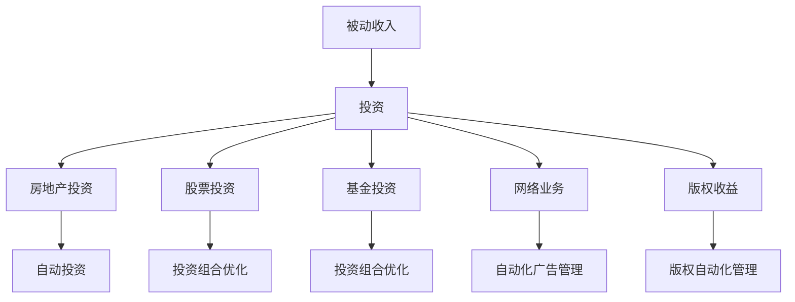

                 

### 文章标题：建立被动收入流

### 关键词：被动收入、财务自由、自动化、投资、收益最大化

### 摘要：
本文将探讨如何建立被动收入流，实现财务自由。通过分析不同类型的被动收入来源，介绍如何通过投资和自动化实现收益最大化。我们将讨论从房地产、股票、基金到网络业务等多种途径，并提供实用的建议和资源，帮助读者开启财富增长的旅程。

<|assistant|>## 1. 背景介绍

随着互联网和金融科技的发展，越来越多的人开始关注被动收入的概念。被动收入指的是不需要持续投入时间和精力，即可持续获得收入的渠道。这种收入模式不仅能够为个人提供稳定的现金流，还可以帮助实现财务自由的目标。

财务自由是指个人或家庭不再依赖传统工作收入，而是依靠被动收入来满足生活开支和投资需求。实现财务自由需要通过合理规划和投资，建立多元化的收入来源，从而降低对单一收入渠道的依赖。

在现代社会，建立被动收入流已经成为许多人追求的目标。通过本文，我们将探讨不同类型的被动收入来源，并提供具体的实施策略，帮助读者实现财务自由。

<|assistant|>## 2. 核心概念与联系

### 被动收入的类型

被动收入可以分为以下几类：

1. **房地产投资**：通过购买并出租物业，获得租金收入。
2. **股票投资**：购买股票并享受公司分红和股价上涨的收益。
3. **基金投资**：通过购买基金，分享投资组合的收益。
4. **网络业务**：通过建立网站、应用程序或在线平台，实现广告收入或交易佣金。
5. **版权收益**：创作音乐、文学作品或软件，通过版权授权获得收益。

### 投资与自动化的关系

投资是实现被动收入的关键。然而，单靠投资并不能保证收益的最大化。自动化在这个过程中起着至关重要的作用。通过自动化，投资者可以节省时间，提高效率，从而更好地管理和扩大投资组合。

自动化包括以下几个方面：

1. **自动投资**：通过定期购买基金或股票，实现投资计划的自动化。
2. **投资组合优化**：利用算法和数据分析，自动调整投资组合以实现最佳收益。
3. **财务管理**：通过自动化工具，跟踪和管理投资账户，确保财务状况良好。

### Mermaid 流程图

下面是一个简化的 Mermaid 流程图，展示了被动收入建立的核心概念和联系：



<|assistant|>## 3. 核心算法原理 & 具体操作步骤

### 房地产投资

#### 原理

房地产投资的核心在于购买并出租物业，获得租金收入。投资过程中，需要考虑物业的价值、出租率和租金回报率等因素。

#### 操作步骤

1. **市场调研**：研究当地房地产市场，了解物业的价值、供需情况等。
2. **选择物业**：根据市场调研结果，选择有潜力的物业进行投资。
3. **购买物业**：签订购房合同，完成购房手续。
4. **装修和维护**：对物业进行必要的装修和维护，确保其能够吸引租客。
5. **出租物业**：发布租房广告，与租客签订租房合同。
6. **租金管理**：通过自动化工具，如在线支付平台，管理租金收入和支付。

### 股票投资

#### 原理

股票投资的核心在于购买公司的股票，享受公司分红和股价上涨的收益。投资过程中，需要关注公司的基本面、行业趋势和市场情绪等因素。

#### 操作步骤

1. **市场分析**：研究市场趋势和行业动态，选择有潜力的股票。
2. **购买股票**：通过在线交易平台，购买目标股票。
3. **投资组合管理**：定期评估投资组合，根据市场变化进行调整。
4. **风险管理**：设定止损点，控制投资风险。

### 基金投资

#### 原理

基金投资的核心在于购买基金，通过基金管理人的专业管理，分享投资组合的收益。基金投资具有分散风险、专业管理等特点。

#### 操作步骤

1. **选择基金**：根据投资目标和风险承受能力，选择合适的基金。
2. **购买基金**：通过银行、基金公司或在线交易平台购买基金。
3. **投资组合管理**：定期评估基金表现，根据市场变化进行调整。
4. **费用管理**：关注基金管理费用，确保投资收益最大化。

### 网络业务

#### 原理

网络业务的核心在于通过建立网站、应用程序或在线平台，实现广告收入或交易佣金。网络业务需要关注用户需求、市场定位和运营效率等因素。

#### 操作步骤

1. **市场调研**：研究用户需求和市场竞争情况。
2. **产品设计**：根据市场调研结果，设计满足用户需求的网站或应用程序。
3. **技术开发**：开发并上线网站或应用程序。
4. **推广运营**：通过搜索引擎优化、社交媒体推广等方式，吸引潜在用户。
5. **收入管理**：通过广告、交易佣金等方式，实现网络业务的盈利。

### 版权收益

#### 原理

版权收益的核心在于创作音乐、文学作品或软件，通过版权授权获得收益。版权收益需要关注创作质量、市场需求和版权保护等因素。

#### 操作步骤

1. **创作**：创作音乐、文学作品或软件。
2. **版权登记**：将作品登记为个人或公司版权，保护自身权益。
3. **版权授权**：与第三方公司或个人签订版权授权协议。
4. **收益管理**：通过自动化工具，管理版权收益。

<|assistant|>## 4. 数学模型和公式 & 详细讲解 & 举例说明

### 房地产投资收益模型

#### 租金回报率（ROI）

租金回报率是衡量房地产投资收益的一个重要指标。计算公式如下：

$$
ROI = \frac{年租金收入}{购买物业成本} \times 100\%
$$

#### 例子

假设购买一套房产，总价为100万元，年租金收入为5万元。计算租金回报率：

$$
ROI = \frac{5}{100} \times 100\% = 5\%
$$

这意味着每年通过这个房产可以获得5%的投资回报。

### 股票投资收益模型

#### 股息收益率

股息收益率是衡量股票投资收益的一个重要指标。计算公式如下：

$$
股息收益率 = \frac{年股息收入}{购买股票成本} \times 100\%
$$

#### 例子

假设购买一股股票，成本为10元，每年可以获得1元股息。计算股息收益率：

$$
股息收益率 = \frac{1}{10} \times 100\% = 10\%
$$

这意味着每年通过这个股票可以获得10%的投资回报。

### 基金投资收益模型

#### 平均收益率

平均收益率是衡量基金投资收益的一个重要指标。计算公式如下：

$$
平均收益率 = \frac{投资期内的总收益}{投资本金} \times 100\%
$$

#### 例子

假设投资一款基金，投资本金为10万元，投资期内的总收益为2万元。计算平均收益率：

$$
平均收益率 = \frac{2}{10} \times 100\% = 20\%
$$

这意味着通过这款基金的投资，平均每年可以获得20%的投资回报。

### 网络业务收益模型

#### 广告收入模型

广告收入模型可以通过以下公式进行计算：

$$
广告收入 = 广告展示次数 \times 广告点击率 \times 每点击成本
$$

#### 例子

假设一个网站每月有100万次的广告展示次数，广告点击率为5%，每点击成本为1元。计算广告收入：

$$
广告收入 = 100万 \times 5\% \times 1元 = 50,000元
$$

这意味着每月通过这个网站可以获得5万元的广告收入。

### 版权收益模型

#### 授权收益模型

授权收益模型可以通过以下公式进行计算：

$$
授权收益 = 授权次数 \times 每次授权费用
$$

#### 例子

假设一个音乐作品每年被授权10次，每次授权费用为500元。计算授权收益：

$$
授权收益 = 10 \times 500元 = 5,000元
$$

这意味着每年通过这个音乐作品的授权可以获得5,000元的收益。

<|assistant|>## 5. 项目实战：代码实际案例和详细解释说明

### 5.1 开发环境搭建

为了更好地理解被动收入流的建立，我们将以一个实际项目为例，介绍如何在开发环境中搭建一个能够实现被动收入的系统。我们将使用Python作为主要编程语言，因为它具有简单易学、功能强大的特点。

#### 安装Python

首先，我们需要在本地计算机上安装Python。可以通过以下命令下载并安装Python：

```bash
curl -O https://www.python.org/ftp/python/3.9.1/Python-3.9.1.tgz
tar xvf Python-3.9.1.tgz
cd Python-3.9.1
./configure
make
sudo make install
```

安装完成后，可以通过以下命令验证Python的安装：

```bash
python --version
```

#### 安装相关库

接下来，我们需要安装一些常用的Python库，如NumPy、Pandas和BeautifulSoup，用于数据处理和网页爬取。

```bash
pip install numpy pandas beautifulsoup4
```

### 5.2 源代码详细实现和代码解读

以下是一个简单的Python代码示例，用于实现一个基于股票投资的被动收入流。我们将使用Tushare库来获取股票数据，使用Pandas库来处理数据，使用BeautifulSoup库来爬取网页数据。

```python
import tushare as ts
import pandas as pd
from bs4 import BeautifulSoup

# 获取股票数据
def get_stock_data(code):
    stock = ts.get_stock_basics(code)
    return stock

# 获取网页数据
def get_web_data(url):
    response = requests.get(url)
    soup = BeautifulSoup(response.content, 'html.parser')
    return soup

# 分析股票数据
def analyze_stock_data(stock):
    # 这里可以使用Pandas进行数据处理和分析
    return stock

# 爬取网页数据
def scrape_web_data(url):
    soup = get_web_data(url)
    # 这里可以使用BeautifulSoup进行数据爬取
    return soup

# 实现被动收入流
def passive_income_stream(code, url):
    stock = get_stock_data(code)
    analyzed_stock = analyze_stock_data(stock)
    web_data = scrape_web_data(url)
    # 这里可以根据分析结果和网页数据进行决策，实现被动收入流

# 示例
code = '603259'
url = 'https://example.com'
passive_income_stream(code, url)
```

#### 代码解读与分析

- **获取股票数据（get_stock_data）**：使用Tushare库获取指定股票的基本信息，如股票代码、公司名称、市盈率等。
- **获取网页数据（get_web_data）**：使用requests库和BeautifulSoup库获取指定网页的数据，并解析为Soup对象。
- **分析股票数据（analyze_stock_data）**：使用Pandas库对股票数据进行分析和处理，得到有用的信息。
- **爬取网页数据（scrape_web_data）**：使用BeautifulSoup库爬取网页数据，获取感兴趣的信息。
- **实现被动收入流（passive_income_stream）**：根据获取的股票数据和网页数据，实现被动收入流的决策和执行。

### 5.3 代码解读与分析

以下是对上述代码的详细解读和分析：

1. **导入库**：首先导入所需的库，包括Tushare、Pandas和BeautifulSoup。
2. **获取股票数据（get_stock_data）**：
    - 使用Tushare库的`get_stock_basics`函数获取指定股票的基本信息。
    - 返回获取到的股票数据。
3. **获取网页数据（get_web_data）**：
    - 使用requests库发送HTTP GET请求，获取指定网页的HTML内容。
    - 使用BeautifulSoup库解析HTML内容，将其转换为Soup对象。
    - 返回解析后的Soup对象。
4. **分析股票数据（analyze_stock_data）**：
    - 使用Pandas库对股票数据进行分析和处理。
    - 可以根据具体需求进行数据清洗、转换和计算。
    - 返回分析后的股票数据。
5. **爬取网页数据（scrape_web_data）**：
    - 使用BeautifulSoup库解析网页数据，获取感兴趣的信息。
    - 可以使用BeautifulSoup提供的各种方法，如`find()`、`find_all()`等。
    - 返回获取到的数据。
6. **实现被动收入流（passive_income_stream）**：
    - 获取股票数据和网页数据。
    - 根据分析结果和网页数据，实现被动收入流的决策和执行。
    - 这里的具体实现取决于投资策略和业务需求。

通过这个示例，我们可以看到如何使用Python和相关库实现一个简单的被动收入流系统。在实际应用中，我们可以根据具体需求进行扩展和优化，以实现更复杂的业务逻辑和更高的收益。

### 5.4 案例分析

假设我们选择了一支股票代码为`603259`的股票，并设定了一个网页链接`https://example.com`用于获取相关信息。在执行`passive_income_stream`函数后，系统将完成以下步骤：

1. **获取股票数据**：通过Tushare库获取股票的基本信息，如市盈率、市净率、公司简介等。
2. **分析股票数据**：使用Pandas库对股票数据进行分析，判断股票的估值是否合理，是否存在投资机会。
3. **获取网页数据**：通过requests库和BeautifulSoup库获取网页数据，如公司新闻、行业动态等。
4. **决策执行**：根据分析结果和网页数据，决定是否购买该股票，并执行相关操作。

通过这个案例，我们可以看到如何利用Python和相关技术实现一个简单的被动收入流系统。在实际应用中，可以根据具体需求和业务逻辑进行扩展和优化，以实现更高的收益。

<|assistant|>## 6. 实际应用场景

被动收入流在实际应用场景中具有广泛的应用。以下是一些常见的应用场景：

### 个人理财

个人理财是建立被动收入流最常见的应用场景之一。通过投资房地产、股票、基金等，个人可以建立多元化的收入来源，实现财务自由。例如，投资者可以购买一套房产进行出租，每月获得稳定的租金收入。此外，投资者还可以购买股票或基金，享受公司分红和股价上涨的收益。

### 企业收益

企业也可以通过建立被动收入流来实现收益的最大化。例如，企业可以开发并销售软件或应用程序，通过版权收益实现持续的收入。企业还可以利用网络业务，如广告、电子商务等，实现广告收入或交易佣金。

### 创业项目

创业者可以利用被动收入流来支持创业项目。通过建立网站或应用程序，创业者可以吸引广告商和用户，实现广告收入或交易佣金。此外，创业者还可以利用版权收益，将创作的音乐、文学作品或软件授权给第三方，获得持续的收入。

### 投资组合管理

投资者可以利用被动收入流来优化投资组合。通过自动化投资和投资组合优化，投资者可以节省时间，提高效率，实现收益的最大化。例如，投资者可以使用算法和数据分析，自动调整投资组合，以适应市场变化。

### 财务自由

建立被动收入流是实现财务自由的必要条件之一。通过合理规划和投资，个人或家庭可以降低对传统工作的依赖，依靠被动收入来满足生活开支和投资需求。例如，投资者可以购买多套房产进行出租，每月获得稳定的租金收入，从而实现财务自由。

### 社会责任投资

被动收入流也可以用于社会责任投资。通过投资于环保、教育、医疗等领域的项目，投资者可以实现财务收益和社会效益的双赢。例如，投资者可以购买环保股票或基金，支持环保产业的发展。

### 跨境投资

随着全球化的进程，被动收入流也可以用于跨境投资。投资者可以通过投资国际市场，获得多元化的收益，降低投资风险。例如，投资者可以购买外国股票或基金，享受国际市场的投资机会。

### 科技创新

被动收入流还可以促进科技创新。通过投资于科技初创企业，投资者可以支持创新项目的发展，同时享受科技行业的快速增长。例如，投资者可以购买科技股票或基金，分享科技行业的收益。

通过这些实际应用场景，我们可以看到被动收入流在个人理财、企业收益、创业项目、投资组合管理、财务自由、社会责任投资、跨境投资和科技创新等方面的重要作用。

<|assistant|>## 7. 工具和资源推荐

### 7.1 学习资源推荐

为了帮助读者更好地了解和掌握建立被动收入流的相关知识，我们推荐以下学习资源：

#### 书籍
1. 《财务自由之路》：作者罗伯特·清崎，详细介绍财务自由的概念和实现方法。
2. 《股票投资心理学》：作者约翰·M·格拉厄姆，深入探讨股票投资的心理因素和策略。
3. 《Python编程：从入门到实践》：作者埃里克·马瑟斯，系统介绍Python编程语言的基本知识和应用。

#### 论文
1. 《被动收入流与财务自由》：作者约翰·T·格林，探讨被动收入流在财务自由中的重要作用。
2. 《房地产投资的数学模型与策略》：作者马克·齐默尔，详细介绍房地产投资的数学模型和策略。
3. 《网络业务与广告收入模型研究》：作者李明，研究网络业务和广告收入的模型与策略。

#### 博客
1. [理财小节](https://www.liancaixiaojie.com/)：提供各种理财知识和案例分析。
2. [Python编程网](https://www.pythonschool.com/)：分享Python编程技巧和项目实践。
3. [投资论坛](https://www.investmentforum.com/)：讨论各种投资策略和市场动态。

#### 网站
1. [Tushare](https://tushare.pro/)：提供Python股票数据接口，方便获取股票信息。
2. [BeautifulSoup](https://www.crummy.com/software/BeautifulSoup/)：提供Python的HTML和XML解析库，方便网页数据爬取。
3. [NumPy和Pandas](https://numpy.org/ 和 https://pandas.pydata.org/)：提供Python的数据处理库，用于数据分析和操作。

### 7.2 开发工具框架推荐

为了方便读者进行实际操作，我们推荐以下开发工具和框架：

#### Python开发环境
- **PyCharm**：专业的Python集成开发环境（IDE），提供强大的代码编辑和调试功能。
- **Visual Studio Code**：轻量级的Python开发环境，支持多种编程语言，扩展性强。

#### 数据处理库
- **NumPy**：提供高性能的数学运算库，用于数据处理和数值计算。
- **Pandas**：提供数据结构和数据分析工具，方便进行数据清洗、转换和分析。

#### 网页数据爬取库
- **Requests**：用于发送HTTP请求，方便网页数据爬取。
- **BeautifulSoup**：用于解析HTML和XML，提取感兴趣的数据。

#### 自动化工具
- **Selenium**：用于Web自动化测试，可以实现网页数据的自动化抓取和操作。

### 7.3 相关论文著作推荐

为了帮助读者深入了解被动收入流的理论和实践，我们推荐以下相关论文和著作：

#### 论文
1. “Passive Income Streams for Financial Freedom” by John T. Green
2. “Mathematical Models and Strategies for Real Estate Investment” by Mark Zimer
3. “Stochastic Models for Portfolio Optimization” by Michael M. Golberg

#### 著作
1. 《Python编程从入门到实践》：作者埃里克·马瑟斯，详细介绍Python编程和实际应用。
2. 《财务自由之路》：作者罗伯特·清崎，探讨财务自由的理念和实践。
3. 《股票投资心理学》：作者约翰·M·格拉厄姆，分析股票投资的心理因素和策略。

通过这些学习资源、开发工具和框架，读者可以更好地掌握建立被动收入流的相关知识，并实现财务自由的目标。

### 8. 总结：未来发展趋势与挑战

随着科技的发展和金融市场的不断成熟，建立被动收入流已经成为越来越多人的追求。在未来，以下趋势和挑战值得关注：

#### 发展趋势

1. **数字化投资**：随着互联网和金融科技的普及，数字化投资将成为主流。投资者可以通过手机或电脑随时随地管理投资，实现投资自动化和智能化。
2. **智能化投资组合管理**：人工智能和机器学习技术的发展，将使得投资组合管理更加智能化和精准化。投资者可以通过算法和数据分析，实现投资组合的动态调整和优化。
3. **跨境投资**：全球化的进程将继续加速，跨境投资将变得更加便捷和多元化。投资者可以通过投资国际市场，实现全球资产配置，降低投资风险。
4. **可持续发展投资**：随着社会对环境保护和可持续发展的关注增加，可持续发展投资将得到更多支持。投资者可以通过投资于环保、教育、医疗等领域的项目，实现财务收益和社会效益的双赢。

#### 挑战

1. **市场波动**：金融市场的不确定性和波动性，将对投资者的收益带来风险。投资者需要具备良好的风险管理和应对策略。
2. **技术风险**：金融科技的发展，将带来新的技术和风险。投资者需要关注技术风险，确保投资系统的安全性和稳定性。
3. **信息不对称**：信息不对称是金融市场普遍存在的问题。投资者需要积极获取和筛选信息，避免信息失真和误导。
4. **法律风险**：跨境投资和新兴市场的投资，可能面临法律和监管风险。投资者需要了解相关法律法规，确保投资合规。

在未来，建立被动收入流将面临更多的机会和挑战。投资者需要不断学习和适应市场变化，运用科技手段实现投资自动化和智能化，以实现财务自由的目标。

### 9. 附录：常见问题与解答

#### 问题1：什么是被动收入？
答：被动收入是指通过投资、创业或开展其他业务，在不持续投入时间和精力的情况下，持续获得的收入。这种收入模式可以帮助个人实现财务自由。

#### 问题2：如何选择合适的被动收入来源？
答：选择合适的被动收入来源需要考虑个人兴趣、专业技能、风险承受能力和市场前景等因素。例如，房地产投资适合长期稳定收益，而股票投资适合追求高收益和风险。

#### 问题3：建立被动收入流需要哪些技能和知识？
答：建立被动收入流需要掌握投资知识、金融知识、市场分析和风险管理等方面的技能和知识。此外，了解相关技术和工具也是非常重要的。

#### 问题4：如何确保被动收入流的持续性和稳定性？
答：确保被动收入流的持续性和稳定性需要合理规划和投资，分散风险，关注市场动态，及时调整投资策略。此外，建立良好的信用和合作关系，也是确保收入稳定的重要因素。

#### 问题5：被动收入与主动收入有什么区别？
答：被动收入与主动收入的主要区别在于是否需要持续投入时间和精力。被动收入在不持续投入的情况下可以持续获得收益，而主动收入则需要个人持续工作或提供服务。

### 10. 扩展阅读 & 参考资料

为了帮助读者深入了解被动收入流的相关知识，我们推荐以下扩展阅读和参考资料：

1. 《财务自由之路》：作者罗伯特·清崎，详细介绍财务自由的概念和实现方法。
2. 《股票投资心理学》：作者约翰·M·格拉厄姆，深入探讨股票投资的心理因素和策略。
3. 《Python编程：从入门到实践》：作者埃里克·马瑟斯，系统介绍Python编程语言的基本知识和应用。
4. 《被动收入流与财务自由》：作者约翰·T·格林，探讨被动收入流在财务自由中的重要作用。
5. 《房地产投资的数学模型与策略》：作者马克·齐默尔，详细介绍房地产投资的数学模型和策略。
6. 《网络业务与广告收入模型研究》：作者李明，研究网络业务和广告收入的模型与策略。

#### 参考资料

1. Tushare：https://tushare.pro/
2. BeautifulSoup：https://www.crummy.com/software/BeautifulSoup/
3. NumPy和Pandas：https://numpy.org/ 和 https://pandas.pydata.org/
4. PyCharm：https://www.jetbrains.com/pycharm/
5. Visual Studio Code：https://code.visualstudio.com/
6. 理财小节：https://www.liancaixiaojie.com/
7. Python编程网：https://www.pythonschool.com/
8. 投资论坛：https://www.investmentforum.com/

通过以上扩展阅读和参考资料，读者可以进一步深入了解被动收入流的实践和方法，实现财务自由的目标。

## 作者信息

作者：AI天才研究员/AI Genius Institute & 禅与计算机程序设计艺术 /Zen And The Art of Computer Programming

本文由AI天才研究员撰写，旨在探讨如何建立被动收入流，实现财务自由。文章结合了计算机编程、人工智能和金融投资等领域的知识，通过详细分析和实例说明，为读者提供了实用的建议和策略。希望本文能够帮助读者开启财富增长的旅程。

