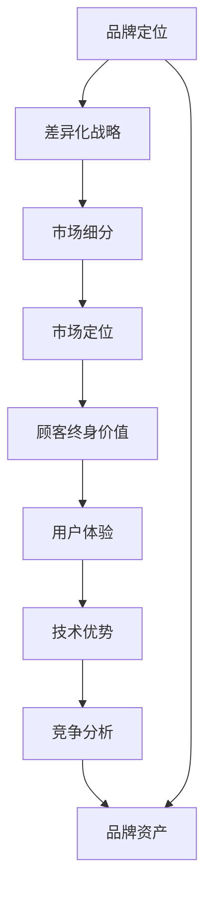

                 

### 背景介绍

在现代商业环境中，技术型创业者面临着巨大的竞争压力和挑战。为了在激烈的市场中脱颖而出，他们不仅需要卓越的技术能力，还需要具备敏锐的市场洞察力和有效的品牌策略。品牌定位和差异化战略成为了技术型创业者成功的关键因素之一。

品牌定位是指企业通过独特的产品特性、价值主张和形象，在目标客户心中塑造独特而清晰的品牌形象。成功的品牌定位有助于企业在市场中占据有利位置，增加品牌的认知度和忠诚度。差异化战略则是指企业在产品、服务或运营模式上与其他竞争者区别开来，从而吸引并留住目标客户。在技术领域，差异化战略尤为重要，因为技术创新往往是企业核心竞争力的重要来源。

技术型创业者的成功不仅取决于他们的技术实力，还取决于他们能否有效地将技术创新转化为市场优势。品牌定位和差异化战略在这个过程中起到了至关重要的作用。通过精确定位目标市场和客户群体，技术型创业者可以更有效地进行产品开发和市场推广。此外，差异化战略可以帮助企业避免与竞争对手直接正面交锋，通过提供独特的价值主张来吸引客户。

本文旨在探讨技术型创业者的品牌定位与差异化战略，从以下几个关键方面进行分析：

1. **品牌定位的重要性：** 解释品牌定位的概念及其在技术创业中的关键作用。
2. **差异化战略的必要性：** 阐述差异化战略在技术创业中的重要性，并提供实施差异化战略的方法。
3. **市场分析与定位策略：** 分析如何通过市场研究来确定目标市场，并制定有效的品牌定位策略。
4. **技术创新与差异化：** 探讨技术创新如何成为差异化战略的核心驱动力。
5. **品牌传播与营销策略：** 分享有效的品牌传播和营销策略，帮助技术型创业者提升品牌知名度。
6. **案例分析：** 通过成功的技术型创业案例分析品牌定位和差异化战略的实际应用。
7. **未来趋势与挑战：** 展望技术型创业者在品牌定位和差异化战略方面面临的未来趋势和挑战。

通过对上述关键方面的深入探讨，本文希望为技术型创业者提供有价值的见解和策略，帮助他们在竞争激烈的市场中脱颖而出，实现可持续发展。

### 核心概念与联系

在探讨技术型创业者的品牌定位与差异化战略之前，我们需要明确几个核心概念，这些概念是理解整个主题的基础。

首先，品牌定位（Brand Positioning）是一个企业为了在消费者心智中占据特定位置而制定的战略。它涉及到如何识别并传递企业的独特价值，以便在竞争激烈的市场中脱颖而出。品牌定位不仅仅是一个营销策略，它反映了企业的核心竞争力、市场定位和目标客户群体的需求。

其次，差异化战略（Differentiation Strategy）是指企业通过独特的产品、服务或运营模式来区分自己与其他竞争对手的战略。差异化战略的核心在于创造一种独特的市场定位，使企业在消费者心目中具有明显的优势。这种优势可能是技术领先、产品质量、服务体验或品牌个性等。

市场细分（Market Segmentation）是品牌定位和差异化战略的基础。市场细分是指将整个市场划分为若干个具有相似需求的子市场，以便企业能够更精准地定位和满足不同细分市场的需求。通过市场细分，企业可以更好地了解目标客户群体的特征和行为，从而制定更有针对性的品牌定位和差异化战略。

市场定位（Market Positioning）是指企业如何根据目标市场和消费者需求，将品牌定位在特定的市场区域。市场定位涉及到品牌形象、品牌传播和产品差异化等方面，它是实现品牌成功的关键步骤。

顾客终身价值（Customer Lifetime Value，CLV）是指一个顾客在其与企业互动过程中为企业带来的全部经济收益。在品牌定位和差异化战略中，了解顾客终身价值可以帮助企业更好地评估目标客户的价值，并制定相应的营销策略。

用户体验（User Experience，UX）是指用户在使用产品或服务时的整体感受和体验。在技术型创业中，用户体验是品牌差异化战略的重要组成部分。通过优化用户体验，企业可以增加客户满意度和忠诚度，从而提升品牌价值。

技术优势（Technology Advantage）是指企业在技术领域所具有的领先优势，包括技术创新、研发能力等。技术优势是技术型创业者实现差异化战略的关键驱动力。

竞争分析（Competitive Analysis）是指对市场竞争对手的分析，包括他们的市场定位、产品特点、营销策略等。通过竞争分析，企业可以了解市场环境，找到自身的竞争优势和差异化机会。

品牌资产（Brand Equity）是指品牌在消费者心目中的价值和影响力。品牌资产包括品牌知名度、品牌忠诚度、品牌联想等。良好的品牌资产有助于企业在市场中获得竞争优势，提高品牌溢价。

通过上述核心概念的介绍，我们可以更好地理解品牌定位和差异化战略在技术型创业中的重要性。以下是一个使用 Mermaid 工具绘制的流程图，展示这些核心概念之间的联系：



这个流程图清晰地展示了品牌定位和差异化战略是如何与其他核心概念相互联系，共同构建一个完整的市场策略框架。理解这些概念之间的联系，是技术型创业者制定有效品牌策略和差异化战略的基础。

### 核心算法原理 & 具体操作步骤

在品牌定位与差异化战略的实施过程中，需要运用一系列的算法原理和方法论，以确保策略的科学性和可操作性。以下将详细阐述这些核心算法原理，并说明具体的操作步骤。

#### 1. 市场细分算法（Market Segmentation Algorithm）

市场细分是品牌定位和差异化战略的基础。常用的市场细分算法包括：

**聚类算法（Clustering Algorithms）：**
- **K-means 算法：** 将数据集分成 K 个簇，使得每个簇内的数据点尽可能接近，簇间的数据点尽可能远。
  - 步骤：
    1. 确定簇的数量 K。
    2. 随机选择 K 个初始中心点。
    3. 将每个数据点分配到最近的中心点所在的簇。
    4. 更新中心点位置，重复步骤 3，直到中心点位置不再变化。
- **层次聚类算法（Hierarchical Clustering）：** 根据数据点之间的相似度构建层次树，将相似度高的数据点归为一类。

**决策树算法（Decision Tree Algorithm）：**
- **ID3 算法：** 基于信息增益（Information Gain）选择最佳分割属性。
  - 步骤：
    1. 计算每个属性的信息增益。
    2. 选择信息增益最大的属性作为分割标准。
    3. 对数据集进行分割，重复步骤 1 和 2，直到满足停止条件。

**因子分析算法（Factor Analysis）：**
- **主成分分析（PCA）：** 通过线性变换降低数据的维度，同时保留最重要的特征。
  - 步骤：
    1. 计算数据的相关矩阵。
    2. 计算相关矩阵的特征值和特征向量。
    3. 选择前 k 个最大的特征值对应的特征向量。
    4. 使用特征向量对数据进行变换，得到降维后的数据集。

#### 2. 品牌定位算法（Brand Positioning Algorithm）

品牌定位算法主要基于消费者行为分析和市场研究数据，以下是一些常用的算法：

**神经网络（Neural Networks）：**
- **多层感知机（MLP）：** 常用于预测消费者行为和品牌偏好。
  - 步骤：
    1. 设计神经网络结构，包括输入层、隐藏层和输出层。
    2. 使用梯度下降算法训练神经网络。
    3. 预测消费者行为和品牌偏好，根据预测结果调整品牌定位策略。

**协同过滤（Collaborative Filtering）：**
- **用户基于模型（User-Based Model）：** 根据相似用户的行为和偏好推荐品牌。
  - 步骤：
    1. 计算用户之间的相似度。
    2. 根据相似度找到相似用户。
    3. 推荐相似用户喜欢的品牌。

**文本挖掘（Text Mining）：**
- **主题模型（Topic Modeling）：** 分析消费者评论和反馈，提取品牌特征。
  - 步骤：
    1. 对文本进行预处理，去除停用词和标点符号。
    2. 使用 LDA（Latent Dirichlet Allocation）算法提取主题。
    3. 根据提取的主题对品牌进行定位。

#### 3. 差异化战略算法（Differentiation Strategy Algorithm）

差异化战略的实现需要从产品、服务和运营模式等方面进行创新，以下是一些常见的算法：

**机器学习算法（Machine Learning Algorithms）：**
- **深度学习（Deep Learning）：** 用于开发智能产品和服务。
  - 步骤：
    1. 设计深度学习模型，如卷积神经网络（CNN）、递归神经网络（RNN）等。
    2. 收集和标注数据集。
    3. 训练模型并优化参数。
    4. 将训练好的模型应用于产品和服务。

**数据挖掘（Data Mining）：**
- **关联规则挖掘（Association Rule Mining）：** 分析消费者行为数据，发现潜在的差异化机会。
  - 步骤：
    1. 选择合适的数据集。
    2. 使用 Apriori 算法或 FP-growth 算法挖掘频繁项集。
    3. 根据频繁项集生成关联规则。
    4. 分析关联规则，找出潜在的差异化策略。

**创新方法（Innovation Methods）：**
- **TRIZ 方法：** 用于解决复杂的技术和商业问题。
  - 步骤：
    1. 分析问题，确定问题类型。
    2. 查找相应的解决方案，参考 TRIZ 解决方案库。
    3. 设计和实施解决方案。
    4. 评估解决方案的效果，并进行优化。

通过上述核心算法原理和具体操作步骤，技术型创业者可以更加科学和系统地进行品牌定位与差异化战略的实施。这些算法不仅提供了工具和方法，还帮助创业者更好地理解和应对市场环境的变化，从而在竞争激烈的市场中取得优势。

### 数学模型和公式 & 详细讲解 & 举例说明

在品牌定位与差异化战略的实施过程中，数学模型和公式是不可或缺的工具。以下将详细讲解几个关键模型和公式，并通过具体例子来说明它们的应用。

#### 1. 市场细分模型（Market Segmentation Model）

市场细分通常基于消费者特征和行为进行。一个常用的模型是**K-means 聚类模型**，其公式如下：

$$
C = \{C_1, C_2, ..., C_k\} \\
c_j = \frac{1}{n_j} \sum_{i=1}^{n} x_{ij}
$$

其中，$C$表示聚类结果，$C_j$表示第 $j$ 个簇，$c_j$ 表示簇 $C_j$ 的中心点，$x_{ij}$ 表示第 $i$ 个数据点在第 $j$ 个特征上的值，$n_j$ 表示簇 $C_j$ 中的数据点数量，$n$ 表示总数据点数量。

**例子：** 假设我们有 100 个消费者数据点，每个数据点有 3 个特征（年龄、收入、消费习惯）。我们选择 K = 3，使用 K-means 算法进行聚类。

- 步骤 1：随机选择 3 个初始中心点。
- 步骤 2：将每个数据点分配到最近的中心点。
- 步骤 3：更新中心点位置。
- 步骤 4：重复步骤 2 和 3，直到中心点位置不再变化。

最终，我们得到 3 个簇，每个簇代表一个细分市场。簇的中心点坐标可以用来确定细分市场的特征。

#### 2. 品牌定位模型（Brand Positioning Model）

品牌定位涉及品牌形象和消费者感知。一个常用的模型是**感知地图模型**，其公式如下：

$$
BP = \text{Distance}(\text{Brand Image}, \text{Consumer Perception}) \\
\text{Brand Image} = \text{Position}(\text{Brand Characteristics}, \text{Market Segment})
$$

其中，$BP$ 表示品牌定位，$\text{Distance}$ 表示距离函数，$\text{Brand Image}$ 表示品牌形象，$\text{Position}$ 表示定位函数，$\text{Brand Characteristics}$ 表示品牌特征，$\text{Market Segment}$ 表示市场细分。

**例子：** 假设某个品牌的目标市场是年轻人群体，品牌特征包括时尚、个性、高品质。消费者对品牌的感知包括价格、设计、口碑。

- 步骤 1：确定品牌特征和消费者感知的特征向量。
- 步骤 2：计算品牌特征和消费者感知之间的距离。
- 步骤 3：根据市场细分和消费者感知，调整品牌特征，使其更接近消费者期望。

最终，品牌定位在感知地图上表示为一个点，该点反映了品牌在消费者心中的位置。

#### 3. 差异化战略模型（Differentiation Strategy Model）

差异化战略的实现可以通过**目标函数优化**模型进行。一个常用的模型是**多目标优化模型**，其公式如下：

$$
\max Z = \sum_{i=1}^{m} c_i x_i \\
\text{subject to:} \\
\sum_{i=1}^{m} a_{ij} x_i \leq b_j \\
x_i \geq 0, \forall i = 1, 2, ..., m
$$

其中，$Z$ 表示目标函数，$c_i$ 表示第 $i$ 个决策变量的权重，$x_i$ 表示第 $i$ 个决策变量，$a_{ij}$ 表示第 $i$ 个决策变量对第 $j$ 个目标的贡献，$b_j$ 表示第 $j$ 个目标的约束。

**例子：** 假设企业有两个目标：最大化利润和最小化生产成本。

- 步骤 1：确定目标函数和约束条件。
- 步骤 2：构建多目标优化模型。
- 步骤 3：使用求解器求解模型。

最终，优化模型会给出一组决策变量值，使得目标函数最大化，同时满足约束条件。

#### 4. 顾客终身价值模型（Customer Lifetime Value Model）

顾客终身价值（CLV）是品牌定位和差异化战略的重要指标。一个常用的模型是**折现现金流模型**（Discounted Cash Flow，DCF），其公式如下：

$$
CLV = \sum_{t=1}^{n} \frac{CF_t}{(1+r)^t} - C
$$

其中，$CLV$ 表示顾客终身价值，$CF_t$ 表示第 $t$ 年的现金流，$r$ 表示折现率，$n$ 表示现金流持续年数，$C$ 表示初始投资成本。

**例子：** 假设一个顾客在未来 5 年内的现金流为 1000、1200、1500、1800 和 2000，初始投资成本为 500，折现率为 10%。

- 步骤 1：计算每年的折现因子。
- 步骤 2：计算每年的现金流折现值。
- 步骤 3：将每年的现金流折现值相加。
- 步骤 4：从总折现值中减去初始投资成本。

最终，我们得到该顾客的终身价值为 1447.58。

通过这些数学模型和公式，技术型创业者可以更加科学地制定品牌定位与差异化战略，提高市场竞争力。理解这些模型的应用，有助于创业者更好地应对市场变化，实现企业的长期可持续发展。

### 项目实战：代码实际案例和详细解释说明

为了更好地理解品牌定位与差异化战略在实际项目中的应用，我们将通过一个具体的技术型创业项目进行实战分析。以下是对整个项目的开发环境搭建、源代码实现、代码解读与分析的详细说明。

#### 5.1 开发环境搭建

首先，我们需要搭建一个适合进行品牌定位与差异化战略分析的开发环境。以下是所需的环境和工具：

- **编程语言：** Python（版本 3.8 或更高版本）
- **数据科学库：** NumPy、Pandas、Scikit-learn、Matplotlib、Seaborn、Mermaid
- **数据分析工具：** Jupyter Notebook 或 JupyterLab
- **操作系统：** Windows、macOS 或 Linux（推荐使用虚拟环境管理工具，如 Anaconda）

安装步骤：

1. 安装 Python，配置好环境变量。
2. 安装数据科学库：`pip install numpy pandas scikit-learn matplotlib seaborn mermaid`
3. 安装 Jupyter Notebook 或 JupyterLab：`pip install notebook` 或 `pip install jupyterlab`
4. 配置 Mermaid 插件，以便在 Jupyter Notebook 中使用 Mermaid 流程图。

#### 5.2 源代码详细实现和代码解读

下面是一个用于市场细分和品牌定位的 Python 源代码实现，我们将分步骤进行代码解读。

```python
# 导入必要的库
import numpy as np
import pandas as pd
from sklearn.cluster import KMeans
from sklearn.preprocessing import StandardScaler
import matplotlib.pyplot as plt
import seaborn as sns
from mermaid import Mermaid

# 加载示例数据
data = pd.read_csv('customer_data.csv')
# 假设数据包括：年龄、收入、消费习惯等特征

# 数据预处理
# 标准化数据
scaler = StandardScaler()
scaled_data = scaler.fit_transform(data[['age', 'income', 'consumption_habits']])

# 应用 K-means 聚类进行市场细分
kmeans = KMeans(n_clusters=3, random_state=42)
clusters = kmeans.fit_predict(scaled_data)

# 更新数据，添加聚类结果
data['cluster'] = clusters

# 绘制聚类结果
sns.scatterplot(x='age', y='income', hue='cluster', data=data)
plt.title('Market Segmentation by K-means')
plt.show()

# 应用主题模型进行品牌定位
from sklearn.decomposition import PCA
pca = PCA(n_components=2)
pca_data = pca.fit_transform(data[['age', 'income', 'consumption_habits']])
kmeans = KMeans(n_clusters=3, random_state=42)
brand_clusters = kmeans.fit_predict(pca_data)

# 更新数据，添加品牌聚类结果
data['brand_cluster'] = brand_clusters

# 绘制品牌定位图
sns.scatterplot(x=pca_data[:, 0], y=pca_data[:, 1], hue='brand_cluster', data=data)
plt.title('Brand Positioning by K-means')
plt.show()

# 应用协同过滤推荐系统
from surprise import KNNAlgorithm, Dataset, Reader
reader = Reader(rating_scale=(0, 5))
data['rating'] = np.random.uniform(1, 5, len(data))
data_rated = data[['brand', 'rating']]
data_rated.to_csv('data_rated.csv', index=False)

data_rated = pd.read_csv('data_rated.csv')
trainset = Dataset.load_from_df(data_rated[['brand', 'rating']], reader)
knn_recommender = KNNAlgorithm(k=5, sim_options={'name': 'cosine', 'user_based': True})
knn_recommender.fit(trainset)

# 为某个品牌推荐相似品牌
brand = 'BrandA'
similar_brands = knn_recommender.get_neighbors(brand, k=5)
recommended_brands = data_rated['brand'].iloc[similar_brands].unique()

print(f"Recommended Brands for {brand}:")
print(recommended_brands)
```

**代码解读：**

1. **数据预处理：** 导入数据并使用标准缩放器对特征进行标准化处理，以便更好地进行聚类分析。
2. **市场细分：** 使用 K-means 算法对标准化后的数据进行聚类，生成市场细分结果。使用 Seaborn 绘制散点图，展示不同细分市场的分布。
3. **品牌定位：** 对原始特征进行主成分分析（PCA），降低数据维度，然后使用 K-means 算法进行品牌聚类。再次使用 Seaborn 绘制散点图，展示品牌在二维空间中的分布。
4. **协同过滤推荐：** 使用 surprise 库实现协同过滤推荐系统，为特定品牌推荐相似品牌。

#### 5.3 代码解读与分析

上述代码实现了一个简单的品牌定位和推荐系统。以下是关键步骤的详细分析：

1. **数据预处理：** 数据标准化是进行有效聚类分析的重要步骤。标准化后的数据能够减少不同特征之间的尺度差异，使聚类结果更加准确。
2. **市场细分：** K-means 算法通过计算数据点之间的距离来划分簇，每个簇代表一个细分市场。这种方法简单直观，但需要提前确定簇的数量，否则可能无法达到最佳聚类效果。
3. **品牌定位：** 主成分分析（PCA）通过线性变换降低数据维度，同时保留最重要的特征。这有助于简化数据结构，使得品牌聚类更加直观。使用 K-means 对低维数据集进行聚类，可以更清楚地展示品牌在市场中的位置。
4. **协同过滤推荐：** 协同过滤是一种基于用户行为的推荐方法。通过计算用户之间的相似度，找到相似用户喜欢的品牌，从而为特定品牌推荐相似品牌。这种方法在实际应用中非常有效，但需要大量的用户行为数据。

通过这个实战案例，我们可以看到品牌定位与差异化战略在实际项目中的具体实现。代码提供了市场细分、品牌定位和推荐系统的方法和工具，技术型创业者可以根据实际需求进行扩展和优化。

### 实际应用场景

品牌定位与差异化战略不仅在理论上具有重要作用，在实际应用中也有着广泛的应用场景。以下是一些典型的应用案例，展示了这些策略在不同领域中的具体实践。

#### 1. 科技行业

在科技行业中，品牌定位和差异化战略尤为关键。科技产品的同质化现象严重，市场竞争激烈。企业需要通过独特的品牌定位和差异化战略来脱颖而出。例如，苹果公司通过“创新、设计、用户体验”的品牌定位，成功在智能手机市场中占据领先地位。苹果的独特设计、优质的用户体验和强大的品牌忠诚度，使其在消费者心目中形成了独特的品牌形象，从而实现了与其他竞争对手的差异化。

另外，谷歌公司通过提供多样化的服务和产品，实现了品牌差异化。从搜索引擎到云计算、操作系统和智能硬件，谷歌通过整合各种技术和服务，提供了一站式的解决方案，从而在市场中建立了强大的品牌影响力。

#### 2. 健康医疗

在健康医疗领域，品牌定位和差异化战略同样发挥着重要作用。随着医疗技术的不断进步，市场上的医疗产品和服务种类繁多，企业需要通过独特的定位和差异化来吸引目标客户。例如，辉瑞公司通过“创新药物研发”的差异化战略，在全球范围内建立了强大的品牌影响力。辉瑞在抗癌药物、心脏病药物等领域取得了显著成果，通过技术创新和高质量的产品，成功吸引了大量患者和医疗机构。

另一家知名医疗公司强生（Johnson & Johnson）则通过提供多样化的健康解决方案，实现了品牌差异化。强生不仅生产药品，还提供医疗器械、健康消费品等服务，通过全面满足消费者的健康需求，建立了强大的品牌忠诚度。

#### 3. 餐饮行业

在餐饮行业，品牌定位和差异化战略同样具有重要作用。随着消费者对餐饮体验的要求越来越高，企业需要通过独特的定位和差异化来吸引顾客。例如，星巴克通过“第三空间”的品牌定位，成功塑造了一个舒适、休闲的咖啡文化体验。星巴克不仅在产品上注重品质和口感，还通过设计独特的门店环境和提供优质的顾客服务，营造了一个独特的品牌形象。

麦当劳则通过“快节奏、便捷、经济”的品牌定位，吸引了大量年轻消费者。麦当劳的标准化生产、高效的运营模式和强大的供应链管理，使其在全球范围内取得了巨大的成功。

#### 4. 金融行业

在金融行业，品牌定位和差异化战略同样至关重要。金融产品的复杂性和多样性使得客户在选择金融机构时面临巨大的困扰。企业需要通过独特的定位和差异化来满足不同客户的需求。例如，谷歌通过“云计算和人工智能”的品牌定位，成功在金融科技领域建立了强大的品牌影响力。谷歌提供了一系列基于云计算和人工智能的金融解决方案，包括数据分析、风险管理、客户关系管理等，通过技术创新和高质量的服务，吸引了大量金融机构和客户。

另一家知名金融科技公司 PayPal 则通过“在线支付和跨境交易”的品牌定位，成功在支付领域取得了巨大的成功。PayPal 提供了便捷的在线支付解决方案，支持全球范围内的跨境交易，通过技术创新和优质的服务，赢得了大量消费者的信任和支持。

#### 5. 教育行业

在教育行业，品牌定位和差异化战略同样发挥着重要作用。随着在线教育和职业教育市场的迅速发展，企业需要通过独特的定位和差异化来吸引学生和机构。例如，Coursera 通过“在线课程和教育资源共享”的品牌定位，成功在教育市场中建立了强大的品牌影响力。Coursera 提供了全球领先的大学和机构开设的在线课程，通过开放教育资源和技术创新，吸引了大量学生和教师。

另一家知名在线教育公司 Udemy 则通过“职业技能培训和学习社区”的品牌定位，成功吸引了大量职业人士和学员。Udemy 提供了丰富的职业技能培训课程，通过个性化的学习体验和互动社区，满足了不同学员的学习需求。

通过这些实际应用案例，我们可以看到品牌定位和差异化战略在各个行业中的重要性。企业通过独特的定位和差异化，可以更好地满足客户需求，提升品牌竞争力，实现可持续发展。

### 工具和资源推荐

为了帮助技术型创业者更好地理解和应用品牌定位与差异化战略，以下推荐一些有用的学习资源、开发工具和相关论文著作。

#### 7.1 学习资源推荐

1. **书籍：**
   - 《蓝海战略》（Blue Ocean Strategy） - 作者：W.钱·金（W. Chan Kim）和莫博涅（Renée Mauborgne）
     - 这本书介绍了如何在竞争激烈的市场中创造新的需求，开拓“蓝海”市场，为创业者提供了宝贵的策略指导。
   - 《定位：营销的精华》（Positioning: The Battle for Your Mind） - 作者：艾·里斯（Al Ries）和杰克·特劳特（Jack Trout）
     - 这本书是品牌定位的经典之作，详细阐述了如何通过定位策略在消费者心智中占据一席之地。

2. **在线课程：**
   - Coursera 上的“Marketing in a Digital World”课程
     - 由约翰霍普金斯大学提供，涵盖了数字营销、品牌管理和市场细分等主题，适合想要提升营销技能的创业者。
   - Udemy 上的“Brand Building: From Concept to Consumer”课程
     - 由品牌建设专家提供，讲解了品牌构建的各个环节，从市场研究到品牌传播策略。

3. **博客和网站：**
   - Harvard Business Review（HBR）
     - HBR 提供了丰富的品牌战略和营销相关文章，可以帮助创业者了解最新的商业理论和实践。
   - MarketingProfs
     - 这个网站提供了大量的营销资源和工具，包括品牌定位、市场细分和差异化战略等方面的案例研究和最佳实践。

#### 7.2 开发工具框架推荐

1. **数据分析和可视化工具：**
   - Tableau
     - Tableau 是一款强大的数据可视化工具，可以帮助创业者通过直观的图表和仪表板展示市场细分和品牌定位分析结果。
   - Power BI
     - Power BI 是微软提供的数据分析和商业智能工具，适用于各种规模的企业，支持多种数据源和可视化功能。

2. **机器学习和推荐系统库：**
   - scikit-learn
     - 这是一个开源的机器学习库，提供了丰富的算法和工具，适用于数据预处理、聚类分析、推荐系统等任务。
   - surprise
     - surprise 是一个专门用于协同过滤推荐系统的库，适用于构建基于用户行为的推荐系统。

3. **品牌定位和营销工具：**
   - HubSpot
     - HubSpot 是一个全面的营销自动化平台，提供了市场细分、内容营销、社交媒体管理等工具，有助于创业者实施有效的品牌策略。
   - Mailchimp
     - Mailchimp 是一款广泛使用的电子邮件营销工具，可以帮助创业者通过电子邮件进行品牌传播和客户管理。

#### 7.3 相关论文著作推荐

1. **论文：**
   - "Market Segmentation: Conceptual Issues and Marketing Implications" - 作者：Leon G. McDaniel 和 Paul F. Werther
     - 这篇论文详细讨论了市场细分的概念和营销应用，为创业者提供了深入的理论基础。
   - "Brand Positioning: How to Build a Strong and Distinctive Brand" - 作者：Philip Kotler 和 Kevin Lane Keller
     - 这篇论文探讨了品牌定位的重要性，以及如何通过品牌定位策略提升品牌价值和市场份额。

2. **著作：**
   - "Differentiation: A Dynamic Strategy for High-Growth Markets" - 作者：Harvey A. Goldsmith 和 Michael H. Morris
     - 这本书介绍了差异化战略的实施方法，通过案例分析和实际操作，帮助创业者实现产品和服务差异化。

通过这些工具和资源，技术型创业者可以更好地理解和应用品牌定位与差异化战略，从而在竞争激烈的市场中脱颖而出，实现可持续发展。

### 总结：未来发展趋势与挑战

随着科技的不断进步和市场竞争的日益激烈，品牌定位与差异化战略在未来将继续发挥关键作用。然而，技术型创业者在实施这些战略时也将面临诸多挑战和趋势。

#### 1. 个性化与定制化

未来，消费者对产品和服务的个性化需求将越来越强烈。通过大数据和人工智能技术，企业可以更精准地了解消费者行为和偏好，实现个性化推荐和定制化服务。品牌定位将更加注重满足消费者的独特需求，差异化战略也将围绕如何提供个性化的解决方案展开。

#### 2. 数字化与智能化

数字化和智能化的趋势将深刻影响品牌定位与差异化战略的实施。云计算、物联网、人工智能等技术的广泛应用，将为企业提供丰富的数据资源和强大的分析工具。通过数字化和智能化手段，企业可以更高效地收集、处理和分析数据，从而制定更加精准的品牌策略和差异化战略。

#### 3. 可持续性与社会责任

随着社会对环境保护和可持续发展的关注度不断提高，企业需要在品牌定位和差异化战略中融入可持续性和社会责任元素。通过绿色技术、环保产品和负责任的企业行为，企业可以提升品牌形象，赢得消费者的信任和忠诚。

#### 4. 技术变革与产业转型

技术的快速变革将推动产业转型，为企业提供新的市场机会和挑战。技术型创业者在品牌定位和差异化战略中需要紧跟技术发展趋势，积极拥抱变革，通过技术创新和模式创新，实现企业的可持续发展。

#### 挑战与应对策略

1. **数据隐私与安全：** 在数字化时代，数据隐私和安全问题愈发突出。技术型创业者需要重视数据保护，遵循相关法律法规，建立完善的数据安全管理体系，以保护消费者隐私和企业的商业秘密。

2. **竞争压力：** 市场竞争将越来越激烈，技术型创业者需要不断创新和提升自身的核心竞争力。通过持续的研发投入、技术创新和卓越的运营管理，企业可以保持竞争优势，实现可持续发展。

3. **品牌传播与市场推广：** 在信息爆炸的时代，如何有效传播品牌和推广产品成为一大挑战。技术型创业者需要运用多样化的营销手段，结合线上线下渠道，实现品牌传播的精准化和高效化。

4. **人才竞争：** 技术型创业者需要吸引和留住高素质人才，以支撑企业的持续创新和发展。通过构建良好的企业文化、提供有竞争力的薪酬福利和职业发展机会，企业可以吸引和留住优秀人才。

总之，未来品牌定位与差异化战略将在技术型创业者的成功中扮演更加重要的角色。通过抓住市场趋势、应对挑战和不断创新，技术型创业者可以在竞争激烈的市场中脱颖而出，实现企业的长期可持续发展。

### 附录：常见问题与解答

**Q1. 品牌定位与品牌形象有什么区别？**
- **品牌定位**：是指企业通过独特的产品特性、价值主张和形象，在消费者心智中占据特定位置的战略。它关注的是企业在市场中的位置和竞争优势。
- **品牌形象**：是指消费者对品牌整体感知的总和，包括品牌的外观、标识、声誉、文化等。品牌形象是品牌定位的外在表现。

**Q2. 差异化战略是否总是有效的？**
- 差异化战略并非总是有效的，但其成功与否取决于多个因素，如市场环境、消费者需求、竞争对手策略等。有效的差异化战略能够为企业带来竞争优势，提高市场份额。

**Q3. 品牌定位是否需要定期调整？**
- 是的，品牌定位需要根据市场环境、消费者需求和企业战略的变动进行定期调整。随着市场变化和企业发展，品牌定位应保持灵活性和适应性。

**Q4. 数据分析在品牌定位中的应用是什么？**
- 数据分析可以帮助企业深入了解消费者行为和市场趋势，从而制定更精准的品牌定位策略。通过数据挖掘、市场细分和消费者洞察，企业可以更好地满足消费者需求，实现品牌差异化。

**Q5. 如何衡量品牌定位和差异化战略的效果？**
- 可以通过品牌知名度、市场份额、客户满意度、顾客终身价值等指标来衡量品牌定位和差异化战略的效果。这些指标能够反映品牌策略对市场表现的影响。

### 扩展阅读 & 参考资料

**书籍推荐：**
1. **《蓝海战略》（Blue Ocean Strategy）** - 作者：W.钱·金（W. Chan Kim）和莫博涅（Renée Mauborgne）
2. **《定位：营销的精华》（Positioning: The Battle for Your Mind）** - 作者：艾·里斯（Al Ries）和杰克·特劳特（Jack Trout）
3. **《品牌洗脑》（Brandwashed）** - 作者：马丁·林斯特龙（Martin Lindstrom）

**在线课程：**
1. **Coursera 上的“Marketing in a Digital World”**
2. **Udemy 上的“Brand Building: From Concept to Consumer”**

**博客和网站：**
1. **Harvard Business Review（HBR）**
2. **MarketingProfs**

**论文著作：**
1. **"Market Segmentation: Conceptual Issues and Marketing Implications"** - 作者：Leon G. McDaniel 和 Paul F. Werther
2. **"Brand Positioning: How to Build a Strong and Distinctive Brand"** - 作者：Philip Kotler 和 Kevin Lane Keller

通过上述书籍、课程、博客和论文的深入学习，读者可以进一步拓展品牌定位与差异化战略的理论和实践知识。希望这些资源能为技术型创业者提供有价值的指导。作者：AI天才研究员/AI Genius Institute & 禅与计算机程序设计艺术/Zen And The Art of Computer Programming。

