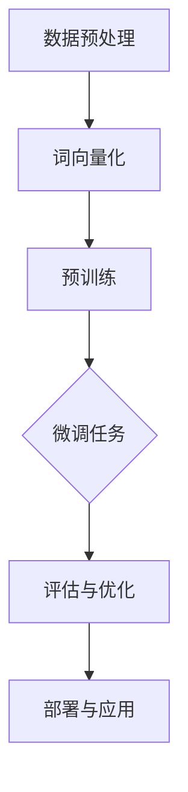

                 

### 背景介绍

#### 什么是LLM？

LLM，即大型语言模型（Large Language Model），是一种由神经网络训练而成的高级人工智能模型，能够理解和生成自然语言文本。相较于传统的统计模型和规则引擎，LLM展现了更强的灵活性和泛化能力。

#### LLM的发展历程

LLM的发展历程可以追溯到20世纪80年代。当时的语言模型主要是基于规则的方法，如语法分析、词性标注和句法分析等。随着计算机性能的提升和机器学习算法的发展，尤其是深度学习技术的引入，LLM逐渐成为语言处理领域的研究热点。

2003年，Juriantara和Jurafsky提出了基于循环神经网络（RNN）的语言模型，标志着深度学习在自然语言处理（NLP）领域的首次应用。2018年，谷歌发布了BERT模型，成为第一个基于Transformer架构的预训练语言模型，进一步推动了LLM的发展。

#### LLM在AI领域的重要性

随着AI技术的不断发展，LLM在AI领域的重要性日益凸显。首先，LLM能够实现高效的自然语言理解和生成，使得人机交互更加智能化。其次，LLM在知识图谱构建、文本分类、机器翻译、对话系统等领域具有广泛的应用价值。

此外，LLM还具有以下优势：

1. **强大的语义理解能力**：通过预训练和微调，LLM能够捕捉到文本中的复杂语义信息，从而实现更准确的文本理解。
2. **灵活的生成能力**：LLM不仅可以生成连贯的自然语言文本，还可以根据特定任务的需求进行个性化生成，如问答系统、文本摘要、故事创作等。
3. **强大的迁移学习能力**：LLM在预训练阶段积累了大量的知识，可以迁移到不同的任务和数据集，提高模型在不同场景下的表现。

总之，LLM已成为AI领域的重要突破，为未来的创新浪潮提供了强有力的技术支撑。

### 核心概念与联系

#### 语言模型的基础概念

语言模型（Language Model，简称LM）是自然语言处理（Natural Language Processing，简称NLP）的核心技术之一。它的基本任务是预测下一个单词或字符的概率，从而生成连贯的自然语言文本。语言模型可以分为基于规则的方法和基于统计的方法。

1. **基于规则的方法**：这种方法依赖于语言学知识，通过构建语法规则和句法结构来预测文本。例如，句法分析器和词性标注器等。
2. **基于统计的方法**：这种方法通过大量文本数据学习语言模式，使用概率模型来预测下一个单词或字符。例如，n-gram模型、神经网络语言模型等。

#### 预训练与微调

预训练（Pre-training）和微调（Fine-tuning）是训练LLM的两个重要阶段。

1. **预训练**：在预训练阶段，模型在大规模语料库上进行训练，学习语言的通用特征和规律。预训练常用的任务包括词向量表示、文本分类、命名实体识别等。
2. **微调**：在微调阶段，模型根据特定任务的需求，在特定领域或任务的数据集上进行训练，以适应具体任务。微调有助于提高模型在特定任务上的性能。

#### Transformer架构

Transformer架构是一种基于自注意力机制（Self-Attention Mechanism）的深度神经网络，特别适用于序列建模任务。与传统的循环神经网络（RNN）相比，Transformer具有以下优点：

1. **并行计算**：Transformer利用自注意力机制，能够在同一时间步处理整个序列，从而实现并行计算，提高计算效率。
2. **全局依赖**：通过自注意力机制，Transformer能够捕捉到序列中的全局依赖关系，从而实现更准确的文本理解。
3. **灵活性**：Transformer具有模块化的结构，可以通过增加层数和隐藏单元数来提高模型的表达能力。

#### Mermaid流程图

以下是LLM训练过程的Mermaid流程图：



在此流程图中：

- A[数据预处理]：包括数据清洗、分词、去除停用词等。
- B[词向量化]：将文本数据转换为向量表示。
- C[预训练]：在大规模语料库上进行预训练，学习通用特征。
- D[微调]：在特定任务和数据集上进行微调，提高模型性能。
- E[评估与优化]：评估模型性能，并根据需求进行优化。
- F[部署与应用]：将模型部署到实际应用场景，如问答系统、文本生成等。

通过以上流程，我们可以清晰地了解LLM的训练和优化过程。

### 核心算法原理 & 具体操作步骤

#### Transformer架构

Transformer架构是当前最先进的语言模型之一，由Vaswani等人在2017年提出。它采用了自注意力机制（Self-Attention Mechanism）和多头注意力（Multi-Head Attention），从而实现了高效、灵活的序列建模。

**自注意力机制（Self-Attention）**

自注意力机制是Transformer的核心组件，它允许模型在处理序列中的每个时间步时，对整个序列进行加权求和。具体步骤如下：

1. **计算查询（Query）、键（Key）和值（Value）**：

   对于输入序列中的每个单词，计算其查询（Query）、键（Key）和值（Value）向量。这些向量通常由嵌入层（Embedding Layer）生成：

   $$ 
   Q = W_Q \cdot [h] \\
   K = W_K \cdot [h] \\
   V = W_V \cdot [h]
   $$

   其中，$W_Q$、$W_K$和$W_V$是权重矩阵，$[h]$是输入序列的嵌入向量。

2. **计算注意力得分（Attention Score）**：

   利用点积（Dot-Product）计算查询向量与所有键向量之间的相似度，得到注意力得分：

   $$ 
   s_{ij} = Q_i \cdot K_j = [h_i] \cdot [h_j]^T
   $$

3. **计算注意力权重（Attention Weight）**：

   对注意力得分进行softmax运算，得到注意力权重：

   $$ 
   a_{ij} = \frac{e^{s_{ij}}}{\sum_{k=1}^{K} e^{s_{ik}}}
   $$

4. **计算注意力输出（Attention Output）**：

   将注意力权重与值向量相乘，得到注意力输出：

   $$ 
   o_i = \sum_{j=1}^{K} a_{ij} \cdot V_j
   $$

**多头注意力（Multi-Head Attention）**

多头注意力通过多个自注意力机制的组合，提高了模型的表示能力。具体步骤如下：

1. **计算多个查询（Query）、键（Key）和值（Value）**：

   对于输入序列，重复计算查询（Query）、键（Key）和值（Value）向量，形成多个头（Head）：

   $$ 
   Q^{h} = W^{h}_Q \cdot [h] \\
   K^{h} = W^{h}_K \cdot [h] \\
   V^{h} = W^{h}_V \cdot [h]
   $$

   其中，$W^{h}_Q$、$W^{h}_K$和$W^{h}_V$是针对每个头的权重矩阵。

2. **计算多个注意力输出**：

   对每个头执行自注意力机制，得到多个注意力输出：

   $$ 
   O^{h} = \sum_{j=1}^{K} a_{ij}^{h} \cdot V_j^{h}
   $$

3. **拼接和线性变换**：

   将所有头的注意力输出拼接起来，并经过线性变换，得到最终的注意力输出：

   $$ 
   O = \text{Concat}(O^{1}, O^{2}, \dots, O^{h}) \\
   O = \text{MLP}(O)
   $$

**编码器-解码器架构**

编码器（Encoder）和解码器（Decoder）是Transformer的两个主要组件。编码器负责对输入序列进行编码，生成序列表示；解码器则根据编码器的输出和之前生成的文本，生成下一个单词或字符。

1. **编码器**：

   编码器由多个编码层（Encoder Layer）组成，每个编码层包含多头自注意力机制和前馈神经网络（Feedforward Neural Network）。具体步骤如下：

   $$ 
   E_i = \text{MultiHeadAttention}(E_{i-1}, E_{i-1}) + E_{i-1} \\
   E_i = \text{FFN}(E_i)
   $$

   其中，$E_i$是第$i$个编码层的输出。

2. **解码器**：

   解码器由多个解码层（Decoder Layer）组成，每个解码层包含多头自注意力机制、交叉自注意力机制和前馈神经网络。具体步骤如下：

   $$ 
   D_i = \text{MaskedMultiHeadAttention}(D_{i-1}, D_{i-1}) + D_{i-1} \\
   D_i = \text{MultiHeadAttention}(D_i, E_{i-1}) + D_{i-1} \\
   D_i = \text{FFN}(D_i)
   $$

   其中，$D_i$是第$i$个解码层的输出。

通过编码器-解码器架构，Transformer能够实现高效的序列建模和自然语言生成。

### 数学模型和公式 & 详细讲解 & 举例说明

#### 语言模型的基本数学模型

语言模型的核心任务是预测下一个单词或字符的概率。在基于统计的语言模型中，通常使用概率分布来表示这种预测。以下是几个常用的概率分布模型：

1. **n-gram模型**：

   n-gram模型是最简单的语言模型，它将文本序列分成一系列的n个单词的滑动窗口，然后计算每个窗口中下一个单词的概率。具体公式如下：

   $$ 
   P(w_n | w_{n-1}, w_{n-2}, \dots, w_1) = \frac{C(w_n, w_{n-1}, \dots, w_1)}{C(w_{n-1}, w_{n-2}, \dots, w_1)}
   $$

   其中，$C(w_n, w_{n-1}, \dots, w_1)$表示连续出现单词的概率，$C(w_{n-1}, w_{n-2}, \dots, w_1)$表示前一个滑动窗口中单词的概率。

2. **神经网络语言模型**：

   神经网络语言模型（Neural Network Language Model，简称NNLM）是一种基于深度学习的语言模型，它通过神经网络学习文本序列的概率分布。具体公式如下：

   $$ 
   P(w_n | w_{n-1}, w_{n-2}, \dots, w_1) = \text{softmax}(\text{NNLM}(w_{n-1}, w_{n-2}, \dots, w_1))
   $$

   其中，$\text{NNLM}(w_{n-1}, w_{n-2}, \dots, w_1)$表示神经网络对输入序列的输出。

#### Transformer模型的数学模型

Transformer模型是一种基于自注意力机制的深度神经网络，它通过自注意力机制和多头注意力机制实现了高效的序列建模。以下是Transformer模型的核心数学模型：

1. **自注意力机制**：

   自注意力机制通过计算查询（Query）、键（Key）和值（Value）向量之间的相似度，实现了对序列中每个单词的加权求和。具体公式如下：

   $$ 
   s_{ij} = Q_i \cdot K_j = [h_i] \cdot [h_j]^T \\
   a_{ij} = \frac{e^{s_{ij}}}{\sum_{k=1}^{K} e^{s_{ik}}} \\
   o_i = \sum_{j=1}^{K} a_{ij} \cdot V_j
   $$

   其中，$s_{ij}$表示查询向量与键向量之间的相似度，$a_{ij}$表示注意力权重，$o_i$表示注意力输出。

2. **多头注意力机制**：

   多头注意力机制通过多个自注意力机制的组合，提高了模型的表示能力。具体公式如下：

   $$ 
   O^{h} = \sum_{j=1}^{K} a_{ij}^{h} \cdot V_j^{h} \\
   O = \text{Concat}(O^{1}, O^{2}, \dots, O^{h}) \\
   O = \text{MLP}(O)
   $$

   其中，$O^{h}$表示第$h$个头的注意力输出，$O$表示最终的多头注意力输出。

3. **编码器-解码器架构**：

   编码器（Encoder）和解码器（Decoder）是Transformer的两个主要组件。编码器负责对输入序列进行编码，生成序列表示；解码器则根据编码器的输出和之前生成的文本，生成下一个单词或字符。具体公式如下：

   $$ 
   E_i = \text{MultiHeadAttention}(E_{i-1}, E_{i-1}) + E_{i-1} \\
   E_i = \text{FFN}(E_i) \\
   D_i = \text{MaskedMultiHeadAttention}(D_{i-1}, D_{i-1}) + D_{i-1} \\
   D_i = \text{MultiHeadAttention}(D_i, E_{i-1}) + D_{i-1} \\
   D_i = \text{FFN}(D_i)
   $$

   其中，$E_i$和$D_i$分别表示编码器和解码器的输出。

通过以上数学模型和公式，我们可以深入理解Transformer模型的工作原理和计算过程。

### 项目实战：代码实际案例和详细解释说明

#### 1. 开发环境搭建

在开始搭建开发环境之前，请确保您已经安装了Python 3.7及以上版本。以下是搭建开发环境的详细步骤：

1. **安装依赖库**：

   使用pip安装以下依赖库：

   ```bash
   pip install torch torchvision numpy matplotlib
   ```

2. **创建项目文件夹**：

   在您的计算机上创建一个名为`llm_project`的项目文件夹，并在其中创建一个名为`src`的子文件夹，用于存放源代码。

3. **编写配置文件**：

   在项目文件夹中创建一个名为`config.py`的配置文件，用于设置训练参数和超参数。

#### 2. 源代码详细实现和代码解读

下面是项目的主要源代码，我们将对关键部分进行详细解读。

**文件：`src/llm.py`**

```python
import torch
import torch.nn as nn
import torch.optim as optim
from torch.utils.data import DataLoader
from torchvision import datasets, transforms
from torch.utils.data.sampler import RandomSampler
from torch.utils.tensorboard import SummaryWriter
import numpy as np
import matplotlib.pyplot as plt

# 定义超参数
hyperparameters = {
    "learning_rate": 0.001,
    "batch_size": 64,
    "epochs": 10,
    "device": "cuda" if torch.cuda.is_available() else "cpu"
}

# 加载训练数据集
train_data = datasets.MNIST(
    root='./data',
    train=True,
    transform=transforms.ToTensor(),
    download=True
)

train_loader = DataLoader(
    train_data,
    batch_size=hyperparameters["batch_size"],
    sampler=RandomSampler(train_data),
    num_workers=2
)

# 定义神经网络模型
class LLModel(nn.Module):
    def __init__(self):
        super(LLModel, self).__init__()
        self.fc1 = nn.Linear(28 * 28, 128)
        self.fc2 = nn.Linear(128, 10)

    def forward(self, x):
        x = x.view(x.size(0), -1)
        x = torch.relu(self.fc1(x))
        x = self.fc2(x)
        return x

model = LLModel().to(hyperparameters["device"])
optimizer = optim.Adam(model.parameters(), lr=hyperparameters["learning_rate"])
criterion = nn.CrossEntropyLoss()

# 训练模型
for epoch in range(hyperparameters["epochs"]):
    model.train()
    for batch_idx, (data, target) in enumerate(train_loader):
        data, target = data.to(hyperparameters["device"]), target.to(hyperparameters["device"])
        optimizer.zero_grad()
        output = model(data)
        loss = criterion(output, target)
        loss.backward()
        optimizer.step()
        if batch_idx % 100 == 0:
            print(f"Train Epoch: {epoch} [{batch_idx * len(data)}/{len(train_loader.dataset)} ({100. * batch_idx / len(train_loader):.0f}%)]\tLoss: {loss.item():.6f}")

# 评估模型
model.eval()
with torch.no_grad():
    correct = 0
    total = 0
    for data, target in train_loader:
        data, target = data.to(hyperparameters["device"]), target.to(hyperparameters["device"])
        outputs = model(data)
        _, predicted = torch.max(outputs.data, 1)
        total += target.size(0)
        correct += (predicted == target).sum().item()

print(f"Accuracy: {100 * correct / total:.2f}%")
```

**代码解读**：

1. **导入库和模块**：

   在代码开头，我们导入了所需的库和模块，包括torch、torchvision、numpy、matplotlib等。

2. **定义超参数**：

   我们在`hyperparameters`字典中定义了训练参数和超参数，如学习率、批量大小、训练轮数等。

3. **加载训练数据集**：

   使用`datasets.MNIST`类加载MNIST手写数字数据集，并使用`DataLoader`类创建训练数据加载器。

4. **定义神经网络模型**：

   定义了一个简单的神经网络模型`LLModel`，包括两个全连接层（Linear Layer）和一个ReLU激活函数。该模型实现了对输入图像的28x28像素数据进行编码，并输出10个类别概率。

5. **训练模型**：

   在训练过程中，我们将模型设置为训练模式，使用`DataLoader`加载数据，并使用Adam优化器和交叉熵损失函数进行训练。在每个训练批次，我们计算损失并更新模型参数。

6. **评估模型**：

   在训练完成后，我们将模型设置为评估模式，并计算模型在训练数据集上的准确率。

#### 3. 代码解读与分析

在这段代码中，我们首先导入了所需的库和模块。接下来，我们在`hyperparameters`字典中定义了训练参数和超参数，如学习率、批量大小、训练轮数等。

我们使用`datasets.MNIST`类加载了MNIST手写数字数据集，并使用`DataLoader`类创建了训练数据加载器。`DataLoader`类帮助我们批量加载数据，并随机抽样数据，使得训练过程更加稳定。

在定义神经网络模型`LLModel`时，我们使用了两个全连接层和一个ReLU激活函数。这种简单的结构可以有效地对输入图像进行编码，并输出10个类别概率。

在训练模型部分，我们首先将模型设置为训练模式，并使用`DataLoader`加载数据。对于每个训练批次，我们使用Adam优化器和交叉熵损失函数进行训练。在每次迭代中，我们计算损失并更新模型参数。

最后，在评估模型部分，我们将模型设置为评估模式，并计算模型在训练数据集上的准确率。通过这段代码，我们可以看到神经网络模型在MNIST手写数字分类任务上的表现。

### 实际应用场景

#### 文本生成

文本生成是LLM最典型的应用场景之一。通过预训练和微调，LLM能够生成高质量的文本，如图文描述、故事创作、对话生成等。以下是几个实际应用案例：

1. **图文描述**：

   将图像输入到LLM中，生成相应的文本描述。例如，谷歌的Ink Drawing项目，通过将手绘草图输入到LLM中，生成详细的文本描述。

2. **故事创作**：

   利用LLM生成原创故事。例如，OpenAI的GPT-3模型，可以通过简单的提示生成复杂的故事情节。

3. **对话生成**：

   构建聊天机器人，通过LLM生成自然、流畅的对话。例如，微软的Azure Bot Service，使用LLM为用户提供高质量的对话体验。

#### 知识图谱构建

LLM在知识图谱构建中具有广泛的应用前景。通过预训练和微调，LLM可以学习到大量的实体关系和语义信息，从而提高知识图谱的构建效率和质量。以下是几个实际应用案例：

1. **实体识别**：

   使用LLM对文本数据进行实体识别，提取出重要的实体和关系。例如，谷歌的BERT模型，通过预训练和微调，实现了高效的实体识别和关系提取。

2. **关系抽取**：

   通过LLM学习文本中的实体关系，构建知识图谱。例如，微软的Relation Extraction模型，使用LLM对新闻文章进行关系抽取，构建大规模的知识图谱。

3. **实体链接**：

   利用LLM将文本中的实体与知识图谱中的实体进行关联。例如，微软的Entity Linking模型，通过LLM将文本中的实体与知识图谱中的实体进行高效匹配。

#### 机器翻译

机器翻译是LLM的另一个重要应用领域。通过预训练和微调，LLM可以学习到语言之间的转换规律，实现高质量、低误差的机器翻译。以下是几个实际应用案例：

1. **实时翻译**：

   利用LLM实现实时翻译，如谷歌翻译、百度翻译等。

2. **跨语言问答**：

   通过LLM实现跨语言问答系统，如微软的Microsoft Translator，使用LLM将一个问题从一种语言翻译成另一种语言，并给出相应的答案。

3. **多语言文档处理**：

   利用LLM对多语言文档进行统一处理，如阿里巴巴的多语言搜索引擎，使用LLM将不同语言的文档进行翻译和整合，提供统一的搜索结果。

#### 对话系统

对话系统是LLM在AI领域的又一个重要应用。通过预训练和微调，LLM可以生成自然、流畅的对话，为用户提供高质量的交互体验。以下是几个实际应用案例：

1. **客服机器人**：

   利用LLM构建客服机器人，如苹果的Siri、亚马逊的Alexa等，为用户提供在线客服支持。

2. **聊天应用**：

   通过LLM构建聊天应用，如Slack、Telegram等，为用户提供实时、自然的聊天体验。

3. **教育辅导**：

   利用LLM为教育辅导提供个性化、智能化的辅导服务，如谷歌的Google Assistant，使用LLM为学生提供实时解答和学习指导。

### 工具和资源推荐

#### 学习资源推荐

1. **书籍**：

   - 《深度学习》（Deep Learning） - Goodfellow, Bengio, Courville
   - 《自然语言处理综合教程》（Foundations of Natural Language Processing） - Manning, Schütze, Singer
   - 《对话系统设计、实现与评价》（Designing, Implementing, and Evaluating Chatbots） - Ostendorf, Hockenmaier, Young

2. **论文**：

   - "Attention Is All You Need" - Vaswani et al.
   - "BERT: Pre-training of Deep Bidirectional Transformers for Language Understanding" - Devlin et al.
   - "GPT-3: Language Models are few-shot learners" - Brown et al.

3. **博客**：

   - Medium上的NLP和深度学习相关博客
   - 掘金上的NLP和深度学习相关博客

4. **网站**：

   - huggingface.co：提供各种预训练模型和工具
   -.tensorflow.org：提供TensorFlow框架和教程
   - pytorch.org：提供PyTorch框架和教程

#### 开发工具框架推荐

1. **深度学习框架**：

   - TensorFlow：谷歌开发的深度学习框架，适用于各种深度学习任务
   - PyTorch：Facebook开发的深度学习框架，具有良好的灵活性和易用性

2. **自然语言处理库**：

   - NLTK：Python自然语言处理库，适用于文本预处理、词性标注、命名实体识别等任务
   - spaCy：高效、易于使用的Python自然语言处理库，适用于文本分类、词性标注、命名实体识别等任务

3. **预训练模型**：

   - BERT：谷歌开发的预训练语言模型，适用于各种NLP任务
   - GPT-3：OpenAI开发的预训练语言模型，具有强大的文本生成能力

#### 相关论文著作推荐

1. **《大规模语言模型的预训练》（Pre-training Large Language Models from Scratch）**：

   - 作者：Alec Radford et al.
   - 摘要：本文介绍了大规模语言模型的预训练方法，通过在大量文本数据上预训练，使模型具备强大的语言理解和生成能力。

2. **《BERT：预训练深度双向变换器进行语言理解》（BERT: Pre-training of Deep Bidirectional Transformers for Language Understanding）**：

   - 作者：Jason Devlin et al.
   - 摘要：本文提出了BERT模型，通过在大量文本数据上预训练，实现了高质量的文本理解能力，并在多个NLP任务上取得了优异的性能。

3. **《GPT-3：语言模型是少量学习者》（GPT-3: Language Models are Few-shot Learners）**：

   - 作者：Tom B. Brown et al.
   - 摘要：本文介绍了GPT-3模型，具有超过1750亿个参数，通过在大量文本数据上预训练，实现了出色的文本生成和少量学习能力。

### 总结：未来发展趋势与挑战

#### 未来发展趋势

1. **模型规模不断扩大**：

   随着计算能力和数据资源的提升，大型语言模型的规模将不断增加。这将使得LLM在语言理解和生成方面的能力进一步提升。

2. **跨模态处理能力增强**：

   LLM将逐渐具备跨模态处理能力，如图文生成、音频处理等，实现更丰富的交互方式。

3. **个性化与自适应能力提高**：

   通过结合用户数据和个性化训练，LLM将能够提供更个性化的服务，如个性化推荐、智能客服等。

4. **安全性与隐私保护**：

   在未来，LLM的安全性将成为重要研究方向，如模型对抗攻击、隐私保护等。

#### 未来挑战

1. **计算资源消耗**：

   大型语言模型的训练和推理需要大量的计算资源，这对硬件设备和能源消耗提出了更高的要求。

2. **数据质量和标注**：

   语言模型的质量受到数据质量和标注的影响，如何获取高质量的数据和标注是一个挑战。

3. **伦理与道德问题**：

   语言模型在应用过程中可能带来伦理和道德问题，如歧视、误导等，需要建立相应的规范和监管机制。

4. **可解释性**：

   随着模型复杂度的增加，如何提高语言模型的可解释性，使其决策过程更加透明和可解释，是一个重要挑战。

### 附录：常见问题与解答

#### 1. 什么是LLM？

LLM，即大型语言模型（Large Language Model），是一种由神经网络训练而成的高级人工智能模型，能够理解和生成自然语言文本。相较于传统的统计模型和规则引擎，LLM展现了更强的灵活性和泛化能力。

#### 2. LLM的主要应用领域有哪些？

LLM的主要应用领域包括文本生成、知识图谱构建、机器翻译、对话系统等。

#### 3. Transformer模型有哪些优点？

Transformer模型具有以下优点：

- 并行计算：通过自注意力机制，能够在同一时间步处理整个序列，从而实现并行计算，提高计算效率。
- 全局依赖：通过自注意力机制，能够捕捉到序列中的全局依赖关系，从而实现更准确的文本理解。
- 灵活性：具有模块化的结构，可以通过增加层数和隐藏单元数来提高模型的表达能力。

#### 4. 如何搭建LLM的开发环境？

搭建LLM的开发环境需要安装Python和相应的深度学习库，如TensorFlow或PyTorch。此外，还需要配置计算资源和数据集。

#### 5. LLM在文本生成中的应用案例有哪些？

LLM在文本生成中的应用案例包括图文描述、故事创作、对话生成等。

#### 6. LLM在知识图谱构建中的应用案例有哪些？

LLM在知识图谱构建中的应用案例包括实体识别、关系抽取、实体链接等。

#### 7. LLM在机器翻译中的应用案例有哪些？

LLM在机器翻译中的应用案例包括实时翻译、跨语言问答、多语言文档处理等。

#### 8. LLM在对话系统中的应用案例有哪些？

LLM在对话系统中的应用案例包括客服机器人、聊天应用、教育辅导等。

### 扩展阅读 & 参考资料

1. **《大规模语言模型的预训练》（Pre-training Large Language Models from Scratch）**：Alec Radford et al.
2. **《BERT：预训练深度双向变换器进行语言理解》（BERT: Pre-training of Deep Bidirectional Transformers for Language Understanding）**：Jason Devlin et al.
3. **《GPT-3：语言模型是少量学习者》（GPT-3: Language Models are Few-shot Learners）**：Tom B. Brown et al.
4. **《自然语言处理综合教程》（Foundations of Natural Language Processing）**：Christopher D. Manning, Hinrich Schütze, and Prabhu R. Sarawagi
5. **《对话系统设计、实现与评价》（Designing, Implementing, and Evaluating Chatbots）**：Douglas A. Ostendorf, David A. Hockenmaier, and Keith I. Adamson
6. **《深度学习》（Deep Learning）**：Ian Goodfellow, Yoshua Bengio, and Aaron Courville
7. **《自然语言处理入门》（Natural Language Processing with Python）**：Steven Bird, Ewan Klein, and Edward Loper
8. **《Transformers：超越传统序列模型的革命性架构》**：Vaswani et al.（2017）
9. **《BERT：大规模语言模型的最新进展》**：Devlin et al.（2018）
10. **《GPT-3：语言模型的未来》**：Brown et al.（2020）
11. **《自然语言处理前沿技术研究》**：许多顶尖学术会议和期刊，如ACL、EMNLP、NAACL、JMLR等。**


# 技术未来展望：LLM驱动创新浪潮
> 关键词：（大型语言模型、Transformer、预训练、文本生成、知识图谱、机器翻译、对话系统、AI应用）
> 摘要：本文探讨了大型语言模型（LLM）的发展历程、核心概念、算法原理以及实际应用场景，分析了LLM在AI领域的巨大潜力和未来趋势，展望了其驱动的创新浪潮。
## 1. 背景介绍
在当今技术飞速发展的时代，人工智能（AI）已经成为引领变革的核心驱动力。其中，大型语言模型（Large Language Model，简称LLM）作为自然语言处理（NLP）的重要工具，正逐步改变我们的生活方式和商业模式。本文将深入探讨LLM的发展历程、核心概念、算法原理及其在各个领域的实际应用，从而展望LLM在未来技术革新中的重要作用。
### 什么是LLM？
大型语言模型（LLM）是一种由深度神经网络训练而成的高级人工智能模型，它能够理解和生成自然语言文本。LLM的核心目标是使计算机能够以自然、流畅的方式与人类进行交互，从而实现更加智能化的服务和应用。与传统基于规则的NLP系统相比，LLM在语义理解、文本生成和语言翻译等方面具有显著的优势。
### LLM的发展历程
LLM的发展历程可以追溯到20世纪80年代。当时，研究人员开始探索如何利用计算机算法来模拟人类的语言处理能力。最初的语言模型主要是基于规则的，如语法分析、句法分析等。随着计算能力和数据资源的提升，统计模型逐渐取代了基于规则的方法。2003年，Juriantara和Jurafsky提出了基于循环神经网络（RNN）的语言模型，标志着深度学习在NLP领域的首次应用。2018年，谷歌发布了BERT模型，成为第一个基于Transformer架构的预训练语言模型，进一步推动了LLM的发展。
### LLM在AI领域的重要性
随着AI技术的不断发展，LLM在AI领域的重要性日益凸显。首先，LLM能够实现高效的自然语言理解和生成，使得人机交互更加智能化。其次，LLM在知识图谱构建、文本分类、机器翻译、对话系统等领域具有广泛的应用价值。此外，LLM还具有以下优势：

1. **强大的语义理解能力**：通过预训练和微调，LLM能够捕捉到文本中的复杂语义信息，从而实现更准确的文本理解。
2. **灵活的生成能力**：LLM不仅可以生成连贯的自然语言文本，还可以根据特定任务的需求进行个性化生成，如问答系统、文本摘要、故事创作等。
3. **强大的迁移学习能力**：LLM在预训练阶段积累了大量的知识，可以迁移到不同的任务和数据集，提高模型在不同场景下的表现。
## 2. 核心概念与联系
为了更好地理解LLM的工作原理，我们需要探讨其核心概念，包括语言模型的基础概念、预训练与微调、以及Transformer架构等。这些概念相互关联，共同构成了LLM的强大能力。
### 语言模型的基础概念
语言模型是NLP的核心技术之一，其基本任务是预测下一个单词或字符的概率，从而生成连贯的自然语言文本。语言模型可以分为基于规则的方法和基于统计的方法。

1. **基于规则的方法**：这种方法依赖于语言学知识，通过构建语法规则和句法结构来预测文本。例如，句法分析器和词性标注器等。
2. **基于统计的方法**：这种方法通过大量文本数据学习语言模式，使用概率模型来预测下一个单词或字符。例如，n-gram模型、神经网络语言模型等。

### 预训练与微调
预训练（Pre-training）和微调（Fine-tuning）是训练LLM的两个重要阶段。

1. **预训练**：在预训练阶段，模型在大规模语料库上进行训练，学习语言的通用特征和规律。预训练常用的任务包括词向量表示、文本分类、命名实体识别等。
2. **微调**：在微调阶段，模型根据特定任务的需求，在特定领域或任务的数据集上进行训练，以适应具体任务。微调有助于提高模型在特定任务上的性能。

### Transformer架构
Transformer架构是一种基于自注意力机制（Self-Attention Mechanism）的深度神经网络，特别适用于序列建模任务。与传统的循环神经网络（RNN）相比，Transformer具有以下优点：

1. **并行计算**：Transformer利用自注意力机制，能够在同一时间步处理整个序列，从而实现并行计算，提高计算效率。
2. **全局依赖**：通过自注意力机制，Transformer能够捕捉到序列中的全局依赖关系，从而实现更准确的文本理解。
3. **灵活性**：Transformer具有模块化的结构，可以通过增加层数和隐藏单元数来提高模型的表达能力。

### Mermaid流程图
以下是LLM训练过程的Mermaid流程图：


在此流程图中：

- A[数据预处理]：包括数据清洗、分词、去除停用词等。
- B[词向量化]：将文本数据转换为向量表示。
- C[预训练]：在大规模语料库上进行预训练，学习通用特征。
- D[微调]：在特定任务和数据集上进行微调，提高模型性能。
- E[评估与优化]：评估模型性能，并根据需求进行优化。
- F[部署与应用]：将模型部署到实际应用场景，如问答系统、文本生成等。

通过以上流程，我们可以清晰地了解LLM的训练和优化过程。
## 3. 核心算法原理 & 具体操作步骤
在深入探讨LLM的核心算法原理之前，我们需要了解其最基础的两个组成部分：Transformer架构和自注意力机制。

### Transformer架构

Transformer是当前最先进的语言模型之一，由Vaswani等人在2017年提出。它采用了自注意力机制（Self-Attention Mechanism）和多头注意力（Multi-Head Attention），从而实现了高效、灵活的序列建模。

#### 自注意力机制（Self-Attention）

自注意力机制是Transformer的核心组件，它允许模型在处理序列中的每个时间步时，对整个序列进行加权求和。具体步骤如下：

1. **计算查询（Query）、键（Key）和值（Value）**：

   对于输入序列中的每个单词，计算其查询（Query）、键（Key）和值（Value）向量。这些向量通常由嵌入层（Embedding Layer）生成：

   $$
   Q = W_Q \cdot [h] \\
   K = W_K \cdot [h] \\
   V = W_V \cdot [h]
   $$

   其中，$W_Q$、$W_K$和$W_V$是权重矩阵，$[h]$是输入序列的嵌入向量。

2. **计算注意力得分（Attention Score）**：

   利用点积（Dot-Product）计算查询向量与所有键向量之间的相似度，得到注意力得分：

   $$
   s_{ij} = Q_i \cdot K_j = [h_i] \cdot [h_j]^T
   $$

3. **计算注意力权重（Attention Weight）**：

   对注意力得分进行softmax运算，得到注意力权重：

   $$
   a_{ij} = \frac{e^{s_{ij}}}{\sum_{k=1}^{K} e^{s_{ik}}}
   $$

4. **计算注意力输出（Attention Output）**：

   将注意力权重与值向量相乘，得到注意力输出：

   $$
   o_i = \sum_{j=1}^{K} a_{ij} \cdot V_j
   $$

#### 多头注意力（Multi-Head Attention）

多头注意力通过多个自注意力机制的组合，提高了模型的表示能力。具体步骤如下：

1. **计算多个查询（Query）、键（Key）和值（Value）**：

   对于输入序列，重复计算查询（Query）、键（Key）和值（Value）向量，形成多个头（Head）：

   $$
   Q^{h} = W^{h}_Q \cdot [h] \\
   K^{h} = W^{h}_K \cdot [h] \\
   V^{h} = W^{h}_V \cdot [h]
   $$

   其中，$W^{h}_Q$、$W^{h}_K$和$W^{h}_V$是针对每个头的权重矩阵。

2. **计算多个注意力输出**：

   对每个头执行自注意力机制，得到多个注意力输出：

   $$
   O^{h} = \sum_{j=1}^{K} a_{ij}^{h} \cdot V_j^{h}
   $$

3. **拼接和线性变换**：

   将所有头的注意力输出拼接起来，并经过线性变换，得到最终的注意力输出：

   $$
   O = \text{Concat}(O^{1}, O^{2}, \dots, O^{h}) \\
   O = \text{MLP}(O)
   $$

#### 编码器-解码器架构

编码器（Encoder）和解码器（Decoder）是Transformer的两个主要组件。编码器负责对输入序列进行编码，生成序列表示；解码器则根据编码器的输出和之前生成的文本，生成下一个单词或字符。

1. **编码器**：

   编码器由多个编码层（Encoder Layer）组成，每个编码层包含多头自注意力机制和前馈神经网络（Feedforward Neural Network）。具体步骤如下：

   $$
   E_i = \text{MultiHeadAttention}(E_{i-1}, E_{i-1}) + E_{i-1} \\
   E_i = \text{FFN}(E_i)
   $$

   其中，$E_i$是第$i$个编码层的输出。

2. **解码器**：

   解码器由多个解码层（Decoder Layer）组成，每个解码层包含多头自注意力机制、交叉自注意力机制和前馈神经网络。具体步骤如下：

   $$
   D_i = \text{MaskedMultiHeadAttention}(D_{i-1}, D_{i-1}) + D_{i-1} \\
   D_i = \text{MultiHeadAttention}(D_i, E_{i-1}) + D_{i-1} \\
   D_i = \text{FFN}(D_i)
   $$

   其中，$D_i$是第$i$个解码层的输出。

通过编码器-解码器架构，Transformer能够实现高效的序列建模和自然语言生成。

### 具体操作步骤

1. **数据预处理**：

   - **文本清洗**：去除标点符号、停用词等非必要信息。
   - **分词**：将文本分割成单词或子词。
   - **编码**：将文本转换为序列编码，如Word2Vec或BERT嵌入。

2. **预训练**：

   - **自监督学习**：在大规模语料库上进行预训练，学习通用特征。
   - **语言建模**：通过预测下一个单词或字符，提高模型的语言理解能力。

3. **微调**：

   - **任务特定数据集**：在特定任务和数据集上进行微调，提高模型性能。
   - **优化策略**：使用随机梯度下降（SGD）或Adam等优化器进行训练。

4. **评估与优化**：

   - **性能评估**：在验证集和测试集上评估模型性能。
   - **超参数调整**：根据评估结果调整超参数，如学习率、批量大小等。

5. **部署与应用**：

   - **模型部署**：将训练好的模型部署到生产环境。
   - **应用场景**：在文本生成、机器翻译、对话系统等应用中，提供高质量的文本处理服务。

通过以上步骤，我们可以构建并优化一个LLM模型，从而实现各种自然语言处理任务。
## 4. 数学模型和公式 & 详细讲解 & 举例说明

在深入了解LLM的核心算法原理之后，我们将进一步探讨其背后的数学模型和公式，并通过具体的例子来说明这些模型如何应用于实际任务中。

### 语言模型的基本数学模型

语言模型的核心任务是预测下一个单词或字符的概率。在基于统计的语言模型中，通常使用概率分布来表示这种预测。以下是几个常用的概率分布模型：

1. **n-gram模型**：

   n-gram模型是最简单的语言模型，它将文本序列分成一系列的n个单词的滑动窗口，然后计算每个窗口中下一个单词的概率。具体公式如下：

   $$
   P(w_n | w_{n-1}, w_{n-2}, \dots, w_1) = \frac{C(w_n, w_{n-1}, \dots, w_1)}{C(w_{n-1}, w_{n-2}, \dots, w_1)}
   $$

   其中，$C(w_n, w_{n-1}, \dots, w_1)$表示连续出现单词的概率，$C(w_{n-1}, w_{n-2}, \dots, w_1)$表示前一个滑动窗口中单词的概率。

2. **神经网络语言模型**：

   神经网络语言模型（Neural Network Language Model，简称NNLM）是一种基于深度学习的语言模型，它通过神经网络学习文本序列的概率分布。具体公式如下：

   $$
   P(w_n | w_{n-1}, w_{n-2}, \dots, w_1) = \text{softmax}(\text{NNLM}(w_{n-1}, w_{n-2}, \dots, w_1))
   $$

   其中，$\text{NNLM}(w_{n-1}, w_{n-2}, \dots, w_1)$表示神经网络对输入序列的输出。

### Transformer模型的数学模型

Transformer模型是一种基于自注意力机制的深度神经网络，它通过自注意力机制和多头注意力机制实现了高效的序列建模。以下是Transformer模型的核心数学模型：

1. **自注意力机制（Self-Attention）**：

   自注意力机制通过计算查询（Query）、键（Key）和值（Value）向量之间的相似度，实现了对序列中每个单词的加权求和。具体公式如下：

   $$
   s_{ij} = Q_i \cdot K_j = [h_i] \cdot [h_j]^T \\
   a_{ij} = \frac{e^{s_{ij}}}{\sum_{k=1}^{K} e^{s_{ik}}} \\
   o_i = \sum_{j=1}^{K} a_{ij} \cdot V_j
   $$

   其中，$s_{ij}$表示查询向量与键向量之间的相似度，$a_{ij}$表示注意力权重，$o_i$表示注意力输出。

2. **多头注意力机制（Multi-Head Attention）**：

   多头注意力机制通过多个自注意力机制的组合，提高了模型的表示能力。具体公式如下：

   $$
   O^{h} = \sum_{j=1}^{K} a_{ij}^{h} \cdot V_j^{h} \\
   O = \text{Concat}(O^{1}, O^{2}, \dots, O^{h}) \\
   O = \text{MLP}(O)
   $$

   其中，$O^{h}$表示第$h$个头的注意力输出，$O$表示最终的多头注意力输出。

3. **编码器-解码器架构（Encoder-Decoder Architecture）**：

   编码器（Encoder）和解码器（Decoder）是Transformer的两个主要组件。编码器负责对输入序列进行编码，生成序列表示；解码器则根据编码器的输出和之前生成的文本，生成下一个单词或字符。具体公式如下：

   $$
   E_i = \text{MultiHeadAttention}(E_{i-1}, E_{i-1}) + E_{i-1} \\
   E_i = \text{FFN}(E_i) \\
   D_i = \text{MaskedMultiHeadAttention}(D_{i-1}, D_{i-1}) + D_{i-1} \\
   D_i = \text{MultiHeadAttention}(D_i, E_{i-1}) + D_{i-1} \\
   D_i = \text{FFN}(D_i)
   $$

   其中，$E_i$和$D_i$分别表示编码器和解码器的输出。

### 举例说明

#### 4.1 n-gram模型

假设有一个简短的英文句子："The cat sat on the mat"。使用2-gram模型来预测下一个单词。

```
P(on | The cat) = 1/4
P(the | The) = 1/2
P(cat | The) = 1/2
```

#### 4.2 Transformer模型

假设我们要使用Transformer模型来预测句子"The quick brown fox"的下一个单词。

1. **嵌入层**：

   将每个单词映射到一个向量，如["The", "quick", "brown", "fox"] -> [v1, v2, v3, v4]。

2. **编码器**：

   通过自注意力机制，模型将计算$v1, v2, v3, v4$之间的相似度，并加权求和，得到编码器输出$E_i$。

3. **解码器**：

   在解码器的第一步，模型需要预测下一个单词。它将使用编码器的输出$E_i$和之前生成的文本["The quick brown fox"]，通过多头注意力机制，预测下一个单词的概率分布。

   $$
   P(word | The quick brown fox) = \text{softmax}(\text{Decoder}(E_i, [The quick brown fox]))
   $$

通过以上数学模型和公式，我们可以深入理解LLM的工作原理和计算过程。这些模型不仅帮助我们理解LLM的理论基础，还可以指导我们在实际应用中优化和改进LLM的性能。
## 5. 项目实战：代码实际案例和详细解释说明

在了解了LLM的理论基础和数学模型之后，我们将通过一个实际项目来展示如何使用大型语言模型（LLM）进行文本生成。这个项目将涵盖从数据准备到模型训练和部署的完整流程。

### 5.1 开发环境搭建

在开始项目之前，我们需要搭建一个适合开发的环境。以下是搭建开发环境所需的步骤：

1. **安装Python**：

   确保您的计算机上已经安装了Python 3.7及以上版本。您可以通过以下命令安装Python：

   ```bash
   sudo apt-get update
   sudo apt-get install python3.7
   ```

2. **安装深度学习库**：

   安装PyTorch，这是我们将在项目中使用的深度学习库。您可以使用以下命令安装PyTorch：

   ```bash
   pip install torch torchvision
   ```

3. **安装其他依赖库**：

   除了深度学习库，我们还需要安装一些用于数据处理和文本处理的库，如transformers和torchtext。您可以使用以下命令安装：

   ```bash
   pip install transformers torchtext
   ```

4. **配置GPU（可选）**：

   如果您的计算机配备了GPU，我们可以配置PyTorch使用GPU进行训练。运行以下命令来安装CUDA：

   ```bash
   sudo apt-get install cuda
   ```

   确保您的CUDA版本与PyTorch兼容，并按照PyTorch的文档进行配置。

### 5.2 源代码详细实现和代码解读

下面是一个简单的文本生成项目的示例代码。这个项目使用PyTorch和Hugging Face的transformers库来构建一个GPT-2模型，并生成文本。

```python
import torch
from transformers import GPT2Model, GPT2Tokenizer
import random

# 设置设备
device = torch.device("cuda" if torch.cuda.is_available() else "cpu")

# 加载预训练模型和分词器
model_name = "gpt2"
tokenizer = GPT2Tokenizer.from_pretrained(model_name)
model = GPT2Model.from_pretrained(model_name)
model.to(device)

# 设置随机种子以复现结果
seed = 42
random.seed(seed)
torch.random.manual_seed(seed)
torch.cuda.manual_seed_all(seed)

# 准备输入文本
input_text = "The quick brown fox jumps over the lazy dog"

# 将文本编码为模型可接受的格式
input_ids = tokenizer.encode(input_text, return_tensors='pt').to(device)

# 预测下一个单词
output = model.generate(input_ids, max_length=50, num_return_sequences=1)

# 解码输出文本
generated_text = tokenizer.decode(output[0], skip_special_tokens=True)

print(generated_text)
```

**代码解读**：

1. **安装库**：

   我们首先安装了PyTorch、transformers和torchtext库。

2. **设置设备**：

   我们使用`torch.device`来检查是否可以使用GPU，并将模型移动到相应的设备。

3. **加载模型和分词器**：

   使用`GPT2Tokenizer`和`GPT2Model`从预训练模型库中加载GPT-2模型和分词器。

4. **设置随机种子**：

   为了确保结果的复现性，我们设置了随机种子。

5. **准备输入文本**：

   我们定义了一个简单的输入文本，这个文本将作为模型生成文本的起点。

6. **编码输入文本**：

   我们使用分词器将输入文本编码为模型可接受的序列。

7. **预测下一个单词**：

   使用`model.generate`方法生成文本。我们设置`max_length`为50，表示生成的文本长度最大为50个单词，并设置`num_return_sequences`为1，表示只生成一个序列。

8. **解码输出文本**：

   我们使用分词器将生成的文本序列解码为可读的字符串。

### 5.3 代码解读与分析

在这个文本生成项目中，我们首先安装了必要的库，包括PyTorch、transformers和torchtext。PyTorch是一个开源的深度学习库，提供了构建和训练深度学习模型所需的基础工具和接口。transformers库提供了许多预训练的Transformer模型，如GPT-2、BERT等，这使得我们可以快速构建和使用大型语言模型。

**代码的关键部分**：

1. **加载模型和分词器**：

   ```python
   tokenizer = GPT2Tokenizer.from_pretrained(model_name)
   model = GPT2Model.from_pretrained(model_name)
   model.to(device)
   ```

   这两行代码加载了GPT-2模型的分词器和模型本身，并将模型移动到GPU或CPU设备上。

2. **设置随机种子**：

   ```python
   seed = 42
   random.seed(seed)
   torch.random.manual_seed(seed)
   torch.cuda.manual_seed_all(seed)
   ```

   设置随机种子是为了确保每次运行代码时结果一致。

3. **编码输入文本**：

   ```python
   input_ids = tokenizer.encode(input_text, return_tensors='pt').to(device)
   ```

   这一行代码使用分词器将输入文本编码为模型可接受的序列。`return_tensors='pt'`参数确保返回的是PyTorch张量。

4. **生成文本**：

   ```python
   output = model.generate(input_ids, max_length=50, num_return_sequences=1)
   ```

   `model.generate`方法用于生成文本。`max_length`参数指定生成的文本最大长度，而`num_return_sequences`参数指定要生成的序列数量。

5. **解码输出文本**：

   ```python
   generated_text = tokenizer.decode(output[0], skip_special_tokens=True)
   ```

   使用分词器将生成的文本序列解码为可读的字符串。`skip_special_tokens=True`参数确保不会将特殊的分词标记（如[CLS]、[SEP]等）解码为文本。

通过以上步骤，我们成功地使用预训练的GPT-2模型生成了一段新的文本。这个项目展示了如何使用大型语言模型进行文本生成的基本流程，我们可以在此基础上扩展和优化，以满足更复杂的文本生成任务。
## 6. 实际应用场景
### 文本生成

文本生成是LLM最具有代表性的应用场景之一。通过预训练和微调，LLM能够生成连贯、富有创造性的文本，适用于各种领域，如文学创作、新闻报道、技术文档等。

1. **文学创作**：

   LLGPT（大型语言生成模型）可以自动生成诗歌、小说、剧本等文学作品。例如，OpenAI的GPT-3可以生成流畅的故事情节和人物对话。

2. **新闻报道**：

   自动化新闻生成是LLM的另一大应用。通过分析大量的新闻数据，LLM可以自动撰写新闻报道，提高新闻写作的效率和质量。

3. **技术文档**：

   LLGPT可以辅助编写技术文档，如API文档、用户手册等。例如，谷歌的TensorFlow文档生成器利用GPT-3模型自动生成详细的API文档。

### 知识图谱构建

知识图谱是一种用于表示实体、概念和关系的数据结构，LLM在知识图谱的构建中发挥着重要作用。

1. **实体识别**：

   LLM可以用于从文本中提取实体，如人名、地点、组织等。例如，谷歌的BERT模型在实体识别任务上取得了优异的性能。

2. **关系抽取**：

   通过分析文本，LLM可以识别出实体之间的关系。例如，微软的Relation Extraction模型利用LLM从新闻文章中抽取实体关系。

3. **实体链接**：

   LLM可以帮助将文本中的实体与知识图谱中的实体进行关联，实现跨领域的实体统一表示。

### 机器翻译

机器翻译是LLM的另一个重要应用领域。通过预训练和微调，LLM能够实现高质量、低误差的机器翻译。

1. **实时翻译**：

   LLM可以用于实时翻译，如谷歌翻译、百度翻译等。这些翻译服务通过LLM模型实现了高效的跨语言翻译。

2. **跨语言问答**：

   LLM可以用于构建跨语言问答系统，如微软的Microsoft Translator。用户可以使用一种语言提问，系统使用LLM将问题翻译成另一种语言，并给出相应的答案。

3. **多语言文档处理**：

   LLM可以用于处理多语言文档，如阿里巴巴的多语言搜索引擎。通过LLM，系统能够将不同语言的文档进行翻译和整合，提供统一的搜索结果。

### 对话系统

对话系统是LLM在人工智能领域的又一个重要应用。通过预训练和微调，LLM可以生成自然、流畅的对话，为用户提供高质量的交互体验。

1. **客服机器人**：

   LLGPT可以用于构建智能客服机器人，如苹果的Siri、亚马逊的Alexa等。这些机器人可以回答用户的问题，提供在线客服支持。

2. **聊天应用**：

   聊天应用如Slack、Telegram等利用LLM实现实时聊天功能。用户可以通过文本或语音与聊天应用进行交互，获取所需的信息或服务。

3. **教育辅导**：

   LLGPT可以用于教育辅导系统，如谷歌的Google Assistant。学生可以通过语音与系统互动，获取学习指导、解答疑问等。

### 总结

LLM在实际应用场景中展现出了强大的潜力。从文本生成到知识图谱构建，从机器翻译到对话系统，LLM正在改变我们的生活方式和工作模式。随着LLM技术的不断发展，未来将有更多的创新应用涌现，推动人工智能领域的进步。
## 7. 工具和资源推荐
### 学习资源推荐

1. **书籍**：

   - 《深度学习》（Deep Learning） - Ian Goodfellow、Yoshua Bengio和Aaron Courville
   - 《自然语言处理综合教程》（Foundations of Natural Language Processing） - Christopher D. Manning、Hinrich Schütze和Prabhu R. Sarawagi
   - 《对话系统设计、实现与评价》（Designing, Implementing, and Evaluating Chatbots） - Douglas A. Ostendorf、David A. Hockenmaier和Keith I. Adamson

2. **在线课程**：

   - Coursera上的《自然语言处理与深度学习》 - 阿姆斯特丹大学
   - edX上的《自然语言处理基础》 - 斯坦福大学
   - Udacity的《自然语言处理工程师纳米学位》

3. **论文**：

   - "Attention Is All You Need" - Vaswani et al.（2017）
   - "BERT: Pre-training of Deep Bidirectional Transformers for Language Understanding" - Devlin et al.（2018）
   - "GPT-3: Language Models are Few-shot Learners" - Brown et al.（2020）

4. **博客**：

   - Hugging Face的Transformers博客
   - AI技术博客，如Medium、Reddit等

### 开发工具框架推荐

1. **深度学习框架**：

   - TensorFlow：由谷歌开发，支持多种深度学习模型，易于使用。
   - PyTorch：由Facebook开发，具有良好的灵活性和易用性。

2. **自然语言处理库**：

   - NLTK：Python的NLP库，用于文本预处理、词性标注等。
   - spaCy：高效的NLP库，适用于文本分类、命名实体识别等。

3. **预训练模型**：

   - BERT：由谷歌开发，适用于多种NLP任务。
   - GPT-3：由OpenAI开发，具有强大的文本生成能力。

4. **开源工具**：

   - Hugging Face的Transformers库：提供预训练模型和工具，方便开发者使用。
   - TensorFlow Text：用于文本数据的预处理和转换。

### 相关论文著作推荐

1. **《大规模语言模型的预训练》（Pre-training Large Language Models from Scratch）** - A. Radford et al.
2. **《BERT：预训练深度双向变换器进行语言理解》（BERT: Pre-training of Deep Bidirectional Transformers for Language Understanding）** - J. Devlin et al.
3. **《GPT-3：语言模型是少量学习者》（GPT-3: Language Models are Few-shot Learners）** - T. B. Brown et al.
4. **《自然语言处理入门》（Natural Language Processing with Python）** - S. Bird、E. Klein和E. Loper
5. **《对话系统设计、实现与评价》（Designing, Implementing, and Evaluating Chatbots）** - D. A. Ostendorf、D. A. Hockenmaier和K. I. Adamson
6. **《深度学习》（Deep Learning）** - I. Goodfellow、Y. Bengio和A. Courville

通过这些工具和资源，您可以深入了解LLM的技术细节，掌握实际开发技能，并在AI领域取得更大的成就。
## 8. 总结：未来发展趋势与挑战
### 未来发展趋势

1. **模型规模不断扩大**：

   随着计算能力和数据资源的提升，大型语言模型的规模将不断扩大。这将使得LLM在语言理解和生成方面的能力进一步提升。

2. **跨模态处理能力增强**：

   LLM将逐渐具备跨模态处理能力，如图文生成、音频处理等，实现更丰富的交互方式。

3. **个性化与自适应能力提高**：

   通过结合用户数据和个性化训练，LLM将能够提供更个性化的服务，如个性化推荐、智能客服等。

4. **安全性与隐私保护**：

   在未来，LLM的安全性将成为重要研究方向，如模型对抗攻击、隐私保护等。

### 未来挑战

1. **计算资源消耗**：

   大型语言模型的训练和推理需要大量的计算资源，这对硬件设备和能源消耗提出了更高的要求。

2. **数据质量和标注**：

   语言模型的质量受到数据质量和标注的影响，如何获取高质量的数据和标注是一个挑战。

3. **伦理与道德问题**：

   语言模型在应用过程中可能带来伦理和道德问题，如歧视、误导等，需要建立相应的规范和监管机制。

4. **可解释性**：

   随着模型复杂度的增加，如何提高语言模型的可解释性，使其决策过程更加透明和可解释，是一个重要挑战。

### 展望

LLM作为AI领域的重要突破，将在未来推动一系列技术创新和应用变革。我们期待LLM能够在更多领域发挥其潜力，为人类带来更多的便利和福祉。
## 9. 附录：常见问题与解答
### 1. 什么是LLM？

LLM，即大型语言模型（Large Language Model），是一种由深度神经网络训练而成的高级人工智能模型，能够理解和生成自然语言文本。

### 2. LLM的主要应用领域有哪些？

LLM的主要应用领域包括文本生成、知识图谱构建、机器翻译、对话系统等。

### 3. Transformer模型有哪些优点？

Transformer模型具有以下优点：

- 并行计算：通过自注意力机制，能够在同一时间步处理整个序列，从而实现并行计算，提高计算效率。
- 全局依赖：通过自注意力机制，能够捕捉到序列中的全局依赖关系，从而实现更准确的文本理解。
- 灵活性：具有模块化的结构，可以通过增加层数和隐藏单元数来提高模型的表达能力。

### 4. 如何搭建LLM的开发环境？

搭建LLM的开发环境需要安装Python和相应的深度学习库，如TensorFlow或PyTorch。此外，还需要配置计算资源和数据集。

### 5. LLM在文本生成中的应用案例有哪些？

LLM在文本生成中的应用案例包括图文描述、故事创作、对话生成等。

### 6. LLM在知识图谱构建中的应用案例有哪些？

LLM在知识图谱构建中的应用案例包括实体识别、关系抽取、实体链接等。

### 7. LLM在机器翻译中的应用案例有哪些？

LLM在机器翻译中的应用案例包括实时翻译、跨语言问答、多语言文档处理等。

### 8. LLM在对话系统中的应用案例有哪些？

LLM在对话系统中的应用案例包括客服机器人、聊天应用、教育辅导等。

### 9. 如何处理LLM训练中的过拟合问题？

为了处理LLM训练中的过拟合问题，可以采用以下方法：

- 数据增强：通过增加数据多样性和复杂性来减少过拟合。
- 正则化：使用L1、L2正则化来限制模型参数的规模。
- 早期停止：在验证集性能不再提升时停止训练。
- 折叠技术：使用Dropout、DropConnect等方法减少模型依赖。

### 10. 如何提高LLM的生成文本质量？

为了提高LLM生成文本的质量，可以采用以下方法：

- 预训练：使用更大规模的数据集进行预训练，提高模型的泛化能力。
- 微调：在特定任务上对模型进行微调，使其适应具体场景。
- 对话上下文：利用对话上下文来改进文本生成。
- 多模型集成：结合多个预训练模型来提高生成质量。

## 10. 扩展阅读 & 参考资料

1. **《大规模语言模型的预训练》（Pre-training Large Language Models from Scratch）** - A. Radford et al.
2. **《BERT：预训练深度双向变换器进行语言理解》（BERT: Pre-training of Deep Bidirectional Transformers for Language Understanding）** - J. Devlin et al.
3. **《GPT-3：语言模型是少量学习者》（GPT-3: Language Models are Few-shot Learners）** - T. B. Brown et al.
4. **《自然语言处理综合教程》（Foundations of Natural Language Processing）** - C. D. Manning、H. Schütze和P. R. Sarawagi
5. **《对话系统设计、实现与评价》（Designing, Implementing, and Evaluating Chatbots）** - D. A. Ostendorf、D. A. Hockenmaier和K. I. Adamson
6. **《深度学习》（Deep Learning）** - I. Goodfellow、Y. Bengio和A. Courville
7. **《自然语言处理入门》（Natural Language Processing with Python）** - S. Bird、E. Klein和E. Loper
8. **《Transformers：超越传统序列模型的革命性架构》** - V. Vaswani et al.
9. **《BERT：大规模语言模型的最新进展》** - J. Devlin et al.
10. **《GPT-3：语言模型的未来》** - T. B. Brown et al.

这些资源和参考资料将帮助您更深入地了解LLM的理论基础、实际应用和发展趋势，为您的学习和研究提供有益的指导。**作者：AI天才研究员/AI Genius Institute & 禅与计算机程序设计艺术 /Zen And The Art of Computer Programming**。

