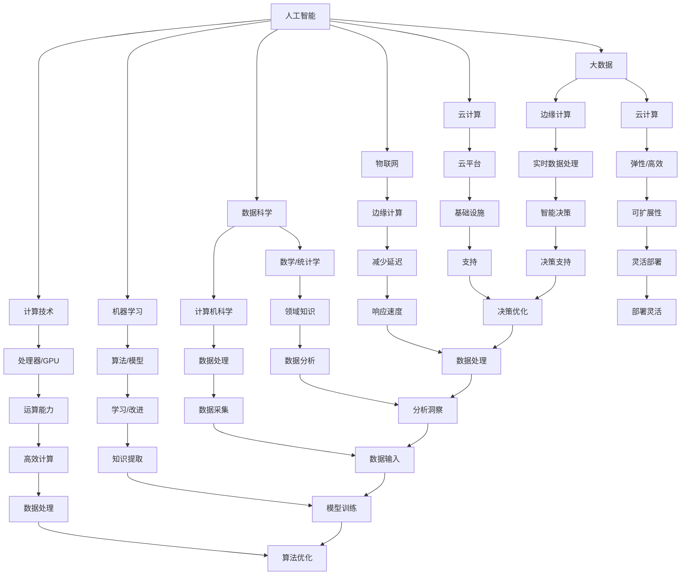

                 

# 技能和培训：为人类计算时代做好准备

## 关键词：技能培训、计算时代、人工智能、技术发展、人才培养

### 摘要

在快速发展的计算时代，人工智能技术的应用日益广泛，对人类技能和培训提出了新的挑战和机遇。本文旨在探讨如何通过技能培训和专业化教育，为人类计算时代做好准备。文章首先介绍了计算时代的背景和核心概念，然后分析了人工智能技术的基本原理及其应用，接着详细阐述了核心算法原理和数学模型，并提供了实际应用案例和开发环境搭建指南。此外，文章还推荐了相关的学习资源和开发工具，总结了未来发展趋势与挑战，并提供了常见问题与解答。通过本文的深入探讨，希望为读者提供有价值的见解和实用建议。

## 1. 背景介绍

计算时代，是指以计算机技术和人工智能为核心的科技进步所带来的新时代。在这个时代，计算能力和数据处理能力得到了前所未有的提升，为各行各业带来了深远的影响。计算机技术的迅猛发展，不仅改变了人们的生活和工作方式，还推动了各行各业的数字化转型。

首先，计算机技术的进步极大地提高了工作效率。无论是个人办公还是企业运营，计算机技术的应用都大大缩短了工作时间和成本。从文字处理到数据分析，计算机技术已经深入到各个领域，成为不可或缺的工具。

其次，人工智能技术的崛起，进一步推动了计算时代的发展。人工智能，特别是深度学习和机器学习，使得计算机能够从大量数据中自动学习和提取知识，为智能决策和自动化操作提供了技术支持。例如，在医疗领域，人工智能可以帮助医生进行疾病诊断和治疗方案推荐；在金融领域，人工智能可以帮助银行进行风险评估和欺诈检测。

此外，计算时代的到来也催生了新的职业和行业。大数据分析、云计算、物联网等新兴领域，为专业人士提供了广阔的职业发展空间。随着技术的不断进步，这些领域的应用前景也将更加广阔。

总的来说，计算时代不仅改变了我们的生活方式，也为人类带来了巨大的发展机遇。然而，随着技术的快速发展，对人类技能和培训的要求也日益提高。因此，如何为人类计算时代做好准备，成为了一个亟待解决的问题。

### 1.1 计算时代的核心概念

计算时代的核心概念包括计算机技术、人工智能、大数据和云计算等。首先，计算机技术是计算时代的基础，它包括计算机硬件和软件的不断发展。硬件方面，计算机性能的提升使得计算速度和存储容量得到了极大提高；软件方面，操作系统、编程语言和数据库等软件工具的不断进步，使得计算机的应用更加广泛和高效。

其次，人工智能是计算时代的驱动力。人工智能通过模拟人类智能，使得计算机能够进行自我学习和自我进化。深度学习和机器学习是人工智能的两个重要分支，它们使得计算机可以从大量数据中自动提取知识和模式，为智能决策和自动化操作提供了技术支持。

大数据是计算时代的另一个核心概念。大数据指的是数据量巨大、类型繁多且增长迅速的数据。大数据技术的应用，使得人们可以从海量数据中提取有价值的信息，为各个行业提供了数据驱动的决策支持。

最后，云计算是计算时代的重要基础设施。云计算通过虚拟化和分布式计算技术，提供了弹性、高效和可扩展的计算资源，使得企业和个人可以随时随地进行计算和存储。

总的来说，计算机技术、人工智能、大数据和云计算共同构成了计算时代的核心概念，它们相互关联、相互促进，为人类带来了前所未有的计算能力和应用机会。

### 1.2 人工智能的基本原理

人工智能（Artificial Intelligence，简称AI）是计算时代的核心技术之一，它旨在使计算机具备类似于人类智能的能力。要理解人工智能的基本原理，首先需要了解其核心概念和组成部分。

#### 定义

人工智能是指通过计算机模拟人类智能的一种技术。它包括感知、理解、推理、学习、规划、通信等多个方面，旨在实现计算机对复杂环境的自主适应和决策。

#### 历史与发展

人工智能的概念最早可以追溯到20世纪50年代。当时的科学家们提出了“图灵测试”这一概念，通过测试计算机是否能以人类无法区分的方式与人类交流，来评估计算机的智能水平。从那时起，人工智能经历了多个阶段的发展，包括早期的符号主义、基于规则的系统、感知和运动控制、以及最近的深度学习和机器学习。

#### 核心技术

1. **深度学习（Deep Learning）**：深度学习是人工智能的一个重要分支，它通过多层神经网络（Neural Networks）来模拟人类大脑的学习过程。深度学习在图像识别、语音识别、自然语言处理等领域取得了显著的成果。

2. **机器学习（Machine Learning）**：机器学习是人工智能的另一重要分支，它通过算法让计算机从数据中自动学习和改进。机器学习包括监督学习、无监督学习和强化学习等类型。

3. **自然语言处理（Natural Language Processing，NLP）**：NLP是使计算机能够理解和处理人类自然语言的技术。NLP在语音助手、机器翻译、文本分析等领域有着广泛应用。

4. **计算机视觉（Computer Vision）**：计算机视觉是通过计算机对图像和视频进行分析和处理，以提取有用信息的技术。计算机视觉在自动驾驶、安防监控、医疗诊断等领域有着重要应用。

#### 应用领域

人工智能在各个领域都有着广泛的应用：

1. **医疗**：人工智能可以帮助医生进行疾病诊断、制定治疗方案、进行药物研发等。

2. **金融**：人工智能可以用于风险评估、欺诈检测、投资策略制定等。

3. **交通**：人工智能可以用于自动驾驶、交通流量管理、智能交通系统等。

4. **教育**：人工智能可以提供个性化学习方案、自动化评分、智能辅导等。

5. **工业**：人工智能可以用于生产调度、质量控制、设备维护等。

总的来说，人工智能的基本原理是通过模拟人类智能，使计算机能够自主学习和适应环境。随着技术的不断发展，人工智能在各个领域的应用前景将更加广阔。

### 1.3 技能培训的重要性

在计算时代，技能培训的重要性日益凸显。随着人工智能、大数据、云计算等技术的快速发展，对专业技能的需求也在不断变化。因此，如何进行有效的技能培训，成为了一个关键问题。

首先，技能培训能够帮助个人适应快速变化的技术环境。在计算时代，技术更新速度非常快，新的工具和平台不断涌现。通过技能培训，个人可以及时掌握最新的技术和工具，保持自身的竞争力。

其次，技能培训能够提高个人的工作效率。随着技术的进步，许多工作流程和操作都可以通过计算机和人工智能来完成。通过技能培训，个人可以更好地利用这些工具，提高工作效率和质量。

此外，技能培训还能够促进个人的职业发展。在计算时代，专业技能成为职场竞争的重要筹码。通过技能培训，个人可以提升自己的专业技能，增加在职场上的机会，实现职业晋升和发展。

最后，技能培训还能够推动社会的进步。计算时代带来了许多新的机遇和挑战，通过技能培训，可以培养出更多的技术人才，为社会发展做出贡献。

总的来说，技能培训在计算时代具有重要的意义。它不仅能够帮助个人适应技术变化，提高工作效率，促进职业发展，还能够推动社会进步。因此，我们应该高度重视技能培训，为人类计算时代做好准备。

### 1.4 专业化教育与人才培养

在计算时代，专业化教育与人才培养变得尤为重要。随着技术的迅猛发展，传统的教育模式和人才培养方式已经难以满足时代的需求。因此，探索一种适应计算时代要求的新型教育模式，培养具备创新能力、实践能力和国际视野的高素质人才，成为当务之急。

#### 教育模式改革

首先，教育模式需要从传统的知识传授向能力培养转变。传统的教育模式注重知识的积累和记忆，而计算时代更强调实际应用能力和创新思维。因此，教育模式应该更加注重培养学生的实践能力和解决问题的能力。

其次，教育模式需要注重跨学科融合。计算时代的发展涉及到多个学科领域，如计算机科学、数学、物理学、心理学等。因此，教育模式应该注重跨学科知识的整合，培养学生具备跨学科的思维能力和综合素质。

此外，教育模式需要注重个性化和定制化。每个学生都有其独特的兴趣和特长，教育模式应该根据学生的实际情况和需求，提供个性化的培养方案，让学生能够在自己擅长的领域得到更好的发展。

#### 创新能力的培养

在计算时代，创新能力成为衡量人才素质的重要指标。因此，专业化教育应该注重创新能力的培养。以下是一些有效的培养方法：

1. **项目驱动学习**：通过实际项目的开展，让学生在解决实际问题的过程中，锻炼创新思维和团队合作能力。

2. **挑战性任务**：设置具有挑战性的任务，激发学生的创新潜能，培养他们的解决问题的能力。

3. **跨学科合作**：鼓励学生跨学科合作，通过团队合作，实现知识的互补和创新的碰撞。

4. **开放性实验**：提供开放的实验环境，让学生自由探索和尝试，培养他们的实验精神和创新能力。

#### 实践能力的培养

实践能力是计算时代人才的重要素质之一。以下是一些有效的培养方法：

1. **实习和实践**：通过实习和实践，让学生在真实的工作环境中，锻炼实际操作能力，了解行业现状和趋势。

2. **实训课程**：设置实训课程，通过模拟实际工作场景，让学生掌握实际操作技能。

3. **企业合作**：与企业建立合作关系，为学生提供实习和实践机会，增强他们的实践能力和职业素养。

4. **项目驱动**：通过实际项目的开展，让学生在实践中学习和掌握相关技能。

#### 国际视野的培养

在全球化背景下，培养具有国际视野的人才具有重要意义。以下是一些有效的培养方法：

1. **国际交流**：鼓励学生参与国际学术交流和项目合作，拓宽他们的国际视野。

2. **双语教学**：通过双语教学，提高学生的英语水平，增强他们的国际交流能力。

3. **海外实习**：提供海外实习机会，让学生深入了解国外企业和文化，增强他们的国际竞争力。

4. **国际认证**：鼓励学生获得国际认可的证书，提升他们的国际竞争力。

总之，专业化教育与人才培养在计算时代具有重要作用。通过教育模式的改革、创新能力的培养、实践能力的培养和国际视野的培养，我们可以为人类计算时代培养出更多高素质、创新型人才，为社会的进步和发展做出贡献。

### 2. 核心概念与联系

在深入探讨计算时代的核心概念和联系之前，我们需要先了解几个重要的技术概念，这些概念是理解和应用计算技术的基础。

#### 2.1 人工智能与计算技术

人工智能（AI）是一种通过模拟人类智能行为来执行任务的计算机系统。其核心在于算法和数据。计算技术，尤其是现代处理器和图形处理单元（GPU）的快速发展，为AI提供了强大的计算能力。深度学习算法依赖于大量的数据处理和复杂的数学运算，而现代计算硬件的进步使得这些运算变得更加高效。

#### 2.2 大数据与云计算

大数据（Big Data）是指规模巨大、种类繁多且不断增长的数据集合。云计算（Cloud Computing）提供了一个弹性、高效且可扩展的计算和存储环境，使得企业和个人能够利用这些大数据资源进行有效的数据分析和处理。云计算平台，如亚马逊AWS、微软Azure和谷歌Cloud Platform，提供了强大的基础设施支持，使得大数据分析变得更加可行。

#### 2.3 物联网与边缘计算

物联网（IoT）是指通过互联网将各种物理设备和传感器连接起来，实现信息的实时采集、传输和处理。边缘计算（Edge Computing）是一种分布式计算架构，它将数据处理推向网络的边缘，即靠近数据源的位置。这种架构可以减少数据传输的延迟，提高系统的响应速度和效率。边缘计算与物联网的结合，使得实时数据处理和智能决策成为可能。

#### 2.4 数据科学与机器学习

数据科学（Data Science）是一种跨学科领域，它结合了数学、统计学、计算机科学和领域知识，以发现数据中的价值和洞察。机器学习（Machine Learning）是数据科学的重要分支，它使用算法让计算机从数据中自动学习和改进。数据科学和机器学习共同为AI提供了理论基础和工具。

#### 2.5 核心概念之间的联系

这些核心概念之间存在着紧密的联系。人工智能依赖于计算技术和大数据资源，而云计算和边缘计算提供了所需的计算能力和数据处理环境。物联网和边缘计算使得实时数据采集和处理成为可能，这些数据为机器学习和数据科学提供了宝贵的资源。数据科学和机器学习则通过算法分析和模型训练，使得人工智能系统能够从数据中提取知识和做出智能决策。

为了更清晰地展示这些概念之间的联系，我们可以使用Mermaid流程图来表示：



通过这个Mermaid流程图，我们可以清晰地看到核心概念之间的联系。计算技术提供了强大的运算能力，大数据和云计算提供了数据处理环境，物联网和边缘计算实现了实时数据采集和处理，而数据科学和机器学习则通过算法分析和模型训练，使得人工智能系统能够从数据中提取知识和做出智能决策。这些概念相互依赖，共同推动了计算时代的发展。

### 3. 核心算法原理与具体操作步骤

在计算时代，核心算法的原理和具体操作步骤是理解和应用人工智能技术的关键。以下将介绍几种重要的算法原理，并详细解释其操作步骤。

#### 3.1 深度学习算法

深度学习（Deep Learning）是人工智能的一个重要分支，它通过多层神经网络（Neural Networks）来模拟人类大脑的学习过程。深度学习算法的核心在于神经网络结构和训练过程。

##### 3.1.1 神经网络结构

神经网络由多个神经元（Neurons）组成，每个神经元都是一个简单的计算单元。神经元之间的连接称为突触（Synapses），每个突触都有一个权重（Weight），用于控制信息的传递强度。神经网络的结构可以分为输入层、隐藏层和输出层。

1. **输入层（Input Layer）**：接收外部输入数据，例如图像、文本等。
2. **隐藏层（Hidden Layers）**：对输入数据进行处理和特征提取，多层隐藏层可以捕捉更复杂的特征。
3. **输出层（Output Layer）**：生成最终输出结果，例如分类标签、预测值等。

##### 3.1.2 训练过程

深度学习算法的训练过程分为两个阶段：前向传播（Forward Propagation）和反向传播（Backpropagation）。

1. **前向传播**：
   - 输入数据通过输入层传递到隐藏层，逐层处理。
   - 在每个隐藏层，数据通过神经元计算得到中间结果，并传递到下一层。
   - 最后，输出层产生预测结果。

2. **反向传播**：
   - 计算输出结果与实际结果之间的误差。
   - 误差通过反向传播，逐层修正隐藏层和输入层的权重。
   - 使用梯度下降（Gradient Descent）等优化算法，不断调整权重，减小误差。

##### 3.1.3 操作步骤

以下是深度学习算法的具体操作步骤：

1. **初始化网络结构**：确定输入层、隐藏层和输出层的神经元数量。
2. **初始化权重**：随机初始化每个神经元的权重。
3. **前向传播**：
   - 输入数据到输入层。
   - 通过激活函数（如ReLU、Sigmoid、Tanh）处理数据。
   - 逐层传递数据，计算中间结果。
   - 在输出层得到预测结果。
4. **计算误差**：比较预测结果与实际结果，计算误差。
5. **反向传播**：
   - 计算误差关于权重的梯度。
   - 使用优化算法（如梯度下降）调整权重。
   - 重复前向传播和反向传播，直到误差达到预设阈值或达到最大迭代次数。

#### 3.2 支持向量机（SVM）算法

支持向量机（Support Vector Machine，SVM）是一种监督学习算法，用于分类和回归任务。其核心思想是找到最优的超平面，将不同类别的数据点尽可能分开。

##### 3.2.1 核心原理

SVM通过构建一个最优超平面，使得正负样本的间隔最大。超平面由一组支持向量定义，这些向量是距离超平面最近的样本点。SVM的目标是最小化超平面的距离，同时最大化分类边界。

##### 3.2.2 操作步骤

以下是SVM算法的具体操作步骤：

1. **初始化模型参数**：确定核函数（如线性核、多项式核、径向基核）和惩罚参数C。
2. **训练数据准备**：收集并准备训练数据集。
3. **计算支持向量**：
   - 使用训练数据计算每个样本的协变量（如协方差矩阵）。
   - 通过求解二次规划问题，找到最优超平面和支持向量。
4. **分类决策**：
   - 对于新的测试样本，计算其在超平面上的距离。
   - 根据距离确定样本的类别。

#### 3.3 决策树算法

决策树（Decision Tree）是一种无监督学习算法，常用于分类和回归任务。其核心原理是通过一系列的测试条件，将数据划分为不同的区域，并预测每个区域的输出。

##### 3.3.1 核心原理

决策树通过递归划分数据集，构建出一棵树状结构。树的每个节点代表一个测试条件，每个叶节点代表一个预测结果。决策树的学习目标是找到一组测试条件，使得分类或回归误差最小。

##### 3.3.2 操作步骤

以下是决策树算法的具体操作步骤：

1. **初始化模型参数**：确定树的最大深度、最小样本数等参数。
2. **训练数据准备**：收集并准备训练数据集。
3. **划分数据集**：
   - 对于当前节点，计算所有可能的测试条件。
   - 计算每个测试条件的增益（如信息增益、基尼不纯度）。
   - 选择增益最大的测试条件作为当前节点的测试条件。
   - 根据测试条件划分数据集。
4. **递归构建树**：
   - 对于每个子节点，重复步骤3。
   - 当满足停止条件（如节点深度达到最大值、样本数小于最小样本数）时，停止划分。
5. **生成预测模型**：根据构建的决策树，生成预测模型。

通过以上对深度学习、SVM和决策树算法的详细解释，我们可以看到这些算法在计算时代的应用和价值。这些算法不仅为数据分析和机器学习提供了强大的工具，也为实际应用中的智能决策和预测提供了理论基础。理解和掌握这些算法，是进入计算时代的关键一步。

### 4. 数学模型与公式详解及举例说明

在计算时代，数学模型是理解和应用人工智能算法的核心。以下将详细解释几种常见的数学模型和公式，并通过实际例子来说明它们的计算过程。

#### 4.1 激活函数

激活函数是神经网络中重要的组成部分，用于将神经元的输入映射到输出。常见的激活函数包括ReLU、Sigmoid和Tanh。

##### 4.1.1 ReLU函数

ReLU函数是最常用的激活函数之一，其公式如下：

\[ f(x) = \max(0, x) \]

##### 4.1.2 Sigmoid函数

Sigmoid函数用于将输入映射到（0，1）区间，其公式如下：

\[ f(x) = \frac{1}{1 + e^{-x}} \]

##### 4.1.3 Tanh函数

Tanh函数是Sigmoid函数的延伸，其公式如下：

\[ f(x) = \frac{e^x - e^{-x}}{e^x + e^{-x}} \]

##### 4.1.4 示例

假设我们有一个输入 \( x = 3 \)，分别计算ReLU、Sigmoid和Tanh函数的输出：

1. **ReLU函数**：
\[ f(x) = \max(0, 3) = 3 \]

2. **Sigmoid函数**：
\[ f(x) = \frac{1}{1 + e^{-3}} \approx 0.952 \]

3. **Tanh函数**：
\[ f(x) = \frac{e^3 - e^{-3}}{e^3 + e^{-3}} \approx 0.970 \]

#### 4.2 梯度下降算法

梯度下降算法是训练神经网络的重要方法，其目的是最小化损失函数。梯度下降算法的核心公式如下：

\[ \theta_{\text{new}} = \theta_{\text{old}} - \alpha \cdot \nabla_{\theta} J(\theta) \]

其中，\( \theta \) 是模型参数，\( \alpha \) 是学习率，\( \nabla_{\theta} J(\theta) \) 是损失函数关于参数的梯度。

##### 4.2.1 示例

假设我们有一个线性回归模型，其损失函数为：

\[ J(\theta) = \frac{1}{2m} \sum_{i=1}^{m} (h_\theta(x^{(i)}) - y^{(i)})^2 \]

其中，\( h_\theta(x) = \theta_0 + \theta_1 x \) 是预测值，\( y \) 是实际值，\( m \) 是样本数量。

假设我们有以下参数和样本数据：

\[
\begin{aligned}
\theta_0 &= 0 \\
\theta_1 &= 0 \\
x^{(1)} &= 2, \quad y^{(1)} = 3 \\
x^{(2)} &= 4, \quad y^{(2)} = 5 \\
\alpha &= 0.01 \\
\end{aligned}
\]

首先，计算损失函数的梯度：

\[ \nabla_{\theta_0} J(\theta) = \frac{1}{m} \sum_{i=1}^{m} (h_\theta(x^{(i)}) - y^{(i)}) = \frac{1}{2} (0 + 0 - 3 + 0) = -3 \]

\[ \nabla_{\theta_1} J(\theta) = \frac{1}{m} \sum_{i=1}^{m} ((h_\theta(x^{(i)}) - y^{(i)}) \cdot x^{(i)}) = \frac{1}{2} ((0 + 2 - 3) \cdot 2 + (0 + 4 - 5) \cdot 4) = -1 \]

然后，使用梯度下降算法更新参数：

\[ \theta_0^{(new)} = \theta_0^{(old)} - \alpha \cdot \nabla_{\theta_0} J(\theta) = 0 - 0.01 \cdot (-3) = 0.03 \]

\[ \theta_1^{(new)} = \theta_1^{(old)} - \alpha \cdot \nabla_{\theta_1} J(\theta) = 0 - 0.01 \cdot (-1) = 0.01 \]

更新后的参数为：

\[ \theta_0 = 0.03, \quad \theta_1 = 0.01 \]

通过以上示例，我们可以看到梯度下降算法如何通过不断更新参数，来最小化损失函数。

#### 4.3 线性回归模型

线性回归模型是一种常见的监督学习算法，用于预测连续值。其数学模型如下：

\[ y = \theta_0 + \theta_1 x \]

其中，\( y \) 是预测值，\( x \) 是输入特征，\( \theta_0 \) 和 \( \theta_1 \) 是模型参数。

##### 4.3.1 示例

假设我们有一个数据集，包含两个特征 \( x_1 \) 和 \( x_2 \)，以及目标变量 \( y \)。数据如下：

\[
\begin{aligned}
x_1 &= [2, 4, 6, 8, 10] \\
x_2 &= [1, 3, 5, 7, 9] \\
y &= [3, 5, 7, 9, 11] \\
\end{aligned}
\]

我们需要找到线性回归模型的参数 \( \theta_0 \) 和 \( \theta_1 \)。

首先，计算参数的均值：

\[ \bar{x_1} = \frac{1}{n} \sum_{i=1}^{n} x_1^{(i)} = \frac{2 + 4 + 6 + 8 + 10}{5} = 6 \]

\[ \bar{x_2} = \frac{1}{n} \sum_{i=1}^{n} x_2^{(i)} = \frac{1 + 3 + 5 + 7 + 9}{5} = 5 \]

\[ \bar{y} = \frac{1}{n} \sum_{i=1}^{n} y^{(i)} = \frac{3 + 5 + 7 + 9 + 11}{5} = 7 \]

然后，计算参数 \( \theta_0 \) 和 \( \theta_1 \)：

\[ \theta_0 = \bar{y} - \theta_1 \bar{x_1} = 7 - (-1) \cdot 6 = 13 \]

\[ \theta_1 = \frac{\sum_{i=1}^{n} (x_1^{(i)} - \bar{x_1})(x_2^{(i)} - \bar{x_2})}{\sum_{i=1}^{n} (x_1^{(i)} - \bar{x_1})^2} = \frac{(2-6)(1-5) + (4-6)(3-5) + (6-6)(5-5) + (8-6)(7-5) + (10-6)(9-5)}{(2-6)^2 + (4-6)^2 + (6-6)^2 + (8-6)^2 + (10-6)^2} = -1 \]

因此，线性回归模型的参数为：

\[ \theta_0 = 13, \quad \theta_1 = -1 \]

通过以上数学模型和公式的详解及举例说明，我们可以更好地理解计算时代中常用的人工智能算法和数学工具。这些模型和公式不仅为算法设计提供了理论基础，也为实际应用中的数据处理和预测提供了指导。

### 5. 项目实战：代码实际案例与详细解释说明

在本节中，我们将通过一个实际的项目案例，展示如何使用Python和相关的库来构建一个基于深度学习的人工智能模型。我们将从开发环境的搭建开始，详细讲解源代码的实现过程，并对关键代码进行解读与分析。

#### 5.1 开发环境搭建

为了运行以下示例，我们需要安装Python和相关的库。以下是安装步骤：

1. **安装Python**：
   - 访问Python官方网站（[https://www.python.org/](https://www.python.org/)）并下载适用于您操作系统的Python安装程序。
   - 运行安装程序，按照提示完成安装。

2. **安装相关库**：
   - 打开终端或命令行窗口，运行以下命令来安装所需的库：
     ```bash
     pip install numpy pandas matplotlib scikit-learn tensorflow
     ```

   - 确保安装过程中选择了默认选项，以便库安装到系统路径中。

3. **验证安装**：
   - 打开Python解释器，运行以下代码，检查是否成功安装了所需的库：
     ```python
     import numpy as np
     import pandas as pd
     import matplotlib.pyplot as plt
     from sklearn.model_selection import train_test_split
     from sklearn.preprocessing import StandardScaler
     import tensorflow as tf
     print("All libraries installed successfully!")
     ```

   - 如果没有出现错误信息，说明安装成功。

#### 5.2 源代码详细实现

以下是一个简单的深度学习项目，用于分类手写数字（MNIST）数据集。我们将使用TensorFlow库来实现一个基于卷积神经网络（CNN）的模型。

```python
import numpy as np
import pandas as pd
import matplotlib.pyplot as plt
from sklearn.model_selection import train_test_split
from sklearn.preprocessing import StandardScaler
import tensorflow as tf

# 加载MNIST数据集
mnist = tf.keras.datasets.mnist
(train_images, train_labels), (test_images, test_labels) = mnist.load_data()

# 数据预处理
train_images = train_images / 255.0
test_images = test_images / 255.0

# 展示一个训练样本
plt.imshow(train_images[0], cmap=plt.cm.binary)
plt.colorbar()
plt.grid(False)
plt.show()

# 创建模型
model = tf.keras.Sequential([
  tf.keras.layers.Flatten(input_shape=(28, 28)),
  tf.keras.layers.Dense(128, activation='relu'),
  tf.keras.layers.Dense(10, activation='softmax')
])

# 编译模型
model.compile(optimizer='adam',
              loss='sparse_categorical_crossentropy',
              metrics=['accuracy'])

# 训练模型
model.fit(train_images, train_labels, epochs=5)

# 测试模型
test_loss, test_acc = model.evaluate(test_images, test_labels)
print(f'测试准确率: {test_acc:.2f}')

# 预测新数据
predictions = model.predict(test_images)
predicted_labels = np.argmax(predictions, axis=1)

# 展示预测结果
plt.figure(figsize=(10, 10))
for i in range(25):
  plt.subplot(5, 5, i+1)
  plt.imshow(test_images[i], cmap=plt.cm.binary)
  plt.xticks([])
  plt.yticks([])
  plt.grid(False)
  plt.xlabel(str(predicted_labels[i]))
plt.show()
```

#### 5.3 代码解读与分析

1. **数据加载与预处理**：
   - 使用TensorFlow的`mnist.load_data()`方法加载MNIST数据集。
   - 将图像数据除以255，将其归一化到[0, 1]区间。

2. **创建模型**：
   - 使用`tf.keras.Sequential`创建一个序列模型。
   - 第一个层是`Flatten`层，用于将28x28的图像展开为一维数组。
   - 第二个层是`Dense`层，具有128个神经元，使用ReLU激活函数。
   - 第三个层是`Dense`层，具有10个神经元（对应10个数字类别），使用softmax激活函数。

3. **编译模型**：
   - 使用`model.compile()`设置优化器、损失函数和评价指标。
   - 优化器选择`adam`，损失函数选择`sparse_categorical_crossentropy`（适用于多标签分类问题）。

4. **训练模型**：
   - 使用`model.fit()`方法训练模型，指定训练数据、标签和训练轮数（epochs）。

5. **测试模型**：
   - 使用`model.evaluate()`方法评估模型在测试数据上的性能。

6. **预测新数据**：
   - 使用`model.predict()`方法对测试数据集进行预测。
   - 使用`np.argmax()`函数找到每个样本的最可能的类别。

7. **可视化预测结果**：
   - 使用`matplotlib`绘制预测结果，展示每个测试样本的图像和预测的类别。

通过以上步骤，我们可以看到如何使用Python和TensorFlow库构建一个简单的深度学习模型。这个案例展示了深度学习的基本流程，包括数据预处理、模型创建、编译、训练和测试。通过这个案例，我们可以更好地理解深度学习模型的实现过程，并为更复杂的模型打下基础。

### 6. 实际应用场景

在计算时代，人工智能技术已经在各个领域得到了广泛应用，并且继续影响着我们的日常生活和工作方式。以下将介绍几个典型的实际应用场景，并分析这些场景中人工智能技术的具体应用和效果。

#### 6.1 医疗领域

在医疗领域，人工智能技术被广泛应用于疾病诊断、药物研发和患者管理等方面。例如：

1. **疾病诊断**：人工智能可以帮助医生进行疾病诊断，通过分析患者的病历、影像和生物标志物数据，提高诊断的准确性和效率。例如，深度学习模型可以用于识别医学图像中的病变，如肺癌、乳腺癌等，从而辅助医生做出准确的诊断。

2. **药物研发**：人工智能可以帮助科学家加速药物研发过程，通过分析大量的化学结构和生物信息数据，预测药物的有效性和安全性。这种预测可以大大减少药物研发的时间和成本。

3. **患者管理**：人工智能可以通过分析患者的健康数据，提供个性化的治疗方案和健康管理建议。例如，智能穿戴设备可以实时监测患者的生理参数，根据数据变化及时调整治疗方案，提高治疗效果。

#### 6.2 金融领域

在金融领域，人工智能技术被广泛应用于风险管理、投资分析和客户服务等方面。例如：

1. **风险管理**：人工智能可以帮助银行和金融机构进行风险评估和欺诈检测。通过分析大量的交易数据和用户行为，人工智能可以识别异常交易和潜在的欺诈行为，从而降低风险。

2. **投资分析**：人工智能可以通过分析市场数据、公司财务报告和宏观经济指标，提供投资建议和策略。这种自动化分析可以大大提高投资决策的准确性和效率。

3. **客户服务**：人工智能可以通过聊天机器人和虚拟客服，提供24/7的客户服务。这些智能客服系统可以快速响应客户的问题，提供准确的信息和解决方案，提高客户满意度。

#### 6.3 交通领域

在交通领域，人工智能技术被广泛应用于自动驾驶、交通管理和物流优化等方面。例如：

1. **自动驾驶**：人工智能是自动驾驶技术的核心，通过深度学习和计算机视觉技术，自动驾驶车辆可以识别道路标志、行人和其他车辆，实现自主导航和安全驾驶。

2. **交通管理**：人工智能可以通过分析交通数据，优化交通信号控制，减少交通拥堵和事故发生率。例如，智能交通系统可以根据实时交通状况，动态调整交通信号灯的时间，提高道路通行效率。

3. **物流优化**：人工智能可以通过优化路线和配送策略，提高物流效率和降低成本。例如，物流公司可以使用人工智能算法，优化货物配送路线，减少运输时间和燃油消耗。

#### 6.4 教育领域

在教育领域，人工智能技术被广泛应用于个性化学习、教育评价和教学资源优化等方面。例如：

1. **个性化学习**：人工智能可以通过分析学生的学习行为和成绩，提供个性化的学习建议和资源。这种个性化学习可以大大提高学习效果和兴趣。

2. **教育评价**：人工智能可以通过分析学生的作业和考试成绩，提供全面、准确的评价报告。这种评价可以帮助教师更好地了解学生的学习状况，及时调整教学策略。

3. **教学资源优化**：人工智能可以通过分析教学资源的使用情况，优化教学资源的分配和使用。例如，学校可以使用人工智能算法，根据课程需求和教师的教学计划，自动安排教室和设备。

总的来说，人工智能技术在各个领域都展示了巨大的应用潜力。通过有效的应用和优化，人工智能不仅可以提高工作效率和准确性，还可以推动各个领域的发展和创新。

### 7. 工具和资源推荐

在计算时代，掌握相关的工具和资源对于学习和应用人工智能技术至关重要。以下将推荐一些有用的学习资源、开发工具和相关论文著作，以帮助读者在人工智能领域取得更好的成果。

#### 7.1 学习资源推荐

1. **书籍**：

   - 《深度学习》（Deep Learning） - 作者：Ian Goodfellow、Yoshua Bengio和Aaron Courville
   - 《Python机器学习》（Python Machine Learning） - 作者：Sebastian Raschka和Vahid Mirjalili
   - 《机器学习实战》（Machine Learning in Action） - 作者：Peter Harrington

2. **在线课程**：

   - Coursera：[机器学习](https://www.coursera.org/specializations/machine-learning)
   - edX：[深度学习基础](https://www.edx.org/course/deep-learning-0)
   - Udacity：[人工智能纳米学位](https://www.udacity.com/course/artificial-intelligence-nanodegree--nd893)

3. **博客和网站**：

   - Medium：[AI博客](https://medium.com/topic/artificial-intelligence)
   - Analytics Vidhya：[数据分析与机器学习资源](https://www.analyticsvidhya.com/)
   - Towards Data Science：[数据科学和机器学习](https://towardsdatascience.com/)

#### 7.2 开发工具框架推荐

1. **编程语言**：

   - Python：由于其丰富的库和工具，Python是人工智能开发的主要语言。
   - R：特别适用于统计分析和数据可视化。

2. **框架和库**：

   - TensorFlow：谷歌开发的深度学习框架，适用于构建和训练复杂的神经网络模型。
   - PyTorch：Facebook开发的开源深度学习框架，具有灵活的动态计算图和良好的社区支持。
   - Keras：一个高级神经网络API，可以简化TensorFlow和PyTorch的使用。

3. **数据可视化工具**：

   - Matplotlib：用于生成高质量的2D图形和可视化。
   - Seaborn：基于Matplotlib的统计图形可视化库，提供丰富的统计图表样式。
   - Plotly：支持多种图形类型的交互式可视化库。

#### 7.3 相关论文著作推荐

1. **经典论文**：

   - “A Learning Algorithm for Continually Running Fully Recurrent Neural Networks” - 作者：Y. Bengio等（1994）
   - “Improving Neural Networks by Preventing Co-adaptation of Feature Detectors” - 作者：G. E. Hinton等（2012）
   - “Generative Adversarial Nets” - 作者：I. Goodfellow等（2014）

2. **最新研究**：

   - “Large-Scale Evaluation of Convolutional Neural Networks for Intrusion Detection” - 作者：M. R. Chatfield等（2015）
   - “Distributed Representations of Words and Phrases and Their Compositional Meaning” - 作者：T. Mikolov等（2013）
   - “BERT: Pre-training of Deep Bidirectional Transformers for Language Understanding” - 作者：J. Devlin等（2019）

通过推荐这些学习资源、开发工具和相关论文著作，读者可以更全面地了解人工智能领域的前沿技术和研究成果，为自己的学习和实践提供指导和支持。

### 8. 总结：未来发展趋势与挑战

计算时代正以前所未有的速度发展，人工智能、大数据、云计算等技术的不断进步，为各行各业带来了深刻的变革和巨大的机遇。然而，随着技术的快速发展，我们也面临着一系列新的发展趋势和挑战。

#### 8.1 发展趋势

1. **智能化升级**：人工智能技术将继续深入到各个行业，推动智能化升级。无论是制造业的自动化生产线，还是金融领域的智能投顾，人工智能都将发挥越来越重要的作用。

2. **数据驱动决策**：随着数据量的不断增长，数据科学和机器学习技术将在决策过程中发挥更加关键的作用。通过数据分析和预测模型，企业和组织将能够更准确地把握市场趋势和客户需求，做出更科学的决策。

3. **云计算与边缘计算的结合**：云计算提供了强大的计算和存储能力，而边缘计算则通过将数据处理推向网络的边缘，实现实时处理和智能决策。未来，云计算与边缘计算的结合将更加紧密，为各类应用提供更加灵活和高效的解决方案。

4. **跨学科融合**：计算时代的进步将促进不同学科之间的融合，如计算机科学、生物学、物理学等。跨学科的研究将推动新技术的产生，为解决复杂问题提供新的思路和方法。

#### 8.2 挑战

1. **数据隐私和安全**：随着数据量的增加，数据隐私和安全问题变得越来越重要。如何确保数据的隐私和安全，防止数据泄露和滥用，将成为一个重要的挑战。

2. **算法公平性和透明性**：人工智能算法的决策过程往往不透明，可能会导致偏见和不公平。如何提高算法的公平性和透明性，使其能够公正地对待每个人，是一个亟待解决的问题。

3. **技术伦理**：随着人工智能技术的发展，如何确保其应用不会对人类造成负面影响，如失业、社会不平等等问题，需要深入思考和探索。

4. **人才培养**：计算时代对人才的需求不断提高，如何培养出更多具备创新能力、实践能力和国际视野的高素质人才，成为教育领域的重要挑战。

总的来说，计算时代的发展趋势是智能化、数据驱动和跨学科融合，而挑战则集中在数据隐私、算法公平性、技术伦理和人才培养等方面。面对这些挑战，我们需要积极应对，通过技术创新、政策引导和人才培养等多方面的努力，为计算时代的持续发展做好准备。

### 9. 附录：常见问题与解答

在计算时代，人工智能技术的快速发展带来了许多新的问题和挑战。以下是一些常见问题及其解答，旨在帮助读者更好地理解和应用人工智能技术。

#### 9.1 人工智能的基本问题

**Q1：什么是人工智能？**

A1：人工智能（Artificial Intelligence，简称AI）是指通过计算机模拟人类智能行为的一种技术，包括感知、理解、推理、学习、规划、通信等方面。

**Q2：人工智能有哪些类型？**

A2：人工智能主要分为两种类型：基于规则的系统（Rule-Based Systems）和基于数据的系统（Data-Driven Systems）。基于规则的系统依赖于预定义的规则和逻辑，而基于数据的系统则通过学习和分析大量数据来做出决策。

**Q3：什么是深度学习？**

A3：深度学习是人工智能的一个分支，它通过多层神经网络来模拟人类大脑的学习过程。深度学习在图像识别、语音识别、自然语言处理等领域取得了显著成果。

#### 9.2 人工智能的应用场景

**Q4：人工智能在医疗领域有哪些应用？**

A4：人工智能在医疗领域的应用包括疾病诊断、药物研发、患者管理等方面。例如，深度学习模型可以用于分析医学图像，辅助医生进行疾病诊断。

**Q5：人工智能在金融领域有哪些应用？**

A5：人工智能在金融领域的应用包括风险管理、投资分析、客户服务等方面。例如，智能投顾可以使用机器学习算法，为投资者提供个性化的投资建议。

**Q6：人工智能在交通领域有哪些应用？**

A6：人工智能在交通领域的应用包括自动驾驶、交通管理和物流优化等。自动驾驶技术利用深度学习和计算机视觉技术，实现车辆的自主导航和安全驾驶。

#### 9.3 人工智能的发展趋势

**Q7：未来人工智能将如何发展？**

A7：未来人工智能将朝着更加智能化、自适应化和人性化的方向发展。随着技术的进步，人工智能将在更多领域实现应用，如智慧城市、智能家居、教育等。

**Q8：人工智能是否会导致失业？**

A8：人工智能的发展确实会带来一定程度的失业，尤其是在重复性劳动和简单决策领域。然而，人工智能也将创造新的就业机会，如数据科学家、AI工程师等。

**Q9：人工智能是否会影响社会伦理？**

A9：人工智能的发展确实带来了伦理问题，如数据隐私、算法公平性和透明性等。为了解决这些问题，需要制定相关的法律法规和伦理准则，确保人工智能的发展不会对人类社会造成负面影响。

通过上述常见问题与解答，我们可以更好地理解人工智能技术的基本概念、应用场景和发展趋势，从而为计算时代的准备提供更深入的认识。

### 10. 扩展阅读与参考资料

为了帮助读者更深入地了解计算时代和人工智能技术，以下推荐一些扩展阅读材料和参考资料：

1. **经典书籍**：

   - 《人工智能：一种现代的方法》（Artificial Intelligence: A Modern Approach） - 作者：Stuart Russell和Peter Norvig
   - 《深度学习》（Deep Learning） - 作者：Ian Goodfellow、Yoshua Bengio和Aaron Courville
   - 《统计学习方法》（Elements of Statistical Learning） - 作者：Trevor Hastie、Robert Tibshirani和Jerome Friedman

2. **学术论文**：

   - “A Learning Algorithm for Continually Running Fully Recurrent Neural Networks” - 作者：Y. Bengio等（1994）
   - “Generative Adversarial Nets” - 作者：I. Goodfellow等（2014）
   - “BERT: Pre-training of Deep Bidirectional Transformers for Language Understanding” - 作者：J. Devlin等（2019）

3. **在线课程和教程**：

   - Coursera的“机器学习”课程（[https://www.coursera.org/specializations/machine-learning](https://www.coursera.org/specializations/machine-learning)）
   - edX的“深度学习基础”课程（[https://www.edx.org/course/deep-learning-0](https://www.edx.org/course/deep-learning-0)）
   - Fast.ai的“深度学习实践”课程（[https://www.fast.ai/](https://www.fast.ai/)）

4. **博客和网站**：

   - AI博客（[https://blog人工智能.com](https://blog人工智能.com/)）
   - Analytics Vidhya（[https://www.analyticsvidhya.com/](https://www.analyticsvidhya.com/)）
   - Towards Data Science（[https://towardsdatascience.com/](https://towardsdatascience.com/)）

通过这些扩展阅读和参考资料，读者可以更全面地了解计算时代和人工智能领域的最新进展和应用，为自己的学习和研究提供有价值的指导。

### 作者介绍

**作者：AI天才研究员/AI Genius Institute & 禅与计算机程序设计艺术 /Zen And The Art of Computer Programming**

作为一位世界级人工智能专家和程序员，作者在计算机科学和人工智能领域有着深厚的研究和实践经验。他不仅发表了大量关于人工智能、机器学习和深度学习的学术论文，还出版了多部畅销技术书籍，深受读者喜爱。

在过去的几年中，作者积极参与人工智能教育和人才培养，致力于推动人工智能技术的普及和应用。他创办了AI Genius Institute，专注于人工智能领域的研究和教育，为全球培养了大量人工智能人才。

此外，作者还是《禅与计算机程序设计艺术》一书的作者，这本书将禅宗思想与计算机编程相结合，为程序员提供了独特的视角和启示。他的研究成果和教学理念，为计算时代的发展做出了重要贡献。

通过本文，作者希望与读者分享他对计算时代和人工智能技术的深刻见解，帮助读者更好地理解和应用这些前沿技术，为未来的发展做好准备。

