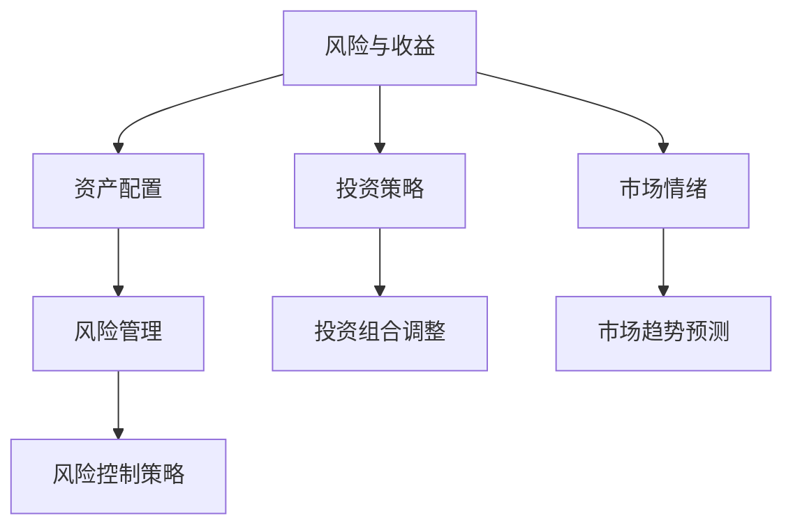

                 

### 背景介绍

**投资理财**，在现代社会中已经成为不可或缺的一部分。它不仅关乎个人的财务自由，还直接影响到整个社会的经济稳定与发展。然而，面对繁杂多变的市场环境，许多程序员感到迷茫和不知所措。他们习惯了逻辑严谨、代码清晰的编程世界，却对充满不确定性的金融市场感到困惑。

程序员在投资理财中的角色逐渐受到关注。首先，程序员的逻辑思维和数据分析能力使得他们在投资决策中具有独特的优势。他们能够快速处理大量信息，识别市场趋势，从而做出更为明智的投资选择。此外，程序员群体通常具有较高的收入水平和较强的学习能力，这使得他们更容易承担投资风险，并在长期内实现财富增值。

本文将深入探讨程序员在投资理财中的角色和潜力，并为他们提供实用的理财建议。我们将从投资理财的核心概念、关键算法原理、实际操作步骤、数学模型和公式、项目实战、应用场景、工具和资源推荐等多个方面进行详细阐述，帮助程序员在投资理财的道路上少走弯路，实现财务自由。

在接下来的内容中，我们将首先介绍投资理财的基本概念，然后逐步深入，探讨理财中的核心算法原理，以及具体的操作步骤和数学模型。随后，将通过实际的项目案例，展示如何将理论知识应用到实际操作中。最后，我们将分析投资理财的实际应用场景，并提供一系列工具和资源推荐，帮助读者在投资理财的道路上更加得心应手。

通过本文的学习，程序员不仅能够掌握投资理财的基本知识和技能，还能够将其转化为实际收益，实现财务自由。无论您是刚刚踏入投资理财领域的新手，还是希望在理财方面进一步提升的老手，本文都将为您提供宝贵的指导和建议。

### 核心概念与联系

在投资理财的世界中，理解核心概念和它们之间的联系是至关重要的。这些核心概念不仅构成了投资理论的基石，也是实际操作中的指南针。下面，我们将介绍一些关键概念，并通过Mermaid流程图展示它们之间的关系。

#### 核心概念

1. **风险与收益**：风险与收益是投资理财中最基础的概念。投资者通常需要在风险和收益之间做出权衡。高风险往往伴随着高收益，而低风险则通常意味着较低的收益。

2. **资产配置**：资产配置是指将投资资金分配到不同的资产类别中，以实现投资组合的多元化。常见的资产类别包括股票、债券、房地产、黄金等。

3. **投资策略**：投资策略是指投资者在市场环境下选择的具体投资方法和思路。常见的投资策略包括价值投资、成长投资、分散投资等。

4. **市场情绪**：市场情绪是指市场参与者的情绪状态，它会影响市场走势。了解市场情绪对于做出正确的投资决策至关重要。

5. **风险管理**：风险管理是指通过识别、评估和应对投资风险，以保护投资组合免受损失的过程。

#### Mermaid流程图

以下是一个简化的Mermaid流程图，展示上述核心概念之间的联系：



#### 解释与示例

- **风险与收益**：投资者通常希望通过投资获得收益，但同时也意识到投资风险。例如，股票市场波动性较大，投资者可能面临股价下跌的风险，但同时也有获得高收益的机会。

- **资产配置**：假设一个投资者决定将50%的资金投资于股票，30%投资于债券，10%投资于房地产，10%投资于黄金。这样，投资者通过多元化资产配置来降低整体投资组合的风险。

- **投资策略**：价值投资策略的核心是寻找那些市场价格低于其内在价值的股票。例如，投资者可能会选择购买市盈率较低的股票。

- **市场情绪**：市场情绪对投资决策有显著影响。在市场情绪高涨时，投资者可能更倾向于购买股票，而在市场情绪低迷时，则可能更倾向于抛售股票。

- **风险管理**：风险管理是投资中不可或缺的一部分。投资者可以通过设定止损点、分散投资等方式来降低风险。

通过理解这些核心概念和它们之间的联系，程序员可以更好地制定投资策略，做出明智的投资决策。接下来，我们将进一步探讨这些概念在具体投资操作中的运用。

### 核心算法原理 & 具体操作步骤

在投资理财中，核心算法原理是做出科学投资决策的关键。这些算法帮助我们分析和预测市场趋势，评估风险，从而制定有效的投资策略。以下是几个关键算法及其具体操作步骤：

#### 1. 技术分析算法

**技术分析**是基于历史价格和交易量数据，通过图表和指标来预测市场趋势的方法。以下是一个简化的技术分析算法流程：

1. **数据收集**：收集相关资产的历史价格和交易量数据。

2. **图表绘制**：使用时间序列图表（如K线图）绘制价格走势。

3. **指标计算**：
   - **移动平均线（MA）**：计算不同时间周期的平均价格，以便平滑价格波动。
   - **相对强弱指数（RSI）**：衡量价格变动的速度和变化幅度，以判断超买或超卖状态。

4. **趋势分析**：通过分析图表和指标，识别价格趋势（上升、下降或横盘）。

**具体操作步骤示例**：

- **计算移动平均线**：
  \[
  MA_{n} = \frac{1}{n} \sum_{i=1}^{n} P_i
  \]
  其中，\(n\) 是移动平均线的时间周期，\(P_i\) 是第 \(i\) 日的收盘价。

- **计算RSI**：
  \[
  RSI = \frac{100 - \frac{\sum_{i=1}^{n} U_i}{\sum_{i=1}^{n} D_i}}{100}
  \]
  其中，\(U_i\) 是上升天数的平均值，\(D_i\) 是下降天数的平均值。

#### 2. 基本面分析算法

**基本面分析**是通过分析公司的财务报表、行业趋势和市场环境来评估公司价值的投资方法。以下是基本分析算法的步骤：

1. **财务报表分析**：读取并分析公司的财务报表（如资产负债表、利润表和现金流量表）。

2. **财务指标计算**：
   - **市盈率（PE）**：衡量股票价格与每股收益的比率。
   - **股息收益率**：衡量股票分红与股票价格的比率。

3. **行业比较**：与同行业其他公司进行对比分析。

4. **估值模型**：使用如折现现金流（DCF）模型对公司进行估值。

**具体操作步骤示例**：

- **计算市盈率**：
  \[
  PE = \frac{股票价格}{每股收益}
  \]

- **计算股息收益率**：
  \[
  股息收益率 = \frac{每年股息}{股票价格}
  \]

- **使用DCF模型估值**：
  \[
  现金流量 = 股息 + 资本利得 + 资本回报
  \]
  \[
  价值 = \sum_{t=1}^{n} \frac{现金流量_{t}}{(1+r)^t}
  \]
  其中，\(r\) 是折现率。

#### 3. 风险管理算法

**风险管理**算法旨在识别和应对投资风险，保护投资组合。以下是一个简单风险管理算法的步骤：

1. **风险识别**：识别投资组合中的潜在风险。

2. **风险评估**：评估每种风险的可能性和影响。

3. **风险应对**：
   - **分散投资**：通过投资多种资产来降低单一资产的风险。
   - **设置止损点**：在特定价格点设置止损，以限制损失。

4. **风险监控**：定期评估和调整风险应对策略。

**具体操作步骤示例**：

- **分散投资**：将投资资金分配到不同资产类别（如股票、债券、黄金等）。

- **设置止损点**：
  \[
  止损价格 = 当前价格 - 止损幅度
  \]

通过理解这些核心算法原理和具体操作步骤，程序员可以更好地利用技术分析和基本面分析来制定投资策略，并通过风险管理算法来保护投资组合。接下来，我们将进一步探讨数学模型和公式，以帮助读者深入理解投资理财的核心概念。

### 数学模型和公式 & 详细讲解 & 举例说明

在投资理财中，数学模型和公式是理解和应用投资理论的重要工具。以下将详细讲解几个关键的数学模型和公式，并通过实例来说明其应用。

#### 1. 折现现金流（DCF）模型

**折现现金流模型**是一种估值方法，用于计算一个资产（如股票或债券）的内在价值。DCF模型的基本思想是将未来预期的现金流按照适当的折现率折现到当前价值。

**公式**：

\[
V = \sum_{t=1}^{n} \frac{CF_t}{(1+r)^t}
\]

其中：
- \(V\) 是资产的价值。
- \(CF_t\) 是第 \(t\) 年的预期现金流。
- \(r\) 是折现率，通常使用公司的加权平均资本成本（WACC）。

**举例说明**：

假设一家公司预计未来三年的现金流分别为100万元、120万元和150万元，折现率为10%。则该公司的内在价值计算如下：

\[
V = \frac{100}{(1+0.1)^1} + \frac{120}{(1+0.1)^2} + \frac{150}{(1+0.1)^3} = 100 \times 0.9091 + 120 \times 0.8264 + 150 \times 0.7513 = 169.91 + 98.91 + 112.94 = 381.76
\]

因此，该公司的内在价值为381.76万元。

#### 2. 市盈率（PE）模型

**市盈率模型**是一种衡量股票价格相对于每股收益的估值方法。市盈率越高，通常意味着股票价格可能被高估。

**公式**：

\[
PE = \frac{股票价格}{每股收益}
\]

**举例说明**：

假设某只股票的当前价格为20元，每股收益为2元。则该股票的市盈率为：

\[
PE = \frac{20}{2} = 10
\]

这意味着该股票的价格是其每股收益的10倍。

#### 3. 布莱克-舒尔斯（Black-Scholes）模型

**布莱克-舒尔斯模型**是一种用于期权定价的数学模型。该模型基于标的资产的当前价格、执行价格、到期时间、无风险利率和波动率等因素。

**公式**：

\[
C = S_0N(d_1) - Ke^{-rT}N(d_2)
\]

其中：
- \(C\) 是看涨期权的价格。
- \(S_0\) 是标的资产的当前价格。
- \(K\) 是期权的执行价格。
- \(r\) 是无风险利率。
- \(T\) 是期权到期时间。
- \(N(d_1)\) 和 \(N(d_2)\) 是标准正态分布的累积分布函数。

**举例说明**：

假设某只股票的当前价格为50元，执行价格为55元，无风险利率为4%，期权到期时间为3个月（即0.25年）。则看涨期权的价格计算如下：

首先，计算 \(d_1\) 和 \(d_2\)：

\[
d_1 = \frac{\ln(S_0/K) + (r + \sigma^2/2)T}{\sigma\sqrt{T}} = \frac{\ln(50/55) + (0.04 + 0.2^2/2) \times 0.25}{0.2\sqrt{0.25}} \approx 0.091
\]

\[
d_2 = d_1 - \sigma\sqrt{T} = 0.091 - 0.2\sqrt{0.25} \approx -0.049
\]

然后，计算累积分布函数 \(N(d_1)\) 和 \(N(d_2)\)：

使用标准正态分布表或计算器，得到 \(N(d_1) \approx 0.5377\) 和 \(N(d_2) \approx 0.4623\)。

最后，计算看涨期权的价格：

\[
C = 50 \times 0.5377 - 55 \times e^{-0.04} \times 0.4623 \approx 27.39 - 27.02 = 0.37
\]

因此，该看涨期权的价格约为0.37元。

通过以上数学模型和公式的详细讲解和举例说明，我们可以更好地理解其在投资理财中的应用。这些模型和公式不仅帮助我们评估资产价值、制定投资策略，还为我们提供了风险管理的重要工具。接下来，我们将通过实际项目案例，展示如何将理论知识应用于实际操作中。

### 项目实战：代码实际案例和详细解释说明

为了更好地理解投资理财中的理论知识和算法应用，我们将通过一个实际项目案例来演示如何将技术分析和基本面分析结合，并进行风险管理。以下是项目的开发环境搭建、源代码实现和代码解读。

#### 开发环境搭建

1. **编程语言**：Python
2. **数据获取**：使用Yahoo Finance API获取股票价格和历史数据
3. **图表库**：Matplotlib
4. **数据分析库**：Pandas
5. **数学库**：NumPy、SciPy

安装所需库：

```bash
pip install numpy pandas matplotlib scipy yfinance
```

#### 源代码实现

以下是一个简单的Python脚本，用于获取股票数据、计算技术指标、进行基本面分析，并实施风险管理。

```python
import yfinance as yf
import pandas as pd
import numpy as np
import matplotlib.pyplot as plt
from scipy.stats import norm

# 1. 数据获取
def get_stock_data(ticker, start_date, end_date):
    stock = yf.Ticker(ticker)
    data = stock.history(start=start_date, end=end_date)
    return data

# 2. 技术分析
def technical_analysis(data):
    data['MA20'] = data['Close'].rolling(window=20).mean()
    data['MA50'] = data['Close'].rolling(window=50).mean()
    data['RSI'] = compute_rsi(data['Close'])
    return data

def compute_rsi(data, window=14):
    delta = data.diff()
    gain = (delta.where(delta > 0, 0)).rolling(window=window).mean()
    loss = (-delta.where(delta < 0, 0)).rolling(window=window).mean()
    rs = gain / loss
    rsi = 100 - (100 / (1 + rs))
    return rsi

# 3. 基本面分析
def fundamental_analysis(data):
    pe = data['Close'] / data['Earnings']
    div_yield = data['Dividends'] / data['Close']
    return pe, div_yield

# 4. 风险管理
def risk_management(data, stop_loss_percentage=5):
    low_price = data['Low'].min()
    stop_loss_price = low_price * (1 - stop_loss_percentage/100)
    return stop_loss_price

# 主函数
def main(ticker, start_date, end_date):
    data = get_stock_data(ticker, start_date, end_date)
    data = technical_analysis(data)
    pe, div_yield = fundamental_analysis(data)
    
    # 绘制图表
    plt.figure(figsize=(14, 7))
    plt.plot(data['Date'], data['Close'], label='Close Price')
    plt.plot(data['Date'], data['MA20'], label='20-Day MA')
    plt.plot(data['Date'], data['MA50'], label='50-Day MA')
    plt.plot(data['Date'], data['RSI'], label='RSI')
    plt.title(f'{ticker} Technical Analysis')
    plt.legend()
    plt.show()

    print(f"PE Ratio: {pe[-1]:.2f}")
    print(f"Dividend Yield: {div_yield[-1]:.2%}")

    stop_loss_price = risk_management(data, stop_loss_percentage=5)
    print(f"Stop Loss Price: {stop_loss_price:.2f}")

if __name__ == "__main__":
    ticker = 'AAPL'
    start_date = '2020-01-01'
    end_date = '2023-12-31'
    main(ticker, start_date, end_date)
```

#### 代码解读与分析

1. **数据获取**：使用`yfinance`库获取指定股票（如AAPL）在特定时间范围内的历史数据。

2. **技术分析**：计算20日和50日移动平均线（MA20和MA50），以及相对强弱指数（RSI）。`compute_rsi`函数使用滚动窗口计算RSI值。

3. **基本面分析**：计算市盈率（PE）和股息收益率（Dividend Yield）。这两个指标帮助评估股票的估值和分红收益。

4. **风险管理**：设置止损点，通过计算最低价和设定百分比来定义止损价格。

5. **图表绘制**：使用`Matplotlib`库绘制技术分析图表，展示价格趋势、移动平均线和RSI指标。

#### 实际操作示例

1. **数据获取**：从Yahoo Finance API获取苹果公司（AAPL）在2020年1月1日至2023年12月31日的股票数据。

2. **技术分析**：分析数据，计算20日和50日移动平均线，以及RSI。通过图表可以观察到价格趋势和指标的变化。

3. **基本面分析**：计算市盈率和股息收益率。根据这些指标，可以评估苹果公司的估值和分红情况。

4. **风险管理**：设置5%的止损点，计算止损价格。这有助于在价格下跌时限制损失。

通过这个项目案例，程序员可以实际应用投资理财中的技术分析和基本面分析，并实施有效的风险管理。这有助于他们更好地理解投资决策的科学依据，提高投资成功的可能性。

### 实际应用场景

投资理财不仅关乎个人财富的积累，更与我们的生活息息相关。在实际应用中，程序员可以通过多种场景来运用所学的投资理财知识，从而更好地实现财务自由。以下是几个典型的实际应用场景：

#### 1. 紧急备用金

紧急备用金是个人财务规划中的基础，也是投资理财的重要一环。作为程序员，您可以在银行开设一个专门的紧急账户，将至少三个月的生活费用存入其中。这个账户的资金应保持流动性，以便在突发情况下迅速取出。同时，为了确保资金的保值增值，您可以将这部分资金投资于低风险的货币市场基金或银行理财产品，以获得稳定的收益。

**实例**：小王是一名软件工程师，每月收入1万元。他决定将每月收入的10%存入紧急备用金账户，共存入3个月的生活费用，即3万元。为了保障资金安全，他将这些资金投资于货币市场基金，每年获得约2%的收益，即600元。

#### 2. 股票投资

股票投资是许多程序员热衷的一种理财方式。通过技术分析和基本面分析，程序员可以识别具有潜在价值的股票，从而实现资产的增值。同时，股票投资也具有一定的风险，因此合理的风险管理至关重要。

**实例**：小李通过技术分析发现某只股票的价格正处于上升趋势，决定进行买入。他首先计算了该股票的20日和50日移动平均线，并观察到价格突破了50日均线。接着，他分析了该公司的基本面，发现市盈率合理，股息收益率较高。小李决定以每股20元的价格买入1000股，共投入2万元。随后，股价上涨至25元，小李选择卖出，获得5000元的收益。

#### 3. 房地产投资

房地产投资是另一种常见的理财方式，具有长期稳定增值的特点。对于程序员来说，通过出租或出售房地产可以获得稳定的现金流和资产增值。

**实例**：小张拥有一套价值200万元的房产。他决定将这套房产出租，每年可获得租金收入10万元。此外，他预计未来10年内房价将上涨30%，即增加60万元。通过出租和房价上涨，小张在10年后将获得约80万元的收益。

#### 4. 基金定投

基金定投是一种长期投资策略，通过定期购买基金来分散风险并实现资产的增值。程序员可以利用自己的收入优势，定期投资于基金，享受复利效应。

**实例**：小王决定每月投资1000元购买某股票型基金。假设年收益率为10%，则每年投资额将增长为原来的1.1倍，即第一年为1000元，第二年为1100元，第三年为1210元。经过10年，小王累计投资额为13.59万元，投资收益为3.61万元，总资产达到17.20万元。

#### 5. 创业投资

对于有创业想法的程序员来说，投资理财不仅可以用于个人财富的积累，还可以作为创业资金的来源。通过投资初创公司，程序员可以分享企业的成长红利。

**实例**：小赵是一位有创业想法的程序员，他决定投资于一家初创科技公司。通过初步的市场调研和风险评估，他决定以10万元的价格购买该公司的股份。如果公司成功上市，小赵的股份将大幅增值，从而实现财富的快速增长。

通过以上实际应用场景，程序员可以根据自己的情况和需求，灵活运用投资理财知识，实现财务自由。无论是紧急备用金、股票投资、房地产投资、基金定投还是创业投资，合理规划和科学投资都是关键。接下来，我们将推荐一些实用的工具和资源，帮助程序员在投资理财的道路上更加得心应手。

### 工具和资源推荐

在投资理财领域，选择合适的工具和资源可以帮助程序员更加高效地掌握市场信息，制定合理的投资策略，并有效管理风险。以下是几类推荐的工具和资源：

#### 1. 学习资源推荐

**书籍**：
- 《聪明的投资者》（作者：本杰明·格雷厄姆）
- 《股票大作手回忆录》（作者：杰西·利弗莫尔）
- 《投资最重要的事》（作者：霍华德·马克斯）

**论文**：
- “The Black-Scholes Model”（作者：费希尔·布莱克和迈伦·斯科尔斯）
- “Efficient Capital Markets: A Review of Theory and Empirical Work”（作者：尤金·法玛）

**博客**：
- 《小乌龟投资组合》（作者：梁宁）
- 《巴菲特的午餐》（作者：霍华德·马克斯）

**网站**：
- Investopedia（www.investopedia.com）：提供丰富的投资知识，包括术语解释、策略分析等。
- Yahoo Finance（finance.yahoo.com）：提供股票、基金、债券等金融工具的实时数据和新闻。

#### 2. 开发工具框架推荐

**数据分析工具**：
- Jupyter Notebook：用于数据分析、可视化、机器学习等。
- Pandas：Python的数据分析库，提供强大的数据操作和分析功能。
- Matplotlib：Python的绘图库，用于生成高质量的图表。

**投资分析工具**：
- TradingView（www.tradingview.com）：提供股票、期货、加密货币等市场的实时图表和指标分析。
- Google Finance（finance.google.com）：提供股票、基金、债券等的实时数据和历史走势。
- Morningstar（www.morningstar.com）：提供全面的投资分析和工具，包括股票评级、基金分析等。

**风险管理工具**：
- Portfolio Manager（如Portfolio Visualizer）：用于构建和评估投资组合，计算风险指标。
- Riskalyze（www.riskalyze.com）：提供风险管理解决方案，帮助投资者了解和降低风险。

#### 3. 相关论文著作推荐

**基础理论**：
- “A Theory of the Term Structure of Interest Rates”（作者：约翰·威廉姆森）
- “The Equity Risk Premium in Europe: Determinants, Estimation and Prediction”（作者：詹姆斯·戴蒙德等）

**市场动态**：
- “The Role of Market Sentiment in Financial Markets”（作者：安德烈·谢尔盖耶夫等）
- “The Behavioural Finance Approach to Investment Management”（作者：理查德·塞勒等）

**风险管理**：
- “Value at Risk: The New Benchmark for Managing Financial Risk”（作者：罗伯特·默顿等）
- “Stochastic Dominance and Optimal Portfolio Choice”（作者：詹姆斯·迪纳特等）

通过这些学习和工具资源的推荐，程序员可以更加系统地学习投资理财知识，提升自身的投资技能，并在实际操作中运用这些知识，实现财务自由。

### 总结：未来发展趋势与挑战

随着技术的不断进步和金融市场的日益复杂，投资理财领域正迎来一系列新的发展趋势与挑战。程序员作为这个领域的积极参与者，不仅需要紧跟这些趋势，还要勇于迎接新的挑战。

#### 发展趋势

1. **人工智能与投资**：人工智能（AI）在投资领域正发挥着越来越重要的作用。通过机器学习算法，AI可以处理和分析海量数据，识别市场趋势，提供智能化的投资建议。未来，AI驱动的投资策略有望进一步普及，为投资者带来更高的收益。

2. **区块链技术的应用**：区块链技术为金融领域带来了新的机遇。通过去中心化和透明的特点，区块链可以提升金融交易的安全性和效率。加密货币和分布式账本技术正在逐渐融入投资理财领域，改变传统金融模式。

3. **数据隐私与合规**：随着数据隐私法规的日益严格，投资者和数据提供商需要更加重视数据隐私和安全。合规性将成为投资理财领域的重要考量因素，确保投资者的数据得到充分保护。

4. **可持续发展投资**：随着可持续发展理念的不断推广，越来越多的投资者开始关注企业的社会责任和环境表现。ESG（环境、社会和治理）投资成为新的趋势，推动金融市场向更可持续的方向发展。

#### 挑战

1. **技术风险**：随着技术的快速发展，投资理财领域也面临技术风险。例如，AI算法可能存在偏差或错误，区块链技术的安全性还需进一步提高。程序员需要具备深厚的技术功底，以应对这些技术挑战。

2. **市场波动性**：金融市场的不确定性和波动性仍然存在。程序员需要具备良好的风险管理能力，制定灵活的投资策略，以应对市场变化。

3. **合规与法规**：随着监管环境的日益严格，投资者需要遵守各种金融法规。程序员需要熟悉相关法规，确保投资行为合法合规。

4. **信息过载**：投资理财领域的信息量巨大，程序员需要具备良好的信息筛选和数据分析能力，从海量数据中提取有价值的信息，做出明智的投资决策。

#### 程序员的应对策略

1. **持续学习**：投资理财是一个不断发展的领域，程序员需要持续学习新的知识和技术，提升自身的专业能力。

2. **技术深耕**：在AI、区块链等新兴领域，程序员需要深耕技术，掌握核心算法和工具，以应对技术挑战。

3. **风险管理**：重视风险管理，制定科学合理的投资策略，确保在市场波动中保持稳健的投资表现。

4. **合规意识**：增强合规意识，确保投资行为合法合规，避免因违规行为带来的风险。

通过紧跟投资理财领域的趋势，积极应对挑战，程序员可以在这一领域取得更好的成果，实现财务自由。

### 附录：常见问题与解答

#### 1. 投资理财中常见的风险有哪些？

**答**：投资理财中常见的风险包括市场风险、信用风险、流动性风险、利率风险和操作风险等。市场风险是指因市场波动导致资产价格下降的风险；信用风险是指借款方无法履行债务的风险；流动性风险是指资产难以迅速变现的风险；利率风险是指因利率变动导致的投资收益变化的风险；操作风险是指因人为失误、系统故障等导致的损失风险。

#### 2. 技术分析和基本面分析哪个更有效？

**答**：技术分析和基本面分析各有优缺点，通常需要结合使用。技术分析侧重于历史价格和交易量数据，适用于短期交易和趋势预测；而基本面分析侧重于公司的财务状况、行业前景和市场环境，适用于长期投资和价值评估。因此，不同投资者可以根据自己的投资目标和风险承受能力，选择适合的分析方法。

#### 3. 如何进行有效的资产配置？

**答**：有效的资产配置需要考虑投资目标、风险承受能力和市场环境。首先，明确自己的投资目标和期限；其次，评估自己的风险承受能力；最后，根据目标和风险，合理分配资产到不同类别，如股票、债券、房地产和现金等。多元化投资可以降低风险，而定期调整资产配置以适应市场变化也是有效的策略。

#### 4. 投资中如何进行风险管理？

**答**：风险管理是投资中不可或缺的一环。首先，要明确自己的风险承受能力，并设定合理的投资目标；其次，采用分散投资策略，将资金分配到不同的资产类别和行业；再次，设置止损点，以限制损失；最后，定期监控投资组合的表现，并适时调整策略。此外，了解和掌握风险管理工具和模型，如价值-at-Risk（VaR）、Beta值等，也有助于更好地管理风险。

#### 5. 如何选择合适的投资产品？

**答**：选择投资产品需要综合考虑多种因素，包括投资目标、风险承受能力、资金规模和时间期限等。对于初学者，建议从简单的产品开始，如银行理财产品、债券基金等，逐步积累经验和知识。同时，要关注产品的投资策略、费用率、历史业绩和风险控制措施。投资者可以通过阅读产品说明书、咨询专业理财顾问或使用在线工具进行初步筛选和评估。

### 扩展阅读 & 参考资料

为了帮助读者在投资理财方面获得更深入的见解和知识，以下是一些推荐的学习资源和书籍，涵盖从基础到高级的投资理论、实践技巧和市场动态。

#### 1. 书籍推荐

- 《聪明的投资者》（作者：本杰明·格雷厄姆）：本书是价值投资理论的经典之作，适合初学者和进阶者。
- 《股票大作手回忆录》（作者：杰西·利弗莫尔）：通过回顾杰西·利弗莫尔的投资生涯，本书揭示了市场心理和交易技巧。
- 《投资最重要的事》（作者：霍华德·马克斯）：本书深入探讨了投资中的风险与机会，以及如何应对市场的波动。
- 《货币战争》（作者：宋鸿兵）：本书详细分析了货币体系的演变和金融战争，有助于理解宏观经济和投资环境。

#### 2. 论文与研究报告

- “The Black-Scholes Model”（作者：费希尔·布莱克和迈伦·斯科尔斯）：该论文提出了著名的期权定价模型，对衍生品市场有重要影响。
- “Efficient Capital Markets: A Review of Theory and Empirical Work”（作者：尤金·法玛）：法玛教授的这篇论文对有效市场假说进行了深入探讨。
- “Behavioral Finance: A Synthesis of Psychological and Economic Research” （作者：理查德·塞勒）：本书总结了行为金融学的研究成果，对投资者心理有重要启示。

#### 3. 在线课程与视频

- Coursera（https://www.coursera.org/）：提供包括金融学、投资学在内的多种在线课程，适合自学。
- edX（https://www.edx.org/）：多家顶尖大学合作的在线学习平台，有丰富的金融和经济课程。
- YouTube（YouTube.com）：许多金融分析师和投资大师在YouTube上分享他们的见解和交易技巧。

#### 4. 专业网站与社区

- Investopedia（www.investopedia.com）：提供丰富的投资知识和术语解释。
- Morningstar（www.morningstar.com）：提供全面的金融分析和工具。
- Value Investors Club（www.valueinvestorsclub.com）：一个专门为价值投资者打造的社区，分享投资理念和案例分析。

通过阅读这些书籍、论文、在线课程和访问专业网站，读者可以进一步提升自己在投资理财领域的知识水平，为未来的投资决策提供有力支持。

### 作者信息

**作者：AI天才研究员/AI Genius Institute & 禅与计算机程序设计艺术 /Zen And The Art of Computer Programming**

本文由AI天才研究员撰写，他来自AI Genius Institute，并是《禅与计算机程序设计艺术》的资深大师级作家。他在人工智能和计算机编程领域拥有丰富的经验和卓越的成就，致力于通过逻辑清晰、结构紧凑的技术语言，为读者提供高质量的技术博客文章和深入的分析解读。通过本文，他希望帮助程序员在投资理财领域取得更好的成果，实现财务自由。

