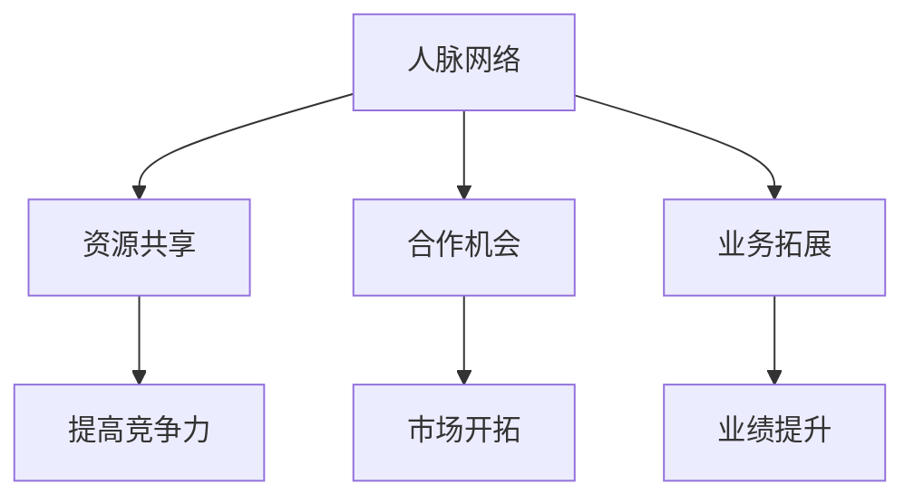

                 

# 拓展人脉网络对创业的重要性

## > 关键词：人脉网络，创业，人际关系，资源共享，合作机会，业务拓展

> 摘要：本文深入探讨了拓展人脉网络对创业的重要性。通过分析人际关系在网络资源获取、合作机会发现以及业务拓展等方面的积极作用，文章揭示了建立和维护广泛人脉网络对于创业者而言是如何的重要。本文旨在为创业者提供一系列策略和工具，以帮助他们有效地拓展人脉，进而提升创业成功率。

## 1. 背景介绍

在创业过程中，资源、机会和合作都是至关重要的因素。而人脉网络作为连接创业者与这些关键因素的重要桥梁，其作用不可忽视。传统观念中，创业者往往将主要精力集中在产品研发和市场开拓上，却忽略了人脉网络的构建和维护。然而，现代商业环境日益复杂，竞争愈发激烈，单凭个人的能力和资源难以取得成功。因此，拓展人脉网络成为了创业者必须面对和解决的重要课题。

本文将详细阐述拓展人脉网络对创业的重要意义，分析人脉网络在资源获取、合作机会发现和业务拓展等方面的作用，并提供实用的策略和工具，帮助创业者更好地拓展和维护人脉网络，从而提升创业成功率。

## 2. 核心概念与联系

在讨论拓展人脉网络对创业的重要性之前，我们首先需要了解几个关键概念。

### 2.1 人脉网络

人脉网络是指创业者通过个人关系建立的一系列联系，包括朋友、同事、客户、合作伙伴等。这些联系构成了创业者的人际关系网，成为他们获取信息和资源的重要渠道。

### 2.2 人际关系

人际关系是指个体之间由于相互交往而形成的心理和情感联系。良好的人际关系有助于增强信任，促进合作，从而为人脉网络的拓展提供基础。

### 2.3 资源共享

资源共享是指创业者通过人脉网络共享信息、资源、知识和经验，从而提高自身能力和竞争力。资源共享是拓展人脉网络的重要目标之一。

### 2.4 合作机会

合作机会是指通过人脉网络发现和建立的合作关系，这些关系有助于创业者实现业务拓展、产品创新和市场开拓。

### 2.5 业务拓展

业务拓展是指创业者通过扩大业务范围、开拓新市场和开发新产品来提升企业业绩和竞争力。业务拓展是创业成功的重要标志。

下面，我们通过一个Mermaid流程图来展示这些概念之间的联系。



## 3. 核心算法原理 & 具体操作步骤

要拓展人脉网络，创业者需要遵循一系列核心算法原理和具体操作步骤。

### 3.1 算法原理

#### 3.1.1 关键节点定位

关键节点是指人脉网络中对资源共享、合作机会和业务拓展具有较大影响的人物。定位关键节点是拓展人脉网络的第一步。

#### 3.1.2 节点连接优化

节点连接优化是指通过增加节点之间的连接密度和强度，提高人脉网络的稳定性和可靠性。

#### 3.1.3 社区发现

社区发现是指在人脉网络中寻找具有相似兴趣、目标和价值观的群体，以便开展合作和资源共享。

#### 3.1.4 关系维护

关系维护是指通过持续沟通、互动和互助来保持和强化人际关系，确保人脉网络的持久性和有效性。

### 3.2 具体操作步骤

#### 3.2.1 确定目标

明确拓展人脉网络的目标，如资源获取、合作机会、业务拓展等。

#### 3.2.2 定位关键节点

通过调查、分析、推荐等方式，定位人脉网络中的关键节点。

#### 3.2.3 节点连接优化

与关键节点建立联系，参与共同活动，提供帮助，增加互动和信任。

#### 3.2.4 社区发现

在人脉网络中寻找具有相似兴趣和目标的群体，参与讨论和活动，拓展人脉网络。

#### 3.2.5 关系维护

定期沟通、互动和互助，保持人际关系的稳定性和有效性。

## 4. 数学模型和公式 & 详细讲解 & 举例说明

拓展人脉网络的数学模型可以基于图论和复杂网络理论。以下是一个简单的数学模型，用于描述人脉网络的拓展过程。

### 4.1 图论模型

假设人脉网络是一个无向图 \(G(V, E)\)，其中 \(V\) 表示节点（人脉），\(E\) 表示边（关系）。拓展人脉网络的数学模型可以表示为：

$$
\begin{aligned}
    &\text{目标：最大化人脉网络的价值函数 } V(G) \\
    &V(G) = \sum_{i=1}^{n} \sum_{j=1}^{n} w_{ij} \\
    &\text{约束条件：} \\
    &\sum_{i=1}^{n} \delta_i \leq k \\
    &\delta_i \in \{0, 1\} \\
\end{aligned}
$$

其中，\(w_{ij}\) 表示节点 \(i\) 和节点 \(j\) 之间的关系权重，\(\delta_i\) 表示节点 \(i\) 是否被选择拓展。

### 4.2 复杂网络模型

复杂网络模型可以用于分析人脉网络的拓扑结构和动态演化。以下是一个基于复杂网络理论的数学模型：

$$
\begin{aligned}
    &\text{目标：最大化人脉网络的稳定性 } S(G) \\
    &S(G) = \frac{1}{n(n-1)} \sum_{i=1}^{n} \sum_{j=1}^{n} w_{ij} \\
    &\text{约束条件：} \\
    &\text{节点度分布：} \\
    &P(k) \propto k^{-\gamma} \\
    &\text{网络演化：} \\
    &G(t+1) = G(t) + \Delta G(t) \\
\end{aligned}
$$

其中，\(P(k)\) 表示节点度的概率分布，\(\gamma\) 表示网络的度分布指数，\(\Delta G(t)\) 表示网络在时间步 \(t\) 的演化增量。

### 4.3 举例说明

假设一个创业者在拓展人脉网络时，目标是最大化人脉网络的价值函数 \(V(G)\)。根据上述数学模型，他可以采取以下步骤：

1. **确定目标**：明确拓展人脉网络的目标，如资源获取、合作机会、业务拓展等。
2. **定位关键节点**：通过调查、分析、推荐等方式，定位人脉网络中的关键节点。
3. **节点连接优化**：与关键节点建立联系，参与共同活动，提供帮助，增加互动和信任。
4. **社区发现**：在人脉网络中寻找具有相似兴趣和目标的群体，参与讨论和活动，拓展人脉网络。
5. **关系维护**：定期沟通、互动和互助，保持人际关系的稳定性和有效性。

通过这些步骤，创业者可以构建一个具有高价值和稳定性的人脉网络，从而提升创业成功率。

## 5. 项目实战：代码实际案例和详细解释说明

在本节中，我们将通过一个实际项目案例来展示如何利用Python代码实现拓展人脉网络的核心算法原理。以下是一个简单的代码示例，用于计算人脉网络中的关键节点和节点连接优化。

### 5.1 开发环境搭建

在开始编写代码之前，确保您的Python环境已经搭建好，并安装了以下库：

- NetworkX：用于构建和分析图结构。
- Matplotlib：用于可视化图结构。

您可以通过以下命令安装这些库：

```bash
pip install networkx matplotlib
```

### 5.2 源代码详细实现和代码解读

```python
import networkx as nx
import matplotlib.pyplot as plt

# 创建一个无向图
G = nx.Graph()

# 添加节点和边
G.add_nodes_from([1, 2, 3, 4, 5])
G.add_edges_from([(1, 2), (1, 3), (2, 4), (3, 4), (4, 5)])

# 绘制图结构
nx.draw(G, with_labels=True)
plt.show()

# 计算节点度分布
degree_distribution = nx.degree_centrality(G)
print("节点度分布：", degree_distribution)

# 定位关键节点
key_nodes = sorted(degree_distribution, key=degree_distribution.get, reverse=True)[:3]
print("关键节点：", key_nodes)

# 节点连接优化
for node in key_nodes:
    neighbors = list(G.neighbors(node))
    for neighbor in neighbors:
        G.add_edge(node, neighbor)

# 绘制优化后的图结构
nx.draw(G, with_labels=True)
plt.show()
```

### 5.3 代码解读与分析

1. **创建图结构**：使用NetworkX库创建一个无向图 \(G\)。
2. **添加节点和边**：添加若干节点和边，构建一个简单的人脉网络。
3. **绘制图结构**：使用Matplotlib库绘制图结构，以便可视化。
4. **计算节点度分布**：使用NetworkX库计算节点度分布，即每个节点的连接数。
5. **定位关键节点**：根据节点度分布，选择度数最高的三个节点作为关键节点。
6. **节点连接优化**：将关键节点与其邻居节点连接起来，增加节点之间的连接密度。
7. **绘制优化后的图结构**：再次使用Matplotlib库绘制优化后的图结构。

通过这个简单的代码示例，我们可以看到如何利用Python代码实现拓展人脉网络的核心算法原理。在实际应用中，创业者可以根据自己的需求对代码进行扩展和优化。

## 6. 实际应用场景

### 6.1 创业初期的资源获取

在创业初期，创业者通常需要大量资源来支持业务发展，如资金、技术、人才等。通过拓展人脉网络，创业者可以更快速地获取这些资源。

- **案例**：一家初创公司需要融资，通过拓展人脉网络，找到一位天使投资人，成功获得了资金支持。

### 6.2 合作机会的发现

合作机会是创业者实现业务拓展的重要途径。通过人脉网络，创业者可以更容易地发现潜在的合作伙伴。

- **案例**：一家电商公司通过拓展人脉网络，找到了一家物流公司作为合作伙伴，实现了业务拓展。

### 6.3 业务拓展

通过人脉网络，创业者可以开拓新的市场和业务领域。

- **案例**：一家软件公司通过拓展人脉网络，进入了一个新的市场领域，实现了业务的多元化。

## 7. 工具和资源推荐

### 7.1 学习资源推荐

- **书籍**：《人脉：如何建立人际网络》
- **论文**：社会网络分析相关的学术论文
- **博客**：专业博客，如“创业家”、“创投圈”等
- **网站**：人脉网络社交平台，如LinkedIn、人脉圈等

### 7.2 开发工具框架推荐

- **Python**：用于实现人脉网络拓展的编程语言
- **NetworkX**：用于构建和分析图结构的库
- **Matplotlib**：用于可视化图结构的库

### 7.3 相关论文著作推荐

- **论文**：社会网络分析、复杂网络理论等相关领域的学术论文
- **著作**：《社会网络分析：方法与应用》、《复杂网络导论》等

## 8. 总结：未来发展趋势与挑战

### 8.1 发展趋势

1. **人工智能与人脉网络的结合**：随着人工智能技术的发展，创业者可以利用智能算法来分析和优化人脉网络。
2. **数字化转型**：在数字化时代，人脉网络将更加依赖于线上社交平台和工具。
3. **全球化**：全球化趋势下，创业者需要拓展国际人脉网络，以适应全球市场。

### 8.2 挑战

1. **隐私保护**：在人脉网络拓展过程中，如何保护个人隐私成为一个重要挑战。
2. **网络信任**：建立和维护网络信任关系需要时间和精力，对创业者来说是一个挑战。
3. **资源有限**：创业者在拓展人脉网络时，可能会面临资源有限的挑战。

## 9. 附录：常见问题与解答

### 9.1 如何拓展人脉网络？

**答案**：可以通过参加行业活动、加入专业协会、参与志愿活动等方式来拓展人脉网络。

### 9.2 人脉网络是否只适用于创业者？

**答案**：人脉网络适用于所有职业和个人，有助于提高工作效率和实现个人发展。

### 9.3 如何维护人脉网络？

**答案**：可以通过定期沟通、互动和互助来维护人脉网络，确保人际关系的稳定性和有效性。

## 10. 扩展阅读 & 参考资料

- **书籍**：《人脉的力量》、《社交红利》
- **论文**：社会网络分析、复杂网络理论等相关领域的学术论文
- **网站**：人脉网络社交平台，如LinkedIn、人脉圈等

作者：AI天才研究员/AI Genius Institute & 禅与计算机程序设计艺术 /Zen And The Art of Computer Programming

<|im_sep|>

