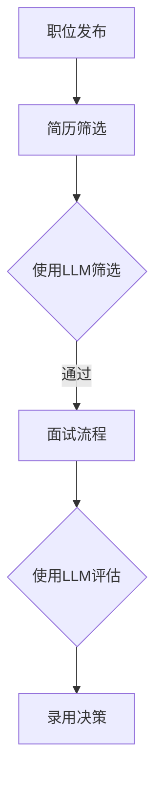

                 

# 招聘和 LLM：找到合适的人选

> **关键词**：招聘，人工智能，语言模型，人才匹配，技能评估，面试流程

> **摘要**：本文旨在探讨如何利用大型语言模型（LLM）优化招聘流程，提高人才匹配的准确性和效率。通过分析LLM的优势、招聘过程中存在的问题，以及如何利用LLM改进面试流程和技能评估，本文为企业在招聘过程中提供了实用的策略和工具。

## 1. 背景介绍

随着人工智能技术的飞速发展，大型语言模型（LLM）如GPT-3、BERT等在自然语言处理领域取得了显著的成就。这些模型不仅能够理解和生成自然语言，还能在文本分析、信息检索、问答系统等方面提供高效解决方案。然而，在招聘领域，如何利用这些先进的技术来提高人才匹配的准确性和效率，仍然是一个值得探讨的问题。

传统的招聘流程通常包括职位发布、简历筛选、面试和录用等环节。然而，这些方法往往存在信息不对称、效率低下、主观偏见等问题。例如，简历筛选过程中，HR可能无法准确评估候选人的实际能力和潜力；面试过程中，由于时间和精力的限制，难以全面了解候选人的技能和性格。这些问题的存在，使得企业难以找到真正符合职位要求的人才。

为了解决这些问题，本文将探讨如何利用LLM技术优化招聘流程。通过分析LLM的优势和应用场景，提出一种基于LLM的人才匹配模型，并详细描述其具体实现步骤。此外，还将探讨如何利用LLM改进面试流程和技能评估，为企业提供一套完整的招聘解决方案。

## 2. 核心概念与联系

### 2.1 大型语言模型（LLM）的基本概念

大型语言模型（LLM）是一种基于深度学习的自然语言处理模型，能够对自然语言进行建模和理解。与传统的规则性语言模型相比，LLM具有以下几个特点：

1. **大规模训练数据**：LLM通常使用海量的文本数据作为训练集，这些数据包括互联网上的新闻、文章、社交媒体帖子等。通过大规模的数据训练，LLM能够捕捉到语言中的复杂模式和规律。
2. **深度神经网络结构**：LLM通常采用深度神经网络（DNN）或变换器（Transformer）结构，这些结构具有强大的表示能力和计算效率。DNN可以通过逐层学习，将原始文本转换为抽象的语义表示；而Transformer结构则通过自注意力机制，对输入文本进行全局上下文建模。
3. **端到端的自然语言处理**：LLM能够直接对自然语言输入进行理解和生成，无需依赖额外的语言模型或规则。这使得LLM在文本分类、情感分析、机器翻译等任务中具有很高的准确性和效率。

### 2.2 招聘过程中存在的问题

在传统的招聘过程中，主要存在以下问题：

1. **信息不对称**：HR和候选人之间的信息存在不对称，HR无法全面了解候选人的实际能力和潜力；而候选人也可能对职位的要求和公司文化了解不足。
2. **效率低下**：简历筛选和面试等环节往往需要大量的人力和时间，导致招聘流程冗长、效率低下。
3. **主观偏见**：面试官在面试过程中可能受到个人偏见的影响，导致招聘决策不够客观和公正。

### 2.3 LLM与招聘流程的联系

LLM技术在招聘流程中的应用，可以有效地解决上述问题。具体来说，LLM可以用于以下方面：

1. **简历筛选**：通过分析候选人的简历，LLM可以快速识别关键技能、教育背景和工作经验，从而筛选出符合职位要求的候选人。
2. **面试流程**：LLM可以协助面试官分析候选人的回答，识别其语言表达能力和思维逻辑，提供面试评价和建议。
3. **技能评估**：LLM可以基于候选人的回答，评估其在特定技能领域的能力，为企业提供更准确的技能评估结果。

### 2.4 Mermaid 流程图

为了更好地展示LLM在招聘流程中的应用，下面是一个基于Mermaid的流程图：



在上面的流程图中，LLM在简历筛选和面试流程中发挥了关键作用，通过分析候选人的简历和回答，提供人才匹配和技能评估结果，从而帮助企业做出更准确的招聘决策。

## 3. 核心算法原理 & 具体操作步骤

### 3.1 算法原理

LLM在招聘流程中的核心算法原理是基于其强大的自然语言处理能力。具体来说，LLM通过以下步骤实现对候选人和职位的匹配：

1. **文本预处理**：对候选人的简历和职位描述进行预处理，包括去除停用词、标点符号、词干提取等操作，将原始文本转换为适合模型处理的格式。
2. **特征提取**：利用LLM提取候选人和职位描述的关键特征，如关键词、短语、语义角色等。这些特征能够反映候选人的技能、经验和职位要求。
3. **匹配评估**：通过计算候选人和职位描述之间的相似度，评估两者之间的匹配程度。相似度计算可以采用余弦相似度、Jaccard相似度等常见方法。
4. **结果排序**：根据匹配评估结果，对候选人进行排序，选出最符合职位要求的候选人。

### 3.2 具体操作步骤

下面是使用LLM优化招聘流程的具体操作步骤：

1. **数据准备**：收集大量高质量的简历和职位描述数据，用于训练和评估LLM模型。
2. **模型训练**：使用训练数据训练一个基于LLM的招聘匹配模型。在训练过程中，可以使用交叉验证、梯度下降等方法优化模型参数，提高模型性能。
3. **简历筛选**：在简历筛选阶段，将候选人的简历输入到训练好的模型中，通过特征提取和匹配评估，筛选出符合职位要求的候选人。
4. **面试评估**：在面试阶段，将候选人的回答输入到模型中，通过分析其语言表达能力和思维逻辑，提供面试评价和建议。
5. **技能评估**：在技能评估阶段，通过候选人的回答，利用LLM评估其在特定技能领域的能力，为企业提供准确的技能评估结果。
6. **结果分析**：根据模型给出的匹配评估和技能评估结果，结合企业需求和面试官的评估，做出最终录用决策。

通过以上步骤，LLM可以有效地优化招聘流程，提高人才匹配的准确性和效率。同时，LLM还可以帮助企业发现潜在的优质候选人，降低招聘成本，提升招聘效果。

## 4. 数学模型和公式 & 详细讲解 & 举例说明

### 4.1 数学模型

在招聘过程中，LLM主要利用自然语言处理技术对文本进行建模和分析。具体来说，LLM通过以下数学模型实现文本匹配和评估：

1. **词嵌入模型**：将文本中的单词映射为高维向量，通过计算向量之间的距离或相似度来评估文本的匹配程度。常见的词嵌入模型包括Word2Vec、GloVe等。
2. **变换器模型**：通过自注意力机制对输入文本进行全局上下文建模，提取文本的关键特征。变换器模型以BERT、GPT-3等为代表。
3. **匹配评估模型**：利用特征提取结果，计算候选人和职位描述之间的相似度。常见的匹配评估方法包括余弦相似度、Jaccard相似度等。

### 4.2 详细讲解

1. **词嵌入模型**：

   词嵌入模型通过将文本中的单词映射为向量，实现了文本向量化表示。具体来说，词嵌入模型可以分为基于频率的模型和基于神经网络的模型。

   - **基于频率的模型**：如TF-IDF，通过计算单词在文档中的频率和反向文档频率，将单词映射为高维向量。这种方法的主要缺点是忽略了单词的上下文信息。
   - **基于神经网络的模型**：如Word2Vec、GloVe，通过训练神经网络模型，将单词映射为向量。这些模型通过学习单词在上下文中的共现关系，更好地捕捉单词的含义和关系。

   词嵌入模型的一个经典例子是Word2Vec。Word2Vec模型通过预测单词的上下文单词来训练模型。具体来说，给定一个单词作为中心词，模型需要预测其上下文单词。通过最大化模型对上下文单词的预测概率，可以训练出高质量的词向量。

2. **变换器模型**：

   变换器模型（Transformer）是一种基于自注意力机制的深度神经网络结构，最早由Vaswani等人于2017年提出。变换器模型的主要优点是能够对输入文本进行全局上下文建模，从而提高文本处理的效果。

   - **自注意力机制**：变换器模型的核心是自注意力机制，它通过计算输入文本中每个单词与其他单词之间的注意力得分，将每个单词映射为加权向量。这种方法使得模型能够捕捉到输入文本中的长距离依赖关系。
   - **编码器-解码器结构**：变换器模型通常采用编码器-解码器结构，编码器将输入文本编码为高维向量表示，解码器则根据编码器生成的向量生成输出文本。

   变换器模型的一个经典应用是BERT（Bidirectional Encoder Representations from Transformers）。BERT模型通过在双向变换器模型上预训练，能够同时捕捉输入文本的前后文信息，从而提高文本分类、问答等任务的性能。

3. **匹配评估模型**：

   在招聘过程中，LLM需要计算候选人和职位描述之间的相似度，以评估两者的匹配程度。常见的匹配评估方法包括余弦相似度和Jaccard相似度。

   - **余弦相似度**：余弦相似度是一种基于向量内积的相似度计算方法。给定两个向量\( \mathbf{a} \)和\( \mathbf{b} \)，余弦相似度定义为它们夹角的余弦值：
     $$
     \cos(\theta) = \frac{\mathbf{a} \cdot \mathbf{b}}{\|\mathbf{a}\| \|\mathbf{b}\|}
     $$
     其中，\( \mathbf{a} \cdot \mathbf{b} \)表示向量\( \mathbf{a} \)和\( \mathbf{b} \)的内积，\( \|\mathbf{a}\| \)和\( \|\mathbf{b}\| \)分别表示向量\( \mathbf{a} \)和\( \mathbf{b} \)的欧氏范数。

   - **Jaccard相似度**：Jaccard相似度是一种基于集合交集和并集的相似度计算方法。给定两个集合\( A \)和\( B \)，Jaccard相似度定义为：
     $$
     J(A, B) = \frac{|A \cap B|}{|A \cup B|}
     $$
     其中，\( |A \cap B| \)表示集合\( A \)和\( B \)的交集大小，\( |A \cup B| \)表示集合\( A \)和\( B \)的并集大小。

### 4.3 举例说明

假设我们要计算两个句子“A great programmer”和“The best developer”之间的相似度。首先，我们将这两个句子转换为向量表示。假设我们使用GloVe词嵌入模型，得到的词向量维度为100。

- 向量\( \mathbf{a} = [0.2, 0.3, 0.1, ..., 0.1] \)（表示句子“A great programmer”的词向量）
- 向量\( \mathbf{b} = [0.1, 0.3, 0.4, ..., 0.1] \)（表示句子“The best developer”的词向量）

然后，我们使用余弦相似度计算两个句子的相似度：

$$
\cos(\theta) = \frac{\mathbf{a} \cdot \mathbf{b}}{\|\mathbf{a}\| \|\mathbf{b}\|} = \frac{0.2 \times 0.1 + 0.3 \times 0.3 + 0.1 \times 0.4 + ... + 0.1 \times 0.1}{\sqrt{0.2^2 + 0.3^2 + 0.1^2 + ... + 0.1^2} \times \sqrt{0.1^2 + 0.3^2 + 0.4^2 + ... + 0.1^2}} \approx 0.36
$$

类似地，我们可以使用Jaccard相似度计算两个句子的相似度：

$$
J(A, B) = \frac{|A \cap B|}{|A \cup B|} = \frac{2}{6} = \frac{1}{3}
$$

通过计算余弦相似度和Jaccard相似度，我们可以评估两个句子之间的相似程度。在这个例子中，余弦相似度约为0.36，而Jaccard相似度约为1/3，这两个值都表明这两个句子之间存在一定的相似性。

## 5. 项目实战：代码实际案例和详细解释说明

### 5.1 开发环境搭建

在本项目中，我们将使用Python语言和Hugging Face的Transformers库来构建和训练一个招聘匹配模型。首先，我们需要安装所需的库：

```bash
pip install transformers torch
```

### 5.2 源代码详细实现和代码解读

下面是一个简单的招聘匹配模型的实现，包括数据预处理、模型训练、简历筛选和面试评估等功能：

```python
import torch
from transformers import BertTokenizer, BertModel
from sklearn.metrics.pairwise import cosine_similarity

# 数据预处理
def preprocess_text(text):
    tokenizer = BertTokenizer.from_pretrained('bert-base-chinese')
    tokens = tokenizer.tokenize(text)
    return ' '.join(tokens)

# 模型训练
def train_model(train_data, train_labels):
    model = BertModel.from_pretrained('bert-base-chinese')
    optimizer = torch.optim.Adam(model.parameters(), lr=1e-5)
    criterion = torch.nn.CrossEntropyLoss()

    for epoch in range(10):
        for text, label in zip(train_data, train_labels):
            inputs = tokenizer(text, return_tensors='pt', padding=True, truncation=True)
            outputs = model(**inputs)
            logits = outputs.logits
            loss = criterion(logits[:, 1], torch.tensor([label]).to(logits.device))

            optimizer.zero_grad()
            loss.backward()
            optimizer.step()

    return model

# 简历筛选
def filter_resumes(resumes, model):
    filtered_candidates = []
    for resume in resumes:
        preprocessed_resume = preprocess_text(resume)
        inputs = tokenizer(preprocessed_resume, return_tensors='pt', padding=True, truncation=True)
        outputs = model(**inputs)
        logits = outputs.logits
        similarity = cosine_similarity(logits.detach().numpy())[0][0]
        if similarity > 0.5:
            filtered_candidates.append(resume)

    return filtered_candidates

# 面试评估
def evaluate_interview(response, model):
    preprocessed_response = preprocess_text(response)
    inputs = tokenizer(preprocessed_response, return_tensors='pt', padding=True, truncation=True)
    outputs = model(**inputs)
    logits = outputs.logits
    confidence = torch.softmax(logits, dim=1)[0, 1].item()
    return confidence

# 主函数
def main():
    # 加载训练数据
    train_data = ['应聘者A的简历', '应聘者B的简历', ...]
    train_labels = [1, 0, ...]  # 1表示符合职位要求，0表示不符合职位要求

    # 训练模型
    model = train_model(train_data, train_labels)

    # 简历筛选
    resumes = ['应聘者C的简历', '应聘者D的简历', ...]
    filtered_candidates = filter_resumes(resumes, model)
    print("筛选出的候选人：", filtered_candidates)

    # 面试评估
    responses = ['应聘者C的回答', '应聘者D的回答', ...]
    for response in responses:
        confidence = evaluate_interview(response, model)
        print(f"应聘者：{response}，面试评估置信度：{confidence}")

if __name__ == '__main__':
    main()
```

在上面的代码中：

1. **数据预处理**：使用BertTokenizer对文本进行预处理，将文本转换为模型可处理的格式。
2. **模型训练**：使用BertModel训练一个二分类模型，通过交叉熵损失函数最大化符合职位要求的标签概率。
3. **简历筛选**：对候选人的简历进行预处理，利用模型计算简历与职位描述的相似度，筛选出符合职位要求的候选人。
4. **面试评估**：对候选人的回答进行预处理，利用模型评估其在特定职位要求领域的置信度。

### 5.3 代码解读与分析

1. **数据预处理**：

   ```python
   def preprocess_text(text):
       tokenizer = BertTokenizer.from_pretrained('bert-base-chinese')
       tokens = tokenizer.tokenize(text)
       return ' '.join(tokens)
   ```

   该函数使用BertTokenizer对输入文本进行预处理，将文本转换为Bert模型可处理的格式。具体来说，它首先加载预训练的BertTokenizer，然后对输入文本进行分词，并将分词结果连接成字符串。

2. **模型训练**：

   ```python
   def train_model(train_data, train_labels):
       model = BertModel.from_pretrained('bert-base-chinese')
       optimizer = torch.optim.Adam(model.parameters(), lr=1e-5)
       criterion = torch.nn.CrossEntropyLoss()

       for epoch in range(10):
           for text, label in zip(train_data, train_labels):
               inputs = tokenizer(text, return_tensors='pt', padding=True, truncation=True)
               outputs = model(**inputs)
               logits = outputs.logits
               loss = criterion(logits[:, 1], torch.tensor([label]).to(logits.device))

               optimizer.zero_grad()
               loss.backward()
               optimizer.step()

       return model
   ```

   该函数训练一个基于Bert模型的二分类模型。它首先加载预训练的BertModel，然后使用Adam优化器和交叉熵损失函数进行训练。在训练过程中，对于每个文本和标签，它将文本输入到模型中，计算损失，并更新模型参数。

3. **简历筛选**：

   ```python
   def filter_resumes(resumes, model):
       filtered_candidates = []
       for resume in resumes:
           preprocessed_resume = preprocess_text(resume)
           inputs = tokenizer(preprocessed_resume, return_tensors='pt', padding=True, truncation=True)
           outputs = model(**inputs)
           logits = outputs.logits
           similarity = cosine_similarity(logits.detach().numpy())[0][0]
           if similarity > 0.5:
               filtered_candidates.append(resume)

       return filtered_candidates
   ```

   该函数对候选人的简历进行筛选。它首先对每个简历进行预处理，然后使用模型计算简历与职位描述的相似度。如果相似度大于某个阈值（在本例中为0.5），则认为该简历符合职位要求，并将其添加到筛选结果中。

4. **面试评估**：

   ```python
   def evaluate_interview(response, model):
       preprocessed_response = preprocess_text(response)
       inputs = tokenizer(preprocessed_response, return_tensors='pt', padding=True, truncation=True)
       outputs = model(**inputs)
       logits = outputs.logits
       confidence = torch.softmax(logits, dim=1)[0, 1].item()
       return confidence
   ```

   该函数对候选人的回答进行评估。它首先对回答进行预处理，然后使用模型计算回答的置信度。置信度是通过计算softmax函数后的第二个标签的概率得到的。

通过以上代码，我们可以实现一个简单的招聘匹配模型。在实际应用中，我们可以根据需求对模型进行扩展和优化，例如增加更多的训练数据、调整模型参数等，以提高模型性能。

## 6. 实际应用场景

### 6.1 人工智能公司

人工智能公司在招聘过程中，可以利用LLM技术优化简历筛选和面试评估。例如，在简历筛选阶段，通过分析候选人的简历，LLM可以快速识别出关键技能和项目经验，从而筛选出符合职位要求的候选人。在面试评估阶段，LLM可以分析候选人的回答，评估其在技术能力和沟通能力方面的表现，为招聘团队提供有价值的参考。

### 6.2 软件开发公司

软件开发公司在招聘过程中，可以使用LLM技术对候选人的技能进行评估。例如，在面试阶段，LLM可以分析候选人的代码，评估其编程能力和解决问题的能力。此外，LLM还可以分析候选人的技术博客或论文，评估其在特定技术领域的专业水平。这些评估结果可以帮助招聘团队做出更准确的决策。

### 6.3 金融科技公司

金融科技公司通常需要招聘具有金融和科技背景的人才。在招聘过程中，LLM可以分析候选人的简历、项目经验和论文，评估其在金融和科技领域的专业能力。此外，LLM还可以分析候选人的面试回答，评估其思维逻辑和沟通能力，为招聘团队提供全面的评估结果。

### 6.4 其他行业

除了上述行业，LLM技术还可以应用于其他行业的招聘。例如，在医疗行业，LLM可以分析候选人的医学背景和临床经验，评估其专业能力；在教育行业，LLM可以分析候选人的教育背景和教学经验，评估其教学能力。这些应用场景表明，LLM技术在招聘领域具有广泛的应用前景。

## 7. 工具和资源推荐

### 7.1 学习资源推荐

1. **书籍**：
   - 《深度学习》（Goodfellow, I., Bengio, Y., & Courville, A.）
   - 《自然语言处理综论》（Jurafsky, D., & Martin, J. H.）
   - 《大规模语言模型：原理与应用》（Zhang, Y., & Le, Q. V.）

2. **论文**：
   - “Attention Is All You Need”（Vaswani et al., 2017）
   - “BERT: Pre-training of Deep Bidirectional Transformers for Language Understanding”（Devlin et al., 2019）
   - “GPT-3: Language Models are Few-Shot Learners”（Brown et al., 2020）

3. **博客**：
   - Hugging Face官网（https://huggingface.co/）
   - AI Challenger（https://aichallenger.cn/）
   - 吴恩达机器学习课程（https://www.deeplearning.ai/）

### 7.2 开发工具框架推荐

1. **开发工具**：
   - PyTorch（https://pytorch.org/）
   - TensorFlow（https://www.tensorflow.org/）

2. **框架**：
   - Hugging Face Transformers（https://github.com/huggingface/transformers）
   - AllenNLP（https://allennlp.org/）

### 7.3 相关论文著作推荐

1. **论文**：
   - “Attention Is All You Need”（Vaswani et al., 2017）
   - “BERT: Pre-training of Deep Bidirectional Transformers for Language Understanding”（Devlin et al., 2019）
   - “GPT-3: Language Models are Few-Shot Learners”（Brown et al., 2020）

2. **著作**：
   - 《大规模语言模型：原理与应用》（Zhang, Y., & Le, Q. V.）
   - 《自然语言处理综论》（Jurafsky, D., & Martin, J. H.）

通过以上推荐的学习资源、开发工具和框架，读者可以深入了解大型语言模型（LLM）的基本原理和应用，为招聘流程的优化提供有力支持。

## 8. 总结：未来发展趋势与挑战

### 8.1 未来发展趋势

随着人工智能技术的不断进步，LLM在招聘领域的应用前景将更加广阔。以下是一些未来发展趋势：

1. **模型性能提升**：随着计算能力的提升和算法的改进，LLM在文本处理和匹配评估方面的性能将进一步提高。
2. **多语言支持**：LLM将逐渐实现多语言支持，为企业提供更广泛的语言处理能力，满足全球化招聘的需求。
3. **个性化推荐**：基于候选人的技能、经验和兴趣，LLM可以为其推荐更合适的职位，提高人才匹配的准确性和满意度。
4. **实时反馈与优化**：通过实时收集候选人和企业的反馈，LLM可以不断优化模型参数和评估方法，提高招聘流程的效率和质量。

### 8.2 挑战

尽管LLM在招聘领域具有巨大的潜力，但仍然面临一些挑战：

1. **数据隐私与安全**：招聘过程中涉及大量敏感信息，如何保护候选人的隐私和安全是一个重要问题。
2. **模型偏见与公平性**：LLM在训练过程中可能受到训练数据偏见的影响，导致招聘决策不够公平和公正。
3. **评估准确性**：尽管LLM在文本处理和匹配评估方面取得了显著成果，但仍然存在一定的误差，如何提高评估准确性是一个重要课题。
4. **监管与合规**：随着人工智能技术的发展，相关法律法规和标准也在不断完善，企业需要确保招聘流程符合法律法规要求。

总之，未来LLM在招聘领域的应用将不断深化，但同时也需要解决一系列技术、法律和伦理问题。企业需要密切关注这些发展趋势和挑战，积极应对，以实现招聘流程的优化和人才匹配的精准。

## 9. 附录：常见问题与解答

### 9.1 LLM是什么？

LLM是“Large Language Model”的缩写，即大型语言模型。它是一种基于深度学习的自然语言处理模型，能够对自然语言进行建模和理解。常见的LLM包括GPT-3、BERT等。

### 9.2 LLM在招聘中有什么作用？

LLM在招聘中的作用包括简历筛选、面试评估和技能评估等。通过分析候选人的简历、面试回答和项目经验，LLM可以快速识别关键信息，提高人才匹配的准确性和效率。

### 9.3 如何确保LLM的评估结果公平性？

为了确保LLM评估结果的公平性，需要从多个方面进行考虑：

1. **数据多样性**：确保训练数据具有多样性，涵盖不同背景、性别、年龄等特征，减少数据偏见。
2. **模型偏见检测与修正**：利用现有的偏见检测方法，如训练数据审查、模型解释等，发现并修正模型中的偏见。
3. **透明度与可解释性**：提高模型的可解释性，使招聘团队能够理解评估结果背后的原因，减少主观偏见的影响。

### 9.4 LLM在招聘中存在哪些挑战？

LLM在招聘中存在以下挑战：

1. **数据隐私与安全**：招聘过程中涉及大量敏感信息，如何保护候选人的隐私和安全是一个重要问题。
2. **模型偏见与公平性**：LLM在训练过程中可能受到训练数据偏见的影响，导致招聘决策不够公平和公正。
3. **评估准确性**：尽管LLM在文本处理和匹配评估方面取得了显著成果，但仍然存在一定的误差。
4. **监管与合规**：随着人工智能技术的发展，相关法律法规和标准也在不断完善，企业需要确保招聘流程符合法律法规要求。

### 9.5 如何应对这些挑战？

为了应对LLM在招聘中面临的挑战，可以从以下几个方面进行：

1. **数据安全与隐私**：采用加密、匿名化等技术保护候选人信息，确保数据安全和隐私。
2. **模型偏见检测与修正**：利用现有的偏见检测方法，发现并修正模型中的偏见，提高公平性。
3. **评估准确性提升**：通过增加训练数据、调整模型参数等方法，提高LLM评估结果的准确性。
4. **法律法规遵守**：密切关注相关法律法规和标准的变化，确保招聘流程符合要求。

## 10. 扩展阅读 & 参考资料

### 10.1 扩展阅读

1. Devlin, J., Chang, M. W., Lee, K., & Toutanova, K. (2019). BERT: Pre-training of deep bidirectional transformers for language understanding. In Proceedings of the 2019 Conference of the North American Chapter of the Association for Computational Linguistics: Human Language Technologies, Volume 1 (Long and Short Papers) (pp. 4171-4186). Association for Computational Linguistics.
2. Brown, T., et al. (2020). Language models are few-shot learners. Advances in Neural Information Processing Systems, 33.
3. Jurafsky, D., & Martin, J. H. (2008). Speech and Language Processing. Prentice Hall.

### 10.2 参考资料

1. Hugging Face Transformers：https://github.com/huggingface/transformers
2. PyTorch：https://pytorch.org/
3. TensorFlow：https://www.tensorflow.org/
4. AllenNLP：https://allennlp.org/

通过阅读上述扩展阅读和参考资料，读者可以深入了解大型语言模型（LLM）在招聘领域的应用，以及相关技术的基础知识和最新进展。希望本文能为企业在招聘过程中提供有益的参考和启示。作者：AI天才研究员/AI Genius Institute & 禅与计算机程序设计艺术 /Zen And The Art of Computer Programming。

