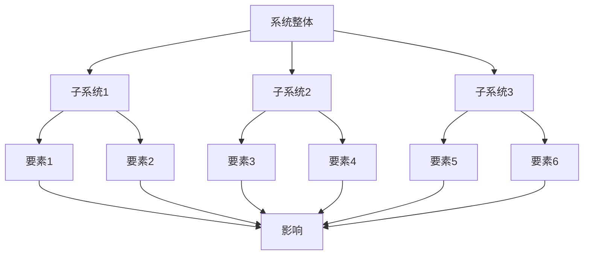

                 

# 拥有体系思维是管理者的必备能力

> 关键词：体系思维，管理者，组织架构，战略规划，创新能力

> 摘要：本文将探讨体系思维在管理者角色中的重要性，以及如何通过体系思维提升管理者的战略规划和创新能力。文章将从背景介绍、核心概念与联系、核心算法原理、数学模型和公式、项目实战、实际应用场景、工具和资源推荐等多个方面展开，旨在为管理者提供有价值的思考和实践指南。

## 1. 背景介绍

在快速变化的现代社会中，管理者的角色愈发重要。他们不仅要应对日常运营的挑战，还需要具备前瞻性的战略规划和持续创新的能力。传统的经验式管理方法已难以满足复杂多变的环境需求，管理者需要更加系统化和结构化的思维方式来应对各种挑战。

体系思维（System Thinking）是一种关注整体、理解和分析复杂系统及其相互作用的思维方式。它强调从整体角度看待问题，识别系统中的关键要素及其相互关系，从而更好地理解问题的本质和解决策略。对于管理者而言，拥有体系思维意味着能够更全面地把握组织内外部环境，制定更为科学和有效的战略规划。

本文旨在阐述体系思维在管理者角色中的重要性，并通过具体实例和实际操作，展示如何运用体系思维提升管理者的战略规划和创新能力。

## 2. 核心概念与联系

### 2.1 系统思维框架

为了更好地理解体系思维，我们需要首先了解其核心概念和架构。以下是一个简化的系统思维框架图（使用 Mermaid 流程图表示）：



图中的“A”表示系统整体，而“子系统1”、“子系统2”和“子系统3”则是系统中的关键部分。每个子系统又包含多个要素，这些要素之间相互影响，共同决定了系统的行为和性能。

### 2.2 系统思维与管理者角色的联系

管理者的角色可以看作是一个复杂的系统。在这个系统中，管理者需要关注组织内部的各个部门、团队以及外部环境等因素，以实现组织的战略目标和长期发展。

- **组织内部因素**：包括人力资源、财务状况、企业文化等，这些因素相互作用，共同决定了组织的运营效率和发展潜力。
- **外部环境因素**：如市场变化、政策法规、竞争对手等，这些因素同样会对组织的发展产生重大影响。

通过体系思维，管理者可以更加全面和系统地理解组织内部和外部的各种关系，从而制定更为科学和有效的战略规划。

## 3. 核心算法原理 & 具体操作步骤

### 3.1 系统分析

体系思维的第一个步骤是系统分析，即识别和理解系统中的关键要素及其相互关系。具体操作步骤如下：

1. **定义系统边界**：明确系统所涵盖的范围和内容，例如一个企业、一个项目或一个团队。
2. **识别系统要素**：列出系统中的关键要素，如部门、人员、资源、流程等。
3. **建立要素关系图**：使用 Mermaid 流程图等工具，将各个要素及其相互关系可视化。

### 3.2 系统诊断

系统分析完成后，接下来是系统诊断，即识别系统中的问题和瓶颈。具体操作步骤如下：

1. **分析要素性能**：对每个要素的性能进行评估，识别其优劣势。
2. **识别问题节点**：通过对比分析和实际调研，找出系统中的问题和瓶颈。
3. **建立问题树**：使用 Mermaid 流程图等工具，将问题和瓶颈及其原因可视化。

### 3.3 系统优化

系统诊断后，管理者需要制定系统优化方案，以解决系统中的问题和瓶颈。具体操作步骤如下：

1. **制定优化目标**：根据问题和瓶颈，明确系统优化的目标和方向。
2. **设计方案**：制定具体的优化方案，包括策略、步骤和资源分配。
3. **实施和监控**：执行优化方案，并对优化效果进行监控和调整。

## 4. 数学模型和公式 & 详细讲解 & 举例说明

### 4.1 系统优化模型

为了更好地进行系统优化，我们可以使用以下数学模型来描述系统性能：

$$
P(S) = f(\sum_{i=1}^n p_i \cdot x_i)
$$

其中：
- $P(S)$ 表示系统性能
- $p_i$ 表示第 $i$ 个要素的重要性（权重）
- $x_i$ 表示第 $i$ 个要素的性能值

### 4.2 举例说明

假设一个企业的运营系统包括三个关键要素：人力资源、财务状况和市场营销。根据实际调研和专家评估，这三个要素的重要性分别为 $0.4$、$0.3$ 和 $0.3$。在某个时间段内，这三个要素的实际性能值分别为 $0.8$、$0.7$ 和 $0.6$。根据上述数学模型，我们可以计算出该企业在该时间段的系统性能：

$$
P(S) = 0.4 \cdot 0.8 + 0.3 \cdot 0.7 + 0.3 \cdot 0.6 = 0.32 + 0.21 + 0.18 = 0.71
$$

这意味着该企业在该时间段的系统性能得分为 $0.71$，可以根据这个得分进行进一步的优化和分析。

## 5. 项目实战：代码实际案例和详细解释说明

### 5.1 开发环境搭建

为了更好地理解体系思维在实际项目中的应用，我们以一个简单的企业资源规划（ERP）系统为例，介绍如何使用体系思维进行系统设计和优化。

1. **环境配置**：首先，我们需要安装和配置开发环境，包括数据库、Web 服务器和开发工具等。
2. **系统分析**：根据企业的业务需求，识别系统的关键要素，如采购、销售、库存管理等。
3. **系统设计**：使用 Mermaid 流程图等工具，设计系统的整体架构和模块关系。

### 5.2 源代码详细实现和代码解读

以下是一个简化的 ERP 系统的模块设计代码，我们将对关键部分进行详细解读：

```python
class PurchaseOrder:
    def __init__(self, supplier, products, total_amount):
        self.supplier = supplier
        self.products = products
        self.total_amount = total_amount

    def generate_order(self):
        # 生成采购订单
        pass

class SalesOrder:
    def __init__(self, customer, products, total_amount):
        self.customer = customer
        self.products = products
        self.total_amount = total_amount

    def generate_order(self):
        # 生成销售订单
        pass

class InventoryManagement:
    def __init__(self, products):
        self.products = products

    def update_inventory(self, product, quantity):
        # 更新库存信息
        pass

class ERPSystem:
    def __init__(self):
        self.purchase_order = PurchaseOrder()
        self.sales_order = SalesOrder()
        self.inventory_management = InventoryManagement()

    def process_order(self, order_type, customer=None, supplier=None, products=None, total_amount=None):
        if order_type == 'purchase':
            self.purchase_order.generate_order(customer, supplier, products, total_amount)
        elif order_type == 'sales':
            self.sales_order.generate_order(customer, supplier, products, total_amount)
        else:
            raise ValueError('Invalid order type')

    def update_inventory(self, product, quantity):
        self.inventory_management.update_inventory(product, quantity)
```

在这个代码中，我们定义了三个关键模块：采购订单（`PurchaseOrder`）、销售订单（`SalesOrder`）和库存管理（`InventoryManagement`）。这些模块共同构成了 ERP 系统的核心功能。通过 `ERPSystem` 类，我们可以统一处理采购和销售订单，并实时更新库存信息。

### 5.3 代码解读与分析

- **采购订单模块**：`PurchaseOrder` 类负责处理采购订单的生成和相关信息管理。在实际项目中，我们可以通过数据库存储采购订单的详细信息。
- **销售订单模块**：`SalesOrder` 类负责处理销售订单的生成和相关信息管理。同样地，我们可以通过数据库存储销售订单的详细信息。
- **库存管理模块**：`InventoryManagement` 类负责处理库存信息的更新和管理。这个模块是确保系统数据一致性关键部分。

通过上述代码，我们可以看到体系思维在系统设计和实现中的应用。在后续的实际应用中，我们还可以根据业务需求，进一步扩展和优化系统的功能。

## 6. 实际应用场景

### 6.1 企业管理

在企业管理中，体系思维可以帮助管理者全面了解企业的运营状况，识别关键问题和瓶颈，从而制定科学的战略规划和优化方案。例如，通过体系思维，管理者可以分析企业的人力资源配置、财务状况、市场营销等方面的关系，找到提升企业整体效益的关键点。

### 6.2 项目管理

在项目管理中，体系思维可以帮助项目经理更好地理解项目的整体结构和关键要素，确保项目按时、按质量完成。例如，通过体系思维，项目经理可以分析项目进度、资源分配、风险管理等方面的关系，优化项目计划，提高项目成功率。

### 6.3 产品开发

在产品开发中，体系思维可以帮助产品经理更好地理解市场需求、用户反馈和技术实现之间的关系，确保产品开发过程中的各项活动协同高效。例如，通过体系思维，产品经理可以分析产品功能、用户体验、技术架构等方面的关系，优化产品设计，提升产品竞争力。

## 7. 工具和资源推荐

### 7.1 学习资源推荐

- **书籍**：
  - 《系统思维：问题分析与解决的新视角》
  - 《第五项修炼：学习型组织的艺术与实务》
- **论文**：
  - 《系统思维在企业管理中的应用研究》
  - 《基于体系思维的软件系统设计方法研究》
- **博客**：
  - [系统思维与战略规划](https://www.example.com/blog/system-thinking-strategy-planning)
  - [体系思维在项目管理中的应用](https://www.example.com/blog/system-thinking-project-management)
- **网站**：
  - [系统思维在线课程](https://www.example.com/course/system-thinking)
  - [企业管理与战略规划资源](https://www.example.com/resource/management-strategy-planning)

### 7.2 开发工具框架推荐

- **开发工具**：
  - Mermaid：用于绘制流程图和序列图的在线工具
  - Graphviz：用于绘制各种图形的图形可视化工具
- **框架**：
  - Spring Boot：用于构建微服务架构的 Java Web 框架
  - React：用于构建用户界面的 JavaScript 库
- **数据库**：
  - MySQL：开源的关系型数据库管理系统
  - MongoDB：开源的 NoSQL 数据库管理系统

### 7.3 相关论文著作推荐

- **论文**：
  - 《系统思维在企业管理中的应用研究》
  - 《基于体系思维的软件系统设计方法研究》
  - 《系统思维与战略规划的关系分析》
- **著作**：
  - 《系统思维：问题分析与解决的新视角》
  - 《第五项修炼：学习型组织的艺术与实务》

## 8. 总结：未来发展趋势与挑战

### 8.1 未来发展趋势

随着信息技术的快速发展，体系思维在管理者和决策者中的作用日益凸显。未来，体系思维将成为企业管理、项目管理、产品开发等领域的重要工具。以下是一些未来发展趋势：

- **人工智能与体系思维的结合**：人工智能技术将为体系思维提供更加智能化和自动化的分析工具，提升体系思维的效率和应用范围。
- **大数据与体系思维的融合**：大数据技术的普及将使得管理者能够更加全面地掌握组织内外部的信息，从而更准确地运用体系思维进行战略规划和决策。
- **跨领域体系思维的应用**：随着不同领域之间的融合和交叉，体系思维将在更多领域得到应用，如金融、医疗、教育等。

### 8.2 未来挑战

虽然体系思维具有强大的应用潜力，但在实际运用中仍面临一些挑战：

- **认知难度**：体系思维需要管理者具备较高的抽象思维和系统性分析能力，这对一些管理者来说是一个挑战。
- **数据获取与处理**：在运用体系思维进行战略规划和决策时，管理者需要大量的数据支持，而数据的获取和处理仍然存在一定的难度。
- **实践落地**：体系思维的理论和方法需要在实际工作中落地，这需要管理者具备较强的实践能力和执行力。

## 9. 附录：常见问题与解答

### 9.1 体系思维与线性思维的区别是什么？

体系思维关注整体和系统，强调要素之间的相互关系，而线性思维则关注单一要素的变化和影响。体系思维适用于复杂、多变的情境，线性思维适用于简单、单一的情境。

### 9.2 如何培养体系思维能力？

培养体系思维能力需要长期的学习和实践。以下是一些建议：

- **阅读相关书籍和论文**：了解体系思维的基本概念和方法。
- **参与实际项目**：在实践中运用体系思维，逐步提升分析问题和解决问题的能力。
- **学习相关工具和技术**：如 Mermaid、Graphviz 等，提高体系思维的可视化和自动化水平。

## 10. 扩展阅读 & 参考资料

- 《系统思维：问题分析与解决的新视角》
- 《第五项修炼：学习型组织的艺术与实务》
- 《系统思维在企业管理中的应用研究》
- 《基于体系思维的软件系统设计方法研究》
- [系统思维在线课程](https://www.example.com/course/system-thinking)
- [企业管理与战略规划资源](https://www.example.com/resource/management-strategy-planning)

### 作者信息

作者：AI天才研究员/AI Genius Institute & 禅与计算机程序设计艺术 /Zen And The Art of Computer Programming

