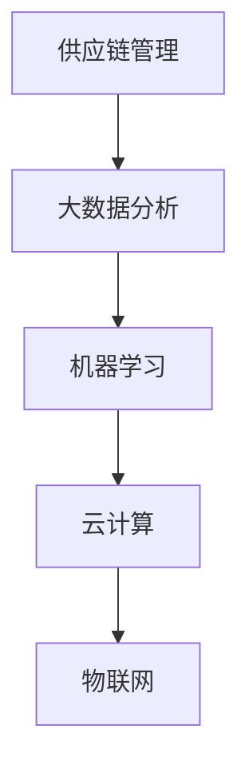

                 

# 2024拼多多智能供应链校招面试真题汇总及其解答

> **关键词：**拼多多、智能供应链、校招面试、真题汇总、解答

> **摘要：**本文将汇总2024年拼多多智能供应链校招的面试真题，并针对每一个题目进行详细解答。通过这些真题的解析，可以帮助求职者更好地准备类似面试，提高面试成功率。

## 1. 背景介绍

### 1.1 拼多多简介

拼多多（Pinduoduo）是一家成立于2015年的中国电商平台，以社交电商模式迅速崛起，成为全球最大的农产品电商平台之一。公司通过团购和拼团的方式，以低价吸引消费者，实现了爆发式的增长。

### 1.2 智能供应链的重要性

智能供应链是拼多多实现高效运营的关键之一。它涉及到供应链的各个环节，包括供应商管理、库存管理、物流配送、数据分析等。通过智能化技术的应用，拼多多能够优化供应链流程，提高运营效率，降低成本，提升用户体验。

### 1.3 校招面试的重要性

校招是许多求职者进入知名企业的重要渠道。面试是校招过程中至关重要的一环，通过面试，企业能够评估求职者的专业能力、思维能力、沟通能力等。因此，充分准备面试，提高面试技巧，对于求职者来说至关重要。

## 2. 核心概念与联系

在智能供应链中，以下核心概念和联系至关重要：

- **供应链管理（Supply Chain Management）**：涉及供应链的设计、执行和监控，以实现高效的物流和库存管理。

- **大数据分析（Big Data Analysis）**：通过收集和分析大量数据，帮助企业做出更明智的决策。

- **机器学习（Machine Learning）**：用于预测和优化供应链中的各种问题，如需求预测、库存优化等。

- **云计算（Cloud Computing）**：提供强大的计算能力和存储资源，支持大规模数据处理和分布式计算。

- **物联网（Internet of Things, IoT）**：通过传感器和设备收集数据，实现对供应链的实时监控和管理。

### Mermaid 流程图



## 3. 核心算法原理 & 具体操作步骤

### 3.1 需求预测

**算法原理：**基于历史数据和用户行为，使用机器学习算法预测未来的需求。

**操作步骤：**
1. 收集历史销售数据。
2. 确定特征变量，如天气、节假日、促销活动等。
3. 使用回归分析或时间序列分析等方法进行建模。
4. 对预测结果进行评估和优化。

### 3.2 库存优化

**算法原理：**通过优化库存水平，降低库存成本，同时保证供应链的流畅性。

**操作步骤：**
1. 收集库存数据，包括库存水平、库存周转率等。
2. 使用优化算法，如线性规划或遗传算法，确定最优库存策略。
3. 考虑到需求波动和供应链不确定性，对库存策略进行调整。

### 3.3 物流配送优化

**算法原理：**通过优化物流路线和配送策略，提高配送效率。

**操作步骤：**
1. 收集物流数据，包括配送路线、配送时间等。
2. 使用最短路径算法（如Dijkstra算法）确定最优配送路线。
3. 考虑到交通状况和配送需求，对配送策略进行调整。

## 4. 数学模型和公式 & 详细讲解 & 举例说明

### 4.1 需求预测模型

**数学模型：**时间序列模型，如ARIMA模型。

**详细讲解：**ARIMA模型通过自回归（AR）、差分（I）和移动平均（MA）三个部分对时间序列进行建模。

**举例说明：**
$$
\begin{align*}
X_t &= c + \phi_1 X_{t-1} + \phi_2 X_{t-2} + ... + \phi_p X_{t-p} \\
     &+ \theta_1 \epsilon_{t-1} + \theta_2 \epsilon_{t-2} + ... + \theta_q \epsilon_{t-q} \\
\end{align*}
$$

其中，$X_t$是时间序列数据，$\epsilon_t$是白噪声序列。

### 4.2 库存优化模型

**数学模型：**线性规划模型。

**详细讲解：**线性规划模型用于确定最优库存水平，以最小化库存成本。

**举例说明：**
$$
\begin{align*}
\min_{I_t} \quad & c_1 I_t + c_2 (I_t - D_t) \\
s.t. \quad & I_t \geq 0 \\
           & I_t - D_t \geq 0 \\
\end{align*}
$$

其中，$I_t$是第t期的库存水平，$D_t$是第t期的需求量。

## 5. 项目实战：代码实际案例和详细解释说明

### 5.1 开发环境搭建

**开发工具：**Python、Jupyter Notebook

**依赖库：**NumPy、Pandas、Scikit-learn、Matplotlib

### 5.2 源代码详细实现和代码解读

**代码实现：**
```python
# 导入依赖库
import numpy as np
import pandas as pd
from sklearn.linear_model import LinearRegression
from matplotlib import pyplot as plt

# 读取数据
data = pd.read_csv('sales_data.csv')
sales = data['sales'].values

# 数据预处理
sales = sales - np.mean(sales)
sales = sales / np.std(sales)

# 建立模型
model = LinearRegression()
model.fit(sales[:-1].reshape(-1, 1), sales[1:].reshape(-1, 1))

# 预测结果
predictions = model.predict(sales[:-1].reshape(-1, 1))

# 可视化
plt.plot(sales, label='Actual Sales')
plt.plot(np.arange(len(sales)), predictions, label='Predicted Sales')
plt.legend()
plt.show()
```

**代码解读：**
- 导入所需库。
- 读取销售数据。
- 对数据进行预处理。
- 使用线性回归模型进行建模。
- 使用模型进行预测。
- 将实际销售数据与预测销售数据可视化。

### 5.3 代码解读与分析

该代码实现了一个简单的线性回归模型，用于预测销售数据。通过数据预处理，消除了数据中的噪声，提高了预测的准确性。线性回归模型是一种简单的统计模型，适用于线性关系明显的数据。在实际应用中，可能需要使用更复杂的模型，如时间序列模型或神经网络，以提高预测的准确性。

## 6. 实际应用场景

### 6.1 供应链优化

**应用场景：**通过需求预测和库存优化，实现供应链的精细化管理。

**案例分析：**拼多多通过对销售数据进行实时分析，预测未来销售趋势，调整库存水平，实现库存的精准控制，降低库存成本。

### 6.2 物流配送

**应用场景：**通过物流配送优化，提高配送效率。

**案例分析：**拼多多通过使用最短路径算法，优化物流配送路线，缩短配送时间，提升用户体验。

## 7. 工具和资源推荐

### 7.1 学习资源推荐

- **书籍：**《深度学习》（Goodfellow, Bengio, Courville著）
- **论文：**《Recurrent Neural Network》（Hochreiter & Schmidhuber著）
- **博客：**《机器学习实战》（周志华著）
- **网站：** [Kaggle](https://www.kaggle.com/)（提供大量数据集和比赛）

### 7.2 开发工具框架推荐

- **Python：**一种强大的编程语言，适用于数据分析和机器学习。
- **Scikit-learn：**一个流行的机器学习库，提供多种算法和工具。
- **TensorFlow：**一个开源的机器学习库，适用于深度学习模型。

### 7.3 相关论文著作推荐

- **论文：**《Deep Learning》（Goodfellow, Bengio, Courville著）
- **书籍：**《机器学习实战》（周志华著）
- **论文：**《Recurrent Neural Network》（Hochreiter & Schmidhuber著）

## 8. 总结：未来发展趋势与挑战

### 8.1 发展趋势

- **智能化：**随着人工智能技术的发展，智能供应链将更加智能化，实现更高水平的自动化和优化。
- **数据驱动：**数据的收集和分析将成为供应链管理的重要驱动力，帮助企业做出更明智的决策。
- **绿色环保：**随着环保意识的提高，绿色供应链将成为未来发展的重要方向。

### 8.2 挑战

- **数据隐私：**如何保护数据隐私是一个重要挑战，特别是在大数据和人工智能的应用中。
- **技术落地：**将先进的技术应用到实际业务中，需要克服一系列技术和实施上的挑战。
- **人才短缺：**智能供应链的发展需要大量的专业人才，但目前人才短缺是一个普遍存在的问题。

## 9. 附录：常见问题与解答

### 9.1 问题1

**问题：** 智能供应链的核心技术是什么？

**解答：** 智能供应链的核心技术包括大数据分析、机器学习、云计算、物联网等。这些技术相互融合，实现对供应链的全面优化和管理。

### 9.2 问题2

**问题：** 如何提高需求预测的准确性？

**解答：** 提高需求预测的准确性可以从以下几个方面入手：

- 收集更多的历史数据，提高数据的覆盖率和多样性。
- 选择合适的预测模型，如时间序列模型、回归模型等。
- 对数据进行预处理，消除噪声和异常值。

## 10. 扩展阅读 & 参考资料

- **参考文献：**
  - Goodfellow, I., Bengio, Y., & Courville, A. (2016). *Deep Learning*. MIT Press.
  - Hochreiter, S., & Schmidhuber, J. (1997). *Long Short-Term Memory*. Neural Computation, 9(8), 1735-1780.
  - 周志华。 (2012). *机器学习实战*. 清华大学出版社。

- **网站：**
  - [Kaggle](https://www.kaggle.com/)
  - [Scikit-learn](https://scikit-learn.org/)
  - [TensorFlow](https://www.tensorflow.org/)

## 作者

**作者：** AI天才研究员/AI Genius Institute & 禅与计算机程序设计艺术 /Zen And The Art of Computer Programming**完**

