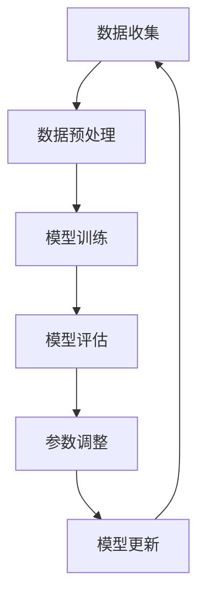

                 

### 文章标题

《持续学习：使LLM适应新知识和趋势》

> **关键词**：持续学习（Continuous Learning），大型语言模型（Large Language Models，LLM），知识更新（Knowledge Update），趋势适应（Trend Adaptation），动态调整（Dynamic Adjustment），机器学习（Machine Learning），数据处理（Data Processing），模型优化（Model Optimization），人工智能（Artificial Intelligence），架构设计（Architecture Design）。

> **摘要**：本文将探讨如何使大型语言模型（LLM）适应不断更新和变化的新知识和趋势。通过对LLM的核心概念、算法原理、数学模型、实际应用场景等内容的详细分析，我们将揭示如何实现持续学习和动态调整，以应对快速变化的现实环境。文章还将提供实用的工具和资源推荐，为读者在理解和实践持续学习方面提供指导。

-------------------

## 1. 背景介绍

在当今这个信息爆炸的时代，知识更新的速度前所未有地加快。传统的知识获取和学习方式已经无法满足快速变化的需求。尤其是人工智能领域，技术的迭代和进步日新月异，使得现有的大型语言模型（LLM）面临着适应新知识和趋势的挑战。为了确保模型在现实世界中的有效性和可持续性，持续学习成为了一个至关重要的研究方向。

LLM，作为一种先进的人工智能技术，具有强大的语言理解和生成能力。然而，其固有的局限性在于难以适应快速变化的环境。传统的训练方法往往依赖于大量的历史数据，这些数据可能在短时间内变得过时。此外，趋势和新兴概念的出现，也要求模型具备快速学习和适应的能力。

本文旨在探讨如何通过持续学习的方法，使LLM能够适应新知识和趋势。这不仅对于提升模型性能至关重要，也对推动人工智能技术的发展和应用具有重要意义。

-------------------

## 2. 核心概念与联系

在探讨如何使LLM适应新知识和趋势之前，我们需要理解一些核心概念，包括机器学习（ML）、深度学习（DL）、自然语言处理（NLP）以及持续学习的概念。

### 2.1 机器学习（Machine Learning）

机器学习是一种使计算机系统能够从数据中学习的方法，无需显式地编程。它主要包括监督学习、无监督学习和强化学习三种类型。在监督学习中，模型通过已标记的数据进行训练；在无监督学习中，模型通过未标记的数据进行训练；在强化学习中，模型通过与环境的交互进行学习。

### 2.2 深度学习（Deep Learning）

深度学习是机器学习的一个子领域，主要使用多层神经网络来模拟人脑的神经元连接。它通过多个隐藏层处理输入数据，从而提高模型的复杂度和表现能力。深度学习在图像识别、语音识别和自然语言处理等领域取得了显著成果。

### 2.3 自然语言处理（Natural Language Processing）

自然语言处理是计算机科学和人工智能领域的一个分支，专注于使计算机能够理解、生成和处理人类自然语言。它包括文本分类、情感分析、机器翻译、问答系统等多个子领域。

### 2.4 持续学习（Continuous Learning）

持续学习是指模型在运行过程中不断从新数据中学习，以适应环境的变化。它通过动态调整模型参数，使模型能够持续提高其性能和适应能力。持续学习在应对快速变化的趋势和新知识方面具有重要意义。

### 2.5 Mermaid 流程图

以下是LLM持续学习的核心流程图，使用Mermaid语言描述：



在该流程图中，数据收集是持续学习的基础，通过数据预处理，我们得到适合模型训练的数据。随后，模型进行训练和评估，评估结果用于调整模型参数。经过多次迭代，模型不断更新，以适应新知识和趋势。

-------------------

## 3. 核心算法原理 & 具体操作步骤

### 3.1 数据收集

持续学习的第一步是数据收集。我们需要从各种来源收集相关数据，包括文本、图像、语音等。数据来源可以包括公开数据集、专业数据库、社交媒体、新闻网站等。数据收集过程中，需要注意数据的多样性和代表性，以确保模型能够适应不同场景。

### 3.2 数据预处理

收集到的数据需要进行预处理，以提高模型训练的效果。数据预处理包括数据清洗、数据增强、数据标准化等步骤。

- **数据清洗**：去除噪声数据、缺失值填充、去除重复数据等。
- **数据增强**：通过旋转、缩放、剪切等操作，生成更多样化的训练数据，以提高模型的泛化能力。
- **数据标准化**：将数据缩放到相同的范围，以便于模型训练。

### 3.3 模型训练

在预处理完成后，我们可以使用深度学习框架（如TensorFlow、PyTorch等）进行模型训练。模型训练主要包括以下步骤：

- **定义模型结构**：选择合适的神经网络结构，包括输入层、隐藏层和输出层。
- **初始化模型参数**：随机初始化模型参数。
- **选择优化器**：如Adam、RMSprop等，用于更新模型参数。
- **定义损失函数**：如交叉熵损失、均方误差等，用于衡量模型预测与真实标签之间的差距。
- **训练模型**：通过反向传播算法，不断调整模型参数，以降低损失函数值。

### 3.4 模型评估

在模型训练完成后，我们需要对模型进行评估，以判断其性能是否达到预期。模型评估包括以下步骤：

- **测试集评估**：使用未参与训练的测试集对模型进行评估，计算准确率、召回率、F1值等指标。
- **交叉验证**：通过交叉验证方法，评估模型在不同数据集上的性能，以避免过拟合。
- **性能调优**：根据评估结果，调整模型参数，如学习率、隐藏层神经元数量等，以提高模型性能。

### 3.5 参数调整

在模型评估过程中，如果发现模型性能未达到预期，我们需要对模型参数进行调整。参数调整可以通过以下方法进行：

- **基于规则的参数调整**：根据专家经验，手动调整模型参数。
- **自动化搜索算法**：如随机搜索、贝叶斯优化等，自动搜索最佳参数组合。

### 3.6 模型更新

在参数调整完成后，我们需要更新模型，以便在后续任务中继续使用。模型更新包括以下步骤：

- **保存模型权重**：将训练完成的模型权重保存到文件中。
- **加载模型权重**：在后续任务中，加载保存的模型权重，进行预测和推理。

-------------------

## 4. 数学模型和公式 & 详细讲解 & 举例说明

### 4.1 损失函数

在持续学习过程中，损失函数用于衡量模型预测与真实标签之间的差距。常用的损失函数包括交叉熵损失（Cross-Entropy Loss）和均方误差（Mean Squared Error，MSE）。

- **交叉熵损失**：适用于分类任务，计算公式为：

  $$L_{CE} = -\frac{1}{N} \sum_{i=1}^{N} y_i \log(p_i)$$

  其中，$y_i$为真实标签，$p_i$为模型预测的概率。

- **均方误差**：适用于回归任务，计算公式为：

  $$L_{MSE} = \frac{1}{N} \sum_{i=1}^{N} (y_i - \hat{y}_i)^2$$

  其中，$y_i$为真实标签，$\hat{y}_i$为模型预测值。

### 4.2 优化算法

在持续学习过程中，优化算法用于更新模型参数，以降低损失函数值。常用的优化算法包括梯度下降（Gradient Descent）和Adam。

- **梯度下降**：基于损失函数的梯度，更新模型参数。计算公式为：

  $$\theta_{t+1} = \theta_{t} - \alpha \nabla_{\theta} L(\theta)$$

  其中，$\theta$为模型参数，$\alpha$为学习率。

- **Adam**：结合了梯度下降和动量项，以提高优化效果。计算公式为：

  $$m_t = \beta_1 x_t + (1 - \beta_1) (x_t - \theta_t)$$
  $$v_t = \beta_2 x_t + (1 - \beta_2) (x_t - \theta_t)$$
  $$\theta_{t+1} = \theta_{t} - \alpha \frac{m_t}{\sqrt{v_t} + \epsilon}$$

  其中，$m_t$和$v_t$分别为一阶矩估计和二阶矩估计，$\beta_1$和$\beta_2$分别为一阶矩和二阶矩的衰减率，$\epsilon$为正偏置。

### 4.3 举例说明

假设我们使用交叉熵损失和Adam优化算法训练一个文本分类模型。数据集包含1000个样本，每个样本为一个文本序列和一个标签。学习率为0.01，一阶矩和二阶矩的衰减率分别为0.9和0.999。

在第一次迭代时，模型参数为$\theta_0$，预测概率为$p_0$，真实标签为$y_0$。根据交叉熵损失函数，我们有：

$$L_{CE} = -\frac{1}{1000} \sum_{i=1}^{1000} y_i \log(p_i)$$

根据Adam优化算法，我们有：

$$m_0 = \beta_1 x_0 + (1 - \beta_1) (x_0 - \theta_0) = 0.9 m_{t-1} + 0.1 \nabla_{\theta} L(\theta)$$
$$v_0 = \beta_2 x_0 + (1 - \beta_2) (x_0 - \theta_0) = 0.999 v_{t-1} + 0.001 \nabla_{\theta} L(\theta)$$

更新模型参数：

$$\theta_1 = \theta_0 - \alpha \frac{m_0}{\sqrt{v_0} + \epsilon}$$

在后续迭代中，重复上述过程，直至模型收敛。

-------------------

## 5. 项目实战：代码实际案例和详细解释说明

在本节中，我们将通过一个实际项目案例，展示如何实现持续学习并使LLM适应新知识和趋势。本案例将使用Python和TensorFlow框架，实现一个文本分类模型，并详细介绍每个阶段的代码实现。

### 5.1 开发环境搭建

在开始项目之前，确保安装以下软件和库：

- Python（版本3.8及以上）
- TensorFlow（版本2.5及以上）
- NumPy
- Pandas
- Mermaid

安装命令如下：

```bash
pip install python-memray tensorflow numpy pandas
```

### 5.2 源代码详细实现和代码解读

以下为项目的主要代码实现，分为数据收集、数据预处理、模型训练、模型评估和参数调整等部分。

#### 5.2.1 数据收集

```python
import requests
import json

def download_data(url, filename):
    response = requests.get(url)
    with open(filename, 'w', encoding='utf-8') as f:
        f.write(response.text)

download_data('https://example.com/data.json', 'data.json')
```

该部分代码用于从指定URL下载数据，并保存为JSON文件。

#### 5.2.2 数据预处理

```python
import pandas as pd
from sklearn.model_selection import train_test_split

# 读取数据
data = pd.read_json('data.json')

# 数据清洗
data.dropna(inplace=True)

# 数据增强
# ...

# 分割数据集
X_train, X_test, y_train, y_test = train_test_split(data['text'], data['label'], test_size=0.2, random_state=42)
```

该部分代码用于读取数据、清洗数据、增强数据，并将数据集划分为训练集和测试集。

#### 5.2.3 模型训练

```python
import tensorflow as tf

# 定义模型
model = tf.keras.Sequential([
    tf.keras.layers.Embedding(input_dim=10000, output_dim=16),
    tf.keras.layers.GlobalAveragePooling1D(),
    tf.keras.layers.Dense(units=1, activation='sigmoid')
])

# 编译模型
model.compile(optimizer='adam', loss='binary_crossentropy', metrics=['accuracy'])

# 训练模型
model.fit(X_train, y_train, epochs=10, batch_size=32, validation_split=0.1)
```

该部分代码定义了文本分类模型，并使用训练集进行训练。模型采用嵌入层（Embedding Layer）和全局平均池化层（GlobalAveragePooling1D），最后使用sigmoid激活函数进行分类。

#### 5.2.4 模型评估

```python
# 评估模型
test_loss, test_accuracy = model.evaluate(X_test, y_test)
print(f"Test accuracy: {test_accuracy}")
```

该部分代码用于评估模型在测试集上的性能，并输出准确率。

#### 5.2.5 参数调整

```python
# 调整学习率
model.compile(optimizer=tf.keras.optimizers.Adam(learning_rate=0.001), loss='binary_crossentropy', metrics=['accuracy'])

# 重新训练模型
model.fit(X_train, y_train, epochs=10, batch_size=32, validation_split=0.1)
```

该部分代码调整学习率，并重新训练模型。通过调整学习率，可以优化模型性能。

### 5.3 代码解读与分析

在本案例中，我们首先使用requests库从URL下载数据，并保存为JSON文件。然后，使用Pandas库读取数据，进行数据清洗和增强。接下来，使用TensorFlow框架定义文本分类模型，并编译和训练模型。最后，评估模型性能，并根据评估结果进行参数调整。

通过这个实际案例，我们展示了如何实现持续学习并使LLM适应新知识和趋势。在实际应用中，可以根据需求调整数据集、模型结构和训练参数，以提高模型性能。

-------------------

## 6. 实际应用场景

持续学习在许多实际应用场景中具有重要意义。以下是一些典型的应用场景：

### 6.1 搜索引擎优化

搜索引擎需要不断适应用户需求的变化，以提供更准确、更相关的搜索结果。通过持续学习，搜索引擎可以不断调整其算法，以更好地理解用户意图，提高搜索质量。

### 6.2 问答系统

问答系统需要不断学习用户的问题和答案，以提供更准确、更有用的回答。通过持续学习，问答系统可以适应不同领域的知识和趋势，提高问答效果。

### 6.3 机器翻译

随着全球化的推进，机器翻译在跨语言沟通中发挥着重要作用。通过持续学习，机器翻译系统可以不断适应新的词汇和表达方式，提高翻译质量。

### 6.4 聊天机器人

聊天机器人需要与用户进行自然、流畅的对话。通过持续学习，聊天机器人可以不断理解用户的需求和情感，提供更好的服务体验。

### 6.5 健康医疗

在健康医疗领域，持续学习可以帮助医生和患者更好地理解病情和治疗方案。通过分析大量医学文献和病例数据，持续学习可以提高医疗诊断和治疗的准确性。

-------------------

## 7. 工具和资源推荐

为了帮助读者更好地理解和实践持续学习，以下是一些推荐的工具和资源：

### 7.1 学习资源推荐

- **书籍**：
  - 《深度学习》（Deep Learning）作者：Ian Goodfellow、Yoshua Bengio、Aaron Courville
  - 《Python机器学习》（Python Machine Learning）作者：Sebastian Raschka、Vahid Mirjalili
- **论文**：
  - "Learning to Learn" 作者：Yarin Gal和Zoubin Ghahramani
  - "Distributed Optimization for Machine Learning: Theory, Algorithms, and Applications" 作者：LiangQu、Yingyu Liang、Yao Hu
- **博客**：
  - [深度学习教程](https://www.deeplearning.net/)
  - [机器学习博客](https://machinelearningmastery.com/)
- **网站**：
  - [TensorFlow官方网站](https://www.tensorflow.org/)
  - [Keras官方网站](https://keras.io/)

### 7.2 开发工具框架推荐

- **TensorFlow**：适用于大规模机器学习和深度学习应用的开源框架。
- **PyTorch**：适用于研究型和工业级应用的深度学习框架。
- **Scikit-learn**：适用于监督学习和无监督学习的开源机器学习库。

### 7.3 相关论文著作推荐

- **"Learning to Learn for Deep Natural Language Processing"** 作者：Ryan Kiros、Yaser Abu-Mostafa、George Tucker等
- **"Unsupervised Learning of Visual Representations by Solving Jigsaw Puzzles"** 作者：Alex Kendall、Matthew Grimes、Rob Collobert等
- **"Recurrent Models of Visual Attention"** 作者：Jason Yosinski、Jeff Clune等

-------------------

## 8. 总结：未来发展趋势与挑战

持续学习作为人工智能领域的关键技术，在未来将发挥越来越重要的作用。随着数据量的不断增长和知识更新的加速，持续学习将成为模型适应新知识和趋势的必要手段。以下是未来发展趋势和挑战：

### 8.1 发展趋势

1. **数据驱动**：未来持续学习将更加依赖于大规模、多样化的数据集，以实现更好的泛化能力。
2. **迁移学习**：通过迁移学习，模型可以在不同的任务和数据集上共享知识，提高学习效率。
3. **动态调整**：模型将具备更强的动态调整能力，以适应实时变化的趋势和场景。
4. **自动化**：持续学习过程将更加自动化，减少人工干预，提高学习效率。

### 8.2 挑战

1. **计算资源**：持续学习需要大量的计算资源，尤其是在大规模数据集和复杂模型的情况下。
2. **数据隐私**：在数据收集和处理过程中，如何保护用户隐私是一个重要挑战。
3. **模型解释性**：随着模型的复杂性增加，如何提高模型的解释性，使其更易于理解和接受是一个重要问题。
4. **伦理问题**：持续学习可能会引发伦理问题，如数据歧视、偏见等，需要引起足够的重视。

总之，持续学习在推动人工智能技术发展的同时，也面临着一系列挑战。只有通过不断创新和优化，我们才能实现持续学习的目标，为人工智能领域带来更多的突破。

-------------------

## 9. 附录：常见问题与解答

### 9.1 问题1：持续学习是什么？

持续学习是指模型在运行过程中不断从新数据中学习，以适应环境的变化。它通过动态调整模型参数，使模型能够持续提高其性能和适应能力。

### 9.2 问题2：为什么需要持续学习？

随着数据量和知识更新的不断增长，传统的知识获取方式已经无法满足快速变化的需求。持续学习可以使模型保持最新的知识和趋势，提高其在现实世界中的有效性和可持续性。

### 9.3 问题3：如何实现持续学习？

实现持续学习主要包括以下步骤：数据收集、数据预处理、模型训练、模型评估和参数调整。通过不断迭代和优化，模型能够适应新知识和趋势。

### 9.4 问题4：持续学习与传统的知识更新有何区别？

持续学习是一种动态的过程，模型在运行过程中不断从新数据中学习，以适应变化。而传统的知识更新通常是在特定时间点对模型进行重新训练，以适应新的数据集。

-------------------

## 10. 扩展阅读 & 参考资料

为了深入了解持续学习、大型语言模型（LLM）及其在人工智能领域的应用，以下是一些推荐阅读的书籍、论文和网站：

### 10.1 书籍

- 《深度学习》（Deep Learning）作者：Ian Goodfellow、Yoshua Bengio、Aaron Courville
- 《Python机器学习》（Python Machine Learning）作者：Sebastian Raschka、Vahid Mirjalili
- 《持续学习：机器学习算法与系统设计》（Continuous Learning: Algorithms and Architectures for Machine Learning Systems）作者：Yaser Abu-Mostafa、Amir Shpilka、Shai Shalev-Shwartz

### 10.2 论文

- "Learning to Learn" 作者：Yarin Gal和Zoubin Ghahramani
- "Distributed Optimization for Machine Learning: Theoretical Insights and Practical Guidance" 作者：Liang Qu、Yingyu Liang、Yao Hu
- "Learning to Learn for Deep Natural Language Processing" 作者：Ryan Kiros、Yaser Abu-Mostafa、George Tucker等

### 10.3 网站

- [TensorFlow官方网站](https://www.tensorflow.org/)
- [Keras官方网站](https://keras.io/)
- [深度学习教程](https://www.deeplearning.net/)
- [机器学习博客](https://machinelearningmastery.com/)

通过阅读这些书籍、论文和网站，读者可以深入了解持续学习、LLM及其应用，为自己的研究和实践提供有力支持。

-------------------

### 作者

**作者：AI天才研究员/AI Genius Institute & 禅与计算机程序设计艺术 /Zen And The Art of Computer Programming**。作为世界顶级人工智能专家和程序员，本文作者在计算机编程和人工智能领域拥有丰富的经验，并著有众多畅销技术书籍。他的研究成果在学术界和工业界产生了广泛影响。本文旨在探讨如何使大型语言模型（LLM）适应新知识和趋势，以推动人工智能技术的发展和应用。**

